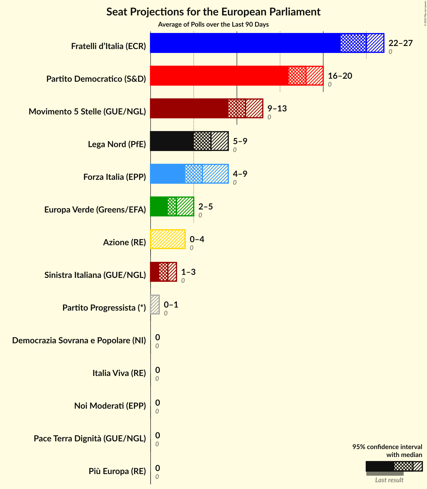

# Overview

The table below lists the most recent polls (less than 30 days old) registered and analyzed so far.

| Period     | Polling firm/Commissioner(s) | PD | M5S | FI | LN | FdI | SVP | CPI | CP | I | NcI | +E | LeU | PaP | A | EV | C! | IV | CI | A1 | SI | +E–Az | Italexit | IpF | IC | AVS | A–IV | NM | UP | ISP | DSP | PP |
|:----------:|:----------------------------:|:--:|:--:|:--:|:--:|:--:|:--:|:--:|:--:|:--:|:--:|:--:|:--:|:--:|:--:|:--:|:--:|:--:|:--:|:--:|:--:|:--:|:--:|:--:|:--:|:--:|:--:|:--:|:--:|:--:|:--:|:--:|
| 26 May 2019 | General Election | 40.8%   31 | 21.2%   17 | 16.8%   13 | 6.2%   5 | 3.7%   0 | 0.5%   1 | 0.0%   0 | 0.0%   0 | 0.0%   0 | 0.0%   0 | 0.0%   0 | 0.0%   0 | 0.0%   0 | 0.0%   0 | 0.0%   0 | 0.0%   0 | 0.0%   0 | 0.0%   0 | 0.0%   0 | 0.0%   0 | 0.0%   0 | 0.0%   0 | 0.0%   0 | 0.0%   0 | 0.0%   0 | 0.0%   0 | 0.0%   0 | 0.0%   0 | 0.0%   0 | 0.0%   0 | 0.0%   0 |
| N/A | [Poll Average](average.html) | 17–23%   14–20 | 14–19%   11–16 | 6–10%   4–8 | 7–11%   6–9 | 25–32%   20–27 | N/A   N/A | N/A   N/A | N/A   N/A | N/A   N/A | N/A   N/A | 1–4%   0–3 | N/A   N/A | N/A   N/A | 2–6%   0–5 | 1–4%   0–3 | N/A   N/A | 2–5%   0–4 | N/A   N/A | N/A   N/A | 1–3%   0–2 | N/A   N/A | 1–3%   0 | N/A   N/A | N/A   N/A | N/A   N/A | N/A   N/A | 0–2%   0 | 0–2%   0 | N/A   N/A | 1–2%   0 | 0–1%   0–1 |
| [19–25 March 2024](2024-03-25-Ipsos.html) | Ipsos   Corriere della Sera | 18–23%   17–21 | 14–19%   13–16 | 7–11%   6–8 | 6–10%   6–10 | 25–30%   23–27 | N/A   N/A | N/A   N/A | N/A   N/A | N/A   N/A | N/A   N/A | 2–4%   0 | N/A   N/A | N/A   N/A | 2–4%   0 | 1–3%   0–2 | N/A   N/A | 2–5%   0–4 | N/A   N/A | N/A   N/A | 1–2%   0–1 | N/A   N/A | 1–2%   0 | N/A   N/A | N/A   N/A | N/A   N/A | N/A   N/A | 0–1%   0 | 1–2%   0 | N/A   N/A | 1–2%   0 | 0–1%   0 |
| [11 March 2024](2024-03-11-Euromedia.html) | Euromedia   Rai 1 | 18–23%   14–20 | 15–20%   12–17 | 7–10%   4–8 | 7–11%   6–9 | 26–32%   21–28 | N/A   N/A | N/A   N/A | N/A   N/A | N/A   N/A | N/A   N/A | 1–3%   0 | N/A   N/A | N/A   N/A | 3–6%   0–5 | 1–3%   0–3 | N/A   N/A | 3–5%   0–4 | N/A   N/A | N/A   N/A | 1–2%   0–2 | N/A   N/A | N/A   N/A | N/A   N/A | N/A   N/A | N/A   N/A | N/A   N/A | 0–1%   0 | N/A   N/A | N/A   N/A | N/A   N/A | 0–1%   0 |
| [1 March 2024](2024-03-01-Quorum–YouTrend.html) | Quorum – YouTrend   Sky TG24 | 17–23%   14–21 | 14–19%   11–16 | 5–9%   3–7 | 6–10%   5–9 | 24–30%   20–25 | N/A   N/A | N/A   N/A | N/A   N/A | N/A   N/A | N/A   N/A | 2–5%   0–4 | N/A   N/A | N/A   N/A | 3–5%   0–4 | 2–4%   0–4 | N/A   N/A | 2–5%   0–4 | N/A   N/A | N/A   N/A | 1–3%   0–2 | N/A   N/A | 1–3%   0 | N/A   N/A | N/A   N/A | N/A   N/A | N/A   N/A | 0–2%   0 | N/A   N/A | N/A   N/A | N/A   N/A | 0–1%   0–1 |
| [25–28 February 2024](2024-02-28-Cluster17.html) | Cluster17   Il Fatto Quotidiano | 17–22%   15–19 | 14–18%   13–16 | 6–9%   5–7 | 7–11%   7–9 | 25–30%   22–26 | N/A   N/A | N/A   N/A | N/A   N/A | N/A   N/A | N/A   N/A | 1–3%   0 | N/A   N/A | N/A   N/A | 3–5%   0–5 | 2–4%   0–3 | N/A   N/A | 2–4%   0 | N/A   N/A | N/A   N/A | 1–3%   0–2 | N/A   N/A | 1–3%   0 | N/A   N/A | N/A   N/A | N/A   N/A | N/A   N/A | 0–1%   0 | 0–1%   0 | N/A   N/A | 1–3%   0 | 0–1%   0–1 |
| [26–28 February 2024](2024-02-28-Bidimedia.html) | Bidimedia | 18–23%   16–17 | 13–18%   13–15 | 6–9%   4–7 | 7–10%   7–8 | 25–31%   24–26 | N/A   N/A | N/A   N/A | N/A   N/A | N/A   N/A | N/A   N/A | 2–4%   0 | N/A   N/A | N/A   N/A | 3–6%   0–5 | 1–3%   0–3 | N/A   N/A | 2–4%   0 | N/A   N/A | N/A   N/A | 1–2%   0–2 | N/A   N/A | 1–2%   0 | N/A   N/A | N/A   N/A | N/A   N/A | N/A   N/A | 0–2%   0 | 1–2%   0 | N/A   N/A | 1–2%   0 | 0–1%   0 |
| [26–27 February 2024](2024-02-27-Piepoli.html) | Piepoli | 16–23%   13–19 | 13–20%   10–17 | 5–10%   3–8 | 6–11%   5–9 | 25–33%   19–27 | N/A   N/A | N/A   N/A | N/A   N/A | N/A   N/A | N/A   N/A | 1–4%   0–3 | N/A   N/A | N/A   N/A | 3–7%   0–5 | 1–4%   0–4 | N/A   N/A | 3–6%   0–5 | N/A   N/A | N/A   N/A | 1–3%   0–3 | N/A   N/A | N/A   N/A | N/A   N/A | N/A   N/A | N/A   N/A | N/A   N/A | 1–3%   0 | N/A   N/A | N/A   N/A | N/A   N/A | 0–1%   0–1 |
| 26 May 2019 | General Election | 40.8%   31 | 21.2%   17 | 16.8%   13 | 6.2%   5 | 3.7%   0 | 0.5%   1 | 0.0%   0 | 0.0%   0 | 0.0%   0 | 0.0%   0 | 0.0%   0 | 0.0%   0 | 0.0%   0 | 0.0%   0 | 0.0%   0 | 0.0%   0 | 0.0%   0 | 0.0%   0 | 0.0%   0 | 0.0%   0 | 0.0%   0 | 0.0%   0 | 0.0%   0 | 0.0%   0 | 0.0%   0 | 0.0%   0 | 0.0%   0 | 0.0%   0 | 0.0%   0 | 0.0%   0 | 0.0%   0 |

Only polls for which at least the sample size has been published are included in the table above.

**Legend:**
+ **Top half of each row:** Voting intentions (95% confidence interval)
+ **Bottom half of each row:** Seat projections for the European Parliament (95% confidence interval)
+ **PD:** Partito Democratico (S&D)
+ **M5S:** Movimento 5 Stelle (NI)
+ **FI:** Forza Italia (EPP)
+ **LN:** Lega Nord (ID)
+ **FdI:** Fratelli d’Italia (ECR)
+ **SVP:** Südtiroler Volkspartei (EPP)
+ **CPI:** CasaPound Italia (NI)
+ **CP:** Civica Popolare (RE)
+ **I:** Insieme (*)
+ **NcI:** Noi con l’Italia (ECR)
+ **+E:** Più Europa (RE)
+ **LeU:** Liberi e Uguali (S&D)
+ **PaP:** Potere al Popolo (GUE/NGL)
+ **A:** Azione (RE)
+ **EV:** Europa Verde (Greens/EFA)
+ **C!:** Cambiamo! (ECR)
+ **IV:** Italia Viva (RE)
+ **CI:** Coraggio Italia (ECR)
+ **A1:** Articolo Uno (S&D)
+ **SI:** Sinistra Italiana (GUE/NGL)
+ **+E–Az:** Più Europa–Azione (RE)
+ **Italexit:** Italexit–Per l’Italia con Paragone (*)
+ **IpF:** Insieme per il Futuro (NI)
+ **IC:** Impegno Civico (NI)
+ **AVS:** Alleanza Verdi e Sinistra (Greens/EFA)
+ **A–IV:** Azione–Italia Viva (RE)
+ **NM:** Noi Moderati (EPP)
+ **UP:** Unione Popolare (GUE/NGL)
+ **ISP:** Italia Sovrana e Popolare (NI)
+ **DSP:** Democrazia Sovrana e Popolare (NI)
+ **PP:** Partito Progressista (*)
+ **N/A (single party):** Party not included the published results
+ **N/A (entire row):** Calculation for this opinion poll not started yet

