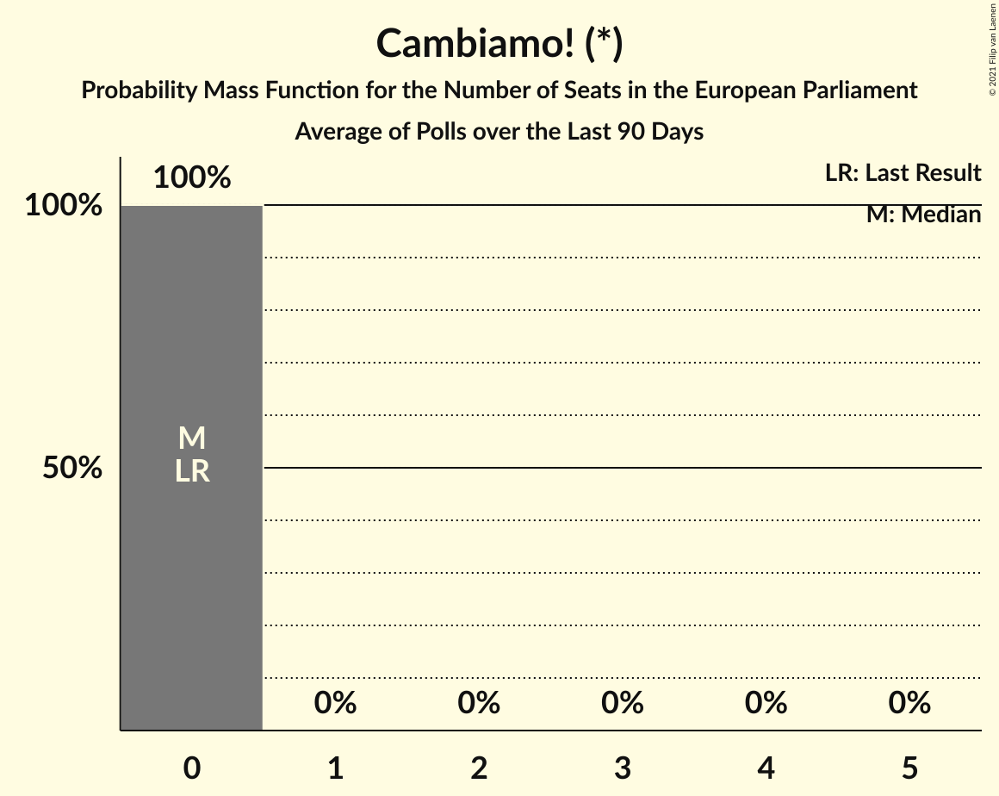

# Cambiamo! (*)

<a href="#voting-intentions">Voting Intentions</a> | <a href="#seats">Seats</a>

## Voting Intentions

Last result: **0.0%** (General Election of 26 May 2019)

### Confidence Intervals

| Period     | Polling firm/Commissioner(s) | Median | 80% Confidence Interval | 90% Confidence Interval | 95% Confidence Interval | 99% Confidence Interval |
|:----------:|:----------------:|:-----------:|:-----------------------:|:-----------------------:|:-----------------------:|:-----------------------:|
| N/A | [Poll Average](average.html) | 0.9% | 0.4–1.6% | 0.3–1.8% | 0.3–2.0% | 0.2–2.4% |
| [23–24 January 2020](2020-01-24-Tecnè.html) | Tecnè   Agenzia Dire | 0.0% | N/A | N/A | N/A | N/A |
| [21–22 January 2020](2020-01-22-TermometroPolitico.html) | Termometro Politico   La7 | 0.6% | 0.4–0.8% | 0.4–0.9% | 0.3–1.0% | 0.3–1.1% |
| [22 January 2020](2020-01-22-Index.html) | Index | 0.9% | 0.6–1.5% | 0.5–1.6% | 0.4–1.8% | 0.3–2.1% |
| [20–21 January 2020](2020-01-21-Ixè.html) | Ixè   Rai 3 | 0.6% | 0.4–1.1% | 0.3–1.2% | 0.3–1.3% | 0.2–1.6% |
| [19–20 January 2020](2020-01-20-Tecnè.html) | Tecnè   RTI | 0.0% | N/A | N/A | N/A | N/A |
| [15–20 January 2020](2020-01-20-SWG.html) | SWG   La7 | 1.2% | 0.9–1.6% | 0.8–1.8% | 0.8–1.9% | 0.6–2.1% |
| [10–17 January 2020](2020-01-17-Tecnè.html) | Tecnè   Agenzia Dire | 0.0% | N/A | N/A | N/A | N/A |
| [15–16 January 2020](2020-01-16-TermometroPolitico.html) | Termometro Politico   La7 | 0.5% | 0.4–0.8% | 0.3–0.9% | 0.3–0.9% | 0.2–1.1% |
| [14–16 January 2020](2020-01-16-BiDiMedia.html) | BiDiMedia | 0.7% | 0.5–1.1% | 0.4–1.2% | 0.4–1.3% | 0.3–1.5% |
| [15 January 2020](2020-01-15-Index.html) | Index | 0.9% | 0.6–1.5% | 0.5–1.6% | 0.4–1.8% | 0.3–2.1% |
| [13–14 January 2020](2020-01-14-Ixè.html) | Ixè   Rai 3 | 0.8% | 0.5–1.3% | 0.5–1.4% | 0.4–1.6% | 0.3–1.9% |
| [14 January 2020](2020-01-14-EMG.html) | EMG   Rai 3 | 1.1% | 0.9–1.5% | 0.8–1.7% | 0.7–1.8% | 0.6–2.0% |
| [12–13 January 2020](2020-01-13-Tecnè.html) | Tecnè   RTI | 0.0% | N/A | N/A | N/A | N/A |
| [8–13 January 2020](2020-01-13-SWG.html) | SWG   La7 | 1.0% | 0.7–1.4% | 0.7–1.5% | 0.6–1.6% | 0.5–1.9% |
| [13 January 2019–13 January 2020](2020-01-13-Euromedia.html) | Euromedia   Rai 1 | 0.4% | 0.2–0.8% | 0.2–1.0% | 0.1–1.1% | 0.1–1.4% |
| [9–10 January 2020](2020-01-10-Tecnè.html) | Tecnè   Agenzia Dire | 0.0% | N/A | N/A | N/A | N/A |
| [8–10 January 2020](2020-01-10-Piepoli.html) | Piepoli   Rai 2 | 0.0% | N/A | N/A | N/A | N/A |
| [8–9 January 2020](2020-01-09-TermometroPolitico.html) | Termometro Politico   La7 | 0.4% | 0.3–0.6% | 0.3–0.6% | 0.2–0.7% | 0.2–0.8% |
| [9 January 2020](2020-01-09-Index.html) | Index   La7 | 1.0% | 0.7–1.6% | 0.6–1.8% | 0.5–2.0% | 0.4–2.3% |
| [8 January 2020](2020-01-08-NotoSondaggi.html) | Noto Sondaggi   Rai 1 | 1.5% | 1.1–2.1% | 1.0–2.3% | 0.9–2.5% | 0.7–2.8% |
| [7–8 January 2020](2020-01-08-EMG.html) | EMG   Rai 3 | 1.0% | 0.7–1.4% | 0.7–1.5% | 0.6–1.6% | 0.5–1.8% |
| [3–7 January 2020](2020-01-07-Ixè.html) | Ixè   Rai 3 | 1.0% | 0.7–1.5% | 0.6–1.7% | 0.5–1.8% | 0.4–2.1% |
| [20–24 December 2019](2019-12-24-MGResearch.html) | MG Research | 0.0% | N/A | N/A | N/A | N/A |
| [22–23 December 2019](2019-12-23-Tecnè.html) | Tecnè   TGcom24 | 0.0% | N/A | N/A | N/A | N/A |
| [18–23 December 2019](2019-12-23-SWG.html) | SWG   La7 | 1.0% | 0.7–1.4% | 0.7–1.5% | 0.6–1.6% | 0.5–1.9% |
| [19–20 December 2019](2019-12-20-Tecnè.html) | Tecnè   Agenzia Dire | 0.0% | N/A | N/A | N/A | N/A |
| [18–19 December 2019](2019-12-19-TermometroPolitico.html) | Termometro Politico   La7 | 0.4% | 0.3–0.6% | 0.2–0.7% | 0.2–0.7% | 0.2–0.8% |
| [18–19 December 2019](2019-12-19-Ipsos.html) | Ipsos   Corriere della Sera | 0.0% | N/A | N/A | N/A | N/A |
| [18 December 2019](2019-12-18-Index.html) | Index   La7 | 1.0% | 0.7–1.6% | 0.6–1.8% | 0.5–2.0% | 0.4–2.3% |
| [17–18 December 2019](2019-12-18-EMG.html) | EMG   Rai 3 | 1.0% | 0.7–1.4% | 0.7–1.5% | 0.6–1.6% | 0.5–1.8% |
| [17–18 December 2019](2019-12-18-Demopolis.html) | Demopolis   Rai 3 | 0.0% | N/A | N/A | N/A | N/A |
| [16–17 December 2019](2019-12-17-Ixè.html) | Ixè   Rai 3 | 1.0% | 0.7–1.5% | 0.6–1.7% | 0.5–1.8% | 0.4–2.1% |
| [11–16 December 2019](2019-12-16-SWG.html) | SWG   La7 | 1.0% | 0.7–1.4% | 0.7–1.5% | 0.6–1.6% | 0.5–1.9% |
| [16 December 2019](2019-12-16-Euromedia.html) | Euromedia   Rai 1 | 0.6% | 0.4–1.2% | 0.3–1.3% | 0.3–1.5% | 0.2–1.8% |
| [12–13 December 2019](2019-12-13-Tecnè.html) | Tecnè   Agenzia Dire | 0.0% | N/A | N/A | N/A | N/A |
| [11–13 December 2019](2019-12-13-BiDiMedia.html) | BiDiMedia | 0.8% | 0.5–1.2% | 0.5–1.3% | 0.4–1.4% | 0.4–1.6% |
| [11–12 December 2019](2019-12-12-Tecnè.html) | Tecnè   RTI | 0.0% | N/A | N/A | N/A | N/A |
| [12 December 2019](2019-12-12-NotoSondaggi.html) | Noto Sondaggi   Rai 1 | 1.7% | 1.3–2.4% | 1.2–2.5% | 1.1–2.7% | 0.9–3.1% |
| [1–11 December 2019](2019-12-11-Index.html) | Index   La7 | 1.1% | 0.8–1.8% | 0.7–2.0% | 0.6–2.1% | 0.5–2.5% |
| [10–11 December 2019](2019-12-11-EMG.html) | EMG   Rai 3 | 1.0% | 0.7–1.4% | 0.7–1.5% | 0.6–1.6% | 0.5–1.9% |
| [9–10 December 2019](2019-12-10-Ixè.html) | Ixè   Rai 3 | 0.0% | N/A | N/A | N/A | N/A |
| [8–9 December 2019](2019-12-09-Tecnè.html) | Tecnè   Rete 4 | 0.0% | N/A | N/A | N/A | N/A |
| [4–9 December 2019](2019-12-09-SWG.html) | SWG   La7 | 1.2% | 0.9–1.6% | 0.8–1.8% | 0.8–1.9% | 0.6–2.1% |
| [5–6 December 2019](2019-12-06-Tecnè.html) | Tecnè   Agenzia Dire | 0.0% | N/A | N/A | N/A | N/A |
| [6 December 2019](2019-12-06-NotoSondaggi.html) | Noto Sondaggi   Rai 1 | 1.7% | 1.3–2.4% | 1.2–2.5% | 1.1–2.7% | 0.9–3.1% |
| [2–6 December 2019](2019-12-06-DemosPi.html) | Demos & Pi   La Repubblica | 0.0% | N/A | N/A | N/A | N/A |
| [4 November–5 December 2019](2019-12-05-TermometroPolitico.html) | Termometro Politico   La7 | 0.5% | 0.4–0.8% | 0.3–0.8% | 0.3–0.9% | 0.2–1.0% |
| [1–4 December 2019](2019-12-04-Index.html) | Index   La7 | 1.0% | 0.7–1.6% | 0.6–1.8% | 0.5–2.0% | 0.4–2.3% |
| [1–4 December 2019](2019-12-04-Euromedia.html) | Euromedia   Rai 1 | 0.4% | 0.2–0.8% | 0.2–1.0% | 0.1–1.1% | 0.1–1.4% |
| [3–4 December 2019](2019-12-04-EMG.html) | EMG   Rai 3 | 0.9% | 0.7–1.3% | 0.6–1.4% | 0.6–1.5% | 0.5–1.7% |
| [2–3 December 2019](2019-12-03-Ixè.html) | Ixè   Rai 3 | 0.0% | N/A | N/A | N/A | N/A |
| [1–2 December 2019](2019-12-02-Tecnè.html) | Tecnè   Rete 4 | 0.0% | N/A | N/A | N/A | N/A |
| [27 November–2 December 2019](2019-12-02-SWG.html) | SWG   La7 | 1.0% | 0.7–1.4% | 0.7–1.5% | 0.6–1.6% | 0.5–1.9% |
| [28–29 November 2019](2019-11-29-Tecnè.html) | Tecnè   Agenzia Dire | 0.0% | N/A | N/A | N/A | N/A |
| [27–28 November 2019](2019-11-28-TermometroPolitico.html) | Termometro Politico   La7 | 0.5% | 0.4–0.8% | 0.3–0.9% | 0.3–0.9% | 0.2–1.1% |
| [26–27 November 2019](2019-11-27-Ipsos.html) | Ipsos   Corriere della Sera | 0.0% | N/A | N/A | N/A | N/A |
| [1–27 November 2019](2019-11-27-Index.html) | Index   La7 | 0.0% | N/A | N/A | N/A | N/A |
| [27 November 2019](2019-11-27-EMG.html) | EMG   Rai 3 | 1.0% | 0.7–1.4% | 0.7–1.5% | 0.6–1.6% | 0.5–1.8% |
| [25–26 November 2019](2019-11-26-Ixè.html) | Ixè   Rai 3 | 0.0% | N/A | N/A | N/A | N/A |
| [24–25 November 2019](2019-11-25-Tecnè.html) | Tecnè   Rete 4 | 0.0% | N/A | N/A | N/A | N/A |
| [20–25 November 2019](2019-11-25-SWG.html) | SWG   La7 | 1.3% | 1.0–1.8% | 0.9–1.9% | 0.9–2.1% | 0.7–2.3% |
| [21–22 November 2019](2019-11-22-Tecnè.html) | Tecnè   Agenzia Dire | 0.0% | N/A | N/A | N/A | N/A |
| [21–22 November 2019](2019-11-22-Piepoli.html) | Piepoli   Rai 2 | 0.0% | N/A | N/A | N/A | N/A |
| [20–21 November 2019](2019-11-21-TermometroPolitico.html) | Termometro Politico   La7 | 0.6% | 0.4–0.8% | 0.4–0.9% | 0.3–1.0% | 0.3–1.1% |
| [21 November 2019](2019-11-21-NotoSondaggi.html) | Noto Sondaggi   Rai 1 | 1.7% | 1.3–2.4% | 1.2–2.5% | 1.1–2.7% | 0.9–3.1% |
| [1–20 November 2019](2019-11-20-EMG.html) | EMG   Rai 3 | 0.0% | N/A | N/A | N/A | N/A |
| [18–19 November 2019](2019-11-19-Ixè.html) | Ixè   Rai 3 | 0.7% | 0.5–1.2% | 0.4–1.3% | 0.3–1.4% | 0.2–1.7% |
| [18–19 November 2019](2019-11-19-BiDiMedia.html) | BiDiMedia | 1.0% | 0.7–1.4% | 0.7–1.5% | 0.6–1.6% | 0.5–1.8% |
| [13–18 November 2019](2019-11-18-SWG.html) | SWG   La7 | 1.1% | 0.9–1.6% | 0.8–1.7% | 0.7–1.8% | 0.6–2.0% |
| [14–15 November 2019](2019-11-15-Tecnè.html) | Tecnè   Agenzia Dire | 0.0% | N/A | N/A | N/A | N/A |
| [1–14 November 2019](2019-11-14-Index.html) | Index   La7 | 0.0% | N/A | N/A | N/A | N/A |
| [12–13 November 2019](2019-11-13-TermometroPolitico.html) | Termometro Politico   La7 | 0.5% | 0.4–0.8% | 0.3–0.8% | 0.3–0.9% | 0.2–1.0% |
| [8–13 November 2019](2019-11-13-EMG.html) | EMG   Rai 3 | 0.0% | N/A | N/A | N/A | N/A |
| [11–12 November 2019](2019-11-12-Ixè.html) | Ixè   Rai 3 | 0.8% | 0.5–1.3% | 0.5–1.4% | 0.4–1.6% | 0.3–1.9% |
| [10–12 November 2019](2019-11-12-Demopolis.html) | Demopolis   Rai 3 | 0.0% | N/A | N/A | N/A | N/A |
| [10–11 November 2019](2019-11-11-Tecnè.html) | Tecnè   Rete 4 | 0.0% | N/A | N/A | N/A | N/A |
| [6–11 November 2019](2019-11-11-SWG.html) | SWG   La7 | 1.3% | 1.0–1.8% | 0.9–1.9% | 0.9–2.1% | 0.7–2.3% |
| [1–11 November 2019](2019-11-11-Euromedia.html) | Euromedia   Rai 1 | 0.2% | 0.1–0.7% | 0.1–0.8% | 0.1–0.9% | 0.0–1.2% |
| [8–9 November 2019](2019-11-09-Piepoli.html) | Piepoli   Rai 2 | 0.0% | N/A | N/A | N/A | N/A |
| [7–8 November 2019](2019-11-08-Tecnè.html) | Tecnè   Agenzia Dire | 0.0% | N/A | N/A | N/A | N/A |
| [6–7 November 2019](2019-11-07-TermometroPolitico.html) | Termometro Politico   La7 | 0.6% | 0.4–0.9% | 0.4–1.0% | 0.4–1.0% | 0.3–1.2% |
| [7 November 2019](2019-11-07-Index.html) | Index   La7 | 0.0% | N/A | N/A | N/A | N/A |
| [6 November 2019](2019-11-06-EMG.html) | EMG   Rai 3 | 0.0% | N/A | N/A | N/A | N/A |
| [4–5 November 2019](2019-11-05-Ixè.html) | Ixè   Rai 3 | 0.9% | 0.6–1.4% | 0.5–1.6% | 0.5–1.7% | 0.4–2.0% |
| [4–5 November 2019](2019-11-05-IZI.html) | IZI | 0.0% | N/A | N/A | N/A | N/A |
| [30 October–4 November 2019](2019-11-04-SWG.html) | SWG   La7 | 1.1% | 0.9–1.6% | 0.8–1.7% | 0.7–1.8% | 0.6–2.0% |
| [1–4 November 2019](2019-11-04-Piepoli.html) | Piepoli   Rai 2 | 0.0% | N/A | N/A | N/A | N/A |
| [29–31 October 2019](2019-10-31-Ipsos.html) | Ipsos   Corriere della Sera | 0.0% | N/A | N/A | N/A | N/A |
| [31 October 2019](2019-10-31-Index.html) | Index   La7 | 0.0% | N/A | N/A | N/A | N/A |
| [30–31 October 2019](2019-10-31-Demopolis.html) | Demopolis   Rai 3 | 0.0% | N/A | N/A | N/A | N/A |
| [30 October 2019](2019-10-30-Tecnè.html) | Tecnè | 0.0% | N/A | N/A | N/A | N/A |
| [30 October 2019](2019-10-30-EMG.html) | EMG   Rai 3 | 0.0% | N/A | N/A | N/A | N/A |
| [28–29 October 2019](2019-10-29-Ixè.html) | Ixè   Rai 3 | 1.0% | 0.7–1.5% | 0.6–1.7% | 0.5–1.8% | 0.4–2.1% |
| [27 October 2019](2019-10-27-Tecnè.html) | Tecnè   Rete 4 | 0.0% | N/A | N/A | N/A | N/A |
| [23–27 October 2019](2019-10-27-SWG.html) | SWG   La7 | 1.6% | 1.2–2.1% | 1.2–2.3% | 1.1–2.4% | 0.9–2.6% |
| [24–25 October 2019](2019-10-25-Tecnè.html) | Tecnè   Agenzia Dire | 0.0% | N/A | N/A | N/A | N/A |
| [23–24 October 2019](2019-10-24-TermometroPolitico.html) | Termometro Politico   La7 | 0.5% | 0.4–0.8% | 0.3–0.9% | 0.3–0.9% | 0.2–1.1% |
| [22–24 October 2019](2019-10-24-ScenariPolitici–Winpoll.html) | Scenari Politici–Winpoll | 0.0% | N/A | N/A | N/A | N/A |
| [24 October 2019](2019-10-24-Index.html) | Index   La7 | 0.0% | N/A | N/A | N/A | N/A |
| [23 October 2019](2019-10-23-EMG.html) | EMG   Rai 3 | 0.0% | N/A | N/A | N/A | N/A |
| [22 October 2019](2019-10-22-NotoSondaggi.html) | Noto Sondaggi   Rai 1 | 1.7% | 1.3–2.4% | 1.2–2.5% | 1.1–2.7% | 0.9–3.1% |
| [21–22 October 2019](2019-10-22-Ixè.html) | Ixè   Rai 3 | 1.0% | 0.7–1.5% | 0.6–1.7% | 0.5–1.8% | 0.4–2.1% |
| [20–21 October 2019](2019-10-21-Tecnè.html) | Tecnè   Rete 4 | 0.0% | N/A | N/A | N/A | N/A |
| [16–21 October 2019](2019-10-21-SWG.html) | SWG   La7 | 1.3% | 1.0–1.8% | 0.9–1.9% | 0.9–2.1% | 0.7–2.3% |
| [17–18 October 2019](2019-10-18-Tecnè.html) | Tecnè   Agenzia Dire | 0.0% | N/A | N/A | N/A | N/A |
| [16–17 October 2019](2019-10-17-TermometroPolitico.html) | Termometro Politico   La7 | 0.6% | 0.4–1.0% | 0.4–1.1% | 0.3–1.2% | 0.3–1.3% |
| [17 October 2019](2019-10-17-Index.html) | Index   La7 | 0.0% | N/A | N/A | N/A | N/A |
| [16–17 October 2019](2019-10-17-Euromedia.html) | Euromedia   Rai 1 | 0.2% | 0.1–0.7% | 0.1–0.8% | 0.1–0.9% | 0.0–1.2% |
| [16–17 October 2019](2019-10-17-EMG.html) | EMG   Rai 3 | 0.0% | N/A | N/A | N/A | N/A |
| [14–15 October 2019](2019-10-15-Ixè.html) | Ixè   Rai 3 | 1.1% | 0.8–1.7% | 0.7–1.8% | 0.6–2.0% | 0.5–2.3% |
| [13–14 October 2019](2019-10-14-Tecnè.html) | Tecnè   Rete 4 | 0.0% | N/A | N/A | N/A | N/A |
| [9–14 October 2019](2019-10-14-SWG.html) | SWG   La7 | 1.6% | 1.2–2.1% | 1.2–2.3% | 1.1–2.4% | 0.9–2.6% |
| [10–11 October 2019](2019-10-11-Tecnè.html) | Tecnè   Agenzia Dire | 0.0% | N/A | N/A | N/A | N/A |
| [9–11 October 2019](2019-10-11-Demopolis.html) | Demopolis   Rai 3 | 0.0% | N/A | N/A | N/A | N/A |
| [9–10 October 2019](2019-10-10-TermometroPolitico.html) | Termometro Politico   La7 | 0.5% | 0.3–0.8% | 0.3–0.9% | 0.2–1.0% | 0.2–1.2% |
| [10 October 2019](2019-10-10-NotoSondaggi.html) | Noto Sondaggi   Rai 1 | 1.7% | 1.3–2.4% | 1.2–2.5% | 1.1–2.7% | 0.9–3.1% |
| [9 October 2019](2019-10-09-Index.html) | Index   La7 | 0.0% | N/A | N/A | N/A | N/A |
| [9 October 2019](2019-10-09-EMG.html) | EMG   Rai 3 | 0.0% | N/A | N/A | N/A | N/A |
| [7–9 October 2019](2019-10-09-BiDiMedia.html) | BiDiMedia | 1.3% | 1.0–1.8% | 0.9–1.9% | 0.8–2.1% | 0.7–2.3% |
| [7–8 October 2019](2019-10-08-Ixè.html) | Ixè   Rai 3 | 0.0% | N/A | N/A | N/A | N/A |
| [7–8 October 2019](2019-10-08-Euromedia.html) | Euromedia   Rai 1 | 0.4% | 0.2–0.8% | 0.2–1.0% | 0.1–1.1% | 0.1–1.4% |
| [6–7 October 2019](2019-10-07-Tecnè.html) | Tecnè   Rete 4 | 0.6% | 0.4–1.1% | 0.3–1.2% | 0.3–1.3% | 0.2–1.6% |
| [2–7 October 2019](2019-10-07-SWG.html) | SWG   La7 | 1.6% | 1.2–2.1% | 1.2–2.3% | 1.1–2.4% | 0.9–2.6% |
| [7 October 2019](2019-10-07-Ipsos.html) | Ipsos   La7 | 0.0% | N/A | N/A | N/A | N/A |
| [3–5 October 2019](2019-10-05-Piepoli.html) | Piepoli   Rai 1 | 0.0% | N/A | N/A | N/A | N/A |
| [3–4 October 2019](2019-10-04-Tecnè.html) | Tecnè   Agenzia Dire | 0.0% | N/A | N/A | N/A | N/A |
| [3 October 2019](2019-10-03-Index.html) | Index   La7 | 0.0% | N/A | N/A | N/A | N/A |
| [1–3 October 2019](2019-10-03-DemosPi.html) | Demos & Pi   La Repubblica | 0.0% | N/A | N/A | N/A | N/A |
| [2 October 2019](2019-10-02-EMG.html) | EMG   Rai 3 | 0.0% | N/A | N/A | N/A | N/A |
| [30 September–1 October 2019](2019-10-01-Ixè.html) | Ixè   Rai 3 | 0.0% | N/A | N/A | N/A | N/A |
| [29–30 September 2019](2019-09-30-Tecnè.html) | Tecnè   Rete 4 | 0.7% | 0.5–1.2% | 0.4–1.3% | 0.3–1.4% | 0.2–1.7% |
| [25–30 September 2019](2019-09-30-SWG.html) | SWG   La7 | 1.7% | 1.4–2.3% | 1.3–2.4% | 1.2–2.5% | 1.0–2.8% |
| [20–27 September 2019](2019-09-27-Tecnè.html) | Tecnè   Agenzia Dire | 0.0% | N/A | N/A | N/A | N/A |
| [23–27 September 2019](2019-09-27-GPF.html) | GPF   La Notizia | 0.9% | 0.6–1.4% | 0.5–1.6% | 0.4–1.8% | 0.3–2.1% |
| [25–26 September 2019](2019-09-26-TermometroPolitico.html) | Termometro Politico   La7 | 0.5% | 0.4–0.7% | 0.3–0.8% | 0.3–0.9% | 0.2–1.0% |
| [25–26 September 2019](2019-09-26-Ipsos.html) | Ipsos   Corriere della Sera | 0.0% | N/A | N/A | N/A | N/A |
| [1–25 September 2019](2019-09-25-NotoSondaggi.html) | Noto Sondaggi | 1.5% | 1.1–2.1% | 1.0–2.3% | 0.9–2.5% | 0.7–2.8% |
| [25 September 2019](2019-09-25-EMG.html) | EMG   Rai 3 | 0.0% | N/A | N/A | N/A | N/A |
| [23–24 September 2019](2019-09-24-Ixè.html) | Ixè   Rai 3 | 0.0% | N/A | N/A | N/A | N/A |
| [22–23 September 2019](2019-09-23-Tecnè.html) | Tecnè   Rete 4 | 0.7% | 0.5–1.2% | 0.4–1.3% | 0.3–1.4% | 0.2–1.7% |
| [18–23 September 2019](2019-09-23-SWG.html) | SWG   La7 | 2.0% | 1.6–2.6% | 1.5–2.7% | 1.4–2.9% | 1.2–3.1% |
| [20–22 September 2019](2019-09-22-Piepoli.html) | Piepoli   Rai 1 | 0.0% | N/A | N/A | N/A | N/A |
| [19–20 September 2019](2019-09-20-Tecnè.html) | Tecnè | 0.8% | 0.5–1.3% | 0.4–1.5% | 0.4–1.6% | 0.2–2.0% |
| [18–20 September 2019](2019-09-20-ScenariPolitici–Winpoll.html) | Scenari Politici–Winpoll   Il Sole 24 Ore | 0.0% | N/A | N/A | N/A | N/A |
| [18–20 September 2019](2019-09-20-Quorum–YouTrend.html) | Quorum – YouTrend   Sky Tg24 | 0.8% | 0.5–1.3% | 0.5–1.4% | 0.4–1.6% | 0.3–1.9% |
| [20 September 2019](2019-09-20-IZI.html) | IZI | 0.0% | N/A | N/A | N/A | N/A |
| [17–19 September 2019](2019-09-19-TermometroPolitico.html) | Termometro Politico   La7 | 0.7% | 0.5–1.0% | 0.5–1.1% | 0.4–1.2% | 0.3–1.3% |
| [18–19 September 2019](2019-09-19-Tecnè.html) | Tecnè   Rete 4 | 0.7% | 0.5–1.2% | 0.4–1.3% | 0.3–1.4% | 0.2–1.7% |
| [1–19 September 2019](2019-09-19-IndexResearch.html) | Index Research   La7 | 0.0% | N/A | N/A | N/A | N/A |
| [18–19 September 2019](2019-09-19-Demopolis.html) | Demopolis   Rai 3 | 0.0% | N/A | N/A | N/A | N/A |
| [17–18 September 2019](2019-09-18-Euromedia.html) | Euromedia   Rai 1 | 1.2% | 0.9–1.9% | 0.8–2.1% | 0.7–2.3% | 0.5–2.7% |
| [14–18 September 2019](2019-09-18-BiDiMedia.html) | BiDiMedia | 1.4% | 1.0–1.8% | 1.0–2.0% | 0.9–2.1% | 0.8–2.3% |
| [16–17 September 2019](2019-09-17-Ixè.html) | Ixè   Rai 3 | 0.0% | N/A | N/A | N/A | N/A |
| [17 September 2019](2019-09-17-EMG.html) | EMG   Rai 3 | 1.2% | 0.9–1.6% | 0.8–1.7% | 0.8–1.8% | 0.6–2.0% |
| [15–16 September 2019](2019-09-16-Tecnè.html) | Tecnè   Rete 4 | 0.0% | N/A | N/A | N/A | N/A |
| [11–16 September 2019](2019-09-16-SWG.html) | SWG   La7 | 2.0% | 1.6–2.6% | 1.5–2.7% | 1.4–2.9% | 1.2–3.1% |
| [11–12 September 2019](2019-09-12-TermometroPolitico.html) | Termometro Politico   La7 | 0.6% | 0.4–0.8% | 0.4–0.9% | 0.4–1.0% | 0.3–1.1% |
| [12 September 2019](2019-09-12-Tecnè.html) | Tecnè   Rete 4 | 0.0% | N/A | N/A | N/A | N/A |
| [9–12 September 2019](2019-09-12-ScenariPolitici–Winpoll.html) | Scenari Politici–Winpoll   Il Sole 24 Ore | 0.0% | N/A | N/A | N/A | N/A |
| [10–12 September 2019](2019-09-12-DemosPi.html) | Demos & Pi   La Repubblica | 0.0% | N/A | N/A | N/A | N/A |
| [9–10 September 2019](2019-09-10-NotoSondaggi.html) | Noto Sondaggi | 1.5% | 1.1–2.1% | 1.0–2.3% | 0.9–2.5% | 0.7–2.8% |
| [9–10 September 2019](2019-09-10-Ixè.html) | Ixè   Rai 3 | 0.0% | N/A | N/A | N/A | N/A |
| [9–10 September 2019](2019-09-10-Euromedia.html) | Euromedia | 1.4% | 1.0–2.1% | 0.9–2.3% | 0.8–2.5% | 0.6–2.8% |
| [10 September 2019](2019-09-10-EMG.html) | EMG   Rai 3 | 1.0% | 0.7–1.3% | 0.7–1.4% | 0.6–1.5% | 0.5–1.7% |
| [9–10 September 2019](2019-09-10-Demopolis.html) | Demopolis   Rai 3 | 0.0% | N/A | N/A | N/A | N/A |
| [4–9 September 2019](2019-09-09-SWG.html) | SWG   La7 | 2.3% | 1.8–2.9% | 1.7–3.0% | 1.6–3.2% | 1.4–3.5% |
| [7–9 September 2019](2019-09-09-Piepoli.html) | Piepoli   Rai 1 | 0.0% | N/A | N/A | N/A | N/A |
| [1–6 September 2019](2019-09-06-NotoSondaggi.html) | Noto Sondaggi   Quotidiano Nazionale | 0.0% | N/A | N/A | N/A | N/A |
| [5 September 2019](2019-09-05-Tecnè.html) | Tecnè   Rete 4 | 0.0% | N/A | N/A | N/A | N/A |
| [4–5 September 2019](2019-09-05-GPF.html) | GPF   La Notizia | 0.0% | N/A | N/A | N/A | N/A |
| [4–5 September 2019](2019-09-05-Demopolis.html) | Demopolis   Rai 3 | 0.0% | N/A | N/A | N/A | N/A |
| [2–3 September 2019](2019-09-03-Ixè.html) | Ixè   Rai 3 | 0.0% | N/A | N/A | N/A | N/A |
| [31 August–2 September 2019](2019-09-02-Tecnè.html) | Tecnè   Rete 4 | 0.0% | N/A | N/A | N/A | N/A |
| [29 August–2 September 2019](2019-09-02-SWG.html) | SWG   La7 | 0.0% | N/A | N/A | N/A | N/A |
| [29–30 August 2019](2019-08-30-Quorum–YouTrend.html) | Quorum – YouTrend   Sky Tg24 | 0.0% | N/A | N/A | N/A | N/A |
| [26–29 August 2019](2019-08-29-Ipsos.html) | Ipsos   Corriere della Sera | 0.0% | N/A | N/A | N/A | N/A |
| [24–28 August 2019](2019-08-28-BiDiMedia.html) | BiDiMedia | 0.0% | N/A | N/A | N/A | N/A |
| [27 August 2019](2019-08-27-Piepoli.html) | Piepoli   La Stampa | 0.0% | N/A | N/A | N/A | N/A |
| [23–25 August 2019](2019-08-25-Demopolis.html) | Demopolis | 0.0% | N/A | N/A | N/A | N/A |
| [21–23 August 2019](2019-08-23-TermometroPolitico.html) | Termometro Politico   La7 | 0.0% | N/A | N/A | N/A | N/A |
| [21–23 August 2019](2019-08-23-ScenariPolitici–Winpoll.html) | Scenari Politici–Winpoll   Il Sole 24 Ore | 0.0% | N/A | N/A | N/A | N/A |
| [21 August 2019](2019-08-21-Tecnè.html) | Tecnè | 0.0% | N/A | N/A | N/A | N/A |
| [21 August 2019](2019-08-21-IZI.html) | IZI | 0.0% | N/A | N/A | N/A | N/A |
| [20–21 August 2019](2019-08-21-GPF.html) | GPF | 2.1% | 1.6–3.1% | 1.4–3.4% | 1.2–3.6% | 1.0–4.1% |
| [12 August 2019](2019-08-12-GPF.html) | GPF | 0.0% | N/A | N/A | N/A | N/A |
| [9–10 August 2019](2019-08-10-TermometroPolitico.html) | Termometro Politico   La7 | 0.0% | N/A | N/A | N/A | N/A |
| [1–9 August 2019](2019-08-09-NotoSondaggi.html) | Noto Sondaggi | 0.0% | N/A | N/A | N/A | N/A |
| [5 August 2019](2019-08-05-Tecnè.html) | Tecnè   Dire | 0.0% | N/A | N/A | N/A | N/A |
| [29 July–2 August 2019](2019-08-02-TermometroPolitico.html) | Termometro Politico | 0.0% | N/A | N/A | N/A | N/A |
| [30 July–1 August 2019](2019-08-01-Tecnè.html) | Tecnè   Dire | 0.0% | N/A | N/A | N/A | N/A |
| [30–31 July 2019](2019-07-31-Ipsos.html) | Ipsos   Corriere della Sera | 0.0% | N/A | N/A | N/A | N/A |
| [27–30 July 2019](2019-07-30-ScenariPolitici–Winpoll.html) | Scenari Politici–Winpoll   Il Sole 24 Ore | 0.0% | N/A | N/A | N/A | N/A |
| [24–29 July 2019](2019-07-29-SWG.html) | SWG   La7 | 0.0% | N/A | N/A | N/A | N/A |
| [24–25 July 2019](2019-07-25-Tecnè.html) | Tecnè   Dire | 0.0% | N/A | N/A | N/A | N/A |
| [22–24 July 2019](2019-07-24-Demopolis.html) | Demopolis   La7 | 0.0% | N/A | N/A | N/A | N/A |
| [17–22 July 2019](2019-07-22-SWG.html) | SWG   La7 | 0.0% | N/A | N/A | N/A | N/A |
| [22 July 2019](2019-07-22-Euromedia.html) | Euromedia | 0.0% | N/A | N/A | N/A | N/A |
| [16–18 July 2019](2019-07-18-TermometroPolitico.html) | Termometro Politico | 0.0% | N/A | N/A | N/A | N/A |
| [17–18 July 2019](2019-07-18-Tecnè.html) | Tecnè   Rete 4 | 0.0% | N/A | N/A | N/A | N/A |
| [16–18 July 2019](2019-07-18-Ipsos.html) | Ipsos   Corriere della Sera | 0.0% | N/A | N/A | N/A | N/A |
| [15–18 July 2019](2019-07-18-GPF.html) | GPF   La Notizia | 0.0% | N/A | N/A | N/A | N/A |
| [10–15 July 2019](2019-07-15-SWG.html) | SWG   LA7 | 0.0% | N/A | N/A | N/A | N/A |
| [15 July 2019](2019-07-15-Piepoli.html) | Piepoli   Rai 1 | 0.0% | N/A | N/A | N/A | N/A |
| [9–12 July 2019](2019-07-12-TermometroPolitico.html) | Termometro Politico | 0.0% | N/A | N/A | N/A | N/A |
| [10–11 July 2019](2019-07-11-Tecnè.html) | Tecnè   Rete 4 | 0.0% | N/A | N/A | N/A | N/A |
| [8–10 July 2019](2019-07-10-GPF.html) | GPF   Rete 4 | 0.0% | N/A | N/A | N/A | N/A |
| [8–10 July 2019](2019-07-10-DemosPi.html) | Demos & Pi | 0.0% | N/A | N/A | N/A | N/A |
| [7–8 July 2019](2019-07-08-Tecnè.html) | Tecnè   Rete 4 | 0.0% | N/A | N/A | N/A | N/A |
| [3–8 July 2019](2019-07-08-SWG.html) | SWG   La7 | 0.0% | N/A | N/A | N/A | N/A |
| [5 July 2019](2019-07-05-NotoSondaggi.html) | Noto Sondaggi   Quotidiano Nazionale | 0.0% | N/A | N/A | N/A | N/A |
| [1–4 July 2019](2019-07-04-TermometroPolitico.html) | Termometro Politico   La7 | 0.0% | N/A | N/A | N/A | N/A |
| [29 June–4 July 2019](2019-07-04-BiDiMedia.html) | BiDiMedia | 0.0% | N/A | N/A | N/A | N/A |
| [26 June–1 July 2019](2019-07-01-SWG.html) | SWG   La7 | 0.0% | N/A | N/A | N/A | N/A |
| [27 June 2019](2019-06-27-EMG.html) | EMG   Rai 3 | 0.0% | N/A | N/A | N/A | N/A |
| [1–26 June 2019](2019-06-26-NotoSondaggi.html) | Noto Sondaggi   Rai 3 | 0.0% | N/A | N/A | N/A | N/A |
| [25–26 June 2019](2019-06-26-Ipsos.html) | Ipsos   Corriere della Sera | 0.0% | N/A | N/A | N/A | N/A |
| [23–24 June 2019](2019-06-24-Tecnè.html) | Tecnè   Rete 4 | 0.0% | N/A | N/A | N/A | N/A |
| [19–24 June 2019](2019-06-24-SWG.html) | SWG   La7 | 0.0% | N/A | N/A | N/A | N/A |
| [19–20 June 2019](2019-06-20-Demopolis.html) | Demopolis   La7 | 0.0% | N/A | N/A | N/A | N/A |
| [1–18 June 2019](2019-06-18-NotoSondaggi.html) | Noto Sondaggi   Rai 3 | 0.0% | N/A | N/A | N/A | N/A |
| [18 June 2019](2019-06-18-EMG.html) | EMG   Rai 3 | 0.0% | N/A | N/A | N/A | N/A |
| [12–17 June 2019](2019-06-17-SWG.html) | SWG   LA7 | 0.0% | N/A | N/A | N/A | N/A |
| [13 June 2019](2019-06-13-IndexResearch.html) | Index Research   LA7 | 0.0% | N/A | N/A | N/A | N/A |
| [11 June 2019](2019-06-11-EMG.html) | EMG   Rai 3 | 0.0% | N/A | N/A | N/A | N/A |
| [9–10 June 2019](2019-06-10-Tecnè.html) | Tecnè   Rete 4 | 0.0% | N/A | N/A | N/A | N/A |
| [5–10 June 2019](2019-06-10-SWG.html) | SWG   La7 | 0.0% | N/A | N/A | N/A | N/A |
| [10 June 2019](2019-06-10-Piepoli.html) | Piepoli   Rai 1 | 0.0% | N/A | N/A | N/A | N/A |
| [1–10 June 2019](2019-06-10-NotoSondaggi.html) | Noto Sondaggi   Rai 3 | 0.0% | N/A | N/A | N/A | N/A |
| [10 June 2019](2019-06-10-Euromedia.html) | Euromedia   Rai 1 | 0.0% | N/A | N/A | N/A | N/A |
| [1–7 June 2019](2019-06-07-IndexResearch.html) | Index Research   La7 | 0.0% | N/A | N/A | N/A | N/A |
| [2–3 June 2019](2019-06-03-Tecnè.html) | Tecnè   Rete 4 | 0.0% | N/A | N/A | N/A | N/A |
| [29 May–3 June 2019](2019-06-03-SWG.html) | SWG   LA7 | 0.0% | N/A | N/A | N/A | N/A |
| [1 June 2019](2019-06-01-EMG.html) | EMG   Affari Internazionali | 0.0% | N/A | N/A | N/A | N/A |
| [30 May 2019](2019-05-30-Piepoli.html) | Piepoli   Rai 1 | 0.0% | N/A | N/A | N/A | N/A |
| [28–29 May 2019](2019-05-29-ScenariPolitici–Winpoll.html) | Scenari Politici–Winpoll | 0.0% | N/A | N/A | N/A | N/A |

### Probability Mass Function

The following table shows the probability mass function per percentage block of voting intentions for the [poll average](average.html) for Cambiamo! (*).

| Voting Intentions | Probability | Accumulated | Special Marks |
|:-----------------:|:-----------:|:-----------:|:-------------:|
| 0.0–0.5% | 19% | 100% | Last Result |
| 0.5–1.5% | 70% | 81% | Median |
| 1.5–2.5% | 10% | 10% |  |
| 2.5–3.5% | 0.2% | 0.2% |  |
| 3.5–4.5% | 0% | 0% |  |

## Seats

Last result: **0** seats (General Election of 26 May 2019)

### Confidence Intervals

| Period     | Polling firm/Commissioner(s) | Median | 80% Confidence Interval | 90% Confidence Interval | 95% Confidence Interval | 99% Confidence Interval |
|:----------:|:----------------:|:------:|:-----------------------:|:-----------------------:|:-----------------------:|:-----------------------:|
| N/A | [Poll Average](average.html) | 0 | 0 | 0 | 0 | 0 |
| [23–24 January 2020](2020-01-24-Tecnè.html) | Tecnè   Agenzia Dire |  |  |  |  |  |
| [21–22 January 2020](2020-01-22-TermometroPolitico.html) | Termometro Politico   La7 | 0 | 0 | 0 | 0 | 0 |
| [22 January 2020](2020-01-22-Index.html) | Index | 0 | 0 | 0 | 0 | 0 |
| [20–21 January 2020](2020-01-21-Ixè.html) | Ixè   Rai 3 | 0 | 0 | 0 | 0 | 0 |
| [19–20 January 2020](2020-01-20-Tecnè.html) | Tecnè   RTI |  |  |  |  |  |
| [15–20 January 2020](2020-01-20-SWG.html) | SWG   La7 | 0 | 0 | 0 | 0 | 0 |
| [10–17 January 2020](2020-01-17-Tecnè.html) | Tecnè   Agenzia Dire |  |  |  |  |  |
| [15–16 January 2020](2020-01-16-TermometroPolitico.html) | Termometro Politico   La7 | 0 | 0 | 0 | 0 | 0 |
| [14–16 January 2020](2020-01-16-BiDiMedia.html) | BiDiMedia | 0 | 0 | 0 | 0 | 0 |
| [15 January 2020](2020-01-15-Index.html) | Index | 0 | 0 | 0 | 0 | 0 |
| [13–14 January 2020](2020-01-14-Ixè.html) | Ixè   Rai 3 | 0 | 0 | 0 | 0 | 0 |
| [14 January 2020](2020-01-14-EMG.html) | EMG   Rai 3 | 0 | 0 | 0 | 0 | 0 |
| [12–13 January 2020](2020-01-13-Tecnè.html) | Tecnè   RTI |  |  |  |  |  |
| [8–13 January 2020](2020-01-13-SWG.html) | SWG   La7 | 0 | 0 | 0 | 0 | 0 |
| [13 January 2019–13 January 2020](2020-01-13-Euromedia.html) | Euromedia   Rai 1 | 0 | 0 | 0 | 0 | 0 |
| [9–10 January 2020](2020-01-10-Tecnè.html) | Tecnè   Agenzia Dire |  |  |  |  |  |
| [8–10 January 2020](2020-01-10-Piepoli.html) | Piepoli   Rai 2 |  |  |  |  |  |
| [8–9 January 2020](2020-01-09-TermometroPolitico.html) | Termometro Politico   La7 | 0 | 0 | 0 | 0 | 0 |
| [9 January 2020](2020-01-09-Index.html) | Index   La7 | 0 | 0 | 0 | 0 | 0 |
| [8 January 2020](2020-01-08-NotoSondaggi.html) | Noto Sondaggi   Rai 1 | 0 | 0 | 0 | 0 | 0 |
| [7–8 January 2020](2020-01-08-EMG.html) | EMG   Rai 3 | 0 | 0 | 0 | 0 | 0 |
| [3–7 January 2020](2020-01-07-Ixè.html) | Ixè   Rai 3 | 0 | 0 | 0 | 0 | 0 |
| [20–24 December 2019](2019-12-24-MGResearch.html) | MG Research |  |  |  |  |  |
| [22–23 December 2019](2019-12-23-Tecnè.html) | Tecnè   TGcom24 |  |  |  |  |  |
| [18–23 December 2019](2019-12-23-SWG.html) | SWG   La7 | 0 | 0 | 0 | 0 | 0 |
| [19–20 December 2019](2019-12-20-Tecnè.html) | Tecnè   Agenzia Dire |  |  |  |  |  |
| [18–19 December 2019](2019-12-19-TermometroPolitico.html) | Termometro Politico   La7 | 0 | 0 | 0 | 0 | 0 |
| [18–19 December 2019](2019-12-19-Ipsos.html) | Ipsos   Corriere della Sera |  |  |  |  |  |
| [18 December 2019](2019-12-18-Index.html) | Index   La7 | 0 | 0 | 0 | 0 | 0 |
| [17–18 December 2019](2019-12-18-EMG.html) | EMG   Rai 3 | 0 | 0 | 0 | 0 | 0 |
| [17–18 December 2019](2019-12-18-Demopolis.html) | Demopolis   Rai 3 |  |  |  |  |  |
| [16–17 December 2019](2019-12-17-Ixè.html) | Ixè   Rai 3 | 0 | 0 | 0 | 0 | 0 |
| [11–16 December 2019](2019-12-16-SWG.html) | SWG   La7 | 0 | 0 | 0 | 0 | 0 |
| [16 December 2019](2019-12-16-Euromedia.html) | Euromedia   Rai 1 | 0 | 0 | 0 | 0 | 0 |
| [12–13 December 2019](2019-12-13-Tecnè.html) | Tecnè   Agenzia Dire |  |  |  |  |  |
| [11–13 December 2019](2019-12-13-BiDiMedia.html) | BiDiMedia | 0 | 0 | 0 | 0 | 0 |
| [11–12 December 2019](2019-12-12-Tecnè.html) | Tecnè   RTI |  |  |  |  |  |
| [12 December 2019](2019-12-12-NotoSondaggi.html) | Noto Sondaggi   Rai 1 | 0 | 0 | 0 | 0 | 0 |
| [1–11 December 2019](2019-12-11-Index.html) | Index   La7 | 0 | 0 | 0 | 0 | 0 |
| [10–11 December 2019](2019-12-11-EMG.html) | EMG   Rai 3 | 0 | 0 | 0 | 0 | 0 |
| [9–10 December 2019](2019-12-10-Ixè.html) | Ixè   Rai 3 |  |  |  |  |  |
| [8–9 December 2019](2019-12-09-Tecnè.html) | Tecnè   Rete 4 |  |  |  |  |  |
| [4–9 December 2019](2019-12-09-SWG.html) | SWG   La7 | 0 | 0 | 0 | 0 | 0 |
| [5–6 December 2019](2019-12-06-Tecnè.html) | Tecnè   Agenzia Dire |  |  |  |  |  |
| [6 December 2019](2019-12-06-NotoSondaggi.html) | Noto Sondaggi   Rai 1 | 0 | 0 | 0 | 0 | 0 |
| [2–6 December 2019](2019-12-06-DemosPi.html) | Demos & Pi   La Repubblica |  |  |  |  |  |
| [4 November–5 December 2019](2019-12-05-TermometroPolitico.html) | Termometro Politico   La7 | 0 | 0 | 0 | 0 | 0 |
| [1–4 December 2019](2019-12-04-Index.html) | Index   La7 | 0 | 0 | 0 | 0 | 0 |
| [1–4 December 2019](2019-12-04-Euromedia.html) | Euromedia   Rai 1 | 0 | 0 | 0 | 0 | 0 |
| [3–4 December 2019](2019-12-04-EMG.html) | EMG   Rai 3 | 0 | 0 | 0 | 0 | 0 |
| [2–3 December 2019](2019-12-03-Ixè.html) | Ixè   Rai 3 |  |  |  |  |  |
| [1–2 December 2019](2019-12-02-Tecnè.html) | Tecnè   Rete 4 |  |  |  |  |  |
| [27 November–2 December 2019](2019-12-02-SWG.html) | SWG   La7 | 0 | 0 | 0 | 0 | 0 |
| [28–29 November 2019](2019-11-29-Tecnè.html) | Tecnè   Agenzia Dire |  |  |  |  |  |
| [27–28 November 2019](2019-11-28-TermometroPolitico.html) | Termometro Politico   La7 | 0 | 0 | 0 | 0 | 0 |
| [26–27 November 2019](2019-11-27-Ipsos.html) | Ipsos   Corriere della Sera |  |  |  |  |  |
| [1–27 November 2019](2019-11-27-Index.html) | Index   La7 |  |  |  |  |  |
| [27 November 2019](2019-11-27-EMG.html) | EMG   Rai 3 | 0 | 0 | 0 | 0 | 0 |
| [25–26 November 2019](2019-11-26-Ixè.html) | Ixè   Rai 3 |  |  |  |  |  |
| [24–25 November 2019](2019-11-25-Tecnè.html) | Tecnè   Rete 4 |  |  |  |  |  |
| [20–25 November 2019](2019-11-25-SWG.html) | SWG   La7 | 0 | 0 | 0 | 0 | 0 |
| [21–22 November 2019](2019-11-22-Tecnè.html) | Tecnè   Agenzia Dire |  |  |  |  |  |
| [21–22 November 2019](2019-11-22-Piepoli.html) | Piepoli   Rai 2 |  |  |  |  |  |
| [20–21 November 2019](2019-11-21-TermometroPolitico.html) | Termometro Politico   La7 | 0 | 0 | 0 | 0 | 0 |
| [21 November 2019](2019-11-21-NotoSondaggi.html) | Noto Sondaggi   Rai 1 | 0 | 0 | 0 | 0 | 0 |
| [1–20 November 2019](2019-11-20-EMG.html) | EMG   Rai 3 |  |  |  |  |  |
| [18–19 November 2019](2019-11-19-Ixè.html) | Ixè   Rai 3 | 0 | 0 | 0 | 0 | 0 |
| [18–19 November 2019](2019-11-19-BiDiMedia.html) | BiDiMedia | 0 | 0 | 0 | 0 | 0 |
| [13–18 November 2019](2019-11-18-SWG.html) | SWG   La7 | 0 | 0 | 0 | 0 | 0 |
| [14–15 November 2019](2019-11-15-Tecnè.html) | Tecnè   Agenzia Dire |  |  |  |  |  |
| [1–14 November 2019](2019-11-14-Index.html) | Index   La7 |  |  |  |  |  |
| [12–13 November 2019](2019-11-13-TermometroPolitico.html) | Termometro Politico   La7 | 0 | 0 | 0 | 0 | 0 |
| [8–13 November 2019](2019-11-13-EMG.html) | EMG   Rai 3 |  |  |  |  |  |
| [11–12 November 2019](2019-11-12-Ixè.html) | Ixè   Rai 3 | 0 | 0 | 0 | 0 | 0 |
| [10–12 November 2019](2019-11-12-Demopolis.html) | Demopolis   Rai 3 |  |  |  |  |  |
| [10–11 November 2019](2019-11-11-Tecnè.html) | Tecnè   Rete 4 |  |  |  |  |  |
| [6–11 November 2019](2019-11-11-SWG.html) | SWG   La7 | 0 | 0 | 0 | 0 | 0 |
| [1–11 November 2019](2019-11-11-Euromedia.html) | Euromedia   Rai 1 | 0 | 0 | 0 | 0 | 0 |
| [8–9 November 2019](2019-11-09-Piepoli.html) | Piepoli   Rai 2 |  |  |  |  |  |
| [7–8 November 2019](2019-11-08-Tecnè.html) | Tecnè   Agenzia Dire |  |  |  |  |  |
| [6–7 November 2019](2019-11-07-TermometroPolitico.html) | Termometro Politico   La7 | 0 | 0 | 0 | 0 | 0 |
| [7 November 2019](2019-11-07-Index.html) | Index   La7 |  |  |  |  |  |
| [6 November 2019](2019-11-06-EMG.html) | EMG   Rai 3 |  |  |  |  |  |
| [4–5 November 2019](2019-11-05-Ixè.html) | Ixè   Rai 3 | 0 | 0 | 0 | 0 | 0 |
| [4–5 November 2019](2019-11-05-IZI.html) | IZI |  |  |  |  |  |
| [30 October–4 November 2019](2019-11-04-SWG.html) | SWG   La7 | 0 | 0 | 0 | 0 | 0 |
| [1–4 November 2019](2019-11-04-Piepoli.html) | Piepoli   Rai 2 |  |  |  |  |  |
| [29–31 October 2019](2019-10-31-Ipsos.html) | Ipsos   Corriere della Sera |  |  |  |  |  |
| [31 October 2019](2019-10-31-Index.html) | Index   La7 |  |  |  |  |  |
| [30–31 October 2019](2019-10-31-Demopolis.html) | Demopolis   Rai 3 |  |  |  |  |  |
| [30 October 2019](2019-10-30-Tecnè.html) | Tecnè |  |  |  |  |  |
| [30 October 2019](2019-10-30-EMG.html) | EMG   Rai 3 |  |  |  |  |  |
| [28–29 October 2019](2019-10-29-Ixè.html) | Ixè   Rai 3 | 0 | 0 | 0 | 0 | 0 |
| [27 October 2019](2019-10-27-Tecnè.html) | Tecnè   Rete 4 |  |  |  |  |  |
| [23–27 October 2019](2019-10-27-SWG.html) | SWG   La7 | 0 | 0 | 0 | 0 | 0 |
| [24–25 October 2019](2019-10-25-Tecnè.html) | Tecnè   Agenzia Dire |  |  |  |  |  |
| [23–24 October 2019](2019-10-24-TermometroPolitico.html) | Termometro Politico   La7 | 0 | 0 | 0 | 0 | 0 |
| [22–24 October 2019](2019-10-24-ScenariPolitici–Winpoll.html) | Scenari Politici–Winpoll |  |  |  |  |  |
| [24 October 2019](2019-10-24-Index.html) | Index   La7 |  |  |  |  |  |
| [23 October 2019](2019-10-23-EMG.html) | EMG   Rai 3 |  |  |  |  |  |
| [22 October 2019](2019-10-22-NotoSondaggi.html) | Noto Sondaggi   Rai 1 | 0 | 0 | 0 | 0 | 0 |
| [21–22 October 2019](2019-10-22-Ixè.html) | Ixè   Rai 3 | 0 | 0 | 0 | 0 | 0 |
| [20–21 October 2019](2019-10-21-Tecnè.html) | Tecnè   Rete 4 |  |  |  |  |  |
| [16–21 October 2019](2019-10-21-SWG.html) | SWG   La7 | 0 | 0 | 0 | 0 | 0 |
| [17–18 October 2019](2019-10-18-Tecnè.html) | Tecnè   Agenzia Dire |  |  |  |  |  |
| [16–17 October 2019](2019-10-17-TermometroPolitico.html) | Termometro Politico   La7 | 0 | 0 | 0 | 0 | 0 |
| [17 October 2019](2019-10-17-Index.html) | Index   La7 |  |  |  |  |  |
| [16–17 October 2019](2019-10-17-Euromedia.html) | Euromedia   Rai 1 | 0 | 0 | 0 | 0 | 0 |
| [16–17 October 2019](2019-10-17-EMG.html) | EMG   Rai 3 |  |  |  |  |  |
| [14–15 October 2019](2019-10-15-Ixè.html) | Ixè   Rai 3 | 0 | 0 | 0 | 0 | 0 |
| [13–14 October 2019](2019-10-14-Tecnè.html) | Tecnè   Rete 4 |  |  |  |  |  |
| [9–14 October 2019](2019-10-14-SWG.html) | SWG   La7 | 0 | 0 | 0 | 0 | 0 |
| [10–11 October 2019](2019-10-11-Tecnè.html) | Tecnè   Agenzia Dire |  |  |  |  |  |
| [9–11 October 2019](2019-10-11-Demopolis.html) | Demopolis   Rai 3 |  |  |  |  |  |
| [9–10 October 2019](2019-10-10-TermometroPolitico.html) | Termometro Politico   La7 | 0 | 0 | 0 | 0 | 0 |
| [10 October 2019](2019-10-10-NotoSondaggi.html) | Noto Sondaggi   Rai 1 | 0 | 0 | 0 | 0 | 0 |
| [9 October 2019](2019-10-09-Index.html) | Index   La7 |  |  |  |  |  |
| [9 October 2019](2019-10-09-EMG.html) | EMG   Rai 3 |  |  |  |  |  |
| [7–9 October 2019](2019-10-09-BiDiMedia.html) | BiDiMedia | 0 | 0 | 0 | 0 | 0 |
| [7–8 October 2019](2019-10-08-Ixè.html) | Ixè   Rai 3 |  |  |  |  |  |
| [7–8 October 2019](2019-10-08-Euromedia.html) | Euromedia   Rai 1 | 0 | 0 | 0 | 0 | 0 |
| [6–7 October 2019](2019-10-07-Tecnè.html) | Tecnè   Rete 4 | 0 | 0 | 0 | 0 | 0 |
| [2–7 October 2019](2019-10-07-SWG.html) | SWG   La7 | 0 | 0 | 0 | 0 | 0 |
| [7 October 2019](2019-10-07-Ipsos.html) | Ipsos   La7 |  |  |  |  |  |
| [3–5 October 2019](2019-10-05-Piepoli.html) | Piepoli   Rai 1 |  |  |  |  |  |
| [3–4 October 2019](2019-10-04-Tecnè.html) | Tecnè   Agenzia Dire |  |  |  |  |  |
| [3 October 2019](2019-10-03-Index.html) | Index   La7 |  |  |  |  |  |
| [1–3 October 2019](2019-10-03-DemosPi.html) | Demos & Pi   La Repubblica |  |  |  |  |  |
| [2 October 2019](2019-10-02-EMG.html) | EMG   Rai 3 |  |  |  |  |  |
| [30 September–1 October 2019](2019-10-01-Ixè.html) | Ixè   Rai 3 |  |  |  |  |  |
| [29–30 September 2019](2019-09-30-Tecnè.html) | Tecnè   Rete 4 | 0 | 0 | 0 | 0 | 0 |
| [25–30 September 2019](2019-09-30-SWG.html) | SWG   La7 | 0 | 0 | 0 | 0 | 0 |
| [20–27 September 2019](2019-09-27-Tecnè.html) | Tecnè   Agenzia Dire |  |  |  |  |  |
| [23–27 September 2019](2019-09-27-GPF.html) | GPF   La Notizia | 0 | 0 | 0 | 0 | 0 |
| [25–26 September 2019](2019-09-26-TermometroPolitico.html) | Termometro Politico   La7 | 0 | 0 | 0 | 0 | 0 |
| [25–26 September 2019](2019-09-26-Ipsos.html) | Ipsos   Corriere della Sera |  |  |  |  |  |
| [1–25 September 2019](2019-09-25-NotoSondaggi.html) | Noto Sondaggi | 0 | 0 | 0 | 0 | 0 |
| [25 September 2019](2019-09-25-EMG.html) | EMG   Rai 3 |  |  |  |  |  |
| [23–24 September 2019](2019-09-24-Ixè.html) | Ixè   Rai 3 |  |  |  |  |  |
| [22–23 September 2019](2019-09-23-Tecnè.html) | Tecnè   Rete 4 | 0 | 0 | 0 | 0 | 0 |
| [18–23 September 2019](2019-09-23-SWG.html) | SWG   La7 | 0 | 0 | 0 | 0 | 0 |
| [20–22 September 2019](2019-09-22-Piepoli.html) | Piepoli   Rai 1 |  |  |  |  |  |
| [19–20 September 2019](2019-09-20-Tecnè.html) | Tecnè | 0 | 0 | 0 | 0 | 0 |
| [18–20 September 2019](2019-09-20-ScenariPolitici–Winpoll.html) | Scenari Politici–Winpoll   Il Sole 24 Ore |  |  |  |  |  |
| [18–20 September 2019](2019-09-20-Quorum–YouTrend.html) | Quorum – YouTrend   Sky Tg24 | 0 | 0 | 0 | 0 | 0 |
| [20 September 2019](2019-09-20-IZI.html) | IZI |  |  |  |  |  |
| [17–19 September 2019](2019-09-19-TermometroPolitico.html) | Termometro Politico   La7 | 0 | 0 | 0 | 0 | 0 |
| [18–19 September 2019](2019-09-19-Tecnè.html) | Tecnè   Rete 4 | 0 | 0 | 0 | 0 | 0 |
| [1–19 September 2019](2019-09-19-IndexResearch.html) | Index Research   La7 |  |  |  |  |  |
| [18–19 September 2019](2019-09-19-Demopolis.html) | Demopolis   Rai 3 |  |  |  |  |  |
| [17–18 September 2019](2019-09-18-Euromedia.html) | Euromedia   Rai 1 | 0 | 0 | 0 | 0 | 0 |
| [14–18 September 2019](2019-09-18-BiDiMedia.html) | BiDiMedia | 0 | 0 | 0 | 0 | 0 |
| [16–17 September 2019](2019-09-17-Ixè.html) | Ixè   Rai 3 |  |  |  |  |  |
| [17 September 2019](2019-09-17-EMG.html) | EMG   Rai 3 | 0 | 0 | 0 | 0 | 0 |
| [15–16 September 2019](2019-09-16-Tecnè.html) | Tecnè   Rete 4 |  |  |  |  |  |
| [11–16 September 2019](2019-09-16-SWG.html) | SWG   La7 | 0 | 0 | 0 | 0 | 0 |
| [11–12 September 2019](2019-09-12-TermometroPolitico.html) | Termometro Politico   La7 | 0 | 0 | 0 | 0 | 0 |
| [12 September 2019](2019-09-12-Tecnè.html) | Tecnè   Rete 4 |  |  |  |  |  |
| [9–12 September 2019](2019-09-12-ScenariPolitici–Winpoll.html) | Scenari Politici–Winpoll   Il Sole 24 Ore |  |  |  |  |  |
| [10–12 September 2019](2019-09-12-DemosPi.html) | Demos & Pi   La Repubblica |  |  |  |  |  |
| [9–10 September 2019](2019-09-10-NotoSondaggi.html) | Noto Sondaggi | 0 | 0 | 0 | 0 | 0 |
| [9–10 September 2019](2019-09-10-Ixè.html) | Ixè   Rai 3 |  |  |  |  |  |
| [9–10 September 2019](2019-09-10-Euromedia.html) | Euromedia | 0 | 0 | 0 | 0 | 0 |
| [10 September 2019](2019-09-10-EMG.html) | EMG   Rai 3 | 0 | 0 | 0 | 0 | 0 |
| [9–10 September 2019](2019-09-10-Demopolis.html) | Demopolis   Rai 3 |  |  |  |  |  |
| [4–9 September 2019](2019-09-09-SWG.html) | SWG   La7 | 0 | 0 | 0 | 0 | 0 |
| [7–9 September 2019](2019-09-09-Piepoli.html) | Piepoli   Rai 1 |  |  |  |  |  |
| [1–6 September 2019](2019-09-06-NotoSondaggi.html) | Noto Sondaggi   Quotidiano Nazionale |  |  |  |  |  |
| [5 September 2019](2019-09-05-Tecnè.html) | Tecnè   Rete 4 |  |  |  |  |  |
| [4–5 September 2019](2019-09-05-GPF.html) | GPF   La Notizia |  |  |  |  |  |
| [4–5 September 2019](2019-09-05-Demopolis.html) | Demopolis   Rai 3 |  |  |  |  |  |
| [2–3 September 2019](2019-09-03-Ixè.html) | Ixè   Rai 3 |  |  |  |  |  |
| [31 August–2 September 2019](2019-09-02-Tecnè.html) | Tecnè   Rete 4 |  |  |  |  |  |
| [29 August–2 September 2019](2019-09-02-SWG.html) | SWG   La7 |  |  |  |  |  |
| [29–30 August 2019](2019-08-30-Quorum–YouTrend.html) | Quorum – YouTrend   Sky Tg24 |  |  |  |  |  |
| [26–29 August 2019](2019-08-29-Ipsos.html) | Ipsos   Corriere della Sera |  |  |  |  |  |
| [24–28 August 2019](2019-08-28-BiDiMedia.html) | BiDiMedia |  |  |  |  |  |
| [27 August 2019](2019-08-27-Piepoli.html) | Piepoli   La Stampa |  |  |  |  |  |
| [23–25 August 2019](2019-08-25-Demopolis.html) | Demopolis |  |  |  |  |  |
| [21–23 August 2019](2019-08-23-TermometroPolitico.html) | Termometro Politico   La7 |  |  |  |  |  |
| [21–23 August 2019](2019-08-23-ScenariPolitici–Winpoll.html) | Scenari Politici–Winpoll   Il Sole 24 Ore |  |  |  |  |  |
| [21 August 2019](2019-08-21-Tecnè.html) | Tecnè |  |  |  |  |  |
| [21 August 2019](2019-08-21-IZI.html) | IZI |  |  |  |  |  |
| [20–21 August 2019](2019-08-21-GPF.html) | GPF | 0 | 0 | 0 | 0 | 0–3 |
| [12 August 2019](2019-08-12-GPF.html) | GPF |  |  |  |  |  |
| [9–10 August 2019](2019-08-10-TermometroPolitico.html) | Termometro Politico   La7 |  |  |  |  |  |
| [1–9 August 2019](2019-08-09-NotoSondaggi.html) | Noto Sondaggi |  |  |  |  |  |
| [5 August 2019](2019-08-05-Tecnè.html) | Tecnè   Dire |  |  |  |  |  |
| [29 July–2 August 2019](2019-08-02-TermometroPolitico.html) | Termometro Politico |  |  |  |  |  |
| [30 July–1 August 2019](2019-08-01-Tecnè.html) | Tecnè   Dire |  |  |  |  |  |
| [30–31 July 2019](2019-07-31-Ipsos.html) | Ipsos   Corriere della Sera |  |  |  |  |  |
| [27–30 July 2019](2019-07-30-ScenariPolitici–Winpoll.html) | Scenari Politici–Winpoll   Il Sole 24 Ore |  |  |  |  |  |
| [24–29 July 2019](2019-07-29-SWG.html) | SWG   La7 |  |  |  |  |  |
| [24–25 July 2019](2019-07-25-Tecnè.html) | Tecnè   Dire |  |  |  |  |  |
| [22–24 July 2019](2019-07-24-Demopolis.html) | Demopolis   La7 |  |  |  |  |  |
| [17–22 July 2019](2019-07-22-SWG.html) | SWG   La7 |  |  |  |  |  |
| [22 July 2019](2019-07-22-Euromedia.html) | Euromedia |  |  |  |  |  |
| [16–18 July 2019](2019-07-18-TermometroPolitico.html) | Termometro Politico |  |  |  |  |  |
| [17–18 July 2019](2019-07-18-Tecnè.html) | Tecnè   Rete 4 |  |  |  |  |  |
| [16–18 July 2019](2019-07-18-Ipsos.html) | Ipsos   Corriere della Sera |  |  |  |  |  |
| [15–18 July 2019](2019-07-18-GPF.html) | GPF   La Notizia |  |  |  |  |  |
| [10–15 July 2019](2019-07-15-SWG.html) | SWG   LA7 |  |  |  |  |  |
| [15 July 2019](2019-07-15-Piepoli.html) | Piepoli   Rai 1 |  |  |  |  |  |
| [9–12 July 2019](2019-07-12-TermometroPolitico.html) | Termometro Politico |  |  |  |  |  |
| [10–11 July 2019](2019-07-11-Tecnè.html) | Tecnè   Rete 4 |  |  |  |  |  |
| [8–10 July 2019](2019-07-10-GPF.html) | GPF   Rete 4 |  |  |  |  |  |
| [8–10 July 2019](2019-07-10-DemosPi.html) | Demos & Pi |  |  |  |  |  |
| [7–8 July 2019](2019-07-08-Tecnè.html) | Tecnè   Rete 4 |  |  |  |  |  |
| [3–8 July 2019](2019-07-08-SWG.html) | SWG   La7 |  |  |  |  |  |
| [5 July 2019](2019-07-05-NotoSondaggi.html) | Noto Sondaggi   Quotidiano Nazionale |  |  |  |  |  |
| [1–4 July 2019](2019-07-04-TermometroPolitico.html) | Termometro Politico   La7 |  |  |  |  |  |
| [29 June–4 July 2019](2019-07-04-BiDiMedia.html) | BiDiMedia |  |  |  |  |  |
| [26 June–1 July 2019](2019-07-01-SWG.html) | SWG   La7 |  |  |  |  |  |
| [27 June 2019](2019-06-27-EMG.html) | EMG   Rai 3 |  |  |  |  |  |
| [1–26 June 2019](2019-06-26-NotoSondaggi.html) | Noto Sondaggi   Rai 3 |  |  |  |  |  |
| [25–26 June 2019](2019-06-26-Ipsos.html) | Ipsos   Corriere della Sera |  |  |  |  |  |
| [23–24 June 2019](2019-06-24-Tecnè.html) | Tecnè   Rete 4 |  |  |  |  |  |
| [19–24 June 2019](2019-06-24-SWG.html) | SWG   La7 |  |  |  |  |  |
| [19–20 June 2019](2019-06-20-Demopolis.html) | Demopolis   La7 |  |  |  |  |  |
| [1–18 June 2019](2019-06-18-NotoSondaggi.html) | Noto Sondaggi   Rai 3 |  |  |  |  |  |
| [18 June 2019](2019-06-18-EMG.html) | EMG   Rai 3 |  |  |  |  |  |
| [12–17 June 2019](2019-06-17-SWG.html) | SWG   LA7 |  |  |  |  |  |
| [13 June 2019](2019-06-13-IndexResearch.html) | Index Research   LA7 |  |  |  |  |  |
| [11 June 2019](2019-06-11-EMG.html) | EMG   Rai 3 |  |  |  |  |  |
| [9–10 June 2019](2019-06-10-Tecnè.html) | Tecnè   Rete 4 |  |  |  |  |  |
| [5–10 June 2019](2019-06-10-SWG.html) | SWG   La7 |  |  |  |  |  |
| [10 June 2019](2019-06-10-Piepoli.html) | Piepoli   Rai 1 |  |  |  |  |  |
| [1–10 June 2019](2019-06-10-NotoSondaggi.html) | Noto Sondaggi   Rai 3 |  |  |  |  |  |
| [10 June 2019](2019-06-10-Euromedia.html) | Euromedia   Rai 1 |  |  |  |  |  |
| [1–7 June 2019](2019-06-07-IndexResearch.html) | Index Research   La7 |  |  |  |  |  |
| [2–3 June 2019](2019-06-03-Tecnè.html) | Tecnè   Rete 4 |  |  |  |  |  |
| [29 May–3 June 2019](2019-06-03-SWG.html) | SWG   LA7 |  |  |  |  |  |
| [1 June 2019](2019-06-01-EMG.html) | EMG   Affari Internazionali |  |  |  |  |  |
| [30 May 2019](2019-05-30-Piepoli.html) | Piepoli   Rai 1 |  |  |  |  |  |
| [28–29 May 2019](2019-05-29-ScenariPolitici–Winpoll.html) | Scenari Politici–Winpoll |  |  |  |  |  |

### Probability Mass Function

The following table shows the probability mass function per seat for the [poll average](average.html) for Cambiamo! (*).

| Number of Seats | Probability | Accumulated | Special Marks |
|:---------------:|:-----------:|:-----------:|:-------------:|
| 0 | 100% | 100% | Last Result, Median |

