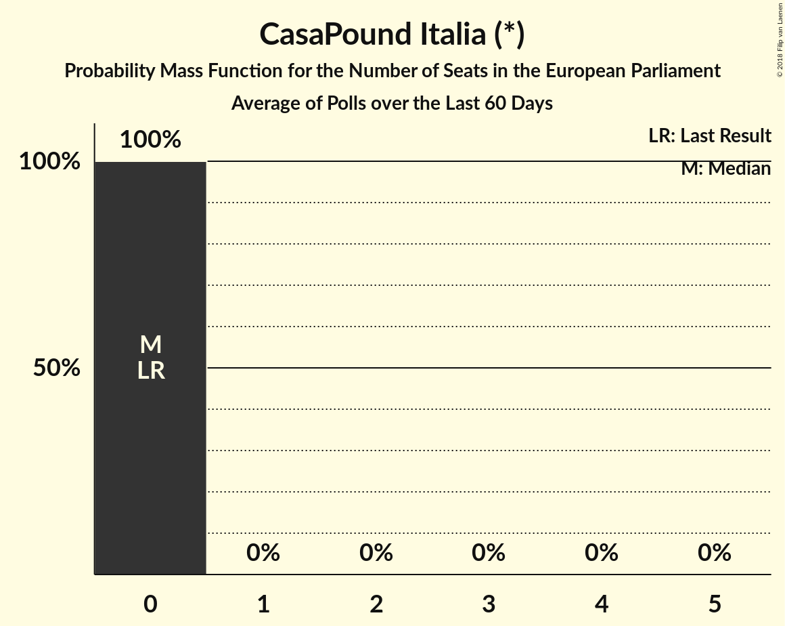

# CasaPound Italia (*)

<a href="#voting-intentions">Voting Intentions</a> | <a href="#seats">Seats</a>

## Voting Intentions

Last result: **0.0%** (General Election of 25 May 2014)

### Confidence Intervals

| Period     | Polling firm/Commissioner(s) | Median | 80% Confidence Interval | 90% Confidence Interval | 95% Confidence Interval | 99% Confidence Interval |
|:----------:|:----------------:|:-----------:|:-----------------------:|:-----------------------:|:-----------------------:|:-----------------------:|
| N/A | [Poll Average](average.html) | 0.7% | 0.5–1.1% | 0.4–1.3% | 0.4–1.4% | 0.3–1.8% |
| [30–31 May 2018](2018-05-31-Ipsos.html) | Ipsos   Corriere della Sera | 0.0% | N/A | N/A | N/A | N/A |
| [29–30 May 2018](2018-05-30-Demopolis.html) | Demopolis | 0.0% | N/A | N/A | N/A | N/A |
| [29 May 2018](2018-05-29-TermometroPolitico.html) | Termometro Politico | 0.6% | 0.5–0.8% | 0.5–0.8% | 0.4–0.8% | 0.4–0.9% |
| [29 May 2018](2018-05-29-Tecnè.html) | Tecnè   TGcom24 | 0.0% | N/A | N/A | N/A | N/A |
| [29 May 2018](2018-05-29-Euromedia.html) | Euromedia   Rai 1 | 0.0% | N/A | N/A | N/A | N/A |
| [23–28 May 2018](2018-05-28-SWG.html) | SWG   LA7 | 0.0% | N/A | N/A | N/A | N/A |
| [22–24 May 2018](2018-05-24-EMGAcqua.html) | EMG Acqua   Rai 3 | 0.0% | N/A | N/A | N/A | N/A |
| [23 May 2018](2018-05-23-IndexResearch.html) | Index Research   LA7 | 0.0% | N/A | N/A | N/A | N/A |
| [22–23 May 2018](2018-05-23-Demopolis.html) | Demopolis | 0.0% | N/A | N/A | N/A | N/A |
| [16–20 May 2018](2018-05-20-SWG.html) | SWG   LA7 | 0.0% | N/A | N/A | N/A | N/A |
| [16–18 May 2018](2018-05-18-Tecnè.html) | Tecnè   TGcom24 | 0.0% | N/A | N/A | N/A | N/A |
| [17–18 May 2018](2018-05-18-DemosPi.html) | Demos & Pi | 0.0% | N/A | N/A | N/A | N/A |
| [16–17 May 2018](2018-05-17-Ipsos.html) | Ipsos   Corriere della Sera | 0.0% | N/A | N/A | N/A | N/A |
| [15–17 May 2018](2018-05-17-EMGAcqua.html) | EMG Acqua   Rai 3 | 0.0% | N/A | N/A | N/A | N/A |
| [16 May 2018](2018-05-16-IndexResearch.html) | Index Research   LA7 | 0.0% | N/A | N/A | N/A | N/A |
| [16 May 2018](2018-05-16-Euromedia.html) | Euromedia   Rai 1 | 0.0% | N/A | N/A | N/A | N/A |
| [9–13 May 2018](2018-05-13-SWG.html) | SWG   LA7 | 0.0% | N/A | N/A | N/A | N/A |
| [10–11 May 2018](2018-05-11-Ixè.html) | Ixè | 0.0% | N/A | N/A | N/A | N/A |
| [9–10 May 2018](2018-05-10-Euromedia.html) | Euromedia | 0.0% | N/A | N/A | N/A | N/A |
| [8–10 May 2018](2018-05-10-EMGAcqua.html) | EMG Acqua   Rai 3 | 0.0% | N/A | N/A | N/A | N/A |
| [9–10 May 2018](2018-05-10-Demopolis.html) | Demopolis   LA7 | 0.0% | N/A | N/A | N/A | N/A |
| [8 May 2018](2018-05-08-Tecnè.html) | Tecnè   Canale 5 | 0.0% | N/A | N/A | N/A | N/A |
| [7 May 2018](2018-05-07-Piepoli.html) | Piepoli   Sky TG 24 | 0.0% | N/A | N/A | N/A | N/A |
| [5–6 May 2018](2018-05-06-Tecnè.html) | Tecnè   TGcom24 | 0.0% | N/A | N/A | N/A | N/A |
| [3–6 May 2018](2018-05-06-SWG.html) | SWG | 0.0% | N/A | N/A | N/A | N/A |
| [2–3 May 2018](2018-05-03-Ipsos.html) | Ipsos   Corriere della Sera | 0.0% | N/A | N/A | N/A | N/A |
| [2–3 May 2018](2018-05-03-EMGAcqua.html) | EMG Acqua   Rai 3 | 0.0% | N/A | N/A | N/A | N/A |
| [2 May 2018](2018-05-02-IndexResearch.html) | Index Research | 0.0% | N/A | N/A | N/A | N/A |
| [30 April 2018](2018-04-30-Tecnè.html) | Tecnè   Canale 5 | 0.0% | N/A | N/A | N/A | N/A |
| [30 April 2018](2018-04-30-Piepoli.html) | Piepoli   Rai 1 | 0.0% | N/A | N/A | N/A | N/A |
| [30 April 2018](2018-04-30-Euromedia.html) | Euromedia   Rai 1 | 0.0% | N/A | N/A | N/A | N/A |
| [24–30 April 2018](2018-04-30-Bidimedia.html) | Bidimedia | 0.8% | 0.5–1.3% | 0.4–1.4% | 0.4–1.6% | 0.3–1.9% |
| [26–27 April 2018](2018-04-27-DemosPi.html) | Demos & Pi   La Repubblica | 0.0% | N/A | N/A | N/A | N/A |
| [24–26 April 2018](2018-04-26-EMGAcqua.html) | EMG Acqua   Rai 3 | 0.0% | N/A | N/A | N/A | N/A |
| [23–25 April 2018](2018-04-25-SWG.html) | SWG | 0.0% | N/A | N/A | N/A | N/A |
| [23 April 2018](2018-04-23-Piepoli.html) | Piepoli | 0.0% | N/A | N/A | N/A | N/A |
| [20 April 2018](2018-04-20-Tecnè.html) | Tecnè   TGcom24 | 0.0% | N/A | N/A | N/A | N/A |
| [18–19 April 2018](2018-04-19-Ipsos.html) | Ipsos   Corriere della Sera | 0.0% | N/A | N/A | N/A | N/A |
| [16–18 April 2018](2018-04-18-SWG.html) | SWG | 0.0% | N/A | N/A | N/A | N/A |
| [18 April 2018](2018-04-18-IndexResearch.html) | Index Research   LA7 | 0.0% | N/A | N/A | N/A | N/A |
| [16 April 2018](2018-04-16-Piepoli.html) | Piepoli | 0.0% | N/A | N/A | N/A | N/A |
| [13 April 2018](2018-04-13-Euromedia.html) | Euromedia   Rete 4 | 0.0% | N/A | N/A | N/A | N/A |
| [9–11 April 2018](2018-04-11-SWG.html) | SWG | 0.0% | N/A | N/A | N/A | N/A |
| [9–11 April 2018](2018-04-11-Ixè.html) | Ixè   Huffington Post | 0.0% | N/A | N/A | N/A | N/A |
| [11 April 2018](2018-04-11-IndexResearch.html) | Index Research   LA7 | 0.0% | N/A | N/A | N/A | N/A |
| [9 April 2018](2018-04-09-Piepoli.html) | Piepoli | 0.0% | N/A | N/A | N/A | N/A |
| [9 April 2018](2018-04-09-Euromedia.html) | Euromedia | 0.0% | N/A | N/A | N/A | N/A |
| [5 April 2018](2018-04-05-IndexResearch.html) | Index Research   LA7 | 0.0% | N/A | N/A | N/A | N/A |
| [3–4 April 2018](2018-04-04-SWG.html) | SWG | 0.0% | N/A | N/A | N/A | N/A |
| [3 April 2018](2018-04-03-Tecnè.html) | Tecnè   Canale 5 | 0.0% | N/A | N/A | N/A | N/A |
| [2–3 April 2018](2018-04-03-Demopolis.html) | Demopolis   LA7 | 0.0% | N/A | N/A | N/A | N/A |
| [26–28 March 2018](2018-03-28-SWG.html) | SWG | 0.0% | N/A | N/A | N/A | N/A |
| [28 March 2018](2018-03-28-Piepoli.html) | Piepoli | 0.0% | N/A | N/A | N/A | N/A |
| [27–28 March 2018](2018-03-28-Ipsos.html) | Ipsos   Corriere della Sera | 0.0% | N/A | N/A | N/A | N/A |
| [28 March 2018](2018-03-28-IndexResearch.html) | Index Research   LA7 | 0.0% | N/A | N/A | N/A | N/A |
| [28 March 2018](2018-03-28-Euromedia.html) | Euromedia | 0.0% | N/A | N/A | N/A | N/A |
| [21–25 March 2018](2018-03-25-Bidimedia.html) | Bidimedia | 1.0% | 0.7–1.6% | 0.6–1.8% | 0.5–2.0% | 0.4–2.3% |
| [19–21 March 2018](2018-03-21-SWG.html) | SWG | 0.0% | N/A | N/A | N/A | N/A |
| [21 March 2018](2018-03-21-IndexResearch.html) | Index Research   LA7 | 0.0% | N/A | N/A | N/A | N/A |
| [20 March 2018](2018-03-20-Tecnè.html) | Tecnè   Canale 5 | 0.0% | N/A | N/A | N/A | N/A |
| [19 March 2018](2018-03-19-Piepoli.html) | Piepoli | 0.0% | N/A | N/A | N/A | N/A |
| [19 March 2018](2018-03-19-Euromedia.html) | Euromedia | 0.0% | N/A | N/A | N/A | N/A |
| [15 March 2018](2018-03-15-Piepoli.html) | Piepoli   La Stampa | 0.0% | N/A | N/A | N/A | N/A |
| [12–15 March 2018](2018-03-15-DemosPi.html) | Demos & Pi   La Repubblica | 0.0% | N/A | N/A | N/A | N/A |
| [12–14 March 2018](2018-03-14-SWG.html) | SWG   Il Messaggero | 0.6% | 0.4–1.1% | 0.3–1.2% | 0.3–1.3% | 0.2–1.6% |
| [12–16 February 2018](2018-02-16-TermometroPolitico.html) | Termometro Politico | 1.8% | 1.6–2.1% | 1.5–2.2% | 1.4–2.2% | 1.3–2.4% |
| [14–15 February 2018](2018-02-15-Demopolis.html) | Demopolis | 0.0% | N/A | N/A | N/A | N/A |
| [12–14 February 2018](2018-02-14-SWG.html) | SWG | 0.0% | N/A | N/A | N/A | N/A |
| [13–14 February 2018](2018-02-14-Piepoli.html) | Piepoli | 0.6% | 0.3–1.3% | 0.3–1.5% | 0.2–1.7% | 0.1–2.2% |
| [12–14 February 2018](2018-02-14-Ixè.html) | Ixè   Huffington Post | 0.0% | N/A | N/A | N/A | N/A |
| [12–14 February 2018](2018-02-14-Index.html) | Index | 0.0% | N/A | N/A | N/A | N/A |
| [14 February 2018](2018-02-14-Euromedia.html) | Euromedia | 0.6% | 0.4–1.2% | 0.3–1.3% | 0.3–1.5% | 0.2–1.8% |
| [12–14 February 2018](2018-02-14-DemosPi.html) | Demos & Pi   La Repubblica | 0.0% | N/A | N/A | N/A | N/A |
| [5–14 February 2018](2018-02-14-Demetra.html) | Demetra | 0.6% | 0.5–0.8% | 0.5–0.8% | 0.4–0.8% | 0.4–0.9% |
| [12–13 February 2018](2018-02-13-Tecnè.html) | Tecnè | 0.0% | N/A | N/A | N/A | N/A |
| [12 February 2018](2018-02-12-Euromedia.html) | Euromedia | 0.8% | 0.5–1.3% | 0.4–1.5% | 0.4–1.6% | 0.2–2.0% |
| [8–12 February 2018](2018-02-12-Bidimedia.html) | Bidimedia | 1.1% | 0.8–1.6% | 0.7–1.7% | 0.6–1.8% | 0.5–2.1% |
| [8–11 February 2018](2018-02-11-LorienConsulting.html) | Lorien Consulting | 1.5% | 1.1–2.1% | 1.0–2.3% | 0.9–2.5% | 0.7–2.8% |
| [9–11 February 2018](2018-02-11-EMG.html) | EMG   TG LA7 | 0.6% | 0.4–1.0% | 0.4–1.1% | 0.3–1.1% | 0.3–1.3% |
| [3–8 February 2018](2018-02-08-TermometroPolitico.html) | Termometro Politico | 1.9% | 1.6–2.3% | 1.6–2.3% | 1.5–2.4% | 1.4–2.6% |
| [8 February 2018](2018-02-08-Index.html) | Index | 0.0% | N/A | N/A | N/A | N/A |
| [6–7 February 2018](2018-02-07-Tecnè.html) | Tecnè | 0.0% | N/A | N/A | N/A | N/A |
| [5–7 February 2018](2018-02-07-SWG.html) | SWG | 0.0% | N/A | N/A | N/A | N/A |

### Probability Mass Function

The following table shows the probability mass function per percentage block of voting intentions for the [poll average](average.html) for CasaPound Italia (*).

| Voting Intentions | Probability | Accumulated | Special Marks |
|:-----------------:|:-----------:|:-----------:|:-------------:|
| 0.0–0.5% | 20% | 100% | Last Result |
| 0.5–1.5% | 79% | 80% | Median |
| 1.5–2.5% | 1.4% | 1.4% |  |
| 2.5–3.5% | 0% | 0% |  |

## Seats

Last result: **0** seats (General Election of 25 May 2014)

### Confidence Intervals

| Period     | Polling firm/Commissioner(s) | Median | 80% Confidence Interval | 90% Confidence Interval | 95% Confidence Interval | 99% Confidence Interval |
|:----------:|:----------------:|:------:|:-----------------------:|:-----------------------:|:-----------------------:|:-----------------------:|
| N/A | [Poll Average](average.html) | 0 | 0 | 0 | 0 | 0 |
| [30–31 May 2018](2018-05-31-Ipsos.html) | Ipsos   Corriere della Sera |  |  |  |  |  |
| [29–30 May 2018](2018-05-30-Demopolis.html) | Demopolis |  |  |  |  |  |
| [29 May 2018](2018-05-29-TermometroPolitico.html) | Termometro Politico | 0 | 0 | 0 | 0 | 0 |
| [29 May 2018](2018-05-29-Tecnè.html) | Tecnè   TGcom24 |  |  |  |  |  |
| [29 May 2018](2018-05-29-Euromedia.html) | Euromedia   Rai 1 |  |  |  |  |  |
| [23–28 May 2018](2018-05-28-SWG.html) | SWG   LA7 |  |  |  |  |  |
| [22–24 May 2018](2018-05-24-EMGAcqua.html) | EMG Acqua   Rai 3 |  |  |  |  |  |
| [23 May 2018](2018-05-23-IndexResearch.html) | Index Research   LA7 |  |  |  |  |  |
| [22–23 May 2018](2018-05-23-Demopolis.html) | Demopolis |  |  |  |  |  |
| [16–20 May 2018](2018-05-20-SWG.html) | SWG   LA7 |  |  |  |  |  |
| [16–18 May 2018](2018-05-18-Tecnè.html) | Tecnè   TGcom24 |  |  |  |  |  |
| [17–18 May 2018](2018-05-18-DemosPi.html) | Demos & Pi |  |  |  |  |  |
| [16–17 May 2018](2018-05-17-Ipsos.html) | Ipsos   Corriere della Sera |  |  |  |  |  |
| [15–17 May 2018](2018-05-17-EMGAcqua.html) | EMG Acqua   Rai 3 |  |  |  |  |  |
| [16 May 2018](2018-05-16-IndexResearch.html) | Index Research   LA7 |  |  |  |  |  |
| [16 May 2018](2018-05-16-Euromedia.html) | Euromedia   Rai 1 |  |  |  |  |  |
| [9–13 May 2018](2018-05-13-SWG.html) | SWG   LA7 |  |  |  |  |  |
| [10–11 May 2018](2018-05-11-Ixè.html) | Ixè |  |  |  |  |  |
| [9–10 May 2018](2018-05-10-Euromedia.html) | Euromedia |  |  |  |  |  |
| [8–10 May 2018](2018-05-10-EMGAcqua.html) | EMG Acqua   Rai 3 |  |  |  |  |  |
| [9–10 May 2018](2018-05-10-Demopolis.html) | Demopolis   LA7 |  |  |  |  |  |
| [8 May 2018](2018-05-08-Tecnè.html) | Tecnè   Canale 5 |  |  |  |  |  |
| [7 May 2018](2018-05-07-Piepoli.html) | Piepoli   Sky TG 24 |  |  |  |  |  |
| [5–6 May 2018](2018-05-06-Tecnè.html) | Tecnè   TGcom24 |  |  |  |  |  |
| [3–6 May 2018](2018-05-06-SWG.html) | SWG |  |  |  |  |  |
| [2–3 May 2018](2018-05-03-Ipsos.html) | Ipsos   Corriere della Sera |  |  |  |  |  |
| [2–3 May 2018](2018-05-03-EMGAcqua.html) | EMG Acqua   Rai 3 |  |  |  |  |  |
| [2 May 2018](2018-05-02-IndexResearch.html) | Index Research |  |  |  |  |  |
| [30 April 2018](2018-04-30-Tecnè.html) | Tecnè   Canale 5 |  |  |  |  |  |
| [30 April 2018](2018-04-30-Piepoli.html) | Piepoli   Rai 1 |  |  |  |  |  |
| [30 April 2018](2018-04-30-Euromedia.html) | Euromedia   Rai 1 |  |  |  |  |  |
| [24–30 April 2018](2018-04-30-Bidimedia.html) | Bidimedia | 0 | 0 | 0 | 0 | 0 |
| [26–27 April 2018](2018-04-27-DemosPi.html) | Demos & Pi   La Repubblica |  |  |  |  |  |
| [24–26 April 2018](2018-04-26-EMGAcqua.html) | EMG Acqua   Rai 3 |  |  |  |  |  |
| [23–25 April 2018](2018-04-25-SWG.html) | SWG |  |  |  |  |  |
| [23 April 2018](2018-04-23-Piepoli.html) | Piepoli |  |  |  |  |  |
| [20 April 2018](2018-04-20-Tecnè.html) | Tecnè   TGcom24 |  |  |  |  |  |
| [18–19 April 2018](2018-04-19-Ipsos.html) | Ipsos   Corriere della Sera |  |  |  |  |  |
| [16–18 April 2018](2018-04-18-SWG.html) | SWG |  |  |  |  |  |
| [18 April 2018](2018-04-18-IndexResearch.html) | Index Research   LA7 |  |  |  |  |  |
| [16 April 2018](2018-04-16-Piepoli.html) | Piepoli |  |  |  |  |  |
| [13 April 2018](2018-04-13-Euromedia.html) | Euromedia   Rete 4 |  |  |  |  |  |
| [9–11 April 2018](2018-04-11-SWG.html) | SWG |  |  |  |  |  |
| [9–11 April 2018](2018-04-11-Ixè.html) | Ixè   Huffington Post |  |  |  |  |  |
| [11 April 2018](2018-04-11-IndexResearch.html) | Index Research   LA7 |  |  |  |  |  |
| [9 April 2018](2018-04-09-Piepoli.html) | Piepoli |  |  |  |  |  |
| [9 April 2018](2018-04-09-Euromedia.html) | Euromedia |  |  |  |  |  |
| [5 April 2018](2018-04-05-IndexResearch.html) | Index Research   LA7 |  |  |  |  |  |
| [3–4 April 2018](2018-04-04-SWG.html) | SWG |  |  |  |  |  |
| [3 April 2018](2018-04-03-Tecnè.html) | Tecnè   Canale 5 |  |  |  |  |  |
| [2–3 April 2018](2018-04-03-Demopolis.html) | Demopolis   LA7 |  |  |  |  |  |
| [26–28 March 2018](2018-03-28-SWG.html) | SWG |  |  |  |  |  |
| [28 March 2018](2018-03-28-Piepoli.html) | Piepoli |  |  |  |  |  |
| [27–28 March 2018](2018-03-28-Ipsos.html) | Ipsos   Corriere della Sera |  |  |  |  |  |
| [28 March 2018](2018-03-28-IndexResearch.html) | Index Research   LA7 |  |  |  |  |  |
| [28 March 2018](2018-03-28-Euromedia.html) | Euromedia |  |  |  |  |  |
| [21–25 March 2018](2018-03-25-Bidimedia.html) | Bidimedia | 0 | 0 | 0 | 0 | 0 |
| [19–21 March 2018](2018-03-21-SWG.html) | SWG |  |  |  |  |  |
| [21 March 2018](2018-03-21-IndexResearch.html) | Index Research   LA7 |  |  |  |  |  |
| [20 March 2018](2018-03-20-Tecnè.html) | Tecnè   Canale 5 |  |  |  |  |  |
| [19 March 2018](2018-03-19-Piepoli.html) | Piepoli |  |  |  |  |  |
| [19 March 2018](2018-03-19-Euromedia.html) | Euromedia |  |  |  |  |  |
| [15 March 2018](2018-03-15-Piepoli.html) | Piepoli   La Stampa |  |  |  |  |  |
| [12–15 March 2018](2018-03-15-DemosPi.html) | Demos & Pi   La Repubblica |  |  |  |  |  |
| [12–14 March 2018](2018-03-14-SWG.html) | SWG   Il Messaggero | 0 | 0 | 0 | 0 | 0 |
| [12–16 February 2018](2018-02-16-TermometroPolitico.html) | Termometro Politico | 0 | 0 | 0 | 0 | 0 |
| [14–15 February 2018](2018-02-15-Demopolis.html) | Demopolis |  |  |  |  |  |
| [12–14 February 2018](2018-02-14-SWG.html) | SWG |  |  |  |  |  |
| [13–14 February 2018](2018-02-14-Piepoli.html) | Piepoli | 0 | 0 | 0 | 0 | 0 |
| [12–14 February 2018](2018-02-14-Ixè.html) | Ixè   Huffington Post |  |  |  |  |  |
| [12–14 February 2018](2018-02-14-Index.html) | Index |  |  |  |  |  |
| [14 February 2018](2018-02-14-Euromedia.html) | Euromedia | 0 | 0 | 0 | 0 | 0 |
| [12–14 February 2018](2018-02-14-DemosPi.html) | Demos & Pi   La Repubblica |  |  |  |  |  |
| [5–14 February 2018](2018-02-14-Demetra.html) | Demetra | 0 | 0 | 0 | 0 | 0 |
| [12–13 February 2018](2018-02-13-Tecnè.html) | Tecnè |  |  |  |  |  |
| [12 February 2018](2018-02-12-Euromedia.html) | Euromedia | 0 | 0 | 0 | 0 | 0 |
| [8–12 February 2018](2018-02-12-Bidimedia.html) | Bidimedia | 0 | 0 | 0 | 0 | 0 |
| [8–11 February 2018](2018-02-11-LorienConsulting.html) | Lorien Consulting | 0 | 0 | 0 | 0 | 0 |
| [9–11 February 2018](2018-02-11-EMG.html) | EMG   TG LA7 | 0 | 0 | 0 | 0 | 0 |
| [3–8 February 2018](2018-02-08-TermometroPolitico.html) | Termometro Politico | 0 | 0 | 0 | 0 | 0 |
| [8 February 2018](2018-02-08-Index.html) | Index |  |  |  |  |  |
| [6–7 February 2018](2018-02-07-Tecnè.html) | Tecnè |  |  |  |  |  |
| [5–7 February 2018](2018-02-07-SWG.html) | SWG |  |  |  |  |  |

### Probability Mass Function

The following table shows the probability mass function per seat for the [poll average](average.html) for CasaPound Italia (*).

| Number of Seats | Probability | Accumulated | Special Marks |
|:---------------:|:-----------:|:-----------:|:-------------:|
| 0 | 100% | 100% | Last Result, Median |

