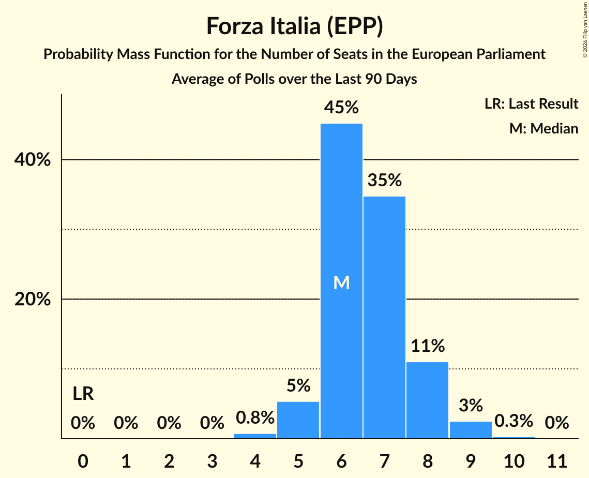

# Forza Italia (EPP)

<a href="#voting-intentions">Voting Intentions</a> | <a href="#seats">Seats</a>

## Voting Intentions

Last result: **16.8%** (General Election of 26 May 2019)

### Confidence Intervals

| Period     | Polling firm/Commissioner(s) | Median | 80% Confidence Interval | 90% Confidence Interval | 95% Confidence Interval | 99% Confidence Interval |
|:----------:|:----------------:|:-----------:|:-----------------------:|:-----------------------:|:-----------------------:|:-----------------------:|
| N/A | [Poll Average](average.html) | 6.7% | 5.4–8.8% | 5.1–9.5% | 4.9–10.1% | 4.5–11.0% |
| [11–16 December 2019](2019-12-16-SWG.html) | SWG   La7 | 5.7% | 5.0–6.5% | 4.8–6.8% | 4.6–7.0% | 4.3–7.4% |
| [12–13 December 2019](2019-12-13-Tecnè.html) | Tecnè   Agenzia Dire | 7.9% | 6.9–9.1% | 6.6–9.4% | 6.4–9.7% | 5.9–10.3% |
| [11–13 December 2019](2019-12-13-BiDiMedia.html) | BiDiMedia | 5.8% | 5.1–6.7% | 4.9–7.0% | 4.7–7.2% | 4.4–7.6% |
| [11–12 December 2019](2019-12-12-Tecnè.html) | Tecnè   RTI | 7.9% | 6.9–9.1% | 6.6–9.4% | 6.4–9.7% | 5.9–10.3% |
| [12 December 2019](2019-12-12-NotoSondaggi.html) | Noto Sondaggi   Rai 1 | 6.5% | 5.6–7.6% | 5.3–7.9% | 5.1–8.2% | 4.7–8.8% |
| [1–11 December 2019](2019-12-11-Index.html) | Index   La7 | 6.8% | 5.7–8.0% | 5.4–8.4% | 5.2–8.7% | 4.8–9.4% |
| [10–11 December 2019](2019-12-11-EMG.html) | EMG   Rai 3 | 6.7% | 6.0–7.6% | 5.8–7.8% | 5.6–8.1% | 5.2–8.5% |
| [9–10 December 2019](2019-12-10-Ixè.html) | Ixè   Rai 3 | 7.6% | 6.6–8.8% | 6.3–9.1% | 6.1–9.4% | 5.7–10.0% |
| [8–9 December 2019](2019-12-09-Tecnè.html) | Tecnè   Rete 4 | 8.0% | 7.0–9.2% | 6.7–9.6% | 6.5–9.9% | 6.0–10.5% |
| [4–9 December 2019](2019-12-09-SWG.html) | SWG   La7 | 5.3% | 4.6–6.2% | 4.5–6.4% | 4.3–6.6% | 4.0–7.0% |
| [5–6 December 2019](2019-12-06-Tecnè.html) | Tecnè   Agenzia Dire | 7.9% | 6.9–9.1% | 6.6–9.4% | 6.4–9.7% | 5.9–10.3% |
| [6 December 2019](2019-12-06-NotoSondaggi.html) | Noto Sondaggi   Rai 1 | 6.0% | 5.1–7.1% | 4.9–7.4% | 4.7–7.7% | 4.3–8.2% |
| [2–6 December 2019](2019-12-06-DemosPi.html) | Demos & Pi   La Repubblica | 6.5% | 5.7–7.5% | 5.5–7.8% | 5.3–8.0% | 4.9–8.5% |
| [4 November–5 December 2019](2019-12-05-TermometroPolitico.html) | Termometro Politico   La7 | 5.5% | 5.0–6.2% | 4.8–6.3% | 4.7–6.5% | 4.4–6.8% |
| [1–4 December 2019](2019-12-04-Index.html) | Index   La7 | 6.6% | 5.6–7.9% | 5.3–8.3% | 5.1–8.6% | 4.6–9.2% |
| [1–4 December 2019](2019-12-04-Euromedia.html) | Euromedia   Rai 1 | 7.2% | 6.2–8.6% | 5.9–8.9% | 5.6–9.3% | 5.2–9.9% |
| [3–4 December 2019](2019-12-04-EMG.html) | EMG   Rai 3 | 6.9% | 6.1–7.8% | 5.9–8.0% | 5.8–8.2% | 5.4–8.7% |
| [2–3 December 2019](2019-12-03-Ixè.html) | Ixè   Rai 3 | 7.4% | 6.4–8.6% | 6.2–8.9% | 5.9–9.2% | 5.5–9.8% |
| [1–2 December 2019](2019-12-02-Tecnè.html) | Tecnè   Rete 4 | 8.2% | 7.2–9.4% | 6.9–9.8% | 6.6–10.1% | 6.2–10.7% |
| [27 November–2 December 2019](2019-12-02-SWG.html) | SWG   La7 | 5.1% | 4.5–5.9% | 4.3–6.2% | 4.1–6.4% | 3.8–6.8% |
| [28–29 November 2019](2019-11-29-Tecnè.html) | Tecnè   Agenzia Dire | 8.1% | 7.1–9.3% | 6.8–9.7% | 6.6–10.0% | 6.1–10.6% |
| [27–28 November 2019](2019-11-28-TermometroPolitico.html) | Termometro Politico   La7 | 6.0% | 5.4–6.7% | 5.2–7.0% | 5.0–7.1% | 4.8–7.5% |
| [26–27 November 2019](2019-11-27-Ipsos.html) | Ipsos   Corriere della Sera | 6.2% | 5.3–7.3% | 5.1–7.6% | 4.9–7.9% | 4.5–8.4% |
| [1–27 November 2019](2019-11-27-Index.html) | Index   La7 | 6.6% | 5.6–7.9% | 5.3–8.3% | 5.1–8.6% | 4.6–9.2% |
| [27 November 2019](2019-11-27-EMG.html) | EMG   Rai 3 | 7.3% | 6.5–8.2% | 6.3–8.5% | 6.1–8.7% | 5.8–9.2% |
| [25–26 November 2019](2019-11-26-Ixè.html) | Ixè   Rai 3 | 7.4% | 6.4–8.6% | 6.2–8.9% | 5.9–9.2% | 5.5–9.8% |
| [24–25 November 2019](2019-11-25-Tecnè.html) | Tecnè   Rete 4 | 8.1% | 7.1–9.3% | 6.8–9.7% | 6.6–10.0% | 6.1–10.6% |
| [20–25 November 2019](2019-11-25-SWG.html) | SWG   La7 | 6.0% | 5.3–6.9% | 5.1–7.1% | 4.9–7.3% | 4.6–7.8% |
| [21–22 November 2019](2019-11-22-Tecnè.html) | Tecnè   Agenzia Dire | 8.0% | 7.0–9.2% | 6.7–9.6% | 6.5–9.9% | 6.0–10.5% |
| [21–22 November 2019](2019-11-22-Piepoli.html) | Piepoli   Rai 2 | 7.5% | 6.2–9.3% | 5.8–9.7% | 5.5–10.2% | 5.0–11.1% |
| [20–21 November 2019](2019-11-21-TermometroPolitico.html) | Termometro Politico   La7 | 5.8% | 5.2–6.5% | 5.1–6.6% | 4.9–6.8% | 4.7–7.1% |
| [21 November 2019](2019-11-21-NotoSondaggi.html) | Noto Sondaggi   Rai 1 | 6.0% | 5.1–7.1% | 4.9–7.4% | 4.7–7.7% | 4.3–8.2% |
| [1–20 November 2019](2019-11-20-EMG.html) | EMG   Rai 3 | 7.7% | 6.9–8.7% | 6.7–8.9% | 6.5–9.2% | 6.1–9.6% |
| [18–19 November 2019](2019-11-19-Ixè.html) | Ixè   Rai 3 | 7.5% | 6.5–8.7% | 6.2–9.0% | 6.0–9.3% | 5.6–9.9% |
| [18–19 November 2019](2019-11-19-BiDiMedia.html) | BiDiMedia | 5.6% | 5.0–6.4% | 4.8–6.7% | 4.6–6.9% | 4.3–7.3% |
| [13–18 November 2019](2019-11-18-SWG.html) | SWG   La7 | 6.4% | 5.7–7.3% | 5.4–7.5% | 5.3–7.8% | 4.9–8.2% |
| [14–15 November 2019](2019-11-15-Tecnè.html) | Tecnè   Agenzia Dire | 8.0% | 7.0–9.2% | 6.7–9.6% | 6.5–9.9% | 6.0–10.5% |
| [1–14 November 2019](2019-11-14-Index.html) | Index   La7 | 6.4% | 5.4–7.6% | 5.1–8.0% | 4.9–8.3% | 4.5–8.9% |
| [12–13 November 2019](2019-11-13-TermometroPolitico.html) | Termometro Politico   La7 | 5.6% | 5.0–6.3% | 4.8–6.5% | 4.7–6.6% | 4.4–7.0% |
| [8–13 November 2019](2019-11-13-EMG.html) | EMG   Rai 3 | 7.4% | 6.6–8.4% | 6.4–8.7% | 6.2–8.9% | 5.8–9.4% |
| [11–12 November 2019](2019-11-12-Ixè.html) | Ixè   Rai 3 | 7.3% | 6.3–8.5% | 6.1–8.8% | 5.8–9.1% | 5.4–9.7% |
| [10–12 November 2019](2019-11-12-Demopolis.html) | Demopolis   Rai 3 | 5.6% | 4.9–6.4% | 4.7–6.7% | 4.5–6.9% | 4.2–7.3% |
| [10–11 November 2019](2019-11-11-Tecnè.html) | Tecnè   Rete 4 | 8.1% | 7.1–9.3% | 6.8–9.7% | 6.6–10.0% | 6.1–10.6% |
| [6–11 November 2019](2019-11-11-SWG.html) | SWG   La7 | 6.2% | 5.5–7.1% | 5.3–7.3% | 5.1–7.5% | 4.8–8.0% |
| [1–11 November 2019](2019-11-11-Euromedia.html) | Euromedia   Rai 1 | 6.8% | 5.7–8.0% | 5.4–8.4% | 5.2–8.7% | 4.8–9.4% |
| [8–9 November 2019](2019-11-09-Piepoli.html) | Piepoli   Rai 2 | 6.9% | 5.7–8.6% | 5.3–9.1% | 5.0–9.5% | 4.5–10.3% |
| [7–8 November 2019](2019-11-08-Tecnè.html) | Tecnè   Agenzia Dire | 8.1% | 7.1–9.3% | 6.8–9.7% | 6.6–10.0% | 6.1–10.6% |
| [6–7 November 2019](2019-11-07-TermometroPolitico.html) | Termometro Politico   La7 | 5.5% | 5.0–6.2% | 4.8–6.4% | 4.6–6.5% | 4.4–6.9% |
| [7 November 2019](2019-11-07-Index.html) | Index   La7 | 6.4% | 5.4–7.6% | 5.1–8.0% | 4.9–8.3% | 4.5–8.9% |
| [6 November 2019](2019-11-06-EMG.html) | EMG   Rai 3 | 7.2% | 6.4–8.2% | 6.2–8.5% | 6.0–8.7% | 5.6–9.2% |
| [4–5 November 2019](2019-11-05-Ixè.html) | Ixè   Rai 3 | 7.8% | 6.8–9.0% | 6.5–9.3% | 6.3–9.6% | 5.8–10.2% |
| [4–5 November 2019](2019-11-05-IZI.html) | IZI | 9.5% | 8.4–10.8% | 8.1–11.1% | 7.8–11.4% | 7.3–12.1% |
| [30 October–4 November 2019](2019-11-04-SWG.html) | SWG   La7 | 6.2% | 5.5–7.1% | 5.3–7.3% | 5.1–7.5% | 4.8–8.0% |
| [1–4 November 2019](2019-11-04-Piepoli.html) | Piepoli   Rai 2 | 7.0% | 5.7–8.7% | 5.4–9.2% | 5.1–9.6% | 4.5–10.5% |
| [29–31 October 2019](2019-10-31-Ipsos.html) | Ipsos   Corriere della Sera | 6.2% | 5.3–7.3% | 5.1–7.6% | 4.9–7.9% | 4.5–8.4% |
| [31 October 2019](2019-10-31-Index.html) | Index   La7 | 6.2% | 5.3–7.5% | 5.0–7.8% | 4.8–8.2% | 4.3–8.8% |
| [30–31 October 2019](2019-10-31-Demopolis.html) | Demopolis   Rai 3 | 6.0% | 5.3–6.9% | 5.1–7.1% | 4.9–7.3% | 4.6–7.8% |
| [30 October 2019](2019-10-30-Tecnè.html) | Tecnè | 8.2% | 7.2–9.4% | 6.9–9.8% | 6.6–10.1% | 6.2–10.7% |
| [30 October 2019](2019-10-30-EMG.html) | EMG   Rai 3 | 7.4% | 6.6–8.3% | 6.4–8.6% | 6.2–8.8% | 5.8–9.3% |
| [28–29 October 2019](2019-10-29-Ixè.html) | Ixè   Rai 3 | 7.7% | 6.7–8.9% | 6.4–9.2% | 6.2–9.5% | 5.8–10.1% |
| [27 October 2019](2019-10-27-Tecnè.html) | Tecnè   Rete 4 | 8.1% | 7.1–9.3% | 6.8–9.7% | 6.6–10.0% | 6.1–10.6% |
| [23–27 October 2019](2019-10-27-SWG.html) | SWG   La7 | 5.5% | 4.8–6.4% | 4.6–6.6% | 4.5–6.8% | 4.2–7.2% |
| [24–25 October 2019](2019-10-25-Tecnè.html) | Tecnè   Agenzia Dire | 8.2% | 7.2–9.4% | 6.9–9.8% | 6.6–10.1% | 6.2–10.7% |
| [23–24 October 2019](2019-10-24-TermometroPolitico.html) | Termometro Politico   La7 | 5.6% | 5.0–6.3% | 4.9–6.5% | 4.7–6.6% | 4.5–7.0% |
| [22–24 October 2019](2019-10-24-ScenariPolitici–Winpoll.html) | Scenari Politici–Winpoll | 6.2% | 5.5–7.1% | 5.3–7.3% | 5.1–7.5% | 4.8–8.0% |
| [24 October 2019](2019-10-24-Index.html) | Index   La7 | 6.2% | 5.3–7.5% | 5.0–7.8% | 4.8–8.2% | 4.3–8.8% |
| [23 October 2019](2019-10-23-EMG.html) | EMG   Rai 3 | 7.0% | 6.2–7.9% | 6.0–8.1% | 5.8–8.3% | 5.5–8.8% |
| [22 October 2019](2019-10-22-NotoSondaggi.html) | Noto Sondaggi   Rai 1 | 6.9% | 6.0–8.0% | 5.7–8.4% | 5.5–8.7% | 5.1–9.2% |
| [21–22 October 2019](2019-10-22-Ixè.html) | Ixè   Rai 3 | 8.1% | 7.1–9.3% | 6.8–9.7% | 6.6–10.0% | 6.1–10.6% |
| [20–21 October 2019](2019-10-21-Tecnè.html) | Tecnè   Rete 4 | 8.0% | 7.0–9.2% | 6.7–9.6% | 6.5–9.9% | 6.0–10.5% |
| [16–21 October 2019](2019-10-21-SWG.html) | SWG   La7 | 5.5% | 4.8–6.4% | 4.6–6.6% | 4.5–6.8% | 4.2–7.2% |
| [17–18 October 2019](2019-10-18-Tecnè.html) | Tecnè   Agenzia Dire | 7.8% | 6.8–9.0% | 6.5–9.3% | 6.3–9.6% | 5.8–10.2% |
| [16–17 October 2019](2019-10-17-TermometroPolitico.html) | Termometro Politico   La7 | 5.5% | 4.8–6.3% | 4.6–6.5% | 4.5–6.7% | 4.2–7.1% |
| [17 October 2019](2019-10-17-Index.html) | Index   La7 | 6.0% | 5.0–7.2% | 4.8–7.6% | 4.6–7.9% | 4.1–8.5% |
| [16–17 October 2019](2019-10-17-Euromedia.html) | Euromedia   Rai 1 | 7.0% | 6.0–8.3% | 5.7–8.7% | 5.4–9.0% | 5.0–9.6% |
| [16–17 October 2019](2019-10-17-EMG.html) | EMG   Rai 3 | 7.1% | 6.3–8.0% | 6.1–8.3% | 5.9–8.5% | 5.6–9.0% |
| [14–15 October 2019](2019-10-15-Ixè.html) | Ixè   Rai 3 | 7.8% | 6.8–9.0% | 6.5–9.3% | 6.3–9.6% | 5.8–10.2% |
| [13–14 October 2019](2019-10-14-Tecnè.html) | Tecnè   Rete 4 | 7.8% | 6.8–9.0% | 6.5–9.3% | 6.3–9.6% | 5.8–10.2% |
| [9–14 October 2019](2019-10-14-SWG.html) | SWG   La7 | 5.1% | 4.5–5.9% | 4.3–6.2% | 4.1–6.4% | 3.8–6.8% |
| [10–11 October 2019](2019-10-11-Tecnè.html) | Tecnè   Agenzia Dire | 7.7% | 6.7–8.9% | 6.4–9.2% | 6.2–9.5% | 5.8–10.1% |
| [9–11 October 2019](2019-10-11-Demopolis.html) | Demopolis   Rai 3 | 6.2% | 5.3–7.3% | 5.1–7.6% | 4.9–7.9% | 4.5–8.4% |
| [9–10 October 2019](2019-10-10-TermometroPolitico.html) | Termometro Politico   La7 | 5.3% | 4.6–6.1% | 4.5–6.3% | 4.3–6.5% | 4.0–6.9% |
| [10 October 2019](2019-10-10-NotoSondaggi.html) | Noto Sondaggi   Rai 1 | 6.5% | 5.6–7.6% | 5.3–7.9% | 5.1–8.2% | 4.7–8.8% |
| [9 October 2019](2019-10-09-Index.html) | Index   La7 | 6.0% | 5.0–7.2% | 4.8–7.6% | 4.6–7.9% | 4.1–8.5% |
| [9 October 2019](2019-10-09-EMG.html) | EMG   Rai 3 | 7.0% | 6.3–7.9% | 6.1–8.2% | 5.9–8.4% | 5.5–8.8% |
| [7–9 October 2019](2019-10-09-BiDiMedia.html) | BiDiMedia | 5.5% | 4.8–6.4% | 4.6–6.6% | 4.4–6.8% | 4.1–7.2% |
| [7–8 October 2019](2019-10-08-Ixè.html) | Ixè   Rai 3 | 7.2% | 6.2–8.4% | 6.0–8.7% | 5.7–9.0% | 5.3–9.6% |
| [7–8 October 2019](2019-10-08-Euromedia.html) | Euromedia   Rai 1 | 7.1% | 6.1–8.4% | 5.8–8.8% | 5.5–9.1% | 5.1–9.8% |
| [6–7 October 2019](2019-10-07-Tecnè.html) | Tecnè   Rete 4 | 7.9% | 6.9–9.1% | 6.6–9.4% | 6.4–9.7% | 5.9–10.3% |
| [2–7 October 2019](2019-10-07-SWG.html) | SWG   La7 | 5.0% | 4.3–5.8% | 4.2–6.0% | 4.0–6.2% | 3.7–6.6% |
| [7 October 2019](2019-10-07-Ipsos.html) | Ipsos   La7 | 6.8% | 5.7–8.3% | 5.3–8.8% | 5.1–9.1% | 4.6–9.9% |
| [3–5 October 2019](2019-10-05-Piepoli.html) | Piepoli   Rai 1 | 6.6% | 5.4–8.2% | 5.0–8.7% | 4.7–9.1% | 4.2–10.0% |
| [3–4 October 2019](2019-10-04-Tecnè.html) | Tecnè   Agenzia Dire | 8.0% | 7.0–9.2% | 6.7–9.6% | 6.5–9.9% | 6.0–10.5% |
| [3 October 2019](2019-10-03-Index.html) | Index   La7 | 6.0% | 5.0–7.2% | 4.8–7.6% | 4.6–7.9% | 4.1–8.5% |
| [1–3 October 2019](2019-10-03-DemosPi.html) | Demos & Pi   La Repubblica | 6.1% | 5.3–7.0% | 5.1–7.3% | 4.9–7.5% | 4.5–8.0% |
| [2 October 2019](2019-10-02-EMG.html) | EMG   Rai 3 | 7.4% | 6.7–8.3% | 6.4–8.5% | 6.3–8.7% | 5.9–9.2% |
| [30 September–1 October 2019](2019-10-01-Ixè.html) | Ixè   Rai 3 | 6.9% | 6.0–8.0% | 5.7–8.4% | 5.5–8.7% | 5.1–9.2% |
| [29–30 September 2019](2019-09-30-Tecnè.html) | Tecnè   Rete 4 | 7.9% | 6.9–9.1% | 6.6–9.4% | 6.4–9.7% | 5.9–10.3% |
| [25–30 September 2019](2019-09-30-SWG.html) | SWG   La7 | 5.0% | 4.3–5.8% | 4.2–6.0% | 4.0–6.2% | 3.7–6.6% |
| [20–27 September 2019](2019-09-27-Tecnè.html) | Tecnè   Agenzia Dire | 7.8% | 6.7–9.1% | 6.3–9.5% | 6.1–9.8% | 5.6–10.5% |
| [23–27 September 2019](2019-09-27-GPF.html) | GPF   La Notizia | 6.0% | 5.1–7.3% | 4.8–7.6% | 4.6–7.9% | 4.2–8.5% |
| [25–26 September 2019](2019-09-26-TermometroPolitico.html) | Termometro Politico   La7 | 5.4% | 4.9–6.1% | 4.7–6.2% | 4.6–6.4% | 4.3–6.7% |
| [25–26 September 2019](2019-09-26-Ipsos.html) | Ipsos   Corriere della Sera | 7.0% | 6.1–8.2% | 5.8–8.5% | 5.6–8.8% | 5.2–9.3% |
| [1–25 September 2019](2019-09-25-NotoSondaggi.html) | Noto Sondaggi | 6.0% | 5.1–7.1% | 4.9–7.4% | 4.7–7.7% | 4.3–8.2% |
| [25 September 2019](2019-09-25-EMG.html) | EMG   Rai 3 | 6.8% | 6.1–7.6% | 5.9–7.8% | 5.7–8.0% | 5.4–8.5% |
| [23–24 September 2019](2019-09-24-Ixè.html) | Ixè   Rai 3 | 6.5% | 5.6–7.6% | 5.3–7.9% | 5.1–8.2% | 4.7–8.8% |
| [22–23 September 2019](2019-09-23-Tecnè.html) | Tecnè   Rete 4 | 7.9% | 6.9–9.1% | 6.6–9.4% | 6.4–9.7% | 5.9–10.3% |
| [18–23 September 2019](2019-09-23-SWG.html) | SWG   La7 | 5.1% | 4.4–5.9% | 4.2–6.1% | 4.1–6.3% | 3.8–6.7% |
| [20–22 September 2019](2019-09-22-Piepoli.html) | Piepoli   Rai 1 | 6.9% | 5.7–8.6% | 5.3–9.1% | 5.0–9.5% | 4.5–10.3% |
| [19–20 September 2019](2019-09-20-Tecnè.html) | Tecnè | 8.0% | 6.9–9.4% | 6.6–9.8% | 6.3–10.1% | 5.8–10.8% |
| [18–20 September 2019](2019-09-20-ScenariPolitici–Winpoll.html) | Scenari Politici–Winpoll   Il Sole 24 Ore | 5.7% | 5.0–6.5% | 4.8–6.8% | 4.6–7.0% | 4.3–7.4% |
| [18–20 September 2019](2019-09-20-Quorum–YouTrend.html) | Quorum – YouTrend   Sky Tg24 | 6.9% | 6.0–8.0% | 5.7–8.4% | 5.5–8.7% | 5.1–9.2% |
| [20 September 2019](2019-09-20-IZI.html) | IZI | 7.0% | 6.0–8.1% | 5.8–8.4% | 5.5–8.7% | 5.1–9.3% |
| [17–19 September 2019](2019-09-19-TermometroPolitico.html) | Termometro Politico   La7 | 5.2% | 4.6–6.0% | 4.5–6.1% | 4.3–6.3% | 4.1–6.7% |
| [18–19 September 2019](2019-09-19-Tecnè.html) | Tecnè   Rete 4 | 7.9% | 6.9–9.1% | 6.6–9.4% | 6.4–9.7% | 5.9–10.3% |
| [1–19 September 2019](2019-09-19-IndexResearch.html) | Index Research   La7 | 6.0% | 5.0–7.2% | 4.8–7.6% | 4.6–7.9% | 4.1–8.5% |
| [18–19 September 2019](2019-09-19-Demopolis.html) | Demopolis   Rai 3 | 6.0% | 5.3–6.9% | 5.1–7.1% | 4.9–7.3% | 4.6–7.8% |
| [17–18 September 2019](2019-09-18-Euromedia.html) | Euromedia   Rai 1 | 6.5% | 5.5–7.8% | 5.2–8.1% | 5.0–8.4% | 4.5–9.1% |
| [14–18 September 2019](2019-09-18-BiDiMedia.html) | BiDiMedia | 5.9% | 5.2–6.8% | 5.0–7.0% | 4.9–7.2% | 4.5–7.7% |
| [16–17 September 2019](2019-09-17-Ixè.html) | Ixè   Rai 3 | 7.4% | 6.4–8.6% | 6.2–8.9% | 5.9–9.2% | 5.5–9.8% |
| [17 September 2019](2019-09-17-EMG.html) | EMG   Rai 3 | 7.0% | 6.2–7.8% | 6.0–8.0% | 5.8–8.2% | 5.5–8.6% |
| [15–16 September 2019](2019-09-16-Tecnè.html) | Tecnè   Rete 4 | 7.9% | 6.9–9.1% | 6.6–9.4% | 6.4–9.7% | 5.9–10.3% |
| [11–16 September 2019](2019-09-16-SWG.html) | SWG   La7 | 5.9% | 5.2–6.7% | 5.0–7.0% | 4.8–7.2% | 4.5–7.6% |
| [11–12 September 2019](2019-09-12-TermometroPolitico.html) | Termometro Politico   La7 | 5.1% | 4.6–5.7% | 4.5–5.8% | 4.4–6.0% | 4.1–6.2% |
| [12 September 2019](2019-09-12-Tecnè.html) | Tecnè   Rete 4 | 8.1% | 7.0–9.5% | 6.7–9.9% | 6.4–10.2% | 5.9–10.9% |
| [9–12 September 2019](2019-09-12-ScenariPolitici–Winpoll.html) | Scenari Politici–Winpoll   Il Sole 24 Ore | 6.8% | 6.0–7.7% | 5.8–8.0% | 5.6–8.2% | 5.3–8.7% |
| [10–12 September 2019](2019-09-12-DemosPi.html) | Demos & Pi   La Repubblica | 6.5% | 5.6–7.6% | 5.3–7.9% | 5.1–8.2% | 4.7–8.7% |
| [9–10 September 2019](2019-09-10-NotoSondaggi.html) | Noto Sondaggi | 5.5% | 4.7–6.5% | 4.4–6.8% | 4.3–7.1% | 3.9–7.6% |
| [9–10 September 2019](2019-09-10-Ixè.html) | Ixè   Rai 3 | 7.4% | 6.4–8.6% | 6.2–8.9% | 5.9–9.2% | 5.5–9.8% |
| [9–10 September 2019](2019-09-10-Euromedia.html) | Euromedia | 6.6% | 5.6–7.9% | 5.3–8.3% | 5.1–8.6% | 4.6–9.2% |
| [10 September 2019](2019-09-10-EMG.html) | EMG   Rai 3 | 7.7% | 7.0–8.6% | 6.8–8.8% | 6.6–9.0% | 6.2–9.4% |
| [9–10 September 2019](2019-09-10-Demopolis.html) | Demopolis   Rai 3 | 6.5% | 5.8–7.4% | 5.6–7.7% | 5.4–7.9% | 5.0–8.4% |
| [4–9 September 2019](2019-09-09-SWG.html) | SWG   La7 | 5.2% | 4.5–6.0% | 4.3–6.2% | 4.2–6.4% | 3.9–6.9% |
| [7–9 September 2019](2019-09-09-Piepoli.html) | Piepoli   Rai 1 | 7.0% | 5.7–8.7% | 5.4–9.2% | 5.1–9.6% | 4.5–10.5% |
| [1–6 September 2019](2019-09-06-NotoSondaggi.html) | Noto Sondaggi   Quotidiano Nazionale | 6.5% | 5.6–7.6% | 5.3–7.9% | 5.1–8.2% | 4.7–8.8% |
| [5 September 2019](2019-09-05-Tecnè.html) | Tecnè   Rete 4 | 7.9% | 6.9–9.1% | 6.6–9.4% | 6.4–9.7% | 5.9–10.3% |
| [4–5 September 2019](2019-09-05-GPF.html) | GPF   La Notizia | 6.1% | 5.2–7.2% | 5.0–7.5% | 4.8–7.8% | 4.4–8.3% |
| [4–5 September 2019](2019-09-05-Demopolis.html) | Demopolis   Rai 3 | 6.7% | 6.0–7.6% | 5.7–7.9% | 5.6–8.1% | 5.2–8.6% |
| [2–3 September 2019](2019-09-03-Ixè.html) | Ixè   Rai 3 | 7.0% | 6.1–8.2% | 5.8–8.5% | 5.6–8.8% | 5.2–9.3% |
| [31 August–2 September 2019](2019-09-02-Tecnè.html) | Tecnè   Rete 4 | 7.8% | 6.8–9.0% | 6.5–9.3% | 6.3–9.6% | 5.8–10.2% |
| [29 August–2 September 2019](2019-09-02-SWG.html) | SWG   La7 | 6.3% | 5.5–7.1% | 5.3–7.4% | 5.1–7.6% | 4.8–8.1% |
| [29–30 August 2019](2019-08-30-Quorum–YouTrend.html) | Quorum – YouTrend   Sky Tg24 | 6.8% | 5.9–7.9% | 5.6–8.3% | 5.4–8.5% | 5.0–9.1% |
| [26–29 August 2019](2019-08-29-Ipsos.html) | Ipsos   Corriere della Sera | 6.0% | 5.1–7.1% | 4.9–7.4% | 4.7–7.7% | 4.3–8.2% |
| [24–28 August 2019](2019-08-28-BiDiMedia.html) | BiDiMedia | 6.2% | 5.5–7.0% | 5.3–7.3% | 5.1–7.5% | 4.8–7.9% |
| [27 August 2019](2019-08-27-Piepoli.html) | Piepoli   La Stampa | 7.5% | 6.2–9.3% | 5.8–9.7% | 5.5–10.2% | 5.0–11.1% |
| [23–25 August 2019](2019-08-25-Demopolis.html) | Demopolis | 6.2% | 5.7–6.8% | 5.5–7.0% | 5.4–7.1% | 5.1–7.4% |
| [21–23 August 2019](2019-08-23-TermometroPolitico.html) | Termometro Politico   La7 | 5.8% | 5.3–6.4% | 5.1–6.6% | 5.0–6.7% | 4.8–7.0% |
| [21–23 August 2019](2019-08-23-ScenariPolitici–Winpoll.html) | Scenari Politici–Winpoll   Il Sole 24 Ore | 6.7% | 5.9–7.6% | 5.7–7.8% | 5.5–8.0% | 5.2–8.5% |
| [21 August 2019](2019-08-21-Tecnè.html) | Tecnè | 8.3% | 7.3–9.5% | 7.0–9.9% | 6.7–10.2% | 6.3–10.8% |
| [21 August 2019](2019-08-21-IZI.html) | IZI | 6.4% | 5.5–7.6% | 5.3–7.9% | 5.1–8.1% | 4.7–8.7% |
| [20–21 August 2019](2019-08-21-GPF.html) | GPF | 5.9% | 4.8–7.3% | 4.5–7.7% | 4.3–8.1% | 3.8–8.8% |
| [12 August 2019](2019-08-12-GPF.html) | GPF | 6.1% | 5.2–7.3% | 4.9–7.7% | 4.6–8.0% | 4.2–8.6% |
| [9–10 August 2019](2019-08-10-TermometroPolitico.html) | Termometro Politico   La7 | 6.0% | 5.4–6.7% | 5.3–6.8% | 5.1–7.0% | 4.9–7.3% |
| [1–9 August 2019](2019-08-09-NotoSondaggi.html) | Noto Sondaggi | 6.5% | 5.6–7.6% | 5.3–7.9% | 5.1–8.2% | 4.7–8.8% |
| [5 August 2019](2019-08-05-Tecnè.html) | Tecnè   Dire | 8.0% | 7.0–9.2% | 6.7–9.6% | 6.5–9.9% | 6.0–10.5% |
| [29 July–2 August 2019](2019-08-02-TermometroPolitico.html) | Termometro Politico | 6.2% | 5.5–7.0% | 5.3–7.2% | 5.1–7.4% | 4.8–7.8% |
| [30 July–1 August 2019](2019-08-01-Tecnè.html) | Tecnè   Dire | 8.1% | 7.1–9.3% | 6.8–9.7% | 6.6–10.0% | 6.1–10.6% |
| [30–31 July 2019](2019-07-31-Ipsos.html) | Ipsos   Corriere della Sera | 7.1% | 6.2–8.3% | 5.9–8.6% | 5.7–8.9% | 5.2–9.4% |
| [27–30 July 2019](2019-07-30-ScenariPolitici–Winpoll.html) | Scenari Politici–Winpoll   Il Sole 24 Ore | 6.7% | 5.9–7.6% | 5.7–7.8% | 5.5–8.0% | 5.2–8.5% |
| [24–29 July 2019](2019-07-29-SWG.html) | SWG   La7 | 6.5% | 5.8–7.4% | 5.6–7.7% | 5.4–7.9% | 5.0–8.4% |
| [24–25 July 2019](2019-07-25-Tecnè.html) | Tecnè   Dire | 7.8% | 6.8–9.0% | 6.5–9.3% | 6.3–9.6% | 5.8–10.2% |
| [22–24 July 2019](2019-07-24-Demopolis.html) | Demopolis   La7 | 6.8% | 6.0–7.7% | 5.8–8.0% | 5.6–8.2% | 5.3–8.7% |
| [17–22 July 2019](2019-07-22-SWG.html) | SWG   La7 | 6.6% | 5.8–7.5% | 5.6–7.8% | 5.4–8.0% | 5.1–8.4% |
| [22 July 2019](2019-07-22-Euromedia.html) | Euromedia | 8.1% | 7.1–9.3% | 6.8–9.7% | 6.6–10.0% | 6.1–10.6% |
| [16–18 July 2019](2019-07-18-TermometroPolitico.html) | Termometro Politico | 6.2% | 5.5–7.1% | 5.2–7.4% | 5.1–7.6% | 4.7–8.1% |
| [17–18 July 2019](2019-07-18-Tecnè.html) | Tecnè   Rete 4 | 8.0% | 7.0–9.2% | 6.7–9.6% | 6.5–9.9% | 6.0–10.5% |
| [16–18 July 2019](2019-07-18-Ipsos.html) | Ipsos   Corriere della Sera | 8.2% | 7.2–9.4% | 6.9–9.8% | 6.6–10.1% | 6.2–10.7% |
| [15–18 July 2019](2019-07-18-GPF.html) | GPF   La Notizia | 7.0% | 6.0–8.2% | 5.7–8.5% | 5.5–8.8% | 5.1–9.4% |
| [10–15 July 2019](2019-07-15-SWG.html) | SWG   LA7 | 7.0% | 6.2–7.9% | 6.0–8.2% | 5.8–8.4% | 5.5–8.9% |
| [15 July 2019](2019-07-15-Piepoli.html) | Piepoli   Rai 1 | 8.0% | 6.6–9.8% | 6.2–10.3% | 5.9–10.7% | 5.3–11.6% |
| [9–12 July 2019](2019-07-12-TermometroPolitico.html) | Termometro Politico | 6.3% | 5.5–7.3% | 5.3–7.5% | 5.1–7.8% | 4.8–8.2% |
| [10–11 July 2019](2019-07-11-Tecnè.html) | Tecnè   Rete 4 | 7.9% | 6.9–9.1% | 6.6–9.4% | 6.4–9.7% | 5.9–10.3% |
| [8–10 July 2019](2019-07-10-GPF.html) | GPF   Rete 4 | 7.2% | 6.1–8.5% | 5.8–8.9% | 5.6–9.2% | 5.1–9.8% |
| [8–10 July 2019](2019-07-10-DemosPi.html) | Demos & Pi | 7.0% | 6.1–8.1% | 5.8–8.4% | 5.6–8.7% | 5.2–9.3% |
| [7–8 July 2019](2019-07-08-Tecnè.html) | Tecnè   Rete 4 | 7.7% | 6.7–8.9% | 6.4–9.2% | 6.2–9.5% | 5.8–10.1% |
| [3–8 July 2019](2019-07-08-SWG.html) | SWG   La7 | 6.8% | 6.0–7.7% | 5.8–8.0% | 5.6–8.2% | 5.3–8.7% |
| [5 July 2019](2019-07-05-NotoSondaggi.html) | Noto Sondaggi   Quotidiano Nazionale | 6.5% | 5.6–7.6% | 5.3–7.9% | 5.1–8.2% | 4.7–8.8% |
| [1–4 July 2019](2019-07-04-TermometroPolitico.html) | Termometro Politico   La7 | 6.7% | 6.0–7.6% | 5.8–7.8% | 5.6–8.0% | 5.3–8.4% |
| [29 June–4 July 2019](2019-07-04-BiDiMedia.html) | BiDiMedia | 6.3% | 5.6–7.1% | 5.4–7.4% | 5.2–7.6% | 4.9–8.0% |
| [26 June–1 July 2019](2019-07-01-SWG.html) | SWG   La7 | 6.5% | 5.8–7.4% | 5.6–7.7% | 5.4–7.9% | 5.0–8.4% |
| [27 June 2019](2019-06-27-EMG.html) | EMG   Rai 3 | 8.3% | 7.6–9.2% | 7.3–9.5% | 7.2–9.7% | 6.8–10.2% |
| [1–26 June 2019](2019-06-26-NotoSondaggi.html) | Noto Sondaggi   Rai 3 | 7.5% | 6.5–8.7% | 6.2–9.0% | 6.0–9.3% | 5.6–9.9% |
| [25–26 June 2019](2019-06-26-Ipsos.html) | Ipsos   Corriere della Sera | 7.5% | 6.5–8.7% | 6.2–9.0% | 6.0–9.3% | 5.6–9.9% |
| [23–24 June 2019](2019-06-24-Tecnè.html) | Tecnè   Rete 4 | 9.1% | 8.0–10.4% | 7.7–10.7% | 7.5–11.1% | 7.0–11.7% |
| [19–24 June 2019](2019-06-24-SWG.html) | SWG   La7 | 6.6% | 5.8–7.5% | 5.6–7.8% | 5.4–8.0% | 5.1–8.4% |
| [19–20 June 2019](2019-06-20-Demopolis.html) | Demopolis   La7 | 7.0% | 6.2–7.9% | 6.0–8.2% | 5.8–8.4% | 5.5–8.9% |
| [1–18 June 2019](2019-06-18-NotoSondaggi.html) | Noto Sondaggi   Rai 3 | 7.5% | 6.5–8.7% | 6.2–9.0% | 6.0–9.3% | 5.6–9.9% |
| [18 June 2019](2019-06-18-EMG.html) | EMG   Rai 3 | 8.0% | 7.2–8.9% | 7.0–9.1% | 6.8–9.3% | 6.5–9.8% |
| [12–17 June 2019](2019-06-17-SWG.html) | SWG   LA7 | 6.6% | 5.8–7.5% | 5.6–7.8% | 5.4–8.0% | 5.1–8.4% |
| [13 June 2019](2019-06-13-IndexResearch.html) | Index Research   LA7 | 6.8% | 5.7–8.0% | 5.4–8.4% | 5.2–8.7% | 4.8–9.4% |
| [11 June 2019](2019-06-11-EMG.html) | EMG   Rai 3 | 8.6% | 7.8–9.5% | 7.5–9.8% | 7.3–10.0% | 7.0–10.5% |
| [9–10 June 2019](2019-06-10-Tecnè.html) | Tecnè   Rete 4 | 8.7% | 7.7–10.0% | 7.3–10.3% | 7.1–10.6% | 6.6–11.2% |
| [5–10 June 2019](2019-06-10-SWG.html) | SWG   La7 | 6.3% | 5.6–7.2% | 5.4–7.5% | 5.2–7.7% | 4.9–8.1% |
| [10 June 2019](2019-06-10-Piepoli.html) | Piepoli   Rai 1 | 7.9% | 6.6–9.7% | 6.2–10.2% | 5.9–10.6% | 5.3–11.5% |
| [1–10 June 2019](2019-06-10-NotoSondaggi.html) | Noto Sondaggi   Rai 3 | 8.0% | 7.0–9.2% | 6.7–9.6% | 6.5–9.9% | 6.0–10.5% |
| [10 June 2019](2019-06-10-Euromedia.html) | Euromedia   Rai 1 | 7.0% | 6.0–8.3% | 5.7–8.7% | 5.4–9.0% | 5.0–9.6% |
| [1–7 June 2019](2019-06-07-IndexResearch.html) | Index Research   La7 | 6.9% | 5.9–8.2% | 5.6–8.5% | 5.3–8.9% | 4.9–9.5% |
| [2–3 June 2019](2019-06-03-Tecnè.html) | Tecnè   Rete 4 | 9.2% | 8.1–10.5% | 7.8–10.8% | 7.6–11.2% | 7.1–11.8% |
| [29 May–3 June 2019](2019-06-03-SWG.html) | SWG   LA7 | 6.9% | 6.2–7.8% | 5.9–8.1% | 5.7–8.3% | 5.4–8.8% |
| [1 June 2019](2019-06-01-EMG.html) | EMG   Affari Internazionali | 8.1% | 7.2–9.0% | 7.0–9.3% | 6.8–9.5% | 6.4–10.0% |
| [30 May 2019](2019-05-30-Piepoli.html) | Piepoli   Rai 1 | 9.0% | 7.9–10.3% | 7.6–10.6% | 7.4–10.9% | 6.9–11.6% |
| [28–29 May 2019](2019-05-29-ScenariPolitici–Winpoll.html) | Scenari Politici–Winpoll | 7.9% | 7.1–8.9% | 6.9–9.2% | 6.7–9.4% | 6.3–9.9% |

### Probability Mass Function

The following table shows the probability mass function per percentage block of voting intentions for the [poll average](average.html) for Forza Italia (EPP).

| Voting Intentions | Probability | Accumulated | Special Marks |
|:-----------------:|:-----------:|:-----------:|:-------------:|
| 2.5–3.5% | 0% | 100% |  |
| 3.5–4.5% | 0.6% | 100% |  |
| 4.5–5.5% | 13% | 99.4% |  |
| 5.5–6.5% | 33% | 86% |  |
| 6.5–7.5% | 25% | 53% | Median |
| 7.5–8.5% | 15% | 28% |  |
| 8.5–9.5% | 8% | 12% |  |
| 9.5–10.5% | 4% | 5% |  |
| 10.5–11.5% | 1.1% | 1.2% |  |
| 11.5–12.5% | 0.1% | 0.2% |  |
| 12.5–13.5% | 0% | 0% |  |
| 13.5–14.5% | 0% | 0% |  |
| 14.5–15.5% | 0% | 0% |  |
| 15.5–16.5% | 0% | 0% |  |
| 16.5–17.5% | 0% | 0% | Last Result |

## Seats

Last result: **13** seats (General Election of 26 May 2019)

### Confidence Intervals

| Period     | Polling firm/Commissioner(s) | Median | 80% Confidence Interval | 90% Confidence Interval | 95% Confidence Interval | 99% Confidence Interval |
|:----------:|:----------------:|:------:|:-----------------------:|:-----------------------:|:-----------------------:|:-----------------------:|
| N/A | [Poll Average](average.html) | 5 | 4–7 | 4–7 | 4–8 | 3–8 |
| [11–16 December 2019](2019-12-16-SWG.html) | SWG   La7 | 5 | 4–5 | 4–5 | 4–6 | 4–6 |
| [12–13 December 2019](2019-12-13-Tecnè.html) | Tecnè   Agenzia Dire | 6 | 6–8 | 6–8 | 5–8 | 5–9 |
| [11–13 December 2019](2019-12-13-BiDiMedia.html) | BiDiMedia | 5 | 4–5 | 4–5 | 4–6 | 4–6 |
| [11–12 December 2019](2019-12-12-Tecnè.html) | Tecnè   RTI | 7 | 6–7 | 5–8 | 5–8 | 5–9 |
| [12 December 2019](2019-12-12-NotoSondaggi.html) | Noto Sondaggi   Rai 1 | 5 | 5–6 | 4–7 | 4–7 | 4–7 |
| [1–11 December 2019](2019-12-11-Index.html) | Index   La7 | 5 | 5–6 | 4–7 | 4–7 | 4–8 |
| [10–11 December 2019](2019-12-11-EMG.html) | EMG   Rai 3 | 5 | 5–6 | 4–6 | 4–6 | 4–7 |
| [9–10 December 2019](2019-12-10-Ixè.html) | Ixè   Rai 3 | 6 | 5–7 | 5–8 | 5–8 | 5–8 |
| [8–9 December 2019](2019-12-09-Tecnè.html) | Tecnè   Rete 4 | 6 | 5–7 | 5–8 | 5–8 | 5–9 |
| [4–9 December 2019](2019-12-09-SWG.html) | SWG   La7 | 4 | 4–5 | 3–5 | 3–5 | 0–6 |
| [5–6 December 2019](2019-12-06-Tecnè.html) | Tecnè   Agenzia Dire | 6 | 5–7 | 5–8 | 5–8 | 5–8 |
| [6 December 2019](2019-12-06-NotoSondaggi.html) | Noto Sondaggi   Rai 1 | 5 | 4–5 | 4–6 | 4–6 | 3–6 |
| [2–6 December 2019](2019-12-06-DemosPi.html) | Demos & Pi   La Repubblica | 5 | 4–6 | 4–6 | 4–6 | 4–7 |
| [4 November–5 December 2019](2019-12-05-TermometroPolitico.html) | Termometro Politico   La7 | 4 | 4–5 | 4–5 | 4–5 | 3–5 |
| [1–4 December 2019](2019-12-04-Index.html) | Index   La7 | 5 | 5–6 | 4–7 | 4–7 | 4–7 |
| [1–4 December 2019](2019-12-04-Euromedia.html) | Euromedia   Rai 1 | 6 | 5–7 | 4–7 | 4–7 | 4–8 |
| [3–4 December 2019](2019-12-04-EMG.html) | EMG   Rai 3 | 5 | 5–6 | 5–6 | 4–7 | 4–7 |
| [2–3 December 2019](2019-12-03-Ixè.html) | Ixè   Rai 3 | 6 | 5–7 | 5–7 | 5–8 | 4–8 |
| [1–2 December 2019](2019-12-02-Tecnè.html) | Tecnè   Rete 4 | 7 | 6–8 | 5–8 | 5–8 | 5–9 |
| [27 November–2 December 2019](2019-12-02-SWG.html) | SWG   La7 | 4 | 3–5 | 3–5 | 3–5 | 0–5 |
| [28–29 November 2019](2019-11-29-Tecnè.html) | Tecnè   Agenzia Dire | 7 | 6–8 | 5–8 | 5–8 | 5–9 |
| [27–28 November 2019](2019-11-28-TermometroPolitico.html) | Termometro Politico   La7 | 5 | 4–5 | 4–5 | 4–6 | 4–6 |
| [26–27 November 2019](2019-11-27-Ipsos.html) | Ipsos   Corriere della Sera | 5 | 4–6 | 4–6 | 4–6 | 3–7 |
| [1–27 November 2019](2019-11-27-Index.html) | Index   La7 | 5 | 4–6 | 4–6 | 4–6 | 4–7 |
| [27 November 2019](2019-11-27-EMG.html) | EMG   Rai 3 | 6 | 5–7 | 5–7 | 5–7 | 5–7 |
| [25–26 November 2019](2019-11-26-Ixè.html) | Ixè   Rai 3 | 6 | 5–7 | 5–7 | 5–7 | 4–8 |
| [24–25 November 2019](2019-11-25-Tecnè.html) | Tecnè   Rete 4 | 6 | 6–7 | 5–8 | 5–8 | 5–9 |
| [20–25 November 2019](2019-11-25-SWG.html) | SWG   La7 | 5 | 4–6 | 4–6 | 4–6 | 4–6 |
| [21–22 November 2019](2019-11-22-Tecnè.html) | Tecnè   Agenzia Dire | 6 | 6–7 | 5–8 | 5–8 | 5–8 |
| [21–22 November 2019](2019-11-22-Piepoli.html) | Piepoli   Rai 2 | 6 | 5–7 | 5–8 | 4–8 | 4–9 |
| [20–21 November 2019](2019-11-21-TermometroPolitico.html) | Termometro Politico   La7 | 5 | 4–5 | 4–5 | 4–5 | 4–6 |
| [21 November 2019](2019-11-21-NotoSondaggi.html) | Noto Sondaggi   Rai 1 | 5 | 4–6 | 4–6 | 4–6 | 3–6 |
| [1–20 November 2019](2019-11-20-EMG.html) | EMG   Rai 3 | 6 | 5–7 | 5–7 | 5–8 | 5–8 |
| [18–19 November 2019](2019-11-19-Ixè.html) | Ixè   Rai 3 | 6 | 5–7 | 5–7 | 5–8 | 4–8 |
| [18–19 November 2019](2019-11-19-BiDiMedia.html) | BiDiMedia | 4 | 4–5 | 4–5 | 4–5 | 3–6 |
| [13–18 November 2019](2019-11-18-SWG.html) | SWG   La7 | 5 | 4–6 | 4–6 | 4–6 | 4–7 |
| [14–15 November 2019](2019-11-15-Tecnè.html) | Tecnè   Agenzia Dire | 6 | 6–7 | 5–8 | 5–8 | 5–8 |
| [1–14 November 2019](2019-11-14-Index.html) | Index   La7 | 5 | 4–6 | 4–6 | 4–6 | 3–7 |
| [12–13 November 2019](2019-11-13-TermometroPolitico.html) | Termometro Politico   La7 | 5 | 4–5 | 4–5 | 3–5 | 3–6 |
| [8–13 November 2019](2019-11-13-EMG.html) | EMG   Rai 3 | 6 | 5–6 | 5–7 | 5–7 | 4–7 |
| [11–12 November 2019](2019-11-12-Ixè.html) | Ixè   Rai 3 | 6 | 5–7 | 5–7 | 5–8 | 4–8 |
| [10–12 November 2019](2019-11-12-Demopolis.html) | Demopolis   Rai 3 | 4 | 4–5 | 3–5 | 3–5 | 3–5 |
| [10–11 November 2019](2019-11-11-Tecnè.html) | Tecnè   Rete 4 | 6 | 6–7 | 5–8 | 5–8 | 5–9 |
| [6–11 November 2019](2019-11-11-SWG.html) | SWG   La7 | 5 | 4–6 | 4–6 | 4–6 | 4–7 |
| [1–11 November 2019](2019-11-11-Euromedia.html) | Euromedia   Rai 1 | 5 | 4–6 | 4–6 | 4–7 | 4–7 |
| [8–9 November 2019](2019-11-09-Piepoli.html) | Piepoli   Rai 2 | 5 | 4–7 | 4–7 | 4–7 | 3–8 |
| [7–8 November 2019](2019-11-08-Tecnè.html) | Tecnè   Agenzia Dire | 7 | 5–7 | 5–8 | 5–8 | 5–8 |
| [6–7 November 2019](2019-11-07-TermometroPolitico.html) | Termometro Politico   La7 | 4 | 4–5 | 4–5 | 4–5 | 4–5 |
| [7 November 2019](2019-11-07-Index.html) | Index   La7 | 5 | 4–6 | 4–6 | 4–7 | 4–7 |
| [6 November 2019](2019-11-06-EMG.html) | EMG   Rai 3 | 6 | 5–6 | 5–7 | 5–7 | 4–7 |
| [4–5 November 2019](2019-11-05-Ixè.html) | Ixè   Rai 3 | 6 | 6–7 | 5–8 | 5–8 | 5–8 |
| [4–5 November 2019](2019-11-05-IZI.html) | IZI | 7 | 6–8 | 6–8 | 6–9 | 5–9 |
| [30 October–4 November 2019](2019-11-04-SWG.html) | SWG   La7 | 6 | 5–6 | 4–6 | 4–6 | 4–7 |
| [1–4 November 2019](2019-11-04-Piepoli.html) | Piepoli   Rai 2 | 6 | 4–7 | 4–7 | 4–7 | 4–8 |
| [29–31 October 2019](2019-10-31-Ipsos.html) | Ipsos   Corriere della Sera | 5 | 4–6 | 4–6 | 4–6 | 3–7 |
| [31 October 2019](2019-10-31-Index.html) | Index   La7 | 5 | 4–6 | 4–6 | 4–7 | 3–7 |
| [30–31 October 2019](2019-10-31-Demopolis.html) | Demopolis   Rai 3 | 5 | 4–5 | 4–5 | 4–6 | 3–6 |
| [30 October 2019](2019-10-30-Tecnè.html) | Tecnè | 6 | 6–7 | 6–7 | 5–8 | 5–9 |
| [30 October 2019](2019-10-30-EMG.html) | EMG   Rai 3 | 6 | 5–7 | 5–7 | 5–7 | 4–8 |
| [28–29 October 2019](2019-10-29-Ixè.html) | Ixè   Rai 3 | 6 | 5–7 | 5–8 | 5–8 | 5–8 |
| [27 October 2019](2019-10-27-Tecnè.html) | Tecnè   Rete 4 | 6 | 6–7 | 5–8 | 5–8 | 5–8 |
| [23–27 October 2019](2019-10-27-SWG.html) | SWG   La7 | 4 | 4–5 | 4–5 | 4–5 | 3–6 |
| [24–25 October 2019](2019-10-25-Tecnè.html) | Tecnè   Agenzia Dire | 7 | 6–8 | 5–8 | 5–8 | 5–9 |
| [23–24 October 2019](2019-10-24-TermometroPolitico.html) | Termometro Politico   La7 | 4 | 4–5 | 4–5 | 4–5 | 4–5 |
| [22–24 October 2019](2019-10-24-ScenariPolitici–Winpoll.html) | Scenari Politici–Winpoll | 5 | 4–5 | 4–5 | 4–6 | 4–6 |
| [24 October 2019](2019-10-24-Index.html) | Index   La7 | 5 | 4–6 | 4–6 | 4–6 | 3–7 |
| [23 October 2019](2019-10-23-EMG.html) | EMG   Rai 3 | 6 | 5–6 | 5–6 | 4–7 | 4–7 |
| [22 October 2019](2019-10-22-NotoSondaggi.html) | Noto Sondaggi   Rai 1 | 6 | 4–6 | 4–7 | 4–7 | 4–7 |
| [21–22 October 2019](2019-10-22-Ixè.html) | Ixè   Rai 3 | 7 | 6–8 | 6–8 | 5–8 | 5–9 |
| [20–21 October 2019](2019-10-21-Tecnè.html) | Tecnè   Rete 4 | 6 | 6–7 | 6–7 | 5–8 | 5–8 |
| [16–21 October 2019](2019-10-21-SWG.html) | SWG   La7 | 4 | 4–5 | 4–5 | 4–5 | 3–6 |
| [17–18 October 2019](2019-10-18-Tecnè.html) | Tecnè   Agenzia Dire | 6 | 6–7 | 5–8 | 5–8 | 5–8 |
| [16–17 October 2019](2019-10-17-TermometroPolitico.html) | Termometro Politico   La7 | 4 | 4–5 | 4–5 | 4–5 | 3–5 |
| [17 October 2019](2019-10-17-Index.html) | Index   La7 | 5 | 4–6 | 4–6 | 4–6 | 3–7 |
| [16–17 October 2019](2019-10-17-Euromedia.html) | Euromedia   Rai 1 | 5 | 5–6 | 4–6 | 4–7 | 4–7 |
| [16–17 October 2019](2019-10-17-EMG.html) | EMG   Rai 3 | 6 | 5–6 | 5–6 | 5–6 | 4–7 |
| [14–15 October 2019](2019-10-15-Ixè.html) | Ixè   Rai 3 | 6 | 6–7 | 5–8 | 5–8 | 4–8 |
| [13–14 October 2019](2019-10-14-Tecnè.html) | Tecnè   Rete 4 | 6 | 5–7 | 5–7 | 5–8 | 5–8 |
| [9–14 October 2019](2019-10-14-SWG.html) | SWG   La7 | 4 | 4–5 | 3–5 | 3–5 | 0–6 |
| [10–11 October 2019](2019-10-11-Tecnè.html) | Tecnè   Agenzia Dire | 6 | 5–7 | 5–8 | 5–8 | 5–8 |
| [9–11 October 2019](2019-10-11-Demopolis.html) | Demopolis   Rai 3 | 5 | 4–5 | 4–6 | 4–6 | 3–6 |
| [9–10 October 2019](2019-10-10-TermometroPolitico.html) | Termometro Politico   La7 | 4 | 4–5 | 4–5 | 3–5 | 0–5 |
| [10 October 2019](2019-10-10-NotoSondaggi.html) | Noto Sondaggi   Rai 1 | 5 | 4–6 | 4–6 | 4–6 | 4–7 |
| [9 October 2019](2019-10-09-Index.html) | Index   La7 | 5 | 4–6 | 4–6 | 4–6 | 3–7 |
| [9 October 2019](2019-10-09-EMG.html) | EMG   Rai 3 | 5 | 5–6 | 5–6 | 4–7 | 4–7 |
| [7–9 October 2019](2019-10-09-BiDiMedia.html) | BiDiMedia | 4 | 4–5 | 3–5 | 3–5 | 3–6 |
| [7–8 October 2019](2019-10-08-Ixè.html) | Ixè   Rai 3 | 6 | 5–7 | 5–7 | 5–7 | 4–8 |
| [7–8 October 2019](2019-10-08-Euromedia.html) | Euromedia   Rai 1 | 6 | 5–7 | 5–7 | 4–7 | 4–8 |
| [6–7 October 2019](2019-10-07-Tecnè.html) | Tecnè   Rete 4 | 6 | 6–7 | 5–8 | 5–8 | 5–8 |
| [2–7 October 2019](2019-10-07-SWG.html) | SWG   La7 | 4 | 4–5 | 3–5 | 3–5 | 0–5 |
| [7 October 2019](2019-10-07-Ipsos.html) | Ipsos   La7 | 5 | 4–6 | 4–7 | 4–7 | 4–8 |
| [3–5 October 2019](2019-10-05-Piepoli.html) | Piepoli   Rai 1 | 5 | 4–6 | 4–7 | 4–7 | 3–8 |
| [3–4 October 2019](2019-10-04-Tecnè.html) | Tecnè   Agenzia Dire | 6 | 5–7 | 5–8 | 5–8 | 5–9 |
| [3 October 2019](2019-10-03-Index.html) | Index   La7 | 5 | 4–6 | 4–6 | 3–6 | 3–7 |
| [1–3 October 2019](2019-10-03-DemosPi.html) | Demos & Pi   La Repubblica | 5 | 4–6 | 4–6 | 4–6 | 4–7 |
| [2 October 2019](2019-10-02-EMG.html) | EMG   Rai 3 | 6 | 5–6 | 5–7 | 5–7 | 5–7 |
| [30 September–1 October 2019](2019-10-01-Ixè.html) | Ixè   Rai 3 | 6 | 5–6 | 5–7 | 5–7 | 4–7 |
| [29–30 September 2019](2019-09-30-Tecnè.html) | Tecnè   Rete 4 | 6 | 6–7 | 5–8 | 5–8 | 5–8 |
| [25–30 September 2019](2019-09-30-SWG.html) | SWG   La7 | 4 | 4–5 | 3–5 | 3–5 | 0–5 |
| [20–27 September 2019](2019-09-27-Tecnè.html) | Tecnè   Agenzia Dire | 6 | 5–7 | 5–8 | 5–8 | 4–8 |
| [23–27 September 2019](2019-09-27-GPF.html) | GPF   La Notizia | 5 | 4–6 | 4–6 | 4–6 | 3–7 |
| [25–26 September 2019](2019-09-26-TermometroPolitico.html) | Termometro Politico   La7 | 4 | 4–5 | 4–5 | 3–5 | 3–5 |
| [25–26 September 2019](2019-09-26-Ipsos.html) | Ipsos   Corriere della Sera | 6 | 5–6 | 5–7 | 4–7 | 4–7 |
| [1–25 September 2019](2019-09-25-NotoSondaggi.html) | Noto Sondaggi | 5 | 4–6 | 4–6 | 4–6 | 3–7 |
| [25 September 2019](2019-09-25-EMG.html) | EMG   Rai 3 | 5 | 5–6 | 5–6 | 5–6 | 4–7 |
| [23–24 September 2019](2019-09-24-Ixè.html) | Ixè   Rai 3 | 5 | 5–6 | 4–6 | 4–7 | 4–7 |
| [22–23 September 2019](2019-09-23-Tecnè.html) | Tecnè   Rete 4 | 6 | 5–7 | 5–8 | 5–8 | 5–8 |
| [18–23 September 2019](2019-09-23-SWG.html) | SWG   La7 | 4 | 4–5 | 3–5 | 3–5 | 0–5 |
| [20–22 September 2019](2019-09-22-Piepoli.html) | Piepoli   Rai 1 | 5 | 4–7 | 4–7 | 4–8 | 3–8 |
| [19–20 September 2019](2019-09-20-Tecnè.html) | Tecnè | 7 | 6–8 | 6–8 | 6–8 | 5–9 |
| [18–20 September 2019](2019-09-20-ScenariPolitici–Winpoll.html) | Scenari Politici–Winpoll   Il Sole 24 Ore | 4 | 4–5 | 4–5 | 4–5 | 3–6 |
| [18–20 September 2019](2019-09-20-Quorum–YouTrend.html) | Quorum – YouTrend   Sky Tg24 | 5 | 5–7 | 5–7 | 4–7 | 4–8 |
| [20 September 2019](2019-09-20-IZI.html) | IZI | 5 | 4–6 | 4–6 | 4–6 | 4–7 |
| [17–19 September 2019](2019-09-19-TermometroPolitico.html) | Termometro Politico   La7 | 4 | 4–5 | 4–5 | 3–5 | 3–6 |
| [18–19 September 2019](2019-09-19-Tecnè.html) | Tecnè   Rete 4 | 7 | 6–8 | 6–8 | 5–8 | 5–8 |
| [1–19 September 2019](2019-09-19-IndexResearch.html) | Index Research   La7 | 5 | 4–6 | 4–6 | 4–6 | 3–7 |
| [18–19 September 2019](2019-09-19-Demopolis.html) | Demopolis   Rai 3 | 4 | 4–5 | 4–5 | 4–5 | 3–6 |
| [17–18 September 2019](2019-09-18-Euromedia.html) | Euromedia   Rai 1 | 5 | 4–6 | 4–7 | 4–7 | 4–7 |
| [14–18 September 2019](2019-09-18-BiDiMedia.html) | BiDiMedia | 5 | 4–5 | 4–6 | 4–6 | 4–6 |
| [16–17 September 2019](2019-09-17-Ixè.html) | Ixè   Rai 3 | 6 | 5–7 | 5–7 | 5–7 | 4–8 |
| [17 September 2019](2019-09-17-EMG.html) | EMG   Rai 3 | 6 | 5–7 | 5–7 | 5–7 | 4–7 |
| [15–16 September 2019](2019-09-16-Tecnè.html) | Tecnè   Rete 4 | 6 | 5–7 | 5–7 | 5–8 | 5–8 |
| [11–16 September 2019](2019-09-16-SWG.html) | SWG   La7 | 5 | 4–5 | 4–6 | 4–6 | 4–6 |
| [11–12 September 2019](2019-09-12-TermometroPolitico.html) | Termometro Politico   La7 | 4 | 4 | 4 | 4 | 3–5 |
| [12 September 2019](2019-09-12-Tecnè.html) | Tecnè   Rete 4 | 7 | 6–8 | 5–8 | 5–8 | 5–9 |
| [9–12 September 2019](2019-09-12-ScenariPolitici–Winpoll.html) | Scenari Politici–Winpoll   Il Sole 24 Ore | 5 | 5–6 | 5–6 | 4–6 | 4–7 |
| [10–12 September 2019](2019-09-12-DemosPi.html) | Demos & Pi   La Repubblica | 5 | 4–6 | 4–6 | 4–6 | 4–7 |
| [9–10 September 2019](2019-09-10-NotoSondaggi.html) | Noto Sondaggi | 4 | 4–5 | 3–5 | 3–6 | 0–6 |
| [9–10 September 2019](2019-09-10-Ixè.html) | Ixè   Rai 3 | 6 | 5–7 | 5–7 | 5–7 | 4–7 |
| [9–10 September 2019](2019-09-10-Euromedia.html) | Euromedia | 5 | 4–6 | 4–6 | 4–7 | 4–7 |
| [10 September 2019](2019-09-10-EMG.html) | EMG   Rai 3 | 6 | 6–7 | 6–7 | 6–7 | 5–7 |
| [9–10 September 2019](2019-09-10-Demopolis.html) | Demopolis   Rai 3 | 5 | 4–6 | 4–6 | 4–6 | 4–6 |
| [4–9 September 2019](2019-09-09-SWG.html) | SWG   La7 | 4 | 4–5 | 4–5 | 3–5 | 0–6 |
| [7–9 September 2019](2019-09-09-Piepoli.html) | Piepoli   Rai 1 | 5 | 4–6 | 4–7 | 4–7 | 3–8 |
| [1–6 September 2019](2019-09-06-NotoSondaggi.html) | Noto Sondaggi   Quotidiano Nazionale | 5 | 4–6 | 4–6 | 4–7 | 4–7 |
| [5 September 2019](2019-09-05-Tecnè.html) | Tecnè   Rete 4 | 6 | 5–7 | 5–7 | 5–8 | 4–8 |
| [4–5 September 2019](2019-09-05-GPF.html) | GPF   La Notizia | 5 | 4–5 | 4–6 | 4–6 | 3–6 |
| [4–5 September 2019](2019-09-05-Demopolis.html) | Demopolis   Rai 3 | 5 | 4–6 | 4–6 | 4–6 | 4–6 |
| [2–3 September 2019](2019-09-03-Ixè.html) | Ixè   Rai 3 | 5 | 5–6 | 5–7 | 4–7 | 4–7 |
| [31 August–2 September 2019](2019-09-02-Tecnè.html) | Tecnè   Rete 4 | 6 | 5–7 | 5–7 | 5–7 | 4–7 |
| [29 August–2 September 2019](2019-09-02-SWG.html) | SWG   La7 | 5 | 4–6 | 4–6 | 4–6 | 4–6 |
| [29–30 August 2019](2019-08-30-Quorum–YouTrend.html) | Quorum – YouTrend   Sky Tg24 | 5 | 4–6 | 4–6 | 4–7 | 4–7 |
| [26–29 August 2019](2019-08-29-Ipsos.html) | Ipsos   Corriere della Sera | 5 | 4–6 | 4–6 | 4–6 | 3–6 |
| [24–28 August 2019](2019-08-28-BiDiMedia.html) | BiDiMedia | 5 | 4–5 | 4–6 | 4–6 | 4–6 |
| [27 August 2019](2019-08-27-Piepoli.html) | Piepoli   La Stampa | 6 | 5–7 | 4–7 | 4–8 | 4–8 |
| [23–25 August 2019](2019-08-25-Demopolis.html) | Demopolis | 5 | 4–5 | 4–5 | 4–5 | 4–5 |
| [21–23 August 2019](2019-08-23-TermometroPolitico.html) | Termometro Politico   La7 | 4 | 4–5 | 4–5 | 4–5 | 4–5 |
| [21–23 August 2019](2019-08-23-ScenariPolitici–Winpoll.html) | Scenari Politici–Winpoll   Il Sole 24 Ore | 5 | 5–6 | 4–6 | 4–6 | 4–7 |
| [21 August 2019](2019-08-21-Tecnè.html) | Tecnè | 6 | 6–7 | 5–8 | 5–8 | 5–8 |
| [21 August 2019](2019-08-21-IZI.html) | IZI | 5 | 4–6 | 4–6 | 4–6 | 3–6 |
| [20–21 August 2019](2019-08-21-GPF.html) | GPF | 5 | 4–6 | 4–6 | 3–6 | 0–7 |
| [12 August 2019](2019-08-12-GPF.html) | GPF | 5 | 4–6 | 4–6 | 3–6 | 3–7 |
| [9–10 August 2019](2019-08-10-TermometroPolitico.html) | Termometro Politico   La7 | 5 | 4–5 | 4–5 | 4–5 | 4–6 |
| [1–9 August 2019](2019-08-09-NotoSondaggi.html) | Noto Sondaggi | 5 | 4–6 | 4–6 | 4–6 | 3–6 |
| [5 August 2019](2019-08-05-Tecnè.html) | Tecnè   Dire | 6 | 5–7 | 5–7 | 5–8 | 5–8 |
| [29 July–2 August 2019](2019-08-02-TermometroPolitico.html) | Termometro Politico | 5 | 4–5 | 4–6 | 4–6 | 4–6 |
| [30 July–1 August 2019](2019-08-01-Tecnè.html) | Tecnè   Dire | 6 | 5–7 | 5–7 | 5–8 | 5–8 |
| [30–31 July 2019](2019-07-31-Ipsos.html) | Ipsos   Corriere della Sera | 5 | 5–6 | 4–7 | 4–7 | 4–7 |
| [27–30 July 2019](2019-07-30-ScenariPolitici–Winpoll.html) | Scenari Politici–Winpoll   Il Sole 24 Ore | 5 | 4–6 | 4–6 | 4–6 | 4–7 |
| [24–29 July 2019](2019-07-29-SWG.html) | SWG   La7 | 5 | 4–6 | 4–6 | 4–6 | 4–6 |
| [24–25 July 2019](2019-07-25-Tecnè.html) | Tecnè   Dire | 6 | 5–7 | 5–7 | 5–7 | 5–8 |
| [22–24 July 2019](2019-07-24-Demopolis.html) | Demopolis   La7 | 5 | 4–6 | 4–6 | 4–6 | 4–6 |
| [17–22 July 2019](2019-07-22-SWG.html) | SWG   La7 | 5 | 4–6 | 4–6 | 4–6 | 4–7 |
| [22 July 2019](2019-07-22-Euromedia.html) | Euromedia | 6 | 5–7 | 5–7 | 5–8 | 5–8 |
| [16–18 July 2019](2019-07-18-TermometroPolitico.html) | Termometro Politico | 5 | 4–5 | 4–6 | 4–6 | 4–6 |
| [17–18 July 2019](2019-07-18-Tecnè.html) | Tecnè   Rete 4 | 6 | 5–7 | 5–7 | 5–8 | 5–8 |
| [16–18 July 2019](2019-07-18-Ipsos.html) | Ipsos   Corriere della Sera | 6 | 5–7 | 5–7 | 5–8 | 5–8 |
| [15–18 July 2019](2019-07-18-GPF.html) | GPF   La Notizia | 5 | 5–6 | 4–7 | 4–7 | 4–7 |
| [10–15 July 2019](2019-07-15-SWG.html) | SWG   LA7 | 5 | 5–6 | 5–6 | 4–7 | 4–7 |
| [15 July 2019](2019-07-15-Piepoli.html) | Piepoli   Rai 1 | 6 | 5–7 | 5–7 | 4–8 | 4–8 |
| [9–12 July 2019](2019-07-12-TermometroPolitico.html) | Termometro Politico | 5 | 4–6 | 4–6 | 4–6 | 4–6 |
| [10–11 July 2019](2019-07-11-Tecnè.html) | Tecnè   Rete 4 | 6 | 5–7 | 5–7 | 5–8 | 5–8 |
| [8–10 July 2019](2019-07-10-GPF.html) | GPF   Rete 4 | 6 | 5–7 | 4–7 | 4–7 | 4–8 |
| [8–10 July 2019](2019-07-10-DemosPi.html) | Demos & Pi | 5 | 5–6 | 4–6 | 4–7 | 4–7 |
| [7–8 July 2019](2019-07-08-Tecnè.html) | Tecnè   Rete 4 | 6 | 5–6 | 5–7 | 4–7 | 4–7 |
| [3–8 July 2019](2019-07-08-SWG.html) | SWG   La7 | 5 | 5–6 | 4–6 | 4–6 | 4–7 |
| [5 July 2019](2019-07-05-NotoSondaggi.html) | Noto Sondaggi   Quotidiano Nazionale | 5 | 4–6 | 4–6 | 4–6 | 4–7 |
| [1–4 July 2019](2019-07-04-TermometroPolitico.html) | Termometro Politico   La7 | 5 | 4–6 | 4–6 | 4–6 | 4–6 |
| [29 June–4 July 2019](2019-07-04-BiDiMedia.html) | BiDiMedia | 5 | 4–5 | 4–6 | 4–6 | 4–6 |
| [26 June–1 July 2019](2019-07-01-SWG.html) | SWG   La7 | 5 | 4–6 | 4–6 | 4–6 | 4–6 |
| [27 June 2019](2019-06-27-EMG.html) | EMG   Rai 3 | 7 | 6–7 | 6–7 | 6–8 | 5–8 |
| [1–26 June 2019](2019-06-26-NotoSondaggi.html) | Noto Sondaggi   Rai 3 | 6 | 5–7 | 5–7 | 5–7 | 4–8 |
| [25–26 June 2019](2019-06-26-Ipsos.html) | Ipsos   Corriere della Sera | 6 | 5–7 | 5–7 | 5–7 | 4–8 |
| [23–24 June 2019](2019-06-24-Tecnè.html) | Tecnè   Rete 4 | 7 | 6–8 | 6–8 | 5–8 | 5–9 |
| [19–24 June 2019](2019-06-24-SWG.html) | SWG   La7 | 5 | 4–6 | 4–6 | 4–6 | 4–7 |
| [19–20 June 2019](2019-06-20-Demopolis.html) | Demopolis   La7 | 5 | 5–6 | 4–6 | 4–6 | 4–6 |
| [1–18 June 2019](2019-06-18-NotoSondaggi.html) | Noto Sondaggi   Rai 3 | 6 | 5–7 | 5–7 | 5–7 | 4–8 |
| [18 June 2019](2019-06-18-EMG.html) | EMG   Rai 3 | 6 | 6–7 | 6–7 | 5–7 | 5–8 |
| [12–17 June 2019](2019-06-17-SWG.html) | SWG   LA7 | 5 | 4–6 | 4–6 | 4–6 | 4–7 |
| [13 June 2019](2019-06-13-IndexResearch.html) | Index Research   LA7 | 5 | 4–6 | 4–6 | 4–7 | 4–7 |
| [11 June 2019](2019-06-11-EMG.html) | EMG   Rai 3 | 7 | 6–8 | 6–8 | 6–8 | 5–8 |
| [9–10 June 2019](2019-06-10-Tecnè.html) | Tecnè   Rete 4 | 6 | 6–7 | 5–7 | 5–8 | 5–8 |
| [5–10 June 2019](2019-06-10-SWG.html) | SWG   La7 | 5 | 4–6 | 4–6 | 4–6 | 4–6 |
| [10 June 2019](2019-06-10-Piepoli.html) | Piepoli   Rai 1 | 6 | 5–7 | 5–8 | 4–8 | 4–9 |
| [1–10 June 2019](2019-06-10-NotoSondaggi.html) | Noto Sondaggi   Rai 3 | 6 | 5–7 | 5–7 | 5–8 | 5–8 |
| [10 June 2019](2019-06-10-Euromedia.html) | Euromedia   Rai 1 | 5 | 5–6 | 4–7 | 4–7 | 4–7 |
| [1–7 June 2019](2019-06-07-IndexResearch.html) | Index Research   La7 | 5 | 4–6 | 4–6 | 4–7 | 4–7 |
| [2–3 June 2019](2019-06-03-Tecnè.html) | Tecnè   Rete 4 | 7 | 6–8 | 6–8 | 5–8 | 5–9 |
| [29 May–3 June 2019](2019-06-03-SWG.html) | SWG   LA7 | 5 | 5–6 | 5–6 | 4–6 | 4–7 |
| [1 June 2019](2019-06-01-EMG.html) | EMG   Affari Internazionali | 6 | 6–7 | 6–7 | 5–8 | 5–8 |
| [30 May 2019](2019-05-30-Piepoli.html) | Piepoli   Rai 1 | 7 | 6–8 | 6–8 | 6–8 | 5–9 |
| [28–29 May 2019](2019-05-29-ScenariPolitici–Winpoll.html) | Scenari Politici–Winpoll | 6 | 5–7 | 5–7 | 5–7 | 5–8 |

### Probability Mass Function

The following table shows the probability mass function per seat for the [poll average](average.html) for Forza Italia (EPP).

| Number of Seats | Probability | Accumulated | Special Marks |
|:---------------:|:-----------:|:-----------:|:-------------:|
| 3 | 0.8% | 100% |  |
| 4 | 20% | 99.2% |  |
| 5 | 39% | 79% | Median |
| 6 | 25% | 40% |  |
| 7 | 12% | 15% |  |
| 8 | 4% | 4% |  |
| 9 | 0.3% | 0.3% |  |
| 10 | 0% | 0% |  |
| 11 | 0% | 0% |  |
| 12 | 0% | 0% |  |
| 13 | 0% | 0% | Last Result |

