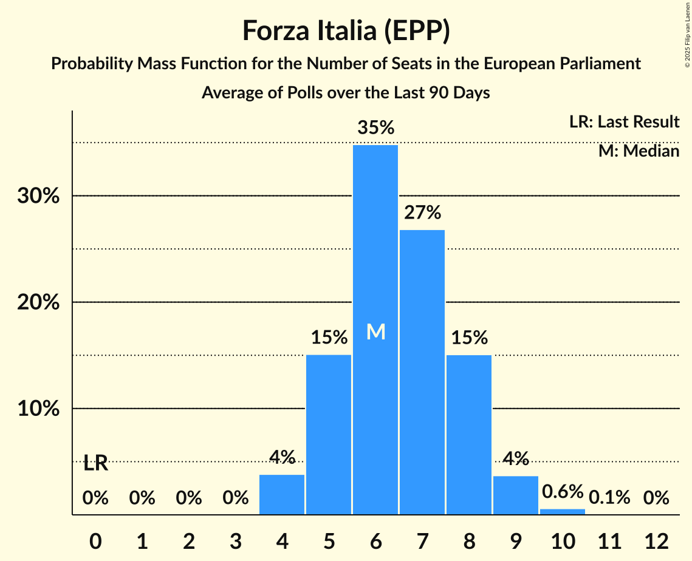

# Forza Italia (EPP)

<a href="#voting-intentions">Voting Intentions</a> | <a href="#seats">Seats</a>

## Voting Intentions

Last result: **16.8%** (General Election of 26 May 2019)

### Confidence Intervals

| Period     | Polling firm/Commissioner(s) | Median | 80% Confidence Interval | 90% Confidence Interval | 95% Confidence Interval | 99% Confidence Interval |
|:----------:|:----------------:|:-----------:|:-----------------------:|:-----------------------:|:-----------------------:|:-----------------------:|
| N/A | [Poll Average](average.html) | 7.5% | 6.0–9.0% | 5.6–9.3% | 5.4–9.6% | 5.0–10.1% |
| [13 June 2019](2019-06-13-IndexResearch.html) | Index Research   LA7 | 6.8% | 5.7–8.0% | 5.4–8.4% | 5.2–8.7% | 4.8–9.4% |
| [11 June 2019](2019-06-11-EMG.html) | EMG   Rai 3 | 8.6% | 7.8–9.5% | 7.5–9.8% | 7.3–10.0% | 7.0–10.5% |
| [9–10 June 2019](2019-06-10-Tecnè.html) | Tecnè   Rete 4 | 8.7% | N/A | N/A | N/A | N/A |
| [5–10 June 2019](2019-06-10-SWG.html) | SWG   LA7 | 6.3% | 5.6–7.2% | 5.4–7.5% | 5.2–7.7% | 4.9–8.1% |
| [10 June 2019](2019-06-10-Piepoli.html) | Piepoli   Rai 1 | 7.9% | N/A | N/A | N/A | N/A |
| [1–10 June 2019](2019-06-10-NotoSondaggi.html) | Noto Sondaggi   Rai 3 | 8.0% | N/A | N/A | N/A | N/A |
| [10 June 2019](2019-06-10-Euromedia.html) | Euromedia   Rai 1 | 7.0% | N/A | N/A | N/A | N/A |
| [1–7 June 2019](2019-06-07-IndexResearch.html) | Index Research   LA7 | 6.9% | 5.9–8.2% | 5.6–8.5% | 5.3–8.9% | 4.9–9.5% |
| [2–3 June 2019](2019-06-03-Tecnè.html) | Tecnè   Rete 4 | 9.2% | 8.1–10.5% | 7.8–10.8% | 7.6–11.2% | 7.1–11.8% |
| [29 May–3 June 2019](2019-06-03-SWG.html) | SWG   LA7 | 6.9% | 6.2–7.8% | 5.9–8.1% | 5.7–8.3% | 5.4–8.8% |
| [1 June 2019](2019-06-01-EMG.html) | EMG   Affari Internazionali | 8.1% | 7.2–9.0% | 7.0–9.3% | 6.8–9.5% | 6.4–10.0% |
| [30 May 2019](2019-05-30-Piepoli.html) | Piepoli   Rai 1 | 9.0% | 7.9–10.3% | 7.6–10.6% | 7.4–10.9% | 6.9–11.6% |
| [28–29 May 2019](2019-05-29-ScenariPolitici–Winpoll.html) | Scenari Politici–Winpoll | 7.9% | 7.1–8.9% | 6.9–9.2% | 6.7–9.4% | 6.3–9.9% |

### Probability Mass Function

The following table shows the probability mass function per percentage block of voting intentions for the [poll average](average.html) for Forza Italia (EPP).

| Voting Intentions | Probability | Accumulated | Special Marks |
|:-----------------:|:-----------:|:-----------:|:-------------:|
| 3.5–4.5% | 0.1% | 100% |  |
| 4.5–5.5% | 4% | 99.9% |  |
| 5.5–6.5% | 21% | 96% |  |
| 6.5–7.5% | 26% | 75% | Median |
| 7.5–8.5% | 29% | 48% |  |
| 8.5–9.5% | 17% | 20% |  |
| 9.5–10.5% | 3% | 3% |  |
| 10.5–11.5% | 0.1% | 0.1% |  |
| 11.5–12.5% | 0% | 0% |  |
| 12.5–13.5% | 0% | 0% |  |
| 13.5–14.5% | 0% | 0% |  |
| 14.5–15.5% | 0% | 0% |  |
| 15.5–16.5% | 0% | 0% |  |
| 16.5–17.5% | 0% | 0% | Last Result |

## Seats

Last result: **13** seats (General Election of 26 May 2019)

### Confidence Intervals

| Period     | Polling firm/Commissioner(s) | Median | 80% Confidence Interval | 90% Confidence Interval | 95% Confidence Interval | 99% Confidence Interval |
|:----------:|:----------------:|:------:|:-----------------------:|:-----------------------:|:-----------------------:|:-----------------------:|
| N/A | [Poll Average](average.html) | 6 | 5–7 | 4–7 | 4–7 | 4–7 |
| [13 June 2019](2019-06-13-IndexResearch.html) | Index Research   LA7 | 5 | 5 | 4–5 | 4–5 | 4–7 |
| [11 June 2019](2019-06-11-EMG.html) | EMG   Rai 3 | 7 | 7 | 7 | 6–7 | 6–7 |
| [9–10 June 2019](2019-06-10-Tecnè.html) | Tecnè   Rete 4 |  |  |  |  |  |
| [5–10 June 2019](2019-06-10-SWG.html) | SWG   LA7 | 5 | 4–6 | 4–6 | 4–6 | 4–6 |
| [10 June 2019](2019-06-10-Piepoli.html) | Piepoli   Rai 1 |  |  |  |  |  |
| [1–10 June 2019](2019-06-10-NotoSondaggi.html) | Noto Sondaggi   Rai 3 |  |  |  |  |  |
| [10 June 2019](2019-06-10-Euromedia.html) | Euromedia   Rai 1 |  |  |  |  |  |
| [1–7 June 2019](2019-06-07-IndexResearch.html) | Index Research   LA7 | 5 | 4–6 | 4–6 | 4–7 | 4–7 |
| [2–3 June 2019](2019-06-03-Tecnè.html) | Tecnè   Rete 4 | 7 | 6–8 | 6–8 | 5–8 | 5–9 |
| [29 May–3 June 2019](2019-06-03-SWG.html) | SWG   LA7 | 5 | 5–6 | 5–6 | 4–6 | 4–7 |
| [1 June 2019](2019-06-01-EMG.html) | EMG   Affari Internazionali | 6 | 6–7 | 6–7 | 5–8 | 5–8 |
| [30 May 2019](2019-05-30-Piepoli.html) | Piepoli   Rai 1 | 7 | 6–8 | 6–8 | 6–8 | 5–9 |
| [28–29 May 2019](2019-05-29-ScenariPolitici–Winpoll.html) | Scenari Politici–Winpoll | 6 | 5–7 | 5–7 | 5–7 | 5–8 |

### Probability Mass Function

The following table shows the probability mass function per seat for the [poll average](average.html) for Forza Italia (EPP).

| Number of Seats | Probability | Accumulated | Special Marks |
|:---------------:|:-----------:|:-----------:|:-------------:|
| 4 | 7% | 100% |  |
| 5 | 43% | 93% |  |
| 6 | 21% | 50% | Median |
| 7 | 30% | 30% |  |
| 8 | 0.2% | 0.2% |  |
| 9 | 0% | 0% |  |
| 10 | 0% | 0% |  |
| 11 | 0% | 0% |  |
| 12 | 0% | 0% |  |
| 13 | 0% | 0% | Last Result |

