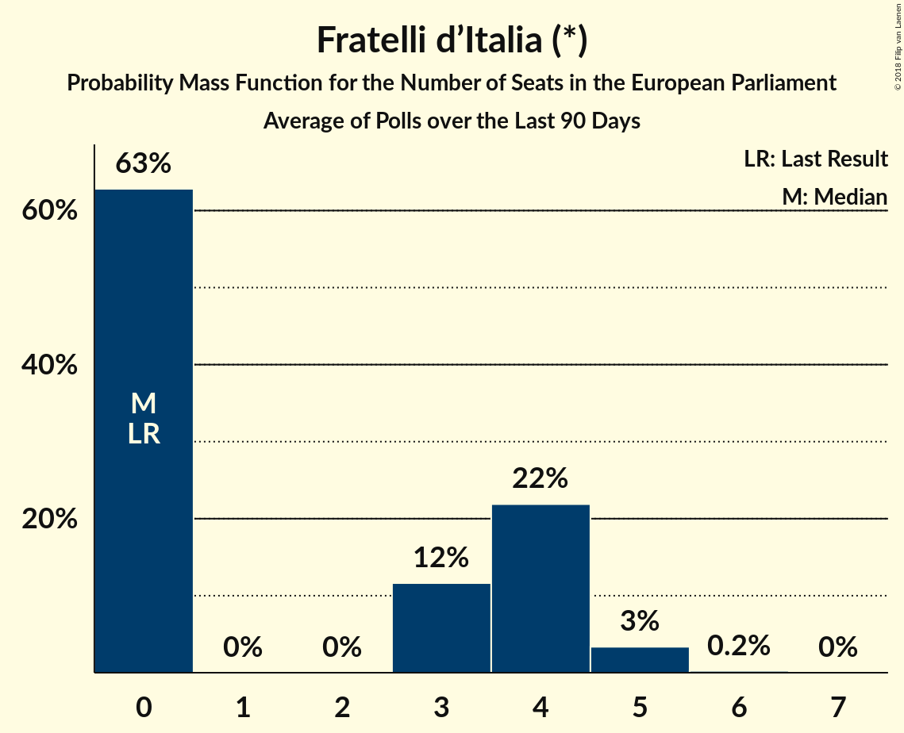

# Fratelli d’Italia (*)

<a href="#voting-intentions">Voting Intentions</a> | <a href="#seats">Seats</a>

## Voting Intentions

Last result: **3.7%** (General Election of 25 May 2014)

### Confidence Intervals

| Period     | Polling firm/Commissioner(s) | Median | 80% Confidence Interval | 90% Confidence Interval | 95% Confidence Interval | 99% Confidence Interval |
|:----------:|:----------------:|:-----------:|:-----------------------:|:-----------------------:|:-----------------------:|:-----------------------:|
| N/A | [Poll Average](average.html) | 3.9% | 3.0–5.0% | 2.8–5.3% | 2.7–5.6% | 2.3–6.1% |
| [20 June 2018](2018-06-20-Tecnè.html) | Tecnè   TGcom24 | 3.3% | 2.7–4.1% | 2.5–4.4% | 2.4–4.6% | 2.1–5.0% |
| [19–20 June 2018](2018-06-20-Euromedia.html) | Euromedia   Rai 1 | 4.2% | 3.5–5.3% | 3.2–5.6% | 3.0–5.9% | 2.7–6.4% |
| [19–20 June 2018](2018-06-20-Demopolis.html) | Demopolis   LA7 | 3.8% | 3.2–4.5% | 3.1–4.7% | 2.9–4.9% | 2.7–5.3% |
| [18–19 June 2018](2018-06-19-Piepoli.html) | Piepoli   Rai 1 | 3.0% | 2.2–4.2% | 2.0–4.5% | 1.8–4.9% | 1.5–5.5% |
| [13–18 June 2018](2018-06-18-SWG.html) | SWG   LA7 | 4.1% | 3.5–4.8% | 3.3–5.0% | 3.2–5.2% | 2.9–5.6% |
| [14–16 June 2018](2018-06-16-Ixè.html) | Ixè   Huffington Post | 4.1% | 3.4–5.0% | 3.2–5.3% | 3.0–5.5% | 2.7–6.0% |
| [11–15 June 2018](2018-06-15-TermometroPolitico.html) | Termometro Politico | 2.8% | 2.4–3.3% | 2.3–3.4% | 2.2–3.6% | 2.0–3.8% |
| [12–13 June 2018](2018-06-13-Euromedia.html) | Euromedia   Rai 1 | 4.2% | 3.5–5.3% | 3.2–5.6% | 3.0–5.9% | 2.7–6.4% |
| [12 June 2018](2018-06-12-Tecnè.html) | Tecnè   Canale 5 | 3.6% | 2.9–4.5% | 2.8–4.7% | 2.6–5.0% | 2.3–5.4% |
| [11–12 June 2018](2018-06-12-Piepoli.html) | Piepoli   Rai 1 | 3.6% | 2.7–4.9% | 2.5–5.2% | 2.3–5.6% | 1.9–6.2% |
| [6–11 June 2018](2018-06-11-SWG.html) | SWG   LA7 | 3.9% | 3.4–4.7% | 3.2–4.9% | 3.1–5.0% | 2.8–5.4% |
| [6 June 2018](2018-06-06-IndexResearch.html) | Index Research   LA7 | 3.2% | 2.6–4.2% | 2.4–4.5% | 2.2–4.7% | 1.9–5.2% |
| [30 May–4 June 2018](2018-06-04-SWG.html) | SWG   LA7 | 3.7% | 3.2–4.5% | 3.0–4.6% | 2.9–4.8% | 2.6–5.2% |
| [4 June 2018](2018-06-04-Piepoli.html) | Piepoli   Sky TG 24 | 2.9% | 2.2–4.0% | 2.0–4.3% | 1.9–4.6% | 1.6–5.2% |
| [1–3 June 2018](2018-06-03-EMGAcqua.html) | EMG Acqua   Rai 3 | 5.2% | 4.6–6.0% | 4.4–6.2% | 4.3–6.4% | 4.0–6.7% |
| [30–31 May 2018](2018-05-31-Ipsos.html) | Ipsos   Corriere della Sera | 3.9% | 3.2–4.8% | 3.0–5.1% | 2.9–5.3% | 2.6–5.7% |
| [30–31 May 2018](2018-05-31-IndexResearch.html) | Index Research   LA7 | 3.5% | 2.8–4.5% | 2.6–4.8% | 2.4–5.0% | 2.1–5.5% |
| [29–30 May 2018](2018-05-30-Demopolis.html) | Demopolis | 4.0% | 3.4–4.7% | 3.2–4.9% | 3.1–5.1% | 2.9–5.5% |
| [29 May 2018](2018-05-29-TermometroPolitico.html) | Termometro Politico | 3.1% | 2.8–3.4% | 2.7–3.5% | 2.7–3.6% | 2.6–3.7% |
| [29 May 2018](2018-05-29-Tecnè.html) | Tecnè   TGcom24 | 3.5% | 2.8–4.5% | 2.6–4.7% | 2.4–5.0% | 2.1–5.5% |
| [29 May 2018](2018-05-29-Piepoli.html) | Piepoli   Rai 1 | 3.6% | 2.7–4.9% | 2.5–5.2% | 2.3–5.6% | 1.9–6.3% |
| [29 May 2018](2018-05-29-Euromedia.html) | Euromedia   Rai 1 | 3.8% | 3.0–4.8% | 2.8–5.1% | 2.6–5.3% | 2.3–5.8% |
| [23–28 May 2018](2018-05-28-SWG.html) | SWG   LA7 | 3.8% | 3.3–4.4% | 3.2–4.6% | 3.1–4.7% | 2.9–5.0% |
| [23–28 May 2018](2018-05-28-BiDiMedia.html) | BiDiMedia | 3.6% | 2.9–4.5% | 2.7–4.7% | 2.6–5.0% | 2.3–5.4% |
| [22–24 May 2018](2018-05-24-EMGAcqua.html) | EMG Acqua   Rai 3 | 4.9% | 4.3–5.7% | 4.1–5.9% | 3.9–6.1% | 3.6–6.5% |
| [23 May 2018](2018-05-23-IndexResearch.html) | Index Research   LA7 | 4.2% | 3.5–5.3% | 3.2–5.6% | 3.0–5.9% | 2.7–6.4% |
| [22–23 May 2018](2018-05-23-Demopolis.html) | Demopolis | 4.0% | 3.4–4.7% | 3.2–4.9% | 3.1–5.1% | 2.9–5.5% |
| [16–20 May 2018](2018-05-20-SWG.html) | SWG   LA7 | 4.7% | 4.1–5.5% | 3.9–5.7% | 3.8–5.9% | 3.5–6.3% |
| [16–18 May 2018](2018-05-18-Tecnè.html) | Tecnè   TGcom24 | 3.8% | 3.3–4.4% | 3.2–4.6% | 3.0–4.7% | 2.8–5.0% |
| [17–18 May 2018](2018-05-18-DemosPi.html) | Demos & Pi | 3.7% | 3.0–4.6% | 2.8–4.8% | 2.7–5.0% | 2.4–5.5% |
| [16–17 May 2018](2018-05-17-Ipsos.html) | Ipsos   Corriere della Sera | 3.4% | 2.8–4.3% | 2.6–4.5% | 2.4–4.7% | 2.2–5.2% |
| [15–17 May 2018](2018-05-17-EMGAcqua.html) | EMG Acqua   Rai 3 | 4.8% | 4.2–5.5% | 4.0–5.7% | 3.9–5.9% | 3.6–6.3% |
| [16 May 2018](2018-05-16-IndexResearch.html) | Index Research   LA7 | 4.2% | 3.5–5.3% | 3.2–5.6% | 3.0–5.9% | 2.7–6.4% |
| [16 May 2018](2018-05-16-Euromedia.html) | Euromedia   Rai 1 | 4.2% | 3.5–5.3% | 3.2–5.6% | 3.0–5.9% | 2.7–6.4% |
| [9–13 May 2018](2018-05-13-SWG.html) | SWG   LA7 | 3.8% | 3.2–4.5% | 3.1–4.7% | 2.9–4.9% | 2.7–5.3% |
| [10–11 May 2018](2018-05-11-Ixè.html) | Ixè   Huffington Post | 4.1% | 3.4–5.0% | 3.2–5.3% | 3.0–5.5% | 2.7–6.0% |
| [9–10 May 2018](2018-05-10-Euromedia.html) | Euromedia | 3.9% | 3.1–4.9% | 2.9–5.2% | 2.7–5.5% | 2.4–6.0% |
| [8–10 May 2018](2018-05-10-EMGAcqua.html) | EMG Acqua   Rai 3 | 4.8% | 4.2–5.5% | 4.0–5.7% | 3.8–5.9% | 3.6–6.3% |
| [9–10 May 2018](2018-05-10-Demopolis.html) | Demopolis   LA7 | 4.0% | 3.4–4.7% | 3.2–4.9% | 3.1–5.1% | 2.9–5.5% |
| [8 May 2018](2018-05-08-Tecnè.html) | Tecnè   Canale 5 | 4.0% | 3.3–4.9% | 3.1–5.2% | 3.0–5.4% | 2.7–5.9% |
| [7 May 2018](2018-05-07-Piepoli.html) | Piepoli   Sky TG 24 | 4.0% | 3.0–5.3% | 2.8–5.7% | 2.6–6.1% | 2.2–6.8% |
| [5–6 May 2018](2018-05-06-Tecnè.html) | Tecnè   TGcom24 | 4.0% | 3.4–4.7% | 3.2–4.9% | 3.1–5.1% | 2.9–5.5% |
| [3–6 May 2018](2018-05-06-SWG.html) | SWG | 4.4% | 3.8–5.2% | 3.6–5.4% | 3.5–5.6% | 3.2–6.0% |
| [2–3 May 2018](2018-05-03-Ipsos.html) | Ipsos   Corriere della Sera | 3.6% | 2.9–4.5% | 2.8–4.7% | 2.6–5.0% | 2.3–5.4% |
| [2–3 May 2018](2018-05-03-EMGAcqua.html) | EMG Acqua   Rai 3 | 4.6% | 4.0–5.3% | 3.8–5.5% | 3.7–5.7% | 3.4–6.1% |
| [2 May 2018](2018-05-02-IndexResearch.html) | Index Research | 4.1% | 3.4–5.2% | 3.1–5.5% | 3.0–5.7% | 2.6–6.3% |
| [30 April 2018](2018-04-30-Tecnè.html) | Tecnè   Canale 5 | 4.4% | 3.8–5.1% | 3.6–5.3% | 3.5–5.5% | 3.2–5.9% |
| [30 April 2018](2018-04-30-Piepoli.html) | Piepoli   Rai 1 | 4.0% | 3.0–5.3% | 2.8–5.7% | 2.6–6.1% | 2.2–6.8% |
| [30 April 2018](2018-04-30-Euromedia.html) | Euromedia   Rai 1 | 4.1% | 3.4–5.2% | 3.1–5.5% | 3.0–5.7% | 2.6–6.3% |
| [24–30 April 2018](2018-04-30-Bidimedia.html) | Bidimedia | 4.6% | 3.9–5.7% | 3.6–6.0% | 3.4–6.2% | 3.1–6.7% |
| [26–27 April 2018](2018-04-27-DemosPi.html) | Demos & Pi   La Repubblica | 3.8% | 3.1–4.7% | 2.9–4.9% | 2.8–5.2% | 2.5–5.6% |
| [24–26 April 2018](2018-04-26-EMGAcqua.html) | EMG Acqua   Rai 3 | 4.4% | 3.8–5.2% | 3.7–5.4% | 3.5–5.5% | 3.3–5.9% |
| [23–25 April 2018](2018-04-25-SWG.html) | SWG | 3.9% | 3.4–4.5% | 3.2–4.7% | 3.1–4.8% | 2.9–5.2% |
| [23 April 2018](2018-04-23-Piepoli.html) | Piepoli | 3.6% | 2.7–4.9% | 2.5–5.3% | 2.3–5.6% | 1.9–6.3% |
| [20 April 2018](2018-04-20-Tecnè.html) | Tecnè   TGcom24 | 4.0% | 3.3–4.9% | 3.1–5.2% | 2.9–5.4% | 2.7–5.9% |
| [18–19 April 2018](2018-04-19-Ipsos.html) | Ipsos   Corriere della Sera | 4.3% | 3.6–5.3% | 3.4–5.5% | 3.2–5.8% | 2.9–6.2% |
| [16–18 April 2018](2018-04-18-SWG.html) | SWG | 4.4% | 3.9–5.0% | 3.7–5.2% | 3.6–5.4% | 3.3–5.7% |
| [18 April 2018](2018-04-18-IndexResearch.html) | Index Research   LA7 | 3.8% | 3.0–4.8% | 2.8–5.1% | 2.6–5.3% | 2.3–5.8% |
| [16 April 2018](2018-04-16-Piepoli.html) | Piepoli | 3.6% | 2.7–4.9% | 2.5–5.2% | 2.3–5.6% | 1.9–6.3% |
| [13 April 2018](2018-04-13-Euromedia.html) | Euromedia   Rete 4 | 4.0% | 3.3–4.9% | 3.1–5.2% | 2.9–5.4% | 2.7–5.9% |
| [9–11 April 2018](2018-04-11-SWG.html) | SWG | 4.1% | 3.6–4.7% | 3.4–4.9% | 3.3–5.1% | 3.1–5.4% |
| [9–11 April 2018](2018-04-11-Ixè.html) | Ixè   Huffington Post | 4.6% | 3.9–5.6% | 3.6–5.9% | 3.5–6.1% | 3.1–6.6% |
| [11 April 2018](2018-04-11-IndexResearch.html) | Index Research   LA7 | 3.8% | 3.0–4.8% | 2.8–5.1% | 2.6–5.3% | 2.3–5.8% |
| [9 April 2018](2018-04-09-Piepoli.html) | Piepoli | 3.5% | 2.7–4.8% | 2.5–5.2% | 2.3–5.5% | 1.9–6.2% |
| [9 April 2018](2018-04-09-Euromedia.html) | Euromedia | 4.1% | 3.4–5.0% | 3.2–5.3% | 3.0–5.5% | 2.7–6.0% |
| [5 April 2018](2018-04-05-IndexResearch.html) | Index Research   LA7 | 3.6% | 2.9–4.6% | 2.7–4.9% | 2.5–5.2% | 2.2–5.7% |
| [3–4 April 2018](2018-04-04-SWG.html) | SWG | 3.8% | 3.3–4.4% | 3.2–4.6% | 3.0–4.7% | 2.8–5.0% |
| [3 April 2018](2018-04-03-Tecnè.html) | Tecnè   Canale 5 | 3.9% | 3.2–4.8% | 3.0–5.1% | 2.9–5.3% | 2.6–5.8% |
| [2–3 April 2018](2018-04-03-Demopolis.html) | Demopolis   LA7 | 4.5% | 3.9–5.3% | 3.7–5.5% | 3.6–5.7% | 3.3–6.1% |
| [26–28 March 2018](2018-03-28-SWG.html) | SWG | 4.2% | 3.7–4.9% | 3.6–5.1% | 3.4–5.2% | 3.2–5.5% |
| [28 March 2018](2018-03-28-Piepoli.html) | Piepoli | 3.9% | 3.0–5.3% | 2.8–5.6% | 2.6–6.0% | 2.2–6.7% |
| [27–28 March 2018](2018-03-28-Ipsos.html) | Ipsos   Corriere della Sera | 4.2% | 3.5–5.1% | 3.3–5.4% | 3.1–5.6% | 2.8–6.1% |
| [28 March 2018](2018-03-28-IndexResearch.html) | Index Research   LA7 | 3.4% | 2.7–4.3% | 2.5–4.6% | 2.3–4.9% | 2.0–5.4% |
| [28 March 2018](2018-03-28-Euromedia.html) | Euromedia | 4.5% | 3.7–5.6% | 3.5–5.9% | 3.3–6.2% | 2.9–6.7% |
| [21–25 March 2018](2018-03-25-Bidimedia.html) | Bidimedia | 4.4% | 3.6–5.5% | 3.4–5.7% | 3.2–6.0% | 2.9–6.6% |
| [19–21 March 2018](2018-03-21-SWG.html) | SWG | 3.9% | 3.4–4.5% | 3.2–4.7% | 3.1–4.8% | 2.9–5.2% |
| [21 March 2018](2018-03-21-IndexResearch.html) | Index Research   LA7 | 3.2% | 2.6–4.2% | 2.4–4.5% | 2.2–4.7% | 1.9–5.2% |
| [20 March 2018](2018-03-20-Tecnè.html) | Tecnè   Canale 5 | 4.2% | 3.4–5.3% | 3.2–5.6% | 3.0–5.9% | 2.7–6.4% |
| [19 March 2018](2018-03-19-Piepoli.html) | Piepoli | 3.9% | 3.0–5.3% | 2.8–5.7% | 2.6–6.0% | 2.2–6.7% |
| [19 March 2018](2018-03-19-Euromedia.html) | Euromedia | 4.2% | 3.5–5.3% | 3.2–5.6% | 3.0–5.9% | 2.7–6.4% |
| [15 March 2018](2018-03-15-Piepoli.html) | Piepoli   La Stampa | 3.9% | 3.0–5.2% | 2.8–5.6% | 2.5–6.0% | 2.2–6.7% |
| [12–15 March 2018](2018-03-15-DemosPi.html) | Demos & Pi   La Repubblica | 4.8% | 4.1–5.7% | 3.9–5.9% | 3.7–6.2% | 3.4–6.6% |
| [12–14 March 2018](2018-03-14-SWG.html) | SWG   Il Messaggero | 3.1% | 2.5–3.9% | 2.3–4.2% | 2.2–4.4% | 1.9–4.8% |
| [12–16 February 2018](2018-02-16-TermometroPolitico.html) | Termometro Politico | 5.0% | 4.6–5.4% | 4.5–5.6% | 4.4–5.7% | 4.2–5.9% |
| [14–15 February 2018](2018-02-15-Demopolis.html) | Demopolis | 5.0% | 4.4–5.7% | 4.3–5.9% | 4.1–6.1% | 3.9–6.4% |
| [12–14 February 2018](2018-02-14-SWG.html) | SWG | 4.4% | 3.9–5.0% | 3.7–5.2% | 3.6–5.4% | 3.3–5.7% |
| [13–14 February 2018](2018-02-14-Piepoli.html) | Piepoli | 5.0% | 3.9–6.4% | 3.6–6.8% | 3.4–7.2% | 2.9–8.0% |
| [12–14 February 2018](2018-02-14-Ixè.html) | Ixè   Huffington Post | 4.7% | 3.9–5.7% | 3.7–6.0% | 3.6–6.2% | 3.2–6.7% |
| [12–14 February 2018](2018-02-14-Index.html) | Index | 4.9% | 4.0–6.0% | 3.8–6.3% | 3.6–6.6% | 3.2–7.2% |
| [14 February 2018](2018-02-14-Euromedia.html) | Euromedia | 4.9% | 4.0–6.0% | 3.8–6.3% | 3.6–6.6% | 3.2–7.2% |
| [12–14 February 2018](2018-02-14-DemosPi.html) | Demos & Pi   La Repubblica | 4.8% | 4.1–5.8% | 3.9–6.1% | 3.7–6.3% | 3.3–6.8% |
| [5–14 February 2018](2018-02-14-Demetra.html) | Demetra | 4.4% | 4.1–4.8% | 4.0–4.9% | 3.9–5.0% | 3.7–5.1% |
| [12–13 February 2018](2018-02-13-Tecnè.html) | Tecnè | 5.0% | 4.2–6.0% | 4.0–6.3% | 3.8–6.5% | 3.5–7.0% |
| [12 February 2018](2018-02-12-Euromedia.html) | Euromedia | 4.8% | 3.9–5.9% | 3.7–6.2% | 3.5–6.5% | 3.1–7.0% |
| [8–12 February 2018](2018-02-12-Bidimedia.html) | Bidimedia | 3.9% | 3.3–4.7% | 3.1–4.9% | 3.0–5.1% | 2.7–5.5% |
| [8–11 February 2018](2018-02-11-LorienConsulting.html) | Lorien Consulting | 4.6% | 3.9–5.6% | 3.6–5.9% | 3.5–6.1% | 3.1–6.6% |
| [9–11 February 2018](2018-02-11-EMG.html) | EMG   TG LA7 | 4.6% | 4.0–5.3% | 3.8–5.5% | 3.7–5.7% | 3.4–6.1% |
| [3–8 February 2018](2018-02-08-TermometroPolitico.html) | Termometro Politico | 5.5% | 5.0–6.1% | 4.9–6.2% | 4.8–6.3% | 4.6–6.6% |
| [8 February 2018](2018-02-08-Index.html) | Index | 5.0% | 4.1–6.1% | 3.9–6.5% | 3.7–6.8% | 3.3–7.3% |
| [6–7 February 2018](2018-02-07-Tecnè.html) | Tecnè | 4.9% | 4.1–5.9% | 3.9–6.2% | 3.7–6.4% | 3.4–6.9% |
| [5–7 February 2018](2018-02-07-SWG.html) | SWG | 4.8% | 4.2–5.6% | 4.0–5.8% | 3.8–6.0% | 3.5–6.4% |

### Probability Mass Function

The following table shows the probability mass function per percentage block of voting intentions for the [poll average](average.html) for Fratelli d’Italia (*).

| Voting Intentions | Probability | Accumulated | Special Marks |
|:-----------------:|:-----------:|:-----------:|:-------------:|
| 0.5–1.5% | 0% | 100% |  |
| 1.5–2.5% | 2% | 100% |  |
| 2.5–3.5% | 32% | 98% |  |
| 3.5–4.5% | 46% | 66% | Last Result, Median |
| 4.5–5.5% | 18% | 21% |  |
| 5.5–6.5% | 3% | 3% |  |
| 6.5–7.5% | 0.1% | 0.1% |  |
| 7.5–8.5% | 0% | 0% |  |

## Seats

Last result: **0** seats (General Election of 25 May 2014)

### Confidence Intervals

| Period     | Polling firm/Commissioner(s) | Median | 80% Confidence Interval | 90% Confidence Interval | 95% Confidence Interval | 99% Confidence Interval |
|:----------:|:----------------:|:------:|:-----------------------:|:-----------------------:|:-----------------------:|:-----------------------:|
| N/A | [Poll Average](average.html) | 0 | 0–4 | 0–4 | 0–5 | 0–5 |
| [20 June 2018](2018-06-20-Tecnè.html) | Tecnè   TGcom24 | 0 | 0–3 | 0–3 | 0–3 | 0–4 |
| [19–20 June 2018](2018-06-20-Euromedia.html) | Euromedia   Rai 1 | 4 | 0–4 | 0–4 | 0–4 | 0–6 |
| [19–20 June 2018](2018-06-20-Demopolis.html) | Demopolis   LA7 | 0 | 0 | 0 | 0 | 0–3 |
| [18–19 June 2018](2018-06-19-Piepoli.html) | Piepoli   Rai 1 | 0 | 0–4 | 0–4 | 0–4 | 0–4 |
| [13–18 June 2018](2018-06-18-SWG.html) | SWG   LA7 | 4 | 0–5 | 0–5 | 0–5 | 0–5 |
| [14–16 June 2018](2018-06-16-Ixè.html) | Ixè   Huffington Post | 4 | 4 | 0–4 | 0–4 | 0–4 |
| [11–15 June 2018](2018-06-15-TermometroPolitico.html) | Termometro Politico | 0 | 0 | 0 | 0 | 0–3 |
| [12–13 June 2018](2018-06-13-Euromedia.html) | Euromedia   Rai 1 | 5 | 4–5 | 4–5 | 4–5 | 0–5 |
| [12 June 2018](2018-06-12-Tecnè.html) | Tecnè   Canale 5 | 0 | 0 | 0–3 | 0–3 | 0–5 |
| [11–12 June 2018](2018-06-12-Piepoli.html) | Piepoli   Rai 1 | 4 | 3–4 | 0–4 | 0–4 | 0–4 |
| [6–11 June 2018](2018-06-11-SWG.html) | SWG   LA7 | 4 | 0–4 | 0–4 | 0–4 | 0–4 |
| [6 June 2018](2018-06-06-IndexResearch.html) | Index Research   LA7 | 0 | 0 | 0 | 0 | 0–3 |
| [30 May–4 June 2018](2018-06-04-SWG.html) | SWG   LA7 | 3 | 3 | 3 | 3 | 0–4 |
| [4 June 2018](2018-06-04-Piepoli.html) | Piepoli   Sky TG 24 | 0 | 0 | 0 | 0 | 0 |
| [1–3 June 2018](2018-06-03-EMGAcqua.html) | EMG Acqua   Rai 3 | 5 | 4–5 | 4–5 | 4–5 | 4–5 |
| [30–31 May 2018](2018-05-31-Ipsos.html) | Ipsos   Corriere della Sera | 0 | 0–4 | 0–4 | 0–4 | 0–5 |
| [30–31 May 2018](2018-05-31-IndexResearch.html) | Index Research   LA7 | 0 | 0–4 | 0–4 | 0–4 | 0–4 |
| [29–30 May 2018](2018-05-30-Demopolis.html) | Demopolis | 3 | 0–4 | 0–4 | 0–4 | 0–4 |
| [29 May 2018](2018-05-29-TermometroPolitico.html) | Termometro Politico | 0 | 0 | 0 | 0 | 0 |
| [29 May 2018](2018-05-29-Tecnè.html) | Tecnè   TGcom24 | 0 | 0–3 | 0–4 | 0–4 | 0–4 |
| [29 May 2018](2018-05-29-Piepoli.html) | Piepoli   Rai 1 | 0 | 0–4 | 0–4 | 0–4 | 0–5 |
| [29 May 2018](2018-05-29-Euromedia.html) | Euromedia   Rai 1 | 0 | 0–4 | 0–4 | 0–4 | 0–5 |
| [23–28 May 2018](2018-05-28-SWG.html) | SWG   LA7 | 0 | 0–4 | 0–4 | 0–4 | 0–4 |
| [23–28 May 2018](2018-05-28-BiDiMedia.html) | BiDiMedia | 0 | 0–4 | 0–4 | 0–4 | 0–4 |
| [22–24 May 2018](2018-05-24-EMGAcqua.html) | EMG Acqua   Rai 3 | 4 | 3–5 | 3–5 | 0–5 | 0–5 |
| [23 May 2018](2018-05-23-IndexResearch.html) | Index Research   LA7 | 3 | 0–4 | 0–4 | 0–5 | 0–5 |
| [22–23 May 2018](2018-05-23-Demopolis.html) | Demopolis | 3 | 0–4 | 0–4 | 0–4 | 0–4 |
| [16–20 May 2018](2018-05-20-SWG.html) | SWG   LA7 | 4 | 3–5 | 0–5 | 0–5 | 0–5 |
| [16–18 May 2018](2018-05-18-Tecnè.html) | Tecnè   TGcom24 | 0 | 0–3 | 0–4 | 0–4 | 0–4 |
| [17–18 May 2018](2018-05-18-DemosPi.html) | Demos & Pi | 0 | 0–4 | 0–4 | 0–4 | 0–4 |
| [16–17 May 2018](2018-05-17-Ipsos.html) | Ipsos   Corriere della Sera | 0 | 0–3 | 0–4 | 0–4 | 0–4 |
| [15–17 May 2018](2018-05-17-EMGAcqua.html) | EMG Acqua   Rai 3 | 4 | 3–4 | 3–5 | 0–5 | 0–5 |
| [16 May 2018](2018-05-16-IndexResearch.html) | Index Research   LA7 | 3 | 0–4 | 0–4 | 0–5 | 0–5 |
| [16 May 2018](2018-05-16-Euromedia.html) | Euromedia   Rai 1 | 3 | 0–4 | 0–4 | 0–5 | 0–5 |
| [9–13 May 2018](2018-05-13-SWG.html) | SWG   LA7 | 0 | 0–4 | 0–4 | 0–4 | 0–5 |
| [10–11 May 2018](2018-05-11-Ixè.html) | Ixè   Huffington Post | 3 | 0–4 | 0–4 | 0–5 | 0–5 |
| [9–10 May 2018](2018-05-10-Euromedia.html) | Euromedia | 0 | 0–4 | 0–4 | 0–4 | 0–5 |
| [8–10 May 2018](2018-05-10-EMGAcqua.html) | EMG Acqua   Rai 3 | 4 | 3–5 | 0–5 | 0–5 | 0–5 |
| [9–10 May 2018](2018-05-10-Demopolis.html) | Demopolis   LA7 | 3 | 0–4 | 0–4 | 0–4 | 0–4 |
| [8 May 2018](2018-05-08-Tecnè.html) | Tecnè   Canale 5 | 3 | 0–4 | 0–4 | 0–4 | 0–5 |
| [7 May 2018](2018-05-07-Piepoli.html) | Piepoli   Sky TG 24 | 3 | 0–4 | 0–5 | 0–5 | 0–5 |
| [5–6 May 2018](2018-05-06-Tecnè.html) | Tecnè   TGcom24 | 3 | 0–4 | 0–4 | 0–4 | 0–4 |
| [3–6 May 2018](2018-05-06-SWG.html) | SWG | 4 | 0–4 | 0–4 | 0–5 | 0–5 |
| [2–3 May 2018](2018-05-03-Ipsos.html) | Ipsos   Corriere della Sera | 0 | 0–4 | 0–4 | 0–4 | 0–4 |
| [2–3 May 2018](2018-05-03-EMGAcqua.html) | EMG Acqua   Rai 3 | 3 | 0–4 | 0–4 | 0–4 | 0–5 |
| [2 May 2018](2018-05-02-IndexResearch.html) | Index Research | 3 | 0–4 | 0–4 | 0–5 | 0–5 |
| [30 April 2018](2018-04-30-Tecnè.html) | Tecnè   Canale 5 | 3 | 0–4 | 0–4 | 0–4 | 0–5 |
| [30 April 2018](2018-04-30-Piepoli.html) | Piepoli   Rai 1 | 3 | 0–4 | 0–5 | 0–5 | 0–5 |
| [30 April 2018](2018-04-30-Euromedia.html) | Euromedia   Rai 1 | 3 | 0–4 | 0–4 | 0–5 | 0–5 |
| [24–30 April 2018](2018-04-30-Bidimedia.html) | Bidimedia | 4 | 3–5 | 0–5 | 0–5 | 0–6 |
| [26–27 April 2018](2018-04-27-DemosPi.html) | Demos & Pi   La Repubblica | 0 | 0–4 | 0–4 | 0–4 | 0–4 |
| [24–26 April 2018](2018-04-26-EMGAcqua.html) | EMG Acqua   Rai 3 | 4 | 0–4 | 0–5 | 0–5 | 0–5 |
| [23–25 April 2018](2018-04-25-SWG.html) | SWG | 0 | 0–4 | 0–4 | 0–4 | 0–4 |
| [23 April 2018](2018-04-23-Piepoli.html) | Piepoli | 0 | 0–4 | 0–4 | 0–4 | 0–5 |
| [20 April 2018](2018-04-20-Tecnè.html) | Tecnè   TGcom24 | 3 | 0–4 | 0–4 | 0–4 | 0–5 |
| [18–19 April 2018](2018-04-19-Ipsos.html) | Ipsos   Corriere della Sera | 4 | 0–4 | 0–5 | 0–5 | 0–5 |
| [16–18 April 2018](2018-04-18-SWG.html) | SWG | 4 | 0–4 | 0–4 | 0–5 | 0–5 |
| [18 April 2018](2018-04-18-IndexResearch.html) | Index Research   LA7 | 0 | 0–4 | 0–4 | 0–4 | 0–5 |
| [16 April 2018](2018-04-16-Piepoli.html) | Piepoli | 0 | 0–4 | 0–4 | 0–4 | 0–5 |
| [13 April 2018](2018-04-13-Euromedia.html) | Euromedia   Rete 4 | 3 | 0–4 | 0–4 | 0–4 | 0–5 |
| [9–11 April 2018](2018-04-11-SWG.html) | SWG | 0 | 0–4 | 0–4 | 0–4 | 0–5 |
| [9–11 April 2018](2018-04-11-Ixè.html) | Ixè   Huffington Post | 4 | 0–5 | 0–5 | 0–5 | 0–6 |
| [11 April 2018](2018-04-11-IndexResearch.html) | Index Research   LA7 | 0 | 0–4 | 0–4 | 0–4 | 0–5 |
| [9 April 2018](2018-04-09-Piepoli.html) | Piepoli | 0 | 0–4 | 0–4 | 0–4 | 0–5 |
| [9 April 2018](2018-04-09-Euromedia.html) | Euromedia | 3 | 0–4 | 0–4 | 0–4 | 0–5 |
| [5 April 2018](2018-04-05-IndexResearch.html) | Index Research   LA7 | 0 | 0–4 | 0–4 | 0–4 | 0–4 |
| [3–4 April 2018](2018-04-04-SWG.html) | SWG | 0 | 0–4 | 0–4 | 0–4 | 0–4 |
| [3 April 2018](2018-04-03-Tecnè.html) | Tecnè   Canale 5 | 0 | 0–4 | 0–4 | 0–4 | 0–5 |
| [2–3 April 2018](2018-04-03-Demopolis.html) | Demopolis   LA7 | 4 | 0–4 | 0–4 | 0–4 | 0–5 |
| [26–28 March 2018](2018-03-28-SWG.html) | SWG | 0 | 0–4 | 0–4 | 0–4 | 0–5 |
| [28 March 2018](2018-03-28-Piepoli.html) | Piepoli | 0 | 0–4 | 0–5 | 0–5 | 0–5 |
| [27–28 March 2018](2018-03-28-Ipsos.html) | Ipsos   Corriere della Sera | 3 | 0–4 | 0–4 | 0–5 | 0–5 |
| [28 March 2018](2018-03-28-IndexResearch.html) | Index Research   LA7 | 0 | 0–3 | 0–4 | 0–4 | 0–4 |
| [28 March 2018](2018-03-28-Euromedia.html) | Euromedia | 4 | 0–4 | 0–5 | 0–5 | 0–5 |
| [21–25 March 2018](2018-03-25-Bidimedia.html) | Bidimedia | 4 | 0–5 | 0–5 | 0–5 | 0–6 |
| [19–21 March 2018](2018-03-21-SWG.html) | SWG | 0 | 0–4 | 0–4 | 0–4 | 0–4 |
| [21 March 2018](2018-03-21-IndexResearch.html) | Index Research   LA7 | 0 | 0–3 | 0–4 | 0–4 | 0–4 |
| [20 March 2018](2018-03-20-Tecnè.html) | Tecnè   Canale 5 | 3 | 0–4 | 0–4 | 0–5 | 0–5 |
| [19 March 2018](2018-03-19-Piepoli.html) | Piepoli | 0 | 0–4 | 0–5 | 0–5 | 0–5 |
| [19 March 2018](2018-03-19-Euromedia.html) | Euromedia | 4 | 0–4 | 0–4 | 0–5 | 0–5 |
| [15 March 2018](2018-03-15-Piepoli.html) | Piepoli   La Stampa | 0 | 0–4 | 0–5 | 0–5 | 0–5 |
| [12–15 March 2018](2018-03-15-DemosPi.html) | Demos & Pi   La Repubblica | 4 | 3–4 | 0–5 | 0–5 | 0–5 |
| [12–14 March 2018](2018-03-14-SWG.html) | SWG   Il Messaggero | 0 | 0 | 0–3 | 0–4 | 0–4 |
| [12–16 February 2018](2018-02-16-TermometroPolitico.html) | Termometro Politico | 4 | 4–5 | 4–5 | 4–5 | 3–5 |
| [14–15 February 2018](2018-02-15-Demopolis.html) | Demopolis | 4 | 4–5 | 4–5 | 3–5 | 0–5 |
| [12–14 February 2018](2018-02-14-SWG.html) | SWG | 4 | 4 | 0–4 | 0–5 | 0–5 |
| [13–14 February 2018](2018-02-14-Piepoli.html) | Piepoli | 4 | 4–5 | 0–6 | 0–6 | 0–7 |
| [12–14 February 2018](2018-02-14-Ixè.html) | Ixè   Huffington Post | 4 | 0–5 | 0–5 | 0–5 | 0–6 |
| [12–14 February 2018](2018-02-14-Index.html) | Index | 4 | 4–5 | 3–5 | 0–5 | 0–6 |
| [14 February 2018](2018-02-14-Euromedia.html) | Euromedia | 4 | 3–5 | 3–5 | 0–5 | 0–6 |
| [12–14 February 2018](2018-02-14-DemosPi.html) | Demos & Pi   La Repubblica | 4 | 3–5 | 0–5 | 0–5 | 0–5 |
| [5–14 February 2018](2018-02-14-Demetra.html) | Demetra | 4 | 3–4 | 3–4 | 3–4 | 0–4 |
| [12–13 February 2018](2018-02-13-Tecnè.html) | Tecnè | 4 | 3–5 | 0–5 | 0–5 | 0–6 |
| [12 February 2018](2018-02-12-Euromedia.html) | Euromedia | 4 | 0–5 | 0–5 | 0–5 | 0–6 |
| [8–12 February 2018](2018-02-12-Bidimedia.html) | Bidimedia | 3 | 0–4 | 0–4 | 0–5 | 0–5 |
| [8–11 February 2018](2018-02-11-LorienConsulting.html) | Lorien Consulting | 4 | 3–5 | 0–5 | 0–5 | 0–5 |
| [9–11 February 2018](2018-02-11-EMG.html) | EMG   TG LA7 | 4 | 0–4 | 0–5 | 0–5 | 0–5 |
| [3–8 February 2018](2018-02-08-TermometroPolitico.html) | Termometro Politico | 5 | 4–5 | 4–5 | 4–6 | 4–6 |
| [8 February 2018](2018-02-08-Index.html) | Index | 4 | 3–5 | 3–5 | 0–6 | 0–6 |
| [6–7 February 2018](2018-02-07-Tecnè.html) | Tecnè | 4 | 3–5 | 0–5 | 0–5 | 0–6 |
| [5–7 February 2018](2018-02-07-SWG.html) | SWG | 4 | 3–5 | 0–5 | 0–5 | 0–5 |

### Probability Mass Function

The following table shows the probability mass function per seat for the [poll average](average.html) for Fratelli d’Italia (*).

| Number of Seats | Probability | Accumulated | Special Marks |
|:---------------:|:-----------:|:-----------:|:-------------:|
| 0 | 59% | 100% | Last Result, Median |
| 1 | 0% | 41% |  |
| 2 | 0% | 41% |  |
| 3 | 12% | 41% |  |
| 4 | 26% | 29% |  |
| 5 | 3% | 3% |  |
| 6 | 0.1% | 0.1% |  |
| 7 | 0% | 0% |  |

