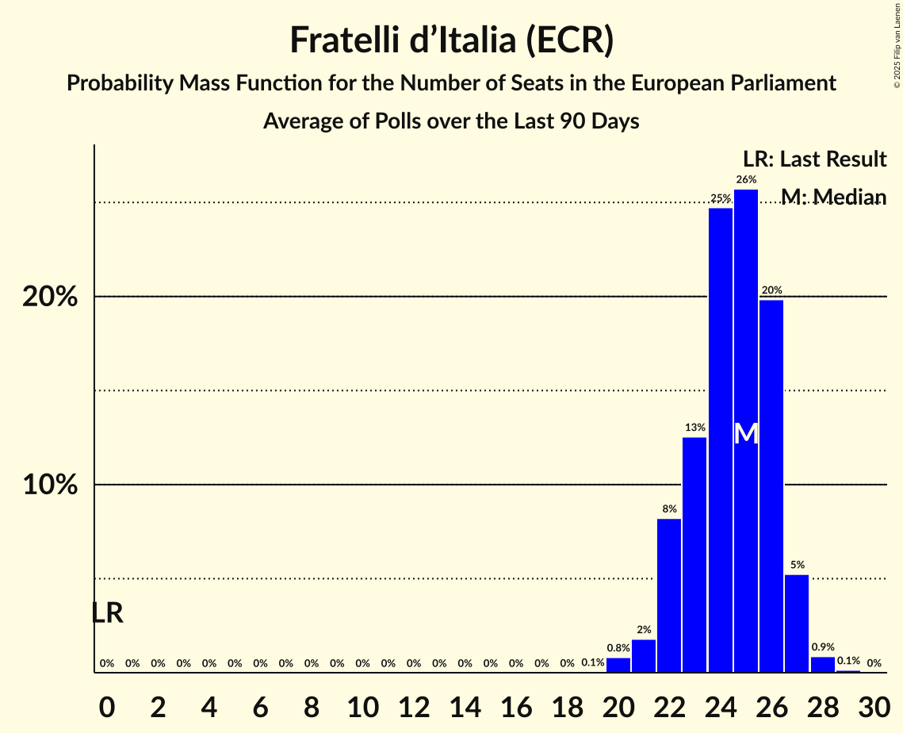

# Fratelli d’Italia (ECR)

<a href="#voting-intentions">Voting Intentions</a> | <a href="#seats">Seats</a>

## Voting Intentions

Last result: **3.7%** (General Election of 26 May 2019)

### Confidence Intervals

| Period     | Polling firm/Commissioner(s) | Median | 80% Confidence Interval | 90% Confidence Interval | 95% Confidence Interval | 99% Confidence Interval |
|:----------:|:----------------:|:-----------:|:-----------------------:|:-----------------------:|:-----------------------:|:-----------------------:|
| N/A | [Poll Average](average.html) | 20.9% | 18.6–22.7% | 17.8–23.3% | 17.2–23.7% | 16.2–24.6% |
| [20–24 April 2022](2022-04-24-SWG.html) | SWG   La7 | 21.7% | 20.2–23.3% | 19.8–23.7% | 19.4–24.1% | 18.7–24.9% |
| [20–23 April 2022](2022-04-23-Lab2101.html) | Lab2101   Affari Italiani | 18.1% | 16.6–19.7% | 16.2–20.2% | 15.8–20.6% | 15.2–21.4% |
| [22 April 2022](2022-04-22-Tecnè.html) | Tecnè   Agenzia Dire | 21.9% | 20.3–23.7% | 19.8–24.1% | 19.4–24.6% | 18.7–25.4% |
| [19–20 April 2022](2022-04-20-Demopolis.html) | Demopolis   La7 | 21.5% | 20.2–23.0% | 19.8–23.4% | 19.5–23.7% | 18.9–24.4% |
| [13–19 April 2022](2022-04-19-SWG.html) | SWG   La7 | 21.8% | 20.3–23.4% | 19.9–23.9% | 19.6–24.3% | 18.9–25.0% |
| [13–15 April 2022](2022-04-15-Ixè.html) | Ixè | 19.6% | 18.1–21.3% | 17.6–21.8% | 17.3–22.2% | 16.5–23.0% |
| [13–14 April 2022](2022-04-14-TermometroPolitico.html) | Termometro Politico | 21.3% | 20.3–22.3% | 20.0–22.6% | 19.8–22.8% | 19.3–23.4% |
| [14 April 2022](2022-04-14-Euromedia.html) | Euromedia   Rai 1 | 21.5% | 19.9–23.2% | 19.4–23.7% | 19.1–24.2% | 18.3–25.0% |
| [11–12 April 2022](2022-04-12-DemosPi.html) | Demos & Pi   La Repubblica | 20.7% | 19.1–22.4% | 18.6–22.8% | 18.3–23.3% | 17.5–24.1% |
| [6–11 April 2022](2022-04-11-SWG.html) | SWG   La7 | 21.6% | 20.1–23.2% | 19.7–23.6% | 19.3–24.0% | 18.7–24.8% |
| [9 April 2022](2022-04-09-Lab2101.html) | Lab2101   Affari Italiani | 18.6% | 17.1–20.3% | 16.7–20.7% | 16.3–21.1% | 15.6–21.9% |
| [7–9 April 2022](2022-04-09-BiDiMedia.html) | BiDiMedia | 20.2% | 18.9–21.6% | 18.5–22.0% | 18.2–22.3% | 17.6–23.0% |
| [8 April 2022](2022-04-08-Tecnè.html) | Tecnè   Agenzia Dire | 21.9% | 20.3–23.7% | 19.8–24.1% | 19.4–24.6% | 18.7–25.4% |
| [6–7 April 2022](2022-04-07-TermometroPolitico.html) | Termometro Politico | 21.4% | N/A | N/A | N/A | N/A |
| [4–5 April 2022](2022-04-05-NotoSondaggi.html) | Noto Sondaggi   Rai 1 | 21.0% | 19.4–22.7% | 19.0–23.2% | 18.6–23.6% | 17.8–24.5% |
| [30 March–4 April 2022](2022-04-04-SWG.html) | SWG   La7 | 21.6% | N/A | N/A | N/A | N/A |
| [1 April 2022](2022-04-01-Tecnè.html) | Tecnè   Agenzia Dire | 21.8% | 20.2–23.5% | 19.7–24.0% | 19.3–24.5% | 18.6–25.3% |
| [30–31 March 2022](2022-03-31-TermometroPolitico.html) | Termometro Politico | 21.2% | 20.3–22.1% | 20.1–22.4% | 19.9–22.6% | 19.5–23.0% |
| [30–31 March 2022](2022-03-31-Euromedia.html) | Euromedia | 21.0% | 19.4–22.7% | 19.0–23.2% | 18.6–23.6% | 17.8–24.5% |
| [23–28 March 2022](2022-03-28-SWG.html) | SWG   La7 | 21.6% | 20.1–23.2% | 19.7–23.6% | 19.3–24.0% | 18.7–24.8% |
| [28 March 2022](2022-03-28-Euromedia.html) | Euromedia | 21.5% | N/A | N/A | N/A | N/A |
| [25 March 2022](2022-03-25-Tecnè.html) | Tecnè   Agenzia Dire | 21.8% | 20.2–23.5% | 19.7–24.0% | 19.3–24.5% | 18.6–25.3% |
| [22–25 March 2022](2022-03-25-Ixè.html) | Ixè | 17.8% | 16.3–19.4% | 15.9–19.9% | 15.5–20.3% | 14.9–21.1% |
| [23–24 March 2022](2022-03-24-TermometroPolitico.html) | Termometro Politico | 21.5% | 20.6–22.5% | 20.3–22.8% | 20.1–23.0% | 19.6–23.5% |
| [22–24 March 2022](2022-03-24-Ipsos.html) | Ipsos   Corriere della Sera | 21.5% | 19.9–23.2% | 19.4–23.7% | 19.1–24.2% | 18.3–25.0% |
| [22 March 2022](2022-03-22-Euromedia.html) | Euromedia   Rai 1 | 21.4% | N/A | N/A | N/A | N/A |
| [16–21 March 2022](2022-03-21-SWG.html) | SWG   La7 | 21.8% | N/A | N/A | N/A | N/A |
| [18 March 2022](2022-03-18-Tecnè.html) | Tecnè   Agenzia Dire | 21.7% | 20.1–23.4% | 19.6–23.9% | 19.3–24.4% | 18.5–25.2% |
| [15–17 March 2022](2022-03-17-TermometroPolitico.html) | Termometro Politico | 21.7% | N/A | N/A | N/A | N/A |
| [9–14 March 2022](2022-03-14-SWG.html) | SWG   La7 | 21.9% | N/A | N/A | N/A | N/A |
| [11–12 March 2022](2022-03-12-Euromedia.html) | Euromedia   La Stampa | 20.3% | N/A | N/A | N/A | N/A |
| [11 March 2022](2022-03-11-Tecnè.html) | Tecnè   Agenzia Dire | 21.6% | N/A | N/A | N/A | N/A |
| [9 March 2022](2022-03-09-Lab2101.html) | Lab2101   Affari Italiani | 18.9% | 17.0–21.1% | 16.4–21.7% | 15.9–22.3% | 15.0–23.4% |
| [5–9 March 2022](2022-03-09-Ixè.html) | Ixè | 17.6% | 16.1–19.2% | 15.7–19.7% | 15.4–20.1% | 14.7–20.9% |
| [8 March 2022](2022-03-08-NotoSondaggi.html) | Noto Sondaggi   Rai 1 | 21.0% | 19.4–22.7% | 19.0–23.2% | 18.6–23.6% | 17.8–24.5% |
| [2–7 March 2022](2022-03-07-SWG.html) | SWG   La7 | 21.5% | N/A | N/A | N/A | N/A |
| [4 March 2022](2022-03-04-Tecnè.html) | Tecnè   Agenzia Dire | 21.5% | N/A | N/A | N/A | N/A |
| [2–4 March 2022](2022-03-04-DemosPi.html) | Demos & Pi   La Repubblica | 21.0% | 19.4–22.7% | 19.0–23.2% | 18.6–23.6% | 17.8–24.4% |
| [2–3 March 2022](2022-03-03-TermometroPolitico.html) | Termometro Politico | 21.3% | N/A | N/A | N/A | N/A |
| [23–28 February 2022](2022-02-28-SWG.html) | SWG   La7 | 21.3% | N/A | N/A | N/A | N/A |
| [25 February 2022](2022-02-25-Tecnè.html) | Tecnè   Agenzia Dire | 21.8% | 20.2–23.5% | 19.7–24.0% | 19.3–24.5% | 18.6–25.3% |
| [22–24 February 2022](2022-02-24-TermometroPolitico.html) | Termometro Politico | 21.6% | 20.7–22.6% | 20.4–22.9% | 20.2–23.1% | 19.8–23.6% |
| [22–24 February 2022](2022-02-24-Ipsos.html) | Ipsos   Corriere della Sera | 19.7% | N/A | N/A | N/A | N/A |
| [22–23 February 2022](2022-02-23-Demopolis.html) | Demopolis   La7 | 21.2% | 19.9–22.6% | 19.5–23.0% | 19.2–23.4% | 18.6–24.0% |
| [16–21 February 2022](2022-02-21-SWG.html) | SWG   La7 | 21.4% | N/A | N/A | N/A | N/A |
| [21 February 2022](2022-02-21-EMG.html) | EMG   Rai 3 | 19.5% | 18.3–20.9% | 17.9–21.2% | 17.6–21.6% | 17.0–22.2% |
| [18 February 2022](2022-02-18-Tecnè.html) | Tecnè   Agenzia Dire | 22.0% | 20.4–23.7% | 19.9–24.2% | 19.5–24.7% | 18.8–25.5% |
| [16–18 February 2022](2022-02-18-Ixè.html) | Ixè | 17.9% | 16.4–19.5% | 16.0–20.0% | 15.6–20.4% | 15.0–21.2% |
| [15–17 February 2022](2022-02-17-TermometroPolitico.html) | Termometro Politico | 21.8% | N/A | N/A | N/A | N/A |
| [16 February 2022](2022-02-16-Euromedia.html) | Euromedia   Rai 1 | 21.2% | 19.7–22.9% | 19.3–23.3% | 18.9–23.7% | 18.2–24.5% |
| [15 February 2022](2022-02-15-Piepoli.html) | Piepoli   RaiNews24 | 19.6% | 17.5–22.0% | 16.9–22.7% | 16.4–23.3% | 15.4–24.5% |
| [9–14 February 2022](2022-02-14-SWG.html) | SWG   La7 | 21.4% | 20.0–23.0% | 19.5–23.4% | 19.2–23.8% | 18.5–24.6% |
| [7–12 February 2022](2022-02-12-BiDiMedia.html) | BiDiMedia | 19.6% | 18.7–20.6% | 18.4–20.8% | 18.2–21.1% | 17.8–21.5% |
| [11 February 2022](2022-02-11-Tecnè.html) | Tecnè   Agenzia Dire | 21.6% | 20.0–23.4% | 19.5–23.8% | 19.2–24.3% | 18.4–25.1% |
| [9–10 February 2022](2022-02-10-TermometroPolitico.html) | Termometro Politico | 21.7% | 20.8–22.6% | 20.6–22.9% | 20.4–23.1% | 20.0–23.5% |
| [8–10 February 2022](2022-02-10-Quorum–YouTrend.html) | Quorum – YouTrend   Sky TG24 | 20.1% | 18.4–22.0% | 17.9–22.5% | 17.4–23.0% | 16.6–23.9% |
| [9–10 February 2022](2022-02-10-NotoSondaggi.html) | Noto Sondaggi   Rai 1 | 20.0% | 18.4–21.7% | 18.0–22.2% | 17.6–22.6% | 16.9–23.4% |
| [8 February 2022](2022-02-08-EMG.html) | EMG   Rai 3 | 19.6% | 18.4–21.0% | 18.0–21.4% | 17.7–21.7% | 17.1–22.4% |
| [2–7 February 2022](2022-02-07-SWG.html) | SWG   La7 | 21.1% | N/A | N/A | N/A | N/A |
| [2–3 February 2022](2022-02-03-TermometroPolitico.html) | Termometro Politico | 21.9% | N/A | N/A | N/A | N/A |
| [1–3 February 2022](2022-02-03-Ipsos.html) | Ipsos   Corriere della Sera | 19.3% | 17.8–21.0% | 17.3–21.5% | 17.0–21.9% | 16.3–22.7% |
| [1–3 February 2022](2022-02-03-Demopolis.html) | Demopolis   Rai Radio 1 | 20.6% | 19.3–22.0% | 18.9–22.4% | 18.6–22.7% | 18.0–23.4% |
| [2 February 2022](2022-02-02-Tecnè.html) | Tecnè   Agenzia Dire | 21.6% | N/A | N/A | N/A | N/A |
| [2 February 2022](2022-02-02-Index.html) | Index   La7 | 20.9% | 19.1–22.8% | 18.6–23.4% | 18.2–23.8% | 17.4–24.8% |
| [31 January–1 February 2022](2022-02-01-DemosPi.html) | Demos & Pi   La Repubblica | 20.5% | 19.0–22.2% | 18.6–22.7% | 18.2–23.1% | 17.5–23.9% |
| [26–31 January 2022](2022-01-31-SWG.html) | SWG   La7 | 20.5% | 19.1–22.1% | 18.7–22.5% | 18.3–22.9% | 17.6–23.6% |
| [28–31 January 2022](2022-01-31-Ixè.html) | Ixè | 18.5% | 17.0–20.2% | 16.6–20.6% | 16.2–21.0% | 15.5–21.8% |
| [31 January 2022](2022-01-31-Euromedia.html) | Euromedia   La Stampa | 21.1% | 19.5–22.8% | 19.1–23.3% | 18.7–23.7% | 17.9–24.6% |
| [31 January 2022](2022-01-31-EMG.html) | EMG   Rai 3 | 19.4% | 18.1–20.8% | 17.8–21.2% | 17.5–21.5% | 16.9–22.2% |
| [26–27 January 2022](2022-01-27-TermometroPolitico.html) | Termometro Politico | 21.0% | 20.1–21.9% | 19.9–22.2% | 19.6–22.4% | 19.2–22.9% |
| [25 January 2022](2022-01-25-Piepoli.html) | Piepoli   RaiNews24 | 20.6% | 18.4–23.1% | 17.8–23.8% | 17.3–24.4% | 16.3–25.6% |
| [19–24 January 2022](2022-01-24-SWG.html) | SWG   La7 | 19.8% | 18.4–21.4% | 18.0–21.8% | 17.7–22.2% | 17.0–23.0% |
| [21 January 2022](2022-01-21-Tecnè.html) | Tecnè   Agenzia Dire | 20.6% | 19.0–22.3% | 18.6–22.8% | 18.2–23.2% | 17.5–24.1% |
| [18–20 January 2022](2022-01-20-TermometroPolitico.html) | Termometro Politico | 21.2% | 20.3–22.1% | 20.1–22.4% | 19.8–22.6% | 19.4–23.1% |
| [17–20 January 2022](2022-01-20-Quorum–YouTrend.html) | Quorum – YouTrend   Sky TG24 | 19.2% | 17.5–21.0% | 17.0–21.6% | 16.6–22.0% | 15.8–23.0% |
| [19 January 2022](2022-01-19-Index.html) | Index   La7 | 19.2% | 17.5–21.1% | 17.1–21.7% | 16.7–22.1% | 15.9–23.1% |
| [19 January 2022](2022-01-19-Euromedia.html) | Euromedia   Rai 1 | 18.9% | 17.2–20.7% | 16.7–21.3% | 16.3–21.7% | 15.5–22.7% |
| [12–17 January 2022](2022-01-17-SWG.html) | SWG   La7 | 20.0% | 18.6–21.6% | 18.2–22.0% | 17.8–22.4% | 17.2–23.1% |
| [12–15 January 2022](2022-01-15-BiDiMedia.html) | BiDiMedia | 18.5% | 17.6–19.5% | 17.3–19.8% | 17.1–20.0% | 16.6–20.5% |
| [14 January 2022](2022-01-14-Tecnè.html) | Tecnè   Agenzia Dire | 20.2% | N/A | N/A | N/A | N/A |
| [11–13 January 2022](2022-01-13-TermometroPolitico.html) | Termometro Politico | 21.1% | 20.2–22.0% | 20.0–22.3% | 19.7–22.5% | 19.3–22.9% |
| [11–12 January 2022](2022-01-12-NotoSondaggi.html) | Noto Sondaggi   Rai 1 | 20.0% | 18.4–21.7% | 18.0–22.2% | 17.6–22.6% | 16.9–23.4% |
| [12 January 2022](2022-01-12-Index.html) | Index   La7 | 19.5% | 17.8–21.4% | 17.3–21.9% | 16.9–22.4% | 16.1–23.3% |
| [5–10 January 2022](2022-01-10-SWG.html) | SWG   La7 | 19.9% | N/A | N/A | N/A | N/A |
| [8–10 January 2022](2022-01-10-Euromedia.html) | Euromedia   La Stampa | 18.5% | N/A | N/A | N/A | N/A |
| [21–23 December 2021](2021-12-23-TermometroPolitico.html) | Termometro Politico | 21.5% | 20.6–22.5% | 20.3–22.7% | 20.1–23.0% | 19.7–23.4% |
| [20–22 December 2021](2021-12-22-Ipsos.html) | Ipsos   Corriere della Sera | 18.8% | 17.3–20.5% | 16.9–20.9% | 16.5–21.4% | 15.8–22.2% |
| [20–22 December 2021](2021-12-22-DemosPi.html) | Demos & Pi   La Repubblica | 20.1% | 18.4–21.8% | 18.0–22.3% | 17.6–22.8% | 16.8–23.7% |
| [21 December 2021](2021-12-21-EMG.html) | EMG   Rai 3 | 19.4% | 18.1–20.8% | 17.8–21.2% | 17.5–21.5% | 16.9–22.2% |
| [15–20 December 2021](2021-12-20-SWG.html) | SWG   La7 | 19.7% | 18.2–21.2% | 17.8–21.6% | 17.5–22.0% | 16.9–22.8% |
| [16–20 December 2021](2021-12-20-Ixè.html) | Ixè | 17.4% | 15.9–19.0% | 15.5–19.5% | 15.2–19.9% | 14.5–20.7% |
| [20 December 2021](2021-12-20-Euromedia.html) | Euromedia | 19.5% | 17.8–21.4% | 17.3–21.9% | 16.9–22.4% | 16.1–23.3% |
| [17 December 2021](2021-12-17-Tecnè.html) | Tecnè   Agenzia Dire | 20.6% | 18.8–22.5% | 18.3–23.1% | 17.9–23.5% | 17.1–24.5% |
| [14–16 December 2021](2021-12-16-TermometroPolitico.html) | Termometro Politico | 21.1% | N/A | N/A | N/A | N/A |
| [14–16 December 2021](2021-12-16-Demopolis.html) | Demopolis   Rai Radio 1 | 21.0% | 19.9–22.2% | 19.5–22.6% | 19.3–22.8% | 18.7–23.4% |
| [13–16 December 2021](2021-12-16-BiDiMedia.html) | BiDiMedia | 18.8% | 17.8–19.9% | 17.5–20.2% | 17.3–20.4% | 16.8–21.0% |
| [7–13 December 2021](2021-12-13-SWG.html) | SWG   La7 | 20.2% | N/A | N/A | N/A | N/A |
| [10 December 2021](2021-12-10-Tecnè.html) | Tecnè   Agenzia Dire | 20.4% | N/A | N/A | N/A | N/A |
| [7–9 December 2021](2021-12-09-Index.html) | Index   La7 | 19.2% | 17.5–21.1% | 17.1–21.7% | 16.7–22.1% | 15.9–23.1% |
| [1–6 December 2021](2021-12-06-SWG.html) | SWG   La7 | 19.8% | N/A | N/A | N/A | N/A |
| [5–6 December 2021](2021-12-06-Euromedia.html) | Euromedia   La Stampa | 19.2% | N/A | N/A | N/A | N/A |
| [5 December 2021](2021-12-05-Quorum–YouTrend.html) | Quorum – YouTrend   Sky TG24 | 20.0% | 17.8–22.5% | 17.2–23.1% | 16.7–23.7% | 15.7–25.0% |
| [3 December 2021](2021-12-03-Tecnè.html) | Tecnè   Agenzia Dire | 20.4% | N/A | N/A | N/A | N/A |
| [1–2 December 2021](2021-12-02-TermometroPolitico.html) | Termometro Politico | 21.2% | N/A | N/A | N/A | N/A |
| [1 December 2021](2021-12-01-NotoSondaggi.html) | Noto Sondaggi   Rai 1 | 20.8% | 19.2–22.5% | 18.8–23.0% | 18.4–23.4% | 17.7–24.3% |
| [30 November–1 December 2021](2021-12-01-Index.html) | Index   La7 | 19.4% | N/A | N/A | N/A | N/A |
| [30 November 2021](2021-11-30-EMG.html) | EMG   Rai 3 | 20.0% | N/A | N/A | N/A | N/A |
| [29–30 November 2021](2021-11-30-Demopolis.html) | Demopolis   La7 | 20.3% | N/A | N/A | N/A | N/A |
| [24–29 November 2021](2021-11-29-SWG.html) | SWG   La7 | 19.4% | N/A | N/A | N/A | N/A |
| [29 November 2021](2021-11-29-EMG.html) | EMG   Rai 3 | 19.9% | N/A | N/A | N/A | N/A |
| [26 November 2021](2021-11-26-Tecnè.html) | Tecnè   Agenzia Dire | 19.9% | N/A | N/A | N/A | N/A |
| [23–25 November 2021](2021-11-25-Ipsos.html) | Ipsos   Corriere della Sera | 19.8% | N/A | N/A | N/A | N/A |
| [22–25 November 2021](2021-11-25-BiDiMedia.html) | BiDiMedia | 19.2% | N/A | N/A | N/A | N/A |
| [24 November 2021](2021-11-24-Index.html) | Index   La7 | 19.5% | N/A | N/A | N/A | N/A |
| [23 November 2021](2021-11-23-EMG.html) | EMG   Rai 3 | 19.9% | N/A | N/A | N/A | N/A |
| [17–22 November 2021](2021-11-22-SWG.html) | SWG   La7 | 19.8% | N/A | N/A | N/A | N/A |
| [19 November 2021](2021-11-19-Tecnè.html) | Tecnè   Agenzia Dire | 19.9% | N/A | N/A | N/A | N/A |
| [16–18 November 2021](2021-11-18-Winpoll.html) | Winpoll   Il Sole 24 Ore | 19.1% | 17.6–20.8% | 17.1–21.2% | 16.8–21.7% | 16.1–22.5% |
| [16–18 November 2021](2021-11-18-TermometroPolitico.html) | Termometro Politico | 20.9% | N/A | N/A | N/A | N/A |
| [17 November 2021](2021-11-17-Index.html) | Index   La7 | 19.2% | N/A | N/A | N/A | N/A |
| [17 November 2021](2021-11-17-Euromedia.html) | Euromedia   Rai 1 | 19.0% | N/A | N/A | N/A | N/A |
| [16 November 2021](2021-11-16-EMG.html) | EMG   Rai 3 | 19.4% | N/A | N/A | N/A | N/A |
| [10–15 November 2021](2021-11-15-SWG.html) | SWG   La7 | 20.2% | N/A | N/A | N/A | N/A |
| [15 November 2021](2021-11-15-Piepoli.html) | Piepoli   RaiNews24 | 19.0% | 16.9–21.4% | 16.3–22.1% | 15.8–22.7% | 14.8–23.9% |
| [15 November 2021](2021-11-15-EMG.html) | EMG   Rai 3 | 19.3% | N/A | N/A | N/A | N/A |
| [8–14 November 2021](2021-11-14-Lab2101.html) | Lab2101   Affari Italiani | 18.3% | 16.8–20.0% | 16.4–20.4% | 16.0–20.8% | 15.3–21.6% |
| [12 November 2021](2021-11-12-Tecnè.html) | Tecnè   Agenzia Dire | 20.0% | N/A | N/A | N/A | N/A |
| [10 November 2021](2021-11-10-Index.html) | Index   La7 | 19.0% | N/A | N/A | N/A | N/A |
| [8–10 November 2021](2021-11-10-DemosPi.html) | Demos & Pi   La Repubblica | 19.8% | N/A | N/A | N/A | N/A |
| [9 November 2021](2021-11-09-EMG.html) | EMG   Rai 3 | 19.2% | N/A | N/A | N/A | N/A |
| [3–8 November 2021](2021-11-08-SWG.html) | SWG   La7 | 20.0% | N/A | N/A | N/A | N/A |
| [5–8 November 2021](2021-11-08-Ixè.html) | Ixè | 18.0% | N/A | N/A | N/A | N/A |
| [5 November 2021](2021-11-05-Tecnè.html) | Tecnè   Agenzia Dire | 20.3% | N/A | N/A | N/A | N/A |
| [2–4 November 2021](2021-11-04-TermometroPolitico.html) | Termometro Politico | 20.9% | N/A | N/A | N/A | N/A |
| [3–4 November 2021](2021-11-04-NotoSondaggi.html) | Noto Sondaggi   Rai 1 | 20.5% | N/A | N/A | N/A | N/A |
| [3 November 2021](2021-11-03-Index.html) | Index   La7 | 19.1% | N/A | N/A | N/A | N/A |
| [2 November 2021](2021-11-02-Euromedia.html) | Euromedia   La Stampa | 18.9% | N/A | N/A | N/A | N/A |
| [1–2 November 2021](2021-11-02-EMG.html) | EMG   Rai 3 | 19.5% | N/A | N/A | N/A | N/A |
| [27–31 October 2021](2021-10-31-SWG.html) | SWG   La7 | 20.3% | N/A | N/A | N/A | N/A |
| [29 October 2021](2021-10-29-Tecnè.html) | Tecnè   Agenzia Dire | 20.5% | N/A | N/A | N/A | N/A |
| [26–28 October 2021](2021-10-28-TermometroPolitico.html) | Termometro Politico | 20.6% | N/A | N/A | N/A | N/A |
| [28 October 2021](2021-10-28-Piepoli.html) | Piepoli   RaiNews24 | 19.0% | N/A | N/A | N/A | N/A |
| [27 October 2021](2021-10-27-Index.html) | Index   La7 | 19.0% | N/A | N/A | N/A | N/A |
| [25–27 October 2021](2021-10-27-Demopolis.html) | Demopolis   Rai Radio 1 | 20.5% | N/A | N/A | N/A | N/A |
| [20–25 October 2021](2021-10-25-SWG.html) | SWG   La7 | 20.7% | N/A | N/A | N/A | N/A |
| [22 October 2021](2021-10-22-Tecnè.html) | Tecnè   Agenzia Dire | 20.7% | N/A | N/A | N/A | N/A |
| [19–21 October 2021](2021-10-21-TermometroPolitico.html) | Termometro Politico | 20.9% | N/A | N/A | N/A | N/A |
| [19–21 October 2021](2021-10-21-Ipsos.html) | Ipsos   Corriere della Sera | 18.8% | N/A | N/A | N/A | N/A |
| [20 October 2021](2021-10-20-Euromedia.html) | Euromedia   Rai 1 | 19.2% | N/A | N/A | N/A | N/A |
| [19–20 October 2021](2021-10-20-EMG.html) | EMG   Rai 3 | 20.0% | N/A | N/A | N/A | N/A |
| [18–19 October 2021](2021-10-19-NotoSondaggi.html) | Noto Sondaggi   Rai 1 | 20.5% | N/A | N/A | N/A | N/A |
| [18–19 October 2021](2021-10-19-EMG.html) | EMG   Rai 3 | 20.0% | N/A | N/A | N/A | N/A |
| [13–18 October 2021](2021-10-18-SWG.html) | SWG   La7 | 21.1% | N/A | N/A | N/A | N/A |
| [13–16 October 2021](2021-10-16-Demopolis.html) | Demopolis   Today.it | 20.5% | N/A | N/A | N/A | N/A |
| [12–14 October 2021](2021-10-14-TermometroPolitico.html) | Termometro Politico | 21.1% | N/A | N/A | N/A | N/A |
| [11–14 October 2021](2021-10-14-Lab2101.html) | Lab2101   Affari Italiani | 18.8% | N/A | N/A | N/A | N/A |
| [6–11 October 2021](2021-10-11-SWG.html) | SWG   La7 | 20.7% | N/A | N/A | N/A | N/A |
| [3–7 October 2021](2021-10-07-BiDiMedia.html) | BiDiMedia | 19.7% | N/A | N/A | N/A | N/A |
| [2–3 October 2021](2021-10-03-BiDiMedia.html) | BiDiMedia | 19.6% | N/A | N/A | N/A | N/A |
| [14–17 September 2021](2021-09-17-Ixè.html) | Ixè | 18.2% | N/A | N/A | N/A | N/A |
| [14–16 September 2021](2021-09-16-TermometroPolitico.html) | Termometro Politico | 21.0% | N/A | N/A | N/A | N/A |
| [12–15 September 2021](2021-09-15-NotoSondaggi.html) | Noto Sondaggi | 21.2% | N/A | N/A | N/A | N/A |
| [14 September 2021](2021-09-14-Euromedia.html) | Euromedia   Rai 1 | 19.1% | N/A | N/A | N/A | N/A |
| [14 September 2021](2021-09-14-EMG.html) | EMG | 20.4% | N/A | N/A | N/A | N/A |
| [8–13 September 2021](2021-09-13-SWG.html) | SWG   La7 | 21.0% | N/A | N/A | N/A | N/A |
| [10 September 2021](2021-09-10-Tecnè.html) | Tecnè   Agenzia Dire | 21.0% | N/A | N/A | N/A | N/A |
| [8–9 September 2021](2021-09-09-TermometroPolitico.html) | Termometro Politico | 21.1% | N/A | N/A | N/A | N/A |
| [7–9 September 2021](2021-09-09-Ipsos.html) | Ipsos   Corriere della Sera | 18.8% | N/A | N/A | N/A | N/A |
| [7–8 September 2021](2021-09-08-EMG.html) | EMG   Rai 3 | 20.3% | N/A | N/A | N/A | N/A |
| [1–6 September 2021](2021-09-06-SWG.html) | SWG   La7 | 20.7% | N/A | N/A | N/A | N/A |
| [3 September 2021](2021-09-03-Tecnè.html) | Tecnè   Agenzia Dire | 21.0% | N/A | N/A | N/A | N/A |
| [1–2 September 2021](2021-09-02-TermometroPolitico.html) | Termometro Politico | 21.2% | N/A | N/A | N/A | N/A |
| [2 September 2021](2021-09-02-Euromedia.html) | Euromedia | 20.0% | N/A | N/A | N/A | N/A |
| [1–2 September 2021](2021-09-02-DemosPi.html) | Demos & Pi   La Repubblica | 20.8% | N/A | N/A | N/A | N/A |
| [25–30 August 2021](2021-08-30-SWG.html) | SWG   La7 | 20.6% | N/A | N/A | N/A | N/A |
| [15 August 2021](2021-08-15-Lab2101.html) | Lab2101   Affari Italiani | 19.1% | N/A | N/A | N/A | N/A |
| [4–5 August 2021](2021-08-05-TermometroPolitico.html) | Termometro Politico | 20.9% | 20.0–21.9% | 19.7–22.1% | 19.5–22.4% | 19.1–22.8% |
| [2–3 August 2021](2021-08-03-Demopolis.html) | Demopolis | 21.0% | N/A | N/A | N/A | N/A |
| [28 July–2 August 2021](2021-08-02-SWG.html) | SWG   La7 | 20.6% | 19.1–22.1% | 18.7–22.6% | 18.4–23.0% | 17.7–23.7% |
| [28–29 July 2021](2021-07-29-TermometroPolitico.html) | Termometro Politico | 20.8% | 19.9–21.8% | 19.6–22.0% | 19.4–22.3% | 19.0–22.7% |
| [27 July 2021](2021-07-27-Euromedia.html) | Euromedia   La Stampa | 20.0% | 18.4–21.7% | 18.0–22.2% | 17.6–22.6% | 16.9–23.4% |
| [21–26 July 2021](2021-07-26-SWG.html) | SWG   La7 | 20.3% | 18.9–21.9% | 18.5–22.3% | 18.2–22.7% | 17.5–23.5% |
| [20–24 July 2021](2021-07-24-BiDiMedia.html) | BiDiMedia | 19.4% | 18.3–20.6% | 18.0–21.0% | 17.7–21.3% | 17.2–21.9% |
| [23 July 2021](2021-07-23-Tecnè.html) | Tecnè   Agenzia Dire | 20.9% | 19.3–22.6% | 18.9–23.1% | 18.5–23.5% | 17.8–24.4% |
| [22–23 July 2021](2021-07-23-Euromedia.html) | Euromedia   La Stampa | 20.2% | 18.6–21.9% | 18.2–22.4% | 17.8–22.8% | 17.1–23.6% |
| [21–22 July 2021](2021-07-22-TermometroPolitico.html) | Termometro Politico | 20.5% | 19.6–21.4% | 19.3–21.7% | 19.1–21.9% | 18.7–22.4% |
| [21–22 July 2021](2021-07-22-Ixè.html) | Ixè | 19.0% | 17.5–20.7% | 17.1–21.1% | 16.7–21.6% | 16.0–22.4% |
| [20–22 July 2021](2021-07-22-Ipsos.html) | Ipsos   Corriere della Sera | 19.0% | 17.5–20.7% | 17.1–21.1% | 16.7–21.6% | 16.0–22.4% |
| [14–19 July 2021](2021-07-19-SWG.html) | SWG   La7 | 20.5% | 19.1–22.1% | 18.7–22.5% | 18.3–22.9% | 17.6–23.6% |
| [16 July 2021](2021-07-16-Tecnè.html) | Tecnè   Agenzia Dire | 20.8% | 19.2–22.5% | 18.8–23.0% | 18.4–23.4% | 17.7–24.3% |
| [14–15 July 2021](2021-07-15-TermometroPolitico.html) | Termometro Politico | 20.2% | 19.3–21.1% | 19.0–21.4% | 18.8–21.6% | 18.4–22.1% |
| [12–14 July 2021](2021-07-14-DemosPi.html) | Demos & Pi   La Repubblica | 20.1% | 18.5–21.8% | 18.1–22.3% | 17.7–22.7% | 17.0–23.5% |
| [12–13 July 2021](2021-07-13-Euromedia.html) | Euromedia | 20.5% | 18.9–22.2% | 18.5–22.7% | 18.1–23.1% | 17.4–24.0% |
| [7–12 July 2021](2021-07-12-SWG.html) | SWG   La7 | 20.8% | 19.4–22.4% | 19.0–22.8% | 18.6–23.2% | 18.0–24.0% |
| [8–9 July 2021](2021-07-09-Tecnè.html) | Tecnè   Agenzia Dire | 20.6% | 19.0–22.3% | 18.6–22.8% | 18.2–23.2% | 17.5–24.1% |
| [7–8 July 2021](2021-07-08-TermometroPolitico.html) | Termometro Politico | 20.0% | 19.0–21.0% | 18.8–21.3% | 18.5–21.6% | 18.1–22.1% |
| [30 June–5 July 2021](2021-07-05-SWG.html) | SWG   La7 | 20.5% | 19.1–22.1% | 18.7–22.5% | 18.3–22.9% | 17.6–23.6% |
| [3 July 2021](2021-07-03-Euromedia.html) | Euromedia   La Stampa | 20.2% | 18.5–22.2% | 18.0–22.7% | 17.6–23.2% | 16.8–24.1% |
| [2 July 2021](2021-07-02-Tecnè.html) | Tecnè   Agenzia Dire | 20.8% | 19.2–22.5% | 18.8–23.0% | 18.4–23.4% | 17.7–24.3% |
| [1–2 July 2021](2021-07-02-Euromedia.html) | Euromedia   La Stampa | 20.2% | N/A | N/A | N/A | N/A |
| [30 June–1 July 2021](2021-07-01-TermometroPolitico.html) | Termometro Politico | 19.6% | 18.7–20.5% | 18.5–20.8% | 18.2–21.0% | 17.8–21.5% |
| [29 June–1 July 2021](2021-07-01-Ixè.html) | Ixè | 18.1% | 16.6–19.7% | 16.2–20.2% | 15.8–20.6% | 15.2–21.4% |
| [30 June 2021](2021-06-30-Piepoli.html) | Piepoli   RaiNews24 | 19.6% | 17.5–22.0% | 16.9–22.7% | 16.4–23.3% | 15.4–24.5% |
| [23–28 June 2021](2021-06-28-SWG.html) | SWG   La7 | 20.7% | 19.2–22.2% | 18.8–22.7% | 18.5–23.1% | 17.8–23.8% |
| [25 June 2021](2021-06-25-Tecnè.html) | Tecnè   Agenzia Dire | 20.5% | 18.9–22.2% | 18.5–22.7% | 18.1–23.1% | 17.4–24.0% |
| [24 June 2021](2021-06-24-TermometroPolitico.html) | Termometro Politico | 19.6% | 18.7–20.6% | 18.4–20.8% | 18.2–21.1% | 17.8–21.5% |
| [22–24 June 2021](2021-06-24-Ipsos.html) | Ipsos   Corriere della Sera | 19.4% | 17.9–21.1% | 17.4–21.6% | 17.1–22.0% | 16.4–22.8% |
| [23–24 June 2021](2021-06-24-Demopolis.html) | Demopolis   La7 | 21.0% | 19.9–22.2% | 19.5–22.6% | 19.3–22.8% | 18.7–23.4% |
| [22 June 2021](2021-06-22-Piepoli.html) | Piepoli   RaiNews24 | 19.4% | N/A | N/A | N/A | N/A |
| [22 June 2021](2021-06-22-EMG.html) | EMG   Rai 3 | 19.1% | 17.6–20.8% | 17.1–21.2% | 16.8–21.7% | 16.1–22.5% |
| [16–21 June 2021](2021-06-21-SWG.html) | SWG   La7 | 20.5% | 19.1–22.1% | 18.7–22.5% | 18.3–22.9% | 17.6–23.6% |
| [21 June 2021](2021-06-21-EMG.html) | EMG   Rai 3 | 19.1% | N/A | N/A | N/A | N/A |
| [18 June 2021](2021-06-18-Tecnè.html) | Tecnè   Agenzia Dire | 20.3% | 18.7–22.0% | 18.3–22.5% | 17.9–22.9% | 17.2–23.7% |
| [15–17 June 2021](2021-06-17-TermometroPolitico.html) | Termometro Politico | 19.5% | 18.6–20.5% | 18.3–20.7% | 18.1–21.0% | 17.6–21.4% |
| [17 June 2021](2021-06-17-Tecnè.html) | Tecnè | 20.3% | 18.7–22.0% | 18.3–22.5% | 17.9–22.9% | 17.2–23.7% |
| [15–17 June 2021](2021-06-17-Ixè.html) | Ixè | 17.8% | 16.3–19.4% | 15.9–19.9% | 15.5–20.3% | 14.9–21.1% |
| [15–17 June 2021](2021-06-17-EMG.html) | EMG   Rai 3 | 18.6% | N/A | N/A | N/A | N/A |
| [14–17 June 2021](2021-06-17-BiDiMedia.html) | BiDiMedia | 19.0% | 17.9–20.2% | 17.6–20.5% | 17.4–20.8% | 16.8–21.4% |
| [15 June 2021](2021-06-15-EMG.html) | EMG   Rai 3 | 18.6% | 17.4–20.0% | 17.0–20.4% | 16.7–20.7% | 16.1–21.4% |
| [9–14 June 2021](2021-06-14-SWG.html) | SWG   La7 | 20.4% | 19.0–22.0% | 18.6–22.4% | 18.2–22.8% | 17.6–23.6% |
| [12–14 June 2021](2021-06-14-Lab2101.html) | Lab2101   Affari Italiani | 18.2% | 16.7–19.8% | 16.3–20.3% | 15.9–20.7% | 15.2–21.5% |
| [14 June 2021](2021-06-14-Euromedia.html) | Euromedia   La Stampa | 20.3% | 18.7–22.0% | 18.3–22.5% | 17.9–22.9% | 17.2–23.7% |
| [12 June 2021](2021-06-12-Ipsos.html) | Ipsos   La Stampa | 20.5% | 18.9–22.2% | 18.5–22.7% | 18.1–23.1% | 17.4–24.0% |
| [11 June 2021](2021-06-11-Tecnè.html) | Tecnè   Agenzia Dire | 19.8% | 18.2–21.5% | 17.8–22.0% | 17.4–22.4% | 16.7–23.2% |
| [8–10 June 2021](2021-06-10-TermometroPolitico.html) | Termometro Politico | 19.4% | 18.5–20.3% | 18.3–20.6% | 18.1–20.8% | 17.6–21.3% |
| [7–8 June 2021](2021-06-08-Piepoli.html) | Piepoli   RaiNews24 | 19.1% | 17.0–21.4% | 16.4–22.1% | 15.9–22.7% | 15.0–23.9% |
| [8 June 2021](2021-06-08-Euromedia.html) | Euromedia   Rai 1 | 19.8% | 18.0–21.7% | 17.5–22.2% | 17.1–22.7% | 16.3–23.6% |
| [7–8 June 2021](2021-06-08-Demopolis.html) | Demopolis   La7 | 19.5% | 18.3–20.9% | 17.9–21.3% | 17.6–21.6% | 17.0–22.3% |
| [6–7 June 2021](2021-06-07-Tecnè.html) | Tecnè   Rete 4 | 19.8% | 18.0–21.7% | 17.5–22.2% | 17.1–22.7% | 16.3–23.6% |
| [2–7 June 2021](2021-06-07-SWG.html) | SWG   La7 | 20.1% | 18.7–21.6% | 18.3–22.1% | 17.9–22.5% | 17.2–23.2% |
| [7 June 2021](2021-06-07-EMG.html) | EMG   Rai 3 | 18.6% | 17.4–19.9% | 17.1–20.3% | 16.8–20.6% | 16.2–21.3% |
| [4 June 2021](2021-06-04-Tecnè.html) | Tecnè   Agenzia Dire | 19.7% | 18.1–21.4% | 17.7–21.8% | 17.3–22.2% | 16.6–23.1% |
| [1–3 June 2021](2021-06-03-TermometroPolitico.html) | Termometro Politico | 19.1% | 18.2–20.1% | 17.9–20.3% | 17.7–20.6% | 17.3–21.0% |
| [3 June 2021](2021-06-03-NotoSondaggi.html) | Noto Sondaggi   Rai 1 | 18.5% | 17.0–20.2% | 16.6–20.6% | 16.2–21.0% | 15.5–21.8% |
| [1 June 2021](2021-06-01-Euromedia.html) | Euromedia   Italpress | 19.1% | 17.6–20.8% | 17.1–21.2% | 16.8–21.7% | 16.1–22.5% |
| [1 June 2021](2021-06-01-EMG.html) | EMG   Rai 3 | 19.1% | 17.9–20.4% | 17.5–20.8% | 17.3–21.1% | 16.7–21.7% |
| [30–31 May 2021](2021-05-31-Tecnè.html) | Tecnè   Rete 4 | 19.4% | 17.9–21.1% | 17.4–21.6% | 17.1–22.0% | 16.4–22.8% |
| [26–31 May 2021](2021-05-31-SWG.html) | SWG   La7 | 20.0% | 18.6–21.6% | 18.2–22.0% | 17.8–22.4% | 17.2–23.1% |
| [31 May 2021](2021-05-31-Piepoli.html) | Piepoli | 18.0% | 15.9–20.4% | 15.4–21.0% | 14.9–21.6% | 13.9–22.8% |
| [30 May 2021](2021-05-30-Piepoli.html) | Piepoli   La7 | 18.0% | 15.9–20.4% | 15.4–21.0% | 14.9–21.6% | 13.9–22.8% |
| [28 May 2021](2021-05-28-Tecnè.html) | Tecnè   Agenzia Dire | 19.4% | 17.9–21.1% | 17.4–21.6% | 17.1–22.0% | 16.4–22.8% |
| [26–27 May 2021](2021-05-27-TermometroPolitico.html) | Termometro Politico | 18.6% | 17.7–19.5% | 17.5–19.8% | 17.3–20.0% | 16.9–20.5% |
| [26–27 May 2021](2021-05-27-Tecnè.html) | Tecnè   Rete 4 | 19.4% | 17.9–21.1% | 17.4–21.6% | 17.1–22.0% | 16.4–22.8% |
| [25–27 May 2021](2021-05-27-Ipsos.html) | Ipsos   Corriere della Sera | 19.4% | 17.9–21.1% | 17.4–21.6% | 17.1–22.0% | 16.4–22.8% |
| [26 May 2021](2021-05-26-Euromedia.html) | Euromedia   Rai 1 | 19.0% | 17.3–20.9% | 16.8–21.4% | 16.4–21.9% | 15.7–22.8% |
| [25 May 2021](2021-05-25-Piepoli.html) | Piepoli   RaiNews24 | 17.5% | N/A | N/A | N/A | N/A |
| [25 May 2021](2021-05-25-EMG.html) | EMG   Rai 3 | 18.9% | 17.7–20.2% | 17.3–20.6% | 17.0–20.9% | 16.5–21.6% |
| [19–24 May 2021](2021-05-24-SWG.html) | SWG   La7 | 19.5% | 18.1–21.0% | 17.7–21.5% | 17.3–21.8% | 16.7–22.6% |
| [21 May 2021](2021-05-21-Tecnè.html) | Tecnè   Agenzia Dire | 19.1% | 17.6–20.8% | 17.1–21.2% | 16.8–21.7% | 16.1–22.5% |
| [20–21 May 2021](2021-05-21-Quorum–YouTrend.html) | Quorum – YouTrend   Sky TG24 | 18.8% | 17.2–20.7% | 16.7–21.2% | 16.3–21.7% | 15.5–22.6% |
| [19–20 May 2021](2021-05-20-TermometroPolitico.html) | Termometro Politico | 18.7% | 17.8–19.6% | 17.6–19.9% | 17.4–20.1% | 17.0–20.5% |
| [19–20 May 2021](2021-05-20-NotoSondaggi.html) | Noto Sondaggi   Rai 1 | 18.0% | 16.5–19.6% | 16.1–20.1% | 15.7–20.5% | 15.0–21.3% |
| [20 May 2021](2021-05-20-EMG.html) | EMG   Rai 3 | 18.7% | 17.4–20.0% | 17.1–20.4% | 16.8–20.7% | 16.2–21.3% |
| [19 May 2021](2021-05-19-Index.html) | Index   La7 | 18.5% | 16.8–20.4% | 16.4–20.9% | 16.0–21.4% | 15.2–22.3% |
| [19 May 2021](2021-05-19-Euromedia.html) | Euromedia | 19.0% | 17.5–20.7% | 17.1–21.1% | 16.7–21.6% | 16.0–22.4% |
| [17–18 May 2021](2021-05-18-Piepoli.html) | Piepoli   RaiNews24 | 18.0% | 16.0–20.4% | 15.4–21.0% | 14.9–21.6% | 14.0–22.8% |
| [12–17 May 2021](2021-05-17-SWG.html) | SWG   La7 | 19.5% | 18.1–21.0% | 17.7–21.5% | 17.3–21.8% | 16.7–22.6% |
| [14 May 2021](2021-05-14-Tecnè.html) | Tecnè   Agenzia Dire | 19.0% | 17.5–20.7% | 17.1–21.1% | 16.7–21.6% | 16.0–22.4% |
| [11–13 May 2021](2021-05-13-TermometroPolitico.html) | Termometro Politico | 18.7% | 17.4–20.1% | 17.1–20.5% | 16.8–20.9% | 16.2–21.5% |
| [11–12 May 2021](2021-05-12-Index.html) | Index | 18.0% | 16.4–19.8% | 15.9–20.4% | 15.5–20.8% | 14.7–21.7% |
| [10–12 May 2021](2021-05-12-DemosPi.html) | Demos & Pi | 18.2% | 16.7–19.9% | 16.3–20.3% | 16.0–20.7% | 15.3–21.5% |
| [11 May 2021](2021-05-11-Piepoli.html) | Piepoli   RaiNews24 | 18.0% | 15.9–20.4% | 15.4–21.0% | 14.9–21.6% | 13.9–22.8% |
| [5–10 May 2021](2021-05-10-SWG.html) | SWG   La7 | 19.1% | 17.7–20.6% | 17.3–21.0% | 16.9–21.4% | 16.3–22.2% |
| [7 May 2021](2021-05-07-Tecnè.html) | Tecnè   Agenzia Dire | 18.9% | 17.4–20.6% | 16.9–21.0% | 16.6–21.5% | 15.9–22.3% |
| [5–7 May 2021](2021-05-07-Ixè.html) | Ixè | 18.1% | 16.6–19.7% | 16.2–20.2% | 15.8–20.6% | 15.2–21.4% |
| [4–6 May 2021](2021-05-06-TermometroPolitico.html) | Termometro Politico | 18.9% | 18.1–19.7% | 17.9–19.9% | 17.7–20.1% | 17.4–20.5% |
| [3–6 May 2021](2021-05-06-Lab2101.html) | Lab2101   Affari Italiani | 17.8% | 16.3–19.4% | 15.9–19.9% | 15.5–20.3% | 14.9–21.1% |
| [5–6 May 2021](2021-05-06-Demopolis.html) | Demopolis | 18.4% | 17.3–19.6% | 17.0–19.9% | 16.8–20.2% | 16.2–20.7% |
| [5 May 2021](2021-05-05-Index.html) | Index   La7 | 17.8% | 16.1–19.6% | 15.7–20.1% | 15.3–20.6% | 14.5–21.5% |
| [5 May 2021](2021-05-05-Euromedia.html) | Euromedia   La Stampa | 17.5% | 15.9–19.3% | 15.4–19.8% | 15.0–20.3% | 14.3–21.2% |
| [1–5 May 2021](2021-05-05-BiDiMedia.html) | BiDiMedia | 16.9% | 15.8–18.0% | 15.5–18.4% | 15.2–18.6% | 14.7–19.2% |
| [28 April–3 May 2021](2021-05-03-SWG.html) | SWG   La7 | 18.7% | 17.3–20.2% | 16.9–20.6% | 16.6–21.0% | 15.9–21.7% |
| [30 April 2021](2021-04-30-Tecnè.html) | Tecnè   Agenzia Dire | 18.1% | 16.6–19.8% | 16.2–20.3% | 15.9–20.7% | 15.2–21.5% |
| [28–29 April 2021](2021-04-29-TermometroPolitico.html) | Termometro Politico | 19.1% | 18.3–19.9% | 18.1–20.1% | 17.9–20.4% | 17.5–20.8% |
| [27–29 April 2021](2021-04-29-Ipsos.html) | Ipsos   Corriere della Sera | 18.9% | 17.4–20.6% | 16.9–21.0% | 16.6–21.5% | 15.9–22.3% |
| [28 April 2021](2021-04-28-Index.html) | Index   La7 | 17.9% | 16.2–19.7% | 15.8–20.2% | 15.4–20.7% | 14.6–21.6% |
| [21–26 April 2021](2021-04-26-SWG.html) | SWG   La7 | 17.6% | 16.2–19.1% | 15.9–19.5% | 15.5–19.8% | 14.9–20.6% |
| [23 April 2021](2021-04-23-Tecnè.html) | Tecnè   Agenzia Dire | 18.5% | 17.0–20.2% | 16.6–20.6% | 16.2–21.0% | 15.5–21.8% |
| [21–22 April 2021](2021-04-22-TermometroPolitico.html) | Termometro Politico | 19.0% | 18.1–19.9% | 17.9–20.2% | 17.7–20.4% | 17.3–20.9% |
| [22 April 2021](2021-04-22-NotoSondaggi.html) | Noto Sondaggi   Rai 1 | 17.0% | 15.5–18.6% | 15.1–19.1% | 14.8–19.5% | 14.1–20.3% |
| [20–22 April 2021](2021-04-22-Index.html) | Index   La7 | 17.9% | 16.2–19.7% | 15.8–20.2% | 15.4–20.7% | 14.6–21.6% |
| [20 April 2021](2021-04-20-Demopolis.html) | Demopolis | 18.2% | 16.7–19.8% | 16.3–20.3% | 15.9–20.7% | 15.2–21.5% |
| [19 April 2021](2021-04-19-SWG.html) | SWG   La7 | 18.0% | 16.6–19.5% | 16.2–19.9% | 15.9–20.3% | 15.3–21.0% |
| [19 April 2021](2021-04-19-Piepoli.html) | Piepoli | 17.4% | 15.1–20.2% | 14.4–21.0% | 13.8–21.7% | 12.8–23.1% |
| [15–16 April 2021](2021-04-16-Tecnè.html) | Tecnè   Agenzia Dire | 18.3% | 17.2–19.4% | 16.9–19.8% | 16.7–20.1% | 16.2–20.6% |
| [13–15 April 2021](2021-04-15-TermometroPolitico.html) | Termometro Politico | 18.8% | 17.9–19.7% | 17.7–20.0% | 17.5–20.2% | 17.1–20.7% |
| [12–13 April 2021](2021-04-13-Piepoli.html) | Piepoli | 17.4% | 15.4–19.8% | 14.8–20.4% | 14.4–21.0% | 13.4–22.1% |
| [13 April 2021](2021-04-13-EMG.html) | EMG   Rai 3 | 17.2% | 16.0–18.5% | 15.7–18.8% | 15.4–19.1% | 14.9–19.8% |
| [9–12 April 2021](2021-04-12-Tecnè.html) | Tecnè   Rete 4 | 18.1% | 17.0–19.3% | 16.8–19.6% | 16.5–19.9% | 16.0–20.4% |
| [7–12 April 2021](2021-04-12-SWG.html) | SWG   La7 | 17.3% | 16.0–18.8% | 15.6–19.2% | 15.3–19.6% | 14.7–20.3% |
| [1–12 April 2021](2021-04-12-NotoSondaggi.html) | Noto Sondaggi   Noi con l’Italia | 17.0% | 16.0–18.1% | 15.7–18.4% | 15.4–18.7% | 14.9–19.3% |
| [8–9 April 2021](2021-04-09-Tecnè.html) | Tecnè   Agenzia Dire | 18.1% | 16.9–19.4% | 16.5–19.8% | 16.2–20.1% | 15.7–20.8% |
| [7–8 April 2021](2021-04-08-TermometroPolitico.html) | Termometro Politico | 19.1% | 18.1–20.1% | 17.8–20.5% | 17.6–20.7% | 17.1–21.2% |
| [5–8 April 2021](2021-04-08-BiDiMedia.html) | BiDiMedia | 16.7% | 15.9–17.5% | 15.7–17.7% | 15.5–17.9% | 15.2–18.3% |
| [7 April 2021](2021-04-07-Index.html) | Index   La7 | 17.1% | 15.5–18.9% | 15.1–19.4% | 14.7–19.9% | 13.9–20.8% |
| [7 April 2021](2021-04-07-Euromedia.html) | Euromedia   Rai 1 | 17.6% | 16.0–19.5% | 15.5–20.0% | 15.1–20.4% | 14.4–21.3% |
| [31 March–6 April 2021](2021-04-06-SWG.html) | SWG   La7 | 17.6% | 16.2–19.1% | 15.9–19.5% | 15.5–19.8% | 14.9–20.6% |
| [6 April 2021](2021-04-06-Piepoli.html) | Piepoli   RaiNews24 | 18.0% | 15.9–20.4% | 15.4–21.0% | 14.9–21.6% | 13.9–22.8% |
| [4 April 2021](2021-04-04-Lab2101.html) | Lab2101   Affari Italiani | 16.4% | 15.0–18.0% | 14.6–18.4% | 14.2–18.8% | 13.6–19.6% |
| [31 March–1 April 2021](2021-04-01-TermometroPolitico.html) | Termometro Politico | 18.9% | 17.9–20.0% | 17.6–20.3% | 17.4–20.6% | 16.9–21.1% |
| [1 April 2021](2021-04-01-Tecnè.html) | Tecnè   Agenzia Dire | 18.0% | 16.6–19.7% | 16.1–20.1% | 15.8–20.6% | 15.1–21.4% |
| [30 March–1 April 2021](2021-04-01-Ipsos.html) | Ipsos   Corriere della Sera | 18.0% | 16.5–19.6% | 16.1–20.1% | 15.7–20.5% | 15.0–21.3% |
| [31 March 2021](2021-03-31-Index.html) | Index   La7 | 16.8% | 15.2–18.5% | 14.7–19.1% | 14.3–19.5% | 13.6–20.4% |
| [24–29 March 2021](2021-03-29-SWG.html) | SWG   La7 | 17.7% | 16.3–19.1% | 15.9–19.6% | 15.6–19.9% | 15.0–20.7% |
| [26 March 2021](2021-03-26-Tecnè.html) | Tecnè   Agenzia Dire | 17.8% | 16.3–19.4% | 15.9–19.9% | 15.5–20.3% | 14.9–21.1% |
| [23–25 March 2021](2021-03-25-TermometroPolitico.html) | Termometro Politico | 18.5% | 17.5–19.6% | 17.2–19.9% | 16.9–20.2% | 16.4–20.7% |
| [24–25 March 2021](2021-03-25-NotoSondaggi.html) | Noto Sondaggi   Rai 1 | 16.5% | 15.1–18.1% | 14.7–18.5% | 14.3–18.9% | 13.7–19.7% |
| [23–25 March 2021](2021-03-25-Ipsos.html) | Ipsos   Corriere della Sera | 17.2% | 15.7–18.8% | 15.3–19.3% | 15.0–19.7% | 14.3–20.5% |
| [17–22 March 2021](2021-03-22-SWG.html) | SWG   La7 | 17.1% | 15.7–18.5% | 15.4–19.0% | 15.1–19.3% | 14.4–20.0% |
| [22 March 2021](2021-03-22-Demopolis.html) | Demopolis | 18.0% | 16.5–19.6% | 16.1–20.1% | 15.7–20.5% | 15.0–21.3% |
| [19 March 2021](2021-03-19-Tecnè.html) | Tecnè   Agenzia Dire | 17.6% | 16.1–19.2% | 15.7–19.6% | 15.3–20.1% | 14.6–20.9% |
| [16–18 March 2021](2021-03-18-Winpoll.html) | Winpoll | 19.1% | 18.0–20.3% | 17.7–20.6% | 17.4–20.9% | 16.9–21.5% |
| [16–18 March 2021](2021-03-18-TermometroPolitico.html) | Termometro Politico | 18.8% | 17.9–19.8% | 17.6–20.1% | 17.4–20.3% | 16.9–20.8% |
| [17 March 2021](2021-03-17-Index.html) | Index   La7 | 16.8% | 15.2–18.5% | 14.7–19.1% | 14.3–19.5% | 13.6–20.4% |
| [17 March 2021](2021-03-17-Euromedia.html) | Euromedia   Rai 1 | 16.5% | 15.1–18.0% | 14.7–18.4% | 14.4–18.8% | 13.8–19.5% |
| [16 March 2021](2021-03-16-Piepoli.html) | Piepoli | 17.6% | 15.6–20.0% | 15.0–20.6% | 14.5–21.2% | 13.6–22.4% |
| [12–16 March 2021](2021-03-16-FormatResearch.html) | Format Research | 18.0% | 16.8–19.3% | 16.4–19.7% | 16.1–20.0% | 15.6–20.7% |
| [16 March 2021](2021-03-16-EMG.html) | EMG   Rai 3 | 16.8% | 15.6–18.1% | 15.3–18.4% | 15.0–18.7% | 14.4–19.4% |
| [10–15 March 2021](2021-03-15-SWG.html) | SWG   La7 | 17.0% | 15.7–18.5% | 15.3–18.9% | 15.0–19.2% | 14.4–20.0% |
| [12 March 2021](2021-03-12-Tecnè.html) | Tecnè   Agenzia Dire | 17.5% | 16.0–19.1% | 15.6–19.6% | 15.3–20.0% | 14.6–20.8% |
| [9–11 March 2021](2021-03-11-TermometroPolitico.html) | Termometro Politico | 18.5% | 17.6–19.5% | 17.3–19.8% | 17.1–20.0% | 16.7–20.5% |
| [8–11 March 2021](2021-03-11-DemosPi.html) | Demos & Pi   La Repubblica | 17.2% | 16.0–18.5% | 15.7–18.9% | 15.4–19.2% | 14.8–19.8% |
| [8–10 March 2021](2021-03-10-Ixè.html) | Ixè | 15.5% | 14.1–17.1% | 13.7–17.5% | 13.4–17.9% | 12.7–18.7% |
| [9–10 March 2021](2021-03-10-Demopolis.html) | Demopolis | 18.0% | 16.9–19.2% | 16.6–19.6% | 16.3–19.9% | 15.8–20.5% |
| [9 March 2021](2021-03-09-Euromedia.html) | Euromedia | 16.7% | 15.3–18.3% | 14.9–18.7% | 14.5–19.1% | 13.9–19.9% |
| [9 March 2021](2021-03-09-EMG.html) | EMG   Rai 3 | 16.3% | 15.1–17.6% | 14.8–17.9% | 14.5–18.2% | 13.9–18.9% |
| [3–8 March 2021](2021-03-08-SWG.html) | SWG   La7 | 16.8% | 15.5–18.3% | 15.1–18.7% | 14.8–19.1% | 14.2–19.8% |
| [8 March 2021](2021-03-08-Piepoli.html) | Piepoli | 17.6% | 15.6–20.0% | 15.0–20.6% | 14.5–21.2% | 13.6–22.4% |
| [7 March 2021](2021-03-07-Lab2101.html) | Lab2101   Affari Italiani | 17.0% | 15.5–18.6% | 15.1–19.1% | 14.8–19.5% | 14.1–20.3% |
| [5 March 2021](2021-03-05-Tecnè.html) | Tecnè   Agenzia Dire | 17.6% | 16.1–19.2% | 15.7–19.7% | 15.4–20.1% | 14.7–20.9% |
| [3–4 March 2021](2021-03-04-TermometroPolitico.html) | Termometro Politico | 18.9% | 17.9–19.9% | 17.7–20.2% | 17.5–20.4% | 17.0–20.9% |
| [1–4 March 2021](2021-03-04-BiDiMedia.html) | BiDiMedia | 16.1% | 14.9–17.4% | 14.6–17.8% | 14.3–18.1% | 13.8–18.7% |
| [1–3 March 2021](2021-03-03-Ixè.html) | Ixè | 15.6% | 14.2–17.2% | 13.8–17.6% | 13.5–18.0% | 12.8–18.8% |
| [3 March 2021](2021-03-03-Index.html) | Index   La7 | 16.5% | 14.9–18.3% | 14.5–18.8% | 14.1–19.2% | 13.4–20.1% |
| [24 February–1 March 2021](2021-03-01-SWG.html) | SWG   La7 | 17.0% | 15.7–18.5% | 15.3–18.9% | 15.0–19.2% | 14.4–20.0% |
| [1 March 2021](2021-03-01-EMG.html) | EMG | 16.1% | 15.0–17.4% | 14.6–17.8% | 14.4–18.1% | 13.8–18.7% |
| [26 February 2021](2021-02-26-Tecnè.html) | Tecnè   Agenzia Dire | 17.6% | 16.1–19.2% | 15.7–19.7% | 15.4–20.1% | 14.7–20.9% |
| [24–25 February 2021](2021-02-25-Ipsos.html) | Ipsos   Corriere della Sera | 17.2% | 15.7–18.8% | 15.3–19.3% | 15.0–19.7% | 14.3–20.5% |
| [22–24 February 2021](2021-02-24-TermometroPolitico.html) | Termometro Politico | 18.5% | 17.6–19.5% | 17.3–19.8% | 17.1–20.0% | 16.7–20.5% |
| [20–22 February 2021](2021-02-22-Tecnè.html) | Tecnè   Rete 4 | 17.5% | 16.3–18.8% | 16.0–19.2% | 15.7–19.5% | 15.1–20.2% |
| [17–22 February 2021](2021-02-22-SWG.html) | SWG   La7 | 17.5% | 16.2–19.0% | 15.8–19.4% | 15.5–19.8% | 14.8–20.5% |
| [22 February 2021](2021-02-22-Euromedia.html) | Euromedia   Italpress | 16.6% | 15.2–18.2% | 14.8–18.6% | 14.4–19.0% | 13.8–19.8% |
| [19 February 2021](2021-02-19-Tecnè.html) | Tecnè   Agenzia Dire | 17.4% | 15.9–19.0% | 15.5–19.4% | 15.1–19.8% | 14.5–20.6% |
| [17–18 February 2021](2021-02-18-TermometroPolitico.html) | Termometro Politico | 17.9% | 17.0–18.8% | 16.8–19.1% | 16.5–19.3% | 16.1–19.8% |
| [1–18 February 2021](2021-02-18-NotoSondaggi.html) | Noto Sondaggi   Rai 1 | 16.5% | 15.1–18.1% | 14.7–18.5% | 14.3–18.9% | 13.7–19.7% |
| [15–17 February 2021](2021-02-17-TermometroPolitico.html) | Termometro Politico | 17.9% | 17.0–18.8% | 16.8–19.1% | 16.5–19.3% | 16.1–19.8% |
| [17 February 2021](2021-02-17-Index.html) | Index   La7 | 16.2% | 14.7–18.0% | 14.2–18.5% | 13.9–19.0% | 13.1–19.9% |
| [16–17 February 2021](2021-02-17-EMG.html) | EMG   Rai 3 | 16.2% | 15.0–17.5% | 14.7–17.8% | 14.4–18.2% | 13.9–18.8% |
| [15–16 February 2021](2021-02-16-Quorum–YouTrend.html) | Quorum – YouTrend   Sky TG24 | 17.0% | 15.3–18.7% | 14.9–19.3% | 14.5–19.7% | 13.8–20.6% |
| [15 February 2021](2021-02-15-Tecnè.html) | Tecnè   Rete 4 | 17.4% | 16.0–19.1% | 15.6–19.5% | 15.2–19.9% | 14.5–20.7% |
| [10–15 February 2021](2021-02-15-SWG.html) | SWG   La7 | 16.2% | 14.9–17.6% | 14.5–18.0% | 14.2–18.4% | 13.6–19.1% |
| [13 February 2021](2021-02-13-Tecnè.html) | Tecnè   Agenzia Dire | 17.3% | 15.8–18.9% | 15.4–19.4% | 15.1–19.8% | 14.4–20.6% |
| [13 February 2021](2021-02-13-Lab2101.html) | Lab2101   Affari Italiani | 17.1% | 15.5–18.9% | 15.0–19.4% | 14.6–19.8% | 13.9–20.7% |
| [10–11 February 2021](2021-02-11-Winpoll.html) | Winpoll   Il Sole 24 Ore | 18.5% | 17.0–20.2% | 16.6–20.6% | 16.2–21.0% | 15.5–21.8% |
| [10–11 February 2021](2021-02-11-TermometroPolitico.html) | Termometro Politico | 17.4% | 16.4–18.5% | 16.1–18.8% | 15.9–19.1% | 15.4–19.6% |
| [10 February 2021](2021-02-10-Index.html) | Index   La7 | 16.5% | 14.9–18.3% | 14.5–18.8% | 14.1–19.2% | 13.4–20.1% |
| [10 February 2021](2021-02-10-Euromedia.html) | Euromedia | 15.0% | 13.5–16.7% | 13.0–17.2% | 12.7–17.6% | 12.0–18.5% |
| [7–9 February 2021](2021-02-09-BiDiMedia.html) | BiDiMedia | 15.7% | 14.6–17.0% | 14.3–17.3% | 14.0–17.6% | 13.5–18.2% |
| [3–8 February 2021](2021-02-08-SWG.html) | SWG   La7 | 16.5% | 15.2–18.0% | 14.8–18.4% | 14.5–18.7% | 13.9–19.4% |
| [8 February 2021](2021-02-08-Piepoli.html) | Piepoli   La Repubblica | 16.0% | 14.1–18.3% | 13.5–18.9% | 13.0–19.5% | 12.2–20.6% |
| [5 February 2021](2021-02-05-Tecnè.html) | Tecnè   Agenzia Dire | 16.9% | 15.5–18.5% | 15.0–19.0% | 14.7–19.4% | 14.0–20.1% |
| [3–5 February 2021](2021-02-05-DemosPi.html) | Demos & Pi   La Repubblica | 16.9% | 15.4–18.5% | 15.0–18.9% | 14.7–19.3% | 14.0–20.1% |
| [3–4 February 2021](2021-02-04-TermometroPolitico.html) | Termometro Politico | 16.9% | 16.1–17.8% | 15.9–18.0% | 15.7–18.2% | 15.3–18.6% |
| [4 February 2021](2021-02-04-NotoSondaggi.html) | Noto Sondaggi   Rai 1 | 16.5% | 15.1–18.1% | 14.7–18.5% | 14.3–18.9% | 13.7–19.7% |
| [3 February 2021](2021-02-03-Index.html) | Index   La7 | 16.6% | 15.0–18.4% | 14.6–18.9% | 14.2–19.4% | 13.5–20.3% |
| [2 February 2021](2021-02-02-EMG.html) | EMG   Rai 3 | 15.8% | 14.6–17.1% | 14.3–17.4% | 14.0–17.7% | 13.5–18.4% |
| [27 January–1 February 2021](2021-02-01-SWG.html) | SWG   La7 | 15.9% | 14.6–17.3% | 14.3–17.8% | 13.9–18.1% | 13.4–18.8% |
| [1 February 2021](2021-02-01-Euromedia.html) | Euromedia   Rai 1 | 15.2% | 13.7–17.0% | 13.3–17.5% | 12.9–17.9% | 12.2–18.8% |
| [29 January 2021](2021-01-29-Tecnè.html) | Tecnè   Agenzia Dire | 17.1% | 15.7–18.7% | 15.2–19.2% | 14.9–19.6% | 14.2–20.4% |
| [27–28 January 2021](2021-01-28-TermometroPolitico.html) | Termometro Politico | 16.7% | 15.9–17.6% | 15.6–17.9% | 15.4–18.1% | 15.0–18.5% |
| [27–28 January 2021](2021-01-28-NotoSondaggi.html) | Noto Sondaggi   Rai 1 | 17.0% | 15.5–18.6% | 15.1–19.1% | 14.8–19.5% | 14.1–20.3% |
| [25–28 January 2021](2021-01-28-Ixè.html) | Ixè | 15.8% | 14.4–17.4% | 14.0–17.8% | 13.7–18.2% | 13.0–19.0% |
| [27–28 January 2021](2021-01-28-Ipsos.html) | Ipsos | 15.3% | 13.9–16.9% | 13.5–17.3% | 13.2–17.7% | 12.6–18.4% |
| [26–27 January 2021](2021-01-27-Winpoll.html) | Winpoll   Il Sole 24 Ore | 18.7% | 17.2–20.4% | 16.8–20.8% | 16.4–21.2% | 15.7–22.1% |
| [25–27 January 2021](2021-01-27-Lab2101.html) | Lab2101   Affari Italiani | 16.7% | 15.1–18.5% | 14.6–19.0% | 14.3–19.4% | 13.5–20.3% |
| [27 January 2021](2021-01-27-Index.html) | Index   La7 | 16.8% | 15.2–18.5% | 14.7–19.1% | 14.3–19.5% | 13.6–20.4% |
| [26 January 2021](2021-01-26-EMG.html) | EMG   Rai 3 | 16.1% | 15.0–17.4% | 14.6–17.7% | 14.4–18.0% | 13.8–18.6% |
| [20–25 January 2021](2021-01-25-SWG.html) | SWG   La7 | 16.3% | 15.0–17.8% | 14.7–18.2% | 14.3–18.5% | 13.7–19.3% |
| [23–25 January 2021](2021-01-25-Demopolis.html) | Demopolis   Radio1 Rai | 17.2% | 16.2–18.3% | 15.9–18.6% | 15.6–18.9% | 15.1–19.5% |
| [22 January 2021](2021-01-22-Tecnè.html) | Tecnè   Agenzia Dire | 16.8% | 15.4–18.4% | 15.0–18.9% | 14.6–19.3% | 13.9–20.0% |
| [19–21 January 2021](2021-01-21-TermometroPolitico.html) | Termometro Politico | 17.3% | 16.3–18.4% | 16.0–18.7% | 15.7–19.0% | 15.2–19.5% |
| [20 January 2021](2021-01-20-Euromedia.html) | Euromedia | 15.6% | 14.1–17.4% | 13.6–17.9% | 13.3–18.3% | 12.6–19.2% |
| [15–19 January 2021](2021-01-19-Index.html) | Index   La7 | 17.1% | 15.7–18.5% | 15.4–19.0% | 15.1–19.3% | 14.4–20.0% |
| [19 January 2021](2021-01-19-EMG.html) | EMG   Rai | 16.4% | 15.2–17.7% | 14.9–18.0% | 14.6–18.4% | 14.1–19.0% |
| [14–18 January 2021](2021-01-18-SWG.html) | SWG   La7 | 16.5% | 15.2–18.0% | 14.8–18.4% | 14.5–18.7% | 13.9–19.4% |
| [15–18 January 2021](2021-01-18-Demopolis.html) | Demopolis   La7 | 17.0% | 16.0–18.1% | 15.7–18.4% | 15.4–18.7% | 14.9–19.3% |
| [16–17 January 2021](2021-01-17-Tecnè.html) | Tecnè   Rete 4 | 16.6% | 15.1–18.1% | 14.7–18.6% | 14.4–19.0% | 13.7–19.8% |
| [14 January 2021](2021-01-14-NotoSondaggi.html) | Noto Sondaggi   Rai 1 | 16.4% | 15.0–18.0% | 14.6–18.4% | 14.2–18.8% | 13.6–19.6% |
| [13–14 January 2021](2021-01-14-Ipsos.html) | Ipsos   Corriere della Sera | 15.0% | 13.6–16.5% | 13.2–17.0% | 12.9–17.4% | 12.3–18.1% |
| [14 January 2021](2021-01-14-Index.html) | Index   La7 | 16.9% | 15.3–18.7% | 14.8–19.2% | 14.4–19.6% | 13.7–20.5% |
| [10–13 January 2021](2021-01-13-BiDiMedia.html) | BiDiMedia | 16.4% | 15.2–17.7% | 14.9–18.0% | 14.6–18.3% | 14.1–18.9% |
| [11–12 January 2021](2021-01-12-Euromedia.html) | Euromedia | 15.5% | 14.1–17.1% | 13.7–17.5% | 13.4–17.9% | 12.7–18.7% |
| [12 January 2021](2021-01-12-EMG.html) | EMG   Rai 3 | 16.2% | 15.1–17.4% | 14.8–17.8% | 14.5–18.1% | 14.0–18.6% |
| [11 January 2021](2021-01-11-Tecnè.html) | Tecnè   Rete 4 | 16.6% | 15.0–18.4% | 14.6–18.9% | 14.2–19.4% | 13.5–20.3% |
| [7–11 January 2021](2021-01-11-SWG.html) | SWG   La7 | 17.2% | 15.8–18.6% | 15.5–19.1% | 15.1–19.4% | 14.5–20.1% |
| [2–5 January 2021](2021-01-05-Lab2101.html) | Lab2101   Affari Italiani | 16.6% | 15.2–18.2% | 14.8–18.6% | 14.4–19.0% | 13.8–19.8% |
| [4 January 2021](2021-01-04-Tecnè.html) | Tecnè   Rete 4 | 16.8% | 15.4–18.4% | 15.0–18.9% | 14.6–19.3% | 13.9–20.0% |
| [28–31 December 2020](2020-12-31-Lab2101.html) | Lab2101   Affari Italiani | 16.3% | 14.9–17.9% | 14.5–18.3% | 14.1–18.7% | 13.5–19.5% |
| [28 December 2020](2020-12-28-EMG.html) | EMG   Rai 3 | 16.2% | 15.1–17.4% | 14.8–17.8% | 14.5–18.1% | 14.0–18.7% |
| [16–21 December 2020](2020-12-21-SWG.html) | SWG   La7 | 16.7% | 15.3–18.1% | 15.0–18.5% | 14.7–18.9% | 14.1–19.6% |
| [21 December 2020](2020-12-21-Euromedia.html) | Euromedia   Italpress | 15.0% | 13.5–16.7% | 13.0–17.2% | 12.7–17.6% | 12.0–18.5% |
| [18 December 2020](2020-12-18-Tecnè.html) | Tecnè   Agenzia Dire | 17.0% | 15.5–18.6% | 15.1–19.1% | 14.8–19.5% | 14.1–20.3% |
| [17–18 December 2020](2020-12-18-Quorum–YouTrend.html) | Quorum – YouTrend | 16.1% | 14.2–18.4% | 13.6–19.1% | 13.2–19.6% | 12.3–20.7% |
| [17–18 December 2020](2020-12-18-Quorum-YouTrend.html) | Quorum - YouTrend   Rai | 16.1% | 14.2–18.4% | 13.6–19.1% | 13.2–19.6% | 12.3–20.7% |
| [15–17 December 2020](2020-12-17-TermometroPolitico.html) | Termometro Politico | 16.1% | 15.1–17.2% | 14.8–17.5% | 14.6–17.7% | 14.1–18.3% |
| [16–17 December 2020](2020-12-17-Ipsos.html) | Ipsos   Corriere della Sera | 16.0% | 14.6–17.6% | 14.2–18.0% | 13.9–18.4% | 13.2–19.2% |
| [13–16 December 2020](2020-12-16-BiDiMedia.html) | BiDiMedia | 16.8% | 15.6–18.2% | 15.2–18.5% | 14.9–18.9% | 14.4–19.5% |
| [15 December 2020](2020-12-15-Euromedia.html) | Euromedia   Rai 1 | 15.5% | 14.0–17.3% | 13.5–17.7% | 13.2–18.2% | 12.5–19.1% |
| [14 December 2020](2020-12-14-Tecnè.html) | Tecnè   Rete 4 | 17.2% | 15.7–18.8% | 15.3–19.3% | 15.0–19.7% | 14.3–20.5% |
| [9–14 December 2020](2020-12-14-SWG.html) | SWG   La7 | 16.8% | 15.5–18.3% | 15.1–18.7% | 14.8–19.1% | 14.2–19.8% |
| [14 December 2020](2020-12-14-EMG.html) | EMG   Rai 3 | 16.3% | 15.2–17.5% | 14.9–17.8% | 14.6–18.2% | 14.1–18.7% |
| [11 December 2020](2020-12-11-Tecnè.html) | Tecnè   Agenzia Dire | 17.1% | 15.7–18.7% | 15.2–19.2% | 14.9–19.6% | 14.2–20.4% |
| [10–11 December 2020](2020-12-11-Quorum–YouTrend.html) | Quorum – YouTrend   Rai 3 | 15.9% | 14.0–18.2% | 13.4–18.8% | 13.0–19.4% | 12.1–20.5% |
| [8–10 December 2020](2020-12-10-TermometroPolitico.html) | Termometro Politico | 16.4% | 15.4–17.4% | 15.2–17.7% | 14.9–18.0% | 14.5–18.5% |
| [7–10 December 2020](2020-12-10-Ixè.html) | Ixè | 16.0% | 14.6–17.6% | 14.2–18.0% | 13.9–18.4% | 13.2–19.2% |
| [7–10 December 2020](2020-12-10-DemosPi.html) | Demos & Pi   La Repubblica | 16.6% | 15.1–18.2% | 14.7–18.6% | 14.4–19.0% | 13.7–19.8% |
| [7–8 December 2020](2020-12-08-EMG.html) | EMG   Rai 3 | 16.3% | 15.2–17.5% | 14.8–17.8% | 14.6–18.1% | 14.1–18.7% |
| [2–7 December 2020](2020-12-07-SWG.html) | SWG   La7 | 16.4% | 15.1–17.9% | 14.7–18.3% | 14.4–18.6% | 13.8–19.3% |
| [4 December 2020](2020-12-04-Tecnè.html) | Tecnè   Agenzia Dire | 17.0% | 15.5–18.6% | 15.1–19.1% | 14.8–19.5% | 14.1–20.3% |
| [3–4 December 2020](2020-12-04-Quorum–YouTrend.html) | Quorum – YouTrend   Rai 3 | 15.9% | 14.0–18.2% | 13.5–18.8% | 13.0–19.4% | 12.1–20.5% |
| [1–3 December 2020](2020-12-03-TermometroPolitico.html) | Termometro Politico | 15.9% | 15.0–16.9% | 14.7–17.2% | 14.5–17.5% | 14.0–18.0% |
| [2 December 2020](2020-12-02-NotoSondaggi.html) | Noto Sondaggi   Rai 1 | 16.0% | 14.6–17.6% | 14.2–18.0% | 13.9–18.4% | 13.2–19.2% |
| [1 December 2020](2020-12-01-EMG.html) | EMG   Rai 3 | 16.2% | 15.0–17.5% | 14.7–17.9% | 14.4–18.2% | 13.8–18.9% |
| [25–30 November 2020](2020-11-30-SWG.html) | SWG   La7 | 16.4% | 15.1–17.9% | 14.7–18.3% | 14.4–18.6% | 13.8–19.3% |
| [27 November 2020](2020-11-27-Tecnè.html) | Tecnè   Agenzia Dire | 16.9% | 15.5–18.5% | 15.0–19.0% | 14.7–19.4% | 14.0–20.1% |
| [26–27 November 2020](2020-11-27-Quorum–YouTrend.html) | Quorum – YouTrend   Rai 3 | 15.9% | 14.0–18.2% | 13.5–18.8% | 13.0–19.4% | 12.1–20.5% |
| [24–26 November 2020](2020-11-26-TermometroPolitico.html) | Termometro Politico | 16.6% | 15.6–17.6% | 15.4–17.9% | 15.1–18.2% | 14.7–18.7% |
| [25–26 November 2020](2020-11-26-Ipsos.html) | Ipsos   Corriere della Sera | 15.5% | 14.1–17.1% | 13.7–17.5% | 13.4–17.9% | 12.7–18.7% |
| [22–25 November 2020](2020-11-25-BiDiMedia.html) | BiDiMedia | 16.0% | 14.8–17.3% | 14.5–17.6% | 14.2–17.9% | 13.6–18.6% |
| [23–24 November 2020](2020-11-24-Demoskopea.html) | Demoskopea | 17.5% | 16.0–19.1% | 15.6–19.6% | 15.3–20.0% | 14.6–20.8% |
| [18–23 November 2020](2020-11-23-SWG.html) | SWG   La7 | 16.2% | 14.9–17.6% | 14.5–18.0% | 14.2–18.4% | 13.6–19.1% |
| [23 November 2020](2020-11-23-EMG.html) | EMG | 16.4% | 15.2–17.8% | 14.8–18.2% | 14.5–18.5% | 13.9–19.2% |
| [18–21 November 2020](2020-11-21-Ixè.html) | Ixè | 16.3% | 14.9–17.9% | 14.5–18.3% | 14.1–18.7% | 13.5–19.5% |
| [19–20 November 2020](2020-11-20-Tecnè.html) | Tecnè   Agenzia Dire | 17.1% | 15.7–18.7% | 15.2–19.2% | 14.9–19.6% | 14.2–20.4% |
| [19–20 November 2020](2020-11-20-Quorum–YouTrend.html) | Quorum – YouTrend | 15.4% | 13.5–17.6% | 13.0–18.3% | 12.5–18.8% | 11.6–20.0% |
| [18–19 November 2020](2020-11-19-TermometroPolitico.html) | Termometro Politico | 16.2% | 15.3–17.2% | 15.0–17.5% | 14.8–17.8% | 14.3–18.3% |
| [18 November 2020](2020-11-18-Euromedia.html) | Euromedia   Rai 1 | 15.5% | 14.0–17.3% | 13.5–17.7% | 13.2–18.2% | 12.5–19.1% |
| [15–16 November 2020](2020-11-16-Tecnè.html) | Tecnè   Rete 4 | 17.1% | 15.7–18.7% | 15.2–19.2% | 14.9–19.6% | 14.2–20.4% |
| [11–16 November 2020](2020-11-16-SWG.html) | SWG   La7 | 16.7% | 15.3–18.1% | 15.0–18.5% | 14.7–18.9% | 14.1–19.6% |
| [13 November 2020](2020-11-13-Tecnè.html) | Tecnè   Agenzia Dire | 17.1% | 15.7–18.7% | 15.2–19.2% | 14.9–19.6% | 14.2–20.4% |
| [12–13 November 2020](2020-11-13-Quorum–YouTrend.html) | Quorum – YouTrend   Rai 3 | 15.7% | 13.8–18.0% | 13.3–18.6% | 12.8–19.2% | 11.9–20.3% |
| [11–12 November 2020](2020-11-12-TermometroPolitico.html) | Termometro Politico | 16.2% | 15.3–17.2% | 15.0–17.5% | 14.8–17.8% | 14.3–18.3% |
| [10 November 2020](2020-11-10-EMG.html) | EMG   Rai 3 | 16.3% | 15.2–17.6% | 14.8–18.0% | 14.5–18.3% | 14.0–18.9% |
| [9–10 November 2020](2020-11-10-Demopolis.html) | Demopolis | 15.4% | 14.0–16.9% | 13.6–17.4% | 13.3–17.8% | 12.7–18.5% |
| [4–9 November 2020](2020-11-09-SWG.html) | SWG   La7 | 16.1% | 14.8–17.5% | 14.4–17.9% | 14.1–18.3% | 13.5–19.0% |
| [6 November 2020](2020-11-06-Tecnè.html) | Tecnè   Agenzia Dire | 17.0% | 15.5–18.6% | 15.1–19.1% | 14.8–19.5% | 14.1–20.3% |
| [5–6 November 2020](2020-11-06-Quorum–YouTrend.html) | Quorum – YouTrend   Rai 3 | 16.1% | 14.2–18.4% | 13.6–19.1% | 13.2–19.6% | 12.3–20.7% |
| [5 November 2020](2020-11-05-Index.html) | Index   La7 | 16.2% | 14.7–18.0% | 14.2–18.5% | 13.9–19.0% | 13.1–19.9% |
| [3 November 2020](2020-11-03-EMG.html) | EMG   Rai 3 | 16.0% | 14.8–17.3% | 14.5–17.7% | 14.2–18.0% | 13.6–18.6% |
| [28 October–2 November 2020](2020-11-02-SWG.html) | SWG   La7 | 15.7% | 14.4–17.1% | 14.0–17.5% | 13.7–17.8% | 13.1–18.5% |
| [29–30 October 2020](2020-10-30-Tecnè.html) | Tecnè   Agenzia Dire | 17.1% | 15.7–18.7% | 15.2–19.2% | 14.9–19.6% | 14.2–20.4% |
| [29–30 October 2020](2020-10-30-Quorum–YouTrend.html) | Quorum – YouTrend   Rai 3 | 15.7% | 13.8–18.0% | 13.2–18.6% | 12.8–19.2% | 11.9–20.3% |
| [27–30 October 2020](2020-10-30-Lab2101.html) | Lab2101   Affari Italiani | 16.0% | 14.4–17.7% | 14.0–18.2% | 13.6–18.7% | 12.9–19.5% |
| [28–29 October 2020](2020-10-29-Ipsos.html) | Ipsos   Corriere della Sera | 15.9% | 14.5–17.5% | 14.1–17.9% | 13.8–18.3% | 13.1–19.1% |
| [29 October 2020](2020-10-29-Index.html) | Index   La7 | 16.5% | 14.9–18.3% | 14.5–18.8% | 14.1–19.2% | 13.4–20.1% |
| [26–28 October 2020](2020-10-28-Ixè.html) | Ixè | 16.9% | 15.5–18.5% | 15.0–19.0% | 14.7–19.4% | 14.0–20.1% |
| [26–28 October 2020](2020-10-28-DemosPi.html) | Demos & Pi   La Repubblica | 16.2% | 14.8–17.8% | 14.4–18.2% | 14.1–18.6% | 13.4–19.4% |
| [25–28 October 2020](2020-10-28-BiDiMedia.html) | BiDiMedia | 15.7% | 14.5–16.9% | 14.2–17.3% | 13.9–17.6% | 13.4–18.2% |
| [27 October 2020](2020-10-27-Euromedia.html) | Euromedia   Rai 1 | 15.6% | 14.1–17.4% | 13.6–17.9% | 13.3–18.3% | 12.6–19.2% |
| [27 October 2020](2020-10-27-EMG.html) | EMG   Rai 3 | 16.0% | 14.8–17.3% | 14.5–17.6% | 14.2–17.9% | 13.7–18.5% |
| [21–26 October 2020](2020-10-26-SWG.html) | SWG   La7 | 16.2% | 14.9–17.6% | 14.5–18.0% | 14.2–18.4% | 13.6–19.1% |
| [22–23 October 2020](2020-10-23-Tecnè.html) | Tecnè   Agenzia Dire | 17.0% | 15.5–18.6% | 15.1–19.1% | 14.8–19.5% | 14.1–20.3% |
| [23 October 2020](2020-10-23-Quorum–YouTrend.html) | Quorum – YouTrend   Rai 3 | 16.2% | 14.3–18.5% | 13.7–19.1% | 13.2–19.7% | 12.3–20.8% |
| [20–21 October 2020](2020-10-21-EMG.html) | EMG   Rai 3 | 15.7% | 14.6–16.9% | 14.3–17.3% | 14.1–17.6% | 13.5–18.2% |
| [20 October 2020](2020-10-20-Euromedia.html) | Euromedia   Rai 1 | 14.8% | 13.2–16.5% | 12.8–17.0% | 12.5–17.4% | 11.8–18.2% |
| [19–20 October 2020](2020-10-20-Demoskopea.html) | Demoskopea | 16.4% | 15.0–18.0% | 14.6–18.4% | 14.2–18.8% | 13.6–19.6% |
| [20 October 2020](2020-10-20-Demopolis.html) | Demopolis | 15.0% | 13.9–16.2% | 13.5–16.6% | 13.3–16.9% | 12.8–17.5% |
| [14–19 October 2020](2020-10-19-SWG.html) | SWG   La7 | 15.7% | 14.4–17.1% | 14.0–17.5% | 13.7–17.8% | 13.1–18.5% |
| [15–16 October 2020](2020-10-16-Tecnè.html) | Tecnè   Agenzia Dire | 16.9% | 15.5–18.5% | 15.0–19.0% | 14.7–19.4% | 14.0–20.1% |
| [16 October 2020](2020-10-16-Quorum–YouTrend.html) | Quorum – YouTrend   Rai 3 | 15.6% | 13.7–17.8% | 13.1–18.5% | 12.7–19.1% | 11.8–20.2% |
| [13 October 2020](2020-10-13-EMG.html) | EMG   Rai 3 | 15.7% | 14.6–16.9% | 14.3–17.2% | 14.1–17.5% | 13.6–18.1% |
| [7–12 October 2020](2020-10-12-SWG.html) | SWG   La7 | 16.0% | 14.7–17.4% | 14.3–17.8% | 14.0–18.2% | 13.4–18.9% |
| [8–9 October 2020](2020-10-09-Tecnè.html) | Tecnè   Agenzia Dire | 16.8% | 15.4–18.4% | 15.0–18.9% | 14.6–19.3% | 13.9–20.0% |
| [8–9 October 2020](2020-10-09-Quorum–YouTrend.html) | Quorum – YouTrend   Rai 3 | 16.4% | 14.4–18.7% | 13.9–19.3% | 13.4–19.9% | 12.5–21.0% |
| [7–8 October 2020](2020-10-08-TermometroPolitico.html) | Termometro Politico | 14.3% | 13.4–15.3% | 13.2–15.5% | 13.0–15.8% | 12.6–16.2% |
| [8 October 2020](2020-10-08-NotoSondaggi.html) | Noto Sondaggi   Rai 1 | 15.0% | 13.6–16.5% | 13.2–17.0% | 12.9–17.4% | 12.3–18.1% |
| [5–8 October 2020](2020-10-08-Lab2101.html) | Lab2101   Affari Italiani | 15.1% | 13.7–16.6% | 13.3–17.1% | 13.0–17.5% | 12.4–18.2% |
| [8 October 2020](2020-10-08-Index.html) | Index   La7 | 16.2% | 14.7–18.0% | 14.2–18.5% | 13.9–19.0% | 13.1–19.9% |
| [5–6 October 2020](2020-10-06-Ixè.html) | Ixè | 15.4% | 14.0–16.9% | 13.6–17.4% | 13.3–17.8% | 12.7–18.5% |
| [6 October 2020](2020-10-06-EMG.html) | EMG   Rai 3 | 15.7% | 14.6–16.9% | 14.3–17.2% | 14.1–17.5% | 13.6–18.1% |
| [30 September–5 October 2020](2020-10-05-SWG.html) | SWG   La7 | 15.7% | 14.4–17.1% | 14.0–17.5% | 13.7–17.8% | 13.1–18.5% |
| [1–2 October 2020](2020-10-02-Tecnè.html) | Tecnè   Agenzia Dire | 16.7% | 15.3–18.3% | 14.9–18.7% | 14.5–19.1% | 13.9–19.9% |
| [2 October 2020](2020-10-02-Index.html) | Index   La7 | 16.2% | 14.7–18.0% | 14.2–18.5% | 13.9–19.0% | 13.1–19.9% |
| [30 September–1 October 2020](2020-10-01-TermometroPolitico.html) | Termometro Politico | 14.5% | 13.6–15.5% | 13.4–15.7% | 13.2–16.0% | 12.8–16.4% |
| [23–29 September 2020](2020-09-29-Lab2101.html) | Lab2101   Affari Italiani | 15.6% | 14.2–17.2% | 13.8–17.6% | 13.5–18.0% | 12.8–18.8% |
| [23–28 September 2020](2020-09-28-SWG.html) | SWG   La7 | 15.8% | 14.5–17.3% | 14.2–17.7% | 13.9–18.0% | 13.3–18.7% |
| [23–24 September 2020](2020-09-24-TermometroPolitico.html) | Termometro Politico | 14.4% | 13.5–15.3% | 13.3–15.6% | 13.1–15.8% | 12.7–16.3% |
| [23–24 September 2020](2020-09-24-Ipsos.html) | Ipsos   Corriere della Sera | 16.7% | 15.3–18.3% | 14.9–18.7% | 14.5–19.1% | 13.9–19.9% |
| [21–24 September 2020](2020-09-24-BiDiMedia.html) | BiDiMedia | 15.5% | 14.3–16.8% | 14.0–17.1% | 13.7–17.5% | 13.1–18.1% |
| [19–21 September 2020](2020-09-21-Tecnè.html) | Tecnè   Rete 4 | 16.1% | 15.4–16.8% | 15.3–17.0% | 15.1–17.1% | 14.8–17.5% |
| [2–3 September 2020](2020-09-03-TermometroPolitico.html) | Termometro Politico | 14.6% | 13.7–15.5% | 13.5–15.8% | 13.3–16.0% | 12.9–16.5% |
| [29–31 August 2020](2020-08-31-Tecnè.html) | Tecnè   Rete 4 | 16.5% | 15.5–17.6% | 15.2–17.9% | 14.9–18.2% | 14.4–18.7% |
| [26–31 August 2020](2020-08-31-SWG.html) | SWG   La7 | 14.4% | 13.2–15.8% | 12.8–16.2% | 12.5–16.5% | 12.0–17.2% |
| [26–27 August 2020](2020-08-27-TermometroPolitico.html) | Termometro Politico | 14.4% | 13.5–15.3% | 13.3–15.6% | 13.1–15.8% | 12.7–16.2% |
| [23–27 August 2020](2020-08-27-BiDiMedia.html) | BiDiMedia | 14.4% | 13.3–15.5% | 13.0–15.9% | 12.8–16.2% | 12.3–16.7% |
| [24–26 August 2020](2020-08-26-DemosPi.html) | Demos & Pi   La Repubblica | 15.4% | 14.0–16.9% | 13.6–17.4% | 13.3–17.7% | 12.7–18.5% |
| [13–14 August 2020](2020-08-14-Demoskopea.html) | Demoskopea | 15.5% | 14.1–17.0% | 13.7–17.5% | 13.4–17.8% | 12.7–18.6% |
| [5–6 August 2020](2020-08-06-TermometroPolitico.html) | Termometro Politico | 14.7% | 13.8–15.8% | 13.5–16.0% | 13.3–16.3% | 12.8–16.8% |
| [3–4 August 2020](2020-08-04-Euromedia.html) | Euromedia   La Stampa | 14.9% | 13.5–16.4% | 13.2–16.9% | 12.8–17.3% | 12.2–18.0% |
| [29 July–3 August 2020](2020-08-03-SWG.html) | SWG | 14.2% | 12.9–15.5% | 12.6–15.9% | 12.3–16.3% | 11.7–16.9% |
| [30–31 July 2020](2020-07-31-Tecnè.html) | Tecnè   Agenzia Dire | 16.3% | 14.9–17.9% | 14.5–18.3% | 14.1–18.7% | 13.5–19.5% |
| [29–30 July 2020](2020-07-30-TermometroPolitico.html) | Termometro Politico | 14.2% | 13.2–15.3% | 13.0–15.5% | 12.7–15.8% | 12.3–16.3% |
| [28–30 July 2020](2020-07-30-Ixè.html) | Ixè   Rai 3 | 14.5% | 13.2–16.0% | 12.8–16.4% | 12.5–16.8% | 11.8–17.6% |
| [22–27 July 2020](2020-07-27-SWG.html) | SWG   La7 | 13.9% | 12.7–15.3% | 12.4–15.7% | 12.1–16.0% | 11.5–16.7% |
| [23–24 July 2020](2020-07-24-Tecnè.html) | Tecnè   RTI | 16.0% | 14.6–17.6% | 14.2–18.0% | 13.9–18.4% | 13.2–19.2% |
| [22–23 July 2020](2020-07-23-TermometroPolitico.html) | Termometro Politico | 14.1% | 13.2–15.1% | 12.9–15.4% | 12.7–15.6% | 12.3–16.1% |
| [22–23 July 2020](2020-07-23-Ipsos.html) | Ipsos   Corriere della Sera | 18.0% | 16.5–19.6% | 16.1–20.1% | 15.7–20.5% | 15.0–21.3% |
| [21–22 July 2020](2020-07-22-Demopolis.html) | Demopolis | 15.0% | 13.9–16.2% | 13.5–16.6% | 13.3–16.9% | 12.8–17.5% |
| [20–21 July 2020](2020-07-21-Ixè.html) | Ixè   Rai 3 | 13.9% | 12.6–15.4% | 12.2–15.8% | 11.9–16.2% | 11.3–16.9% |
| [15–20 July 2020](2020-07-20-SWG.html) | SWG   La7 | 14.2% | 12.9–15.5% | 12.6–15.9% | 12.3–16.3% | 11.7–16.9% |
| [20 July 2020](2020-07-20-Euromedia.html) | Euromedia   La Stampa | 13.5% | 12.1–15.2% | 11.6–15.6% | 11.3–16.0% | 10.6–16.9% |
| [16–17 July 2020](2020-07-17-Tecnè.html) | Tecnè   Agenzia Dire | 16.0% | 14.6–17.6% | 14.2–18.0% | 13.9–18.4% | 13.2–19.2% |
| [15–16 July 2020](2020-07-16-TermometroPolitico.html) | Termometro Politico | 14.4% | 13.5–15.4% | 13.2–15.7% | 13.0–15.9% | 12.6–16.4% |
| [8–13 July 2020](2020-07-13-SWG.html) | SWG   La7 | 14.5% | 13.3–15.9% | 12.9–16.3% | 12.6–16.6% | 12.0–17.3% |
| [13 July 2020](2020-07-13-AnalisiPolitica.html) | Analisi Politica   Libero Quotidiano | 14.0% | 12.7–15.5% | 12.3–15.9% | 12.0–16.3% | 11.4–17.0% |
| [6–7 July 2020](2020-07-07-Ixè.html) | Ixè   Rai 3 | 13.8% | 12.5–15.3% | 12.1–15.7% | 11.8–16.1% | 11.2–16.8% |
| [5–6 July 2020](2020-07-06-Tecnè.html) | Tecnè   RTI | 15.8% | 14.4–17.4% | 14.0–17.8% | 13.7–18.2% | 13.0–19.0% |
| [1–6 July 2020](2020-07-06-SWG.html) | SWG   La7 | 14.0% | 12.8–15.4% | 12.4–15.7% | 12.1–16.1% | 11.6–16.8% |
| [3–5 July 2020](2020-07-05-Lab2101.html) | Lab2101   Affaritaliani.it | 14.5% | 13.0–16.1% | 12.6–16.6% | 12.2–17.0% | 11.6–17.8% |
| [2–3 July 2020](2020-07-03-Tecnè.html) | Tecnè   RTI | 15.9% | 14.5–17.5% | 14.1–17.9% | 13.8–18.3% | 13.1–19.1% |
| [1–2 July 2020](2020-07-02-TermometroPolitico.html) | Termometro Politico | 14.2% | 13.4–15.1% | 13.2–15.3% | 13.0–15.5% | 12.6–16.0% |
| [30 June–2 July 2020](2020-07-02-BiDiMedia.html) | BiDiMedia | 14.1% | 13.0–15.3% | 12.7–15.7% | 12.4–16.0% | 11.9–16.6% |
| [24–29 June 2020](2020-06-29-SWG.html) | SWG   La7 | 14.2% | 12.9–15.5% | 12.6–15.9% | 12.3–16.3% | 11.7–16.9% |
| [25–26 June 2020](2020-06-26-Tecnè.html) | Tecnè   Agenzia Dire | 16.0% | 14.6–17.6% | 14.2–18.0% | 13.9–18.4% | 13.2–19.2% |
| [26 June 2020](2020-06-26-Euromedia.html) | Euromedia | 13.6% | 12.2–15.3% | 11.8–15.8% | 11.4–16.2% | 10.8–17.0% |
| [24–26 June 2020](2020-06-26-Demopolis.html) | Demopolis | 15.0% | 13.9–16.2% | 13.5–16.6% | 13.3–16.9% | 12.8–17.5% |
| [24–25 June 2020](2020-06-25-TermometroPolitico.html) | Termometro Politico | 14.5% | 13.6–15.5% | 13.4–15.7% | 13.1–16.0% | 12.7–16.4% |
| [25 June 2020](2020-06-25-NotoSondaggi.html) | Noto Sondaggi   Rai 1 | 14.0% | 12.7–15.5% | 12.3–15.9% | 12.0–16.3% | 11.4–17.0% |
| [23–25 June 2020](2020-06-25-Ipsos.html) | Ipsos   Corriere della Sera | 16.3% | 14.9–17.9% | 14.5–18.3% | 14.1–18.7% | 13.5–19.5% |
| [22–23 June 2020](2020-06-23-Ixè.html) | Ixè   Rai 3 | 14.0% | 12.7–15.5% | 12.3–15.9% | 12.0–16.3% | 11.4–17.0% |
| [23 June 2020](2020-06-23-EMG.html) | EMG   Rai | 14.4% | 13.4–15.6% | 13.0–15.9% | 12.8–16.2% | 12.3–16.8% |
| [17–22 June 2020](2020-06-22-SWG.html) | SWG   La7 | 13.6% | 12.4–14.9% | 12.0–15.3% | 11.8–15.7% | 11.2–16.3% |
| [18–19 June 2020](2020-06-19-Tecnè.html) | Tecnè   Agenzia Dire | 15.9% | 14.5–17.5% | 14.1–17.9% | 13.8–18.3% | 13.1–19.1% |
| [16–18 June 2020](2020-06-18-TermometroPolitico.html) | Termometro Politico | 14.9% | 14.0–15.7% | 13.8–16.0% | 13.6–16.2% | 13.2–16.6% |
| [17–18 June 2020](2020-06-18-Euromedia.html) | Euromedia   Rai | 13.2% | 11.8–14.9% | 11.4–15.4% | 11.1–15.8% | 10.4–16.6% |
| [15–17 June 2020](2020-06-17-DemosPi.html) | Demos & Pi   La Repubblica | 14.3% | 13.0–15.8% | 12.6–16.2% | 12.3–16.6% | 11.7–17.4% |
| [15–16 June 2020](2020-06-16-Ixè.html) | Ixè   Rai 3 | 14.2% | 12.9–15.7% | 12.5–16.1% | 12.2–16.5% | 11.6–17.3% |
| [16 June 2020](2020-06-16-EMG.html) | EMG   Rai | 14.0% | 12.7–15.5% | 12.3–15.9% | 12.0–16.3% | 11.4–17.0% |
| [10–15 June 2020](2020-06-15-SWG.html) | SWG   La7 | 14.1% | 12.9–15.5% | 12.5–15.8% | 12.2–16.2% | 11.7–16.8% |
| [15 June 2020](2020-06-15-Euromedia.html) | Euromedia   La7 | 13.4% | 11.9–15.0% | 11.5–15.5% | 11.2–15.9% | 10.5–16.8% |
| [11–12 June 2020](2020-06-12-Tecnè.html) | Tecnè   Agenzia Dire | 15.5% | 14.1–17.1% | 13.7–17.5% | 13.4–17.9% | 12.7–18.7% |
| [9–11 June 2020](2020-06-11-TermometroPolitico.html) | Termometro Politico | 15.1% | 14.2–16.2% | 13.9–16.4% | 13.7–16.7% | 13.2–17.2% |
| [10–11 June 2020](2020-06-11-NotoSondaggi.html) | Noto Sondaggi   Rai 1 | 14.0% | 12.7–15.5% | 12.3–15.9% | 12.0–16.3% | 11.4–17.0% |
| [10–11 June 2020](2020-06-11-Ipsos.html) | Ipsos   Corriere della Sera | 17.5% | 16.2–19.0% | 15.8–19.4% | 15.5–19.8% | 14.8–20.5% |
| [9–11 June 2020](2020-06-11-BiDiMedia.html) | BiDiMedia | 13.9% | 12.9–15.1% | 12.6–15.4% | 12.3–15.7% | 11.8–16.3% |
| [9–10 June 2020](2020-06-10-EMG.html) | EMG   Rai | 14.2% | 13.2–15.4% | 12.9–15.7% | 12.6–16.0% | 12.1–16.6% |
| [8–9 June 2020](2020-06-09-Ixè.html) | Ixè   Rai 3 | 14.4% | 13.1–15.9% | 12.7–16.3% | 12.4–16.7% | 11.7–17.5% |
| [3–8 June 2020](2020-06-08-SWG.html) | SWG   La7 | 14.4% | 13.2–15.8% | 12.8–16.2% | 12.5–16.5% | 12.0–17.2% |
| [5–6 June 2020](2020-06-06-Euromedia.html) | Euromedia | 13.5% | 12.1–15.2% | 11.6–15.6% | 11.3–16.0% | 10.6–16.9% |
| [4–5 June 2020](2020-06-05-Tecnè.html) | Tecnè   Agenzia Dire | 15.4% | 14.0–16.9% | 13.6–17.4% | 13.3–17.8% | 12.7–18.5% |
| [27 May–5 June 2020](2020-06-05-Quorum.html) | Quorum   Sky TG24 | 15.1% | 13.7–16.6% | 13.3–17.0% | 13.0–17.4% | 12.4–18.2% |
| [3–4 June 2020](2020-06-04-TermometroPolitico.html) | Termometro Politico | 14.5% | 13.7–15.3% | 13.5–15.6% | 13.4–15.8% | 13.0–16.2% |
| [4 June 2020](2020-06-04-Euromedia.html) | Euromedia   Rai 1 | 13.9% | 12.4–15.6% | 12.0–16.0% | 11.6–16.5% | 11.0–17.3% |
| [1–2 June 2020](2020-06-02-EMG.html) | EMG   Rai 3 | 14.5% | 13.4–15.6% | 13.2–15.9% | 12.9–16.2% | 12.4–16.8% |
| [31 May–1 June 2020](2020-06-01-Tecnè.html) | Tecnè   rti | 15.1% | 13.7–16.6% | 13.3–17.1% | 13.0–17.5% | 12.4–18.2% |
| [27 May–1 June 2020](2020-06-01-SWG.html) | SWG   La7 | 14.1% | 12.9–15.5% | 12.5–15.8% | 12.2–16.2% | 11.7–16.8% |
| [26–30 May 2020](2020-05-30-ScenariPolitici–Winpoll.html) | Scenari Politici–Winpoll   Il Sole 24 Ore | 15.8% | 14.7–17.1% | 14.4–17.4% | 14.1–17.7% | 13.6–18.3% |
| [27–30 May 2020](2020-05-30-Quorum–YouTrend.html) | Quorum – YouTrend   Sky Tg24 | 15.0% | 13.6–16.5% | 13.2–16.9% | 12.9–17.3% | 12.3–18.1% |
| [28–29 May 2020](2020-05-29-Tecnè.html) | Tecnè   Agenzia Dire | 15.0% | 13.6–16.5% | 13.2–17.0% | 12.9–17.4% | 12.3–18.1% |
| [26–28 May 2020](2020-05-28-TermometroPolitico.html) | Termometro Politico | 14.2% | 13.4–15.0% | 13.2–15.2% | 13.0–15.4% | 12.7–15.8% |
| [28 May 2020](2020-05-28-Index.html) | Index   La7 | 14.5% | 13.0–16.2% | 12.6–16.7% | 12.2–17.1% | 11.5–18.0% |
| [25–26 May 2020](2020-05-26-Ixè.html) | Ixè   Rai 3 | 14.3% | 13.0–15.8% | 12.6–16.2% | 12.3–16.6% | 11.6–17.4% |
| [26 May 2020](2020-05-26-EMG.html) | EMG   Rai 3 | 14.6% | 13.6–15.8% | 13.3–16.1% | 13.0–16.4% | 12.6–16.9% |
| [24–25 May 2020](2020-05-25-Tecnè.html) | Tecnè   rti | 14.9% | 13.5–16.4% | 13.2–16.9% | 12.8–17.3% | 12.2–18.0% |
| [20–25 May 2020](2020-05-25-SWG.html) | SWG   La7 | 14.5% | 13.3–15.9% | 12.9–16.3% | 12.6–16.6% | 12.0–17.3% |
| [21–22 May 2020](2020-05-22-Tecnè.html) | Tecnè   Agenzia Dire | 14.9% | 13.5–16.4% | 13.2–16.9% | 12.8–17.3% | 12.2–18.0% |
| [20–21 May 2020](2020-05-21-TermometroPolitico.html) | Termometro Politico | 14.1% | 13.3–15.0% | 13.0–15.3% | 12.8–15.5% | 12.5–15.9% |
| [23 April–21 May 2020](2020-05-21-Ipsos.html) | Ipsos   Corriere della Sera | 16.2% | 14.8–17.8% | 14.4–18.2% | 14.0–18.6% | 13.4–19.4% |
| [21 May 2020](2020-05-21-Euromedia.html) | Euromedia   Rai 1 | 14.5% | 13.0–16.2% | 12.6–16.7% | 12.2–17.1% | 11.5–18.0% |
| [18–19 May 2020](2020-05-19-Ixè.html) | Ixè   Rai 3 | 14.7% | 13.3–16.2% | 13.0–16.7% | 12.6–17.0% | 12.0–17.8% |
| [19 May 2020](2020-05-19-EMG.html) | EMG   Rai 3 | 14.3% | 13.3–15.5% | 13.0–15.8% | 12.7–16.1% | 12.3–16.6% |
| [13–18 May 2020](2020-05-18-SWG.html) | SWG   La7 | 14.0% | 12.8–15.4% | 12.4–15.7% | 12.1–16.1% | 11.6–16.8% |
| [14–16 May 2020](2020-05-16-Piepoli.html) | Piepoli | 13.5% | 11.8–15.7% | 11.2–16.3% | 10.8–16.8% | 10.0–17.9% |
| [14–15 May 2020](2020-05-15-Tecnè.html) | Tecnè   Agenzia Dire | 14.7% | 13.3–16.2% | 13.0–16.7% | 12.6–17.0% | 12.0–17.8% |
| [13–14 May 2020](2020-05-14-TermometroPolitico.html) | Termometro Politico | 14.3% | 13.5–15.1% | 13.3–15.3% | 13.1–15.5% | 12.8–15.9% |
| [14 May 2020](2020-05-14-NotoSondaggi.html) | Noto Sondaggi   Rai 1 | 14.0% | 12.7–15.5% | 12.3–15.9% | 12.0–16.3% | 11.4–17.0% |
| [14 May 2020](2020-05-14-Index.html) | Index   La7 | 14.1% | 12.7–15.8% | 12.2–16.3% | 11.9–16.7% | 11.2–17.6% |
| [12–14 May 2020](2020-05-14-BiDiMedia.html) | BiDiMedia | 13.1% | 12.1–14.2% | 11.8–14.5% | 11.6–14.7% | 11.1–15.3% |
| [12–13 May 2020](2020-05-13-EMG.html) | EMG   Rai 3 | 14.2% | 13.1–15.3% | 12.8–15.7% | 12.6–16.0% | 12.1–16.5% |
| [12–13 May 2020](2020-05-13-Demopolis.html) | Demopolis | 14.2% | 13.1–15.4% | 12.8–15.8% | 12.5–16.1% | 12.0–16.7% |
| [11–12 May 2020](2020-05-12-Ixè.html) | Ixè   Rai 3 | 14.2% | 12.9–15.7% | 12.5–16.1% | 12.2–16.5% | 11.6–17.3% |
| [6–11 May 2020](2020-05-11-SWG.html) | SWG   La7 | 14.6% | 13.3–16.0% | 13.0–16.4% | 12.7–16.7% | 12.1–17.4% |
| [7–8 May 2020](2020-05-08-Tecnè.html) | Tecnè   Agenzia Dire | 14.6% | 13.2–16.1% | 12.9–16.6% | 12.5–16.9% | 11.9–17.7% |
| [6–7 May 2020](2020-05-07-TermometroPolitico.html) | Termometro Politico | 14.0% | 13.3–14.8% | 13.1–15.0% | 12.9–15.2% | 12.6–15.6% |
| [7 May 2020](2020-05-07-Index.html) | Index   La7 | 13.8% | 12.3–15.4% | 11.9–15.9% | 11.5–16.3% | 10.9–17.1% |
| [6 May 2020](2020-05-06-Euromedia.html) | Euromedia | 14.0% | 12.5–15.7% | 12.1–16.2% | 11.8–16.6% | 11.1–17.4% |
| [5–6 May 2020](2020-05-06-EMG.html) | EMG   Rai 3 | 13.9% | 12.8–15.1% | 12.5–15.4% | 12.3–15.7% | 11.8–16.3% |
| [4–5 May 2020](2020-05-05-Ixè.html) | Ixè   Rai 3 | 13.8% | 12.5–15.3% | 12.1–15.7% | 11.8–16.1% | 11.2–16.8% |
| [29 April–4 May 2020](2020-05-04-SWG.html) | SWG   La7 | 14.9% | 13.7–16.3% | 13.3–16.7% | 13.0–17.1% | 12.4–17.7% |
| [4 May 2020](2020-05-04-Piepoli.html) | Piepoli | 13.0% | 11.7–14.5% | 11.4–14.9% | 11.1–15.2% | 10.5–16.0% |
| [29–30 April 2020](2020-04-30-TermometroPolitico.html) | Termometro Politico | 13.9% | 13.3–14.6% | 13.1–14.8% | 12.9–15.0% | 12.6–15.3% |
| [30 April 2020](2020-04-30-Tecnè.html) | Tecnè   Agenzia Dire | 14.4% | 13.1–15.9% | 12.7–16.3% | 12.4–16.7% | 11.7–17.5% |
| [30 April 2020](2020-04-30-NotoSondaggi.html) | Noto Sondaggi   Rai 1 | 14.0% | 12.7–15.5% | 12.3–15.9% | 12.0–16.3% | 11.4–17.0% |
| [28–30 April 2020](2020-04-30-DemosPi.html) | Demos & Pi   La Repubblica | 13.6% | 12.3–15.1% | 11.9–15.5% | 11.6–15.9% | 11.0–16.6% |
| [29–30 April 2020](2020-04-30-Demopolis.html) | Demopolis | 14.0% | 12.9–15.2% | 12.6–15.6% | 12.3–15.9% | 11.8–16.4% |
| [29 April 2020](2020-04-29-Index.html) | Index   La7 | 13.2% | 11.8–14.9% | 11.4–15.4% | 11.1–15.8% | 10.4–16.6% |
| [28–29 April 2020](2020-04-29-EMG.html) | EMG   Rai 3 | 13.7% | 12.7–14.8% | 12.4–15.2% | 12.1–15.5% | 11.6–16.0% |
| [27–28 April 2020](2020-04-28-Ixè.html) | Ixè   Rai 3 | 12.0% | 10.8–13.4% | 10.4–13.8% | 10.1–14.2% | 9.6–14.9% |
| [22–27 April 2020](2020-04-27-SWG.html) | SWG   La7 | 13.8% | 12.5–15.1% | 12.2–15.5% | 11.9–15.8% | 11.4–16.5% |
| [23–24 April 2020](2020-04-24-Tecnè.html) | Tecnè   Agenzia Dire | 14.3% | 13.0–15.8% | 12.6–16.2% | 12.3–16.6% | 11.6–17.4% |
| [22–23 April 2020](2020-04-23-TermometroPolitico.html) | Termometro Politico | 13.9% | 13.0–14.9% | 12.7–15.2% | 12.5–15.4% | 12.1–15.9% |
| [21–23 April 2020](2020-04-23-ScenariPolitici–Winpoll.html) | Scenari Politici–Winpoll | 13.5% | 12.5–14.6% | 12.2–15.0% | 11.9–15.3% | 11.5–15.8% |
| [22–23 April 2020](2020-04-23-Ipsos.html) | Ipsos   Corriere della Sera | 14.1% | 12.8–15.6% | 12.4–16.0% | 12.1–16.4% | 11.5–17.1% |
| [21–22 April 2020](2020-04-22-EMG.html) | EMG   Rai 3 | 13.8% | 12.8–14.9% | 12.5–15.2% | 12.3–15.5% | 11.8–16.0% |
| [20–21 April 2020](2020-04-21-Ixè.html) | Ixè   Rai 3 | 12.5% | 11.2–13.9% | 10.9–14.3% | 10.6–14.7% | 10.0–15.4% |
| [15–20 April 2020](2020-04-20-SWG.html) | SWG   La7 | 13.3% | 12.1–14.7% | 11.8–15.1% | 11.5–15.4% | 11.0–16.0% |
| [16–17 April 2020](2020-04-17-Tecnè.html) | Tecnè   Agenzia Dire | 14.5% | 13.2–16.0% | 12.8–16.4% | 12.5–16.8% | 11.8–17.6% |
| [15–16 April 2020](2020-04-16-TermometroPolitico.html) | Termometro Politico | 13.2% | 12.5–14.0% | 12.3–14.2% | 12.1–14.4% | 11.8–14.8% |
| [16 April 2020](2020-04-16-Index.html) | Index   La7 | 12.9% | 11.5–14.5% | 11.1–15.0% | 10.7–15.4% | 10.1–16.2% |
| [15–16 April 2020](2020-04-16-Euromedia.html) | Euromedia   Rai 1 | 13.8% | 12.3–15.4% | 11.9–15.9% | 11.5–16.3% | 10.9–17.1% |
| [14–16 April 2020](2020-04-16-BiDiMedia.html) | BiDiMedia | 12.9% | 11.8–14.1% | 11.5–14.4% | 11.3–14.8% | 10.8–15.3% |
| [14–15 April 2020](2020-04-15-EMG.html) | EMG   Rai 3 | 13.7% | 12.7–14.8% | 12.4–15.1% | 12.2–15.4% | 11.7–15.9% |
| [8–13 April 2020](2020-04-13-SWG.html) | SWG | 12.8% | 11.7–14.2% | 11.3–14.5% | 11.1–14.9% | 10.5–15.5% |
| [9–10 April 2020](2020-04-10-Tecnè.html) | Tecnè   Agenzia Dire | 14.5% | 13.2–16.0% | 12.8–16.4% | 12.5–16.8% | 11.8–17.6% |
| [8–9 April 2020](2020-04-09-TermometroPolitico.html) | Termometro Politico | 12.8% | 11.9–13.8% | 11.7–14.1% | 11.5–14.3% | 11.1–14.8% |
| [9 April 2020](2020-04-09-NotoSondaggi.html) | Noto Sondaggi   Rai 1 | 13.9% | 12.6–15.4% | 12.2–15.8% | 11.9–16.2% | 11.3–16.9% |
| [9 April 2020](2020-04-09-Index.html) | Index   La7 | 12.9% | 11.5–14.5% | 11.1–15.0% | 10.7–15.4% | 10.1–16.2% |
| [7–8 April 2020](2020-04-08-EMG.html) | EMG   Rai 3 | 13.8% | 12.8–14.9% | 12.5–15.2% | 12.2–15.5% | 11.8–16.0% |
| [6–7 April 2020](2020-04-07-Ixè.html) | Ixè   Rai 3 | 12.7% | 11.4–14.1% | 11.1–14.6% | 10.8–14.9% | 10.2–15.6% |
| [1–6 April 2020](2020-04-06-SWG.html) | SWG | 12.0% | 10.9–13.3% | 10.5–13.7% | 10.3–14.0% | 9.8–14.6% |
| [2–3 April 2020](2020-04-03-Tecnè.html) | Tecnè   Agenzia Dire | 14.4% | 13.1–15.9% | 12.7–16.3% | 12.4–16.7% | 11.7–17.5% |
| [1–2 April 2020](2020-04-02-TermometroPolitico.html) | Termometro Politico | 12.7% | 11.8–13.6% | 11.6–13.9% | 11.4–14.1% | 10.9–14.6% |
| [2 April 2020](2020-04-02-Index.html) | Index   La7 | 12.8% | 11.3–14.4% | 10.9–14.8% | 10.6–15.3% | 10.0–16.1% |
| [31 March–1 April 2020](2020-04-01-EMG.html) | EMG   Rai 3 | 13.1% | 12.1–14.2% | 11.8–14.5% | 11.6–14.7% | 11.2–15.3% |
| [30–31 March 2020](2020-03-31-Ixè.html) | Ixè   Rai 3 | 12.8% | 11.5–14.3% | 11.2–14.7% | 10.9–15.0% | 10.3–15.7% |
| [25–30 March 2020](2020-03-30-SWG.html) | SWG | 12.2% | 11.1–13.5% | 10.8–13.9% | 10.5–14.2% | 10.0–14.9% |
| [26–27 March 2020](2020-03-27-Tecnè.html) | Tecnè   Agenzia Dire | 14.2% | 12.9–15.7% | 12.5–16.1% | 12.2–16.5% | 11.6–17.3% |
| [25–26 March 2020](2020-03-26-TermometroPolitico.html) | Termometro Politico | 11.9% | 11.1–12.8% | 10.8–13.1% | 10.6–13.3% | 10.2–13.8% |
| [24–26 March 2020](2020-03-26-Ipsos.html) | Ipsos   Corriere della Sera | 13.3% | 12.0–14.8% | 11.6–15.2% | 11.3–15.6% | 10.7–16.3% |
| [25 March 2020](2020-03-25-Euromedia.html) | Euromedia | 13.5% | 12.1–15.2% | 11.6–15.6% | 11.3–16.0% | 10.6–16.9% |
| [24–25 March 2020](2020-03-25-EMG.html) | EMG   Rai 3 | 12.7% | 11.7–13.8% | 11.4–14.1% | 11.2–14.3% | 10.8–14.9% |
| [23–24 March 2020](2020-03-24-Ixè.html) | Ixè   Rai 3 | 12.7% | 11.4–14.1% | 11.1–14.6% | 10.8–14.9% | 10.2–15.6% |
| [18–23 March 2020](2020-03-23-SWG.html) | SWG | 11.8% | 10.7–13.1% | 10.4–13.5% | 10.1–13.8% | 9.6–14.4% |
| [19–21 March 2020](2020-03-21-ScenariPolitici–Winpoll.html) | Scenari Politici–Winpoll | 13.7% | 12.8–14.7% | 12.5–15.0% | 12.3–15.3% | 11.8–15.8% |
| [19–20 March 2020](2020-03-20-Tecnè.html) | Tecnè   Agenzia Dire | 14.1% | 12.8–15.6% | 12.4–16.0% | 12.1–16.4% | 11.5–17.1% |
| [18–19 March 2020](2020-03-19-TermometroPolitico.html) | Termometro Politico | 12.1% | 11.2–13.0% | 11.0–13.3% | 10.8–13.5% | 10.4–14.0% |
| [19 March 2020](2020-03-19-NotoSondaggi.html) | Noto Sondaggi   Rai 1 | 14.0% | 12.7–15.5% | 12.3–15.9% | 12.0–16.3% | 11.4–17.0% |
| [17–18 March 2020](2020-03-18-EMG.html) | EMG   Rai 3 | 12.5% | 11.6–13.6% | 11.3–13.9% | 11.1–14.1% | 10.6–14.7% |
| [16–17 March 2020](2020-03-17-Ixè.html) | Ixè   Rai 3 | 13.0% | 11.7–14.5% | 11.4–14.9% | 11.1–15.2% | 10.5–16.0% |
| [16–17 March 2020](2020-03-17-DemosPi.html) | Demos & Pi   La Repubblica | 13.5% | 12.2–15.0% | 11.9–15.4% | 11.6–15.8% | 11.0–16.5% |
| [11–16 March 2020](2020-03-16-SWG.html) | SWG | 12.0% | 10.9–13.3% | 10.5–13.7% | 10.3–14.0% | 9.8–14.6% |
| [12–13 March 2020](2020-03-13-Tecnè.html) | Tecnè | 13.7% | 12.4–15.2% | 12.0–15.6% | 11.7–16.0% | 11.1–16.7% |
| [11–12 March 2020](2020-03-12-TermometroPolitico.html) | Termometro Politico | 12.4% | 11.5–13.4% | 11.3–13.6% | 11.1–13.9% | 10.7–14.3% |
| [10–11 March 2020](2020-03-11-EMG.html) | EMG | 12.7% | 11.7–13.8% | 11.5–14.1% | 11.2–14.4% | 10.8–14.9% |
| [9–11 March 2020](2020-03-11-BiDiMedia.html) | BiDiMedia | 11.9% | 10.8–13.1% | 10.5–13.5% | 10.2–13.8% | 9.7–14.4% |
| [9–10 March 2020](2020-03-10-Ixè.html) | Ixè | 13.4% | 12.1–14.9% | 11.7–15.3% | 11.4–15.7% | 10.8–16.4% |
| [4–9 March 2020](2020-03-09-SWG.html) | SWG | 12.0% | 10.9–13.3% | 10.5–13.7% | 10.3–14.0% | 9.8–14.6% |
| [6–7 March 2020](2020-03-07-ScenariPolitici–Winpoll.html) | Scenari Politici–Winpoll | 13.5% | 12.2–15.0% | 11.8–15.4% | 11.5–15.8% | 10.9–16.5% |
| [5–6 March 2020](2020-03-06-Tecnè.html) | Tecnè | 13.4% | 12.1–14.9% | 11.7–15.3% | 11.4–15.7% | 10.8–16.4% |
| [4–5 March 2020](2020-03-05-TermometroPolitico.html) | Termometro Politico | 11.7% | 10.9–12.7% | 10.6–12.9% | 10.4–13.2% | 10.1–13.6% |
| [5 March 2020](2020-03-05-Index.html) | Index | 12.1% | 10.7–13.7% | 10.4–14.2% | 10.0–14.6% | 9.4–15.4% |
| [4 March 2020](2020-03-04-Index.html) | Index   La7 | 12.1% | 10.7–13.7% | 10.4–14.2% | 10.0–14.6% | 9.4–15.4% |
| [3–4 March 2020](2020-03-04-EMG.html) | EMG | 12.4% | 11.4–13.4% | 11.1–13.7% | 10.9–14.0% | 10.5–14.5% |
| [2–3 March 2020](2020-03-03-Ixè.html) | Ixè   Rai 3 | 13.4% | 12.1–14.9% | 11.7–15.3% | 11.4–15.7% | 10.8–16.4% |
| [3 March 2020](2020-03-03-Euromedia.html) | Euromedia | 12.5% | 11.1–14.1% | 10.7–14.6% | 10.4–15.0% | 9.8–15.8% |
| [26 February–2 March 2020](2020-03-02-SWG.html) | SWG   La7 | 12.1% | 10.9–13.4% | 10.6–13.7% | 10.3–14.1% | 9.8–14.7% |
| [25–29 February 2020](2020-02-29-Piepoli.html) | Piepoli   Rai 2 | 10.9% | 9.3–12.9% | 8.9–13.5% | 8.5–13.9% | 7.8–15.0% |
| [27–28 February 2020](2020-02-28-Tecnè.html) | Tecnè   Agenzia Dire | 13.1% | 11.8–14.6% | 11.4–15.0% | 11.1–15.3% | 10.6–16.1% |
| [26–27 February 2020](2020-02-27-TermometroPolitico.html) | Termometro Politico   La7 | 11.5% | 10.7–12.4% | 10.4–12.7% | 10.2–12.9% | 9.8–13.4% |
| [27 February 2020](2020-02-27-Ipsos.html) | Ipsos   Corriere della Sera | 13.3% | 12.0–14.8% | 11.6–15.2% | 11.3–15.6% | 10.7–16.3% |
| [25–26 February 2020](2020-02-26-EMG.html) | EMG | 12.0% | 11.1–13.1% | 10.8–13.4% | 10.6–13.7% | 10.1–14.2% |
| [24–25 February 2020](2020-02-25-Ixè.html) | Ixè   Rai 3 | 13.7% | 12.4–15.2% | 12.0–15.6% | 11.7–16.0% | 11.1–16.7% |
| [19–24 February 2020](2020-02-24-SWG.html) | SWG   Agenzia Dire | 11.3% | 10.2–12.6% | 9.9–13.0% | 9.7–13.3% | 9.1–13.9% |
| [20–22 February 2020](2020-02-22-Piepoli.html) | Piepoli   Rai 2 | 10.5% | 9.0–12.5% | 8.5–13.0% | 8.1–13.5% | 7.4–14.5% |
| [20–21 February 2020](2020-02-21-Tecnè.html) | Tecnè   Rete 4 | 12.6% | 11.3–14.0% | 11.0–14.4% | 10.7–14.8% | 10.1–15.5% |
| [19–20 February 2020](2020-02-20-TermometroPolitico.html) | Termometro Politico   La7 | 11.2% | 10.5–12.0% | 10.3–12.2% | 10.1–12.4% | 9.8–12.7% |
| [19 February 2020](2020-02-19-Index.html) | Index   La7 | 12.0% | 10.6–13.6% | 10.2–14.1% | 9.9–14.4% | 9.3–15.2% |
| [18–19 February 2020](2020-02-19-EMG.html) | EMG   Rai 3 | 11.9% | 11.0–12.9% | 10.8–13.2% | 10.5–13.4% | 10.1–13.9% |
| [17–18 February 2020](2020-02-18-Ixè.html) | Ixè   Agenzia Dire | 12.9% | 11.6–14.4% | 11.3–14.8% | 11.0–15.1% | 10.4–15.9% |
| [17–18 February 2020](2020-02-18-Euromedia.html) | Euromedia   Rai 1 | 11.9% | 10.5–13.5% | 10.1–13.9% | 9.8–14.3% | 9.2–15.1% |
| [16–18 February 2020](2020-02-18-Demopolis.html) | Demopolis | 12.4% | 11.5–13.4% | 11.2–13.7% | 11.0–13.9% | 10.6–14.4% |
| [16–17 February 2020](2020-02-17-Tecnè.html) | Tecnè   Rete 4 | 12.5% | 11.2–13.9% | 10.9–14.3% | 10.6–14.7% | 10.0–15.4% |
| [12–17 February 2020](2020-02-17-SWG.html) | SWG   La7 | 11.3% | 10.2–12.6% | 9.9–13.0% | 9.7–13.3% | 9.1–13.9% |
| [13–14 February 2020](2020-02-14-Tecnè.html) | Tecnè   Agenzia Dire | 12.2% | 11.0–13.6% | 10.6–14.0% | 10.3–14.4% | 9.7–15.1% |
| [12–13 February 2020](2020-02-13-TermometroPolitico.html) | Termometro Politico   La7 | 11.2% | 10.6–11.9% | 10.4–12.1% | 10.3–12.2% | 10.0–12.5% |
| [10–13 February 2020](2020-02-13-DemosPi.html) | Demos & Pi   La Repubblica | 13.1% | 11.8–14.5% | 11.4–14.9% | 11.1–15.3% | 10.5–16.0% |
| [13 February 2020](2020-02-13-Demopolis.html) | Demopolis | 11.0% | 9.8–12.4% | 9.5–12.8% | 9.2–13.1% | 8.7–13.8% |
| [11–13 February 2020](2020-02-13-BiDiMedia.html) | BiDiMedia | 11.0% | 10.1–12.1% | 9.8–12.4% | 9.6–12.7% | 9.1–13.2% |
| [12 February 2020](2020-02-12-Index.html) | Index   La7 | 11.2% | 9.9–12.8% | 9.6–13.2% | 9.2–13.6% | 8.6–14.4% |
| [11–12 February 2020](2020-02-12-EMG.html) | EMG   Rai 3 | 11.6% | 10.6–12.7% | 10.3–13.0% | 10.1–13.3% | 9.6–13.9% |
| [12 February 2020](2020-02-12-Demopolis.html) | Demopolis   La7 | 11.0% | 9.8–12.4% | 9.5–12.8% | 9.2–13.1% | 8.7–13.8% |
| [11 February 2020](2020-02-11-Ixè.html) | Ixè   Rai 3 | 12.9% | 11.6–14.4% | 11.3–14.8% | 11.0–15.1% | 10.4–15.9% |
| [5–10 February 2020](2020-02-10-SWG.html) | SWG | 10.8% | 9.8–11.9% | 9.6–12.2% | 9.3–12.5% | 8.9–13.0% |
| [6–7 February 2020](2020-02-07-Tecnè.html) | Tecnè   Agenzia Dire | 11.9% | 10.7–13.3% | 10.3–13.7% | 10.0–14.1% | 9.5–14.8% |
| [4–6 February 2020](2020-02-06-TermometroPolitico.html) | Termometro Politico | 10.6% | 9.9–11.3% | 9.7–11.5% | 9.6–11.7% | 9.3–12.1% |
| [6 February 2020](2020-02-06-Index.html) | Index | 11.1% | 9.8–12.7% | 9.4–13.1% | 9.1–13.5% | 8.5–14.3% |
| [4–6 February 2020](2020-02-06-EMG.html) | EMG   Rai 3 | 11.6% | 10.6–12.7% | 10.3–13.0% | 10.0–13.3% | 9.6–13.9% |
| [4 February 2020](2020-02-04-Ixè.html) | Ixè   RTI | 12.4% | 11.1–13.8% | 10.8–14.2% | 10.5–14.6% | 9.9–15.3% |
| [29 January–3 February 2020](2020-02-03-SWG.html) | SWG   Agenzia Dire | 10.2% | 9.3–11.3% | 9.0–11.6% | 8.8–11.8% | 8.3–12.4% |
| [30 January–2 February 2020](2020-02-02-ScenariPolitici–Winpoll.html) | Scenari Politici–Winpoll | 11.6% | 10.4–13.0% | 10.0–13.4% | 9.8–13.7% | 9.2–14.4% |
| [30–31 January 2020](2020-01-31-Tecnè.html) | Tecnè   Agenzia Dire | 11.7% | 10.5–13.1% | 10.1–13.5% | 9.8–13.9% | 9.3–14.5% |
| [29–31 January 2020](2020-01-31-Piepoli.html) | Piepoli   Rai 2 | 10.0% | 8.5–11.9% | 8.0–12.5% | 7.7–13.0% | 7.0–13.9% |
| [29–30 January 2020](2020-01-30-TermometroPolitico.html) | Termometro Politico   La7 | 10.6% | 9.8–11.5% | 9.6–11.7% | 9.4–11.9% | 9.0–12.4% |
| [28–30 January 2020](2020-01-30-Ipsos.html) | Ipsos | 12.0% | 10.8–13.4% | 10.4–13.8% | 10.1–14.2% | 9.6–14.9% |
| [29 January 2020](2020-01-29-Index.html) | Index | 11.2% | 9.9–12.8% | 9.6–13.2% | 9.2–13.6% | 8.6–14.4% |
| [28–29 January 2020](2020-01-29-EMG.html) | EMG   Rai 3 | 11.5% | 10.5–12.6% | 10.3–12.9% | 10.0–13.2% | 9.6–13.7% |
| [28 January 2020](2020-01-28-MGResearch.html) | MG Research   Affaritaliani.it | 11.0% | 9.7–12.6% | 9.4–13.0% | 9.0–13.4% | 8.5–14.2% |
| [27–28 January 2020](2020-01-28-Ixè.html) | Ixè   Rai 3 | 12.0% | 10.8–13.4% | 10.4–13.8% | 10.1–14.2% | 9.6–14.9% |
| [22–26 January 2020](2020-01-26-SWG.html) | SWG | 10.6% | 9.6–11.7% | 9.4–12.0% | 9.1–12.3% | 8.7–12.8% |
| [23–24 January 2020](2020-01-24-Tecnè.html) | Tecnè   Agenzia Dire | 11.0% | 9.8–12.4% | 9.5–12.8% | 9.2–13.1% | 8.7–13.8% |
| [21–22 January 2020](2020-01-22-TermometroPolitico.html) | Termometro Politico   La7 | 11.1% | 10.3–11.9% | 10.1–12.2% | 9.9–12.4% | 9.5–12.8% |
| [22 January 2020](2020-01-22-Index.html) | Index | 10.9% | 9.6–12.4% | 9.2–12.8% | 8.9–13.2% | 8.3–14.0% |
| [20–21 January 2020](2020-01-21-Ixè.html) | Ixè   Rai 3 | 11.3% | 10.1–12.7% | 9.8–13.1% | 9.5–13.4% | 8.9–14.1% |
| [19–20 January 2020](2020-01-20-Tecnè.html) | Tecnè   RTI | 10.8% | 9.6–12.2% | 9.3–12.5% | 9.0–12.9% | 8.5–13.6% |
| [15–20 January 2020](2020-01-20-SWG.html) | SWG   La7 | 10.9% | 9.9–12.0% | 9.6–12.3% | 9.4–12.6% | 8.9–13.1% |
| [10–17 January 2020](2020-01-17-Tecnè.html) | Tecnè   Agenzia Dire | 10.7% | 9.5–12.1% | 9.2–12.4% | 8.9–12.8% | 8.4–13.5% |
| [15–16 January 2020](2020-01-16-TermometroPolitico.html) | Termometro Politico   La7 | 10.6% | 9.8–11.5% | 9.6–11.7% | 9.4–11.9% | 9.0–12.4% |
| [14–16 January 2020](2020-01-16-BiDiMedia.html) | BiDiMedia | 10.1% | 9.1–11.2% | 8.9–11.5% | 8.7–11.8% | 8.2–12.3% |
| [15 January 2020](2020-01-15-Index.html) | Index | 10.5% | 9.2–12.0% | 8.9–12.5% | 8.6–12.8% | 8.0–13.6% |
| [13–14 January 2020](2020-01-14-Ixè.html) | Ixè   Rai 3 | 10.9% | 9.7–12.3% | 9.4–12.7% | 9.1–13.0% | 8.6–13.7% |
| [14 January 2020](2020-01-14-EMG.html) | EMG   Rai 3 | 11.0% | 10.1–12.1% | 9.8–12.3% | 9.6–12.6% | 9.2–13.1% |
| [12–13 January 2020](2020-01-13-Tecnè.html) | Tecnè   RTI | 10.6% | 9.4–11.9% | 9.1–12.3% | 8.8–12.7% | 8.3–13.3% |
| [8–13 January 2020](2020-01-13-SWG.html) | SWG   La7 | 10.4% | 9.4–11.5% | 9.2–11.8% | 8.9–12.1% | 8.5–12.6% |
| [13 January 2020](2020-01-13-Euromedia.html) | Euromedia   Rai 1 | 10.8% | 9.4–12.3% | 9.1–12.7% | 8.8–13.1% | 8.2–13.9% |
| [9–10 January 2020](2020-01-10-Tecnè.html) | Tecnè   Agenzia Dire | 10.6% | 9.4–11.9% | 9.1–12.3% | 8.8–12.7% | 8.3–13.3% |
| [8–10 January 2020](2020-01-10-Piepoli.html) | Piepoli   Rai 2 | 10.1% | 8.6–12.0% | 8.1–12.6% | 7.8–13.0% | 7.1–14.0% |
| [8–9 January 2020](2020-01-09-TermometroPolitico.html) | Termometro Politico   La7 | 10.7% | 10.0–11.4% | 9.9–11.6% | 9.7–11.8% | 9.4–12.1% |
| [9 January 2020](2020-01-09-Index.html) | Index   La7 | 10.5% | 9.2–12.0% | 8.9–12.5% | 8.6–12.8% | 8.0–13.6% |
| [8 January 2020](2020-01-08-NotoSondaggi.html) | Noto Sondaggi   Rai 1 | 10.0% | 8.9–11.3% | 8.6–11.7% | 8.3–12.0% | 7.8–12.7% |
| [7–8 January 2020](2020-01-08-EMG.html) | EMG   Rai 3 | 10.6% | 9.7–11.6% | 9.4–11.9% | 9.2–12.1% | 8.8–12.7% |
| [3–7 January 2020](2020-01-07-Ixè.html) | Ixè   Rai 3 | 10.7% | 9.5–12.1% | 9.2–12.4% | 8.9–12.8% | 8.4–13.5% |
| [20–24 December 2019](2019-12-24-MGResearch.html) | MG Research | 10.4% | 9.1–11.9% | 8.8–12.3% | 8.5–12.7% | 7.9–13.5% |
| [22–23 December 2019](2019-12-23-Tecnè.html) | Tecnè   TGcom24 | 10.3% | 9.2–11.6% | 8.8–12.0% | 8.6–12.3% | 8.0–13.0% |
| [18–23 December 2019](2019-12-23-SWG.html) | SWG   La7 | 10.5% | 9.6–11.6% | 9.3–11.9% | 9.1–12.2% | 8.6–12.7% |
| [19–20 December 2019](2019-12-20-Tecnè.html) | Tecnè   Agenzia Dire | 10.4% | 9.3–11.7% | 8.9–12.1% | 8.7–12.5% | 8.1–13.1% |
| [18–19 December 2019](2019-12-19-TermometroPolitico.html) | Termometro Politico   La7 | 10.3% | 9.6–11.1% | 9.4–11.3% | 9.3–11.4% | 8.9–11.8% |
| [18–19 December 2019](2019-12-19-Ipsos.html) | Ipsos   Corriere della Sera | 10.3% | 9.2–11.6% | 8.8–12.0% | 8.6–12.3% | 8.0–13.0% |
| [18 December 2019](2019-12-18-Index.html) | Index   La7 | 10.2% | 9.0–11.8% | 8.6–12.2% | 8.3–12.6% | 7.8–13.3% |
| [17–18 December 2019](2019-12-18-EMG.html) | EMG   Rai 3 | 10.6% | 9.7–11.6% | 9.4–11.9% | 9.2–12.2% | 8.8–12.7% |
| [17–18 December 2019](2019-12-18-Demopolis.html) | Demopolis   Rai 3 | 10.6% | 9.6–11.7% | 9.4–12.0% | 9.1–12.3% | 8.7–12.8% |
| [16–17 December 2019](2019-12-17-Ixè.html) | Ixè   Rai 3 | 10.5% | 9.3–11.8% | 9.0–12.2% | 8.7–12.6% | 8.2–13.2% |
| [11–16 December 2019](2019-12-16-SWG.html) | SWG   La7 | 10.7% | 9.7–11.8% | 9.4–12.1% | 9.2–12.3% | 8.7–12.9% |
| [16 December 2019](2019-12-16-Euromedia.html) | Euromedia   Rai 1 | 10.8% | 9.4–12.3% | 9.1–12.7% | 8.8–13.1% | 8.2–13.9% |
| [12–13 December 2019](2019-12-13-Tecnè.html) | Tecnè   Agenzia Dire | 10.3% | 9.2–11.6% | 8.8–12.0% | 8.6–12.3% | 8.0–13.0% |
| [11–13 December 2019](2019-12-13-BiDiMedia.html) | BiDiMedia | 9.5% | 8.6–10.6% | 8.3–10.9% | 8.1–11.2% | 7.7–11.7% |
| [11–12 December 2019](2019-12-12-Tecnè.html) | Tecnè   RTI | 10.2% | 9.1–11.5% | 8.7–11.9% | 8.5–12.2% | 8.0–12.9% |
| [12 December 2019](2019-12-12-NotoSondaggi.html) | Noto Sondaggi   Rai 1 | 10.5% | 9.3–11.8% | 9.0–12.2% | 8.7–12.6% | 8.2–13.2% |
| [1–11 December 2019](2019-12-11-Index.html) | Index   La7 | 9.8% | 8.5–11.2% | 8.2–11.6% | 7.9–12.0% | 7.3–12.8% |
| [10–11 December 2019](2019-12-11-EMG.html) | EMG   Rai 3 | 10.4% | 9.5–11.4% | 9.2–11.7% | 9.0–12.0% | 8.6–12.5% |
| [9–10 December 2019](2019-12-10-Ixè.html) | Ixè   Rai 3 | 10.6% | 9.4–11.9% | 9.1–12.3% | 8.8–12.7% | 8.3–13.3% |
| [8–9 December 2019](2019-12-09-Tecnè.html) | Tecnè   Rete 4 | 10.3% | 9.2–11.6% | 8.8–12.0% | 8.6–12.3% | 8.0–13.0% |
| [4–9 December 2019](2019-12-09-SWG.html) | SWG   La7 | 9.8% | 8.9–10.9% | 8.6–11.2% | 8.4–11.4% | 8.0–11.9% |
| [5–6 December 2019](2019-12-06-Tecnè.html) | Tecnè   Agenzia Dire | 10.0% | 8.9–11.3% | 8.6–11.7% | 8.3–12.0% | 7.8–12.7% |
| [6 December 2019](2019-12-06-NotoSondaggi.html) | Noto Sondaggi   Rai 1 | 9.5% | 8.4–10.8% | 8.1–11.2% | 7.8–11.5% | 7.3–12.1% |
| [2–6 December 2019](2019-12-06-DemosPi.html) | Demos & Pi   La Repubblica | 11.3% | 10.2–12.5% | 9.9–12.8% | 9.7–13.2% | 9.2–13.7% |
| [4 November–5 December 2019](2019-12-05-TermometroPolitico.html) | Termometro Politico   La7 | 10.2% | 9.4–11.0% | 9.3–11.2% | 9.1–11.5% | 8.7–11.9% |
| [1–4 December 2019](2019-12-04-Index.html) | Index   La7 | 9.8% | 8.5–11.2% | 8.2–11.6% | 7.9–12.0% | 7.3–12.8% |
| [1–4 December 2019](2019-12-04-Euromedia.html) | Euromedia   Rai 1 | 10.2% | 9.0–11.8% | 8.6–12.2% | 8.3–12.6% | 7.8–13.3% |
| [3–4 December 2019](2019-12-04-EMG.html) | EMG   Rai 3 | 10.1% | 9.2–11.1% | 8.9–11.4% | 8.7–11.7% | 8.3–12.2% |
| [2–3 December 2019](2019-12-03-Ixè.html) | Ixè   Rai 3 | 11.0% | 9.8–12.4% | 9.5–12.8% | 9.2–13.1% | 8.7–13.8% |
| [1–2 December 2019](2019-12-02-Tecnè.html) | Tecnè   Rete 4 | 9.5% | 8.4–10.8% | 8.1–11.2% | 7.8–11.5% | 7.3–12.1% |
| [27 November–2 December 2019](2019-12-02-SWG.html) | SWG   La7 | 10.0% | 9.1–11.1% | 8.8–11.4% | 8.6–11.6% | 8.2–12.2% |
| [28–29 November 2019](2019-11-29-Tecnè.html) | Tecnè   Agenzia Dire | 9.4% | 8.3–10.7% | 8.0–11.1% | 7.7–11.4% | 7.2–12.0% |
| [27–28 November 2019](2019-11-28-TermometroPolitico.html) | Termometro Politico   La7 | 10.1% | 9.3–11.0% | 9.1–11.3% | 8.9–11.5% | 8.5–12.0% |
| [26–27 November 2019](2019-11-27-Ipsos.html) | Ipsos   Corriere della Sera | 10.6% | 9.4–11.9% | 9.1–12.3% | 8.8–12.7% | 8.3–13.3% |
| [1–27 November 2019](2019-11-27-Index.html) | Index   La7 | 9.2% | 8.0–10.7% | 7.7–11.1% | 7.4–11.5% | 6.9–12.2% |
| [27 November 2019](2019-11-27-EMG.html) | EMG   Rai 3 | 9.9% | 9.0–10.9% | 8.8–11.2% | 8.6–11.5% | 8.1–12.0% |
| [25–26 November 2019](2019-11-26-Ixè.html) | Ixè   Rai 3 | 10.6% | 9.4–11.9% | 9.1–12.3% | 8.8–12.7% | 8.3–13.3% |
| [24–25 November 2019](2019-11-25-Tecnè.html) | Tecnè   Rete 4 | 9.0% | 7.9–10.3% | 7.6–10.6% | 7.4–10.9% | 6.9–11.6% |
| [20–25 November 2019](2019-11-25-SWG.html) | SWG   La7 | 10.1% | 9.2–11.2% | 8.9–11.5% | 8.7–11.8% | 8.3–12.3% |
| [21–22 November 2019](2019-11-22-Tecnè.html) | Tecnè   Agenzia Dire | 9.2% | 8.1–10.5% | 7.8–10.8% | 7.6–11.2% | 7.1–11.8% |
| [21–22 November 2019](2019-11-22-Piepoli.html) | Piepoli   Rai 2 | 8.9% | 7.5–10.7% | 7.1–11.3% | 6.7–11.7% | 6.1–12.7% |
| [20–21 November 2019](2019-11-21-TermometroPolitico.html) | Termometro Politico   La7 | 9.6% | 8.9–10.4% | 8.7–10.7% | 8.5–10.9% | 8.2–11.3% |
| [21 November 2019](2019-11-21-NotoSondaggi.html) | Noto Sondaggi   Rai 1 | 9.0% | 7.9–10.3% | 7.6–10.6% | 7.4–10.9% | 6.9–11.6% |
| [1–20 November 2019](2019-11-20-EMG.html) | EMG   Rai 3 | 9.5% | 8.6–10.5% | 8.3–10.8% | 8.1–11.0% | 7.7–11.6% |
| [18–19 November 2019](2019-11-19-Ixè.html) | Ixè   Rai 3 | 9.9% | 8.8–11.2% | 8.5–11.6% | 8.2–11.9% | 7.7–12.6% |
| [18–19 November 2019](2019-11-19-BiDiMedia.html) | BiDiMedia | 8.9% | 8.0–9.9% | 7.8–10.2% | 7.6–10.4% | 7.2–10.9% |
| [13–18 November 2019](2019-11-18-SWG.html) | SWG   La7 | 9.5% | 8.6–10.6% | 8.4–10.9% | 8.1–11.1% | 7.7–11.6% |
| [14–15 November 2019](2019-11-15-Tecnè.html) | Tecnè   Agenzia Dire | 9.3% | 8.2–10.6% | 7.9–10.9% | 7.7–11.3% | 7.2–11.9% |
| [1–14 November 2019](2019-11-14-Index.html) | Index   La7 | 9.0% | 7.8–10.4% | 7.5–10.8% | 7.2–11.2% | 6.7–11.9% |
| [12–13 November 2019](2019-11-13-TermometroPolitico.html) | Termometro Politico   La7 | 9.9% | 9.1–10.8% | 8.9–11.0% | 8.7–11.2% | 8.4–11.7% |
| [8–13 November 2019](2019-11-13-EMG.html) | EMG   Rai 3 | 9.8% | 8.9–10.9% | 8.6–11.2% | 8.4–11.5% | 7.9–12.0% |
| [11–12 November 2019](2019-11-12-Ixè.html) | Ixè   Rai 3 | 9.6% | 8.5–10.9% | 8.2–11.3% | 7.9–11.6% | 7.4–12.2% |
| [10–12 November 2019](2019-11-12-Demopolis.html) | Demopolis   Rai 3 | 9.4% | 8.5–10.4% | 8.2–10.7% | 8.0–11.0% | 7.6–11.5% |
| [10–11 November 2019](2019-11-11-Tecnè.html) | Tecnè   Rete 4 | 9.2% | 8.1–10.5% | 7.8–10.8% | 7.6–11.2% | 7.1–11.8% |
| [6–11 November 2019](2019-11-11-SWG.html) | SWG   La7 | 9.5% | 8.6–10.6% | 8.4–10.9% | 8.1–11.1% | 7.7–11.6% |
| [1–11 November 2019](2019-11-11-Euromedia.html) | Euromedia   Rai 1 | 9.2% | 8.0–10.7% | 7.7–11.1% | 7.4–11.5% | 6.9–12.2% |
| [8–9 November 2019](2019-11-09-Piepoli.html) | Piepoli   Rai 2 | 8.9% | 7.5–10.7% | 7.1–11.3% | 6.7–11.7% | 6.1–12.7% |
| [7–8 November 2019](2019-11-08-Tecnè.html) | Tecnè   Agenzia Dire | 9.1% | 8.0–10.4% | 7.7–10.7% | 7.5–11.1% | 7.0–11.7% |
| [6–7 November 2019](2019-11-07-TermometroPolitico.html) | Termometro Politico   La7 | 9.3% | 8.6–10.1% | 8.4–10.4% | 8.2–10.6% | 7.8–11.0% |
| [7 November 2019](2019-11-07-Index.html) | Index   La7 | 8.6% | 7.5–10.0% | 7.1–10.4% | 6.9–10.8% | 6.4–11.5% |
| [6 November 2019](2019-11-06-EMG.html) | EMG   Rai 3 | 10.0% | 9.1–11.1% | 8.8–11.4% | 8.6–11.7% | 8.1–12.3% |
| [4–5 November 2019](2019-11-05-Ixè.html) | Ixè   Rai 3 | 9.5% | 8.4–10.8% | 8.1–11.2% | 7.8–11.5% | 7.3–12.1% |
| [4–5 November 2019](2019-11-05-IZI.html) | IZI | 10.7% | 9.5–12.0% | 9.2–12.4% | 8.9–12.7% | 8.4–13.4% |
| [30 October–4 November 2019](2019-11-04-SWG.html) | SWG   La7 | 8.9% | 8.0–10.0% | 7.8–10.2% | 7.6–10.5% | 7.2–11.0% |
| [1–4 November 2019](2019-11-04-Piepoli.html) | Piepoli   Rai 2 | 8.6% | 7.2–10.4% | 6.8–10.9% | 6.4–11.4% | 5.8–12.3% |
| [29–31 October 2019](2019-10-31-Ipsos.html) | Ipsos   Corriere della Sera | 9.8% | 8.7–11.1% | 8.4–11.5% | 8.1–11.8% | 7.6–12.5% |
| [31 October 2019](2019-10-31-Index.html) | Index   La7 | 8.6% | 7.5–10.0% | 7.1–10.4% | 6.9–10.8% | 6.4–11.5% |
| [30–31 October 2019](2019-10-31-Demopolis.html) | Demopolis   Rai 3 | 9.0% | 8.1–10.0% | 7.9–10.3% | 7.7–10.6% | 7.2–11.1% |
| [30 October 2019](2019-10-30-Tecnè.html) | Tecnè | 8.5% | 7.5–9.7% | 7.2–10.1% | 6.9–10.4% | 6.4–11.0% |
| [30 October 2019](2019-10-30-EMG.html) | EMG   Rai 3 | 9.4% | 8.5–10.4% | 8.2–10.7% | 8.0–11.0% | 7.6–11.5% |
| [28–29 October 2019](2019-10-29-Ixè.html) | Ixè   Rai 3 | 9.5% | 8.4–10.8% | 8.1–11.2% | 7.8–11.5% | 7.3–12.1% |
| [27 October 2019](2019-10-27-Tecnè.html) | Tecnè   Rete 4 | 8.6% | 7.6–9.8% | 7.3–10.2% | 7.0–10.5% | 6.5–11.1% |
| [23–27 October 2019](2019-10-27-SWG.html) | SWG   La7 | 9.0% | 8.1–10.0% | 7.9–10.3% | 7.7–10.6% | 7.2–11.1% |
| [24–25 October 2019](2019-10-25-Tecnè.html) | Tecnè   Agenzia Dire | 8.4% | 7.4–9.6% | 7.1–10.0% | 6.8–10.3% | 6.4–10.9% |
| [23–24 October 2019](2019-10-24-TermometroPolitico.html) | Termometro Politico   La7 | 8.2% | 7.5–9.0% | 7.3–9.2% | 7.2–9.4% | 6.8–9.8% |
| [22–24 October 2019](2019-10-24-ScenariPolitici–Winpoll.html) | Scenari Politici–Winpoll | 7.7% | 6.9–8.7% | 6.7–9.0% | 6.5–9.2% | 6.1–9.7% |
| [24 October 2019](2019-10-24-Index.html) | Index   La7 | 8.2% | 7.1–9.6% | 6.8–10.0% | 6.5–10.4% | 6.0–11.1% |
| [23 October 2019](2019-10-23-EMG.html) | EMG   Rai 3 | 8.2% | 7.3–9.1% | 7.1–9.4% | 6.9–9.6% | 6.5–10.1% |
| [22 October 2019](2019-10-22-NotoSondaggi.html) | Noto Sondaggi   Rai 1 | 8.0% | 7.0–9.2% | 6.7–9.6% | 6.5–9.9% | 6.0–10.5% |
| [21–22 October 2019](2019-10-22-Ixè.html) | Ixè   Rai 3 | 8.7% | 7.7–10.0% | 7.3–10.3% | 7.1–10.6% | 6.6–11.2% |
| [20–21 October 2019](2019-10-21-Tecnè.html) | Tecnè   Rete 4 | 8.2% | 7.2–9.4% | 6.9–9.8% | 6.6–10.1% | 6.2–10.7% |
| [16–21 October 2019](2019-10-21-SWG.html) | SWG   La7 | 8.4% | 7.5–9.4% | 7.3–9.7% | 7.1–9.9% | 6.7–10.4% |
| [17–18 October 2019](2019-10-18-Tecnè.html) | Tecnè   Agenzia Dire | 7.8% | 6.8–9.0% | 6.5–9.3% | 6.3–9.6% | 5.8–10.2% |
| [16–17 October 2019](2019-10-17-TermometroPolitico.html) | Termometro Politico   La7 | 7.8% | 7.0–8.7% | 6.8–9.0% | 6.6–9.2% | 6.2–9.7% |
| [17 October 2019](2019-10-17-Index.html) | Index   La7 | 7.5% | 6.4–8.8% | 6.1–9.2% | 5.9–9.5% | 5.4–10.2% |
| [16–17 October 2019](2019-10-17-Euromedia.html) | Euromedia   Rai 1 | 8.0% | 6.9–9.4% | 6.6–9.8% | 6.3–10.1% | 5.8–10.8% |
| [16–17 October 2019](2019-10-17-EMG.html) | EMG   Rai 3 | 7.8% | 7.0–8.8% | 6.8–9.0% | 6.6–9.3% | 6.2–9.8% |
| [14–15 October 2019](2019-10-15-Ixè.html) | Ixè   Rai 3 | 8.2% | 7.2–9.4% | 6.9–9.8% | 6.6–10.1% | 6.2–10.7% |
| [13–14 October 2019](2019-10-14-Tecnè.html) | Tecnè   Rete 4 | 7.7% | 6.7–8.9% | 6.4–9.2% | 6.2–9.5% | 5.8–10.1% |
| [9–14 October 2019](2019-10-14-SWG.html) | SWG   La7 | 7.6% | 6.8–8.6% | 6.6–8.8% | 6.4–9.1% | 6.0–9.5% |
| [10–11 October 2019](2019-10-11-Tecnè.html) | Tecnè   Agenzia Dire | 7.6% | 6.6–8.8% | 6.3–9.1% | 6.1–9.4% | 5.7–10.0% |
| [9–11 October 2019](2019-10-11-Demopolis.html) | Demopolis   Rai 3 | 7.5% | 6.5–8.7% | 6.2–9.0% | 6.0–9.3% | 5.6–9.9% |
| [9–10 October 2019](2019-10-10-TermometroPolitico.html) | Termometro Politico   La7 | 8.1% | 7.3–9.1% | 7.1–9.3% | 6.9–9.6% | 6.5–10.0% |
| [10 October 2019](2019-10-10-NotoSondaggi.html) | Noto Sondaggi   Rai 1 | 7.5% | 6.5–8.7% | 6.2–9.0% | 6.0–9.3% | 5.6–9.9% |
| [9 October 2019](2019-10-09-Index.html) | Index   La7 | 7.4% | 6.3–8.7% | 6.0–9.1% | 5.8–9.4% | 5.3–10.1% |
| [9 October 2019](2019-10-09-EMG.html) | EMG   Rai 3 | 7.8% | 7.0–8.7% | 6.8–9.0% | 6.6–9.2% | 6.2–9.7% |
| [7–9 October 2019](2019-10-09-BiDiMedia.html) | BiDiMedia | 8.0% | 7.1–9.0% | 6.9–9.3% | 6.7–9.5% | 6.3–10.0% |
| [7–8 October 2019](2019-10-08-Ixè.html) | Ixè   Rai 3 | 8.6% | 7.6–9.8% | 7.3–10.2% | 7.0–10.5% | 6.5–11.1% |
| [7–8 October 2019](2019-10-08-Euromedia.html) | Euromedia   Rai 1 | 7.8% | 6.7–9.1% | 6.3–9.5% | 6.1–9.8% | 5.6–10.5% |
| [6–7 October 2019](2019-10-07-Tecnè.html) | Tecnè   Rete 4 | 8.0% | 7.0–9.2% | 6.7–9.6% | 6.5–9.9% | 6.0–10.5% |
| [2–7 October 2019](2019-10-07-SWG.html) | SWG   La7 | 7.1% | 6.3–8.1% | 6.1–8.3% | 5.9–8.6% | 5.6–9.0% |
| [7 October 2019](2019-10-07-Ipsos.html) | Ipsos   La7 | 8.5% | 7.2–10.1% | 6.8–10.6% | 6.5–11.0% | 5.9–11.8% |
| [3–5 October 2019](2019-10-05-Piepoli.html) | Piepoli   Rai 1 | 7.0% | 5.7–8.7% | 5.4–9.2% | 5.1–9.6% | 4.5–10.5% |
| [3–4 October 2019](2019-10-04-Tecnè.html) | Tecnè   Agenzia Dire | 7.8% | 6.8–9.0% | 6.5–9.3% | 6.3–9.6% | 5.8–10.2% |
| [3 October 2019](2019-10-03-Index.html) | Index   La7 | 7.2% | 6.2–8.6% | 5.9–8.9% | 5.6–9.3% | 5.2–9.9% |
| [1–3 October 2019](2019-10-03-DemosPi.html) | Demos & Pi   La Repubblica | 8.6% | 7.7–9.7% | 7.4–10.0% | 7.2–10.3% | 6.8–10.9% |
| [2 October 2019](2019-10-02-EMG.html) | EMG   Rai 3 | 7.6% | 6.8–8.5% | 6.6–8.7% | 6.4–8.9% | 6.1–9.4% |
| [30 September–1 October 2019](2019-10-01-Ixè.html) | Ixè   Rai 3 | 8.6% | 7.6–9.8% | 7.3–10.2% | 7.0–10.5% | 6.5–11.1% |
| [29–30 September 2019](2019-09-30-Tecnè.html) | Tecnè   Rete 4 | 7.7% | 6.7–8.9% | 6.4–9.2% | 6.2–9.5% | 5.8–10.1% |
| [25–30 September 2019](2019-09-30-SWG.html) | SWG   La7 | 7.3% | 6.5–8.3% | 6.3–8.5% | 6.1–8.8% | 5.7–9.2% |
| [20–27 September 2019](2019-09-27-Tecnè.html) | Tecnè   Agenzia Dire | 7.5% | 6.4–8.8% | 6.1–9.2% | 5.9–9.5% | 5.4–10.2% |
| [23–27 September 2019](2019-09-27-GPF.html) | GPF   La Notizia | 7.0% | 6.0–8.3% | 5.7–8.7% | 5.5–9.0% | 5.0–9.7% |
| [25–26 September 2019](2019-09-26-TermometroPolitico.html) | Termometro Politico   La7 | 8.2% | 7.5–9.0% | 7.3–9.2% | 7.2–9.4% | 6.9–9.8% |
| [25–26 September 2019](2019-09-26-Ipsos.html) | Ipsos   Corriere della Sera | 8.9% | 7.8–10.2% | 7.5–10.5% | 7.3–10.8% | 6.8–11.5% |
| [1–25 September 2019](2019-09-25-NotoSondaggi.html) | Noto Sondaggi | 7.0% | 6.1–8.2% | 5.8–8.5% | 5.6–8.8% | 5.2–9.3% |
| [25 September 2019](2019-09-25-EMG.html) | EMG   Rai 3 | 7.3% | 6.5–8.1% | 6.3–8.4% | 6.2–8.6% | 5.8–9.0% |
| [23–24 September 2019](2019-09-24-Ixè.html) | Ixè   Rai 3 | 8.6% | 7.6–9.8% | 7.3–10.2% | 7.0–10.5% | 6.5–11.1% |
| [22–23 September 2019](2019-09-23-Tecnè.html) | Tecnè   Rete 4 | 7.5% | 6.5–8.7% | 6.2–9.0% | 6.0–9.3% | 5.6–9.9% |
| [18–23 September 2019](2019-09-23-SWG.html) | SWG   La7 | 6.7% | 6.0–7.6% | 5.7–7.9% | 5.6–8.1% | 5.2–8.6% |
| [20–22 September 2019](2019-09-22-Piepoli.html) | Piepoli   Rai 1 | 6.5% | 5.3–8.2% | 5.0–8.6% | 4.7–9.0% | 4.2–9.9% |
| [19–20 September 2019](2019-09-20-Tecnè.html) | Tecnè | 7.2% | 6.2–8.6% | 5.9–8.9% | 5.6–9.3% | 5.2–9.9% |
| [18–20 September 2019](2019-09-20-ScenariPolitici–Winpoll.html) | Scenari Politici–Winpoll   Il Sole 24 Ore | 8.5% | 7.6–9.5% | 7.4–9.7% | 7.2–10.0% | 6.8–10.5% |
| [18–20 September 2019](2019-09-20-Quorum–YouTrend.html) | Quorum – YouTrend   Sky Tg24 | 7.8% | 6.8–9.0% | 6.5–9.3% | 6.3–9.6% | 5.8–10.2% |
| [20 September 2019](2019-09-20-IZI.html) | IZI | 8.0% | 7.0–9.2% | 6.7–9.5% | 6.4–9.8% | 6.0–10.4% |
| [17–19 September 2019](2019-09-19-TermometroPolitico.html) | Termometro Politico   La7 | 8.4% | 7.7–9.3% | 7.4–9.5% | 7.3–9.7% | 6.9–10.1% |
| [18–19 September 2019](2019-09-19-Tecnè.html) | Tecnè   Rete 4 | 7.2% | 6.2–8.4% | 6.0–8.7% | 5.7–9.0% | 5.3–9.6% |
| [1–19 September 2019](2019-09-19-IndexResearch.html) | Index Research   La7 | 7.0% | 6.0–8.3% | 5.7–8.7% | 5.4–9.0% | 5.0–9.6% |
| [18–19 September 2019](2019-09-19-Demopolis.html) | Demopolis   Rai 3 | 7.0% | 6.2–7.9% | 6.0–8.2% | 5.8–8.4% | 5.5–8.9% |
| [17–18 September 2019](2019-09-18-Euromedia.html) | Euromedia   Rai 1 | 7.0% | 6.0–8.3% | 5.7–8.7% | 5.4–9.0% | 5.0–9.6% |
| [14–18 September 2019](2019-09-18-BiDiMedia.html) | BiDiMedia | 7.2% | 6.4–8.1% | 6.2–8.4% | 6.0–8.6% | 5.6–9.0% |
| [16–17 September 2019](2019-09-17-Ixè.html) | Ixè   Rai 3 | 8.3% | 7.3–9.5% | 7.0–9.9% | 6.7–10.2% | 6.3–10.8% |
| [17 September 2019](2019-09-17-EMG.html) | EMG   Rai 3 | 7.3% | 6.6–8.2% | 6.4–8.4% | 6.2–8.6% | 5.9–9.0% |
| [15–16 September 2019](2019-09-16-Tecnè.html) | Tecnè   Rete 4 | 7.3% | 6.3–8.5% | 6.1–8.8% | 5.8–9.1% | 5.4–9.7% |
| [11–16 September 2019](2019-09-16-SWG.html) | SWG   La7 | 7.0% | 6.2–7.9% | 6.0–8.2% | 5.8–8.4% | 5.5–8.9% |
| [11–12 September 2019](2019-09-12-TermometroPolitico.html) | Termometro Politico   La7 | 7.9% | 7.3–8.6% | 7.1–8.8% | 7.0–8.9% | 6.7–9.3% |
| [12 September 2019](2019-09-12-Tecnè.html) | Tecnè   Rete 4 | 7.2% | 6.2–8.6% | 5.9–8.9% | 5.6–9.3% | 5.2–9.9% |
| [9–12 September 2019](2019-09-12-ScenariPolitici–Winpoll.html) | Scenari Politici–Winpoll   Il Sole 24 Ore | 8.9% | 8.0–10.0% | 7.8–10.2% | 7.6–10.5% | 7.2–11.0% |
| [10–12 September 2019](2019-09-12-DemosPi.html) | Demos & Pi   La Repubblica | 7.4% | 6.4–8.5% | 6.1–8.9% | 5.9–9.1% | 5.5–9.7% |
| [9–10 September 2019](2019-09-10-NotoSondaggi.html) | Noto Sondaggi | 7.0% | 6.1–8.2% | 5.8–8.5% | 5.6–8.8% | 5.2–9.3% |
| [9–10 September 2019](2019-09-10-Ixè.html) | Ixè   Rai 3 | 7.9% | 6.9–9.1% | 6.6–9.4% | 6.4–9.7% | 5.9–10.3% |
| [9–10 September 2019](2019-09-10-Euromedia.html) | Euromedia | 6.4% | 5.4–7.6% | 5.1–8.0% | 4.9–8.3% | 4.5–8.9% |
| [10 September 2019](2019-09-10-EMG.html) | EMG   Rai 3 | 6.9% | 6.2–7.7% | 6.0–8.0% | 5.9–8.2% | 5.5–8.6% |
| [9–10 September 2019](2019-09-10-Demopolis.html) | Demopolis   Rai 3 | 7.0% | 6.2–7.9% | 6.0–8.2% | 5.8–8.4% | 5.5–8.9% |
| [4–9 September 2019](2019-09-09-SWG.html) | SWG   La7 | 7.2% | 6.4–8.1% | 6.2–8.4% | 6.0–8.6% | 5.6–9.1% |
| [7–9 September 2019](2019-09-09-Piepoli.html) | Piepoli   Rai 1 | 6.6% | 5.4–8.2% | 5.0–8.7% | 4.7–9.1% | 4.2–10.0% |
| [1–6 September 2019](2019-09-06-NotoSondaggi.html) | Noto Sondaggi   Quotidiano Nazionale | 7.0% | 6.1–8.2% | 5.8–8.5% | 5.6–8.8% | 5.2–9.3% |
| [5 September 2019](2019-09-05-Tecnè.html) | Tecnè   Rete 4 | 7.0% | 6.1–8.2% | 5.8–8.5% | 5.6–8.8% | 5.2–9.3% |
| [4–5 September 2019](2019-09-05-GPF.html) | GPF   La Notizia | 6.6% | 5.7–7.7% | 5.4–8.0% | 5.2–8.3% | 4.8–8.9% |
| [4–5 September 2019](2019-09-05-Demopolis.html) | Demopolis   Rai 3 | 6.8% | 6.0–7.7% | 5.8–8.0% | 5.6–8.2% | 5.3–8.7% |
| [2–3 September 2019](2019-09-03-Ixè.html) | Ixè   Rai 3 | 7.4% | 6.4–8.6% | 6.2–8.9% | 5.9–9.2% | 5.5–9.8% |
| [31 August–2 September 2019](2019-09-02-Tecnè.html) | Tecnè   Rete 4 | 7.0% | 6.1–8.2% | 5.8–8.5% | 5.6–8.8% | 5.2–9.3% |
| [29 August–2 September 2019](2019-09-02-SWG.html) | SWG   La7 | 7.0% | 6.2–7.9% | 6.0–8.2% | 5.8–8.4% | 5.5–8.9% |
| [29–30 August 2019](2019-08-30-Quorum–YouTrend.html) | Quorum – YouTrend   Sky Tg24 | 8.8% | 7.7–10.1% | 7.4–10.4% | 7.2–10.7% | 6.7–11.4% |
| [26–29 August 2019](2019-08-29-Ipsos.html) | Ipsos   Corriere della Sera | 7.8% | 6.8–9.0% | 6.5–9.4% | 6.3–9.7% | 5.9–10.3% |
| [24–28 August 2019](2019-08-28-BiDiMedia.html) | BiDiMedia | 7.7% | 6.9–8.6% | 6.7–8.8% | 6.5–9.1% | 6.1–9.5% |
| [27 August 2019](2019-08-27-Piepoli.html) | Piepoli   La Stampa | 5.9% | 4.8–7.5% | 4.5–8.0% | 4.2–8.4% | 3.7–9.2% |
| [23–25 August 2019](2019-08-25-Demopolis.html) | Demopolis | 6.8% | 6.2–7.4% | 6.1–7.6% | 5.9–7.8% | 5.7–8.1% |
| [21–23 August 2019](2019-08-23-TermometroPolitico.html) | Termometro Politico   La7 | 7.0% | 6.4–7.6% | 6.3–7.8% | 6.1–8.0% | 5.9–8.3% |
| [21–23 August 2019](2019-08-23-ScenariPolitici–Winpoll.html) | Scenari Politici–Winpoll   Il Sole 24 Ore | 8.4% | 7.5–9.4% | 7.3–9.7% | 7.1–9.9% | 6.7–10.4% |
| [21 August 2019](2019-08-21-Tecnè.html) | Tecnè | 6.7% | 5.8–7.8% | 5.5–8.2% | 5.3–8.4% | 4.9–9.0% |
| [21 August 2019](2019-08-21-IZI.html) | IZI | 8.1% | 7.1–9.3% | 6.8–9.7% | 6.6–10.0% | 6.1–10.6% |
| [20–21 August 2019](2019-08-21-GPF.html) | GPF | 6.7% | 5.6–8.2% | 5.3–8.6% | 5.0–9.0% | 4.5–9.8% |
| [12 August 2019](2019-08-12-GPF.html) | GPF | 6.6% | 5.6–7.9% | 5.3–8.2% | 5.1–8.6% | 4.6–9.2% |
| [9–10 August 2019](2019-08-10-TermometroPolitico.html) | Termometro Politico   La7 | 7.1% | 6.5–7.8% | 6.3–8.0% | 6.2–8.2% | 5.9–8.6% |
| [1–9 August 2019](2019-08-09-NotoSondaggi.html) | Noto Sondaggi | 8.0% | 7.0–9.2% | 6.7–9.6% | 6.5–9.9% | 6.0–10.5% |
| [5 August 2019](2019-08-05-Tecnè.html) | Tecnè   Dire | 6.0% | 5.1–7.1% | 4.9–7.4% | 4.7–7.7% | 4.3–8.2% |
| [29 July–2 August 2019](2019-08-02-TermometroPolitico.html) | Termometro Politico | 6.9% | 6.1–7.7% | 5.9–8.0% | 5.8–8.2% | 5.4–8.6% |
| [30 July–1 August 2019](2019-08-01-Tecnè.html) | Tecnè   Dire | 6.0% | 5.1–7.1% | 4.9–7.4% | 4.7–7.7% | 4.3–8.2% |
| [30–31 July 2019](2019-07-31-Ipsos.html) | Ipsos   Corriere della Sera | 7.5% | 6.5–8.7% | 6.2–9.0% | 6.0–9.3% | 5.6–9.9% |
| [27–30 July 2019](2019-07-30-ScenariPolitici–Winpoll.html) | Scenari Politici–Winpoll   Il Sole 24 Ore | 7.4% | 6.6–8.3% | 6.4–8.6% | 6.2–8.8% | 5.8–9.3% |
| [24–29 July 2019](2019-07-29-SWG.html) | SWG   La7 | 6.6% | 5.8–7.5% | 5.6–7.8% | 5.4–8.0% | 5.1–8.4% |
| [24–25 July 2019](2019-07-25-Tecnè.html) | Tecnè   Dire | 6.3% | 5.4–7.4% | 5.2–7.7% | 5.0–8.0% | 4.6–8.6% |
| [22–24 July 2019](2019-07-24-Demopolis.html) | Demopolis   La7 | 6.7% | 6.0–7.6% | 5.7–7.9% | 5.6–8.1% | 5.2–8.6% |
| [17–22 July 2019](2019-07-22-SWG.html) | SWG   La7 | 6.3% | 5.6–7.2% | 5.4–7.5% | 5.2–7.7% | 4.9–8.1% |
| [22 July 2019](2019-07-22-Euromedia.html) | Euromedia | 6.1% | 5.2–7.2% | 5.0–7.5% | 4.8–7.8% | 4.4–8.3% |
| [16–18 July 2019](2019-07-18-TermometroPolitico.html) | Termometro Politico | 6.8% | 6.0–7.7% | 5.8–8.0% | 5.6–8.2% | 5.2–8.7% |
| [17–18 July 2019](2019-07-18-Tecnè.html) | Tecnè   Rete 4 | 6.6% | 5.7–7.7% | 5.4–8.0% | 5.2–8.3% | 4.8–8.9% |
| [16–18 July 2019](2019-07-18-Ipsos.html) | Ipsos   Corriere della Sera | 6.0% | 5.1–7.1% | 4.9–7.4% | 4.7–7.7% | 4.3–8.2% |
| [15–18 July 2019](2019-07-18-GPF.html) | GPF   La Notizia | 6.1% | 5.2–7.2% | 4.9–7.6% | 4.7–7.8% | 4.3–8.4% |
| [10–15 July 2019](2019-07-15-SWG.html) | SWG   LA7 | 6.4% | 5.7–7.3% | 5.4–7.5% | 5.3–7.8% | 4.9–8.2% |
| [15 July 2019](2019-07-15-Piepoli.html) | Piepoli   Rai 1 | 5.6% | 4.5–7.1% | 4.2–7.6% | 3.9–8.0% | 3.4–8.8% |
| [9–12 July 2019](2019-07-12-TermometroPolitico.html) | Termometro Politico | 7.0% | 6.2–8.0% | 5.9–8.3% | 5.7–8.5% | 5.3–9.0% |
| [10–11 July 2019](2019-07-11-Tecnè.html) | Tecnè   Rete 4 | 6.8% | 5.9–7.9% | 5.6–8.3% | 5.4–8.5% | 5.0–9.1% |
| [8–10 July 2019](2019-07-10-GPF.html) | GPF   Rete 4 | 5.9% | 5.0–7.2% | 4.7–7.5% | 4.5–7.8% | 4.1–8.4% |
| [8–10 July 2019](2019-07-10-DemosPi.html) | Demos & Pi | 6.2% | 5.3–7.3% | 5.1–7.6% | 4.9–7.8% | 4.5–8.4% |
| [7–8 July 2019](2019-07-08-Tecnè.html) | Tecnè   Rete 4 | 6.9% | 6.0–8.0% | 5.7–8.4% | 5.5–8.7% | 5.1–9.2% |
| [3–8 July 2019](2019-07-08-SWG.html) | SWG   La7 | 6.6% | 5.8–7.5% | 5.6–7.8% | 5.4–8.0% | 5.1–8.4% |
| [5 July 2019](2019-07-05-NotoSondaggi.html) | Noto Sondaggi   Quotidiano Nazionale | 8.0% | 7.0–9.2% | 6.7–9.6% | 6.5–9.9% | 6.0–10.5% |
| [1–4 July 2019](2019-07-04-TermometroPolitico.html) | Termometro Politico   La7 | 7.0% | 6.3–7.9% | 6.1–8.1% | 5.9–8.3% | 5.5–8.7% |
| [29 June–4 July 2019](2019-07-04-BiDiMedia.html) | BiDiMedia | 6.8% | 6.1–7.6% | 5.8–7.9% | 5.7–8.1% | 5.3–8.5% |
| [26 June–1 July 2019](2019-07-01-SWG.html) | SWG   La7 | 6.4% | 5.7–7.3% | 5.4–7.5% | 5.3–7.8% | 4.9–8.2% |
| [27 June 2019](2019-06-27-EMG.html) | EMG   Rai 3 | 6.6% | 5.9–7.4% | 5.7–7.6% | 5.5–7.8% | 5.2–8.2% |
| [1–26 June 2019](2019-06-26-NotoSondaggi.html) | Noto Sondaggi   Rai 3 | 8.0% | 7.0–9.2% | 6.7–9.6% | 6.5–9.9% | 6.0–10.5% |
| [25–26 June 2019](2019-06-26-Ipsos.html) | Ipsos   Corriere della Sera | 8.0% | 7.0–9.2% | 6.7–9.6% | 6.5–9.9% | 6.0–10.5% |
| [23–24 June 2019](2019-06-24-Tecnè.html) | Tecnè   Rete 4 | 6.6% | 5.7–7.7% | 5.4–8.0% | 5.2–8.3% | 4.8–8.9% |
| [19–24 June 2019](2019-06-24-SWG.html) | SWG   La7 | 6.5% | 5.8–7.4% | 5.6–7.7% | 5.4–7.9% | 5.0–8.4% |
| [19–20 June 2019](2019-06-20-Demopolis.html) | Demopolis   La7 | 6.8% | 6.0–7.7% | 5.8–8.0% | 5.6–8.2% | 5.3–8.7% |
| [1–18 June 2019](2019-06-18-NotoSondaggi.html) | Noto Sondaggi   Rai 3 | 7.5% | 6.5–8.7% | 6.2–9.0% | 6.0–9.3% | 5.6–9.9% |
| [18 June 2019](2019-06-18-EMG.html) | EMG   Rai 3 | 7.0% | 6.3–7.8% | 6.1–8.1% | 5.9–8.3% | 5.6–8.7% |
| [12–17 June 2019](2019-06-17-SWG.html) | SWG   LA7 | 6.7% | 6.0–7.6% | 5.7–7.9% | 5.6–8.1% | 5.2–8.6% |
| [13 June 2019](2019-06-13-IndexResearch.html) | Index Research   LA7 | 6.9% | 5.9–8.2% | 5.6–8.5% | 5.3–8.9% | 4.9–9.5% |
| [11 June 2019](2019-06-11-EMG.html) | EMG   Rai 3 | 6.7% | 6.0–7.5% | 5.8–7.8% | 5.6–8.0% | 5.3–8.4% |
| [9–10 June 2019](2019-06-10-Tecnè.html) | Tecnè   Rete 4 | 6.7% | 5.8–7.8% | 5.5–8.2% | 5.3–8.4% | 4.9–9.0% |
| [5–10 June 2019](2019-06-10-SWG.html) | SWG   La7 | 6.3% | 5.6–7.2% | 5.4–7.5% | 5.2–7.7% | 4.9–8.1% |
| [10 June 2019](2019-06-10-Piepoli.html) | Piepoli   Rai 1 | 5.9% | 4.8–7.5% | 4.5–8.0% | 4.2–8.4% | 3.7–9.2% |
| [1–10 June 2019](2019-06-10-NotoSondaggi.html) | Noto Sondaggi   Rai 3 | 7.5% | 6.5–8.7% | 6.2–9.0% | 6.0–9.3% | 5.6–9.9% |
| [10 June 2019](2019-06-10-Euromedia.html) | Euromedia   Rai 1 | 6.2% | 5.3–7.5% | 5.0–7.8% | 4.8–8.2% | 4.3–8.8% |
| [1–7 June 2019](2019-06-07-IndexResearch.html) | Index Research   La7 | 7.0% | 6.0–8.3% | 5.7–8.7% | 5.4–9.0% | 5.0–9.6% |
| [2–3 June 2019](2019-06-03-Tecnè.html) | Tecnè   Rete 4 | 6.8% | 5.9–7.9% | 5.6–8.3% | 5.4–8.5% | 5.0–9.1% |
| [29 May–3 June 2019](2019-06-03-SWG.html) | SWG   LA7 | 6.6% | 5.8–7.5% | 5.6–7.8% | 5.4–8.0% | 5.1–8.4% |
| [1 June 2019](2019-06-01-EMG.html) | EMG   Affari Internazionali | 6.0% | 5.3–6.8% | 5.1–7.1% | 4.9–7.3% | 4.6–7.7% |
| [30 May 2019](2019-05-30-Piepoli.html) | Piepoli   Rai 1 | 6.0% | 5.1–7.1% | 4.9–7.4% | 4.7–7.7% | 4.3–8.2% |
| [28–29 May 2019](2019-05-29-ScenariPolitici–Winpoll.html) | Scenari Politici–Winpoll | 6.8% | 6.0–7.7% | 5.8–8.0% | 5.6–8.2% | 5.3–8.7% |

### Probability Mass Function

The following table shows the probability mass function per percentage block of voting intentions for the [poll average](average.html) for Fratelli d’Italia (ECR).

| Voting Intentions | Probability | Accumulated | Special Marks |
|:-----------------:|:-----------:|:-----------:|:-------------:|
| 3.5–4.5% | 0% | 100% | Last Result |
| 4.5–5.5% | 0% | 100% |  |
| 5.5–6.5% | 0% | 100% |  |
| 6.5–7.5% | 0% | 100% |  |
| 7.5–8.5% | 0% | 100% |  |
| 8.5–9.5% | 0% | 100% |  |
| 9.5–10.5% | 0% | 100% |  |
| 10.5–11.5% | 0% | 100% |  |
| 11.5–12.5% | 0% | 100% |  |
| 12.5–13.5% | 0% | 100% |  |
| 13.5–14.5% | 0% | 100% |  |
| 14.5–15.5% | 0.1% | 100% |  |
| 15.5–16.5% | 0.8% | 99.9% |  |
| 16.5–17.5% | 3% | 99.0% |  |
| 17.5–18.5% | 6% | 96% |  |
| 18.5–19.5% | 11% | 91% |  |
| 19.5–20.5% | 19% | 79% |  |
| 20.5–21.5% | 27% | 60% | Median |
| 21.5–22.5% | 21% | 33% |  |
| 22.5–23.5% | 9% | 12% |  |
| 23.5–24.5% | 3% | 3% |  |
| 24.5–25.5% | 0.5% | 0.6% |  |
| 25.5–26.5% | 0.1% | 0.1% |  |
| 26.5–27.5% | 0% | 0% |  |

## Seats

Last result: **0** seats (General Election of 26 May 2019)

### Confidence Intervals

| Period     | Polling firm/Commissioner(s) | Median | 80% Confidence Interval | 90% Confidence Interval | 95% Confidence Interval | 99% Confidence Interval |
|:----------:|:----------------:|:------:|:-----------------------:|:-----------------------:|:-----------------------:|:-----------------------:|
| N/A | [Poll Average](average.html) | 18 | 16–20 | 15–20 | 15–20 | 14–21 |
| [20–24 April 2022](2022-04-24-SWG.html) | SWG   La7 | 20 | 19–20 | 18–21 | 18–21 | 16–21 |
| [20–23 April 2022](2022-04-23-Lab2101.html) | Lab2101   Affari Italiani | 16 | 14–18 | 14–18 | 14–18 | 13–19 |
| [22 April 2022](2022-04-22-Tecnè.html) | Tecnè   Agenzia Dire | 19 | 17–20 | 17–21 | 16–21 | 16–21 |
| [19–20 April 2022](2022-04-20-Demopolis.html) | Demopolis   La7 | 18 | 18–19 | 17–19 | 17–20 | 16–21 |
| [13–19 April 2022](2022-04-19-SWG.html) | SWG   La7 | 19 | 18–21 | 18–21 | 18–22 | 17–22 |
| [13–15 April 2022](2022-04-15-Ixè.html) | Ixè | 16 | 15–18 | 14–18 | 14–18 | 14–19 |
| [13–14 April 2022](2022-04-14-TermometroPolitico.html) | Termometro Politico | 18 | 17–19 | 17–19 | 17–20 | 16–20 |
| [14 April 2022](2022-04-14-Euromedia.html) | Euromedia   Rai 1 | 19 | 17–20 | 17–20 | 17–20 | 16–21 |
| [11–12 April 2022](2022-04-12-DemosPi.html) | Demos & Pi   La Repubblica | 18 | 16–19 | 16–19 | 15–20 | 15–20 |
| [6–11 April 2022](2022-04-11-SWG.html) | SWG   La7 | 19 | 18–21 | 18–21 | 17–21 | 17–22 |
| [9 April 2022](2022-04-09-Lab2101.html) | Lab2101   Affari Italiani | 16 | 15–17 | 14–17 | 14–18 | 13–19 |
| [7–9 April 2022](2022-04-09-BiDiMedia.html) | BiDiMedia | 17 | 15–19 | 15–19 | 15–19 | 15–19 |
| [8 April 2022](2022-04-08-Tecnè.html) | Tecnè   Agenzia Dire | 18 | 16–19 | 16–20 | 16–20 | 15–21 |
| [6–7 April 2022](2022-04-07-TermometroPolitico.html) | Termometro Politico |  |  |  |  |  |
| [4–5 April 2022](2022-04-05-NotoSondaggi.html) | Noto Sondaggi   Rai 1 | 18 | 16–19 | 16–20 | 15–20 | 15–21 |
| [30 March–4 April 2022](2022-04-04-SWG.html) | SWG   La7 |  |  |  |  |  |
| [1 April 2022](2022-04-01-Tecnè.html) | Tecnè   Agenzia Dire | 18 | 16–19 | 16–20 | 16–20 | 15–21 |
| [30–31 March 2022](2022-03-31-TermometroPolitico.html) | Termometro Politico | 18 | 17–19 | 17–20 | 17–20 | 16–21 |
| [30–31 March 2022](2022-03-31-Euromedia.html) | Euromedia | 18 | 17–19 | 17–20 | 16–21 | 15–21 |
| [23–28 March 2022](2022-03-28-SWG.html) | SWG   La7 | 19 | 18–20 | 18–21 | 17–21 | 17–22 |
| [28 March 2022](2022-03-28-Euromedia.html) | Euromedia |  |  |  |  |  |
| [25 March 2022](2022-03-25-Tecnè.html) | Tecnè   Agenzia Dire | 18 | 16–19 | 16–20 | 16–20 | 15–21 |
| [22–25 March 2022](2022-03-25-Ixè.html) | Ixè | 15 | 13–16 | 13–16 | 13–17 | 12–17 |
| [23–24 March 2022](2022-03-24-TermometroPolitico.html) | Termometro Politico | 18 | 17–19 | 17–19 | 17–19 | 16–20 |
| [22–24 March 2022](2022-03-24-Ipsos.html) | Ipsos   Corriere della Sera | 18 | 17–21 | 17–21 | 16–21 | 16–21 |
| [22 March 2022](2022-03-22-Euromedia.html) | Euromedia   Rai 1 |  |  |  |  |  |
| [16–21 March 2022](2022-03-21-SWG.html) | SWG   La7 |  |  |  |  |  |
| [18 March 2022](2022-03-18-Tecnè.html) | Tecnè   Agenzia Dire | 18 | 16–19 | 16–20 | 16–20 | 15–21 |
| [15–17 March 2022](2022-03-17-TermometroPolitico.html) | Termometro Politico |  |  |  |  |  |
| [9–14 March 2022](2022-03-14-SWG.html) | SWG   La7 |  |  |  |  |  |
| [11–12 March 2022](2022-03-12-Euromedia.html) | Euromedia   La Stampa |  |  |  |  |  |
| [11 March 2022](2022-03-11-Tecnè.html) | Tecnè   Agenzia Dire |  |  |  |  |  |
| [9 March 2022](2022-03-09-Lab2101.html) | Lab2101   Affari Italiani | 18 | 15–19 | 15–19 | 14–19 | 13–21 |
| [5–9 March 2022](2022-03-09-Ixè.html) | Ixè | 15 | 14–16 | 13–16 | 13–17 | 12–18 |
| [8 March 2022](2022-03-08-NotoSondaggi.html) | Noto Sondaggi   Rai 1 | 18 | 16–19 | 16–19 | 15–20 | 15–21 |
| [2–7 March 2022](2022-03-07-SWG.html) | SWG   La7 |  |  |  |  |  |
| [4 March 2022](2022-03-04-Tecnè.html) | Tecnè   Agenzia Dire |  |  |  |  |  |
| [2–4 March 2022](2022-03-04-DemosPi.html) | Demos & Pi   La Repubblica | 17 | 16–18 | 15–19 | 15–19 | 15–20 |
| [2–3 March 2022](2022-03-03-TermometroPolitico.html) | Termometro Politico |  |  |  |  |  |
| [23–28 February 2022](2022-02-28-SWG.html) | SWG   La7 |  |  |  |  |  |
| [25 February 2022](2022-02-25-Tecnè.html) | Tecnè   Agenzia Dire | 18 | 17–20 | 16–20 | 16–20 | 15–21 |
| [22–24 February 2022](2022-02-24-TermometroPolitico.html) | Termometro Politico | 18 | 17–19 | 17–19 | 17–19 | 16–20 |
| [22–24 February 2022](2022-02-24-Ipsos.html) | Ipsos   Corriere della Sera |  |  |  |  |  |
| [22–23 February 2022](2022-02-23-Demopolis.html) | Demopolis   La7 | 16 | 15–18 | 15–18 | 15–18 | 14–19 |
| [16–21 February 2022](2022-02-21-SWG.html) | SWG   La7 |  |  |  |  |  |
| [21 February 2022](2022-02-21-EMG.html) | EMG   Rai 3 | 16 | 15–18 | 15–18 | 15–19 | 14–19 |
| [18 February 2022](2022-02-18-Tecnè.html) | Tecnè   Agenzia Dire | 18 | 17–20 | 16–20 | 16–21 | 15–21 |
| [16–18 February 2022](2022-02-18-Ixè.html) | Ixè | 15 | 14–16 | 13–16 | 13–17 | 12–18 |
| [15–17 February 2022](2022-02-17-TermometroPolitico.html) | Termometro Politico |  |  |  |  |  |
| [16 February 2022](2022-02-16-Euromedia.html) | Euromedia   Rai 1 | 18 | 17–19 | 16–20 | 16–20 | 15–21 |
| [15 February 2022](2022-02-15-Piepoli.html) | Piepoli   RaiNews24 | 17 | 15–19 | 14–20 | 14–20 | 13–21 |
| [9–14 February 2022](2022-02-14-SWG.html) | SWG   La7 | 18 | 17–20 | 16–20 | 16–20 | 16–21 |
| [7–12 February 2022](2022-02-12-BiDiMedia.html) | BiDiMedia | 16 | 15–17 | 15–17 | 15–17 | 15–18 |
| [11 February 2022](2022-02-11-Tecnè.html) | Tecnè   Agenzia Dire | 18 | 17–20 | 16–20 | 16–20 | 15–22 |
| [9–10 February 2022](2022-02-10-TermometroPolitico.html) | Termometro Politico | 18 | 17–19 | 17–19 | 17–19 | 16–20 |
| [8–10 February 2022](2022-02-10-Quorum–YouTrend.html) | Quorum – YouTrend   Sky TG24 | 17 | 16–19 | 15–19 | 15–20 | 14–21 |
| [9–10 February 2022](2022-02-10-NotoSondaggi.html) | Noto Sondaggi   Rai 1 | 17 | 15–19 | 15–19 | 14–19 | 14–20 |
| [8 February 2022](2022-02-08-EMG.html) | EMG   Rai 3 | 16 | 15–17 | 15–18 | 14–19 | 14–19 |
| [2–7 February 2022](2022-02-07-SWG.html) | SWG   La7 |  |  |  |  |  |
| [2–3 February 2022](2022-02-03-TermometroPolitico.html) | Termometro Politico |  |  |  |  |  |
| [1–3 February 2022](2022-02-03-Ipsos.html) | Ipsos   Corriere della Sera | 16 | 15–18 | 14–18 | 14–18 | 13–19 |
| [1–3 February 2022](2022-02-03-Demopolis.html) | Demopolis   Rai Radio 1 | 16 | 15–17 | 15–17 | 14–18 | 14–18 |
| [2 February 2022](2022-02-02-Tecnè.html) | Tecnè   Agenzia Dire |  |  |  |  |  |
| [2 February 2022](2022-02-02-Index.html) | Index   La7 | 18 | 16–19 | 16–20 | 15–20 | 15–21 |
| [31 January–1 February 2022](2022-02-01-DemosPi.html) | Demos & Pi   La Repubblica | 17 | 15–18 | 15–19 | 15–19 | 14–20 |
| [26–31 January 2022](2022-01-31-SWG.html) | SWG   La7 | 17 | 16–19 | 16–19 | 15–20 | 15–20 |
| [28–31 January 2022](2022-01-31-Ixè.html) | Ixè | 16 | 15–17 | 14–18 | 14–18 | 14–19 |
| [31 January 2022](2022-01-31-Euromedia.html) | Euromedia   La Stampa | 18 | 16–19 | 16–20 | 16–20 | 15–21 |
| [31 January 2022](2022-01-31-EMG.html) | EMG   Rai 3 | 17 | 15–18 | 15–18 | 14–18 | 14–19 |
| [26–27 January 2022](2022-01-27-TermometroPolitico.html) | Termometro Politico | 18 | 17–19 | 16–19 | 16–19 | 16–19 |
| [25 January 2022](2022-01-25-Piepoli.html) | Piepoli   RaiNews24 | 17 | 15–20 | 15–20 | 15–21 | 14–21 |
| [19–24 January 2022](2022-01-24-SWG.html) | SWG   La7 | 17 | 16–18 | 15–19 | 15–19 | 15–20 |
| [21 January 2022](2022-01-21-Tecnè.html) | Tecnè   Agenzia Dire | 17 | 16–18 | 15–19 | 15–19 | 14–20 |
| [18–20 January 2022](2022-01-20-TermometroPolitico.html) | Termometro Politico | 18 | 17–19 | 17–19 | 17–19 | 17–20 |
| [17–20 January 2022](2022-01-20-Quorum–YouTrend.html) | Quorum – YouTrend   Sky TG24 | 16 | 16–17 | 15–18 | 15–19 | 13–20 |
| [19 January 2022](2022-01-19-Index.html) | Index   La7 | 17 | 15–19 | 15–19 | 14–19 | 13–20 |
| [19 January 2022](2022-01-19-Euromedia.html) | Euromedia   Rai 1 | 16 | 14–17 | 14–18 | 14–18 | 13–19 |
| [12–17 January 2022](2022-01-17-SWG.html) | SWG   La7 | 17 | 16–19 | 16–19 | 15–19 | 15–20 |
| [12–15 January 2022](2022-01-15-BiDiMedia.html) | BiDiMedia | 15 | 14–16 | 14–16 | 14–16 | 14–17 |
| [14 January 2022](2022-01-14-Tecnè.html) | Tecnè   Agenzia Dire |  |  |  |  |  |
| [11–13 January 2022](2022-01-13-TermometroPolitico.html) | Termometro Politico | 18 | 18–19 | 17–19 | 17–19 | 17–20 |
| [11–12 January 2022](2022-01-12-NotoSondaggi.html) | Noto Sondaggi   Rai 1 | 17 | 16–19 | 16–19 | 15–19 | 14–20 |
| [12 January 2022](2022-01-12-Index.html) | Index   La7 | 18 | 17–19 | 16–19 | 15–19 | 14–20 |
| [5–10 January 2022](2022-01-10-SWG.html) | SWG   La7 |  |  |  |  |  |
| [8–10 January 2022](2022-01-10-Euromedia.html) | Euromedia   La Stampa |  |  |  |  |  |
| [21–23 December 2021](2021-12-23-TermometroPolitico.html) | Termometro Politico | 19 | 18–20 | 18–20 | 17–21 | 17–21 |
| [20–22 December 2021](2021-12-22-Ipsos.html) | Ipsos   Corriere della Sera | 16 | 15–18 | 14–18 | 14–18 | 14–19 |
| [20–22 December 2021](2021-12-22-DemosPi.html) | Demos & Pi   La Repubblica | 17 | 15–19 | 15–19 | 15–19 | 14–20 |
| [21 December 2021](2021-12-21-EMG.html) | EMG   Rai 3 | 18 | 17–20 | 16–20 | 16–20 | 15–20 |
| [15–20 December 2021](2021-12-20-SWG.html) | SWG   La7 | 16 | 16–19 | 16–19 | 16–19 | 15–19 |
| [16–20 December 2021](2021-12-20-Ixè.html) | Ixè | 15 | 13–16 | 13–17 | 13–17 | 12–18 |
| [20 December 2021](2021-12-20-Euromedia.html) | Euromedia | 18 | 16–19 | 15–20 | 15–20 | 14–20 |
| [17 December 2021](2021-12-17-Tecnè.html) | Tecnè   Agenzia Dire | 18 | 17–20 | 16–20 | 15–21 | 14–22 |
| [14–16 December 2021](2021-12-16-TermometroPolitico.html) | Termometro Politico |  |  |  |  |  |
| [14–16 December 2021](2021-12-16-Demopolis.html) | Demopolis   Rai Radio 1 | 18 | 17–19 | 17–19 | 16–19 | 16–20 |
| [13–16 December 2021](2021-12-16-BiDiMedia.html) | BiDiMedia | 16 | 15–17 | 15–17 | 15–18 | 14–18 |
| [7–13 December 2021](2021-12-13-SWG.html) | SWG   La7 |  |  |  |  |  |
| [10 December 2021](2021-12-10-Tecnè.html) | Tecnè   Agenzia Dire |  |  |  |  |  |
| [7–9 December 2021](2021-12-09-Index.html) | Index   La7 | 18 | 16–19 | 15–19 | 14–19 | 14–20 |
| [1–6 December 2021](2021-12-06-SWG.html) | SWG   La7 |  |  |  |  |  |
| [5–6 December 2021](2021-12-06-Euromedia.html) | Euromedia   La Stampa |  |  |  |  |  |
| [5 December 2021](2021-12-05-Quorum–YouTrend.html) | Quorum – YouTrend   Sky TG24 | 17 | 15–19 | 15–20 | 14–20 | 13–22 |
| [3 December 2021](2021-12-03-Tecnè.html) | Tecnè   Agenzia Dire |  |  |  |  |  |
| [1–2 December 2021](2021-12-02-TermometroPolitico.html) | Termometro Politico |  |  |  |  |  |
| [1 December 2021](2021-12-01-NotoSondaggi.html) | Noto Sondaggi   Rai 1 | 18 | 16–19 | 16–19 | 15–20 | 15–20 |
| [30 November–1 December 2021](2021-12-01-Index.html) | Index   La7 |  |  |  |  |  |
| [30 November 2021](2021-11-30-EMG.html) | EMG   Rai 3 |  |  |  |  |  |
| [29–30 November 2021](2021-11-30-Demopolis.html) | Demopolis   La7 |  |  |  |  |  |
| [24–29 November 2021](2021-11-29-SWG.html) | SWG   La7 |  |  |  |  |  |
| [29 November 2021](2021-11-29-EMG.html) | EMG   Rai 3 |  |  |  |  |  |
| [26 November 2021](2021-11-26-Tecnè.html) | Tecnè   Agenzia Dire |  |  |  |  |  |
| [23–25 November 2021](2021-11-25-Ipsos.html) | Ipsos   Corriere della Sera |  |  |  |  |  |
| [22–25 November 2021](2021-11-25-BiDiMedia.html) | BiDiMedia |  |  |  |  |  |
| [24 November 2021](2021-11-24-Index.html) | Index   La7 |  |  |  |  |  |
| [23 November 2021](2021-11-23-EMG.html) | EMG   Rai 3 |  |  |  |  |  |
| [17–22 November 2021](2021-11-22-SWG.html) | SWG   La7 |  |  |  |  |  |
| [19 November 2021](2021-11-19-Tecnè.html) | Tecnè   Agenzia Dire |  |  |  |  |  |
| [16–18 November 2021](2021-11-18-Winpoll.html) | Winpoll   Il Sole 24 Ore | 17 | 15–18 | 14–19 | 14–19 | 14–19 |
| [16–18 November 2021](2021-11-18-TermometroPolitico.html) | Termometro Politico |  |  |  |  |  |
| [17 November 2021](2021-11-17-Index.html) | Index   La7 |  |  |  |  |  |
| [17 November 2021](2021-11-17-Euromedia.html) | Euromedia   Rai 1 |  |  |  |  |  |
| [16 November 2021](2021-11-16-EMG.html) | EMG   Rai 3 |  |  |  |  |  |
| [10–15 November 2021](2021-11-15-SWG.html) | SWG   La7 |  |  |  |  |  |
| [15 November 2021](2021-11-15-Piepoli.html) | Piepoli   RaiNews24 | 16 | 14–18 | 13–18 | 13–19 | 12–20 |
| [15 November 2021](2021-11-15-EMG.html) | EMG   Rai 3 |  |  |  |  |  |
| [8–14 November 2021](2021-11-14-Lab2101.html) | Lab2101   Affari Italiani | 15 | 14–17 | 13–17 | 13–18 | 12–19 |
| [12 November 2021](2021-11-12-Tecnè.html) | Tecnè   Agenzia Dire |  |  |  |  |  |
| [10 November 2021](2021-11-10-Index.html) | Index   La7 |  |  |  |  |  |
| [8–10 November 2021](2021-11-10-DemosPi.html) | Demos & Pi   La Repubblica |  |  |  |  |  |
| [9 November 2021](2021-11-09-EMG.html) | EMG   Rai 3 |  |  |  |  |  |
| [3–8 November 2021](2021-11-08-SWG.html) | SWG   La7 |  |  |  |  |  |
| [5–8 November 2021](2021-11-08-Ixè.html) | Ixè |  |  |  |  |  |
| [5 November 2021](2021-11-05-Tecnè.html) | Tecnè   Agenzia Dire |  |  |  |  |  |
| [2–4 November 2021](2021-11-04-TermometroPolitico.html) | Termometro Politico |  |  |  |  |  |
| [3–4 November 2021](2021-11-04-NotoSondaggi.html) | Noto Sondaggi   Rai 1 |  |  |  |  |  |
| [3 November 2021](2021-11-03-Index.html) | Index   La7 |  |  |  |  |  |
| [2 November 2021](2021-11-02-Euromedia.html) | Euromedia   La Stampa |  |  |  |  |  |
| [1–2 November 2021](2021-11-02-EMG.html) | EMG   Rai 3 |  |  |  |  |  |
| [27–31 October 2021](2021-10-31-SWG.html) | SWG   La7 |  |  |  |  |  |
| [29 October 2021](2021-10-29-Tecnè.html) | Tecnè   Agenzia Dire |  |  |  |  |  |
| [26–28 October 2021](2021-10-28-TermometroPolitico.html) | Termometro Politico |  |  |  |  |  |
| [28 October 2021](2021-10-28-Piepoli.html) | Piepoli   RaiNews24 |  |  |  |  |  |
| [27 October 2021](2021-10-27-Index.html) | Index   La7 |  |  |  |  |  |
| [25–27 October 2021](2021-10-27-Demopolis.html) | Demopolis   Rai Radio 1 |  |  |  |  |  |
| [20–25 October 2021](2021-10-25-SWG.html) | SWG   La7 |  |  |  |  |  |
| [22 October 2021](2021-10-22-Tecnè.html) | Tecnè   Agenzia Dire |  |  |  |  |  |
| [19–21 October 2021](2021-10-21-TermometroPolitico.html) | Termometro Politico |  |  |  |  |  |
| [19–21 October 2021](2021-10-21-Ipsos.html) | Ipsos   Corriere della Sera |  |  |  |  |  |
| [20 October 2021](2021-10-20-Euromedia.html) | Euromedia   Rai 1 |  |  |  |  |  |
| [19–20 October 2021](2021-10-20-EMG.html) | EMG   Rai 3 |  |  |  |  |  |
| [18–19 October 2021](2021-10-19-NotoSondaggi.html) | Noto Sondaggi   Rai 1 |  |  |  |  |  |
| [18–19 October 2021](2021-10-19-EMG.html) | EMG   Rai 3 |  |  |  |  |  |
| [13–18 October 2021](2021-10-18-SWG.html) | SWG   La7 |  |  |  |  |  |
| [13–16 October 2021](2021-10-16-Demopolis.html) | Demopolis   Today.it |  |  |  |  |  |
| [12–14 October 2021](2021-10-14-TermometroPolitico.html) | Termometro Politico |  |  |  |  |  |
| [11–14 October 2021](2021-10-14-Lab2101.html) | Lab2101   Affari Italiani |  |  |  |  |  |
| [6–11 October 2021](2021-10-11-SWG.html) | SWG   La7 |  |  |  |  |  |
| [3–7 October 2021](2021-10-07-BiDiMedia.html) | BiDiMedia |  |  |  |  |  |
| [2–3 October 2021](2021-10-03-BiDiMedia.html) | BiDiMedia |  |  |  |  |  |
| [14–17 September 2021](2021-09-17-Ixè.html) | Ixè |  |  |  |  |  |
| [14–16 September 2021](2021-09-16-TermometroPolitico.html) | Termometro Politico |  |  |  |  |  |
| [12–15 September 2021](2021-09-15-NotoSondaggi.html) | Noto Sondaggi |  |  |  |  |  |
| [14 September 2021](2021-09-14-Euromedia.html) | Euromedia   Rai 1 |  |  |  |  |  |
| [14 September 2021](2021-09-14-EMG.html) | EMG |  |  |  |  |  |
| [8–13 September 2021](2021-09-13-SWG.html) | SWG   La7 |  |  |  |  |  |
| [10 September 2021](2021-09-10-Tecnè.html) | Tecnè   Agenzia Dire |  |  |  |  |  |
| [8–9 September 2021](2021-09-09-TermometroPolitico.html) | Termometro Politico |  |  |  |  |  |
| [7–9 September 2021](2021-09-09-Ipsos.html) | Ipsos   Corriere della Sera |  |  |  |  |  |
| [7–8 September 2021](2021-09-08-EMG.html) | EMG   Rai 3 |  |  |  |  |  |
| [1–6 September 2021](2021-09-06-SWG.html) | SWG   La7 |  |  |  |  |  |
| [3 September 2021](2021-09-03-Tecnè.html) | Tecnè   Agenzia Dire |  |  |  |  |  |
| [1–2 September 2021](2021-09-02-TermometroPolitico.html) | Termometro Politico |  |  |  |  |  |
| [2 September 2021](2021-09-02-Euromedia.html) | Euromedia |  |  |  |  |  |
| [1–2 September 2021](2021-09-02-DemosPi.html) | Demos & Pi   La Repubblica |  |  |  |  |  |
| [25–30 August 2021](2021-08-30-SWG.html) | SWG   La7 |  |  |  |  |  |
| [15 August 2021](2021-08-15-Lab2101.html) | Lab2101   Affari Italiani |  |  |  |  |  |
| [4–5 August 2021](2021-08-05-TermometroPolitico.html) | Termometro Politico | 18 | 17–18 | 17–19 | 17–19 | 16–20 |
| [2–3 August 2021](2021-08-03-Demopolis.html) | Demopolis |  |  |  |  |  |
| [28 July–2 August 2021](2021-08-02-SWG.html) | SWG   La7 | 19 | 17–20 | 16–20 | 16–20 | 16–21 |
| [28–29 July 2021](2021-07-29-TermometroPolitico.html) | Termometro Politico | 18 | 17–19 | 17–19 | 17–19 | 16–20 |
| [27 July 2021](2021-07-27-Euromedia.html) | Euromedia   La Stampa | 17 | 16–19 | 15–19 | 15–19 | 14–21 |
| [21–26 July 2021](2021-07-26-SWG.html) | SWG   La7 | 18 | 17–20 | 17–20 | 16–21 | 15–22 |
| [20–24 July 2021](2021-07-24-BiDiMedia.html) | BiDiMedia | 17 | 16–19 | 15–19 | 15–19 | 15–19 |
| [23 July 2021](2021-07-23-Tecnè.html) | Tecnè   Agenzia Dire | 19 | 16–20 | 16–20 | 16–21 | 15–22 |
| [22–23 July 2021](2021-07-23-Euromedia.html) | Euromedia   La Stampa | 17 | 16–19 | 16–19 | 15–20 | 14–20 |
| [21–22 July 2021](2021-07-22-TermometroPolitico.html) | Termometro Politico | 18 | 17–19 | 17–19 | 17–19 | 16–19 |
| [21–22 July 2021](2021-07-22-Ixè.html) | Ixè | 17 | 16–18 | 15–19 | 15–19 | 14–20 |
| [20–22 July 2021](2021-07-22-Ipsos.html) | Ipsos   Corriere della Sera | 16 | 15–18 | 14–18 | 14–19 | 14–19 |
| [14–19 July 2021](2021-07-19-SWG.html) | SWG   La7 | 18 | 18–20 | 17–20 | 17–20 | 16–21 |
| [16 July 2021](2021-07-16-Tecnè.html) | Tecnè   Agenzia Dire | 18 | 17–19 | 17–20 | 16–20 | 15–21 |
| [14–15 July 2021](2021-07-15-TermometroPolitico.html) | Termometro Politico | 18 | 17–19 | 17–19 | 16–19 | 16–19 |
| [12–14 July 2021](2021-07-14-DemosPi.html) | Demos & Pi   La Repubblica | 17 | 15–18 | 15–19 | 15–19 | 14–20 |
| [12–13 July 2021](2021-07-13-Euromedia.html) | Euromedia | 18 | 16–19 | 16–19 | 16–20 | 15–21 |
| [7–12 July 2021](2021-07-12-SWG.html) | SWG   La7 | 19 | 18–21 | 17–21 | 17–21 | 16–22 |
| [8–9 July 2021](2021-07-09-Tecnè.html) | Tecnè   Agenzia Dire | 18 | 17–20 | 17–20 | 16–21 | 15–21 |
| [7–8 July 2021](2021-07-08-TermometroPolitico.html) | Termometro Politico | 17 | 16–18 | 16–18 | 16–19 | 16–19 |
| [30 June–5 July 2021](2021-07-05-SWG.html) | SWG   La7 | 19 | 18–20 | 16–21 | 16–22 | 16–22 |
| [3 July 2021](2021-07-03-Euromedia.html) | Euromedia   La Stampa | 18 | 16–19 | 16–19 | 15–20 | 15–21 |
| [2 July 2021](2021-07-02-Tecnè.html) | Tecnè   Agenzia Dire | 18 | 17–20 | 16–20 | 16–21 | 15–21 |
| [1–2 July 2021](2021-07-02-Euromedia.html) | Euromedia   La Stampa |  |  |  |  |  |
| [30 June–1 July 2021](2021-07-01-TermometroPolitico.html) | Termometro Politico | 17 | 16–18 | 16–18 | 16–18 | 15–19 |
| [29 June–1 July 2021](2021-07-01-Ixè.html) | Ixè | 15 | 14–18 | 14–18 | 13–18 | 13–19 |
| [30 June 2021](2021-06-30-Piepoli.html) | Piepoli   RaiNews24 | 16 | 15–18 | 14–19 | 13–19 | 13–20 |
| [23–28 June 2021](2021-06-28-SWG.html) | SWG   La7 | 18 | 17–20 | 17–20 | 17–20 | 16–21 |
| [25 June 2021](2021-06-25-Tecnè.html) | Tecnè   Agenzia Dire | 18 | 16–19 | 16–20 | 16–20 | 15–21 |
| [24 June 2021](2021-06-24-TermometroPolitico.html) | Termometro Politico | 17 | 16–18 | 16–18 | 16–18 | 15–19 |
| [22–24 June 2021](2021-06-24-Ipsos.html) | Ipsos   Corriere della Sera | 17 | 15–18 | 15–18 | 15–18 | 14–20 |
| [23–24 June 2021](2021-06-24-Demopolis.html) | Demopolis   La7 | 19 | 17–19 | 17–20 | 17–20 | 16–20 |
| [22 June 2021](2021-06-22-Piepoli.html) | Piepoli   RaiNews24 |  |  |  |  |  |
| [22 June 2021](2021-06-22-EMG.html) | EMG   Rai 3 | 18 | 16–20 | 15–20 | 15–20 | 14–21 |
| [16–21 June 2021](2021-06-21-SWG.html) | SWG   La7 | 20 | 17–21 | 16–21 | 16–21 | 16–21 |
| [21 June 2021](2021-06-21-EMG.html) | EMG   Rai 3 |  |  |  |  |  |
| [18 June 2021](2021-06-18-Tecnè.html) | Tecnè   Agenzia Dire | 18 | 16–19 | 16–20 | 15–21 | 14–21 |
| [15–17 June 2021](2021-06-17-TermometroPolitico.html) | Termometro Politico | 17 | 16–17 | 16–18 | 16–18 | 15–18 |
| [17 June 2021](2021-06-17-Tecnè.html) | Tecnè | 18 | 16–19 | 16–20 | 15–20 | 15–21 |
| [15–17 June 2021](2021-06-17-Ixè.html) | Ixè | 16 | 15–18 | 14–18 | 14–18 | 13–18 |
| [15–17 June 2021](2021-06-17-EMG.html) | EMG   Rai 3 |  |  |  |  |  |
| [14–17 June 2021](2021-06-17-BiDiMedia.html) | BiDiMedia | 17 | 16–18 | 15–18 | 15–19 | 14–19 |
| [15 June 2021](2021-06-15-EMG.html) | EMG   Rai 3 | 17 | 16–18 | 16–19 | 15–19 | 15–20 |
| [9–14 June 2021](2021-06-14-SWG.html) | SWG   La7 | 18 | 18–20 | 17–20 | 17–20 | 16–21 |
| [12–14 June 2021](2021-06-14-Lab2101.html) | Lab2101   Affari Italiani | 16 | 14–17 | 14–18 | 13–18 | 13–19 |
| [14 June 2021](2021-06-14-Euromedia.html) | Euromedia   La Stampa | 17 | 17–19 | 16–20 | 16–20 | 15–20 |
| [12 June 2021](2021-06-12-Ipsos.html) | Ipsos   La Stampa | 18 | 16–19 | 16–19 | 16–20 | 15–20 |
| [11 June 2021](2021-06-11-Tecnè.html) | Tecnè   Agenzia Dire | 17 | 17–18 | 16–19 | 15–19 | 15–20 |
| [8–10 June 2021](2021-06-10-TermometroPolitico.html) | Termometro Politico | 17 | 16–17 | 16–18 | 16–18 | 15–18 |
| [7–8 June 2021](2021-06-08-Piepoli.html) | Piepoli   RaiNews24 | 16 | 14–18 | 13–18 | 13–19 | 12–20 |
| [8 June 2021](2021-06-08-Euromedia.html) | Euromedia   Rai 1 | 17 | 16–18 | 15–19 | 15–19 | 14–20 |
| [7–8 June 2021](2021-06-08-Demopolis.html) | Demopolis   La7 | 17 | 15–18 | 15–18 | 15–18 | 14–19 |
| [6–7 June 2021](2021-06-07-Tecnè.html) | Tecnè   Rete 4 | 18 | 16–18 | 16–19 | 15–19 | 15–20 |
| [2–7 June 2021](2021-06-07-SWG.html) | SWG   La7 | 19 | 17–20 | 17–20 | 16–20 | 16–21 |
| [7 June 2021](2021-06-07-EMG.html) | EMG   Rai 3 | 17 | 15–18 | 15–18 | 15–19 | 15–20 |
| [4 June 2021](2021-06-04-Tecnè.html) | Tecnè   Agenzia Dire | 17 | 16–19 | 16–19 | 16–19 | 15–20 |
| [1–3 June 2021](2021-06-03-TermometroPolitico.html) | Termometro Politico | 17 | 16–17 | 16–17 | 15–18 | 15–18 |
| [3 June 2021](2021-06-03-NotoSondaggi.html) | Noto Sondaggi   Rai 1 | 16 | 14–17 | 14–17 | 14–18 | 13–18 |
| [1 June 2021](2021-06-01-Euromedia.html) | Euromedia   Italpress | 17 | 15–17 | 15–18 | 14–18 | 14–19 |
| [1 June 2021](2021-06-01-EMG.html) | EMG   Rai 3 | 17 | 15–18 | 15–19 | 15–19 | 15–19 |
| [30–31 May 2021](2021-05-31-Tecnè.html) | Tecnè   Rete 4 | 16 | 15–18 | 14–18 | 14–18 | 14–19 |
| [26–31 May 2021](2021-05-31-SWG.html) | SWG   La7 | 18 | 17–19 | 16–20 | 16–20 | 15–21 |
| [31 May 2021](2021-05-31-Piepoli.html) | Piepoli | 15 | 13–17 | 13–18 | 12–18 | 11–19 |
| [30 May 2021](2021-05-30-Piepoli.html) | Piepoli   La7 | 15 | 13–17 | 13–18 | 12–18 | 11–19 |
| [28 May 2021](2021-05-28-Tecnè.html) | Tecnè   Agenzia Dire | 16 | 15–18 | 15–18 | 14–18 | 14–19 |
| [26–27 May 2021](2021-05-27-TermometroPolitico.html) | Termometro Politico | 16 | 15–17 | 15–17 | 15–18 | 14–18 |
| [26–27 May 2021](2021-05-27-Tecnè.html) | Tecnè   Rete 4 | 16 | 15–17 | 15–18 | 14–18 | 14–19 |
| [25–27 May 2021](2021-05-27-Ipsos.html) | Ipsos   Corriere della Sera | 17 | 15–19 | 15–19 | 15–19 | 14–20 |
| [26 May 2021](2021-05-26-Euromedia.html) | Euromedia   Rai 1 | 16 | 15–18 | 14–18 | 14–19 | 13–20 |
| [25 May 2021](2021-05-25-Piepoli.html) | Piepoli   RaiNews24 |  |  |  |  |  |
| [25 May 2021](2021-05-25-EMG.html) | EMG   Rai 3 | 17 | 15–17 | 15–18 | 15–18 | 14–19 |
| [19–24 May 2021](2021-05-24-SWG.html) | SWG   La7 | 17 | 16–19 | 16–20 | 15–20 | 15–20 |
| [21 May 2021](2021-05-21-Tecnè.html) | Tecnè   Agenzia Dire | 16 | 15–17 | 14–17 | 14–18 | 13–19 |
| [20–21 May 2021](2021-05-21-Quorum–YouTrend.html) | Quorum – YouTrend   Sky TG24 | 17 | 15–18 | 15–19 | 14–19 | 13–20 |
| [19–20 May 2021](2021-05-20-TermometroPolitico.html) | Termometro Politico | 16 | 16–17 | 15–17 | 15–17 | 15–18 |
| [19–20 May 2021](2021-05-20-NotoSondaggi.html) | Noto Sondaggi   Rai 1 | 16 | 14–17 | 14–17 | 14–17 | 13–18 |
| [20 May 2021](2021-05-20-EMG.html) | EMG   Rai 3 | 17 | 15–18 | 15–18 | 15–18 | 14–19 |
| [19 May 2021](2021-05-19-Index.html) | Index   La7 | 16 | 14–18 | 14–18 | 14–18 | 13–19 |
| [19 May 2021](2021-05-19-Euromedia.html) | Euromedia | 17 | 15–18 | 15–18 | 14–19 | 14–20 |
| [17–18 May 2021](2021-05-18-Piepoli.html) | Piepoli   RaiNews24 | 15 | 13–17 | 13–17 | 12–18 | 11–19 |
| [12–17 May 2021](2021-05-17-SWG.html) | SWG   La7 | 17 | 15–18 | 15–18 | 14–19 | 14–19 |
| [14 May 2021](2021-05-14-Tecnè.html) | Tecnè   Agenzia Dire | 16 | 14–17 | 14–18 | 14–18 | 13–19 |
| [11–13 May 2021](2021-05-13-TermometroPolitico.html) | Termometro Politico | 16 | 15–18 | 14–18 | 14–18 | 14–19 |
| [11–12 May 2021](2021-05-12-Index.html) | Index | 16 | 14–17 | 14–18 | 14–19 | 13–19 |
| [10–12 May 2021](2021-05-12-DemosPi.html) | Demos & Pi | 15 | 14–17 | 13–17 | 13–18 | 13–18 |
| [11 May 2021](2021-05-11-Piepoli.html) | Piepoli   RaiNews24 | 15 | 13–17 | 12–18 | 12–18 | 11–19 |
| [5–10 May 2021](2021-05-10-SWG.html) | SWG   La7 | 16 | 15–17 | 15–17 | 14–18 | 14–19 |
| [7 May 2021](2021-05-07-Tecnè.html) | Tecnè   Agenzia Dire | 16 | 14–17 | 14–17 | 14–18 | 13–19 |
| [5–7 May 2021](2021-05-07-Ixè.html) | Ixè | 15 | 14–17 | 14–17 | 13–18 | 13–18 |
| [4–6 May 2021](2021-05-06-TermometroPolitico.html) | Termometro Politico | 16 | 15–17 | 15–17 | 15–17 | 15–18 |
| [3–6 May 2021](2021-05-06-Lab2101.html) | Lab2101   Affari Italiani | 15 | 13–17 | 13–17 | 13–18 | 12–18 |
| [5–6 May 2021](2021-05-06-Demopolis.html) | Demopolis | 15 | 14–16 | 14–16 | 14–17 | 13–17 |
| [5 May 2021](2021-05-05-Index.html) | Index   La7 | 15 | 14–18 | 13–18 | 13–18 | 12–19 |
| [5 May 2021](2021-05-05-Euromedia.html) | Euromedia   La Stampa | 14 | 13–16 | 13–17 | 13–17 | 12–18 |
| [1–5 May 2021](2021-05-05-BiDiMedia.html) | BiDiMedia | 15 | 14–15 | 13–16 | 13–16 | 13–17 |
| [28 April–3 May 2021](2021-05-03-SWG.html) | SWG   La7 | 16 | 15–18 | 14–18 | 14–19 | 14–19 |
| [30 April 2021](2021-04-30-Tecnè.html) | Tecnè   Agenzia Dire | 15 | 14–17 | 13–17 | 13–17 | 12–18 |
| [28–29 April 2021](2021-04-29-TermometroPolitico.html) | Termometro Politico | 16 | 16–17 | 16–17 | 15–18 | 15–18 |
| [27–29 April 2021](2021-04-29-Ipsos.html) | Ipsos   Corriere della Sera | 16 | 14–18 | 14–18 | 14–19 | 13–20 |
| [28 April 2021](2021-04-28-Index.html) | Index   La7 | 15 | 15–17 | 14–17 | 13–18 | 12–19 |
| [21–26 April 2021](2021-04-26-SWG.html) | SWG   La7 | 15 | 14–16 | 13–17 | 13–17 | 13–18 |
| [23 April 2021](2021-04-23-Tecnè.html) | Tecnè   Agenzia Dire | 16 | 15–18 | 14–18 | 14–18 | 13–19 |
| [21–22 April 2021](2021-04-22-TermometroPolitico.html) | Termometro Politico | 17 | 16–17 | 15–17 | 15–18 | 15–18 |
| [22 April 2021](2021-04-22-NotoSondaggi.html) | Noto Sondaggi   Rai 1 | 14 | 13–16 | 13–16 | 12–17 | 12–17 |
| [20–22 April 2021](2021-04-22-Index.html) | Index   La7 | 15 | 14–17 | 13–17 | 13–18 | 13–19 |
| [20 April 2021](2021-04-20-Demopolis.html) | Demopolis | 15 | 14–16 | 13–16 | 13–17 | 12–18 |
| [19 April 2021](2021-04-19-SWG.html) | SWG   La7 | 16 | 15–17 | 14–17 | 14–18 | 13–18 |
| [19 April 2021](2021-04-19-Piepoli.html) | Piepoli | 14 | 12–16 | 11–17 | 11–18 | 10–18 |
| [15–16 April 2021](2021-04-16-Tecnè.html) | Tecnè   Agenzia Dire | 16 | 15–17 | 15–17 | 15–17 | 14–18 |
| [13–15 April 2021](2021-04-15-TermometroPolitico.html) | Termometro Politico | 16 | 16–17 | 15–17 | 15–17 | 15–18 |
| [12–13 April 2021](2021-04-13-Piepoli.html) | Piepoli | 14 | 13–17 | 12–17 | 12–18 | 11–18 |
| [13 April 2021](2021-04-13-EMG.html) | EMG   Rai 3 | 15 | 14–16 | 14–16 | 13–17 | 13–17 |
| [9–12 April 2021](2021-04-12-Tecnè.html) | Tecnè   Rete 4 | 16 | 15–17 | 15–17 | 15–18 | 14–18 |
| [7–12 April 2021](2021-04-12-SWG.html) | SWG   La7 | 14 | 14–16 | 13–17 | 13–17 | 13–17 |
| [1–12 April 2021](2021-04-12-NotoSondaggi.html) | Noto Sondaggi   Noi con l’Italia | 14 | 14–15 | 14–15 | 13–16 | 13–16 |
| [8–9 April 2021](2021-04-09-Tecnè.html) | Tecnè   Agenzia Dire | 16 | 15–17 | 14–17 | 14–18 | 13–18 |
| [7–8 April 2021](2021-04-08-TermometroPolitico.html) | Termometro Politico | 16 | 15–17 | 15–18 | 15–18 | 15–19 |
| [5–8 April 2021](2021-04-08-BiDiMedia.html) | BiDiMedia | 15 | 13–15 | 13–15 | 13–16 | 13–16 |
| [7 April 2021](2021-04-07-Index.html) | Index   La7 | 15 | 13–17 | 13–17 | 13–18 | 12–18 |
| [7 April 2021](2021-04-07-Euromedia.html) | Euromedia   Rai 1 | 15 | 13–17 | 13–17 | 13–17 | 12–18 |
| [31 March–6 April 2021](2021-04-06-SWG.html) | SWG   La7 | 15 | 14–16 | 13–17 | 13–18 | 12–18 |
| [6 April 2021](2021-04-06-Piepoli.html) | Piepoli   RaiNews24 | 15 | 13–17 | 13–18 | 12–18 | 11–19 |
| [4 April 2021](2021-04-04-Lab2101.html) | Lab2101   Affari Italiani | 14 | 13–16 | 12–16 | 12–17 | 12–17 |
| [31 March–1 April 2021](2021-04-01-TermometroPolitico.html) | Termometro Politico | 16 | 16–17 | 15–18 | 15–18 | 14–18 |
| [1 April 2021](2021-04-01-Tecnè.html) | Tecnè   Agenzia Dire | 16 | 14–17 | 14–17 | 14–18 | 13–19 |
| [30 March–1 April 2021](2021-04-01-Ipsos.html) | Ipsos   Corriere della Sera | 16 | 14–17 | 14–17 | 14–18 | 13–19 |
| [31 March 2021](2021-03-31-Index.html) | Index   La7 | 15 | 13–17 | 13–17 | 13–18 | 12–18 |
| [24–29 March 2021](2021-03-29-SWG.html) | SWG   La7 | 16 | 14–17 | 14–17 | 14–17 | 13–19 |
| [26 March 2021](2021-03-26-Tecnè.html) | Tecnè   Agenzia Dire | 15 | 14–17 | 14–18 | 14–18 | 13–19 |
| [23–25 March 2021](2021-03-25-TermometroPolitico.html) | Termometro Politico | 16 | 15–17 | 15–17 | 15–18 | 14–18 |
| [24–25 March 2021](2021-03-25-NotoSondaggi.html) | Noto Sondaggi   Rai 1 | 14 | 13–16 | 12–16 | 12–16 | 12–17 |
| [23–25 March 2021](2021-03-25-Ipsos.html) | Ipsos   Corriere della Sera | 14 | 13–16 | 13–16 | 13–17 | 12–18 |
| [17–22 March 2021](2021-03-22-SWG.html) | SWG   La7 | 15 | 13–16 | 13–16 | 13–17 | 12–17 |
| [22 March 2021](2021-03-22-Demopolis.html) | Demopolis | 15 | 13–16 | 13–17 | 13–17 | 12–17 |
| [19 March 2021](2021-03-19-Tecnè.html) | Tecnè   Agenzia Dire | 16 | 14–17 | 14–17 | 13–18 | 13–18 |
| [16–18 March 2021](2021-03-18-Winpoll.html) | Winpoll | 16 | 15–17 | 15–18 | 15–18 | 14–18 |
| [16–18 March 2021](2021-03-18-TermometroPolitico.html) | Termometro Politico | 16 | 16–17 | 15–17 | 15–17 | 15–18 |
| [17 March 2021](2021-03-17-Index.html) | Index   La7 | 14 | 13–16 | 13–17 | 13–17 | 12–18 |
| [17 March 2021](2021-03-17-Euromedia.html) | Euromedia   Rai 1 | 14 | 12–15 | 12–16 | 12–16 | 12–17 |
| [16 March 2021](2021-03-16-Piepoli.html) | Piepoli | 15 | 13–17 | 12–18 | 12–18 | 11–19 |
| [12–16 March 2021](2021-03-16-FormatResearch.html) | Format Research | 15 | 14–16 | 14–17 | 14–17 | 13–18 |
| [16 March 2021](2021-03-16-EMG.html) | EMG   Rai 3 | 15 | 14–16 | 14–16 | 13–17 | 12–17 |
| [10–15 March 2021](2021-03-15-SWG.html) | SWG   La7 | 15 | 14–16 | 13–16 | 13–16 | 12–17 |
| [12 March 2021](2021-03-12-Tecnè.html) | Tecnè   Agenzia Dire | 16 | 14–16 | 14–17 | 14–17 | 13–18 |
| [9–11 March 2021](2021-03-11-TermometroPolitico.html) | Termometro Politico | 16 | 15–17 | 15–18 | 15–18 | 14–18 |
| [8–11 March 2021](2021-03-11-DemosPi.html) | Demos & Pi   La Repubblica | 14 | 13–15 | 13–16 | 12–16 | 12–16 |
| [8–10 March 2021](2021-03-10-Ixè.html) | Ixè | 13 | 12–14 | 11–14 | 11–15 | 10–16 |
| [9–10 March 2021](2021-03-10-Demopolis.html) | Demopolis | 15 | 14–16 | 13–16 | 13–16 | 13–17 |
| [9 March 2021](2021-03-09-Euromedia.html) | Euromedia | 14 | 13–16 | 12–16 | 12–17 | 11–18 |
| [9 March 2021](2021-03-09-EMG.html) | EMG   Rai 3 | 14 | 13–16 | 13–16 | 13–16 | 12–18 |
| [3–8 March 2021](2021-03-08-SWG.html) | SWG   La7 | 14 | 13–16 | 13–16 | 13–17 | 12–17 |
| [8 March 2021](2021-03-08-Piepoli.html) | Piepoli | 14 | 13–17 | 12–17 | 12–18 | 11–19 |
| [7 March 2021](2021-03-07-Lab2101.html) | Lab2101   Affari Italiani | 14 | 13–16 | 13–17 | 12–17 | 12–17 |
| [5 March 2021](2021-03-05-Tecnè.html) | Tecnè   Agenzia Dire | 16 | 14–17 | 14–17 | 13–18 | 13–18 |
| [3–4 March 2021](2021-03-04-TermometroPolitico.html) | Termometro Politico | 16 | 15–17 | 15–17 | 15–18 | 15–18 |
| [1–4 March 2021](2021-03-04-BiDiMedia.html) | BiDiMedia | 14 | 13–15 | 12–16 | 12–16 | 11–17 |
| [1–3 March 2021](2021-03-03-Ixè.html) | Ixè | 13 | 12–15 | 12–15 | 11–15 | 11–16 |
| [3 March 2021](2021-03-03-Index.html) | Index   La7 | 15 | 13–16 | 13–16 | 13–17 | 12–18 |
| [24 February–1 March 2021](2021-03-01-SWG.html) | SWG   La7 | 15 | 13–16 | 13–16 | 13–17 | 12–17 |
| [1 March 2021](2021-03-01-EMG.html) | EMG | 14 | 13–16 | 13–16 | 13–16 | 12–17 |
| [26 February 2021](2021-02-26-Tecnè.html) | Tecnè   Agenzia Dire | 16 | 14–17 | 14–17 | 14–18 | 13–18 |
| [24–25 February 2021](2021-02-25-Ipsos.html) | Ipsos   Corriere della Sera | 15 | 13–16 | 13–17 | 13–17 | 12–18 |
| [22–24 February 2021](2021-02-24-TermometroPolitico.html) | Termometro Politico | 16 | 15–17 | 15–17 | 15–18 | 14–18 |
| [20–22 February 2021](2021-02-22-Tecnè.html) | Tecnè   Rete 4 | 16 | 15–17 | 14–17 | 14–18 | 13–18 |
| [17–22 February 2021](2021-02-22-SWG.html) | SWG   La7 | 15 | 14–17 | 14–17 | 13–17 | 13–18 |
| [22 February 2021](2021-02-22-Euromedia.html) | Euromedia   Italpress | 15 | 13–16 | 13–16 | 12–16 | 12–17 |
| [19 February 2021](2021-02-19-Tecnè.html) | Tecnè   Agenzia Dire | 16 | 14–16 | 13–17 | 13–18 | 13–19 |
| [17–18 February 2021](2021-02-18-TermometroPolitico.html) | Termometro Politico | 15 | 15–17 | 14–17 | 14–17 | 14–17 |
| [1–18 February 2021](2021-02-18-NotoSondaggi.html) | Noto Sondaggi   Rai 1 | 14 | 12–15 | 12–16 | 12–16 | 12–17 |
| [15–17 February 2021](2021-02-17-TermometroPolitico.html) | Termometro Politico | 15 | 15–17 | 14–17 | 14–17 | 14–17 |
| [17 February 2021](2021-02-17-Index.html) | Index   La7 | 14 | 12–16 | 12–16 | 11–16 | 11–17 |
| [16–17 February 2021](2021-02-17-EMG.html) | EMG   Rai 3 | 14 | 13–16 | 13–16 | 12–16 | 12–17 |
| [15–16 February 2021](2021-02-16-Quorum–YouTrend.html) | Quorum – YouTrend   Sky TG24 | 14 | 13–16 | 13–16 | 12–17 | 12–18 |
| [15 February 2021](2021-02-15-Tecnè.html) | Tecnè   Rete 4 | 16 | 14–17 | 14–18 | 13–18 | 13–18 |
| [10–15 February 2021](2021-02-15-SWG.html) | SWG   La7 | 14 | 12–15 | 12–16 | 12–16 | 11–16 |
| [13 February 2021](2021-02-13-Tecnè.html) | Tecnè   Agenzia Dire | 15 | 14–17 | 14–17 | 13–18 | 13–18 |
| [13 February 2021](2021-02-13-Lab2101.html) | Lab2101   Affari Italiani | 15 | 13–17 | 13–17 | 12–17 | 12–18 |
| [10–11 February 2021](2021-02-11-Winpoll.html) | Winpoll   Il Sole 24 Ore | 15 | 15–17 | 14–17 | 14–18 | 13–19 |
| [10–11 February 2021](2021-02-11-TermometroPolitico.html) | Termometro Politico | 15 | 14–16 | 14–17 | 14–17 | 13–17 |
| [10 February 2021](2021-02-10-Index.html) | Index   La7 | 15 | 13–17 | 13–17 | 12–17 | 12–18 |
| [10 February 2021](2021-02-10-Euromedia.html) | Euromedia | 13 | 12–14 | 11–15 | 11–16 | 10–16 |
| [7–9 February 2021](2021-02-09-BiDiMedia.html) | BiDiMedia | 14 | 12–14 | 12–15 | 12–15 | 12–16 |
| [3–8 February 2021](2021-02-08-SWG.html) | SWG   La7 | 14 | 13–16 | 13–16 | 12–16 | 12–17 |
| [8 February 2021](2021-02-08-Piepoli.html) | Piepoli   La Repubblica | 13 | 12–15 | 11–16 | 10–16 | 10–18 |
| [5 February 2021](2021-02-05-Tecnè.html) | Tecnè   Agenzia Dire | 15 | 13–16 | 13–17 | 13–17 | 12–18 |
| [3–5 February 2021](2021-02-05-DemosPi.html) | Demos & Pi   La Repubblica | 14 | 13–16 | 13–16 | 12–16 | 12–17 |
| [3–4 February 2021](2021-02-04-TermometroPolitico.html) | Termometro Politico | 15 | 14–16 | 14–16 | 14–16 | 13–17 |
| [4 February 2021](2021-02-04-NotoSondaggi.html) | Noto Sondaggi   Rai 1 | 14 | 13–16 | 12–16 | 12–16 | 12–17 |
| [3 February 2021](2021-02-03-Index.html) | Index   La7 | 15 | 13–16 | 13–17 | 13–18 | 12–18 |
| [2 February 2021](2021-02-02-EMG.html) | EMG   Rai 3 | 14 | 13–15 | 12–16 | 12–16 | 12–17 |
| [27 January–1 February 2021](2021-02-01-SWG.html) | SWG   La7 | 14 | 13–15 | 12–16 | 12–16 | 11–17 |
| [1 February 2021](2021-02-01-Euromedia.html) | Euromedia   Rai 1 | 13 | 11–14 | 11–14 | 10–15 | 10–16 |
| [29 January 2021](2021-01-29-Tecnè.html) | Tecnè   Agenzia Dire | 15 | 14–16 | 14–17 | 13–18 | 12–18 |
| [27–28 January 2021](2021-01-28-TermometroPolitico.html) | Termometro Politico | 14 | 14–15 | 14–16 | 13–16 | 13–16 |
| [27–28 January 2021](2021-01-28-NotoSondaggi.html) | Noto Sondaggi   Rai 1 | 15 | 13–16 | 13–16 | 12–16 | 12–17 |
| [25–28 January 2021](2021-01-28-Ixè.html) | Ixè | 14 | 12–15 | 12–16 | 11–16 | 11–17 |
| [27–28 January 2021](2021-01-28-Ipsos.html) | Ipsos | 13 | 12–14 | 11–14 | 11–15 | 11–15 |
| [26–27 January 2021](2021-01-27-Winpoll.html) | Winpoll   Il Sole 24 Ore | 15 | 15–17 | 14–18 | 13–18 | 13–19 |
| [25–27 January 2021](2021-01-27-Lab2101.html) | Lab2101   Affari Italiani | 14 | 13–16 | 13–16 | 12–17 | 11–18 |
| [27 January 2021](2021-01-27-Index.html) | Index   La7 | 15 | 13–17 | 13–17 | 12–17 | 12–18 |
| [26 January 2021](2021-01-26-EMG.html) | EMG   Rai 3 | 14 | 13–15 | 13–16 | 13–17 | 12–17 |
| [20–25 January 2021](2021-01-25-SWG.html) | SWG   La7 | 14 | 13–16 | 13–16 | 12–16 | 12–17 |
| [23–25 January 2021](2021-01-25-Demopolis.html) | Demopolis   Radio1 Rai | 14 | 13–15 | 13–15 | 13–16 | 12–16 |
| [22 January 2021](2021-01-22-Tecnè.html) | Tecnè   Agenzia Dire | 15 | 13–16 | 13–17 | 12–17 | 12–18 |
| [19–21 January 2021](2021-01-21-TermometroPolitico.html) | Termometro Politico | 15 | 14–16 | 14–16 | 14–17 | 13–17 |
| [20 January 2021](2021-01-20-Euromedia.html) | Euromedia | 13 | 12–15 | 12–15 | 11–15 | 11–16 |
| [15–19 January 2021](2021-01-19-Index.html) | Index   La7 | 16 | 15–17 | 14–17 | 14–17 | 13–18 |
| [19 January 2021](2021-01-19-EMG.html) | EMG   Rai | 14 | 14–16 | 13–16 | 13–16 | 13–17 |
| [14–18 January 2021](2021-01-18-SWG.html) | SWG   La7 | 14 | 13–16 | 13–16 | 12–16 | 12–17 |
| [15–18 January 2021](2021-01-18-Demopolis.html) | Demopolis   La7 | 14 | 13–15 | 13–15 | 13–15 | 12–16 |
| [16–17 January 2021](2021-01-17-Tecnè.html) | Tecnè   Rete 4 | 14 | 13–16 | 13–17 | 12–17 | 12–17 |
| [14 January 2021](2021-01-14-NotoSondaggi.html) | Noto Sondaggi   Rai 1 | 14 | 12–15 | 12–16 | 12–16 | 11–17 |
| [13–14 January 2021](2021-01-14-Ipsos.html) | Ipsos   Corriere della Sera | 13 | 12–14 | 11–15 | 11–15 | 11–16 |
| [14 January 2021](2021-01-14-Index.html) | Index   La7 | 15 | 14–17 | 13–17 | 13–17 | 12–18 |
| [10–13 January 2021](2021-01-13-BiDiMedia.html) | BiDiMedia | 14 | 13–15 | 13–16 | 13–16 | 12–16 |
| [11–12 January 2021](2021-01-12-Euromedia.html) | Euromedia | 13 | 12–15 | 11–15 | 11–15 | 11–16 |
| [12 January 2021](2021-01-12-EMG.html) | EMG   Rai 3 | 15 | 13–16 | 13–16 | 12–17 | 12–17 |
| [11 January 2021](2021-01-11-Tecnè.html) | Tecnè   Rete 4 | 15 | 13–16 | 13–16 | 12–17 | 12–18 |
| [7–11 January 2021](2021-01-11-SWG.html) | SWG   La7 | 16 | 14–16 | 14–17 | 14–17 | 13–18 |
| [2–5 January 2021](2021-01-05-Lab2101.html) | Lab2101   Affari Italiani | 15 | 13–16 | 13–16 | 12–17 | 12–18 |
| [4 January 2021](2021-01-04-Tecnè.html) | Tecnè   Rete 4 | 15 | 13–16 | 13–17 | 13–17 | 12–18 |
| [28–31 December 2020](2020-12-31-Lab2101.html) | Lab2101   Affari Italiani | 14 | 13–16 | 13–16 | 12–17 | 12–17 |
| [28 December 2020](2020-12-28-EMG.html) | EMG   Rai 3 | 14 | 13–15 | 13–15 | 13–16 | 12–16 |
| [16–21 December 2020](2020-12-21-SWG.html) | SWG   La7 | 14 | 13–16 | 13–17 | 13–17 | 12–17 |
| [21 December 2020](2020-12-21-Euromedia.html) | Euromedia   Italpress | 13 | 12–14 | 11–15 | 11–15 | 10–16 |
| [18 December 2020](2020-12-18-Tecnè.html) | Tecnè   Agenzia Dire | 15 | 13–17 | 13–17 | 13–18 | 12–18 |
| [17–18 December 2020](2020-12-18-Quorum–YouTrend.html) | Quorum – YouTrend | 13 | 12–16 | 12–16 | 11–17 | 10–18 |
| [17–18 December 2020](2020-12-18-Quorum-YouTrend.html) | Quorum - YouTrend   Rai | 13 | 12–16 | 12–16 | 11–17 | 10–18 |
| [15–17 December 2020](2020-12-17-TermometroPolitico.html) | Termometro Politico | 14 | 13–15 | 13–15 | 12–15 | 12–16 |
| [16–17 December 2020](2020-12-17-Ipsos.html) | Ipsos   Corriere della Sera | 14 | 13–16 | 12–16 | 12–16 | 12–17 |
| [13–16 December 2020](2020-12-16-BiDiMedia.html) | BiDiMedia | 15 | 14–15 | 13–16 | 13–16 | 12–17 |
| [15 December 2020](2020-12-15-Euromedia.html) | Euromedia   Rai 1 | 13 | 12–15 | 12–15 | 11–15 | 10–16 |
| [14 December 2020](2020-12-14-Tecnè.html) | Tecnè   Rete 4 | 15 | 14–17 | 13–18 | 13–18 | 12–18 |
| [9–14 December 2020](2020-12-14-SWG.html) | SWG   La7 | 15 | 14–16 | 14–17 | 14–17 | 13–18 |
| [14 December 2020](2020-12-14-EMG.html) | EMG   Rai 3 | 15 | 13–15 | 13–16 | 13–16 | 13–17 |
| [11 December 2020](2020-12-11-Tecnè.html) | Tecnè   Agenzia Dire | 15 | 14–16 | 13–17 | 13–17 | 12–18 |
| [10–11 December 2020](2020-12-11-Quorum–YouTrend.html) | Quorum – YouTrend   Rai 3 | 14 | 12–15 | 11–16 | 11–17 | 10–17 |
| [8–10 December 2020](2020-12-10-TermometroPolitico.html) | Termometro Politico | 14 | 13–15 | 13–15 | 12–16 | 12–16 |
| [7–10 December 2020](2020-12-10-Ixè.html) | Ixè | 14 | 13–15 | 12–16 | 12–16 | 11–17 |
| [7–10 December 2020](2020-12-10-DemosPi.html) | Demos & Pi   La Repubblica | 14 | 13–15 | 12–16 | 12–16 | 12–17 |
| [7–8 December 2020](2020-12-08-EMG.html) | EMG   Rai 3 | 14 | 13–15 | 13–16 | 13–16 | 12–17 |
| [2–7 December 2020](2020-12-07-SWG.html) | SWG   La7 | 15 | 13–16 | 13–17 | 13–17 | 12–18 |
| [4 December 2020](2020-12-04-Tecnè.html) | Tecnè   Agenzia Dire | 15 | 14–16 | 13–16 | 13–17 | 12–18 |
| [3–4 December 2020](2020-12-04-Quorum–YouTrend.html) | Quorum – YouTrend   Rai 3 | 14 | 12–16 | 12–16 | 11–17 | 10–18 |
| [1–3 December 2020](2020-12-03-TermometroPolitico.html) | Termometro Politico | 14 | 13–15 | 13–15 | 13–15 | 12–16 |
| [2 December 2020](2020-12-02-NotoSondaggi.html) | Noto Sondaggi   Rai 1 | 14 | 13–16 | 12–16 | 12–16 | 12–17 |
| [1 December 2020](2020-12-01-EMG.html) | EMG   Rai 3 | 14 | 13–17 | 13–17 | 13–17 | 12–17 |
| [25–30 November 2020](2020-11-30-SWG.html) | SWG   La7 | 15 | 13–16 | 13–17 | 13–17 | 12–18 |
| [27 November 2020](2020-11-27-Tecnè.html) | Tecnè   Agenzia Dire | 15 | 14–16 | 13–16 | 13–17 | 12–18 |
| [26–27 November 2020](2020-11-27-Quorum–YouTrend.html) | Quorum – YouTrend   Rai 3 | 13 | 12–15 | 11–16 | 11–16 | 10–18 |
| [24–26 November 2020](2020-11-26-TermometroPolitico.html) | Termometro Politico | 14 | 13–15 | 13–15 | 13–16 | 12–16 |
| [25–26 November 2020](2020-11-26-Ipsos.html) | Ipsos   Corriere della Sera | 14 | 13–15 | 12–15 | 12–15 | 11–16 |
| [22–25 November 2020](2020-11-25-BiDiMedia.html) | BiDiMedia | 14 | 13–15 | 13–15 | 13–15 | 12–16 |
| [23–24 November 2020](2020-11-24-Demoskopea.html) | Demoskopea | 16 | 14–17 | 14–18 | 14–18 | 13–19 |
| [18–23 November 2020](2020-11-23-SWG.html) | SWG   La7 | 14 | 13–16 | 13–16 | 13–16 | 12–17 |
| [23 November 2020](2020-11-23-EMG.html) | EMG | 15 | 13–15 | 13–16 | 13–16 | 12–18 |
| [18–21 November 2020](2020-11-21-Ixè.html) | Ixè | 14 | 13–15 | 12–15 | 12–16 | 12–16 |
| [19–20 November 2020](2020-11-20-Tecnè.html) | Tecnè   Agenzia Dire | 15 | 13–16 | 13–17 | 13–17 | 12–18 |
| [19–20 November 2020](2020-11-20-Quorum–YouTrend.html) | Quorum – YouTrend | 13 | 11–15 | 11–15 | 10–16 | 10–18 |
| [18–19 November 2020](2020-11-19-TermometroPolitico.html) | Termometro Politico | 14 | 13–15 | 13–15 | 13–15 | 12–16 |
| [18 November 2020](2020-11-18-Euromedia.html) | Euromedia   Rai 1 | 14 | 12–14 | 11–15 | 11–15 | 10–16 |
| [15–16 November 2020](2020-11-16-Tecnè.html) | Tecnè   Rete 4 | 15 | 14–17 | 14–17 | 13–17 | 12–18 |
| [11–16 November 2020](2020-11-16-SWG.html) | SWG   La7 | 15 | 14–16 | 13–17 | 13–17 | 12–17 |
| [13 November 2020](2020-11-13-Tecnè.html) | Tecnè   Agenzia Dire | 15 | 14–17 | 13–17 | 13–17 | 12–18 |
| [12–13 November 2020](2020-11-13-Quorum–YouTrend.html) | Quorum – YouTrend   Rai 3 | 14 | 12–15 | 12–16 | 11–16 | 10–18 |
| [11–12 November 2020](2020-11-12-TermometroPolitico.html) | Termometro Politico | 14 | 13–15 | 13–15 | 12–15 | 12–16 |
| [10 November 2020](2020-11-10-EMG.html) | EMG   Rai 3 | 15 | 13–16 | 12–16 | 12–17 | 12–17 |
| [9–10 November 2020](2020-11-10-Demopolis.html) | Demopolis | 13 | 12–14 | 11–14 | 11–15 | 10–15 |
| [4–9 November 2020](2020-11-09-SWG.html) | SWG   La7 | 15 | 13–16 | 13–16 | 13–16 | 12–17 |
| [6 November 2020](2020-11-06-Tecnè.html) | Tecnè   Agenzia Dire | 15 | 13–17 | 13–17 | 13–18 | 12–18 |
| [5–6 November 2020](2020-11-06-Quorum–YouTrend.html) | Quorum – YouTrend   Rai 3 | 13 | 12–15 | 11–16 | 11–16 | 10–17 |
| [5 November 2020](2020-11-05-Index.html) | Index   La7 | 15 | 13–16 | 13–17 | 12–17 | 12–17 |
| [3 November 2020](2020-11-03-EMG.html) | EMG   Rai 3 | 13 | 13–15 | 12–15 | 12–15 | 12–16 |
| [28 October–2 November 2020](2020-11-02-SWG.html) | SWG   La7 | 14 | 13–16 | 12–16 | 12–16 | 12–17 |
| [29–30 October 2020](2020-10-30-Tecnè.html) | Tecnè   Agenzia Dire | 14 | 13–17 | 13–17 | 12–18 | 12–18 |
| [29–30 October 2020](2020-10-30-Quorum–YouTrend.html) | Quorum – YouTrend   Rai 3 | 13 | 11–15 | 11–16 | 10–16 | 10–17 |
| [27–30 October 2020](2020-10-30-Lab2101.html) | Lab2101   Affari Italiani | 14 | 13–16 | 12–16 | 12–16 | 11–17 |
| [28–29 October 2020](2020-10-29-Ipsos.html) | Ipsos   Corriere della Sera | 14 | 13–15 | 13–16 | 12–16 | 12–17 |
| [29 October 2020](2020-10-29-Index.html) | Index   La7 | 15 | 13–17 | 13–17 | 12–17 | 12–18 |
| [26–28 October 2020](2020-10-28-Ixè.html) | Ixè | 14 | 13–16 | 13–16 | 13–17 | 12–17 |
| [26–28 October 2020](2020-10-28-DemosPi.html) | Demos & Pi   La Repubblica | 14 | 12–15 | 12–15 | 12–16 | 11–16 |
| [25–28 October 2020](2020-10-28-BiDiMedia.html) | BiDiMedia | 13 | 13–15 | 12–15 | 12–15 | 12–16 |
| [27 October 2020](2020-10-27-Euromedia.html) | Euromedia   Rai 1 | 13 | 12–15 | 11–15 | 11–16 | 10–16 |
| [27 October 2020](2020-10-27-EMG.html) | EMG   Rai 3 | 14 | 13–15 | 13–15 | 12–16 | 12–16 |
| [21–26 October 2020](2020-10-26-SWG.html) | SWG   La7 | 14 | 14–15 | 13–16 | 13–17 | 12–17 |
| [22–23 October 2020](2020-10-23-Tecnè.html) | Tecnè   Agenzia Dire | 15 | 14–16 | 13–17 | 13–17 | 12–18 |
| [23 October 2020](2020-10-23-Quorum–YouTrend.html) | Quorum – YouTrend   Rai 3 | 13 | 12–15 | 11–16 | 11–16 | 10–17 |
| [20–21 October 2020](2020-10-21-EMG.html) | EMG   Rai 3 | 14 | 13–15 | 13–15 | 12–15 | 12–15 |
| [20 October 2020](2020-10-20-Euromedia.html) | Euromedia   Rai 1 | 12 | 11–14 | 11–14 | 11–15 | 10–16 |
| [19–20 October 2020](2020-10-20-Demoskopea.html) | Demoskopea | 15 | 13–16 | 13–17 | 13–17 | 12–17 |
| [20 October 2020](2020-10-20-Demopolis.html) | Demopolis | 12 | 11–13 | 11–14 | 11–14 | 10–15 |
| [14–19 October 2020](2020-10-19-SWG.html) | SWG   La7 | 14 | 13–15 | 12–16 | 12–16 | 11–17 |
| [15–16 October 2020](2020-10-16-Tecnè.html) | Tecnè   Agenzia Dire | 15 | 14–16 | 13–17 | 13–17 | 12–18 |
| [16 October 2020](2020-10-16-Quorum–YouTrend.html) | Quorum – YouTrend   Rai 3 | 13 | 11–15 | 11–16 | 10–16 | 10–17 |
| [13 October 2020](2020-10-13-EMG.html) | EMG   Rai 3 | 14 | 13–15 | 13–15 | 12–15 | 12–16 |
| [7–12 October 2020](2020-10-12-SWG.html) | SWG   La7 | 15 | 12–16 | 12–16 | 12–17 | 12–17 |
| [8–9 October 2020](2020-10-09-Tecnè.html) | Tecnè   Agenzia Dire | 15 | 14–16 | 14–17 | 13–17 | 12–18 |
| [8–9 October 2020](2020-10-09-Quorum–YouTrend.html) | Quorum – YouTrend   Rai 3 | 14 | 12–16 | 12–17 | 11–17 | 11–18 |
| [7–8 October 2020](2020-10-08-TermometroPolitico.html) | Termometro Politico | 12 | 12–13 | 11–14 | 11–14 | 11–14 |
| [8 October 2020](2020-10-08-NotoSondaggi.html) | Noto Sondaggi   Rai 1 | 13 | 11–14 | 11–15 | 11–15 | 10–16 |
| [5–8 October 2020](2020-10-08-Lab2101.html) | Lab2101   Affari Italiani | 13 | 11–14 | 11–15 | 11–15 | 10–16 |
| [8 October 2020](2020-10-08-Index.html) | Index   La7 | 14 | 13–17 | 13–17 | 12–17 | 11–18 |
| [5–6 October 2020](2020-10-06-Ixè.html) | Ixè | 13 | 12–14 | 12–15 | 11–15 | 11–16 |
| [6 October 2020](2020-10-06-EMG.html) | EMG   Rai 3 | 14 | 13–14 | 13–15 | 13–15 | 12–17 |
| [30 September–5 October 2020](2020-10-05-SWG.html) | SWG   La7 | 15 | 13–15 | 13–15 | 12–16 | 12–17 |
| [1–2 October 2020](2020-10-02-Tecnè.html) | Tecnè   Agenzia Dire | 15 | 13–16 | 13–17 | 13–17 | 12–18 |
| [2 October 2020](2020-10-02-Index.html) | Index   La7 | 14 | 13–15 | 13–16 | 12–17 | 12–17 |
| [30 September–1 October 2020](2020-10-01-TermometroPolitico.html) | Termometro Politico | 13 | 12–13 | 12–14 | 11–14 | 11–14 |
| [23–29 September 2020](2020-09-29-Lab2101.html) | Lab2101   Affari Italiani | 14 | 12–15 | 12–15 | 12–15 | 11–16 |
| [23–28 September 2020](2020-09-28-SWG.html) | SWG   La7 | 14 | 13–16 | 13–16 | 12–17 | 12–17 |
| [23–24 September 2020](2020-09-24-TermometroPolitico.html) | Termometro Politico | 12 | 12–13 | 11–13 | 11–14 | 11–14 |
| [23–24 September 2020](2020-09-24-Ipsos.html) | Ipsos   Corriere della Sera | 15 | 13–16 | 13–17 | 13–17 | 12–17 |
| [21–24 September 2020](2020-09-24-BiDiMedia.html) | BiDiMedia | 14 | 12–15 | 12–15 | 12–15 | 11–16 |
| [19–21 September 2020](2020-09-21-Tecnè.html) | Tecnè   Rete 4 | 14 | 14–15 | 13–15 | 13–15 | 13–16 |
| [2–3 September 2020](2020-09-03-TermometroPolitico.html) | Termometro Politico | 12 | 12–14 | 12–14 | 11–14 | 11–14 |
| [29–31 August 2020](2020-08-31-Tecnè.html) | Tecnè   Rete 4 | 15 | 14–15 | 13–16 | 13–16 | 13–17 |
| [26–31 August 2020](2020-08-31-SWG.html) | SWG   La7 | 13 | 12–14 | 12–14 | 11–15 | 11–15 |
| [26–27 August 2020](2020-08-27-TermometroPolitico.html) | Termometro Politico | 12 | 12–13 | 11–13 | 11–13 | 11–14 |
| [23–27 August 2020](2020-08-27-BiDiMedia.html) | BiDiMedia | 12 | 12–13 | 11–14 | 11–14 | 11–15 |
| [24–26 August 2020](2020-08-26-DemosPi.html) | Demos & Pi   La Repubblica | 13 | 12–14 | 11–14 | 11–15 | 10–16 |
| [13–14 August 2020](2020-08-14-Demoskopea.html) | Demoskopea | 14 | 13–15 | 12–15 | 11–15 | 11–16 |
| [5–6 August 2020](2020-08-06-TermometroPolitico.html) | Termometro Politico | 12 | 12–14 | 11–14 | 11–14 | 11–15 |
| [3–4 August 2020](2020-08-04-Euromedia.html) | Euromedia   La Stampa | 13 | 11–14 | 11–14 | 11–15 | 10–15 |
| [29 July–3 August 2020](2020-08-03-SWG.html) | SWG | 13 | 12–13 | 12–14 | 11–14 | 11–15 |
| [30–31 July 2020](2020-07-31-Tecnè.html) | Tecnè   Agenzia Dire | 14 | 13–15 | 13–16 | 13–16 | 12–17 |
| [29–30 July 2020](2020-07-30-TermometroPolitico.html) | Termometro Politico | 12 | 11–13 | 11–13 | 11–14 | 11–14 |
| [28–30 July 2020](2020-07-30-Ixè.html) | Ixè   Rai 3 | 12 | 11–14 | 11–14 | 11–14 | 10–15 |
| [22–27 July 2020](2020-07-27-SWG.html) | SWG   La7 | 13 | 11–14 | 11–14 | 10–14 | 10–15 |
| [23–24 July 2020](2020-07-24-Tecnè.html) | Tecnè   RTI | 14 | 13–15 | 12–16 | 12–16 | 12–17 |
| [22–23 July 2020](2020-07-23-TermometroPolitico.html) | Termometro Politico | 12 | 11–13 | 11–13 | 11–13 | 10–14 |
| [22–23 July 2020](2020-07-23-Ipsos.html) | Ipsos   Corriere della Sera | 16 | 14–17 | 14–17 | 13–18 | 13–18 |
| [21–22 July 2020](2020-07-22-Demopolis.html) | Demopolis | 12 | 12–13 | 11–14 | 11–14 | 10–15 |
| [20–21 July 2020](2020-07-21-Ixè.html) | Ixè   Rai 3 | 12 | 11–13 | 10–14 | 10–14 | 10–14 |
| [15–20 July 2020](2020-07-20-SWG.html) | SWG   La7 | 12 | 12–14 | 12–14 | 11–15 | 11–15 |
| [20 July 2020](2020-07-20-Euromedia.html) | Euromedia   La Stampa | 12 | 10–13 | 10–13 | 10–14 | 9–15 |
| [16–17 July 2020](2020-07-17-Tecnè.html) | Tecnè   Agenzia Dire | 14 | 13–16 | 12–16 | 12–16 | 12–17 |
| [15–16 July 2020](2020-07-16-TermometroPolitico.html) | Termometro Politico | 13 | 12–13 | 12–13 | 11–13 | 11–14 |
| [8–13 July 2020](2020-07-13-SWG.html) | SWG   La7 | 14 | 12–14 | 12–14 | 11–14 | 11–15 |
| [13 July 2020](2020-07-13-AnalisiPolitica.html) | Analisi Politica   Libero Quotidiano | 13 | 11–15 | 11–15 | 11–15 | 10–15 |
| [6–7 July 2020](2020-07-07-Ixè.html) | Ixè   Rai 3 | 12 | 11–13 | 10–13 | 10–14 | 10–15 |
| [5–6 July 2020](2020-07-06-Tecnè.html) | Tecnè   RTI | 14 | 13–15 | 12–16 | 12–16 | 11–17 |
| [1–6 July 2020](2020-07-06-SWG.html) | SWG   La7 | 12 | 11–14 | 11–14 | 11–15 | 10–16 |
| [3–5 July 2020](2020-07-05-Lab2101.html) | Lab2101   Affaritaliani.it | 12 | 11–13 | 11–14 | 10–14 | 10–15 |
| [2–3 July 2020](2020-07-03-Tecnè.html) | Tecnè   RTI | 14 | 13–16 | 12–16 | 12–16 | 11–17 |
| [1–2 July 2020](2020-07-02-TermometroPolitico.html) | Termometro Politico | 12 | 11–13 | 11–13 | 11–14 | 11–14 |
| [30 June–2 July 2020](2020-07-02-BiDiMedia.html) | BiDiMedia | 12 | 12–13 | 11–13 | 11–14 | 11–14 |
| [24–29 June 2020](2020-06-29-SWG.html) | SWG   La7 | 13 | 12–14 | 11–15 | 11–15 | 11–15 |
| [25–26 June 2020](2020-06-26-Tecnè.html) | Tecnè   Agenzia Dire | 14 | 13–16 | 13–16 | 12–16 | 11–17 |
| [26 June 2020](2020-06-26-Euromedia.html) | Euromedia | 12 | 11–13 | 10–14 | 10–14 | 9–14 |
| [24–26 June 2020](2020-06-26-Demopolis.html) | Demopolis | 12 | 11–13 | 11–14 | 11–14 | 11–14 |
| [24–25 June 2020](2020-06-25-TermometroPolitico.html) | Termometro Politico | 13 | 12–14 | 12–14 | 12–14 | 11–15 |
| [25 June 2020](2020-06-25-NotoSondaggi.html) | Noto Sondaggi   Rai 1 | 12 | 11–13 | 11–14 | 11–14 | 10–14 |
| [23–25 June 2020](2020-06-25-Ipsos.html) | Ipsos   Corriere della Sera | 14 | 13–15 | 13–16 | 12–16 | 12–17 |
| [22–23 June 2020](2020-06-23-Ixè.html) | Ixè   Rai 3 | 12 | 11–13 | 10–14 | 10–14 | 10–15 |
| [23 June 2020](2020-06-23-EMG.html) | EMG   Rai | 12 | 11–13 | 11–13 | 11–14 | 10–14 |
| [17–22 June 2020](2020-06-22-SWG.html) | SWG   La7 | 12 | 11–14 | 10–14 | 10–15 | 10–15 |
| [18–19 June 2020](2020-06-19-Tecnè.html) | Tecnè   Agenzia Dire | 14 | 13–15 | 12–16 | 12–16 | 11–17 |
| [16–18 June 2020](2020-06-18-TermometroPolitico.html) | Termometro Politico | 13 | 12–14 | 12–14 | 12–14 | 12–15 |
| [17–18 June 2020](2020-06-18-Euromedia.html) | Euromedia   Rai | 11 | 10–13 | 10–13 | 9–14 | 9–14 |
| [15–17 June 2020](2020-06-17-DemosPi.html) | Demos & Pi   La Repubblica | 12 | 11–14 | 11–14 | 10–14 | 10–15 |
| [15–16 June 2020](2020-06-16-Ixè.html) | Ixè   Rai 3 | 12 | 11–13 | 11–14 | 10–14 | 10–14 |
| [16 June 2020](2020-06-16-EMG.html) | EMG   Rai | 12 | 11–13 | 10–13 | 10–14 | 10–15 |
| [10–15 June 2020](2020-06-15-SWG.html) | SWG   La7 | 13 | 11–14 | 11–14 | 11–15 | 10–15 |
| [15 June 2020](2020-06-15-Euromedia.html) | Euromedia   La7 | 11 | 10–13 | 10–14 | 9–14 | 9–15 |
| [11–12 June 2020](2020-06-12-Tecnè.html) | Tecnè   Agenzia Dire | 13 | 13–15 | 12–15 | 12–16 | 11–16 |
| [9–11 June 2020](2020-06-11-TermometroPolitico.html) | Termometro Politico | 13 | 13–14 | 12–14 | 12–15 | 12–15 |
| [10–11 June 2020](2020-06-11-NotoSondaggi.html) | Noto Sondaggi   Rai 1 | 12 | 11–13 | 10–14 | 10–14 | 10–15 |
| [10–11 June 2020](2020-06-11-Ipsos.html) | Ipsos   Corriere della Sera | 15 | 14–17 | 14–17 | 13–17 | 13–18 |
| [9–11 June 2020](2020-06-11-BiDiMedia.html) | BiDiMedia | 12 | 11–13 | 11–13 | 11–13 | 10–14 |
| [9–10 June 2020](2020-06-10-EMG.html) | EMG   Rai | 12 | 11–13 | 11–13 | 11–14 | 10–14 |
| [8–9 June 2020](2020-06-09-Ixè.html) | Ixè   Rai 3 | 12 | 11–13 | 11–14 | 10–14 | 10–15 |
| [3–8 June 2020](2020-06-08-SWG.html) | SWG   La7 | 14 | 12–14 | 12–14 | 11–15 | 10–16 |
| [5–6 June 2020](2020-06-06-Euromedia.html) | Euromedia | 11 | 10–13 | 10–13 | 10–14 | 9–14 |
| [4–5 June 2020](2020-06-05-Tecnè.html) | Tecnè   Agenzia Dire | 14 | 12–15 | 12–15 | 11–15 | 11–16 |
| [27 May–5 June 2020](2020-06-05-Quorum.html) | Quorum   Sky TG24 | 12 | 11–14 | 11–15 | 11–15 | 10–16 |
| [3–4 June 2020](2020-06-04-TermometroPolitico.html) | Termometro Politico | 13 | 12–14 | 12–14 | 12–14 | 11–15 |
| [4 June 2020](2020-06-04-Euromedia.html) | Euromedia   Rai 1 | 12 | 11–13 | 10–14 | 9–14 | 9–15 |
| [1–2 June 2020](2020-06-02-EMG.html) | EMG   Rai 3 | 12 | 11–13 | 11–14 | 11–14 | 11–15 |
| [31 May–1 June 2020](2020-06-01-Tecnè.html) | Tecnè   rti | 14 | 13–15 | 12–16 | 12–16 | 11–16 |
| [27 May–1 June 2020](2020-06-01-SWG.html) | SWG   La7 | 13 | 11–14 | 11–14 | 11–15 | 10–15 |
| [26–30 May 2020](2020-05-30-ScenariPolitici–Winpoll.html) | Scenari Politici–Winpoll   Il Sole 24 Ore | 14 | 13–15 | 12–15 | 12–16 | 12–16 |
| [27–30 May 2020](2020-05-30-Quorum–YouTrend.html) | Quorum – YouTrend   Sky Tg24 | 12 | 11–14 | 11–15 | 10–15 | 10–15 |
| [28–29 May 2020](2020-05-29-Tecnè.html) | Tecnè   Agenzia Dire | 13 | 12–15 | 12–15 | 11–15 | 11–16 |
| [26–28 May 2020](2020-05-28-TermometroPolitico.html) | Termometro Politico | 12 | 12–13 | 12–13 | 11–13 | 11–14 |
| [28 May 2020](2020-05-28-Index.html) | Index   La7 | 13 | 12–14 | 11–15 | 10–15 | 10–16 |
| [25–26 May 2020](2020-05-26-Ixè.html) | Ixè   Rai 3 | 12 | 11–13 | 11–13 | 10–14 | 10–15 |
| [26 May 2020](2020-05-26-EMG.html) | EMG   Rai 3 | 12 | 12–13 | 11–13 | 11–13 | 11–14 |
| [24–25 May 2020](2020-05-25-Tecnè.html) | Tecnè   rti | 13 | 12–14 | 12–15 | 11–15 | 10–15 |
| [20–25 May 2020](2020-05-25-SWG.html) | SWG   La7 | 13 | 12–14 | 12–14 | 11–15 | 11–15 |
| [21–22 May 2020](2020-05-22-Tecnè.html) | Tecnè   Agenzia Dire | 13 | 12–14 | 11–15 | 11–15 | 10–16 |
| [20–21 May 2020](2020-05-21-TermometroPolitico.html) | Termometro Politico | 12 | 12–13 | 12–14 | 11–14 | 11–14 |
| [23 April–21 May 2020](2020-05-21-Ipsos.html) | Ipsos   Corriere della Sera | 14 | 13–15 | 12–16 | 12–16 | 11–17 |
| [21 May 2020](2020-05-21-Euromedia.html) | Euromedia   Rai 1 | 12 | 11–14 | 10–14 | 10–15 | 10–15 |
| [18–19 May 2020](2020-05-19-Ixè.html) | Ixè   Rai 3 | 13 | 11–14 | 11–14 | 11–14 | 10–15 |
| [19 May 2020](2020-05-19-EMG.html) | EMG   Rai 3 | 12 | 11–13 | 11–13 | 11–14 | 10–14 |
| [13–18 May 2020](2020-05-18-SWG.html) | SWG   La7 | 13 | 11–14 | 11–14 | 11–14 | 10–15 |
| [14–16 May 2020](2020-05-16-Piepoli.html) | Piepoli | 11 | 10–13 | 9–14 | 9–14 | 8–15 |
| [14–15 May 2020](2020-05-15-Tecnè.html) | Tecnè   Agenzia Dire | 12 | 11–14 | 11–14 | 11–14 | 10–15 |
| [13–14 May 2020](2020-05-14-TermometroPolitico.html) | Termometro Politico | 13 | 12–13 | 12–14 | 12–14 | 11–14 |
| [14 May 2020](2020-05-14-NotoSondaggi.html) | Noto Sondaggi   Rai 1 | 12 | 11–14 | 11–14 | 10–14 | 10–15 |
| [14 May 2020](2020-05-14-Index.html) | Index   La7 | 13 | 12–14 | 11–15 | 10–15 | 10–15 |
| [12–14 May 2020](2020-05-14-BiDiMedia.html) | BiDiMedia | 11 | 10–12 | 10–12 | 10–13 | 10–13 |
| [12–13 May 2020](2020-05-13-EMG.html) | EMG   Rai 3 | 12 | 11–13 | 11–13 | 11–14 | 10–14 |
| [12–13 May 2020](2020-05-13-Demopolis.html) | Demopolis | 11 | 10–12 | 10–13 | 10–13 | 10–13 |
| [11–12 May 2020](2020-05-12-Ixè.html) | Ixè   Rai 3 | 13 | 11–14 | 11–14 | 10–15 | 10–15 |
| [6–11 May 2020](2020-05-11-SWG.html) | SWG   La7 | 13 | 12–15 | 12–15 | 11–15 | 11–15 |
| [7–8 May 2020](2020-05-08-Tecnè.html) | Tecnè   Agenzia Dire | 13 | 12–14 | 11–15 | 11–15 | 10–16 |
| [6–7 May 2020](2020-05-07-TermometroPolitico.html) | Termometro Politico | 12 | 12–13 | 12–13 | 11–13 | 11–14 |
| [7 May 2020](2020-05-07-Index.html) | Index   La7 | 12 | 11–14 | 10–15 | 10–16 | 10–16 |
| [6 May 2020](2020-05-06-Euromedia.html) | Euromedia | 12 | 11–14 | 11–14 | 10–15 | 10–15 |
| [5–6 May 2020](2020-05-06-EMG.html) | EMG   Rai 3 | 12 | 11–13 | 11–13 | 10–13 | 10–14 |
| [4–5 May 2020](2020-05-05-Ixè.html) | Ixè   Rai 3 | 12 | 11–13 | 11–14 | 10–14 | 10–14 |
| [29 April–4 May 2020](2020-05-04-SWG.html) | SWG   La7 | 13 | 12–15 | 12–15 | 12–15 | 11–16 |
| [4 May 2020](2020-05-04-Piepoli.html) | Piepoli | 11 | 10–12 | 9–12 | 9–12 | 8–13 |
| [29–30 April 2020](2020-04-30-TermometroPolitico.html) | Termometro Politico | 12 | 12–13 | 12–13 | 11–13 | 11–14 |
| [30 April 2020](2020-04-30-Tecnè.html) | Tecnè   Agenzia Dire | 13 | 11–14 | 11–15 | 11–15 | 10–15 |
| [30 April 2020](2020-04-30-NotoSondaggi.html) | Noto Sondaggi   Rai 1 | 12 | 11–14 | 11–14 | 10–14 | 10–15 |
| [28–30 April 2020](2020-04-30-DemosPi.html) | Demos & Pi   La Repubblica | 12 | 10–12 | 10–13 | 10–13 | 9–14 |
| [29–30 April 2020](2020-04-30-Demopolis.html) | Demopolis | 11 | 10–12 | 10–13 | 10–13 | 9–13 |
| [29 April 2020](2020-04-29-Index.html) | Index   La7 | 12 | 10–13 | 10–14 | 10–14 | 9–15 |
| [28–29 April 2020](2020-04-29-EMG.html) | EMG   Rai 3 | 12 | 11–13 | 10–13 | 10–13 | 10–14 |
| [27–28 April 2020](2020-04-28-Ixè.html) | Ixè   Rai 3 | 10 | 9–12 | 9–12 | 9–13 | 8–13 |
| [22–27 April 2020](2020-04-27-SWG.html) | SWG   La7 | 13 | 11–14 | 11–14 | 10–14 | 10–15 |
| [23–24 April 2020](2020-04-24-Tecnè.html) | Tecnè   Agenzia Dire | 13 | 11–14 | 11–14 | 11–15 | 10–15 |
| [22–23 April 2020](2020-04-23-TermometroPolitico.html) | Termometro Politico | 12 | 11–13 | 11–13 | 11–14 | 11–14 |
| [21–23 April 2020](2020-04-23-ScenariPolitici–Winpoll.html) | Scenari Politici–Winpoll | 12 | 11–13 | 11–14 | 10–14 | 10–14 |
| [22–23 April 2020](2020-04-23-Ipsos.html) | Ipsos   Corriere della Sera | 12 | 11–14 | 11–14 | 11–14 | 10–15 |
| [21–22 April 2020](2020-04-22-EMG.html) | EMG   Rai 3 | 12 | 11–13 | 11–13 | 11–13 | 10–14 |
| [20–21 April 2020](2020-04-21-Ixè.html) | Ixè   Rai 3 | 11 | 9–12 | 9–12 | 9–12 | 8–13 |
| [15–20 April 2020](2020-04-20-SWG.html) | SWG   La7 | 12 | 11–13 | 10–13 | 10–14 | 10–14 |
| [16–17 April 2020](2020-04-17-Tecnè.html) | Tecnè   Agenzia Dire | 13 | 11–14 | 11–14 | 11–14 | 10–15 |
| [15–16 April 2020](2020-04-16-TermometroPolitico.html) | Termometro Politico | 12 | 11–13 | 11–13 | 10–13 | 10–13 |
| [16 April 2020](2020-04-16-Index.html) | Index   La7 | 11 | 10–13 | 10–13 | 9–13 | 9–14 |
| [15–16 April 2020](2020-04-16-Euromedia.html) | Euromedia   Rai 1 | 12 | 10–13 | 10–13 | 10–14 | 9–15 |
| [14–16 April 2020](2020-04-16-BiDiMedia.html) | BiDiMedia | 11 | 10–12 | 9–12 | 9–12 | 9–13 |
| [14–15 April 2020](2020-04-15-EMG.html) | EMG   Rai 3 | 12 | 11–12 | 10–13 | 10–13 | 10–13 |
| [8–13 April 2020](2020-04-13-SWG.html) | SWG | 11 | 10–13 | 10–13 | 10–14 | 9–14 |
| [9–10 April 2020](2020-04-10-Tecnè.html) | Tecnè   Agenzia Dire | 13 | 11–14 | 11–14 | 11–14 | 10–15 |
| [8–9 April 2020](2020-04-09-TermometroPolitico.html) | Termometro Politico | 11 | 11–12 | 10–13 | 10–13 | 10–13 |
| [9 April 2020](2020-04-09-NotoSondaggi.html) | Noto Sondaggi   Rai 1 | 12 | 11–13 | 11–14 | 10–14 | 10–15 |
| [9 April 2020](2020-04-09-Index.html) | Index   La7 | 11 | 10–12 | 10–12 | 9–13 | 9–14 |
| [7–8 April 2020](2020-04-08-EMG.html) | EMG   Rai 3 | 12 | 11–13 | 11–13 | 10–13 | 10–14 |
| [6–7 April 2020](2020-04-07-Ixè.html) | Ixè   Rai 3 | 11 | 10–12 | 10–12 | 10–13 | 9–14 |
| [1–6 April 2020](2020-04-06-SWG.html) | SWG | 11 | 9–12 | 9–12 | 9–13 | 8–14 |
| [2–3 April 2020](2020-04-03-Tecnè.html) | Tecnè   Agenzia Dire | 13 | 11–14 | 11–14 | 11–14 | 10–15 |
| [1–2 April 2020](2020-04-02-TermometroPolitico.html) | Termometro Politico | 11 | 10–12 | 10–12 | 10–12 | 10–13 |
| [2 April 2020](2020-04-02-Index.html) | Index   La7 | 11 | 10–12 | 9–13 | 9–13 | 8–14 |
| [31 March–1 April 2020](2020-04-01-EMG.html) | EMG   Rai 3 | 11 | 10–12 | 10–12 | 9–13 | 9–13 |
| [30–31 March 2020](2020-03-31-Ixè.html) | Ixè   Rai 3 | 11 | 10–13 | 10–13 | 9–13 | 9–13 |
| [25–30 March 2020](2020-03-30-SWG.html) | SWG | 11 | 10–12 | 10–13 | 10–13 | 9–14 |
| [26–27 March 2020](2020-03-27-Tecnè.html) | Tecnè   Agenzia Dire | 13 | 11–13 | 11–14 | 11–14 | 10–15 |
| [25–26 March 2020](2020-03-26-TermometroPolitico.html) | Termometro Politico | 10 | 9–11 | 9–11 | 9–11 | 9–12 |
| [24–26 March 2020](2020-03-26-Ipsos.html) | Ipsos   Corriere della Sera | 12 | 10–12 | 10–13 | 10–13 | 9–14 |
| [25 March 2020](2020-03-25-Euromedia.html) | Euromedia | 12 | 10–13 | 10–13 | 10–13 | 9–15 |
| [24–25 March 2020](2020-03-25-EMG.html) | EMG   Rai 3 | 11 | 10–12 | 10–12 | 10–12 | 9–12 |
| [23–24 March 2020](2020-03-24-Ixè.html) | Ixè   Rai 3 | 11 | 10–12 | 9–13 | 9–13 | 8–15 |
| [18–23 March 2020](2020-03-23-SWG.html) | SWG | 11 | 10–12 | 9–12 | 9–13 | 9–13 |
| [19–21 March 2020](2020-03-21-ScenariPolitici–Winpoll.html) | Scenari Politici–Winpoll | 12 | 11–13 | 11–14 | 11–14 | 10–14 |
| [19–20 March 2020](2020-03-20-Tecnè.html) | Tecnè   Agenzia Dire | 12 | 11–14 | 11–14 | 10–14 | 10–15 |
| [18–19 March 2020](2020-03-19-TermometroPolitico.html) | Termometro Politico | 10 | 10–12 | 9–12 | 9–12 | 9–12 |
| [19 March 2020](2020-03-19-NotoSondaggi.html) | Noto Sondaggi   Rai 1 | 12 | 10–13 | 10–13 | 10–14 | 9–14 |
| [17–18 March 2020](2020-03-18-EMG.html) | EMG   Rai 3 | 10 | 10–12 | 10–12 | 10–12 | 9–12 |
| [16–17 March 2020](2020-03-17-Ixè.html) | Ixè   Rai 3 | 11 | 10–12 | 9–13 | 9–13 | 9–14 |
| [16–17 March 2020](2020-03-17-DemosPi.html) | Demos & Pi   La Repubblica | 11 | 10–13 | 10–13 | 10–13 | 9–14 |
| [11–16 March 2020](2020-03-16-SWG.html) | SWG | 10 | 10–12 | 9–12 | 9–12 | 9–13 |
| [12–13 March 2020](2020-03-13-Tecnè.html) | Tecnè | 12 | 11–13 | 10–14 | 10–14 | 9–15 |
| [11–12 March 2020](2020-03-12-TermometroPolitico.html) | Termometro Politico | 11 | 10–12 | 10–12 | 10–12 | 9–12 |
| [10–11 March 2020](2020-03-11-EMG.html) | EMG | 11 | 10–12 | 10–12 | 9–12 | 9–12 |
| [9–11 March 2020](2020-03-11-BiDiMedia.html) | BiDiMedia | 10 | 9–11 | 9–11 | 9–12 | 8–12 |
| [9–10 March 2020](2020-03-10-Ixè.html) | Ixè | 12 | 10–13 | 10–13 | 10–14 | 9–15 |
| [4–9 March 2020](2020-03-09-SWG.html) | SWG | 11 | 10–12 | 9–12 | 9–13 | 9–13 |
| [6–7 March 2020](2020-03-07-ScenariPolitici–Winpoll.html) | Scenari Politici–Winpoll | 12 | 11–14 | 10–14 | 10–14 | 10–15 |
| [5–6 March 2020](2020-03-06-Tecnè.html) | Tecnè | 12 | 11–13 | 10–13 | 10–14 | 9–14 |
| [4–5 March 2020](2020-03-05-TermometroPolitico.html) | Termometro Politico | 10 | 9–11 | 9–11 | 9–11 | 9–12 |
| [5 March 2020](2020-03-05-Index.html) | Index | 11 | 10–12 | 9–13 | 9–13 | 8–14 |
| [4 March 2020](2020-03-04-Index.html) | Index   La7 | 10 | 9–11 | 9–12 | 9–12 | 8–13 |
| [3–4 March 2020](2020-03-04-EMG.html) | EMG | 11 | 9–12 | 9–12 | 9–12 | 9–12 |
| [2–3 March 2020](2020-03-03-Ixè.html) | Ixè   Rai 3 | 12 | 11–14 | 10–14 | 10–14 | 10–14 |
| [3 March 2020](2020-03-03-Euromedia.html) | Euromedia | 10 | 9–12 | 9–13 | 9–13 | 8–14 |
| [26 February–2 March 2020](2020-03-02-SWG.html) | SWG   La7 | 11 | 10–12 | 9–12 | 9–13 | 9–13 |
| [25–29 February 2020](2020-02-29-Piepoli.html) | Piepoli   Rai 2 | 9 | 8–11 | 7–11 | 7–12 | 6–13 |
| [27–28 February 2020](2020-02-28-Tecnè.html) | Tecnè   Agenzia Dire | 12 | 10–13 | 10–13 | 10–13 | 9–14 |
| [26–27 February 2020](2020-02-27-TermometroPolitico.html) | Termometro Politico   La7 | 10 | 9–11 | 9–11 | 9–11 | 8–12 |
| [27 February 2020](2020-02-27-Ipsos.html) | Ipsos   Corriere della Sera | 11 | 10–12 | 10–13 | 10–13 | 9–14 |
| [25–26 February 2020](2020-02-26-EMG.html) | EMG | 10 | 9–11 | 9–11 | 9–11 | 8–12 |
| [24–25 February 2020](2020-02-25-Ixè.html) | Ixè   Rai 3 | 12 | 11–13 | 10–14 | 10–14 | 10–15 |
| [19–24 February 2020](2020-02-24-SWG.html) | SWG   Agenzia Dire | 10 | 9–11 | 9–12 | 9–12 | 8–13 |
| [20–22 February 2020](2020-02-22-Piepoli.html) | Piepoli   Rai 2 | 9 | 7–10 | 7–10 | 7–11 | 6–12 |
| [20–21 February 2020](2020-02-21-Tecnè.html) | Tecnè   Rete 4 | 12 | 10–12 | 9–12 | 9–12 | 9–14 |
| [19–20 February 2020](2020-02-20-TermometroPolitico.html) | Termometro Politico   La7 | 10 | 9–10 | 9–10 | 9–10 | 8–11 |
| [19 February 2020](2020-02-19-Index.html) | Index   La7 | 10 | 9–12 | 8–12 | 8–12 | 8–13 |
| [18–19 February 2020](2020-02-19-EMG.html) | EMG   Rai 3 | 10 | 9–11 | 9–11 | 9–11 | 9–12 |
| [17–18 February 2020](2020-02-18-Ixè.html) | Ixè   Agenzia Dire | 12 | 10–12 | 10–12 | 10–12 | 9–14 |
| [17–18 February 2020](2020-02-18-Euromedia.html) | Euromedia   Rai 1 | 10 | 9–12 | 8–12 | 8–12 | 7–13 |
| [16–18 February 2020](2020-02-18-Demopolis.html) | Demopolis | 10 | 9–11 | 9–11 | 9–11 | 8–12 |
| [16–17 February 2020](2020-02-17-Tecnè.html) | Tecnè   Rete 4 | 10 | 10–11 | 10–12 | 9–12 | 9–14 |
| [12–17 February 2020](2020-02-17-SWG.html) | SWG   La7 | 10 | 9–11 | 9–11 | 9–12 | 8–12 |
| [13–14 February 2020](2020-02-14-Tecnè.html) | Tecnè   Agenzia Dire | 11 | 10–12 | 9–12 | 9–12 | 8–13 |
| [12–13 February 2020](2020-02-13-TermometroPolitico.html) | Termometro Politico   La7 | 9 | 9–10 | 9–10 | 9–10 | 8–11 |
| [10–13 February 2020](2020-02-13-DemosPi.html) | Demos & Pi   La Repubblica | 11 | 10–12 | 9–12 | 9–12 | 8–13 |
| [13 February 2020](2020-02-13-Demopolis.html) | Demopolis | 9 | 8–10 | 7–10 | 7–10 | 7–11 |
| [11–13 February 2020](2020-02-13-BiDiMedia.html) | BiDiMedia | 9 | 8–10 | 8–10 | 8–11 | 8–11 |
| [12 February 2020](2020-02-12-Index.html) | Index   La7 | 10 | 9–11 | 9–12 | 8–12 | 7–12 |
| [11–12 February 2020](2020-02-12-EMG.html) | EMG   Rai 3 | 10 | 9–11 | 9–11 | 9–12 | 8–12 |
| [12 February 2020](2020-02-12-Demopolis.html) | Demopolis   La7 | 8 | 7–9 | 7–10 | 7–10 | 7–11 |
| [11 February 2020](2020-02-11-Ixè.html) | Ixè   Rai 3 | 12 | 10–13 | 10–13 | 9–13 | 9–14 |
| [5–10 February 2020](2020-02-10-SWG.html) | SWG | 10 | 9–10 | 8–10 | 8–11 | 8–11 |
| [6–7 February 2020](2020-02-07-Tecnè.html) | Tecnè   Agenzia Dire | 10 | 9–12 | 9–12 | 9–12 | 8–13 |
| [4–6 February 2020](2020-02-06-TermometroPolitico.html) | Termometro Politico | 9 | 8–10 | 8–10 | 8–10 | 8–10 |
| [6 February 2020](2020-02-06-Index.html) | Index | 9 | 8–11 | 8–11 | 8–11 | 7–12 |
| [4–6 February 2020](2020-02-06-EMG.html) | EMG   Rai 3 | 10 | 10–11 | 9–11 | 9–12 | 8–12 |
| [4 February 2020](2020-02-04-Ixè.html) | Ixè   RTI | 11 | 10–13 | 9–13 | 9–13 | 9–14 |
| [29 January–3 February 2020](2020-02-03-SWG.html) | SWG   Agenzia Dire | 9 | 8–10 | 8–10 | 8–10 | 7–11 |
| [30 January–2 February 2020](2020-02-02-ScenariPolitici–Winpoll.html) | Scenari Politici–Winpoll | 10 | 9–11 | 9–11 | 8–12 | 8–12 |
| [30–31 January 2020](2020-01-31-Tecnè.html) | Tecnè   Agenzia Dire | 10 | 9–11 | 9–12 | 8–12 | 8–13 |
| [29–31 January 2020](2020-01-31-Piepoli.html) | Piepoli   Rai 2 | 9 | 7–10 | 7–11 | 6–11 | 6–11 |
| [29–30 January 2020](2020-01-30-TermometroPolitico.html) | Termometro Politico   La7 | 9 | 9–10 | 8–10 | 8–11 | 8–11 |
| [28–30 January 2020](2020-01-30-Ipsos.html) | Ipsos | 10 | 9–12 | 9–12 | 9–13 | 8–13 |
| [29 January 2020](2020-01-29-Index.html) | Index | 10 | 9–11 | 8–11 | 8–12 | 8–12 |
| [28–29 January 2020](2020-01-29-EMG.html) | EMG   Rai 3 | 10 | 9–11 | 9–11 | 9–11 | 8–12 |
| [28 January 2020](2020-01-28-MGResearch.html) | MG Research   Affaritaliani.it | 9 | 8–11 | 8–11 | 8–11 | 7–12 |
| [27–28 January 2020](2020-01-28-Ixè.html) | Ixè   Rai 3 | 12 | 10–12 | 9–12 | 9–12 | 9–13 |
| [22–26 January 2020](2020-01-26-SWG.html) | SWG | 9 | 9–10 | 8–11 | 8–11 | 8–11 |
| [23–24 January 2020](2020-01-24-Tecnè.html) | Tecnè   Agenzia Dire | 9 | 8–11 | 8–11 | 8–11 | 8–12 |
| [21–22 January 2020](2020-01-22-TermometroPolitico.html) | Termometro Politico   La7 | 10 | 9–11 | 9–11 | 9–11 | 8–11 |
| [22 January 2020](2020-01-22-Index.html) | Index | 9 | 8–11 | 8–11 | 8–12 | 7–12 |
| [20–21 January 2020](2020-01-21-Ixè.html) | Ixè   Rai 3 | 10 | 8–11 | 8–12 | 8–12 | 8–12 |
| [19–20 January 2020](2020-01-20-Tecnè.html) | Tecnè   RTI | 8 | 7–9 | 7–10 | 7–10 | 6–10 |
| [15–20 January 2020](2020-01-20-SWG.html) | SWG   La7 | 9 | 8–10 | 8–11 | 8–11 | 8–12 |
| [10–17 January 2020](2020-01-17-Tecnè.html) | Tecnè   Agenzia Dire | 9 | 8–11 | 8–11 | 8–11 | 7–12 |
| [15–16 January 2020](2020-01-16-TermometroPolitico.html) | Termometro Politico   La7 | 9 | 9–10 | 8–10 | 8–10 | 8–10 |
| [14–16 January 2020](2020-01-16-BiDiMedia.html) | BiDiMedia | 8 | 8–10 | 7–10 | 7–10 | 7–10 |
| [15 January 2020](2020-01-15-Index.html) | Index | 9 | 8–10 | 8–10 | 7–11 | 7–12 |
| [13–14 January 2020](2020-01-14-Ixè.html) | Ixè   Rai 3 | 9 | 8–10 | 8–11 | 8–11 | 7–11 |
| [14 January 2020](2020-01-14-EMG.html) | EMG   Rai 3 | 10 | 9–11 | 9–11 | 9–11 | 8–11 |
| [12–13 January 2020](2020-01-13-Tecnè.html) | Tecnè   RTI | 8 | 7–9 | 7–10 | 7–10 | 7–11 |
| [8–13 January 2020](2020-01-13-SWG.html) | SWG   La7 | 9 | 8–10 | 8–10 | 8–11 | 7–11 |
| [13 January 2020](2020-01-13-Euromedia.html) | Euromedia   Rai 1 | 9 | 7–10 | 7–11 | 7–11 | 7–12 |
| [9–10 January 2020](2020-01-10-Tecnè.html) | Tecnè   Agenzia Dire | 9 | 8–11 | 8–11 | 8–11 | 7–12 |
| [8–10 January 2020](2020-01-10-Piepoli.html) | Piepoli   Rai 2 | 8 | 7–10 | 7–10 | 6–11 | 6–12 |
| [8–9 January 2020](2020-01-09-TermometroPolitico.html) | Termometro Politico   La7 | 9 | 9 | 8–10 | 8–10 | 8–10 |
| [9 January 2020](2020-01-09-Index.html) | Index   La7 | 9 | 8–11 | 8–11 | 8–11 | 7–12 |
| [8 January 2020](2020-01-08-NotoSondaggi.html) | Noto Sondaggi   Rai 1 | 8 | 8–10 | 7–10 | 7–11 | 7–11 |
| [7–8 January 2020](2020-01-08-EMG.html) | EMG   Rai 3 | 9 | 8–10 | 8–10 | 8–11 | 8–11 |
| [3–7 January 2020](2020-01-07-Ixè.html) | Ixè   Rai 3 | 9 | 8–11 | 8–11 | 7–11 | 7–12 |
| [20–24 December 2019](2019-12-24-MGResearch.html) | MG Research | 8 | 7–10 | 7–10 | 7–10 | 6–11 |
| [22–23 December 2019](2019-12-23-Tecnè.html) | Tecnè   TGcom24 | 9 | 8–10 | 8–11 | 7–11 | 7–11 |
| [18–23 December 2019](2019-12-23-SWG.html) | SWG   La7 | 9 | 8–10 | 8–10 | 8–11 | 7–11 |
| [19–20 December 2019](2019-12-20-Tecnè.html) | Tecnè   Agenzia Dire | 9 | 8–10 | 8–11 | 7–11 | 7–11 |
| [18–19 December 2019](2019-12-19-TermometroPolitico.html) | Termometro Politico   La7 | 9 | 8–9 | 8–10 | 8–10 | 8–10 |
| [18–19 December 2019](2019-12-19-Ipsos.html) | Ipsos   Corriere della Sera | 9 | 8–10 | 7–10 | 7–10 | 7–11 |
| [18 December 2019](2019-12-18-Index.html) | Index   La7 | 9 | 8–10 | 8–10 | 7–10 | 7–11 |
| [17–18 December 2019](2019-12-18-EMG.html) | EMG   Rai 3 | 9 | 8–10 | 8–10 | 8–10 | 8–11 |
| [17–18 December 2019](2019-12-18-Demopolis.html) | Demopolis   Rai 3 | 8 | 8–9 | 7–9 | 7–10 | 7–10 |
| [16–17 December 2019](2019-12-17-Ixè.html) | Ixè   Rai 3 | 9 | 8–10 | 8–11 | 7–11 | 7–12 |
| [11–16 December 2019](2019-12-16-SWG.html) | SWG   La7 | 9 | 9–11 | 8–11 | 8–11 | 8–11 |
| [16 December 2019](2019-12-16-Euromedia.html) | Euromedia   Rai 1 | 9 | 8–10 | 8–11 | 8–11 | 7–12 |
| [12–13 December 2019](2019-12-13-Tecnè.html) | Tecnè   Agenzia Dire | 9 | 8–10 | 7–10 | 7–11 | 7–11 |
| [11–13 December 2019](2019-12-13-BiDiMedia.html) | BiDiMedia | 7 | 7–9 | 7–9 | 7–9 | 6–10 |
| [11–12 December 2019](2019-12-12-Tecnè.html) | Tecnè   RTI | 9 | 8–10 | 7–10 | 7–11 | 7–11 |
| [12 December 2019](2019-12-12-NotoSondaggi.html) | Noto Sondaggi   Rai 1 | 9 | 8–10 | 8–10 | 8–10 | 7–11 |
| [1–11 December 2019](2019-12-11-Index.html) | Index   La7 | 8 | 8–9 | 7–10 | 7–10 | 6–11 |
| [10–11 December 2019](2019-12-11-EMG.html) | EMG   Rai 3 | 9 | 8–10 | 8–10 | 8–10 | 7–11 |
| [9–10 December 2019](2019-12-10-Ixè.html) | Ixè   Rai 3 | 9 | 8–10 | 8–10 | 8–11 | 7–11 |
| [8–9 December 2019](2019-12-09-Tecnè.html) | Tecnè   Rete 4 | 9 | 8–10 | 7–11 | 7–11 | 7–11 |
| [4–9 December 2019](2019-12-09-SWG.html) | SWG   La7 | 8 | 8–9 | 7–9 | 7–10 | 7–10 |
| [5–6 December 2019](2019-12-06-Tecnè.html) | Tecnè   Agenzia Dire | 9 | 8–10 | 7–10 | 7–10 | 7–11 |
| [6 December 2019](2019-12-06-NotoSondaggi.html) | Noto Sondaggi   Rai 1 | 8 | 7–9 | 7–9 | 6–10 | 6–10 |
| [2–6 December 2019](2019-12-06-DemosPi.html) | Demos & Pi   La Repubblica | 9 | 8–10 | 8–11 | 8–11 | 7–11 |
| [4 November–5 December 2019](2019-12-05-TermometroPolitico.html) | Termometro Politico   La7 | 9 | 8–9 | 8–9 | 8–10 | 7–10 |
| [1–4 December 2019](2019-12-04-Index.html) | Index   La7 | 8 | 7–9 | 7–10 | 7–10 | 6–11 |
| [1–4 December 2019](2019-12-04-Euromedia.html) | Euromedia   Rai 1 | 8 | 7–10 | 7–10 | 7–10 | 6–11 |
| [3–4 December 2019](2019-12-04-EMG.html) | EMG   Rai 3 | 9 | 8–10 | 8–10 | 7–10 | 7–10 |
| [2–3 December 2019](2019-12-03-Ixè.html) | Ixè   Rai 3 | 10 | 9–11 | 8–11 | 8–11 | 7–12 |
| [1–2 December 2019](2019-12-02-Tecnè.html) | Tecnè   Rete 4 | 8 | 7–9 | 7–10 | 6–10 | 6–10 |
| [27 November–2 December 2019](2019-12-02-SWG.html) | SWG   La7 | 9 | 8–9 | 7–10 | 7–10 | 7–11 |
| [28–29 November 2019](2019-11-29-Tecnè.html) | Tecnè   Agenzia Dire | 8 | 7–9 | 7–9 | 6–10 | 6–10 |
| [27–28 November 2019](2019-11-28-TermometroPolitico.html) | Termometro Politico   La7 | 9 | 8–9 | 8–10 | 7–10 | 7–10 |
| [26–27 November 2019](2019-11-27-Ipsos.html) | Ipsos   Corriere della Sera | 9 | 8–10 | 8–10 | 7–11 | 7–11 |
| [1–27 November 2019](2019-11-27-Index.html) | Index   La7 | 8 | 7–9 | 6–9 | 6–10 | 6–10 |
| [27 November 2019](2019-11-27-EMG.html) | EMG   Rai 3 | 8 | 8–9 | 7–9 | 7–9 | 7–10 |
| [25–26 November 2019](2019-11-26-Ixè.html) | Ixè   Rai 3 | 9 | 8–10 | 8–10 | 7–11 | 7–11 |
| [24–25 November 2019](2019-11-25-Tecnè.html) | Tecnè   Rete 4 | 7 | 6–9 | 6–9 | 6–9 | 6–10 |
| [20–25 November 2019](2019-11-25-SWG.html) | SWG   La7 | 9 | 8–9 | 8–10 | 8–10 | 7–10 |
| [21–22 November 2019](2019-11-22-Tecnè.html) | Tecnè   Agenzia Dire | 8 | 7–9 | 6–9 | 6–9 | 6–10 |
| [21–22 November 2019](2019-11-22-Piepoli.html) | Piepoli   Rai 2 | 7 | 6–9 | 5–9 | 5–10 | 5–10 |
| [20–21 November 2019](2019-11-21-TermometroPolitico.html) | Termometro Politico   La7 | 8 | 8–9 | 8–9 | 7–9 | 7–10 |
| [21 November 2019](2019-11-21-NotoSondaggi.html) | Noto Sondaggi   Rai 1 | 7 | 6–8 | 6–9 | 6–9 | 6–10 |
| [1–20 November 2019](2019-11-20-EMG.html) | EMG   Rai 3 | 8 | 7–9 | 7–9 | 7–9 | 6–10 |
| [18–19 November 2019](2019-11-19-Ixè.html) | Ixè   Rai 3 | 8 | 7–9 | 7–10 | 7–10 | 7–10 |
| [18–19 November 2019](2019-11-19-BiDiMedia.html) | BiDiMedia | 7 | 7–8 | 6–8 | 6–9 | 6–9 |
| [13–18 November 2019](2019-11-18-SWG.html) | SWG   La7 | 8 | 7–9 | 7–9 | 7–9 | 7–10 |
| [14–15 November 2019](2019-11-15-Tecnè.html) | Tecnè   Agenzia Dire | 8 | 7–9 | 6–9 | 6–9 | 6–10 |
| [1–14 November 2019](2019-11-14-Index.html) | Index   La7 | 7 | 6–8 | 6–8 | 6–9 | 5–10 |
| [12–13 November 2019](2019-11-13-TermometroPolitico.html) | Termometro Politico   La7 | 8 | 7–9 | 7–9 | 7–9 | 7–10 |
| [8–13 November 2019](2019-11-13-EMG.html) | EMG   Rai 3 | 8 | 7–9 | 7–9 | 7–9 | 6–10 |
| [11–12 November 2019](2019-11-12-Ixè.html) | Ixè   Rai 3 | 8 | 7–9 | 7–10 | 7–10 | 6–11 |
| [10–12 November 2019](2019-11-12-Demopolis.html) | Demopolis   Rai 3 | 7 | 7–8 | 6–8 | 6–9 | 6–9 |
| [10–11 November 2019](2019-11-11-Tecnè.html) | Tecnè   Rete 4 | 7 | 7–9 | 7–9 | 6–9 | 6–10 |
| [6–11 November 2019](2019-11-11-SWG.html) | SWG   La7 | 8 | 7–9 | 7–9 | 7–10 | 6–10 |
| [1–11 November 2019](2019-11-11-Euromedia.html) | Euromedia   Rai 1 | 8 | 7–9 | 6–9 | 6–9 | 6–10 |
| [8–9 November 2019](2019-11-09-Piepoli.html) | Piepoli   Rai 2 | 7 | 6–9 | 6–9 | 5–9 | 5–10 |
| [7–8 November 2019](2019-11-08-Tecnè.html) | Tecnè   Agenzia Dire | 7 | 7–9 | 6–9 | 6–9 | 6–10 |
| [6–7 November 2019](2019-11-07-TermometroPolitico.html) | Termometro Politico   La7 | 8 | 7–9 | 7–9 | 7–9 | 7–9 |
| [7 November 2019](2019-11-07-Index.html) | Index   La7 | 7 | 6–8 | 6–9 | 6–9 | 5–10 |
| [6 November 2019](2019-11-06-EMG.html) | EMG   Rai 3 | 9 | 8–9 | 7–9 | 7–10 | 7–10 |
| [4–5 November 2019](2019-11-05-Ixè.html) | Ixè   Rai 3 | 8 | 7–9 | 7–10 | 7–10 | 6–10 |
| [4–5 November 2019](2019-11-05-IZI.html) | IZI | 8 | 7–9 | 7–10 | 7–10 | 6–10 |
| [30 October–4 November 2019](2019-11-04-SWG.html) | SWG   La7 | 8 | 7–9 | 7–9 | 7–9 | 6–9 |
| [1–4 November 2019](2019-11-04-Piepoli.html) | Piepoli   Rai 2 | 7 | 6–9 | 6–9 | 5–9 | 5–10 |
| [29–31 October 2019](2019-10-31-Ipsos.html) | Ipsos   Corriere della Sera | 8 | 7–9 | 7–9 | 6–10 | 6–10 |
| [31 October 2019](2019-10-31-Index.html) | Index   La7 | 7 | 6–8 | 6–9 | 6–9 | 5–10 |
| [30–31 October 2019](2019-10-31-Demopolis.html) | Demopolis   Rai 3 | 7 | 6–8 | 6–8 | 6–8 | 6–9 |
| [30 October 2019](2019-10-30-Tecnè.html) | Tecnè | 7 | 6–8 | 6–8 | 6–9 | 5–9 |
| [30 October 2019](2019-10-30-EMG.html) | EMG   Rai 3 | 8 | 7–9 | 7–9 | 7–9 | 6–10 |
| [28–29 October 2019](2019-10-29-Ixè.html) | Ixè   Rai 3 | 8 | 7–9 | 7–9 | 7–10 | 6–10 |
| [27 October 2019](2019-10-27-Tecnè.html) | Tecnè   Rete 4 | 7 | 6–8 | 6–8 | 6–9 | 5–9 |
| [23–27 October 2019](2019-10-27-SWG.html) | SWG   La7 | 8 | 7–9 | 6–9 | 6–9 | 6–10 |
| [24–25 October 2019](2019-10-25-Tecnè.html) | Tecnè   Agenzia Dire | 7 | 6–8 | 6–8 | 6–9 | 5–9 |
| [23–24 October 2019](2019-10-24-TermometroPolitico.html) | Termometro Politico   La7 | 7 | 6–7 | 6–7 | 6–8 | 6–8 |
| [22–24 October 2019](2019-10-24-ScenariPolitici–Winpoll.html) | Scenari Politici–Winpoll | 6 | 6–7 | 5–7 | 5–7 | 5–8 |
| [24 October 2019](2019-10-24-Index.html) | Index   La7 | 7 | 6–8 | 6–8 | 5–9 | 5–9 |
| [23 October 2019](2019-10-23-EMG.html) | EMG   Rai 3 | 7 | 6–7 | 6–8 | 6–8 | 5–8 |
| [22 October 2019](2019-10-22-NotoSondaggi.html) | Noto Sondaggi   Rai 1 | 7 | 6–8 | 5–8 | 5–8 | 5–9 |
| [21–22 October 2019](2019-10-22-Ixè.html) | Ixè   Rai 3 | 7 | 6–9 | 6–9 | 6–9 | 5–10 |
| [20–21 October 2019](2019-10-21-Tecnè.html) | Tecnè   Rete 4 | 7 | 6–8 | 6–8 | 6–9 | 5–9 |
| [16–21 October 2019](2019-10-21-SWG.html) | SWG   La7 | 7 | 6–8 | 6–8 | 6–8 | 6–9 |
| [17–18 October 2019](2019-10-18-Tecnè.html) | Tecnè   Agenzia Dire | 7 | 6–8 | 5–8 | 5–8 | 5–9 |
| [16–17 October 2019](2019-10-17-TermometroPolitico.html) | Termometro Politico   La7 | 6 | 6–7 | 6–7 | 6–8 | 5–8 |
| [17 October 2019](2019-10-17-Index.html) | Index   La7 | 6 | 5–7 | 5–8 | 5–8 | 4–9 |
| [16–17 October 2019](2019-10-17-Euromedia.html) | Euromedia   Rai 1 | 6 | 6–7 | 5–8 | 5–8 | 5–9 |
| [16–17 October 2019](2019-10-17-EMG.html) | EMG   Rai 3 | 7 | 6–8 | 5–8 | 5–8 | 5–8 |
| [14–15 October 2019](2019-10-15-Ixè.html) | Ixè   Rai 3 | 7 | 6–8 | 6–8 | 6–9 | 5–9 |
| [13–14 October 2019](2019-10-14-Tecnè.html) | Tecnè   Rete 4 | 6 | 6–7 | 5–7 | 5–8 | 5–8 |
| [9–14 October 2019](2019-10-14-SWG.html) | SWG   La7 | 7 | 6–7 | 6–8 | 5–8 | 5–8 |
| [10–11 October 2019](2019-10-11-Tecnè.html) | Tecnè   Agenzia Dire | 6 | 6–7 | 5–8 | 5–8 | 5–9 |
| [9–11 October 2019](2019-10-11-Demopolis.html) | Demopolis   Rai 3 | 6 | 5–7 | 5–7 | 5–7 | 4–8 |
| [9–10 October 2019](2019-10-10-TermometroPolitico.html) | Termometro Politico   La7 | 7 | 6–8 | 6–8 | 6–8 | 6–8 |
| [10 October 2019](2019-10-10-NotoSondaggi.html) | Noto Sondaggi   Rai 1 | 6 | 5–7 | 5–7 | 5–7 | 5–8 |
| [9 October 2019](2019-10-09-Index.html) | Index   La7 | 6 | 5–7 | 5–7 | 5–8 | 4–8 |
| [9 October 2019](2019-10-09-EMG.html) | EMG   Rai 3 | 7 | 6–7 | 6–7 | 5–8 | 5–8 |
| [7–9 October 2019](2019-10-09-BiDiMedia.html) | BiDiMedia | 6 | 6–7 | 6–8 | 6–8 | 5–8 |
| [7–8 October 2019](2019-10-08-Ixè.html) | Ixè   Rai 3 | 7 | 6–8 | 6–9 | 6–9 | 5–10 |
| [7–8 October 2019](2019-10-08-Euromedia.html) | Euromedia   Rai 1 | 7 | 6–7 | 5–8 | 5–8 | 5–8 |
| [6–7 October 2019](2019-10-07-Tecnè.html) | Tecnè   Rete 4 | 7 | 6–8 | 6–8 | 5–8 | 5–9 |
| [2–7 October 2019](2019-10-07-SWG.html) | SWG   La7 | 6 | 5–7 | 5–7 | 5–7 | 5–8 |
| [7 October 2019](2019-10-07-Ipsos.html) | Ipsos   La7 | 7 | 6–8 | 5–8 | 5–9 | 5–9 |
| [3–5 October 2019](2019-10-05-Piepoli.html) | Piepoli   Rai 1 | 6 | 5–7 | 4–7 | 4–8 | 4–9 |
| [3–4 October 2019](2019-10-04-Tecnè.html) | Tecnè   Agenzia Dire | 7 | 6–8 | 5–8 | 5–8 | 5–9 |
| [3 October 2019](2019-10-03-Index.html) | Index   La7 | 6 | 5–7 | 5–8 | 5–8 | 4–8 |
| [1–3 October 2019](2019-10-03-DemosPi.html) | Demos & Pi   La Repubblica | 7 | 6–8 | 6–8 | 6–9 | 6–9 |
| [2 October 2019](2019-10-02-EMG.html) | EMG   Rai 3 | 7 | 6–7 | 6–7 | 5–7 | 5–8 |
| [30 September–1 October 2019](2019-10-01-Ixè.html) | Ixè   Rai 3 | 7 | 6–8 | 6–9 | 6–9 | 6–9 |
| [29–30 September 2019](2019-09-30-Tecnè.html) | Tecnè   Rete 4 | 6 | 5–7 | 5–8 | 5–8 | 5–9 |
| [25–30 September 2019](2019-09-30-SWG.html) | SWG   La7 | 6 | 5–7 | 5–7 | 5–7 | 5–8 |
| [20–27 September 2019](2019-09-27-Tecnè.html) | Tecnè   Agenzia Dire | 6 | 5–8 | 5–8 | 5–8 | 4–9 |
| [23–27 September 2019](2019-09-27-GPF.html) | GPF   La Notizia | 6 | 5–7 | 5–7 | 5–8 | 4–8 |
| [25–26 September 2019](2019-09-26-TermometroPolitico.html) | Termometro Politico   La7 | 7 | 6–7 | 6–8 | 6–8 | 6–8 |
| [25–26 September 2019](2019-09-26-Ipsos.html) | Ipsos   Corriere della Sera | 7 | 6–8 | 6–9 | 6–9 | 5–9 |
| [1–25 September 2019](2019-09-25-NotoSondaggi.html) | Noto Sondaggi | 6 | 5–7 | 5–7 | 5–7 | 4–8 |
| [25 September 2019](2019-09-25-EMG.html) | EMG   Rai 3 | 6 | 6–7 | 5–7 | 5–7 | 5–8 |
| [23–24 September 2019](2019-09-24-Ixè.html) | Ixè   Rai 3 | 7 | 7–9 | 6–9 | 6–9 | 6–9 |
| [22–23 September 2019](2019-09-23-Tecnè.html) | Tecnè   Rete 4 | 6 | 6–7 | 5–8 | 5–8 | 5–8 |
| [18–23 September 2019](2019-09-23-SWG.html) | SWG   La7 | 6 | 5–6 | 5–7 | 5–7 | 4–7 |
| [20–22 September 2019](2019-09-22-Piepoli.html) | Piepoli   Rai 1 | 5 | 4–7 | 4–7 | 4–7 | 3–8 |
| [19–20 September 2019](2019-09-20-Tecnè.html) | Tecnè | 6 | 5–7 | 5–7 | 5–8 | 4–9 |
| [18–20 September 2019](2019-09-20-ScenariPolitici–Winpoll.html) | Scenari Politici–Winpoll   Il Sole 24 Ore | 7 | 6–8 | 6–8 | 6–8 | 5–8 |
| [18–20 September 2019](2019-09-20-Quorum–YouTrend.html) | Quorum – YouTrend   Sky Tg24 | 7 | 6–8 | 5–8 | 5–8 | 5–9 |
| [20 September 2019](2019-09-20-IZI.html) | IZI | 6 | 5–7 | 5–7 | 5–7 | 5–8 |
| [17–19 September 2019](2019-09-19-TermometroPolitico.html) | Termometro Politico   La7 | 7 | 6–8 | 6–8 | 6–8 | 6–8 |
| [18–19 September 2019](2019-09-19-Tecnè.html) | Tecnè   Rete 4 | 7 | 5–8 | 5–8 | 5–8 | 4–8 |
| [1–19 September 2019](2019-09-19-IndexResearch.html) | Index Research   La7 | 6 | 5–7 | 5–7 | 4–8 | 4–8 |
| [18–19 September 2019](2019-09-19-Demopolis.html) | Demopolis   Rai 3 | 5 | 5–6 | 5–6 | 4–6 | 4–7 |
| [17–18 September 2019](2019-09-18-Euromedia.html) | Euromedia   Rai 1 | 6 | 5–7 | 5–7 | 5–8 | 4–8 |
| [14–18 September 2019](2019-09-18-BiDiMedia.html) | BiDiMedia | 6 | 5–7 | 5–7 | 5–7 | 5–7 |
| [16–17 September 2019](2019-09-17-Ixè.html) | Ixè   Rai 3 | 7 | 6–8 | 6–8 | 6–8 | 5–9 |
| [17 September 2019](2019-09-17-EMG.html) | EMG   Rai 3 | 6 | 6–7 | 6–7 | 6–8 | 5–8 |
| [15–16 September 2019](2019-09-16-Tecnè.html) | Tecnè   Rete 4 | 6 | 5–7 | 5–7 | 5–8 | 4–8 |
| [11–16 September 2019](2019-09-16-SWG.html) | SWG   La7 | 6 | 5–7 | 5–7 | 5–7 | 5–8 |
| [11–12 September 2019](2019-09-12-TermometroPolitico.html) | Termometro Politico   La7 | 7 | 6–7 | 6–7 | 6–7 | 6–8 |
| [12 September 2019](2019-09-12-Tecnè.html) | Tecnè   Rete 4 | 6 | 5–7 | 5–7 | 5–8 | 4–8 |
| [9–12 September 2019](2019-09-12-ScenariPolitici–Winpoll.html) | Scenari Politici–Winpoll   Il Sole 24 Ore | 8 | 7–8 | 7–9 | 6–9 | 6–9 |
| [10–12 September 2019](2019-09-12-DemosPi.html) | Demos & Pi   La Repubblica | 6 | 5–7 | 5–7 | 5–7 | 4–8 |
| [9–10 September 2019](2019-09-10-NotoSondaggi.html) | Noto Sondaggi | 6 | 5–7 | 5–7 | 5–8 | 5–8 |
| [9–10 September 2019](2019-09-10-Ixè.html) | Ixè   Rai 3 | 7 | 6–7 | 5–8 | 5–8 | 5–8 |
| [9–10 September 2019](2019-09-10-Euromedia.html) | Euromedia | 5 | 4–6 | 4–7 | 4–7 | 4–8 |
| [10 September 2019](2019-09-10-EMG.html) | EMG   Rai 3 | 6 | 5–6 | 5–7 | 5–7 | 4–7 |
| [9–10 September 2019](2019-09-10-Demopolis.html) | Demopolis   Rai 3 | 6 | 5–6 | 5–6 | 5–7 | 4–7 |
| [4–9 September 2019](2019-09-09-SWG.html) | SWG   La7 | 6 | 5–7 | 5–7 | 5–7 | 5–8 |
| [7–9 September 2019](2019-09-09-Piepoli.html) | Piepoli   Rai 1 | 5 | 4–6 | 4–7 | 4–7 | 3–8 |
| [1–6 September 2019](2019-09-06-NotoSondaggi.html) | Noto Sondaggi   Quotidiano Nazionale | 6 | 5–7 | 5–7 | 5–7 | 4–8 |
| [5 September 2019](2019-09-05-Tecnè.html) | Tecnè   Rete 4 | 6 | 5–7 | 5–7 | 4–7 | 4–8 |
| [4–5 September 2019](2019-09-05-GPF.html) | GPF   La Notizia | 5 | 4–6 | 4–6 | 4–7 | 4–7 |
| [4–5 September 2019](2019-09-05-Demopolis.html) | Demopolis   Rai 3 | 5 | 5–6 | 5–6 | 4–6 | 4–7 |
| [2–3 September 2019](2019-09-03-Ixè.html) | Ixè   Rai 3 | 6 | 5–7 | 5–7 | 5–7 | 4–8 |
| [31 August–2 September 2019](2019-09-02-Tecnè.html) | Tecnè   Rete 4 | 5 | 5–6 | 4–6 | 4–7 | 4–7 |
| [29 August–2 September 2019](2019-09-02-SWG.html) | SWG   La7 | 6 | 5–6 | 5–7 | 5–7 | 4–7 |
| [29–30 August 2019](2019-08-30-Quorum–YouTrend.html) | Quorum – YouTrend   Sky Tg24 | 7 | 6–8 | 6–8 | 6–9 | 5–9 |
| [26–29 August 2019](2019-08-29-Ipsos.html) | Ipsos   Corriere della Sera | 6 | 6–7 | 5–8 | 5–8 | 5–8 |
| [24–28 August 2019](2019-08-28-BiDiMedia.html) | BiDiMedia | 6 | 6–7 | 5–7 | 5–7 | 5–8 |
| [27 August 2019](2019-08-27-Piepoli.html) | Piepoli   La Stampa | 4 | 4–6 | 4–6 | 3–6 | 0–7 |
| [23–25 August 2019](2019-08-25-Demopolis.html) | Demopolis | 5 | 5–6 | 5–6 | 4–6 | 4–6 |
| [21–23 August 2019](2019-08-23-TermometroPolitico.html) | Termometro Politico   La7 | 6 | 5–6 | 5–6 | 5–6 | 5–7 |
| [21–23 August 2019](2019-08-23-ScenariPolitici–Winpoll.html) | Scenari Politici–Winpoll   Il Sole 24 Ore | 7 | 6–8 | 6–8 | 6–8 | 5–9 |
| [21 August 2019](2019-08-21-Tecnè.html) | Tecnè | 5 | 5–6 | 4–6 | 4–7 | 4–7 |
| [21 August 2019](2019-08-21-IZI.html) | IZI | 6 | 6–7 | 5–7 | 5–8 | 5–8 |
| [20–21 August 2019](2019-08-21-GPF.html) | GPF | 6 | 5–7 | 4–7 | 4–7 | 4–8 |
| [12 August 2019](2019-08-12-GPF.html) | GPF | 5 | 4–6 | 4–6 | 4–7 | 4–7 |
| [9–10 August 2019](2019-08-10-TermometroPolitico.html) | Termometro Politico   La7 | 6 | 5–6 | 5–6 | 5–6 | 5–7 |
| [1–9 August 2019](2019-08-09-NotoSondaggi.html) | Noto Sondaggi | 6 | 5–7 | 5–7 | 5–7 | 5–8 |
| [5 August 2019](2019-08-05-Tecnè.html) | Tecnè   Dire | 5 | 4–6 | 4–6 | 4–6 | 3–7 |
| [29 July–2 August 2019](2019-08-02-TermometroPolitico.html) | Termometro Politico | 6 | 5–6 | 5–6 | 5–7 | 4–7 |
| [30 July–1 August 2019](2019-08-01-Tecnè.html) | Tecnè   Dire | 5 | 4–6 | 4–6 | 4–6 | 3–7 |
| [30–31 July 2019](2019-07-31-Ipsos.html) | Ipsos   Corriere della Sera | 6 | 5–7 | 5–7 | 5–7 | 4–8 |
| [27–30 July 2019](2019-07-30-ScenariPolitici–Winpoll.html) | Scenari Politici–Winpoll   Il Sole 24 Ore | 6 | 5–7 | 5–7 | 5–7 | 5–7 |
| [24–29 July 2019](2019-07-29-SWG.html) | SWG   La7 | 5 | 5–6 | 4–6 | 4–6 | 4–7 |
| [24–25 July 2019](2019-07-25-Tecnè.html) | Tecnè   Dire | 5 | 4–6 | 4–6 | 4–6 | 4–7 |
| [22–24 July 2019](2019-07-24-Demopolis.html) | Demopolis   La7 | 5 | 5–6 | 4–6 | 4–6 | 4–7 |
| [17–22 July 2019](2019-07-22-SWG.html) | SWG   La7 | 5 | 4–6 | 4–6 | 4–6 | 4–7 |
| [22 July 2019](2019-07-22-Euromedia.html) | Euromedia | 5 | 4–6 | 4–6 | 4–6 | 3–7 |
| [16–18 July 2019](2019-07-18-TermometroPolitico.html) | Termometro Politico | 5 | 5–6 | 5–6 | 4–7 | 4–7 |
| [17–18 July 2019](2019-07-18-Tecnè.html) | Tecnè   Rete 4 | 5 | 5–6 | 4–6 | 4–7 | 4–7 |
| [16–18 July 2019](2019-07-18-Ipsos.html) | Ipsos   Corriere della Sera | 5 | 4–6 | 4–6 | 4–6 | 3–6 |
| [15–18 July 2019](2019-07-18-GPF.html) | GPF   La Notizia | 5 | 4–6 | 4–6 | 4–6 | 3–7 |
| [10–15 July 2019](2019-07-15-SWG.html) | SWG   LA7 | 5 | 5–6 | 4–6 | 4–6 | 4–7 |
| [15 July 2019](2019-07-15-Piepoli.html) | Piepoli   Rai 1 | 4 | 3–5 | 3–6 | 0–6 | 0–7 |
| [9–12 July 2019](2019-07-12-TermometroPolitico.html) | Termometro Politico | 6 | 5–6 | 5–7 | 5–7 | 4–7 |
| [10–11 July 2019](2019-07-11-Tecnè.html) | Tecnè   Rete 4 | 6 | 5–6 | 5–7 | 4–7 | 4–7 |
| [8–10 July 2019](2019-07-10-GPF.html) | GPF   Rete 4 | 5 | 4–6 | 4–6 | 4–6 | 3–7 |
| [8–10 July 2019](2019-07-10-DemosPi.html) | Demos & Pi | 5 | 4–6 | 4–6 | 4–6 | 4–7 |
| [7–8 July 2019](2019-07-08-Tecnè.html) | Tecnè   Rete 4 | 5 | 5–6 | 4–6 | 4–7 | 4–7 |
| [3–8 July 2019](2019-07-08-SWG.html) | SWG   La7 | 5 | 5–6 | 5–6 | 4–6 | 4–7 |
| [5 July 2019](2019-07-05-NotoSondaggi.html) | Noto Sondaggi   Quotidiano Nazionale | 7 | 6–7 | 5–8 | 5–8 | 5–8 |
| [1–4 July 2019](2019-07-04-TermometroPolitico.html) | Termometro Politico   La7 | 6 | 5–6 | 5–6 | 5–7 | 4–7 |
| [29 June–4 July 2019](2019-07-04-BiDiMedia.html) | BiDiMedia | 5 | 5–6 | 5–6 | 4–6 | 4–7 |
| [26 June–1 July 2019](2019-07-01-SWG.html) | SWG   La7 | 5 | 4–6 | 4–6 | 4–6 | 4–7 |
| [27 June 2019](2019-06-27-EMG.html) | EMG   Rai 3 | 5 | 5–6 | 5–6 | 5–6 | 4–7 |
| [1–26 June 2019](2019-06-26-NotoSondaggi.html) | Noto Sondaggi   Rai 3 | 7 | 6–7 | 5–8 | 5–8 | 5–8 |
| [25–26 June 2019](2019-06-26-Ipsos.html) | Ipsos   Corriere della Sera | 6 | 6–7 | 5–8 | 5–8 | 5–8 |
| [23–24 June 2019](2019-06-24-Tecnè.html) | Tecnè   Rete 4 | 5 | 4–6 | 4–6 | 4–6 | 4–7 |
| [19–24 June 2019](2019-06-24-SWG.html) | SWG   La7 | 5 | 5–6 | 4–6 | 4–6 | 4–7 |
| [19–20 June 2019](2019-06-20-Demopolis.html) | Demopolis   La7 | 5 | 5–6 | 4–6 | 4–6 | 4–7 |
| [1–18 June 2019](2019-06-18-NotoSondaggi.html) | Noto Sondaggi   Rai 3 | 6 | 5–7 | 5–7 | 5–7 | 4–8 |
| [18 June 2019](2019-06-18-EMG.html) | EMG   Rai 3 | 6 | 5–6 | 5–7 | 5–7 | 5–7 |
| [12–17 June 2019](2019-06-17-SWG.html) | SWG   LA7 | 5 | 5–6 | 5–6 | 4–7 | 4–7 |
| [13 June 2019](2019-06-13-IndexResearch.html) | Index Research   LA7 | 6 | 5–7 | 4–7 | 4–7 | 4–8 |
| [11 June 2019](2019-06-11-EMG.html) | EMG   Rai 3 | 6 | 5–6 | 5–6 | 5–7 | 4–7 |
| [9–10 June 2019](2019-06-10-Tecnè.html) | Tecnè   Rete 4 | 5 | 4–6 | 4–6 | 4–6 | 4–7 |
| [5–10 June 2019](2019-06-10-SWG.html) | SWG   La7 | 5 | 4–6 | 4–6 | 4–6 | 4–7 |
| [10 June 2019](2019-06-10-Piepoli.html) | Piepoli   Rai 1 | 5 | 4–6 | 4–6 | 3–7 | 0–7 |
| [1–10 June 2019](2019-06-10-NotoSondaggi.html) | Noto Sondaggi   Rai 3 | 6 | 5–7 | 5–7 | 5–8 | 4–8 |
| [10 June 2019](2019-06-10-Euromedia.html) | Euromedia   Rai 1 | 5 | 4–6 | 4–6 | 4–7 | 3–7 |
| [1–7 June 2019](2019-06-07-IndexResearch.html) | Index Research   La7 | 5 | 5–6 | 4–7 | 4–7 | 4–7 |
| [2–3 June 2019](2019-06-03-Tecnè.html) | Tecnè   Rete 4 | 5 | 4–6 | 4–6 | 4–6 | 4–7 |
| [29 May–3 June 2019](2019-06-03-SWG.html) | SWG   LA7 | 5 | 5–6 | 4–6 | 4–6 | 4–7 |
| [1 June 2019](2019-06-01-EMG.html) | EMG   Affari Internazionali | 5 | 4–6 | 4–6 | 4–6 | 4–6 |
| [30 May 2019](2019-05-30-Piepoli.html) | Piepoli   Rai 1 | 5 | 4–6 | 4–6 | 4–6 | 3–7 |
| [28–29 May 2019](2019-05-29-ScenariPolitici–Winpoll.html) | Scenari Politici–Winpoll | 5 | 5–6 | 5–6 | 4–7 | 4–7 |

### Probability Mass Function

The following table shows the probability mass function per seat for the [poll average](average.html) for Fratelli d’Italia (ECR).

| Number of Seats | Probability | Accumulated | Special Marks |
|:---------------:|:-----------:|:-----------:|:-------------:|
| 0 | 0% | 100% | Last Result |
| 1 | 0% | 100% |  |
| 2 | 0% | 100% |  |
| 3 | 0% | 100% |  |
| 4 | 0% | 100% |  |
| 5 | 0% | 100% |  |
| 6 | 0% | 100% |  |
| 7 | 0% | 100% |  |
| 8 | 0% | 100% |  |
| 9 | 0% | 100% |  |
| 10 | 0% | 100% |  |
| 11 | 0% | 100% |  |
| 12 | 0% | 100% |  |
| 13 | 0.2% | 100% |  |
| 14 | 2% | 99.8% |  |
| 15 | 6% | 98% |  |
| 16 | 12% | 92% |  |
| 17 | 18% | 80% |  |
| 18 | 29% | 62% | Median |
| 19 | 21% | 33% |  |
| 20 | 10% | 12% |  |
| 21 | 1.5% | 2% |  |
| 22 | 0.1% | 0.1% |  |
| 23 | 0% | 0% |  |

