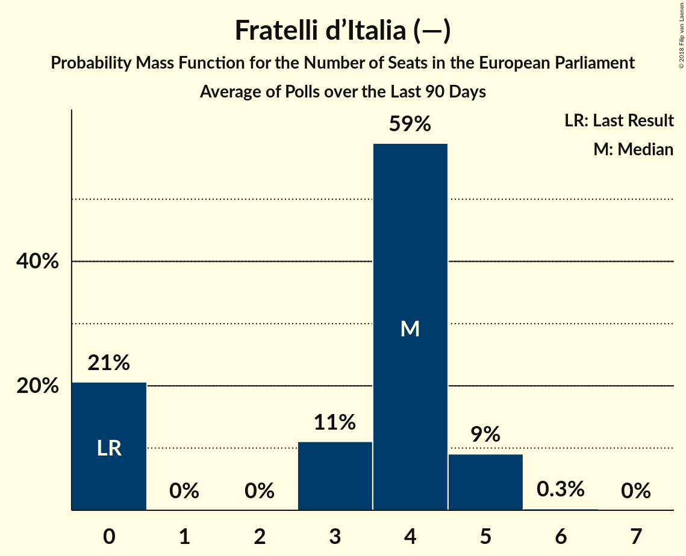

# Fratelli d’Italia (—)

<a href="#voting-intentions">Voting Intentions</a> | <a href="#seats">Seats</a>

## Voting Intentions

Last result: **0.0%** (General Election of 25 May 2014)

### Confidence Intervals

| Period     | Polling firm/Commissioner(s) | Median | 80% Confidence Interval | 90% Confidence Interval | 95% Confidence Interval | 99% Confidence Interval |
|:----------:|:----------------:|:-----------:|:-----------------------:|:-----------------------:|:-----------------------:|:-----------------------:|
| N/A | [Poll Average](average.html) | 5.1% | 4.2–6.0% | 4.0–6.2% | 3.8–6.4% | 3.5–6.9% |
| [3–8 February 2018](2018-02-08-TermometroPolitico.html) | Termometro Politico | 5.5% | 5.0–6.1% | 4.9–6.2% | 4.8–6.3% | 4.6–6.6% |
| [8 February 2018](2018-02-08-Index.html) | Index | 5.0% | 4.1–6.1% | 3.9–6.5% | 3.7–6.8% | 3.3–7.3% |
| [6–7 February 2018](2018-02-07-Tecnè.html) | Tecnè | 4.9% | 4.1–5.9% | 3.9–6.2% | 3.7–6.4% | 3.4–6.9% |
| [5–7 February 2018](2018-02-07-SWG.html) | SWG | 4.8% | 4.2–5.6% | 4.0–5.8% | 3.8–6.0% | 3.5–6.4% |

### Probability Mass Function

The following table shows the probability mass function per percentage block of voting intentions for the [poll average](average.html) for Fratelli d’Italia (—).

| Voting Intentions | Probability | Accumulated | Special Marks |
|:-----------------:|:-----------:|:-----------:|:-------------:|
| 0.0–0.5% | 0% | 100% | Last Result |
| 0.5–1.5% | 0% | 100% |  |
| 1.5–2.5% | 0% | 100% |  |
| 2.5–3.5% | 0.8% | 100% |  |
| 3.5–4.5% | 20% | 99.2% |  |
| 4.5–5.5% | 53% | 79% | Median |
| 5.5–6.5% | 25% | 27% |  |
| 6.5–7.5% | 2% | 2% |  |
| 7.5–8.5% | 0.1% | 0.1% |  |
| 8.5–9.5% | 0% | 0% |  |

## Seats

Last result: **0** seats (General Election of 25 May 2014)

### Confidence Intervals

| Period     | Polling firm/Commissioner(s) | Median | 80% Confidence Interval | 90% Confidence Interval | 95% Confidence Interval | 99% Confidence Interval |
|:----------:|:----------------:|:------:|:-----------------------:|:-----------------------:|:-----------------------:|:-----------------------:|
| N/A | [Poll Average](average.html) | 4 | 3–5 | 3–5 | 0–5 | 0–6 |
| [3–8 February 2018](2018-02-08-TermometroPolitico.html) | Termometro Politico | 4 | 4–5 | 4–5 | 4–5 | 4–6 |
| [8 February 2018](2018-02-08-Index.html) | Index | 4 | 3–5 | 3–5 | 0–5 | 0–6 |
| [6–7 February 2018](2018-02-07-Tecnè.html) | Tecnè | 4 | 3–5 | 0–5 | 0–5 | 0–5 |
| [5–7 February 2018](2018-02-07-SWG.html) | SWG | 4 | 3–5 | 0–5 | 0–5 | 0–5 |

### Probability Mass Function

The following table shows the probability mass function per seat for the [poll average](average.html) for Fratelli d’Italia (—).

| Number of Seats | Probability | Accumulated | Special Marks |
|:---------------:|:-----------:|:-----------:|:-------------:|
| 0 | 4% | 100% | Last Result |
| 1 | 0% | 96% |  |
| 2 | 0% | 96% |  |
| 3 | 14% | 96% |  |
| 4 | 58% | 82% | Median |
| 5 | 23% | 24% |  |
| 6 | 0.9% | 0.9% |  |
| 7 | 0% | 0% |  |

