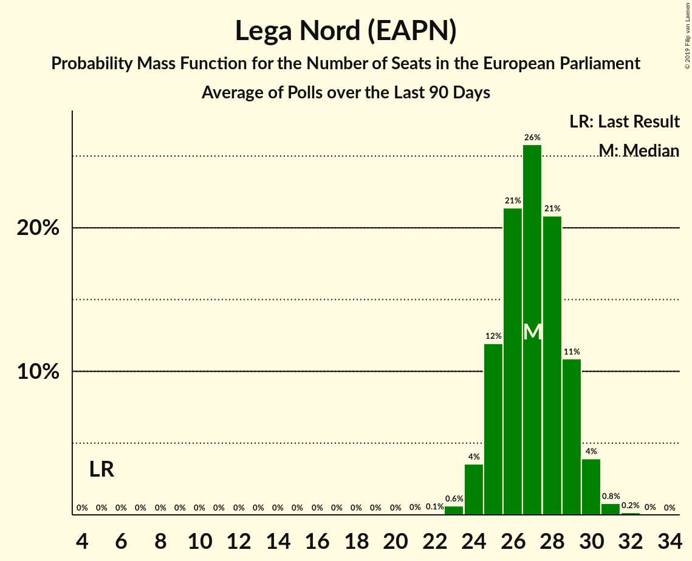

# Lega Nord (EAPN)

<a href="#voting-intentions">Voting Intentions</a> | <a href="#seats">Seats</a>

## Voting Intentions

Last result: **6.2%** (General Election of 25 May 2014)

### Confidence Intervals

| Period     | Polling firm/Commissioner(s) | Median | 80% Confidence Interval | 90% Confidence Interval | 95% Confidence Interval | 99% Confidence Interval |
|:----------:|:----------------:|:-----------:|:-----------------------:|:-----------------------:|:-----------------------:|:-----------------------:|
| N/A | [Poll Average](average.html) | 32.5% | 30.2–35.6% | 29.6–36.5% | 28.9–37.2% | 27.4–38.3% |
| [24–29 April 2019](2019-04-29-SWG.html) | SWG   LA7 | 31.6% | 30.1–33.2% | 29.7–33.6% | 29.3–34.0% | 28.6–34.8% |
| [25 April 2019](2019-04-25-EMGAcqua.html) | EMG Acqua   Rai 3 | 31.3% | 29.8–32.9% | 29.4–33.3% | 29.1–33.7% | 28.3–34.5% |
| [18–23 April 2019](2019-04-23-ScenariPolitici–Winpoll.html) | Scenari Politici–Winpoll   Sole 24 Ore | 36.4% | 34.8–38.0% | 34.4–38.5% | 34.0–38.9% | 33.2–39.7% |
| [17–23 April 2019](2019-04-23-SWG.html) | SWG   LA7 | 33.2% | 31.7–34.8% | 31.2–35.2% | 30.8–35.6% | 30.1–36.4% |
| [22–23 April 2019](2019-04-23-Demopolis.html) | Demopolis | 33.0% | 31.5–34.6% | 31.0–35.0% | 30.7–35.4% | 29.9–36.2% |
| [19–22 April 2019](2019-04-22-TermometroPolitico.html) | Termometro Politico | 31.5% | 29.7–33.4% | 29.1–34.0% | 28.7–34.5% | 27.8–35.4% |
| [20 April 2019](2019-04-20-Ipsos.html) | Ipsos   Corriere della Sera | 36.9% | 35.0–38.9% | 34.4–39.5% | 34.0–40.0% | 33.0–40.9% |
| [18 April 2019](2019-04-18-Tecnè.html) | Tecnè   TGcom24 | 32.0% | 30.1–33.9% | 29.6–34.5% | 29.2–35.0% | 28.3–35.9% |
| [17 April 2019](2019-04-17-IndexResearch.html) | Index Research   LA7 | 32.9% | 30.8–35.1% | 30.2–35.7% | 29.7–36.2% | 28.7–37.3% |
| [16 April 2019](2019-04-16-Piepoli.html) | Piepoli   Rai 1 | 31.2% | 28.7–34.0% | 27.9–34.7% | 27.3–35.4% | 26.1–36.7% |
| [16 April 2019](2019-04-16-NotoSondaggi.html) | Noto Sondaggi   Rai 3 | 33.5% | 31.6–35.5% | 31.1–36.0% | 30.6–36.5% | 29.8–37.4% |
| [16 April 2019](2019-04-16-Euromedia.html) | Euromedia   Rai 1 | 33.0% | 30.9–35.2% | 30.3–35.8% | 29.8–36.3% | 28.8–37.4% |
| [16 April 2019](2019-04-16-EMGAcqua.html) | EMG Acqua   Rai 3 | 32.1% | 30.7–33.5% | 30.3–34.0% | 30.0–34.3% | 29.3–35.0% |
| [10–15 April 2019](2019-04-15-SWG.html) | SWG   LA7 | 32.3% | 30.7–33.9% | 30.3–34.3% | 29.9–34.7% | 29.2–35.5% |
| [11–12 April 2019](2019-04-12-Quorum.html) | Quorum   Sky TG 24 | 33.2% | 31.3–35.2% | 30.8–35.7% | 30.3–36.2% | 29.5–37.1% |
| [2–10 April 2019](2019-04-10-TermometroPolitico.html) | Termometro Politico | 32.0% | 30.5–33.6% | 30.1–34.0% | 29.7–34.4% | 29.0–35.2% |
| [9 April 2019](2019-04-09-NotoSondaggi.html) | Noto Sondaggi   Rai 3 | 32.5% | 30.6–34.4% | 30.1–35.0% | 29.7–35.5% | 28.8–36.4% |
| [9 April 2019](2019-04-09-EMGAcqua.html) | EMG Acqua   Rai 3 | 31.4% | 30.0–32.8% | 29.6–33.2% | 29.3–33.5% | 28.7–34.2% |
| [7–8 April 2019](2019-04-08-Tecnè.html) | Tecnè   Quarta Repubblica | 31.9% | 30.1–33.8% | 29.5–34.4% | 29.1–34.9% | 28.2–35.8% |
| [5–8 April 2019](2019-04-08-ScenariPolitici–Winpoll.html) | Scenari Politici–Winpoll | 35.7% | 34.2–37.3% | 33.7–37.8% | 33.3–38.2% | 32.6–39.0% |
| [3–8 April 2019](2019-04-08-SWG.html) | SWG   LA7 | 31.8% | 30.3–33.4% | 29.9–33.8% | 29.5–34.2% | 28.8–35.0% |
| [2–4 April 2019](2019-04-04-Ipsos.html) | Ipsos   Corriere della Sera | 35.7% | 33.8–37.7% | 33.2–38.2% | 32.8–38.7% | 31.9–39.7% |
| [4 April 2019](2019-04-04-IndexResearch.html) | Index Research   LA7 | 33.6% | 31.5–35.8% | 30.9–36.4% | 30.4–37.0% | 29.4–38.0% |
| [3 April 2019](2019-04-03-TermometroPolitico.html) | Termometro Politico | 31.9% | 31.0–32.9% | 30.7–33.1% | 30.5–33.4% | 30.0–33.8% |
| [3 April 2019](2019-04-03-Piepoli.html) | Piepoli   Rai 1 | 30.6% | 28.0–33.3% | 27.3–34.0% | 26.7–34.7% | 25.5–36.0% |
| [3 April 2019](2019-04-03-Euromedia.html) | Euromedia   Rai 1 | 31.4% | 29.3–33.5% | 28.7–34.2% | 28.2–34.7% | 27.3–35.7% |
| [2 April 2019](2019-04-02-NotoSondaggi.html) | Noto Sondaggi   Rai 3 | 32.0% | 30.1–33.9% | 29.6–34.5% | 29.2–35.0% | 28.3–35.9% |
| [2 April 2019](2019-04-02-EMGAcqua.html) | EMG Acqua   Rai 3 | 31.9% | 30.5–33.3% | 30.1–33.8% | 29.7–34.1% | 29.1–34.8% |
| [31 March–1 April 2019](2019-04-01-Tecnè.html) | Tecnè   Quarta Repubblica | 31.9% | 30.1–33.8% | 29.5–34.4% | 29.1–34.9% | 28.2–35.8% |
| [27 March–1 April 2019](2019-04-01-SWG.html) | SWG   LA7 | 32.9% | 31.4–34.5% | 31.0–35.0% | 30.6–35.4% | 29.9–36.1% |
| [29–30 March 2019](2019-03-30-QuorumandYouTrend.html) | Quorum and YouTrend   Sky TG 24 | 32.1% | 30.2–34.0% | 29.7–34.6% | 29.3–35.1% | 28.4–36.0% |
| [28 March 2019](2019-03-28-Tecnè.html) | Tecnè   TGcom24 | 32.0% | 30.2–34.0% | 29.7–34.5% | 29.2–35.0% | 28.3–35.9% |
| [26–27 March 2019](2019-03-27-IndexResearch.html) | Index Research   LA7 | 34.5% | 32.4–36.7% | 31.8–37.3% | 31.3–37.9% | 30.3–38.9% |
| [26–27 March 2019](2019-03-27-Demopolis.html) | Demopolis | 32.0% | 30.5–33.6% | 30.1–34.0% | 29.7–34.4% | 29.0–35.2% |
| [26 March 2019](2019-03-26-NotoSondaggi.html) | Noto Sondaggi   Rai 3 | 32.0% | 30.1–33.9% | 29.6–34.5% | 29.2–35.0% | 28.3–35.9% |
| [26 March 2019](2019-03-26-EMGAcqua.html) | EMG Acqua   Rai 3 | 31.8% | 30.4–33.2% | 30.0–33.6% | 29.7–34.0% | 29.1–34.6% |
| [22–25 March 2019](2019-03-25-ScenariPolitici–Winpoll.html) | Scenari Politici–Winpoll | 35.8% | 34.2–37.4% | 33.8–37.9% | 33.4–38.3% | 32.7–39.0% |
| [20–25 March 2019](2019-03-25-SWG.html) | SWG   LA7 | 33.4% | 31.9–35.0% | 31.4–35.4% | 31.0–35.8% | 30.3–36.6% |
| [20–21 March 2019](2019-03-21-Tecnè.html) | Tecnè   Rete 4 | 33.1% | 31.2–35.1% | 30.7–35.6% | 30.2–36.1% | 29.4–37.0% |
| [21 March 2019](2019-03-21-Piepoli.html) | Piepoli   Rai 1 | 31.0% | 28.4–33.7% | 27.7–34.5% | 27.1–35.2% | 25.9–36.5% |
| [20–21 March 2019](2019-03-21-Euromedia.html) | Euromedia   Rai 1 | 33.1% | 31.0–35.3% | 30.5–35.9% | 29.9–36.5% | 29.0–37.5% |
| [19–20 March 2019](2019-03-20-IndexResearch.html) | Index Research   LA7 | 34.8% | 32.6–37.0% | 32.0–37.6% | 31.5–38.1% | 30.5–39.2% |
| [19 March 2019](2019-03-19-NotoSondaggi.html) | Noto Sondaggi   Rai 3 | 32.5% | 30.6–34.4% | 30.1–35.0% | 29.7–35.5% | 28.8–36.4% |
| [19 March 2019](2019-03-19-EMGAcqua.html) | EMG Acqua   Rai 3 | 30.9% | 29.5–32.4% | 29.1–32.8% | 28.8–33.2% | 28.2–33.8% |
| [17–18 March 2019](2019-03-18-Tecnè.html) | Tecnè   Quarta Repubblica and Rete 4 | 31.2% | 29.4–33.1% | 28.8–33.7% | 28.4–34.1% | 27.5–35.1% |
| [13–18 March 2019](2019-03-18-SWG.html) | SWG   LA7 | 33.9% | 32.4–35.5% | 31.9–36.0% | 31.6–36.4% | 30.8–37.1% |
| [12–13 March 2019](2019-03-13-IndexResearch.html) | Index Research   LA7 | 34.6% | 32.5–36.8% | 31.9–37.4% | 31.4–38.0% | 30.4–39.1% |
| [11–13 March 2019](2019-03-13-DemosPi.html) | Demos & Pi   La Repubblica | 34.4% | 32.5–36.4% | 32.0–36.9% | 31.6–37.4% | 30.7–38.4% |
| [12–13 March 2019](2019-03-13-Demopolis.html) | Demopolis | 33.0% | 31.5–34.6% | 31.0–35.0% | 30.7–35.4% | 29.9–36.2% |
| [12 March 2019](2019-03-12-Piepoli.html) | Piepoli | 31.6% | 29.0–34.4% | 28.3–35.1% | 27.7–35.8% | 26.5–37.1% |
| [12 March 2019](2019-03-12-NotoSondaggi.html) | Noto Sondaggi   Rai 3 | 32.5% | 30.6–34.4% | 30.1–35.0% | 29.7–35.5% | 28.8–36.4% |
| [12 March 2019](2019-03-12-EMGAcqua.html) | EMG Acqua   Rai 3 | 30.6% | 29.3–32.0% | 28.9–32.4% | 28.5–32.8% | 27.9–33.5% |
| [6–11 March 2019](2019-03-11-SWG.html) | SWG   LA7 | 33.7% | 32.2–35.3% | 31.7–35.8% | 31.4–36.2% | 30.7–36.9% |
| [6–7 March 2019](2019-03-07-Tecnè.html) | Tecnè   Forza Italia | 31.2% | N/A | N/A | N/A | N/A |
| [5–6 March 2019](2019-03-06-IndexResearch.html) | Index Research   LA7 | 34.6% | N/A | N/A | N/A | N/A |
| [5 March 2019](2019-03-05-NotoSondaggi.html) | Noto Sondaggi   Rai 3 | 33.0% | N/A | N/A | N/A | N/A |
| [5 March 2019](2019-03-05-EMGAcqua.html) | EMG Acqua   Rai 3 | 31.2% | N/A | N/A | N/A | N/A |
| [3–4 March 2019](2019-03-04-Tecnè.html) | Tecnè   Quarta Repubblica | 32.5% | N/A | N/A | N/A | N/A |
| [27 February–4 March 2019](2019-03-04-SWG.html) | SWG   LA7 | 33.4% | N/A | N/A | N/A | N/A |
| [1–3 March 2019](2019-03-03-ScenariPolitici–Winpoll.html) | Scenari Politici–Winpoll | 35.4% | N/A | N/A | N/A | N/A |
| [29–1 March 2019](2019-03-01-Ixè.html) | Ixè | 31.2% | N/A | N/A | N/A | N/A |
| [27–28 February 2019](2019-02-28-Tecnè.html) | Tecnè | 32.5% | N/A | N/A | N/A | N/A |
| [26–28 February 2019](2019-02-28-Ipsos.html) | Ipsos   Corriere della Sera | 35.9% | N/A | N/A | N/A | N/A |
| [26–27 February 2019](2019-02-27-IndexResearch.html) | Index Research   LA7 | 34.5% | N/A | N/A | N/A | N/A |
| [22–27 February 2019](2019-02-27-BiDiMedia.html) | BiDiMedia | 32.3% | N/A | N/A | N/A | N/A |
| [26 February 2019](2019-02-26-EMGAcqua.html) | EMG Acqua   Rai 3 | 31.2% | N/A | N/A | N/A | N/A |
| [20–25 February 2019](2019-02-25-SWG.html) | SWG   LA7 | 33.2% | N/A | N/A | N/A | N/A |
| [25 February 2019](2019-02-25-Piepoli.html) | Piepoli   Rai 1 | 31.5% | N/A | N/A | N/A | N/A |
| [25 February 2019](2019-02-25-Euromedia.html) | Euromedia   Rai 1 | 34.6% | N/A | N/A | N/A | N/A |
| [19–20 February 2019](2019-02-20-IndexResearch.html) | Index Research   LA7 | 34.8% | N/A | N/A | N/A | N/A |
| [19 February 2019](2019-02-19-NotoSondaggi.html) | Noto Sondaggi   Rai 3 | 35.0% | N/A | N/A | N/A | N/A |
| [19 February 2019](2019-02-19-EMGAcqua.html) | EMG Acqua   Rai 3 | 30.7% | N/A | N/A | N/A | N/A |
| [17–18 February 2019](2019-02-18-Tecnè.html) | Tecnè   Quarta Repubblica | 33.0% | N/A | N/A | N/A | N/A |
| [13–18 February 2019](2019-02-18-SWG.html) | SWG   LA7 | 33.5% | N/A | N/A | N/A | N/A |
| [14–17 February 2019](2019-02-17-ScenariPolitici–Winpoll.html) | Scenari Politici–Winpoll | 36.2% | N/A | N/A | N/A | N/A |
| [13–15 February 2019](2019-02-15-QuorumandYouTrend.html) | Quorum and YouTrend   Sky TG 24 | 32.9% | N/A | N/A | N/A | N/A |
| [12–13 February 2019](2019-02-13-IndexResearch.html) | Index Research   LA7 | 34.5% | N/A | N/A | N/A | N/A |
| [12–13 February 2019](2019-02-13-Demopolis.html) | Demopolis | 33.0% | N/A | N/A | N/A | N/A |
| [12 February 2019](2019-02-12-Piepoli.html) | Piepoli   Rai 1 | 30.6% | N/A | N/A | N/A | N/A |
| [12 February 2019](2019-02-12-NotoSondaggi.html) | Noto Sondaggi   Rai 3 | 34.0% | N/A | N/A | N/A | N/A |
| [12 February 2019](2019-02-12-Euromedia.html) | Euromedia   Rai 1 | 34.4% | N/A | N/A | N/A | N/A |
| [12 February 2019](2019-02-12-EMGAcqua.html) | EMG Acqua   Rai 3 | 31.4% | N/A | N/A | N/A | N/A |
| [6–11 February 2019](2019-02-11-SWG.html) | SWG   LA7 | 33.8% | N/A | N/A | N/A | N/A |
| [4–7 February 2019](2019-02-07-Tecnè.html) | Tecnè   Forza Italia | 31.9% | N/A | N/A | N/A | N/A |
| [6–7 February 2019](2019-02-07-Ipsos.html) | Ipsos   Corriere della Sera | 34.4% | N/A | N/A | N/A | N/A |
| [6 February 2019](2019-02-06-IndexResearch.html) | Index Research   LA7 | 34.2% | N/A | N/A | N/A | N/A |
| [2–6 February 2019](2019-02-06-BiDiMedia.html) | BiDiMedia | 31.3% | N/A | N/A | N/A | N/A |
| [5 February 2019](2019-02-05-EMGAcqua.html) | EMG Acqua   Rai 3 | 30.1% | N/A | N/A | N/A | N/A |
| [3–4 February 2019](2019-02-04-Tecnè.html) | Tecnè   Quarta Repubblica | 32.1% | N/A | N/A | N/A | N/A |
| [30 January–4 February 2019](2019-02-04-SWG.html) | SWG   LA7 | 33.8% | N/A | N/A | N/A | N/A |
| [30 January 2019](2019-01-30-NotoSondaggi.html) | Noto Sondaggi   Rai 3 | 33.0% | N/A | N/A | N/A | N/A |
| [29–30 January 2019](2019-01-30-IndexResearch.html) | Index Research   LA7 | 33.8% | N/A | N/A | N/A | N/A |
| [28–30 January 2019](2019-01-30-DemosPi.html) | Demos & Pi   La Repubblica | 33.7% | N/A | N/A | N/A | N/A |
| [29 January 2019](2019-01-29-Piepoli.html) | Piepoli   Rai 1 | 30.0% | N/A | N/A | N/A | N/A |
| [29 January 2019](2019-01-29-Euromedia.html) | Euromedia   Rai 1 | 33.0% | N/A | N/A | N/A | N/A |
| [29 January 2019](2019-01-29-EMGAcqua.html) | EMG Acqua   Rai 3 | 30.3% | N/A | N/A | N/A | N/A |
| [27–28 January 2019](2019-01-28-Tecnè.html) | Tecnè   Quarta Repubblica | 30.2% | N/A | N/A | N/A | N/A |
| [23–28 January 2019](2019-01-28-SWG.html) | SWG   LA7 | 32.6% | N/A | N/A | N/A | N/A |
| [22 January 2019](2019-01-22-Piepoli.html) | Piepoli   La Stampa | 30.0% | N/A | N/A | N/A | N/A |
| [22 January 2019](2019-01-22-EMGAcqua.html) | EMG Acqua   Rai 3 | 30.1% | N/A | N/A | N/A | N/A |
| [16–21 January 2019](2019-01-21-SWG.html) | SWG   LA7 | 31.5% | N/A | N/A | N/A | N/A |
| [16–17 January 2019](2019-01-17-Tecnè.html) | Tecnè   TGcom24 | 31.2% | N/A | N/A | N/A | N/A |
| [15–17 January 2019](2019-01-17-Ipsos.html) | Ipsos   Corriere della Sera | 35.8% | N/A | N/A | N/A | N/A |
| [15–16 January 2019](2019-01-16-IndexResearch.html) | Index Research   LA7 | 33.0% | N/A | N/A | N/A | N/A |
| [15 January 2019](2019-01-15-Piepoli.html) | Piepoli   Rai 1 | 30.5% | N/A | N/A | N/A | N/A |
| [15 January 2019](2019-01-15-NotoSondaggi.html) | Noto Sondaggi   Rai 3 | 32.0% | N/A | N/A | N/A | N/A |
| [15 January 2019](2019-01-15-Euromedia.html) | Euromedia   Rai 1 | 31.2% | N/A | N/A | N/A | N/A |
| [15 January 2019](2019-01-15-EMGAcqua.html) | EMG Acqua   Rai 3 | 30.6% | N/A | N/A | N/A | N/A |
| [14–15 January 2019](2019-01-15-Demopolis.html) | Demopolis | 32.0% | N/A | N/A | N/A | N/A |
| [9–14 January 2019](2019-01-14-SWG.html) | SWG   LA7 | 32.2% | N/A | N/A | N/A | N/A |
| [13 January 2019](2019-01-13-NotoSondaggi.html) | Noto Sondaggi   Quotidiano Nazionale | 34.0% | N/A | N/A | N/A | N/A |
| [9–10 January 2019](2019-01-10-Tecnè.html) | Tecnè   Il Giornale | 30.8% | N/A | N/A | N/A | N/A |
| [7–10 January 2019](2019-01-10-BiDiMedia.html) | BiDiMedia | 30.8% | N/A | N/A | N/A | N/A |
| [8–9 January 2019](2019-01-09-IndexResearch.html) | Index Research   LA7 | 33.1% | N/A | N/A | N/A | N/A |
| [8 January 2019](2019-01-08-Piepoli.html) | Piepoli   La Stampa | 31.5% | N/A | N/A | N/A | N/A |
| [8 January 2019](2019-01-08-EMGAcqua.html) | EMG Acqua   Rai 3 | 31.0% | N/A | N/A | N/A | N/A |
| [6–7 January 2019](2019-01-07-Tecnè.html) | Tecnè   Quarta Repubblica | 31.8% | N/A | N/A | N/A | N/A |
| [3–7 January 2019](2019-01-07-SWG.html) | SWG   LA7 | 32.2% | N/A | N/A | N/A | N/A |
| [23–30 December 2018](2018-12-30-GPFInspiringResearch.html) | GPF Inspiring Research   La Notizia | 31.5% | N/A | N/A | N/A | N/A |
| [19–21 December 2018](2018-12-21-Ixè.html) | Ixè | 31.0% | N/A | N/A | N/A | N/A |
| [20–21 December 2018](2018-12-21-Ipsos.html) | Ipsos   Corriere della Sera | 32.9% | N/A | N/A | N/A | N/A |
| [17–21 December 2018](2018-12-21-BiDiMedia.html) | BiDiMedia | 31.4% | N/A | N/A | N/A | N/A |
| [20 December 2018](2018-12-20-LorienConsulting.html) | Lorien Consulting | 31.4% | N/A | N/A | N/A | N/A |
| [10–19 December 2018](2018-12-19-CISE.html) | CISE | 30.6% | N/A | N/A | N/A | N/A |
| [18 December 2018](2018-12-18-EMGAcqua.html) | EMG Acqua | 31.4% | N/A | N/A | N/A | N/A |
| [17 December 2018](2018-12-17-Tecnè.html) | Tecnè   Quarta Repubblica | 32.8% | N/A | N/A | N/A | N/A |
| [12–17 December 2018](2018-12-17-SWG.html) | SWG   LA7 | 33.0% | N/A | N/A | N/A | N/A |
| [12–14 December 2018](2018-12-14-QuorumandYouTrend.html) | Quorum and YouTrend   Sky TG 24 | 31.8% | N/A | N/A | N/A | N/A |
| [10–14 December 2018](2018-12-14-DemosPi.html) | Demos & Pi   La Repubblica | 32.2% | N/A | N/A | N/A | N/A |
| [12–13 December 2018](2018-12-13-Demopolis.html) | Demopolis | 31.8% | N/A | N/A | N/A | N/A |
| [12 December 2018](2018-12-12-IndexResearch.html) | Index Research   LA7 | 34.8% | N/A | N/A | N/A | N/A |
| [10–12 December 2018](2018-12-12-GPFInspiringResearch.html) | GPF Inspiring Research | 31.5% | N/A | N/A | N/A | N/A |
| [11 December 2018](2018-12-11-EMGAcqua.html) | EMG Acqua   Rai 3 | 32.1% | N/A | N/A | N/A | N/A |
| [10 December 2018](2018-12-10-Tecnè.html) | Tecnè   Quarta Repubblica | 33.2% | N/A | N/A | N/A | N/A |
| [5–10 December 2018](2018-12-10-SWG.html) | SWG   LA7 | 32.0% | N/A | N/A | N/A | N/A |
| [10 December 2018](2018-12-10-Piepoli.html) | Piepoli   Rai 1 | 31.0% | N/A | N/A | N/A | N/A |
| [10 December 2018](2018-12-10-Euromedia.html) | Euromedia   Rai 1 | 33.9% | N/A | N/A | N/A | N/A |
| [6 December 2018](2018-12-06-IndexResearch.html) | Index Research   LA7 | 34.8% | N/A | N/A | N/A | N/A |
| [4–6 December 2018](2018-12-06-EMGAcqua.html) | EMG Acqua   Rai 3 | 32.1% | N/A | N/A | N/A | N/A |
| [28 November–3 December 2018](2018-12-03-SWG.html) | SWG   LA7 | 32.0% | N/A | N/A | N/A | N/A |
| [1–2 December 2018](2018-12-02-Tecnè.html) | Tecnè   Quarta Repubblica | 32.0% | N/A | N/A | N/A | N/A |
| [28–29 November 2018](2018-11-29-Demopolis.html) | Demopolis | 32.0% | N/A | N/A | N/A | N/A |
| [27–28 November 2018](2018-11-28-IndexResearch.html) | Index Research   LA7 | 34.5% | N/A | N/A | N/A | N/A |
| [27 November 2018](2018-11-27-NotoSondaggi.html) | Noto Sondaggi   Rai 3 | 34.0% | N/A | N/A | N/A | N/A |
| [27 November 2018](2018-11-27-EMGAcqua.html) | EMG Acqua | 32.0% | N/A | N/A | N/A | N/A |
| [26 November 2018](2018-11-26-Tecnè.html) | Tecnè   Quarta Repubblica | 31.9% | N/A | N/A | N/A | N/A |
| [21–26 November 2018](2018-11-26-SWG.html) | SWG | 31.5% | N/A | N/A | N/A | N/A |
| [22–24 November 2018](2018-11-24-ScenariPolitici–Winpoll.html) | Scenari Politici–Winpoll | 31.5% | N/A | N/A | N/A | N/A |
| [23 November 2018](2018-11-23-Tecnè.html) | Tecnè   TGcom24 | 32.0% | N/A | N/A | N/A | N/A |
| [23 November 2018](2018-11-23-LorienConsulting.html) | Lorien Consulting | 30.0% | N/A | N/A | N/A | N/A |
| [20–22 November 2018](2018-11-22-Ipsos.html) | Ipsos   Corriere della Sera | 36.2% | N/A | N/A | N/A | N/A |
| [19–22 November 2018](2018-11-22-BiDiMedia.html) | BiDiMedia | 30.0% | N/A | N/A | N/A | N/A |
| [20–21 November 2018](2018-11-21-IndexResearch.html) | Index Research   LA7 | 33.2% | N/A | N/A | N/A | N/A |
| [20 November 2018](2018-11-20-NotoSondaggi.html) | Noto Sondaggi   Rai 3 | 33.0% | N/A | N/A | N/A | N/A |
| [20 November 2018](2018-11-20-EMGAcqua.html) | EMG Acqua   Rai 3 | 31.1% | N/A | N/A | N/A | N/A |
| [14–19 November 2018](2018-11-19-SWG.html) | SWG   LA7 | 32.7% | N/A | N/A | N/A | N/A |
| [13–14 November 2018](2018-11-14-IndexResearch.html) | Index Research   LA7 | 33.1% | N/A | N/A | N/A | N/A |
| [13 November 2018](2018-11-13-NotoSondaggi.html) | Noto Sondaggi   Rai 3 | 32.0% | N/A | N/A | N/A | N/A |
| [13 November 2018](2018-11-13-EMGAcqua.html) | EMG Acqua   Rai 3 | 31.2% | N/A | N/A | N/A | N/A |
| [11–12 November 2018](2018-11-12-Tecnè.html) | Tecnè   Quarta Repubblica | 30.4% | N/A | N/A | N/A | N/A |
| [10–12 November 2018](2018-11-12-ScenariPolitici–Winpoll.html) | Scenari Politici–Winpoll | 31.8% | N/A | N/A | N/A | N/A |
| [7–12 November 2018](2018-11-12-SWG.html) | SWG   LA7 | 31.7% | N/A | N/A | N/A | N/A |
| [12 November 2018](2018-11-12-Piepoli.html) | Piepoli   Rai 1 | 30.5% | N/A | N/A | N/A | N/A |
| [12 November 2018](2018-11-12-Euromedia.html) | Euromedia   Rai 1 | 31.2% | N/A | N/A | N/A | N/A |
| [7–9 November 2018](2018-11-09-Ixè.html) | Ixè   Huffington Post | 29.8% | N/A | N/A | N/A | N/A |
| [6–7 November 2018](2018-11-07-IndexResearch.html) | Index Research   LA7 | 32.9% | N/A | N/A | N/A | N/A |
| [6 November 2018](2018-11-06-NotoSondaggi.html) | Noto Sondaggi   Rai 3 | 31.0% | N/A | N/A | N/A | N/A |
| [31 October–5 November 2018](2018-11-05-SWG.html) | SWG   LA7 | 30.4% | N/A | N/A | N/A | N/A |
| [4–5 November 2018](2018-11-05-Demopolis.html) | Demopolis | 30.5% | N/A | N/A | N/A | N/A |
| [2 November 2018](2018-11-02-Tecnè.html) | Tecnè   Quarta Repubblica | 30.2% | N/A | N/A | N/A | N/A |
| [29–31 October 2018](2018-10-31-Ipsos.html) | Ipsos   Corriere della Sera | 34.7% | N/A | N/A | N/A | N/A |
| [30–31 October 2018](2018-10-31-IndexResearch.html) | Index Research   LA7 | 32.5% | N/A | N/A | N/A | N/A |
| [29–31 October 2018](2018-10-31-DemosPi.html) | Demos & Pi | 30.0% | N/A | N/A | N/A | N/A |
| [24–29 October 2018](2018-10-29-SWG.html) | SWG   LA7 | 30.6% | N/A | N/A | N/A | N/A |
| [27–29 October 2018](2018-10-29-GPFInspiringResearch.html) | GPF Inspiring Research   Affaritaliani.it | 30.1% | N/A | N/A | N/A | N/A |
| [25–27 October 2018](2018-10-27-ScenariPolitici–Winpoll.html) | Scenari Politici–Winpoll | 32.1% | N/A | N/A | N/A | N/A |
| [24–26 October 2018](2018-10-26-Ixè.html) | Ixè   Huffington Post | 30.7% | N/A | N/A | N/A | N/A |
| [22–26 October 2018](2018-10-26-BiDiMedia.html) | BiDiMedia | 30.5% | N/A | N/A | N/A | N/A |
| [24–25 October 2018](2018-10-25-IndexResearch.html) | Index Research   LA7 | 31.9% | N/A | N/A | N/A | N/A |
| [23 October 2018](2018-10-23-NotoSondaggi.html) | Noto Sondaggi   Rai 3 | 31.0% | N/A | N/A | N/A | N/A |
| [17–22 October 2018](2018-10-22-SWG.html) | SWG   LA7 | 30.4% | N/A | N/A | N/A | N/A |
| [20–21 October 2018](2018-10-21-Tecnè.html) | Tecnè   Quarta Repubblica | 30.6% | N/A | N/A | N/A | N/A |
| [19–21 October 2018](2018-10-21-EMGAcqua.html) | EMG Acqua   Rai 3 | 30.6% | N/A | N/A | N/A | N/A |
| [17 October 2018](2018-10-17-Piepoli.html) | Piepoli   Rai 1 | 30.6% | N/A | N/A | N/A | N/A |
| [17 October 2018](2018-10-17-Euromedia.html) | Euromedia   Rai 1 | 31.8% | N/A | N/A | N/A | N/A |
| [16 October 2018](2018-10-16-NotoSondaggi.html) | Noto Sondaggi   Rai 3 | 32.0% | N/A | N/A | N/A | N/A |
| [10–15 October 2018](2018-10-15-SWG.html) | SWG   LA7 | 30.5% | N/A | N/A | N/A | N/A |
| [15 October 2018](2018-10-15-LorienConsulting.html) | Lorien Consulting | 30.6% | N/A | N/A | N/A | N/A |
| [10–15 October 2018](2018-10-15-GPFInspiringResearch.html) | GPF Inspiring Research   Sky TG 24 | 29.9% | N/A | N/A | N/A | N/A |
| [13–14 October 2018](2018-10-14-Tecnè.html) | Tecnè   Quarta Repubblica | 30.4% | N/A | N/A | N/A | N/A |
| [11–13 October 2018](2018-10-13-ScenariPolitici–Winpoll.html) | Scenari Politici–Winpoll | 34.3% | N/A | N/A | N/A | N/A |
| [10–12 October 2018](2018-10-12-Ixè.html) | Ixè   Huffington Post | 31.8% | N/A | N/A | N/A | N/A |
| [10–12 October 2018](2018-10-12-Demopolis.html) | Demopolis | 31.5% | N/A | N/A | N/A | N/A |
| [9 October 2018](2018-10-09-NotoSondaggi.html) | Noto Sondaggi   Rai 3 | 33.0% | N/A | N/A | N/A | N/A |
| [8 October 2018](2018-10-08-Tecnè.html) | Tecnè | 31.1% | N/A | N/A | N/A | N/A |
| [3–8 October 2018](2018-10-08-SWG.html) | SWG   LA7 | 31.0% | N/A | N/A | N/A | N/A |
| [5–7 October 2018](2018-10-07-EMGAcqua.html) | EMG Acqua   Rai 3 | 30.7% | N/A | N/A | N/A | N/A |
| [2–4 October 2018](2018-10-04-Ipsos.html) | Ipsos   Corriere della Sera | 33.8% | N/A | N/A | N/A | N/A |
| [1–2 October 2018](2018-10-02-Demopolis.html) | Demopolis | 32.5% | N/A | N/A | N/A | N/A |
| [26 September–1 October 2018](2018-10-01-SWG.html) | SWG   LA7 | 32.2% | N/A | N/A | N/A | N/A |
| [1 October 2018](2018-10-01-Piepoli.html) | Piepoli   Rai 1 | 31.1% | N/A | N/A | N/A | N/A |
| [30 September–1 October 2018](2018-10-01-GPFInspiringResearch.html) | GPF Inspiring Research   Affaritaliani.it | 30.2% | N/A | N/A | N/A | N/A |
| [1 October 2018](2018-10-01-Euromedia.html) | Euromedia   Rai 1 | 33.0% | N/A | N/A | N/A | N/A |
| [28 September 2018](2018-09-28-Ipsos.html) | Ipsos | 34.2% | N/A | N/A | N/A | N/A |
| [24–28 September 2018](2018-09-28-BiDiMedia.html) | BiDiMedia | 30.4% | N/A | N/A | N/A | N/A |
| [26 September 2018](2018-09-26-IndexResearch.html) | Index Research   LA7 | 31.2% | N/A | N/A | N/A | N/A |
| [25 September 2018](2018-09-25-NotoSondaggi.html) | Noto Sondaggi   Rai 3 | 34.0% | N/A | N/A | N/A | N/A |
| [19–24 September 2018](2018-09-24-SWG.html) | SWG   LA7 | 32.0% | N/A | N/A | N/A | N/A |
| [22–23 September 2018](2018-09-23-Tecnè.html) | Tecnè   Quarta Repubblica | 32.2% | N/A | N/A | N/A | N/A |
| [21–23 September 2018](2018-09-23-GPFInspiringResearch.html) | GPF Inspiring Research   Affaritaliani.it | 29.8% | N/A | N/A | N/A | N/A |
| [21–23 September 2018](2018-09-23-EMGAcqua.html) | EMG Acqua   Rai 3 | 32.3% | N/A | N/A | N/A | N/A |
| [21–22 September 2018](2018-09-22-ScenariPolitici–Winpoll.html) | Scenari Politici–Winpoll | 34.7% | N/A | N/A | N/A | N/A |
| [19–21 September 2018](2018-09-21-Ixè.html) | Ixè   Huffington Post | 31.2% | N/A | N/A | N/A | N/A |
| [20 September 2018](2018-09-20-Ipsos.html) | Ipsos | 34.6% | N/A | N/A | N/A | N/A |
| [18–19 September 2018](2018-09-19-IndexResearch.html) | Index Research   LA7 | 30.5% | N/A | N/A | N/A | N/A |
| [18 September 2018](2018-09-18-NotoSondaggi.html) | Noto Sondaggi   Rai 3 | 34.0% | N/A | N/A | N/A | N/A |
| [12–17 September 2018](2018-09-17-SWG.html) | SWG   LA7 | 31.6% | N/A | N/A | N/A | N/A |
| [17 September 2018](2018-09-17-Piepoli.html) | Piepoli   Rai 1 | 30.0% | N/A | N/A | N/A | N/A |
| [15–17 September 2018](2018-09-17-GPFInspiringResearch.html) | GPF Inspiring Research   Affaritaliani.it | 30.5% | N/A | N/A | N/A | N/A |
| [17 September 2018](2018-09-17-Euromedia.html) | Euromedia   Rai 1 | 32.6% | N/A | N/A | N/A | N/A |
| [14–15 September 2018](2018-09-15-Tecnè.html) | Tecnè   Quarta Repubblica | 31.2% | N/A | N/A | N/A | N/A |
| [11–13 September 2018](2018-09-13-DemosPi.html) | Demos & Pi | 30.2% | N/A | N/A | N/A | N/A |
| [11–12 September 2018](2018-09-12-Demopolis.html) | Demopolis | 32.0% | N/A | N/A | N/A | N/A |
| [11 September 2018](2018-09-11-NotoSondaggi.html) | Noto Sondaggi   Rai 3 | 34.0% | N/A | N/A | N/A | N/A |
| [5–10 September 2018](2018-09-10-SWG.html) | SWG   LA7 | 32.1% | N/A | N/A | N/A | N/A |
| [10 September 2018](2018-09-10-Piepoli.html) | Piepoli   Rai 1 | 30.0% | N/A | N/A | N/A | N/A |
| [10 September 2018](2018-09-10-Euromedia.html) | Euromedia   Rai 1 | 32.0% | N/A | N/A | N/A | N/A |
| [7–9 September 2018](2018-09-09-EMGAcqua.html) | EMG Acqua | 30.5% | N/A | N/A | N/A | N/A |
| [6–7 September 2018](2018-09-07-ScenariPolitici–Winpoll.html) | Scenari Politici–Winpoll | 35.0% | N/A | N/A | N/A | N/A |
| [5–6 September 2018](2018-09-06-Tecnè.html) | Tecnè   TGcom24 | 30.3% | N/A | N/A | N/A | N/A |
| [6 September 2018](2018-09-06-NotoSondaggi.html) | Noto Sondaggi   Rai 3 | 34.0% | N/A | N/A | N/A | N/A |
| [4–6 September 2018](2018-09-06-Ipsos.html) | Ipsos   Corriere della Sera | 33.5% | N/A | N/A | N/A | N/A |
| [6 September 2018](2018-09-06-GPFInspiringResearch.html) | GPF Inspiring Research | 30.8% | N/A | N/A | N/A | N/A |
| [3–4 September 2018](2018-09-04-Tecnè.html) | Tecnè | 30.1% | N/A | N/A | N/A | N/A |
| [29 August–3 September 2018](2018-09-03-SWG.html) | SWG   LA7 | 32.2% | N/A | N/A | N/A | N/A |
| [30 August–2 September 2018](2018-09-02-BiDiMedia.html) | BiDiMedia | 29.5% | N/A | N/A | N/A | N/A |
| [27 August 2018](2018-08-27-Piepoli.html) | Piepoli   Affaritaliani.it | 30.0% | N/A | N/A | N/A | N/A |
| [24–27 August 2018](2018-08-27-LorienConsulting.html) | Lorien Consulting | 31.8% | N/A | N/A | N/A | N/A |
| [25–30 July 2018](2018-07-30-SWG.html) | SWG   LA7 | 30.3% | N/A | N/A | N/A | N/A |
| [24–25 July 2018](2018-07-25-Demopolis.html) | Demopolis | 29.0% | N/A | N/A | N/A | N/A |
| [18–23 July 2018](2018-07-23-SWG.html) | SWG   LA7 | 30.7% | N/A | N/A | N/A | N/A |
| [23 July 2018](2018-07-23-Ixè.html) | Ixè   Huffington Post | 28.0% | N/A | N/A | N/A | N/A |
| [17–18 July 2018](2018-07-18-Ipsos.html) | Ipsos   Corriere della Sera | 31.0% | N/A | N/A | N/A | N/A |
| [17 July 2018](2018-07-17-LorienConsulting.html) | Lorien Consulting | 28.2% | N/A | N/A | N/A | N/A |
| [11–16 July 2018](2018-07-16-SWG.html) | SWG   LA7 | 30.1% | N/A | N/A | N/A | N/A |
| [5–13 July 2018](2018-07-13-TermometroPolitico.html) | Termometro Politico | 30.3% | N/A | N/A | N/A | N/A |
| [7–13 July 2018](2018-07-13-BiDiMedia.html) | BiDiMedia | 28.2% | N/A | N/A | N/A | N/A |
| [4–9 July 2018](2018-07-09-SWG.html) | SWG | 30.5% | N/A | N/A | N/A | N/A |
| [9 July 2018](2018-07-09-Piepoli.html) | Piepoli   Sky TG 24 | 28.1% | N/A | N/A | N/A | N/A |
| [6–8 July 2018](2018-07-08-EMGAcqua.html) | EMG Acqua   Rai 3 | 27.5% | N/A | N/A | N/A | N/A |
| [27 June–2 July 2018](2018-07-02-SWG.html) | SWG   LA7 | 29.8% | N/A | N/A | N/A | N/A |
| [7 June–2 July 2018](2018-07-02-QuorumandYouTrend.html) | Quorum and YouTrend   Sky TG 24 | 27.7% | N/A | N/A | N/A | N/A |
| [26–27 June 2018](2018-06-27-Ipsos.html) | Ipsos   Corriere della Sera | 31.2% | N/A | N/A | N/A | N/A |
| [20–25 June 2018](2018-06-25-SWG.html) | SWG   LA7 | 29.7% | N/A | N/A | N/A | N/A |
| [25 June 2018](2018-06-25-Piepoli.html) | Piepoli   Sky TG 24 | 28.0% | N/A | N/A | N/A | N/A |
| [23–24 June 2018](2018-06-24-EMGAcqua.html) | EMG Acqua   Rai 3 | 27.2% | N/A | N/A | N/A | N/A |
| [19–24 June 2018](2018-06-24-BiDiMedia.html) | BiDiMedia | 27.7% | N/A | N/A | N/A | N/A |
| [20 June 2018](2018-06-20-Tecnè.html) | Tecnè   TGcom24 | 27.9% | N/A | N/A | N/A | N/A |
| [20 June 2018](2018-06-20-LorienConsulting.html) | Lorien Consulting | 27.6% | N/A | N/A | N/A | N/A |
| [19–20 June 2018](2018-06-20-Euromedia.html) | Euromedia   Rai 1 | 28.2% | N/A | N/A | N/A | N/A |
| [19–20 June 2018](2018-06-20-Demopolis.html) | Demopolis   LA7 | 28.0% | N/A | N/A | N/A | N/A |
| [18–19 June 2018](2018-06-19-Piepoli.html) | Piepoli   Rai 1 | 27.0% | N/A | N/A | N/A | N/A |
| [19 June 2018](2018-06-19-NotoSondaggi.html) | Noto Sondaggi   Rai 3 | 29.0% | N/A | N/A | N/A | N/A |
| [13–18 June 2018](2018-06-18-SWG.html) | SWG   LA7 | 29.2% | N/A | N/A | N/A | N/A |
| [14–16 June 2018](2018-06-16-Ixè.html) | Ixè   Huffington Post | 28.0% | N/A | N/A | N/A | N/A |
| [11–15 June 2018](2018-06-15-TermometroPolitico.html) | Termometro Politico | 28.7% | N/A | N/A | N/A | N/A |
| [12–13 June 2018](2018-06-13-Ipsos.html) | Ipsos   Corriere della Sera | 30.1% | N/A | N/A | N/A | N/A |
| [12–13 June 2018](2018-06-13-Euromedia.html) | Euromedia   Rai 1 | 27.2% | N/A | N/A | N/A | N/A |
| [12 June 2018](2018-06-12-Tecnè.html) | Tecnè   Canale 5 | 25.6% | N/A | N/A | N/A | N/A |
| [11–12 June 2018](2018-06-12-Piepoli.html) | Piepoli   Rai 1 | 25.5% | N/A | N/A | N/A | N/A |
| [6–11 June 2018](2018-06-11-SWG.html) | SWG   LA7 | 27.0% | N/A | N/A | N/A | N/A |
| [6 June 2018](2018-06-06-IndexResearch.html) | Index Research   LA7 | 26.8% | N/A | N/A | N/A | N/A |
| [30 May–4 June 2018](2018-06-04-SWG.html) | SWG   LA7 | 27.2% | N/A | N/A | N/A | N/A |
| [4 June 2018](2018-06-04-Piepoli.html) | Piepoli   Sky TG 24 | 23.9% | N/A | N/A | N/A | N/A |
| [1–3 June 2018](2018-06-03-EMGAcqua.html) | EMG Acqua   Rai 3 | 22.3% | N/A | N/A | N/A | N/A |
| [30–31 May 2018](2018-05-31-Ipsos.html) | Ipsos   Corriere della Sera | 28.5% | N/A | N/A | N/A | N/A |
| [30–31 May 2018](2018-05-31-IndexResearch.html) | Index Research   LA7 | 26.5% | N/A | N/A | N/A | N/A |
| [29–30 May 2018](2018-05-30-Demopolis.html) | Demopolis | 26.0% | N/A | N/A | N/A | N/A |
| [29 May 2018](2018-05-29-TermometroPolitico.html) | Termometro Politico | 26.7% | N/A | N/A | N/A | N/A |
| [29 May 2018](2018-05-29-Tecnè.html) | Tecnè   TGcom24 | 25.1% | N/A | N/A | N/A | N/A |
| [29 May 2018](2018-05-29-Piepoli.html) | Piepoli   Rai 1 | 24.0% | N/A | N/A | N/A | N/A |
| [29 May 2018](2018-05-29-Euromedia.html) | Euromedia   Rai 1 | 23.8% | N/A | N/A | N/A | N/A |
| [23–28 May 2018](2018-05-28-SWG.html) | SWG   LA7 | 27.5% | N/A | N/A | N/A | N/A |
| [28 May 2018](2018-05-28-NotoSondaggi.html) | Noto Sondaggi   Rai 3 | 25.0% | N/A | N/A | N/A | N/A |
| [23–28 May 2018](2018-05-28-BiDiMedia.html) | BiDiMedia | 24.7% | N/A | N/A | N/A | N/A |
| [22–24 May 2018](2018-05-24-EMGAcqua.html) | EMG Acqua   Rai 3 | 21.1% | N/A | N/A | N/A | N/A |
| [23 May 2018](2018-05-23-IndexResearch.html) | Index Research   LA7 | 22.5% | N/A | N/A | N/A | N/A |
| [22–23 May 2018](2018-05-23-Demopolis.html) | Demopolis | 24.0% | N/A | N/A | N/A | N/A |
| [22 May 2018](2018-05-22-NotoSondaggi.html) | Noto Sondaggi   il Quotidiano Nazionale | 25.0% | N/A | N/A | N/A | N/A |
| [16–20 May 2018](2018-05-20-SWG.html) | SWG   LA7 | 24.5% | N/A | N/A | N/A | N/A |
| [16–18 May 2018](2018-05-18-Tecnè.html) | Tecnè   TGcom24 | 23.2% | N/A | N/A | N/A | N/A |
| [17–18 May 2018](2018-05-18-DemosPi.html) | Demos & Pi | 22.1% | N/A | N/A | N/A | N/A |
| [17 May 2018](2018-05-17-Piepoli.html) | Piepoli   Rai 1 | 21.0% | N/A | N/A | N/A | N/A |
| [16–17 May 2018](2018-05-17-Ipsos.html) | Ipsos   Corriere della Sera | 25.4% | N/A | N/A | N/A | N/A |
| [15–17 May 2018](2018-05-17-EMGAcqua.html) | EMG Acqua   Rai 3 | 21.8% | N/A | N/A | N/A | N/A |
| [16 May 2018](2018-05-16-IndexResearch.html) | Index Research   LA7 | 21.8% | N/A | N/A | N/A | N/A |
| [16 May 2018](2018-05-16-Euromedia.html) | Euromedia   Rai 1 | 22.2% | N/A | N/A | N/A | N/A |
| [15 May 2018](2018-05-15-NotoSondaggi.html) | Noto Sondaggi   Rai 3 | 22.0% | N/A | N/A | N/A | N/A |
| [9–13 May 2018](2018-05-13-SWG.html) | SWG   LA7 | 25.5% | N/A | N/A | N/A | N/A |
| [10–11 May 2018](2018-05-11-Ixè.html) | Ixè   Huffington Post | 22.0% | N/A | N/A | N/A | N/A |
| [10 May 2018](2018-05-10-Piepoli.html) | Piepoli | 21.0% | N/A | N/A | N/A | N/A |
| [9–10 May 2018](2018-05-10-Euromedia.html) | Euromedia | 22.8% | N/A | N/A | N/A | N/A |
| [8–10 May 2018](2018-05-10-EMGAcqua.html) | EMG Acqua   Rai 3 | 23.2% | N/A | N/A | N/A | N/A |
| [9–10 May 2018](2018-05-10-Demopolis.html) | Demopolis   LA7 | 23.0% | N/A | N/A | N/A | N/A |
| [8 May 2018](2018-05-08-Tecnè.html) | Tecnè   Canale 5 | 22.6% | N/A | N/A | N/A | N/A |
| [7 May 2018](2018-05-07-Piepoli.html) | Piepoli   Sky TG 24 | 21.0% | N/A | N/A | N/A | N/A |
| [5–6 May 2018](2018-05-06-Tecnè.html) | Tecnè   TGcom24 | 22.3% | N/A | N/A | N/A | N/A |
| [3–6 May 2018](2018-05-06-SWG.html) | SWG | 24.4% | N/A | N/A | N/A | N/A |
| [4 May 2018](2018-05-04-NotoSondaggi.html) | Noto Sondaggi   il Quotidiano Nazionale | 22.5% | N/A | N/A | N/A | N/A |
| [2–3 May 2018](2018-05-03-Ipsos.html) | Ipsos   Corriere della Sera | 21.2% | N/A | N/A | N/A | N/A |
| [2–3 May 2018](2018-05-03-EMGAcqua.html) | EMG Acqua   Rai 3 | 23.5% | N/A | N/A | N/A | N/A |
| [2 May 2018](2018-05-02-Piepoli.html) | Piepoli | 21.0% | N/A | N/A | N/A | N/A |
| [2 May 2018](2018-05-02-IndexResearch.html) | Index Research | 24.1% | N/A | N/A | N/A | N/A |
| [30 April 2018](2018-04-30-Tecnè.html) | Tecnè   Canale 5 | 22.8% | N/A | N/A | N/A | N/A |
| [30 April 2018](2018-04-30-Piepoli.html) | Piepoli   Rai 1 | 21.0% | N/A | N/A | N/A | N/A |
| [30 April 2018](2018-04-30-Euromedia.html) | Euromedia   Rai 1 | 21.8% | N/A | N/A | N/A | N/A |
| [24–30 April 2018](2018-04-30-Bidimedia.html) | Bidimedia | 20.8% | N/A | N/A | N/A | N/A |
| [26–27 April 2018](2018-04-27-DemosPi.html) | Demos & Pi   La Repubblica | 21.6% | N/A | N/A | N/A | N/A |
| [24–26 April 2018](2018-04-26-EMGAcqua.html) | EMG Acqua   Rai 3 | 22.0% | N/A | N/A | N/A | N/A |
| [23–25 April 2018](2018-04-25-SWG.html) | SWG | 23.7% | N/A | N/A | N/A | N/A |
| [23 April 2018](2018-04-23-Piepoli.html) | Piepoli | 19.6% | N/A | N/A | N/A | N/A |
| [20 April 2018](2018-04-20-Tecnè.html) | Tecnè   TGcom24 | 21.8% | N/A | N/A | N/A | N/A |
| [18–19 April 2018](2018-04-19-Ipsos.html) | Ipsos   Corriere della Sera | 19.5% | N/A | N/A | N/A | N/A |
| [16–18 April 2018](2018-04-18-SWG.html) | SWG | 23.2% | N/A | N/A | N/A | N/A |
| [18 April 2018](2018-04-18-IndexResearch.html) | Index Research   LA7 | 22.6% | N/A | N/A | N/A | N/A |
| [17 April 2018](2018-04-17-NotoSondaggi.html) | Noto Sondaggi   Rai 3 | 23.2% | N/A | N/A | N/A | N/A |
| [16 April 2018](2018-04-16-Piepoli.html) | Piepoli | 19.4% | N/A | N/A | N/A | N/A |
| [13 April 2018](2018-04-13-Euromedia.html) | Euromedia   Rete 4 | 20.7% | N/A | N/A | N/A | N/A |
| [9–11 April 2018](2018-04-11-SWG.html) | SWG | 23.5% | N/A | N/A | N/A | N/A |
| [9–11 April 2018](2018-04-11-Ixè.html) | Ixè   Huffington Post | 21.0% | N/A | N/A | N/A | N/A |
| [11 April 2018](2018-04-11-IndexResearch.html) | Index Research   LA7 | 22.9% | N/A | N/A | N/A | N/A |
| [9 April 2018](2018-04-09-Piepoli.html) | Piepoli | 19.5% | N/A | N/A | N/A | N/A |
| [9 April 2018](2018-04-09-Euromedia.html) | Euromedia | 19.5% | N/A | N/A | N/A | N/A |
| [5 April 2018](2018-04-05-IndexResearch.html) | Index Research   LA7 | 23.0% | N/A | N/A | N/A | N/A |
| [3–4 April 2018](2018-04-04-SWG.html) | SWG | 22.4% | N/A | N/A | N/A | N/A |
| [3 April 2018](2018-04-03-Tecnè.html) | Tecnè   Canale 5 | 19.8% | N/A | N/A | N/A | N/A |
| [2–3 April 2018](2018-04-03-Demopolis.html) | Demopolis   LA7 | 20.0% | N/A | N/A | N/A | N/A |
| [26–28 March 2018](2018-03-28-SWG.html) | SWG | 21.2% | N/A | N/A | N/A | N/A |
| [28 March 2018](2018-03-28-Piepoli.html) | Piepoli | 19.0% | N/A | N/A | N/A | N/A |
| [27–28 March 2018](2018-03-28-Ipsos.html) | Ipsos   Corriere della Sera | 19.2% | N/A | N/A | N/A | N/A |
| [28 March 2018](2018-03-28-IndexResearch.html) | Index Research   LA7 | 23.5% | N/A | N/A | N/A | N/A |
| [28 March 2018](2018-03-28-Euromedia.html) | Euromedia | 19.4% | N/A | N/A | N/A | N/A |
| [21–25 March 2018](2018-03-25-Bidimedia.html) | Bidimedia | 19.7% | N/A | N/A | N/A | N/A |
| [19–21 March 2018](2018-03-21-SWG.html) | SWG | 21.6% | 20.5–22.8% | 20.1–23.2% | 19.8–23.5% | 19.3–24.1% |
| [21 March 2018](2018-03-21-IndexResearch.html) | Index Research   LA7 | 23.5% | N/A | N/A | N/A | N/A |
| [20 March 2018](2018-03-20-Tecnè.html) | Tecnè   Canale 5 | 19.2% | 17.5–21.1% | 17.0–21.6% | 16.6–22.1% | 15.8–23.0% |
| [19 March 2018](2018-03-19-Piepoli.html) | Piepoli | 17.9% | 15.9–20.3% | 15.3–20.9% | 14.8–21.5% | 13.9–22.6% |
| [19 March 2018](2018-03-19-Euromedia.html) | Euromedia | 18.8% | 17.1–20.6% | 16.6–21.2% | 16.2–21.6% | 15.4–22.5% |
| [15 March 2018](2018-03-15-Piepoli.html) | Piepoli   La Stampa | 18.0% | 15.9–20.3% | 15.4–21.0% | 14.9–21.5% | 14.0–22.7% |
| [12–15 March 2018](2018-03-15-DemosPi.html) | Demos & Pi   La Repubblica | 18.2% | 16.9–19.7% | 16.5–20.1% | 16.2–20.5% | 15.5–21.2% |
| [12–14 March 2018](2018-03-14-SWG.html) | SWG   Il Messaggero | 22.3% | 20.7–24.1% | 20.2–24.6% | 19.8–25.0% | 19.1–25.8% |
| [12–16 February 2018](2018-02-16-TermometroPolitico.html) | Termometro Politico | 14.8% | 14.1–15.5% | 13.9–15.7% | 13.8–15.9% | 13.5–16.2% |
| [14–15 February 2018](2018-02-15-Demopolis.html) | Demopolis | 14.2% | 13.2–15.3% | 13.0–15.5% | 12.7–15.8% | 12.3–16.3% |
| [12–14 February 2018](2018-02-14-SWG.html) | SWG | 13.4% | 12.5–14.4% | 12.2–14.7% | 12.0–15.0% | 11.5–15.5% |
| [13–14 February 2018](2018-02-14-Piepoli.html) | Piepoli | 13.1% | 11.3–15.2% | 10.8–15.8% | 10.4–16.3% | 9.6–17.4% |
| [12–14 February 2018](2018-02-14-Ixè.html) | Ixè   Huffington Post | 10.8% | 9.6–12.2% | 9.3–12.5% | 9.0–12.9% | 8.5–13.6% |
| [12–14 February 2018](2018-02-14-Index.html) | Index | 13.8% | 12.3–15.4% | 11.9–15.9% | 11.5–16.3% | 10.9–17.1% |
| [14 February 2018](2018-02-14-Euromedia.html) | Euromedia | 14.2% | 12.8–15.9% | 12.3–16.4% | 12.0–16.9% | 11.3–17.7% |
| [12–14 February 2018](2018-02-14-DemosPi.html) | Demos & Pi   La Repubblica | 13.2% | 11.9–14.7% | 11.6–15.1% | 11.3–15.5% | 10.7–16.2% |
| [5–14 February 2018](2018-02-14-Demetra.html) | Demetra | 14.7% | 14.1–15.3% | 14.0–15.5% | 13.8–15.6% | 13.5–15.9% |
| [12–13 February 2018](2018-02-13-Tecnè.html) | Tecnè | 12.8% | 11.5–14.2% | 11.2–14.6% | 10.9–15.0% | 10.3–15.7% |
| [12 February 2018](2018-02-12-Euromedia.html) | Euromedia | 14.1% | 12.7–15.8% | 12.2–16.3% | 11.9–16.7% | 11.2–17.6% |
| [8–12 February 2018](2018-02-12-Bidimedia.html) | Bidimedia | 14.5% | 13.3–15.9% | 13.0–16.2% | 12.7–16.6% | 12.2–17.2% |
| [8–11 February 2018](2018-02-11-LorienConsulting.html) | Lorien Consulting | 12.3% | 11.1–13.7% | 10.7–14.1% | 10.4–14.5% | 9.8–15.2% |
| [9–11 February 2018](2018-02-11-EMG.html) | EMG   TG LA7 | 13.9% | 12.8–15.0% | 12.5–15.4% | 12.3–15.7% | 11.8–16.2% |
| [3–8 February 2018](2018-02-08-TermometroPolitico.html) | Termometro Politico | 14.8% | 14.1–15.6% | 13.8–15.8% | 13.7–16.0% | 13.3–16.4% |
| [8 February 2018](2018-02-08-Index.html) | Index | 14.1% | 12.7–15.8% | 12.2–16.3% | 11.9–16.7% | 11.2–17.6% |
| [6–7 February 2018](2018-02-07-Tecnè.html) | Tecnè | 13.2% | 11.9–14.6% | 11.5–15.0% | 11.2–15.4% | 10.6–16.1% |
| [5–7 February 2018](2018-02-07-SWG.html) | SWG | 13.1% | 12.0–14.3% | 11.7–14.6% | 11.4–14.9% | 11.0–15.5% |

### Probability Mass Function

The following table shows the probability mass function per percentage block of voting intentions for the [poll average](average.html) for Lega Nord (EAPN).

| Voting Intentions | Probability | Accumulated | Special Marks |
|:-----------------:|:-----------:|:-----------:|:-------------:|
| 5.5–6.5% | 0% | 100% | Last Result |
| 6.5–7.5% | 0% | 100% |  |
| 7.5–8.5% | 0% | 100% |  |
| 8.5–9.5% | 0% | 100% |  |
| 9.5–10.5% | 0% | 100% |  |
| 10.5–11.5% | 0% | 100% |  |
| 11.5–12.5% | 0% | 100% |  |
| 12.5–13.5% | 0% | 100% |  |
| 13.5–14.5% | 0% | 100% |  |
| 14.5–15.5% | 0% | 100% |  |
| 15.5–16.5% | 0% | 100% |  |
| 16.5–17.5% | 0% | 100% |  |
| 17.5–18.5% | 0% | 100% |  |
| 18.5–19.5% | 0% | 100% |  |
| 19.5–20.5% | 0% | 100% |  |
| 20.5–21.5% | 0% | 100% |  |
| 21.5–22.5% | 0% | 100% |  |
| 22.5–23.5% | 0% | 100% |  |
| 23.5–24.5% | 0% | 100% |  |
| 24.5–25.5% | 0% | 100% |  |
| 25.5–26.5% | 0.1% | 100% |  |
| 26.5–27.5% | 0.4% | 99.8% |  |
| 27.5–28.5% | 1.1% | 99.4% |  |
| 28.5–29.5% | 3% | 98% |  |
| 29.5–30.5% | 9% | 95% |  |
| 30.5–31.5% | 17% | 87% |  |
| 31.5–32.5% | 22% | 69% | Median |
| 32.5–33.5% | 18% | 48% |  |
| 33.5–34.5% | 12% | 30% |  |
| 34.5–35.5% | 8% | 19% |  |
| 35.5–36.5% | 6% | 11% |  |
| 36.5–37.5% | 3% | 5% |  |
| 37.5–38.5% | 1.2% | 2% |  |
| 38.5–39.5% | 0.3% | 0.4% |  |
| 39.5–40.5% | 0.1% | 0.1% |  |
| 40.5–41.5% | 0% | 0% |  |

## Seats

Last result: **5** seats (General Election of 25 May 2014)

### Confidence Intervals

| Period     | Polling firm/Commissioner(s) | Median | 80% Confidence Interval | 90% Confidence Interval | 95% Confidence Interval | 99% Confidence Interval |
|:----------:|:----------------:|:------:|:-----------------------:|:-----------------------:|:-----------------------:|:-----------------------:|
| N/A | [Poll Average](average.html) | 25 | 23–29 | 22–29 | 22–30 | 21–31 |
| [24–29 April 2019](2019-04-29-SWG.html) | SWG   LA7 | 24 | 23–25 | 22–25 | 22–26 | 21–26 |
| [25 April 2019](2019-04-25-EMGAcqua.html) | EMG Acqua   Rai 3 | 24 | 22–25 | 22–25 | 22–26 | 21–27 |
| [18–23 April 2019](2019-04-23-ScenariPolitici–Winpoll.html) | Scenari Politici–Winpoll   Sole 24 Ore | 27 | 26–29 | 26–29 | 25–29 | 25–30 |
| [17–23 April 2019](2019-04-23-SWG.html) | SWG   LA7 | 25 | 24–26 | 23–26 | 23–27 | 23–27 |
| [22–23 April 2019](2019-04-23-Demopolis.html) | Demopolis | 24 | 23–25 | 23–26 | 22–26 | 22–27 |
| [19–22 April 2019](2019-04-22-TermometroPolitico.html) | Termometro Politico | 25 | 24–26 | 23–27 | 23–27 | 22–28 |
| [20 April 2019](2019-04-20-Ipsos.html) | Ipsos   Corriere della Sera | 29 | 27–31 | 27–32 | 26–32 | 25–33 |
| [18 April 2019](2019-04-18-Tecnè.html) | Tecnè   TGcom24 | 23 | 22–25 | 22–25 | 21–26 | 21–26 |
| [17 April 2019](2019-04-17-IndexResearch.html) | Index Research   LA7 | 25 | 23–27 | 23–28 | 22–29 | 21–30 |
| [16 April 2019](2019-04-16-Piepoli.html) | Piepoli   Rai 1 | 24 | 22–27 | 22–28 | 21–28 | 20–29 |
| [16 April 2019](2019-04-16-NotoSondaggi.html) | Noto Sondaggi   Rai 3 | 26 | 24–28 | 24–29 | 23–29 | 23–30 |
| [16 April 2019](2019-04-16-Euromedia.html) | Euromedia   Rai 1 | 26 | 24–28 | 23–28 | 23–29 | 22–30 |
| [16 April 2019](2019-04-16-EMGAcqua.html) | EMG Acqua   Rai 3 | 26 | 24–27 | 24–27 | 24–28 | 23–28 |
| [10–15 April 2019](2019-04-15-SWG.html) | SWG   LA7 | 26 | 24–27 | 24–28 | 23–28 | 23–29 |
| [11–12 April 2019](2019-04-12-Quorum.html) | Quorum   Sky TG 24 | 26 | 24–28 | 24–28 | 23–29 | 23–29 |
| [2–10 April 2019](2019-04-10-TermometroPolitico.html) | Termometro Politico | 25 | 24–27 | 24–27 | 24–27 | 23–28 |
| [9 April 2019](2019-04-09-NotoSondaggi.html) | Noto Sondaggi   Rai 3 | 25 | 24–27 | 23–27 | 23–27 | 22–28 |
| [9 April 2019](2019-04-09-EMGAcqua.html) | EMG Acqua   Rai 3 | 24 | 23–25 | 22–25 | 22–25 | 22–26 |
| [7–8 April 2019](2019-04-08-Tecnè.html) | Tecnè   Quarta Repubblica | 23 | 22–25 | 21–25 | 21–26 | 21–26 |
| [5–8 April 2019](2019-04-08-ScenariPolitici–Winpoll.html) | Scenari Politici–Winpoll | 29 | 27–30 | 27–31 | 27–31 | 26–32 |
| [3–8 April 2019](2019-04-08-SWG.html) | SWG   LA7 | 26 | 24–27 | 24–27 | 24–28 | 23–29 |
| [2–4 April 2019](2019-04-04-Ipsos.html) | Ipsos   Corriere della Sera | 28 | 27–30 | 26–31 | 26–31 | 25–32 |
| [4 April 2019](2019-04-04-IndexResearch.html) | Index Research   LA7 | 28 | 26–29 | 25–30 | 24–30 | 23–31 |
| [3 April 2019](2019-04-03-TermometroPolitico.html) | Termometro Politico | 26 | 25–27 | 25–27 | 25–28 | 24–28 |
| [3 April 2019](2019-04-03-Piepoli.html) | Piepoli   Rai 1 | 23 | 21–26 | 21–27 | 20–28 | 19–29 |
| [3 April 2019](2019-04-03-Euromedia.html) | Euromedia   Rai 1 | 24 | 22–26 | 21–26 | 21–27 | 20–28 |
| [2 April 2019](2019-04-02-NotoSondaggi.html) | Noto Sondaggi   Rai 3 | 25 | 23–27 | 23–27 | 22–28 | 22–28 |
| [2 April 2019](2019-04-02-EMGAcqua.html) | EMG Acqua   Rai 3 | 25 | 23–26 | 23–26 | 23–26 | 22–27 |
| [31 March–1 April 2019](2019-04-01-Tecnè.html) | Tecnè   Quarta Repubblica | 23 | 22–25 | 21–25 | 21–26 | 21–26 |
| [27 March–1 April 2019](2019-04-01-SWG.html) | SWG   LA7 | 26 | 24–26 | 24–27 | 24–27 | 23–28 |
| [29–30 March 2019](2019-03-30-QuorumandYouTrend.html) | Quorum and YouTrend   Sky TG 24 | 25 | 24–27 | 23–28 | 23–28 | 22–29 |
| [28 March 2019](2019-03-28-Tecnè.html) | Tecnè   TGcom24 | 23 | 22–25 | 22–25 | 21–26 | 21–27 |
| [26–27 March 2019](2019-03-27-IndexResearch.html) | Index Research   LA7 | 28 | 28 | 28 | 28 | 27–28 |
| [26–27 March 2019](2019-03-27-Demopolis.html) | Demopolis | 24 | 22–25 | 22–25 | 22–26 | 21–26 |
| [26 March 2019](2019-03-26-NotoSondaggi.html) | Noto Sondaggi   Rai 3 | 25 | 24–27 | 24–28 | 23–29 | 22–29 |
| [26 March 2019](2019-03-26-EMGAcqua.html) | EMG Acqua   Rai 3 | 25 | 23–26 | 23–26 | 23–26 | 22–28 |
| [22–25 March 2019](2019-03-25-ScenariPolitici–Winpoll.html) | Scenari Politici–Winpoll | 29 | 28–31 | 27–31 | 27–31 | 26–32 |
| [20–25 March 2019](2019-03-25-SWG.html) | SWG   LA7 | 27 | 26–28 | 25–29 | 25–29 | 24–30 |
| [20–21 March 2019](2019-03-21-Tecnè.html) | Tecnè   Rete 4 | 24 | 23–26 | 22–26 | 22–27 | 21–28 |
| [21 March 2019](2019-03-21-Piepoli.html) | Piepoli   Rai 1 | 24 | 22–27 | 21–28 | 21–28 | 20–29 |
| [20–21 March 2019](2019-03-21-Euromedia.html) | Euromedia   Rai 1 | 27 | 24–28 | 23–28 | 23–29 | 22–29 |
| [19–20 March 2019](2019-03-20-IndexResearch.html) | Index Research   LA7 | 28 | 27–28 | 27–28 | 27–29 | 26–29 |
| [19 March 2019](2019-03-19-NotoSondaggi.html) | Noto Sondaggi   Rai 3 | 27 | 25–27 | 25–27 | 25–27 | 23–27 |
| [19 March 2019](2019-03-19-EMGAcqua.html) | EMG Acqua   Rai 3 |  |  |  |  |  |
| [17–18 March 2019](2019-03-18-Tecnè.html) | Tecnè   Quarta Repubblica and Rete 4 | 23 | 21–24 | 21–24 | 21–24 | 21–24 |
| [13–18 March 2019](2019-03-18-SWG.html) | SWG   LA7 | 26 | 26 | 26 | 25–27 | 25–27 |
| [12–13 March 2019](2019-03-13-IndexResearch.html) | Index Research   LA7 | 24 | 24–30 | 24–31 | 24–33 | 21–34 |
| [11–13 March 2019](2019-03-13-DemosPi.html) | Demos & Pi   La Repubblica | 27 | 25–29 | 25–29 | 24–30 | 24–31 |
| [12–13 March 2019](2019-03-13-Demopolis.html) | Demopolis | 26 | 22–26 | 22–27 | 22–27 | 22–28 |
| [12 March 2019](2019-03-12-Piepoli.html) | Piepoli | 25 | 25 | 25 | 25 | 25–32 |
| [12 March 2019](2019-03-12-NotoSondaggi.html) | Noto Sondaggi   Rai 3 | 29 | 29 | 29 | 29 | 24–29 |
| [12 March 2019](2019-03-12-EMGAcqua.html) | EMG Acqua   Rai 3 | 23 | 23–24 | 23–24 | 22–24 | 22–24 |
| [6–11 March 2019](2019-03-11-SWG.html) | SWG   LA7 | 29 | 26–30 | 26–30 | 25–30 | 25–30 |
| [6–7 March 2019](2019-03-07-Tecnè.html) | Tecnè   Forza Italia |  |  |  |  |  |
| [5–6 March 2019](2019-03-06-IndexResearch.html) | Index Research   LA7 |  |  |  |  |  |
| [5 March 2019](2019-03-05-NotoSondaggi.html) | Noto Sondaggi   Rai 3 |  |  |  |  |  |
| [5 March 2019](2019-03-05-EMGAcqua.html) | EMG Acqua   Rai 3 |  |  |  |  |  |
| [3–4 March 2019](2019-03-04-Tecnè.html) | Tecnè   Quarta Repubblica |  |  |  |  |  |
| [27 February–4 March 2019](2019-03-04-SWG.html) | SWG   LA7 |  |  |  |  |  |
| [1–3 March 2019](2019-03-03-ScenariPolitici–Winpoll.html) | Scenari Politici–Winpoll |  |  |  |  |  |
| [29–1 March 2019](2019-03-01-Ixè.html) | Ixè |  |  |  |  |  |
| [27–28 February 2019](2019-02-28-Tecnè.html) | Tecnè |  |  |  |  |  |
| [26–28 February 2019](2019-02-28-Ipsos.html) | Ipsos   Corriere della Sera |  |  |  |  |  |
| [26–27 February 2019](2019-02-27-IndexResearch.html) | Index Research   LA7 |  |  |  |  |  |
| [22–27 February 2019](2019-02-27-BiDiMedia.html) | BiDiMedia |  |  |  |  |  |
| [26 February 2019](2019-02-26-EMGAcqua.html) | EMG Acqua   Rai 3 |  |  |  |  |  |
| [20–25 February 2019](2019-02-25-SWG.html) | SWG   LA7 |  |  |  |  |  |
| [25 February 2019](2019-02-25-Piepoli.html) | Piepoli   Rai 1 |  |  |  |  |  |
| [25 February 2019](2019-02-25-Euromedia.html) | Euromedia   Rai 1 |  |  |  |  |  |
| [19–20 February 2019](2019-02-20-IndexResearch.html) | Index Research   LA7 |  |  |  |  |  |
| [19 February 2019](2019-02-19-NotoSondaggi.html) | Noto Sondaggi   Rai 3 |  |  |  |  |  |
| [19 February 2019](2019-02-19-EMGAcqua.html) | EMG Acqua   Rai 3 |  |  |  |  |  |
| [17–18 February 2019](2019-02-18-Tecnè.html) | Tecnè   Quarta Repubblica |  |  |  |  |  |
| [13–18 February 2019](2019-02-18-SWG.html) | SWG   LA7 |  |  |  |  |  |
| [14–17 February 2019](2019-02-17-ScenariPolitici–Winpoll.html) | Scenari Politici–Winpoll |  |  |  |  |  |
| [13–15 February 2019](2019-02-15-QuorumandYouTrend.html) | Quorum and YouTrend   Sky TG 24 |  |  |  |  |  |
| [12–13 February 2019](2019-02-13-IndexResearch.html) | Index Research   LA7 |  |  |  |  |  |
| [12–13 February 2019](2019-02-13-Demopolis.html) | Demopolis |  |  |  |  |  |
| [12 February 2019](2019-02-12-Piepoli.html) | Piepoli   Rai 1 |  |  |  |  |  |
| [12 February 2019](2019-02-12-NotoSondaggi.html) | Noto Sondaggi   Rai 3 |  |  |  |  |  |
| [12 February 2019](2019-02-12-Euromedia.html) | Euromedia   Rai 1 |  |  |  |  |  |
| [12 February 2019](2019-02-12-EMGAcqua.html) | EMG Acqua   Rai 3 |  |  |  |  |  |
| [6–11 February 2019](2019-02-11-SWG.html) | SWG   LA7 |  |  |  |  |  |
| [4–7 February 2019](2019-02-07-Tecnè.html) | Tecnè   Forza Italia |  |  |  |  |  |
| [6–7 February 2019](2019-02-07-Ipsos.html) | Ipsos   Corriere della Sera |  |  |  |  |  |
| [6 February 2019](2019-02-06-IndexResearch.html) | Index Research   LA7 |  |  |  |  |  |
| [2–6 February 2019](2019-02-06-BiDiMedia.html) | BiDiMedia |  |  |  |  |  |
| [5 February 2019](2019-02-05-EMGAcqua.html) | EMG Acqua   Rai 3 |  |  |  |  |  |
| [3–4 February 2019](2019-02-04-Tecnè.html) | Tecnè   Quarta Repubblica |  |  |  |  |  |
| [30 January–4 February 2019](2019-02-04-SWG.html) | SWG   LA7 |  |  |  |  |  |
| [30 January 2019](2019-01-30-NotoSondaggi.html) | Noto Sondaggi   Rai 3 |  |  |  |  |  |
| [29–30 January 2019](2019-01-30-IndexResearch.html) | Index Research   LA7 |  |  |  |  |  |
| [28–30 January 2019](2019-01-30-DemosPi.html) | Demos & Pi   La Repubblica |  |  |  |  |  |
| [29 January 2019](2019-01-29-Piepoli.html) | Piepoli   Rai 1 |  |  |  |  |  |
| [29 January 2019](2019-01-29-Euromedia.html) | Euromedia   Rai 1 |  |  |  |  |  |
| [29 January 2019](2019-01-29-EMGAcqua.html) | EMG Acqua   Rai 3 |  |  |  |  |  |
| [27–28 January 2019](2019-01-28-Tecnè.html) | Tecnè   Quarta Repubblica |  |  |  |  |  |
| [23–28 January 2019](2019-01-28-SWG.html) | SWG   LA7 |  |  |  |  |  |
| [22 January 2019](2019-01-22-Piepoli.html) | Piepoli   La Stampa |  |  |  |  |  |
| [22 January 2019](2019-01-22-EMGAcqua.html) | EMG Acqua   Rai 3 |  |  |  |  |  |
| [16–21 January 2019](2019-01-21-SWG.html) | SWG   LA7 |  |  |  |  |  |
| [16–17 January 2019](2019-01-17-Tecnè.html) | Tecnè   TGcom24 |  |  |  |  |  |
| [15–17 January 2019](2019-01-17-Ipsos.html) | Ipsos   Corriere della Sera |  |  |  |  |  |
| [15–16 January 2019](2019-01-16-IndexResearch.html) | Index Research   LA7 |  |  |  |  |  |
| [15 January 2019](2019-01-15-Piepoli.html) | Piepoli   Rai 1 |  |  |  |  |  |
| [15 January 2019](2019-01-15-NotoSondaggi.html) | Noto Sondaggi   Rai 3 |  |  |  |  |  |
| [15 January 2019](2019-01-15-Euromedia.html) | Euromedia   Rai 1 |  |  |  |  |  |
| [15 January 2019](2019-01-15-EMGAcqua.html) | EMG Acqua   Rai 3 |  |  |  |  |  |
| [14–15 January 2019](2019-01-15-Demopolis.html) | Demopolis |  |  |  |  |  |
| [9–14 January 2019](2019-01-14-SWG.html) | SWG   LA7 |  |  |  |  |  |
| [13 January 2019](2019-01-13-NotoSondaggi.html) | Noto Sondaggi   Quotidiano Nazionale |  |  |  |  |  |
| [9–10 January 2019](2019-01-10-Tecnè.html) | Tecnè   Il Giornale |  |  |  |  |  |
| [7–10 January 2019](2019-01-10-BiDiMedia.html) | BiDiMedia |  |  |  |  |  |
| [8–9 January 2019](2019-01-09-IndexResearch.html) | Index Research   LA7 |  |  |  |  |  |
| [8 January 2019](2019-01-08-Piepoli.html) | Piepoli   La Stampa |  |  |  |  |  |
| [8 January 2019](2019-01-08-EMGAcqua.html) | EMG Acqua   Rai 3 |  |  |  |  |  |
| [6–7 January 2019](2019-01-07-Tecnè.html) | Tecnè   Quarta Repubblica |  |  |  |  |  |
| [3–7 January 2019](2019-01-07-SWG.html) | SWG   LA7 |  |  |  |  |  |
| [23–30 December 2018](2018-12-30-GPFInspiringResearch.html) | GPF Inspiring Research   La Notizia |  |  |  |  |  |
| [19–21 December 2018](2018-12-21-Ixè.html) | Ixè |  |  |  |  |  |
| [20–21 December 2018](2018-12-21-Ipsos.html) | Ipsos   Corriere della Sera |  |  |  |  |  |
| [17–21 December 2018](2018-12-21-BiDiMedia.html) | BiDiMedia |  |  |  |  |  |
| [20 December 2018](2018-12-20-LorienConsulting.html) | Lorien Consulting |  |  |  |  |  |
| [10–19 December 2018](2018-12-19-CISE.html) | CISE |  |  |  |  |  |
| [18 December 2018](2018-12-18-EMGAcqua.html) | EMG Acqua |  |  |  |  |  |
| [17 December 2018](2018-12-17-Tecnè.html) | Tecnè   Quarta Repubblica |  |  |  |  |  |
| [12–17 December 2018](2018-12-17-SWG.html) | SWG   LA7 |  |  |  |  |  |
| [12–14 December 2018](2018-12-14-QuorumandYouTrend.html) | Quorum and YouTrend   Sky TG 24 |  |  |  |  |  |
| [10–14 December 2018](2018-12-14-DemosPi.html) | Demos & Pi   La Repubblica |  |  |  |  |  |
| [12–13 December 2018](2018-12-13-Demopolis.html) | Demopolis |  |  |  |  |  |
| [12 December 2018](2018-12-12-IndexResearch.html) | Index Research   LA7 |  |  |  |  |  |
| [10–12 December 2018](2018-12-12-GPFInspiringResearch.html) | GPF Inspiring Research |  |  |  |  |  |
| [11 December 2018](2018-12-11-EMGAcqua.html) | EMG Acqua   Rai 3 |  |  |  |  |  |
| [10 December 2018](2018-12-10-Tecnè.html) | Tecnè   Quarta Repubblica |  |  |  |  |  |
| [5–10 December 2018](2018-12-10-SWG.html) | SWG   LA7 |  |  |  |  |  |
| [10 December 2018](2018-12-10-Piepoli.html) | Piepoli   Rai 1 |  |  |  |  |  |
| [10 December 2018](2018-12-10-Euromedia.html) | Euromedia   Rai 1 |  |  |  |  |  |
| [6 December 2018](2018-12-06-IndexResearch.html) | Index Research   LA7 |  |  |  |  |  |
| [4–6 December 2018](2018-12-06-EMGAcqua.html) | EMG Acqua   Rai 3 |  |  |  |  |  |
| [28 November–3 December 2018](2018-12-03-SWG.html) | SWG   LA7 |  |  |  |  |  |
| [1–2 December 2018](2018-12-02-Tecnè.html) | Tecnè   Quarta Repubblica |  |  |  |  |  |
| [28–29 November 2018](2018-11-29-Demopolis.html) | Demopolis |  |  |  |  |  |
| [27–28 November 2018](2018-11-28-IndexResearch.html) | Index Research   LA7 |  |  |  |  |  |
| [27 November 2018](2018-11-27-NotoSondaggi.html) | Noto Sondaggi   Rai 3 |  |  |  |  |  |
| [27 November 2018](2018-11-27-EMGAcqua.html) | EMG Acqua |  |  |  |  |  |
| [26 November 2018](2018-11-26-Tecnè.html) | Tecnè   Quarta Repubblica |  |  |  |  |  |
| [21–26 November 2018](2018-11-26-SWG.html) | SWG |  |  |  |  |  |
| [22–24 November 2018](2018-11-24-ScenariPolitici–Winpoll.html) | Scenari Politici–Winpoll |  |  |  |  |  |
| [23 November 2018](2018-11-23-Tecnè.html) | Tecnè   TGcom24 |  |  |  |  |  |
| [23 November 2018](2018-11-23-LorienConsulting.html) | Lorien Consulting |  |  |  |  |  |
| [20–22 November 2018](2018-11-22-Ipsos.html) | Ipsos   Corriere della Sera |  |  |  |  |  |
| [19–22 November 2018](2018-11-22-BiDiMedia.html) | BiDiMedia |  |  |  |  |  |
| [20–21 November 2018](2018-11-21-IndexResearch.html) | Index Research   LA7 |  |  |  |  |  |
| [20 November 2018](2018-11-20-NotoSondaggi.html) | Noto Sondaggi   Rai 3 |  |  |  |  |  |
| [20 November 2018](2018-11-20-EMGAcqua.html) | EMG Acqua   Rai 3 |  |  |  |  |  |
| [14–19 November 2018](2018-11-19-SWG.html) | SWG   LA7 |  |  |  |  |  |
| [13–14 November 2018](2018-11-14-IndexResearch.html) | Index Research   LA7 |  |  |  |  |  |
| [13 November 2018](2018-11-13-NotoSondaggi.html) | Noto Sondaggi   Rai 3 |  |  |  |  |  |
| [13 November 2018](2018-11-13-EMGAcqua.html) | EMG Acqua   Rai 3 |  |  |  |  |  |
| [11–12 November 2018](2018-11-12-Tecnè.html) | Tecnè   Quarta Repubblica |  |  |  |  |  |
| [10–12 November 2018](2018-11-12-ScenariPolitici–Winpoll.html) | Scenari Politici–Winpoll |  |  |  |  |  |
| [7–12 November 2018](2018-11-12-SWG.html) | SWG   LA7 |  |  |  |  |  |
| [12 November 2018](2018-11-12-Piepoli.html) | Piepoli   Rai 1 |  |  |  |  |  |
| [12 November 2018](2018-11-12-Euromedia.html) | Euromedia   Rai 1 |  |  |  |  |  |
| [7–9 November 2018](2018-11-09-Ixè.html) | Ixè   Huffington Post |  |  |  |  |  |
| [6–7 November 2018](2018-11-07-IndexResearch.html) | Index Research   LA7 |  |  |  |  |  |
| [6 November 2018](2018-11-06-NotoSondaggi.html) | Noto Sondaggi   Rai 3 |  |  |  |  |  |
| [31 October–5 November 2018](2018-11-05-SWG.html) | SWG   LA7 |  |  |  |  |  |
| [4–5 November 2018](2018-11-05-Demopolis.html) | Demopolis |  |  |  |  |  |
| [2 November 2018](2018-11-02-Tecnè.html) | Tecnè   Quarta Repubblica |  |  |  |  |  |
| [29–31 October 2018](2018-10-31-Ipsos.html) | Ipsos   Corriere della Sera |  |  |  |  |  |
| [30–31 October 2018](2018-10-31-IndexResearch.html) | Index Research   LA7 |  |  |  |  |  |
| [29–31 October 2018](2018-10-31-DemosPi.html) | Demos & Pi |  |  |  |  |  |
| [24–29 October 2018](2018-10-29-SWG.html) | SWG   LA7 |  |  |  |  |  |
| [27–29 October 2018](2018-10-29-GPFInspiringResearch.html) | GPF Inspiring Research   Affaritaliani.it |  |  |  |  |  |
| [25–27 October 2018](2018-10-27-ScenariPolitici–Winpoll.html) | Scenari Politici–Winpoll |  |  |  |  |  |
| [24–26 October 2018](2018-10-26-Ixè.html) | Ixè   Huffington Post |  |  |  |  |  |
| [22–26 October 2018](2018-10-26-BiDiMedia.html) | BiDiMedia |  |  |  |  |  |
| [24–25 October 2018](2018-10-25-IndexResearch.html) | Index Research   LA7 |  |  |  |  |  |
| [23 October 2018](2018-10-23-NotoSondaggi.html) | Noto Sondaggi   Rai 3 |  |  |  |  |  |
| [17–22 October 2018](2018-10-22-SWG.html) | SWG   LA7 |  |  |  |  |  |
| [20–21 October 2018](2018-10-21-Tecnè.html) | Tecnè   Quarta Repubblica |  |  |  |  |  |
| [19–21 October 2018](2018-10-21-EMGAcqua.html) | EMG Acqua   Rai 3 |  |  |  |  |  |
| [17 October 2018](2018-10-17-Piepoli.html) | Piepoli   Rai 1 |  |  |  |  |  |
| [17 October 2018](2018-10-17-Euromedia.html) | Euromedia   Rai 1 |  |  |  |  |  |
| [16 October 2018](2018-10-16-NotoSondaggi.html) | Noto Sondaggi   Rai 3 |  |  |  |  |  |
| [10–15 October 2018](2018-10-15-SWG.html) | SWG   LA7 |  |  |  |  |  |
| [15 October 2018](2018-10-15-LorienConsulting.html) | Lorien Consulting |  |  |  |  |  |
| [10–15 October 2018](2018-10-15-GPFInspiringResearch.html) | GPF Inspiring Research   Sky TG 24 |  |  |  |  |  |
| [13–14 October 2018](2018-10-14-Tecnè.html) | Tecnè   Quarta Repubblica |  |  |  |  |  |
| [11–13 October 2018](2018-10-13-ScenariPolitici–Winpoll.html) | Scenari Politici–Winpoll |  |  |  |  |  |
| [10–12 October 2018](2018-10-12-Ixè.html) | Ixè   Huffington Post |  |  |  |  |  |
| [10–12 October 2018](2018-10-12-Demopolis.html) | Demopolis |  |  |  |  |  |
| [9 October 2018](2018-10-09-NotoSondaggi.html) | Noto Sondaggi   Rai 3 |  |  |  |  |  |
| [8 October 2018](2018-10-08-Tecnè.html) | Tecnè |  |  |  |  |  |
| [3–8 October 2018](2018-10-08-SWG.html) | SWG   LA7 |  |  |  |  |  |
| [5–7 October 2018](2018-10-07-EMGAcqua.html) | EMG Acqua   Rai 3 |  |  |  |  |  |
| [2–4 October 2018](2018-10-04-Ipsos.html) | Ipsos   Corriere della Sera |  |  |  |  |  |
| [1–2 October 2018](2018-10-02-Demopolis.html) | Demopolis |  |  |  |  |  |
| [26 September–1 October 2018](2018-10-01-SWG.html) | SWG   LA7 |  |  |  |  |  |
| [1 October 2018](2018-10-01-Piepoli.html) | Piepoli   Rai 1 |  |  |  |  |  |
| [30 September–1 October 2018](2018-10-01-GPFInspiringResearch.html) | GPF Inspiring Research   Affaritaliani.it |  |  |  |  |  |
| [1 October 2018](2018-10-01-Euromedia.html) | Euromedia   Rai 1 |  |  |  |  |  |
| [28 September 2018](2018-09-28-Ipsos.html) | Ipsos |  |  |  |  |  |
| [24–28 September 2018](2018-09-28-BiDiMedia.html) | BiDiMedia |  |  |  |  |  |
| [26 September 2018](2018-09-26-IndexResearch.html) | Index Research   LA7 |  |  |  |  |  |
| [25 September 2018](2018-09-25-NotoSondaggi.html) | Noto Sondaggi   Rai 3 |  |  |  |  |  |
| [19–24 September 2018](2018-09-24-SWG.html) | SWG   LA7 |  |  |  |  |  |
| [22–23 September 2018](2018-09-23-Tecnè.html) | Tecnè   Quarta Repubblica |  |  |  |  |  |
| [21–23 September 2018](2018-09-23-GPFInspiringResearch.html) | GPF Inspiring Research   Affaritaliani.it |  |  |  |  |  |
| [21–23 September 2018](2018-09-23-EMGAcqua.html) | EMG Acqua   Rai 3 |  |  |  |  |  |
| [21–22 September 2018](2018-09-22-ScenariPolitici–Winpoll.html) | Scenari Politici–Winpoll |  |  |  |  |  |
| [19–21 September 2018](2018-09-21-Ixè.html) | Ixè   Huffington Post |  |  |  |  |  |
| [20 September 2018](2018-09-20-Ipsos.html) | Ipsos |  |  |  |  |  |
| [18–19 September 2018](2018-09-19-IndexResearch.html) | Index Research   LA7 |  |  |  |  |  |
| [18 September 2018](2018-09-18-NotoSondaggi.html) | Noto Sondaggi   Rai 3 |  |  |  |  |  |
| [12–17 September 2018](2018-09-17-SWG.html) | SWG   LA7 |  |  |  |  |  |
| [17 September 2018](2018-09-17-Piepoli.html) | Piepoli   Rai 1 |  |  |  |  |  |
| [15–17 September 2018](2018-09-17-GPFInspiringResearch.html) | GPF Inspiring Research   Affaritaliani.it |  |  |  |  |  |
| [17 September 2018](2018-09-17-Euromedia.html) | Euromedia   Rai 1 |  |  |  |  |  |
| [14–15 September 2018](2018-09-15-Tecnè.html) | Tecnè   Quarta Repubblica |  |  |  |  |  |
| [11–13 September 2018](2018-09-13-DemosPi.html) | Demos & Pi |  |  |  |  |  |
| [11–12 September 2018](2018-09-12-Demopolis.html) | Demopolis |  |  |  |  |  |
| [11 September 2018](2018-09-11-NotoSondaggi.html) | Noto Sondaggi   Rai 3 |  |  |  |  |  |
| [5–10 September 2018](2018-09-10-SWG.html) | SWG   LA7 |  |  |  |  |  |
| [10 September 2018](2018-09-10-Piepoli.html) | Piepoli   Rai 1 |  |  |  |  |  |
| [10 September 2018](2018-09-10-Euromedia.html) | Euromedia   Rai 1 |  |  |  |  |  |
| [7–9 September 2018](2018-09-09-EMGAcqua.html) | EMG Acqua |  |  |  |  |  |
| [6–7 September 2018](2018-09-07-ScenariPolitici–Winpoll.html) | Scenari Politici–Winpoll |  |  |  |  |  |
| [5–6 September 2018](2018-09-06-Tecnè.html) | Tecnè   TGcom24 |  |  |  |  |  |
| [6 September 2018](2018-09-06-NotoSondaggi.html) | Noto Sondaggi   Rai 3 |  |  |  |  |  |
| [4–6 September 2018](2018-09-06-Ipsos.html) | Ipsos   Corriere della Sera |  |  |  |  |  |
| [6 September 2018](2018-09-06-GPFInspiringResearch.html) | GPF Inspiring Research |  |  |  |  |  |
| [3–4 September 2018](2018-09-04-Tecnè.html) | Tecnè |  |  |  |  |  |
| [29 August–3 September 2018](2018-09-03-SWG.html) | SWG   LA7 |  |  |  |  |  |
| [30 August–2 September 2018](2018-09-02-BiDiMedia.html) | BiDiMedia |  |  |  |  |  |
| [27 August 2018](2018-08-27-Piepoli.html) | Piepoli   Affaritaliani.it |  |  |  |  |  |
| [24–27 August 2018](2018-08-27-LorienConsulting.html) | Lorien Consulting |  |  |  |  |  |
| [25–30 July 2018](2018-07-30-SWG.html) | SWG   LA7 |  |  |  |  |  |
| [24–25 July 2018](2018-07-25-Demopolis.html) | Demopolis |  |  |  |  |  |
| [18–23 July 2018](2018-07-23-SWG.html) | SWG   LA7 |  |  |  |  |  |
| [23 July 2018](2018-07-23-Ixè.html) | Ixè   Huffington Post |  |  |  |  |  |
| [17–18 July 2018](2018-07-18-Ipsos.html) | Ipsos   Corriere della Sera |  |  |  |  |  |
| [17 July 2018](2018-07-17-LorienConsulting.html) | Lorien Consulting |  |  |  |  |  |
| [11–16 July 2018](2018-07-16-SWG.html) | SWG   LA7 |  |  |  |  |  |
| [5–13 July 2018](2018-07-13-TermometroPolitico.html) | Termometro Politico |  |  |  |  |  |
| [7–13 July 2018](2018-07-13-BiDiMedia.html) | BiDiMedia |  |  |  |  |  |
| [4–9 July 2018](2018-07-09-SWG.html) | SWG |  |  |  |  |  |
| [9 July 2018](2018-07-09-Piepoli.html) | Piepoli   Sky TG 24 |  |  |  |  |  |
| [6–8 July 2018](2018-07-08-EMGAcqua.html) | EMG Acqua   Rai 3 |  |  |  |  |  |
| [27 June–2 July 2018](2018-07-02-SWG.html) | SWG   LA7 |  |  |  |  |  |
| [7 June–2 July 2018](2018-07-02-QuorumandYouTrend.html) | Quorum and YouTrend   Sky TG 24 |  |  |  |  |  |
| [26–27 June 2018](2018-06-27-Ipsos.html) | Ipsos   Corriere della Sera |  |  |  |  |  |
| [20–25 June 2018](2018-06-25-SWG.html) | SWG   LA7 |  |  |  |  |  |
| [25 June 2018](2018-06-25-Piepoli.html) | Piepoli   Sky TG 24 |  |  |  |  |  |
| [23–24 June 2018](2018-06-24-EMGAcqua.html) | EMG Acqua   Rai 3 |  |  |  |  |  |
| [19–24 June 2018](2018-06-24-BiDiMedia.html) | BiDiMedia |  |  |  |  |  |
| [20 June 2018](2018-06-20-Tecnè.html) | Tecnè   TGcom24 |  |  |  |  |  |
| [20 June 2018](2018-06-20-LorienConsulting.html) | Lorien Consulting |  |  |  |  |  |
| [19–20 June 2018](2018-06-20-Euromedia.html) | Euromedia   Rai 1 |  |  |  |  |  |
| [19–20 June 2018](2018-06-20-Demopolis.html) | Demopolis   LA7 |  |  |  |  |  |
| [18–19 June 2018](2018-06-19-Piepoli.html) | Piepoli   Rai 1 |  |  |  |  |  |
| [19 June 2018](2018-06-19-NotoSondaggi.html) | Noto Sondaggi   Rai 3 |  |  |  |  |  |
| [13–18 June 2018](2018-06-18-SWG.html) | SWG   LA7 |  |  |  |  |  |
| [14–16 June 2018](2018-06-16-Ixè.html) | Ixè   Huffington Post |  |  |  |  |  |
| [11–15 June 2018](2018-06-15-TermometroPolitico.html) | Termometro Politico |  |  |  |  |  |
| [12–13 June 2018](2018-06-13-Ipsos.html) | Ipsos   Corriere della Sera |  |  |  |  |  |
| [12–13 June 2018](2018-06-13-Euromedia.html) | Euromedia   Rai 1 |  |  |  |  |  |
| [12 June 2018](2018-06-12-Tecnè.html) | Tecnè   Canale 5 |  |  |  |  |  |
| [11–12 June 2018](2018-06-12-Piepoli.html) | Piepoli   Rai 1 |  |  |  |  |  |
| [6–11 June 2018](2018-06-11-SWG.html) | SWG   LA7 |  |  |  |  |  |
| [6 June 2018](2018-06-06-IndexResearch.html) | Index Research   LA7 |  |  |  |  |  |
| [30 May–4 June 2018](2018-06-04-SWG.html) | SWG   LA7 |  |  |  |  |  |
| [4 June 2018](2018-06-04-Piepoli.html) | Piepoli   Sky TG 24 |  |  |  |  |  |
| [1–3 June 2018](2018-06-03-EMGAcqua.html) | EMG Acqua   Rai 3 |  |  |  |  |  |
| [30–31 May 2018](2018-05-31-Ipsos.html) | Ipsos   Corriere della Sera |  |  |  |  |  |
| [30–31 May 2018](2018-05-31-IndexResearch.html) | Index Research   LA7 |  |  |  |  |  |
| [29–30 May 2018](2018-05-30-Demopolis.html) | Demopolis |  |  |  |  |  |
| [29 May 2018](2018-05-29-TermometroPolitico.html) | Termometro Politico |  |  |  |  |  |
| [29 May 2018](2018-05-29-Tecnè.html) | Tecnè   TGcom24 |  |  |  |  |  |
| [29 May 2018](2018-05-29-Piepoli.html) | Piepoli   Rai 1 |  |  |  |  |  |
| [29 May 2018](2018-05-29-Euromedia.html) | Euromedia   Rai 1 |  |  |  |  |  |
| [23–28 May 2018](2018-05-28-SWG.html) | SWG   LA7 |  |  |  |  |  |
| [28 May 2018](2018-05-28-NotoSondaggi.html) | Noto Sondaggi   Rai 3 |  |  |  |  |  |
| [23–28 May 2018](2018-05-28-BiDiMedia.html) | BiDiMedia |  |  |  |  |  |
| [22–24 May 2018](2018-05-24-EMGAcqua.html) | EMG Acqua   Rai 3 |  |  |  |  |  |
| [23 May 2018](2018-05-23-IndexResearch.html) | Index Research   LA7 |  |  |  |  |  |
| [22–23 May 2018](2018-05-23-Demopolis.html) | Demopolis |  |  |  |  |  |
| [22 May 2018](2018-05-22-NotoSondaggi.html) | Noto Sondaggi   il Quotidiano Nazionale |  |  |  |  |  |
| [16–20 May 2018](2018-05-20-SWG.html) | SWG   LA7 |  |  |  |  |  |
| [16–18 May 2018](2018-05-18-Tecnè.html) | Tecnè   TGcom24 |  |  |  |  |  |
| [17–18 May 2018](2018-05-18-DemosPi.html) | Demos & Pi |  |  |  |  |  |
| [17 May 2018](2018-05-17-Piepoli.html) | Piepoli   Rai 1 |  |  |  |  |  |
| [16–17 May 2018](2018-05-17-Ipsos.html) | Ipsos   Corriere della Sera |  |  |  |  |  |
| [15–17 May 2018](2018-05-17-EMGAcqua.html) | EMG Acqua   Rai 3 |  |  |  |  |  |
| [16 May 2018](2018-05-16-IndexResearch.html) | Index Research   LA7 |  |  |  |  |  |
| [16 May 2018](2018-05-16-Euromedia.html) | Euromedia   Rai 1 |  |  |  |  |  |
| [15 May 2018](2018-05-15-NotoSondaggi.html) | Noto Sondaggi   Rai 3 |  |  |  |  |  |
| [9–13 May 2018](2018-05-13-SWG.html) | SWG   LA7 |  |  |  |  |  |
| [10–11 May 2018](2018-05-11-Ixè.html) | Ixè   Huffington Post |  |  |  |  |  |
| [10 May 2018](2018-05-10-Piepoli.html) | Piepoli |  |  |  |  |  |
| [9–10 May 2018](2018-05-10-Euromedia.html) | Euromedia |  |  |  |  |  |
| [8–10 May 2018](2018-05-10-EMGAcqua.html) | EMG Acqua   Rai 3 |  |  |  |  |  |
| [9–10 May 2018](2018-05-10-Demopolis.html) | Demopolis   LA7 |  |  |  |  |  |
| [8 May 2018](2018-05-08-Tecnè.html) | Tecnè   Canale 5 |  |  |  |  |  |
| [7 May 2018](2018-05-07-Piepoli.html) | Piepoli   Sky TG 24 |  |  |  |  |  |
| [5–6 May 2018](2018-05-06-Tecnè.html) | Tecnè   TGcom24 |  |  |  |  |  |
| [3–6 May 2018](2018-05-06-SWG.html) | SWG |  |  |  |  |  |
| [4 May 2018](2018-05-04-NotoSondaggi.html) | Noto Sondaggi   il Quotidiano Nazionale |  |  |  |  |  |
| [2–3 May 2018](2018-05-03-Ipsos.html) | Ipsos   Corriere della Sera |  |  |  |  |  |
| [2–3 May 2018](2018-05-03-EMGAcqua.html) | EMG Acqua   Rai 3 |  |  |  |  |  |
| [2 May 2018](2018-05-02-Piepoli.html) | Piepoli |  |  |  |  |  |
| [2 May 2018](2018-05-02-IndexResearch.html) | Index Research |  |  |  |  |  |
| [30 April 2018](2018-04-30-Tecnè.html) | Tecnè   Canale 5 |  |  |  |  |  |
| [30 April 2018](2018-04-30-Piepoli.html) | Piepoli   Rai 1 |  |  |  |  |  |
| [30 April 2018](2018-04-30-Euromedia.html) | Euromedia   Rai 1 |  |  |  |  |  |
| [24–30 April 2018](2018-04-30-Bidimedia.html) | Bidimedia |  |  |  |  |  |
| [26–27 April 2018](2018-04-27-DemosPi.html) | Demos & Pi   La Repubblica |  |  |  |  |  |
| [24–26 April 2018](2018-04-26-EMGAcqua.html) | EMG Acqua   Rai 3 |  |  |  |  |  |
| [23–25 April 2018](2018-04-25-SWG.html) | SWG |  |  |  |  |  |
| [23 April 2018](2018-04-23-Piepoli.html) | Piepoli |  |  |  |  |  |
| [20 April 2018](2018-04-20-Tecnè.html) | Tecnè   TGcom24 |  |  |  |  |  |
| [18–19 April 2018](2018-04-19-Ipsos.html) | Ipsos   Corriere della Sera |  |  |  |  |  |
| [16–18 April 2018](2018-04-18-SWG.html) | SWG |  |  |  |  |  |
| [18 April 2018](2018-04-18-IndexResearch.html) | Index Research   LA7 |  |  |  |  |  |
| [17 April 2018](2018-04-17-NotoSondaggi.html) | Noto Sondaggi   Rai 3 |  |  |  |  |  |
| [16 April 2018](2018-04-16-Piepoli.html) | Piepoli |  |  |  |  |  |
| [13 April 2018](2018-04-13-Euromedia.html) | Euromedia   Rete 4 |  |  |  |  |  |
| [9–11 April 2018](2018-04-11-SWG.html) | SWG |  |  |  |  |  |
| [9–11 April 2018](2018-04-11-Ixè.html) | Ixè   Huffington Post |  |  |  |  |  |
| [11 April 2018](2018-04-11-IndexResearch.html) | Index Research   LA7 |  |  |  |  |  |
| [9 April 2018](2018-04-09-Piepoli.html) | Piepoli |  |  |  |  |  |
| [9 April 2018](2018-04-09-Euromedia.html) | Euromedia |  |  |  |  |  |
| [5 April 2018](2018-04-05-IndexResearch.html) | Index Research   LA7 |  |  |  |  |  |
| [3–4 April 2018](2018-04-04-SWG.html) | SWG |  |  |  |  |  |
| [3 April 2018](2018-04-03-Tecnè.html) | Tecnè   Canale 5 |  |  |  |  |  |
| [2–3 April 2018](2018-04-03-Demopolis.html) | Demopolis   LA7 |  |  |  |  |  |
| [26–28 March 2018](2018-03-28-SWG.html) | SWG |  |  |  |  |  |
| [28 March 2018](2018-03-28-Piepoli.html) | Piepoli |  |  |  |  |  |
| [27–28 March 2018](2018-03-28-Ipsos.html) | Ipsos   Corriere della Sera |  |  |  |  |  |
| [28 March 2018](2018-03-28-IndexResearch.html) | Index Research   LA7 |  |  |  |  |  |
| [28 March 2018](2018-03-28-Euromedia.html) | Euromedia |  |  |  |  |  |
| [21–25 March 2018](2018-03-25-Bidimedia.html) | Bidimedia |  |  |  |  |  |
| [19–21 March 2018](2018-03-21-SWG.html) | SWG | 17 | 16–17 | 16–17 | 16–17 | 16–17 |
| [21 March 2018](2018-03-21-IndexResearch.html) | Index Research   LA7 |  |  |  |  |  |
| [20 March 2018](2018-03-20-Tecnè.html) | Tecnè   Canale 5 | 13 | 13–16 | 12–16 | 12–17 | 12–17 |
| [19 March 2018](2018-03-19-Piepoli.html) | Piepoli | 12 | 11–14 | 11–14 | 11–14 | 11–15 |
| [19 March 2018](2018-03-19-Euromedia.html) | Euromedia | 15 | 13–15 | 13–16 | 13–16 | 13–17 |
| [15 March 2018](2018-03-15-Piepoli.html) | Piepoli   La Stampa | 14 | 14–18 | 14–18 | 14–18 | 12–19 |
| [12–15 March 2018](2018-03-15-DemosPi.html) | Demos & Pi   La Repubblica | 15 | 13–15 | 13–15 | 13–15 | 12–16 |
| [12–14 March 2018](2018-03-14-SWG.html) | SWG   Il Messaggero | 19 | 19 | 19 | 19 | 19–20 |
| [12–16 February 2018](2018-02-16-TermometroPolitico.html) | Termometro Politico | 12 | 12–13 | 12–13 | 12–13 | 11–14 |
| [14–15 February 2018](2018-02-15-Demopolis.html) | Demopolis | 12 | 12 | 12 | 12 | 12–13 |
| [12–14 February 2018](2018-02-14-SWG.html) | SWG | 13 | 13 | 13 | 11–13 | 9–13 |
| [13–14 February 2018](2018-02-14-Piepoli.html) | Piepoli | 12 | 12 | 12 | 8–12 | 8–14 |
| [12–14 February 2018](2018-02-14-Ixè.html) | Ixè   Huffington Post | 9 | 9 | 9 | 9 | 9 |
| [12–14 February 2018](2018-02-14-Index.html) | Index | 13 | 12–13 | 11–13 | 11–13 | 10–13 |
| [14 February 2018](2018-02-14-Euromedia.html) | Euromedia | 10 | 10–12 | 10–12 | 9–12 | 8–12 |
| [12–14 February 2018](2018-02-14-DemosPi.html) | Demos & Pi   La Repubblica | 9 | 9–12 | 9–12 | 9–12 | 8–12 |
| [5–14 February 2018](2018-02-14-Demetra.html) | Demetra | 12 | 11–12 | 11–12 | 11–12 | 11–12 |
| [12–13 February 2018](2018-02-13-Tecnè.html) | Tecnè | 10 | 10–11 | 10–11 | 9–14 | 9–14 |
| [12 February 2018](2018-02-12-Euromedia.html) | Euromedia | 11 | 11 | 11 | 11 | 10–11 |
| [8–12 February 2018](2018-02-12-Bidimedia.html) | Bidimedia | 13 | 13 | 13 | 11–13 | 11–13 |
| [8–11 February 2018](2018-02-11-LorienConsulting.html) | Lorien Consulting | 8 | 7–11 | 7–13 | 7–14 | 7–14 |
| [9–11 February 2018](2018-02-11-EMG.html) | EMG   TG LA7 | 11 | 11 | 11 | 11 | 10–11 |
| [3–8 February 2018](2018-02-08-TermometroPolitico.html) | Termometro Politico | 12 | 11–12 | 11–12 | 11–12 | 11–13 |
| [8 February 2018](2018-02-08-Index.html) | Index | 11 | 11 | 11 | 11–12 | 9–14 |
| [6–7 February 2018](2018-02-07-Tecnè.html) | Tecnè | 9 | 9–10 | 9–10 | 9–12 | 8–12 |
| [5–7 February 2018](2018-02-07-SWG.html) | SWG | 10 | 10 | 10 | 10 | 10–11 |

### Probability Mass Function

The following table shows the probability mass function per seat for the [poll average](average.html) for Lega Nord (EAPN).

| Number of Seats | Probability | Accumulated | Special Marks |
|:---------------:|:-----------:|:-----------:|:-------------:|
| 5 | 0% | 100% | Last Result |
| 6 | 0% | 100% |  |
| 7 | 0% | 100% |  |
| 8 | 0% | 100% |  |
| 9 | 0% | 100% |  |
| 10 | 0% | 100% |  |
| 11 | 0% | 100% |  |
| 12 | 0% | 100% |  |
| 13 | 0% | 100% |  |
| 14 | 0% | 100% |  |
| 15 | 0% | 100% |  |
| 16 | 0% | 100% |  |
| 17 | 0% | 100% |  |
| 18 | 0% | 100% |  |
| 19 | 0.1% | 100% |  |
| 20 | 0.4% | 99.9% |  |
| 21 | 2% | 99.6% |  |
| 22 | 5% | 98% |  |
| 23 | 12% | 93% |  |
| 24 | 17% | 80% |  |
| 25 | 19% | 63% | Median |
| 26 | 15% | 44% |  |
| 27 | 11% | 30% |  |
| 28 | 7% | 19% |  |
| 29 | 7% | 11% |  |
| 30 | 3% | 4% |  |
| 31 | 1.3% | 2% |  |
| 32 | 0.2% | 0.3% |  |
| 33 | 0% | 0% |  |

