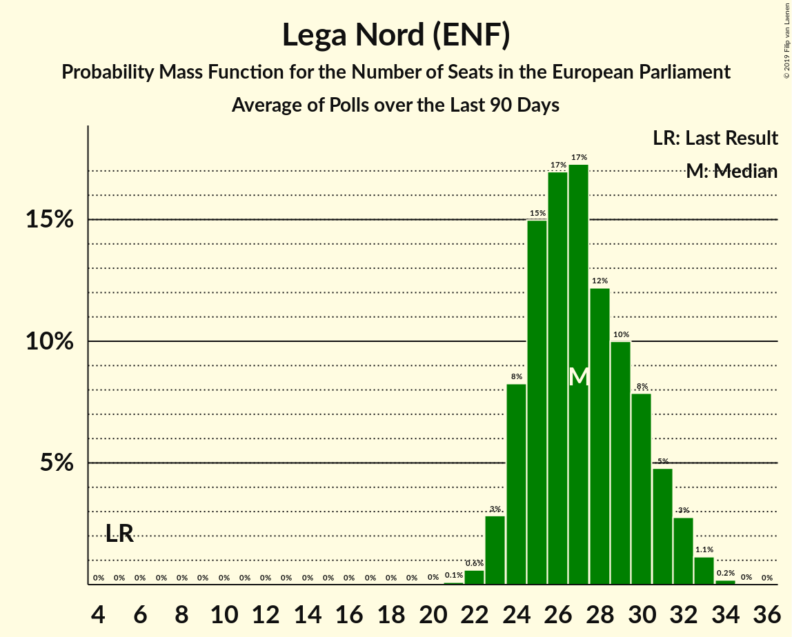

# Lega Nord (ENF)

<a href="#voting-intentions">Voting Intentions</a> | <a href="#seats">Seats</a>

## Voting Intentions

Last result: **6.2%** (General Election of 25 May 2014)

### Confidence Intervals

| Period     | Polling firm/Commissioner(s) | Median | 80% Confidence Interval | 90% Confidence Interval | 95% Confidence Interval | 99% Confidence Interval |
|:----------:|:----------------:|:-----------:|:-----------------------:|:-----------------------:|:-----------------------:|:-----------------------:|
| N/A | [Poll Average](average.html) | 14.9% | 12.0–20.5% | 11.0–21.5% | 10.4–22.2% | 9.4–23.1% |
| [19–21 March 2018](2018-03-21-SWG.html) | SWG | 21.6% | 20.5–22.8% | 20.1–23.2% | 19.8–23.5% | 19.3–24.1% |
| [20 March 2018](2018-03-20-Tecnè.html) | Tecnè   Canale 5 | 19.2% | 17.5–21.1% | 17.0–21.6% | 16.6–22.1% | 15.8–23.0% |
| [19 March 2018](2018-03-19-Piepoli.html) | Piepoli | 17.9% | 15.9–20.3% | 15.3–20.9% | 14.8–21.5% | 13.9–22.6% |
| [19 March 2018](2018-03-19-Euromedia.html) | Euromedia | 18.8% | 17.1–20.6% | 16.6–21.2% | 16.2–21.6% | 15.4–22.5% |
| [15 March 2018](2018-03-15-Piepoli.html) | Piepoli   La Stampa | 18.0% | 15.9–20.3% | 15.4–21.0% | 14.9–21.5% | 14.0–22.7% |
| [12–15 March 2018](2018-03-15-DemosPi.html) | Demos & Pi   La Repubblica | 18.2% | 16.9–19.7% | 16.5–20.1% | 16.2–20.5% | 15.5–21.2% |
| [12–14 March 2018](2018-03-14-SWG.html) | SWG   Il Messaggero | 22.3% | 20.7–24.1% | 20.2–24.6% | 19.8–25.0% | 19.1–25.8% |
| [12–16 February 2018](2018-02-16-TermometroPolitico.html) | Termometro Politico | 14.8% | 14.1–15.5% | 13.9–15.7% | 13.8–15.9% | 13.5–16.2% |
| [14–15 February 2018](2018-02-15-Demopolis.html) | Demopolis | 14.2% | 13.2–15.3% | 13.0–15.5% | 12.7–15.8% | 12.3–16.3% |
| [12–14 February 2018](2018-02-14-SWG.html) | SWG | 13.4% | 12.5–14.4% | 12.2–14.7% | 12.0–15.0% | 11.5–15.5% |
| [13–14 February 2018](2018-02-14-Piepoli.html) | Piepoli | 13.1% | 11.3–15.2% | 10.8–15.8% | 10.4–16.3% | 9.6–17.4% |
| [12–14 February 2018](2018-02-14-Ixè.html) | Ixè   Huffington Post | 10.8% | 9.6–12.2% | 9.3–12.5% | 9.0–12.9% | 8.5–13.6% |
| [12–14 February 2018](2018-02-14-Index.html) | Index | 13.8% | 12.3–15.4% | 11.9–15.9% | 11.5–16.3% | 10.9–17.1% |
| [14 February 2018](2018-02-14-Euromedia.html) | Euromedia | 14.2% | 12.8–15.9% | 12.3–16.4% | 12.0–16.9% | 11.3–17.7% |
| [12–14 February 2018](2018-02-14-DemosPi.html) | Demos & Pi   La Repubblica | 13.2% | 11.9–14.7% | 11.6–15.1% | 11.3–15.5% | 10.7–16.2% |
| [5–14 February 2018](2018-02-14-Demetra.html) | Demetra | 14.7% | 14.1–15.3% | 14.0–15.5% | 13.8–15.6% | 13.5–15.9% |
| [12–13 February 2018](2018-02-13-Tecnè.html) | Tecnè | 12.8% | 11.5–14.2% | 11.2–14.6% | 10.9–15.0% | 10.3–15.7% |
| [12 February 2018](2018-02-12-Euromedia.html) | Euromedia | 14.1% | 12.7–15.8% | 12.2–16.3% | 11.9–16.7% | 11.2–17.6% |
| [8–12 February 2018](2018-02-12-Bidimedia.html) | Bidimedia | 14.5% | 13.3–15.9% | 13.0–16.2% | 12.7–16.6% | 12.2–17.2% |
| [8–11 February 2018](2018-02-11-LorienConsulting.html) | Lorien Consulting | 12.3% | 11.1–13.7% | 10.7–14.1% | 10.4–14.5% | 9.8–15.2% |
| [9–11 February 2018](2018-02-11-EMG.html) | EMG   TG LA7 | 13.9% | 12.8–15.0% | 12.5–15.4% | 12.3–15.7% | 11.8–16.2% |
| [3–8 February 2018](2018-02-08-TermometroPolitico.html) | Termometro Politico | 14.8% | 14.1–15.6% | 13.8–15.8% | 13.7–16.0% | 13.3–16.4% |
| [8 February 2018](2018-02-08-Index.html) | Index | 14.1% | 12.7–15.8% | 12.2–16.3% | 11.9–16.7% | 11.2–17.6% |
| [6–7 February 2018](2018-02-07-Tecnè.html) | Tecnè | 13.2% | 11.9–14.6% | 11.5–15.0% | 11.2–15.4% | 10.6–16.1% |
| [5–7 February 2018](2018-02-07-SWG.html) | SWG | 13.1% | 12.0–14.3% | 11.7–14.6% | 11.4–14.9% | 11.0–15.5% |

### Probability Mass Function

The following table shows the probability mass function per percentage block of voting intentions for the [poll average](average.html) for Lega Nord (ENF).

| Voting Intentions | Probability | Accumulated | Special Marks |
|:-----------------:|:-----------:|:-----------:|:-------------:|
| 5.5–6.5% | 0% | 100% | Last Result |
| 6.5–7.5% | 0% | 100% |  |
| 7.5–8.5% | 0% | 100% |  |
| 8.5–9.5% | 0.6% | 100% |  |
| 9.5–10.5% | 3% | 99.3% |  |
| 10.5–11.5% | 5% | 97% |  |
| 11.5–12.5% | 6% | 92% |  |
| 12.5–13.5% | 9% | 87% |  |
| 13.5–14.5% | 18% | 77% |  |
| 14.5–15.5% | 18% | 59% | Median |
| 15.5–16.5% | 5% | 41% |  |
| 16.5–17.5% | 5% | 36% |  |
| 17.5–18.5% | 8% | 31% |  |
| 18.5–19.5% | 8% | 23% |  |
| 19.5–20.5% | 6% | 15% |  |
| 20.5–21.5% | 5% | 10% |  |
| 21.5–22.5% | 4% | 5% |  |
| 22.5–23.5% | 1.2% | 1.4% |  |
| 23.5–24.5% | 0.2% | 0.2% |  |
| 24.5–25.5% | 0% | 0% |  |

## Seats

Last result: **5** seats (General Election of 25 May 2014)

### Confidence Intervals

| Period     | Polling firm/Commissioner(s) | Median | 80% Confidence Interval | 90% Confidence Interval | 95% Confidence Interval | 99% Confidence Interval |
|:----------:|:----------------:|:------:|:-----------------------:|:-----------------------:|:-----------------------:|:-----------------------:|
| N/A | [Poll Average](average.html) | 13 | 10–16 | 9–18 | 9–18 | 9–18 |
| [19–21 March 2018](2018-03-21-SWG.html) | SWG | 18 | 16–18 | 16–18 | 16–18 | 16–18 |
| [20 March 2018](2018-03-20-Tecnè.html) | Tecnè   Canale 5 | 13 | 13–17 | 13–17 | 13–18 | 13–18 |
| [19 March 2018](2018-03-19-Piepoli.html) | Piepoli | 12 | 12–15 | 12–15 | 12–15 | 11–15 |
| [19 March 2018](2018-03-19-Euromedia.html) | Euromedia | 15 | 14–16 | 14–16 | 14–16 | 14–17 |
| [15 March 2018](2018-03-15-Piepoli.html) | Piepoli   La Stampa | 15 | 14–18 | 14–18 | 14–18 | 13–19 |
| [12–15 March 2018](2018-03-15-DemosPi.html) | Demos & Pi   La Repubblica | 15 | 14–15 | 13–15 | 13–15 | 12–16 |
| [12–14 March 2018](2018-03-14-SWG.html) | SWG   Il Messaggero | 20 | 20 | 20 | 20 | 19–20 |
| [12–16 February 2018](2018-02-16-TermometroPolitico.html) | Termometro Politico | 13 | 13 | 13 | 13 | 11–14 |
| [14–15 February 2018](2018-02-15-Demopolis.html) | Demopolis | 13 | 13 | 13 | 13 | 13 |
| [12–14 February 2018](2018-02-14-SWG.html) | SWG | 13 | 13 | 13 | 11–13 | 9–13 |
| [13–14 February 2018](2018-02-14-Piepoli.html) | Piepoli | 13 | 13 | 13 | 9–13 | 8–14 |
| [12–14 February 2018](2018-02-14-Ixè.html) | Ixè   Huffington Post | 9 | 9 | 9–10 | 9–10 | 9–10 |
| [12–14 February 2018](2018-02-14-Index.html) | Index | 14 | 13–14 | 11–14 | 11–14 | 10–14 |
| [14 February 2018](2018-02-14-Euromedia.html) | Euromedia | 10 | 10–13 | 10–13 | 10–13 | 8–13 |
| [12–14 February 2018](2018-02-14-DemosPi.html) | Demos & Pi   La Repubblica | 9 | 9–13 | 9–13 | 9–13 | 9–13 |
| [5–14 February 2018](2018-02-14-Demetra.html) | Demetra | 12 | 12 | 11–12 | 11–13 | 11–13 |
| [12–13 February 2018](2018-02-13-Tecnè.html) | Tecnè | 11 | 10–12 | 10–12 | 9–14 | 9–14 |
| [12 February 2018](2018-02-12-Euromedia.html) | Euromedia | 12 | 12 | 12 | 12 | 11–12 |
| [8–12 February 2018](2018-02-12-Bidimedia.html) | Bidimedia | 14 | 14 | 14 | 11–14 | 11–14 |
| [8–11 February 2018](2018-02-11-LorienConsulting.html) | Lorien Consulting | 10 | 9–11 | 9–11 | 9–12 | 9–12 |
| [9–11 February 2018](2018-02-11-EMG.html) | EMG   TG LA7 | 12 | 11–12 | 11–12 | 11–12 | 11–12 |
| [3–8 February 2018](2018-02-08-TermometroPolitico.html) | Termometro Politico | 12 | 12 | 12 | 12–13 | 12–14 |
| [8 February 2018](2018-02-08-Index.html) | Index | 11 | 11 | 11 | 11–12 | 9–14 |
| [6–7 February 2018](2018-02-07-Tecnè.html) | Tecnè | 9 | 9–10 | 9–10 | 9–13 | 9–13 |
| [5–7 February 2018](2018-02-07-SWG.html) | SWG | 11 | 11 | 11 | 11 | 10–12 |

### Probability Mass Function

The following table shows the probability mass function per seat for the [poll average](average.html) for Lega Nord (ENF).

| Number of Seats | Probability | Accumulated | Special Marks |
|:---------------:|:-----------:|:-----------:|:-------------:|
| 5 | 0% | 100% | Last Result |
| 6 | 0% | 100% |  |
| 7 | 0% | 100% |  |
| 8 | 0.1% | 100% |  |
| 9 | 8% | 99.9% |  |
| 10 | 4% | 92% |  |
| 11 | 6% | 88% |  |
| 12 | 18% | 82% |  |
| 13 | 22% | 63% | Median |
| 14 | 20% | 41% |  |
| 15 | 9% | 21% |  |
| 16 | 6% | 13% |  |
| 17 | 0.9% | 6% |  |
| 18 | 5% | 5% |  |
| 19 | 0% | 0% |  |

