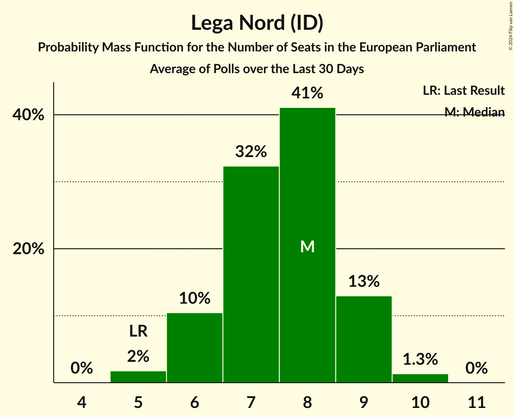

# Lega Nord (ID)

<a href="#voting-intentions">Voting Intentions</a> | <a href="#seats">Seats</a>

## Voting Intentions

Last result: **6.2%** (General Election of 26 May 2019)

### Confidence Intervals

| Period     | Polling firm/Commissioner(s) | Median | 80% Confidence Interval | 90% Confidence Interval | 95% Confidence Interval | 99% Confidence Interval |
|:----------:|:----------------:|:-----------:|:-----------------------:|:-----------------------:|:-----------------------:|:-----------------------:|
| N/A | [Poll Average](average.html) | 12.1% | 10.2–14.0% | 9.6–14.8% | 9.1–15.8% | 8.3–17.3% |
| [6–9 September 2022](2022-09-09-SWG.html) | SWG   La7 | 12.1% | 10.9–13.4% | 10.6–13.7% | 10.3–14.1% | 9.8–14.7% |
| [7–9 September 2022](2022-09-09-Quorum–YouTrend.html) | Quorum – YouTrend   Sky TG24 | 12.9% | 11.6–14.4% | 11.3–14.8% | 11.0–15.1% | 10.4–15.9% |
| [9 September 2022](2022-09-09-Piepoli.html) | Piepoli | 12.0% | 10.3–14.1% | 9.8–14.6% | 9.4–15.2% | 8.7–16.2% |
| [6–9 September 2022](2022-09-09-Lab2101.html) | Lab2101   Affari Italiani | 15.7% | 14.3–17.3% | 13.9–17.7% | 13.6–18.1% | 12.9–18.9% |
| [9 September 2022](2022-09-09-IZI.html) | IZI | 10.0% | 8.8–11.3% | 8.5–11.6% | 8.2–12.0% | 7.7–12.6% |
| [8–9 September 2022](2022-09-09-BiDiMedia.html) | BiDiMedia | 11.8% | 11.1–12.6% | 10.9–12.8% | 10.7–13.0% | 10.3–13.4% |
| [6–8 September 2022](2022-09-08-TermometroPolitico.html) | Termometro Politico | 13.3% | 12.7–14.0% | 12.5–14.2% | 12.3–14.3% | 12.1–14.6% |
| [6–8 September 2022](2022-09-08-Tecnè.html) | Tecnè   Canale 5 | 11.4% | 10.5–12.3% | 10.3–12.6% | 10.1–12.9% | 9.7–13.3% |
| [6–7 September 2022](2022-09-07-NotoSondaggi.html) | Noto Sondaggi   Rai 1 | 13.0% | 11.7–14.5% | 11.4–14.9% | 11.1–15.2% | 10.5–16.0% |
| [6–7 September 2022](2022-09-07-IndexResearch.html) | Index Research | 11.0% | 9.7–12.5% | 9.3–13.0% | 9.0–13.4% | 8.4–14.1% |
| [3–7 September 2022](2022-09-07-Hokuto.html) | Hokuto | 11.0% | 10.0–12.1% | 9.7–12.4% | 9.5–12.7% | 9.1–13.2% |
| [7 September 2022](2022-09-07-GDC.html) | GDC | 12.5% | 11.3–13.9% | 11.0–14.3% | 10.7–14.6% | 10.1–15.3% |
| [7 September 2022](2022-09-07-Euromedia.html) | Euromedia | 11.8% | 10.4–13.3% | 10.0–13.8% | 9.7–14.2% | 9.1–15.0% |
| [5–7 September 2022](2022-09-07-EMG.html) | EMG | 12.0% | 10.8–13.4% | 10.4–13.8% | 10.1–14.2% | 9.6–14.9% |
| [5–7 September 2022](2022-09-07-DemosPi.html) | Demos & Pi   La Repubblica | 12.0% | 10.8–13.4% | 10.4–13.8% | 10.1–14.2% | 9.6–14.9% |
| [5–7 September 2022](2022-09-07-Demopolis.html) | Demopolis | 13.5% | 12.7–14.3% | 12.5–14.6% | 12.3–14.8% | 11.9–15.2% |
| [4–7 September 2022](2022-09-07-BiDiMedia.html) | BiDiMedia   Fanpage.it | 12.3% | N/A | N/A | N/A | N/A |
| [4–6 September 2022](2022-09-06-Ipsos.html) | Ipsos   Corriere della Sera | 12.5% | 11.2–13.9% | 10.9–14.3% | 10.6–14.7% | 10.0–15.4% |
| [5–6 September 2022](2022-09-06-BiDiMedia.html) | BiDiMedia | 12.4% | N/A | N/A | N/A | N/A |
| [1–5 September 2022](2022-09-05-Tecnè.html) | Tecnè   Canale 5 | 12.0% | N/A | N/A | N/A | N/A |
| [31 August–5 September 2022](2022-09-05-SWG.html) | SWG   La7 | 12.1% | N/A | N/A | N/A | N/A |
| [4–5 September 2022](2022-09-05-Ipsos.html) | Ipsos | 11.8% | N/A | N/A | N/A | N/A |
| [5 September 2022](2022-09-05-EMG.html) | EMG | 12.3% | N/A | N/A | N/A | N/A |
| [31 August–5 September 2022](2022-09-05-CISE.html) | CISE | 9.6% | 8.5–11.1% | 8.1–11.4% | 7.8–11.8% | 7.3–12.5% |
| [2–4 September 2022](2022-09-04-Quorum–YouTrend.html) | Quorum – YouTrend   Sky TG24 | 13.5% | N/A | N/A | N/A | N/A |
| [31 August–4 September 2022](2022-09-04-GPF.html) | GPF | 12.7% | 11.9–13.5% | 11.7–13.7% | 11.6–13.9% | 11.2–14.3% |
| [29 August–2 September 2022](2022-09-02-Lab2101.html) | Lab2101   Affari Italiani | 16.8% | N/A | N/A | N/A | N/A |
| [29 August–2 September 2022](2022-09-02-Ixè.html) | Ixè | 10.9% | 9.8–12.1% | 9.5–12.5% | 9.3–12.8% | 8.8–13.4% |
| [1–2 September 2022](2022-09-02-Demopolis.html) | Demopolis | 13.6% | N/A | N/A | N/A | N/A |
| [31 August–1 September 2022](2022-09-01-TermometroPolitico.html) | Termometro Politico | 13.9% | N/A | N/A | N/A | N/A |
| [30–31 August 2022](2022-08-31-NotoSondaggi.html) | Noto Sondaggi   Rai 1 | 13.5% | 12.2–15.0% | 11.8–15.4% | 11.5–15.8% | 10.9–16.5% |
| [30–31 August 2022](2022-08-31-IZI.html) | IZI | 12.0% | 10.7–13.4% | 10.4–13.7% | 10.1–14.1% | 9.6–14.8% |
| [30 August 2022](2022-08-30-Piepoli.html) | Piepoli | 12.0% | 10.3–14.1% | 9.8–14.6% | 9.4–15.2% | 8.7–16.2% |
| [29–30 August 2022](2022-08-30-Ipsos.html) | Ipsos   Corriere della Sera | 13.4% | 12.1–14.9% | 11.7–15.3% | 11.4–15.7% | 10.8–16.4% |
| [29–30 August 2022](2022-08-30-Euromedia.html) | Euromedia   Rai 1 | 12.5% | 11.1–14.1% | 10.7–14.6% | 10.4–15.0% | 9.8–15.8% |
| [29–30 August 2022](2022-08-30-BiDiMedia.html) | BiDiMedia | 12.7% | 11.5–14.0% | 11.2–14.3% | 10.9–14.7% | 10.4–15.3% |
| [26–29 August 2022](2022-08-29-Tecnè.html) | Tecnè | 12.9% | 12.0–13.9% | 11.7–14.2% | 11.5–14.4% | 11.1–15.0% |
| [24–29 August 2022](2022-08-29-SWG.html) | SWG   La7 | 12.5% | 11.3–13.8% | 11.0–14.2% | 10.7–14.5% | 10.2–15.2% |
| [29 August 2022](2022-08-29-EMG.html) | EMG   Rai 3 | 12.7% | 11.6–13.8% | 11.3–14.2% | 11.1–14.4% | 10.6–15.0% |
| [25–28 August 2022](2022-08-28-GDC.html) | GDC | 13.1% | 11.9–14.5% | 11.6–14.9% | 11.3–15.3% | 10.7–16.0% |
| [24–27 August 2022](2022-08-27-Quorum–YouTrend.html) | Quorum – YouTrend   Sky TG24 | 13.8% | 12.5–15.3% | 12.1–15.7% | 11.8–16.1% | 11.2–16.8% |
| [24–25 August 2022](2022-08-25-TermometroPolitico.html) | Termometro Politico | 14.3% | 13.7–14.9% | 13.5–15.1% | 13.4–15.3% | 13.1–15.6% |
| [25 August 2022](2022-08-25-Piepoli.html) | Piepoli   RaiNews24 | 12.6% | 10.9–14.7% | 10.4–15.3% | 10.0–15.8% | 9.2–16.9% |
| [25 August 2022](2022-08-25-BiDiMedia.html) | BiDiMedia | 13.0% | N/A | N/A | N/A | N/A |
| [23–24 August 2022](2022-08-24-Tecnè.html) | Tecnè | 12.7% | N/A | N/A | N/A | N/A |
| [22–24 August 2022](2022-08-24-Demopolis.html) | Demopolis | 14.5% | 13.3–15.8% | 13.0–16.1% | 12.7–16.4% | 12.2–17.1% |
| [10–23 August 2022](2022-08-23-Lab2101.html) | Lab2101   Affari Italiani | 16.9% | 15.7–18.2% | 15.3–18.5% | 15.0–18.9% | 14.5–19.5% |
| [20 August 2022](2022-08-20-NotoSondaggi.html) | Noto Sondaggi | 12.5% | N/A | N/A | N/A | N/A |
| [13–20 August 2022](2022-08-20-Lab2101.html) | Lab2101   Affari Italiani | 16.7% | N/A | N/A | N/A | N/A |
| [19 August 2022](2022-08-19-Piepoli.html) | Piepoli | 13.0% | N/A | N/A | N/A | N/A |
| [16–18 August 2022](2022-08-18-TermometroPolitico.html) | Termometro Politico | 14.3% | N/A | N/A | N/A | N/A |
| [17–18 August 2022](2022-08-18-Tecnè.html) | Tecnè | 12.9% | N/A | N/A | N/A | N/A |
| [17–18 August 2022](2022-08-18-BiDiMedia.html) | BiDiMedia | 13.6% | N/A | N/A | N/A | N/A |
| [17 August 2022](2022-08-17-NotoSondaggi.html) | Noto Sondaggi | 12.5% | 11.2–13.9% | 10.9–14.3% | 10.6–14.7% | 10.0–15.4% |
| [11–14 August 2022](2022-08-14-GDC.html) | GDC | 12.5% | N/A | N/A | N/A | N/A |
| [6–12 August 2022](2022-08-12-Lab2101.html) | Lab2101   Affari Italiani | 16.3% | 14.9–17.9% | 14.5–18.3% | 14.1–18.7% | 13.5–19.5% |
| [8–11 August 2022](2022-08-11-Tecnè.html) | Tecnè   Rete 4 | 13.0% | N/A | N/A | N/A | N/A |
| [10–11 August 2022](2022-08-11-Demopolis.html) | Demopolis | 15.2% | 13.9–16.6% | 13.6–17.0% | 13.3–17.3% | 12.7–18.0% |
| [8–9 August 2022](2022-08-09-EMG.html) | EMG | 12.5% | N/A | N/A | N/A | N/A |
| [3–8 August 2022](2022-08-08-SWG.html) | SWG | 12.5% | 11.3–13.8% | 11.0–14.2% | 10.7–14.5% | 10.2–15.2% |
| [5–7 August 2022](2022-08-07-Quorum–YouTrend.html) | Quorum – YouTrend   Sky TG24 | 14.0% | N/A | N/A | N/A | N/A |
| [4–6 August 2022](2022-08-06-BiDiMedia.html) | BiDiMedia | 13.3% | 12.6–14.0% | 12.5–14.2% | 12.3–14.4% | 12.0–14.7% |
| [5 August 2022](2022-08-05-Lab2101.html) | Lab2101   Affari Italiani | 17.2% | 15.7–18.8% | 15.3–19.3% | 15.0–19.7% | 14.3–20.5% |
| [4 August 2022](2022-08-04-Tecnè.html) | Tecnè | 13.4% | 11.9–15.0% | 11.5–15.5% | 11.2–15.9% | 10.5–16.8% |
| [3 August 2022](2022-08-03-BiDiMedia.html) | BiDiMedia | 13.5% | N/A | N/A | N/A | N/A |
| [29 July–2 August 2022](2022-08-02-DemosPi.html) | Demos & Pi | 13.2% | 11.9–14.7% | 11.6–15.1% | 11.2–15.5% | 10.7–16.2% |
| [27 July–1 August 2022](2022-08-01-SWG.html) | SWG   La7 | 12.0% | N/A | N/A | N/A | N/A |
| [29–31 July 2022](2022-07-31-Quorum–YouTrend.html) | Quorum – YouTrend   Sky TG24 | 13.5% | 12.2–15.0% | 11.8–15.4% | 11.5–15.8% | 10.9–16.5% |
| [30 July 2022](2022-07-30-NotoSondaggi.html) | Noto Sondaggi | 13.0% | 11.7–14.5% | 11.4–14.9% | 11.1–15.2% | 10.5–16.0% |
| [29–30 July 2022](2022-07-30-Ipsos.html) | Ipsos   Corriere della Sera | 13.5% | 12.2–15.0% | 11.8–15.4% | 11.5–15.8% | 10.9–16.5% |
| [26–28 July 2022](2022-07-28-TermometroPolitico.html) | Termometro Politico | 14.7% | 14.0–15.4% | 13.8–15.6% | 13.7–15.8% | 13.4–16.1% |
| [28 July 2022](2022-07-28-Tecnè.html) | Tecnè   Agenzia Dire | 13.9% | 12.6–15.4% | 12.2–15.8% | 11.9–16.2% | 11.3–16.9% |
| [27 July 2022](2022-07-27-EMG.html) | EMG | 12.5% | 11.2–13.9% | 10.9–14.3% | 10.6–14.7% | 10.0–15.4% |
| [26 July 2022](2022-07-26-Piepoli.html) | Piepoli | 14.6% | 12.7–16.8% | 12.2–17.4% | 11.8–18.0% | 10.9–19.1% |
| [21–25 July 2022](2022-07-25-SWG.html) | SWG   La7 | 12.4% | 11.3–13.7% | 10.9–14.1% | 10.7–14.4% | 10.1–15.1% |
| [22–23 July 2022](2022-07-23-Quorum–YouTrend.html) | Quorum – YouTrend   Sky TG24 | 13.4% | 12.1–14.9% | 11.7–15.3% | 11.4–15.7% | 10.8–16.4% |
| [21–23 July 2022](2022-07-23-Demopolis.html) | Demopolis | 14.2% | 13.2–15.3% | 13.0–15.5% | 12.7–15.8% | 12.3–16.3% |
| [21–23 July 2022](2022-07-23-BiDiMedia.html) | BiDiMedia | 14.5% | 13.4–15.8% | 13.1–16.1% | 12.8–16.4% | 12.3–17.0% |
| [22 July 2022](2022-07-22-Euromedia.html) | Euromedia   La Stampa | 14.0% | 12.7–15.5% | 12.3–15.9% | 12.0–16.3% | 11.4–17.0% |
| [20–21 July 2022](2022-07-21-TermometroPolitico.html) | Termometro Politico | 15.4% | 14.7–16.2% | 14.4–16.4% | 14.3–16.6% | 13.9–16.9% |
| [21 July 2022](2022-07-21-Tecnè.html) | Tecnè   Agenzia Dire | 14.6% | 13.1–16.3% | 12.7–16.8% | 12.3–17.3% | 11.7–18.1% |
| [20–21 July 2022](2022-07-21-Lab2101.html) | Lab2101   Affari Italiani | 16.8% | 15.4–18.4% | 15.0–18.9% | 14.6–19.3% | 13.9–20.0% |
| [19 July 2022](2022-07-19-Piepoli.html) | Piepoli | 15.0% | N/A | N/A | N/A | N/A |
| [13–18 July 2022](2022-07-18-SWG.html) | SWG   La7 | 14.0% | 12.8–15.4% | 12.4–15.7% | 12.1–16.1% | 11.6–16.8% |
| [17 July 2022](2022-07-17-Piepoli.html) | Piepoli   La7 | 14.6% | N/A | N/A | N/A | N/A |
| [15–16 July 2022](2022-07-16-Euromedia.html) | Euromedia   La Stampa | 14.6% | 13.2–16.1% | 12.9–16.6% | 12.5–16.9% | 11.9–17.7% |
| [15 July 2022](2022-07-15-Tecnè.html) | Tecnè   Agenzia Dire | 14.5% | N/A | N/A | N/A | N/A |
| [13–14 July 2022](2022-07-14-TermometroPolitico.html) | Termometro Politico | 16.0% | 15.2–16.8% | 15.0–17.1% | 14.8–17.3% | 14.4–17.7% |
| [11–14 July 2022](2022-07-14-BiDiMedia.html) | BiDiMedia | 14.2% | 13.3–15.3% | 13.0–15.6% | 12.8–15.9% | 12.3–16.4% |
| [6–11 July 2022](2022-07-11-SWG.html) | SWG   La7 | 14.5% | 13.3–15.9% | 12.9–16.3% | 12.6–16.6% | 12.0–17.3% |
| [8 July 2022](2022-07-08-Tecnè.html) | Tecnè   Agenzia Dire | 14.1% | 12.8–15.6% | 12.4–16.0% | 12.1–16.4% | 11.5–17.1% |
| [6–7 July 2022](2022-07-07-TermometroPolitico.html) | Termometro Politico | 16.3% | N/A | N/A | N/A | N/A |
| [29 June–4 July 2022](2022-07-04-SWG.html) | SWG   La7 | 14.3% | N/A | N/A | N/A | N/A |
| [4 July 2022](2022-07-04-Euromedia.html) | Euromedia   La Stampa | 14.5% | 13.2–16.0% | 12.8–16.4% | 12.5–16.8% | 11.8–17.6% |
| [30 June–1 July 2022](2022-07-01-Tecnè.html) | Tecnè   Agenzia Dire | 14.7% | 13.3–16.2% | 13.0–16.7% | 12.6–17.0% | 12.0–17.8% |
| [29–30 June 2022](2022-06-30-TermometroPolitico.html) | Termometro Politico | 16.6% | 15.8–17.5% | 15.6–17.7% | 15.4–17.9% | 15.0–18.3% |
| [28–30 June 2022](2022-06-30-Ipsos.html) | Ipsos   Corriere della Sera | 15.0% | 13.6–16.5% | 13.2–17.0% | 12.9–17.4% | 12.3–18.1% |
| [27–28 June 2022](2022-06-28-EMG.html) | EMG | 13.5% | 12.2–15.0% | 11.8–15.4% | 11.5–15.8% | 10.9–16.5% |
| [27–28 June 2022](2022-06-28-Demopolis.html) | Demopolis | 15.2% | 14.2–16.3% | 13.9–16.6% | 13.7–16.8% | 13.2–17.4% |
| [22–27 June 2022](2022-06-27-SWG.html) | SWG   La7 | 14.7% | 13.4–16.0% | 13.1–16.4% | 12.8–16.8% | 12.2–17.5% |
| [27 June 2022](2022-06-27-NotoSondaggi.html) | Noto Sondaggi   Rai 1 | 14.0% | 12.7–15.5% | 12.3–15.9% | 12.0–16.3% | 11.4–17.0% |
| [24–25 June 2022](2022-06-25-Winpoll.html) | Winpoll   Il Sole 24 Ore | 15.1% | 13.7–16.6% | 13.3–17.1% | 13.0–17.5% | 12.4–18.2% |
| [21–24 June 2022](2022-06-24-TermometroPolitico.html) | Termometro Politico | 16.7% | N/A | N/A | N/A | N/A |
| [23–24 June 2022](2022-06-24-Tecnè.html) | Tecnè   Agenzia Dire | 14.8% | 13.4–16.3% | 13.1–16.8% | 12.7–17.1% | 12.1–17.9% |
| [22 June 2022](2022-06-22-Euromedia.html) | Euromedia   La Stampa | 14.7% | 13.3–16.2% | 13.0–16.7% | 12.6–17.0% | 12.0–17.8% |
| [15–20 June 2022](2022-06-20-SWG.html) | SWG   La7 | 15.1% | 13.8–16.5% | 13.5–16.9% | 13.2–17.2% | 12.6–17.9% |
| [16–17 June 2022](2022-06-17-Tecnè.html) | Tecnè   Agenzia Dire | 15.2% | 13.8–16.8% | 13.4–17.2% | 13.1–17.6% | 12.5–18.3% |
| [15–16 June 2022](2022-06-16-TermometroPolitico.html) | Termometro Politico | 16.8% | 16.0–17.7% | 15.7–17.9% | 15.5–18.2% | 15.2–18.6% |
| [15–16 June 2022](2022-06-16-Lab2101.html) | Lab2101   Affari Italiani | 17.5% | 16.0–19.1% | 15.6–19.6% | 15.3–20.0% | 14.6–20.8% |
| [13–14 June 2022](2022-06-14-Euromedia.html) | Euromedia | 15.2% | 13.7–17.0% | 13.3–17.5% | 12.9–17.9% | 12.2–18.8% |
| [8–13 June 2022](2022-06-13-SWG.html) | SWG   La7 | 15.0% | N/A | N/A | N/A | N/A |
| [13 June 2022](2022-06-13-EMG.html) | EMG   Rai 3 | 14.1% | 13.0–15.3% | 12.7–15.6% | 12.4–15.9% | 11.9–16.5% |
| [12 June 2022](2022-06-12-NotoSondaggi.html) | Noto Sondaggi   Rai 1 | 15.0% | 13.6–16.5% | 13.2–17.0% | 12.9–17.4% | 12.3–18.1% |
| [25–26 May 2022](2022-05-26-TermometroPolitico.html) | Termometro Politico | 17.3% | 16.4–18.2% | 16.2–18.5% | 16.0–18.7% | 15.6–19.1% |
| [23–25 May 2022](2022-05-25-Ipsos.html) | Ipsos   Corriere della Sera | 15.1% | 13.7–16.6% | 13.3–17.1% | 13.0–17.5% | 12.4–18.2% |
| [25 May 2022](2022-05-25-Index.html) | Index   La7 | 15.2% | 13.7–17.0% | 13.3–17.5% | 12.9–17.9% | 12.2–18.8% |
| [25 May 2022](2022-05-25-Euromedia.html) | Euromedia   Rai 1 | 15.8% | 14.2–17.5% | 13.8–18.0% | 13.4–18.4% | 12.7–19.3% |
| [23–25 May 2022](2022-05-25-DemosPi.html) | Demos & Pi   La Repubblica | 15.6% | 14.3–17.2% | 13.9–17.6% | 13.5–18.0% | 12.9–18.8% |
| [24 May 2022](2022-05-24-EMG.html) | EMG   Rai 3 | 15.2% | 14.1–16.5% | 13.7–16.8% | 13.5–17.1% | 12.9–17.8% |
| [24 May 2022](2022-05-24-Demopolis.html) | Demopolis | 16.5% | 15.5–17.6% | 15.2–17.9% | 14.9–18.2% | 14.4–18.7% |
| [18–23 May 2022](2022-05-23-SWG.html) | SWG   La7 | 15.0% | 13.7–16.4% | 13.4–16.8% | 13.1–17.1% | 12.5–17.8% |
| [18–19 May 2022](2022-05-19-TermometroPolitico.html) | Termometro Politico | 17.4% | 16.5–18.3% | 16.3–18.5% | 16.1–18.8% | 15.7–19.2% |
| [19 May 2022](2022-05-19-Tecnè.html) | Tecnè   Agenzia Dire | 15.3% | 13.9–16.9% | 13.5–17.3% | 13.2–17.7% | 12.6–18.4% |
| [18 May 2022](2022-05-18-Piepoli.html) | Piepoli   RaiNews24 | 16.0% | 14.1–18.3% | 13.5–18.9% | 13.0–19.5% | 12.2–20.6% |
| [18 May 2022](2022-05-18-NotoSondaggi.html) | Noto Sondaggi   Rai 1 | 16.9% | 15.5–18.5% | 15.0–19.0% | 14.7–19.4% | 14.0–20.1% |
| [18 May 2022](2022-05-18-Index.html) | Index   La7 | 15.4% | N/A | N/A | N/A | N/A |
| [11–16 May 2022](2022-05-16-SWG.html) | SWG   La7 | 15.6% | 14.3–17.0% | 13.9–17.4% | 13.6–17.8% | 13.0–18.5% |
| [16 May 2022](2022-05-16-EMG.html) | EMG   Rai 3 | 15.9% | 14.8–17.1% | 14.5–17.5% | 14.2–17.8% | 13.7–18.4% |
| [11–12 May 2022](2022-05-12-TermometroPolitico.html) | Termometro Politico | 17.8% | 16.9–18.7% | 16.7–19.0% | 16.5–19.2% | 16.0–19.7% |
| [12 May 2022](2022-05-12-Tecnè.html) | Tecnè   Agenzia Dire | 14.9% | N/A | N/A | N/A | N/A |
| [11 May 2022](2022-05-11-Index.html) | Index   La7 | 15.5% | 14.0–17.3% | 13.5–17.7% | 13.2–18.2% | 12.5–19.1% |
| [4–9 May 2022](2022-05-09-SWG.html) | SWG   La7 | 15.6% | N/A | N/A | N/A | N/A |
| [6 May 2022](2022-05-06-Tecnè.html) | Tecnè   Agenzia Dire | 15.4% | N/A | N/A | N/A | N/A |
| [4–5 May 2022](2022-05-05-TermometroPolitico.html) | Termometro Politico | 17.7% | N/A | N/A | N/A | N/A |
| [4 May 2022](2022-05-04-Piepoli.html) | Piepoli   RaiNews24 | 16.6% | 14.6–18.9% | 14.1–19.6% | 13.6–20.1% | 12.7–21.3% |
| [4 May 2022](2022-05-04-Index.html) | Index   La7 | 15.6% | N/A | N/A | N/A | N/A |
| [27 April–2 May 2022](2022-05-02-SWG.html) | SWG   La7 | 15.8% | N/A | N/A | N/A | N/A |
| [29 April 2022](2022-04-29-Tecnè.html) | Tecnè   Agenzia Dire | 15.4% | 14.0–16.9% | 13.6–17.4% | 13.3–17.8% | 12.7–18.5% |
| [27–28 April 2022](2022-04-28-TermometroPolitico.html) | Termometro Politico | 17.9% | 17.0–18.9% | 16.7–19.1% | 16.5–19.4% | 16.1–19.8% |
| [26–28 April 2022](2022-04-28-Ipsos.html) | Ipsos   Corriere della Sera | 16.5% | 15.1–18.1% | 14.7–18.5% | 14.3–18.9% | 13.7–19.7% |
| [27–28 April 2022](2022-04-28-Euromedia.html) | Euromedia   La Stampa | 15.9% | 14.5–17.5% | 14.1–17.9% | 13.8–18.3% | 13.1–19.1% |
| [26 April 2022](2022-04-26-Piepoli.html) | Piepoli   RaiNews24 | 16.6% | 14.6–18.9% | 14.1–19.6% | 13.6–20.1% | 12.7–21.3% |
| [20–24 April 2022](2022-04-24-SWG.html) | SWG   La7 | 15.6% | 14.3–17.0% | 13.9–17.4% | 13.6–17.8% | 13.0–18.5% |
| [20–23 April 2022](2022-04-23-Lab2101.html) | Lab2101   Affari Italiani | 18.4% | 16.9–20.1% | 16.5–20.5% | 16.1–20.9% | 15.4–21.7% |
| [22 April 2022](2022-04-22-Tecnè.html) | Tecnè   Agenzia Dire | 15.6% | 14.2–17.2% | 13.8–17.6% | 13.5–18.0% | 12.8–18.8% |
| [20–21 April 2022](2022-04-21-TermometroPolitico.html) | Termometro Politico | 17.7% | N/A | N/A | N/A | N/A |
| [19–20 April 2022](2022-04-20-Demopolis.html) | Demopolis   La7 | 16.0% | 14.8–17.3% | 14.5–17.6% | 14.2–18.0% | 13.7–18.6% |
| [13–19 April 2022](2022-04-19-SWG.html) | SWG   La7 | 15.6% | 14.3–17.0% | 13.9–17.4% | 13.6–17.8% | 13.0–18.5% |
| [13–15 April 2022](2022-04-15-Ixè.html) | Ixè | 15.1% | 13.7–16.6% | 13.3–17.1% | 13.0–17.5% | 12.4–18.2% |
| [13–14 April 2022](2022-04-14-TermometroPolitico.html) | Termometro Politico | 18.0% | 17.1–19.0% | 16.8–19.2% | 16.6–19.5% | 16.2–19.9% |
| [14 April 2022](2022-04-14-Euromedia.html) | Euromedia   Rai 1 | 15.9% | 14.5–17.5% | 14.1–17.9% | 13.8–18.3% | 13.1–19.1% |
| [11–12 April 2022](2022-04-12-DemosPi.html) | Demos & Pi   La Repubblica | 16.8% | 15.4–18.4% | 15.0–18.8% | 14.6–19.2% | 14.0–20.0% |
| [6–11 April 2022](2022-04-11-SWG.html) | SWG   La7 | 15.9% | 14.6–17.3% | 14.3–17.8% | 13.9–18.1% | 13.4–18.8% |
| [9 April 2022](2022-04-09-Lab2101.html) | Lab2101   Affari Italiani | 18.3% | 16.8–20.0% | 16.4–20.4% | 16.0–20.8% | 15.3–21.6% |
| [7–9 April 2022](2022-04-09-BiDiMedia.html) | BiDiMedia | 18.0% | 16.8–19.3% | 16.4–19.7% | 16.1–20.0% | 15.6–20.7% |
| [8 April 2022](2022-04-08-Tecnè.html) | Tecnè   Agenzia Dire | 15.8% | 14.4–17.4% | 14.0–17.8% | 13.7–18.2% | 13.0–19.0% |
| [6–7 April 2022](2022-04-07-TermometroPolitico.html) | Termometro Politico | 18.1% | N/A | N/A | N/A | N/A |
| [4–5 April 2022](2022-04-05-NotoSondaggi.html) | Noto Sondaggi   Rai 1 | 18.0% | 16.5–19.6% | 16.1–20.1% | 15.7–20.5% | 15.0–21.3% |
| [30 March–4 April 2022](2022-04-04-SWG.html) | SWG   La7 | 15.8% | N/A | N/A | N/A | N/A |
| [1 April 2022](2022-04-01-Tecnè.html) | Tecnè   Agenzia Dire | 15.8% | 14.4–17.4% | 14.0–17.8% | 13.7–18.2% | 13.0–19.0% |
| [30–31 March 2022](2022-03-31-TermometroPolitico.html) | Termometro Politico | 18.4% | 17.6–19.3% | 17.3–19.5% | 17.1–19.7% | 16.8–20.1% |
| [30–31 March 2022](2022-03-31-Euromedia.html) | Euromedia | 15.7% | 14.3–17.3% | 13.9–17.7% | 13.6–18.1% | 12.9–18.9% |
| [23–28 March 2022](2022-03-28-SWG.html) | SWG   La7 | 16.0% | 14.7–17.4% | 14.3–17.8% | 14.0–18.2% | 13.4–18.9% |
| [28 March 2022](2022-03-28-Euromedia.html) | Euromedia | 16.2% | N/A | N/A | N/A | N/A |
| [25 March 2022](2022-03-25-Tecnè.html) | Tecnè   Agenzia Dire | 15.9% | 14.5–17.5% | 14.1–17.9% | 13.8–18.3% | 13.1–19.1% |
| [22–25 March 2022](2022-03-25-Ixè.html) | Ixè | 16.3% | 14.9–17.9% | 14.5–18.3% | 14.1–18.7% | 13.5–19.5% |
| [23–24 March 2022](2022-03-24-TermometroPolitico.html) | Termometro Politico | 18.1% | 17.2–19.0% | 17.0–19.3% | 16.8–19.5% | 16.3–20.0% |
| [22–24 March 2022](2022-03-24-Ipsos.html) | Ipsos   Corriere della Sera | 17.5% | 16.0–19.1% | 15.6–19.6% | 15.3–20.0% | 14.6–20.8% |
| [22 March 2022](2022-03-22-Euromedia.html) | Euromedia   Rai 1 | 16.2% | N/A | N/A | N/A | N/A |
| [16–21 March 2022](2022-03-21-SWG.html) | SWG   La7 | 16.4% | N/A | N/A | N/A | N/A |
| [18 March 2022](2022-03-18-Tecnè.html) | Tecnè   Agenzia Dire | 15.9% | 14.5–17.5% | 14.1–17.9% | 13.8–18.3% | 13.1–19.1% |
| [15–17 March 2022](2022-03-17-TermometroPolitico.html) | Termometro Politico | 18.1% | N/A | N/A | N/A | N/A |
| [9–14 March 2022](2022-03-14-SWG.html) | SWG   La7 | 16.2% | N/A | N/A | N/A | N/A |
| [11–12 March 2022](2022-03-12-Euromedia.html) | Euromedia   La Stampa | 15.8% | N/A | N/A | N/A | N/A |
| [11 March 2022](2022-03-11-Tecnè.html) | Tecnè   Agenzia Dire | 16.1% | N/A | N/A | N/A | N/A |
| [9 March 2022](2022-03-09-Lab2101.html) | Lab2101   Affari Italiani | 17.9% | 16.0–20.1% | 15.5–20.7% | 15.0–21.2% | 14.1–22.3% |
| [5–9 March 2022](2022-03-09-Ixè.html) | Ixè | 17.0% | 15.5–18.6% | 15.1–19.1% | 14.8–19.5% | 14.1–20.3% |
| [8 March 2022](2022-03-08-NotoSondaggi.html) | Noto Sondaggi   Rai 1 | 17.0% | 15.5–18.6% | 15.1–19.1% | 14.8–19.5% | 14.1–20.3% |
| [2–7 March 2022](2022-03-07-SWG.html) | SWG   La7 | 17.0% | N/A | N/A | N/A | N/A |
| [4 March 2022](2022-03-04-Tecnè.html) | Tecnè   Agenzia Dire | 16.3% | N/A | N/A | N/A | N/A |
| [2–4 March 2022](2022-03-04-DemosPi.html) | Demos & Pi   La Repubblica | 17.6% | 16.2–19.3% | 15.8–19.7% | 15.4–20.1% | 14.7–20.9% |
| [2–3 March 2022](2022-03-03-TermometroPolitico.html) | Termometro Politico | 18.6% | N/A | N/A | N/A | N/A |
| [23–28 February 2022](2022-02-28-SWG.html) | SWG   La7 | 17.2% | N/A | N/A | N/A | N/A |
| [25 February 2022](2022-02-25-Tecnè.html) | Tecnè   Agenzia Dire | 16.3% | 14.9–17.9% | 14.5–18.3% | 14.1–18.7% | 13.5–19.5% |
| [22–24 February 2022](2022-02-24-TermometroPolitico.html) | Termometro Politico | 19.0% | 18.1–19.9% | 17.9–20.2% | 17.6–20.4% | 17.2–20.9% |
| [22–24 February 2022](2022-02-24-Ipsos.html) | Ipsos   Corriere della Sera | 18.0% | N/A | N/A | N/A | N/A |
| [22–23 February 2022](2022-02-23-Demopolis.html) | Demopolis   La7 | 17.5% | 16.3–18.9% | 16.0–19.2% | 15.7–19.6% | 15.1–20.2% |
| [16–21 February 2022](2022-02-21-SWG.html) | SWG   La7 | 16.8% | N/A | N/A | N/A | N/A |
| [21 February 2022](2022-02-21-EMG.html) | EMG   Rai 3 | 17.9% | 16.7–19.2% | 16.4–19.6% | 16.1–19.9% | 15.5–20.5% |
| [18 February 2022](2022-02-18-Tecnè.html) | Tecnè   Agenzia Dire | 16.5% | 15.1–18.1% | 14.7–18.5% | 14.3–18.9% | 13.7–19.7% |
| [16–18 February 2022](2022-02-18-Ixè.html) | Ixè | 16.6% | 15.2–18.2% | 14.8–18.6% | 14.4–19.0% | 13.8–19.8% |
| [15–17 February 2022](2022-02-17-TermometroPolitico.html) | Termometro Politico | 18.7% | N/A | N/A | N/A | N/A |
| [16 February 2022](2022-02-16-Euromedia.html) | Euromedia   Rai 1 | 17.0% | 15.7–18.5% | 15.3–19.0% | 15.0–19.4% | 14.3–20.1% |
| [15 February 2022](2022-02-15-Piepoli.html) | Piepoli   RaiNews24 | 18.6% | 16.5–21.0% | 15.9–21.7% | 15.4–22.3% | 14.5–23.4% |
| [9–14 February 2022](2022-02-14-SWG.html) | SWG   La7 | 17.0% | 15.7–18.5% | 15.3–18.9% | 15.0–19.2% | 14.4–20.0% |
| [7–12 February 2022](2022-02-12-BiDiMedia.html) | BiDiMedia | 17.8% | 16.9–18.7% | 16.7–19.0% | 16.5–19.2% | 16.1–19.7% |
| [11 February 2022](2022-02-11-Tecnè.html) | Tecnè   Agenzia Dire | 16.5% | 15.1–18.1% | 14.7–18.5% | 14.3–18.9% | 13.7–19.7% |
| [9–10 February 2022](2022-02-10-TermometroPolitico.html) | Termometro Politico | 18.9% | 18.1–19.8% | 17.8–20.0% | 17.6–20.2% | 17.3–20.6% |
| [8–10 February 2022](2022-02-10-Quorum–YouTrend.html) | Quorum – YouTrend   Sky TG24 | 15.5% | 13.9–17.2% | 13.5–17.7% | 13.1–18.1% | 12.4–19.0% |
| [9–10 February 2022](2022-02-10-NotoSondaggi.html) | Noto Sondaggi   Rai 1 | 18.0% | 16.5–19.6% | 16.1–20.1% | 15.7–20.5% | 15.0–21.3% |
| [8 February 2022](2022-02-08-EMG.html) | EMG   Rai 3 | 18.1% | 16.8–19.4% | 16.5–19.8% | 16.2–20.1% | 15.6–20.7% |
| [2–7 February 2022](2022-02-07-SWG.html) | SWG   La7 | 17.1% | N/A | N/A | N/A | N/A |
| [2–3 February 2022](2022-02-03-TermometroPolitico.html) | Termometro Politico | 18.7% | N/A | N/A | N/A | N/A |
| [1–3 February 2022](2022-02-03-Ipsos.html) | Ipsos   Corriere della Sera | 18.0% | 16.5–19.6% | 16.1–20.1% | 15.7–20.5% | 15.0–21.3% |
| [1–3 February 2022](2022-02-03-Demopolis.html) | Demopolis   Rai Radio 1 | 18.0% | 16.8–19.3% | 16.4–19.7% | 16.1–20.0% | 15.6–20.7% |
| [2 February 2022](2022-02-02-Tecnè.html) | Tecnè   Agenzia Dire | 16.9% | N/A | N/A | N/A | N/A |
| [2 February 2022](2022-02-02-Index.html) | Index   La7 | 16.8% | 15.2–18.5% | 14.7–19.1% | 14.3–19.5% | 13.6–20.4% |
| [31 January–1 February 2022](2022-02-01-DemosPi.html) | Demos & Pi   La Repubblica | 17.4% | 15.9–18.9% | 15.5–19.4% | 15.2–19.8% | 14.5–20.6% |
| [26–31 January 2022](2022-01-31-SWG.html) | SWG   La7 | 17.5% | 16.2–19.0% | 15.8–19.4% | 15.5–19.8% | 14.8–20.5% |
| [28–31 January 2022](2022-01-31-Ixè.html) | Ixè | 17.2% | 15.7–18.8% | 15.3–19.3% | 15.0–19.7% | 14.3–20.5% |
| [31 January 2022](2022-01-31-Euromedia.html) | Euromedia   La Stampa | 16.7% | 15.3–18.3% | 14.9–18.7% | 14.5–19.1% | 13.9–19.9% |
| [31 January 2022](2022-01-31-EMG.html) | EMG   Rai 3 | 18.2% | 16.9–19.5% | 16.6–19.9% | 16.3–20.3% | 15.7–20.9% |
| [26–27 January 2022](2022-01-27-TermometroPolitico.html) | Termometro Politico | 19.1% | 18.2–20.0% | 18.0–20.3% | 17.8–20.5% | 17.4–20.9% |
| [25 January 2022](2022-01-25-Piepoli.html) | Piepoli   RaiNews24 | 18.6% | 16.5–21.0% | 15.9–21.7% | 15.4–22.3% | 14.5–23.4% |
| [19–24 January 2022](2022-01-24-SWG.html) | SWG   La7 | 18.4% | 17.0–19.9% | 16.7–20.3% | 16.3–20.7% | 15.7–21.5% |
| [21 January 2022](2022-01-21-Tecnè.html) | Tecnè   Agenzia Dire | 18.5% | 17.0–20.2% | 16.6–20.6% | 16.2–21.0% | 15.5–21.8% |
| [18–20 January 2022](2022-01-20-TermometroPolitico.html) | Termometro Politico | 18.9% | 18.0–19.8% | 17.8–20.1% | 17.6–20.3% | 17.2–20.7% |
| [17–20 January 2022](2022-01-20-Quorum–YouTrend.html) | Quorum – YouTrend   Sky TG24 | 17.9% | 16.3–19.8% | 15.8–20.3% | 15.4–20.7% | 14.6–21.6% |
| [19 January 2022](2022-01-19-Index.html) | Index   La7 | 18.5% | 16.8–20.4% | 16.4–20.9% | 16.0–21.4% | 15.2–22.3% |
| [19 January 2022](2022-01-19-Euromedia.html) | Euromedia   Rai 1 | 18.5% | 16.8–20.4% | 16.4–20.9% | 16.0–21.4% | 15.2–22.3% |
| [12–17 January 2022](2022-01-17-SWG.html) | SWG   La7 | 18.8% | 17.4–20.3% | 17.1–20.8% | 16.7–21.2% | 16.1–21.9% |
| [12–15 January 2022](2022-01-15-BiDiMedia.html) | BiDiMedia | 19.0% | 18.0–20.0% | 17.8–20.3% | 17.5–20.5% | 17.1–21.0% |
| [14 January 2022](2022-01-14-Tecnè.html) | Tecnè   Agenzia Dire | 18.0% | N/A | N/A | N/A | N/A |
| [11–13 January 2022](2022-01-13-TermometroPolitico.html) | Termometro Politico | 18.8% | 18.0–19.7% | 17.7–19.9% | 17.5–20.1% | 17.1–20.6% |
| [11–12 January 2022](2022-01-12-NotoSondaggi.html) | Noto Sondaggi   Rai 1 | 18.0% | 16.5–19.6% | 16.1–20.1% | 15.7–20.5% | 15.0–21.3% |
| [12 January 2022](2022-01-12-Index.html) | Index   La7 | 18.6% | 16.9–20.5% | 16.5–21.0% | 16.1–21.5% | 15.3–22.4% |
| [5–10 January 2022](2022-01-10-SWG.html) | SWG   La7 | 19.0% | N/A | N/A | N/A | N/A |
| [8–10 January 2022](2022-01-10-Euromedia.html) | Euromedia   La Stampa | 18.9% | N/A | N/A | N/A | N/A |
| [21–23 December 2021](2021-12-23-TermometroPolitico.html) | Termometro Politico | 19.4% | 18.5–20.3% | 18.3–20.6% | 18.1–20.8% | 17.6–21.3% |
| [20–22 December 2021](2021-12-22-Ipsos.html) | Ipsos   Corriere della Sera | 20.1% | 18.5–21.8% | 18.1–22.3% | 17.7–22.7% | 17.0–23.5% |
| [20–22 December 2021](2021-12-22-DemosPi.html) | Demos & Pi   La Repubblica | 18.8% | 17.2–20.5% | 16.7–21.0% | 16.4–21.4% | 15.6–22.3% |
| [21 December 2021](2021-12-21-EMG.html) | EMG   Rai 3 | 18.5% | 17.3–19.9% | 16.9–20.3% | 16.6–20.6% | 16.0–21.3% |
| [15–20 December 2021](2021-12-20-SWG.html) | SWG   La7 | 19.6% | 18.2–21.1% | 17.8–21.6% | 17.4–21.9% | 16.8–22.7% |
| [16–20 December 2021](2021-12-20-Ixè.html) | Ixè | 19.1% | 17.6–20.8% | 17.1–21.2% | 16.8–21.7% | 16.1–22.5% |
| [20 December 2021](2021-12-20-Euromedia.html) | Euromedia | 17.8% | 16.1–19.6% | 15.7–20.1% | 15.3–20.6% | 14.5–21.5% |
| [17 December 2021](2021-12-17-Tecnè.html) | Tecnè   Agenzia Dire | 18.4% | 16.8–20.3% | 16.3–20.8% | 15.9–21.3% | 15.1–22.2% |
| [14–16 December 2021](2021-12-16-TermometroPolitico.html) | Termometro Politico | 19.5% | N/A | N/A | N/A | N/A |
| [14–16 December 2021](2021-12-16-Demopolis.html) | Demopolis   Rai Radio 1 | 19.0% | 17.9–20.2% | 17.6–20.5% | 17.3–20.8% | 16.8–21.4% |
| [13–16 December 2021](2021-12-16-BiDiMedia.html) | BiDiMedia | 18.9% | 17.9–20.0% | 17.6–20.3% | 17.4–20.5% | 16.9–21.0% |
| [7–13 December 2021](2021-12-13-SWG.html) | SWG   La7 | 19.0% | N/A | N/A | N/A | N/A |
| [10 December 2021](2021-12-10-Tecnè.html) | Tecnè   Agenzia Dire | 18.2% | N/A | N/A | N/A | N/A |
| [7–9 December 2021](2021-12-09-Index.html) | Index   La7 | 18.4% | 16.7–20.2% | 16.2–20.8% | 15.8–21.2% | 15.1–22.1% |
| [1–6 December 2021](2021-12-06-SWG.html) | SWG   La7 | 18.5% | N/A | N/A | N/A | N/A |
| [5–6 December 2021](2021-12-06-Euromedia.html) | Euromedia   La Stampa | 18.0% | N/A | N/A | N/A | N/A |
| [5 December 2021](2021-12-05-Quorum–YouTrend.html) | Quorum – YouTrend   Sky TG24 | 17.8% | 15.8–20.1% | 15.2–20.8% | 14.7–21.4% | 13.8–22.6% |
| [3 December 2021](2021-12-03-Tecnè.html) | Tecnè   Agenzia Dire | 18.4% | N/A | N/A | N/A | N/A |
| [1–2 December 2021](2021-12-02-TermometroPolitico.html) | Termometro Politico | 19.2% | N/A | N/A | N/A | N/A |
| [1 December 2021](2021-12-01-NotoSondaggi.html) | Noto Sondaggi   Rai 1 | 17.8% | 16.3–19.4% | 15.9–19.9% | 15.5–20.3% | 14.9–21.1% |
| [30 November–1 December 2021](2021-12-01-Index.html) | Index   La7 | 18.2% | N/A | N/A | N/A | N/A |
| [30 November 2021](2021-11-30-EMG.html) | EMG   Rai 3 | 18.7% | N/A | N/A | N/A | N/A |
| [29–30 November 2021](2021-11-30-Demopolis.html) | Demopolis   La7 | 19.2% | N/A | N/A | N/A | N/A |
| [24–29 November 2021](2021-11-29-SWG.html) | SWG   La7 | 18.8% | N/A | N/A | N/A | N/A |
| [29 November 2021](2021-11-29-EMG.html) | EMG   Rai 3 | 18.8% | N/A | N/A | N/A | N/A |
| [26 November 2021](2021-11-26-Tecnè.html) | Tecnè   Agenzia Dire | 18.3% | N/A | N/A | N/A | N/A |
| [23–25 November 2021](2021-11-25-Ipsos.html) | Ipsos   Corriere della Sera | 19.1% | N/A | N/A | N/A | N/A |
| [22–25 November 2021](2021-11-25-BiDiMedia.html) | BiDiMedia | 18.8% | N/A | N/A | N/A | N/A |
| [24 November 2021](2021-11-24-Index.html) | Index   La7 | 18.2% | N/A | N/A | N/A | N/A |
| [23 November 2021](2021-11-23-EMG.html) | EMG   Rai 3 | 18.8% | N/A | N/A | N/A | N/A |
| [17–22 November 2021](2021-11-22-SWG.html) | SWG   La7 | 18.4% | N/A | N/A | N/A | N/A |
| [19 November 2021](2021-11-19-Tecnè.html) | Tecnè   Agenzia Dire | 18.4% | N/A | N/A | N/A | N/A |
| [16–18 November 2021](2021-11-18-Winpoll.html) | Winpoll   Il Sole 24 Ore | 21.7% | 20.1–23.4% | 19.6–23.9% | 19.3–24.4% | 18.5–25.2% |
| [16–18 November 2021](2021-11-18-TermometroPolitico.html) | Termometro Politico | 19.7% | N/A | N/A | N/A | N/A |
| [17 November 2021](2021-11-17-Index.html) | Index   La7 | 18.2% | N/A | N/A | N/A | N/A |
| [17 November 2021](2021-11-17-Euromedia.html) | Euromedia   Rai 1 | 18.1% | N/A | N/A | N/A | N/A |
| [16 November 2021](2021-11-16-EMG.html) | EMG   Rai 3 | 18.5% | N/A | N/A | N/A | N/A |
| [10–15 November 2021](2021-11-15-SWG.html) | SWG   La7 | 18.7% | N/A | N/A | N/A | N/A |
| [15 November 2021](2021-11-15-Piepoli.html) | Piepoli   RaiNews24 | 18.6% | 16.5–21.0% | 15.9–21.7% | 15.4–22.3% | 14.5–23.4% |
| [15 November 2021](2021-11-15-EMG.html) | EMG   Rai 3 | 18.8% | N/A | N/A | N/A | N/A |
| [8–14 November 2021](2021-11-14-Lab2101.html) | Lab2101   Affari Italiani | 19.8% | 18.2–21.5% | 17.8–22.0% | 17.4–22.4% | 16.7–23.2% |
| [12 November 2021](2021-11-12-Tecnè.html) | Tecnè   Agenzia Dire | 18.4% | N/A | N/A | N/A | N/A |
| [10 November 2021](2021-11-10-Index.html) | Index   La7 | 18.4% | N/A | N/A | N/A | N/A |
| [8–10 November 2021](2021-11-10-DemosPi.html) | Demos & Pi   La Repubblica | 18.4% | N/A | N/A | N/A | N/A |
| [9 November 2021](2021-11-09-EMG.html) | EMG   Rai 3 | 18.5% | N/A | N/A | N/A | N/A |
| [3–8 November 2021](2021-11-08-SWG.html) | SWG   La7 | 18.8% | N/A | N/A | N/A | N/A |
| [5–8 November 2021](2021-11-08-Ixè.html) | Ixè | 18.8% | N/A | N/A | N/A | N/A |
| [5 November 2021](2021-11-05-Tecnè.html) | Tecnè   Agenzia Dire | 18.5% | N/A | N/A | N/A | N/A |
| [2–4 November 2021](2021-11-04-TermometroPolitico.html) | Termometro Politico | 19.7% | N/A | N/A | N/A | N/A |
| [3–4 November 2021](2021-11-04-NotoSondaggi.html) | Noto Sondaggi   Rai 1 | 17.0% | N/A | N/A | N/A | N/A |
| [3 November 2021](2021-11-03-Index.html) | Index   La7 | 18.5% | N/A | N/A | N/A | N/A |
| [2 November 2021](2021-11-02-Euromedia.html) | Euromedia   La Stampa | 18.0% | N/A | N/A | N/A | N/A |
| [1–2 November 2021](2021-11-02-EMG.html) | EMG   Rai 3 | 18.2% | N/A | N/A | N/A | N/A |
| [27–31 October 2021](2021-10-31-SWG.html) | SWG   La7 | 19.0% | N/A | N/A | N/A | N/A |
| [29 October 2021](2021-10-29-Tecnè.html) | Tecnè   Agenzia Dire | 18.6% | N/A | N/A | N/A | N/A |
| [26–28 October 2021](2021-10-28-TermometroPolitico.html) | Termometro Politico | 19.9% | N/A | N/A | N/A | N/A |
| [28 October 2021](2021-10-28-Piepoli.html) | Piepoli   RaiNews24 | 18.6% | N/A | N/A | N/A | N/A |
| [27 October 2021](2021-10-27-Index.html) | Index   La7 | 18.5% | N/A | N/A | N/A | N/A |
| [25–27 October 2021](2021-10-27-Demopolis.html) | Demopolis   Rai Radio 1 | 19.0% | N/A | N/A | N/A | N/A |
| [20–25 October 2021](2021-10-25-SWG.html) | SWG   La7 | 19.2% | N/A | N/A | N/A | N/A |
| [22 October 2021](2021-10-22-Tecnè.html) | Tecnè   Agenzia Dire | 18.9% | N/A | N/A | N/A | N/A |
| [19–21 October 2021](2021-10-21-TermometroPolitico.html) | Termometro Politico | 19.7% | N/A | N/A | N/A | N/A |
| [19–21 October 2021](2021-10-21-Ipsos.html) | Ipsos   Corriere della Sera | 20.0% | N/A | N/A | N/A | N/A |
| [20 October 2021](2021-10-20-Euromedia.html) | Euromedia   Rai 1 | 17.6% | N/A | N/A | N/A | N/A |
| [19–20 October 2021](2021-10-20-EMG.html) | EMG   Rai 3 | 17.8% | N/A | N/A | N/A | N/A |
| [18–19 October 2021](2021-10-19-NotoSondaggi.html) | Noto Sondaggi   Rai 1 | 17.5% | N/A | N/A | N/A | N/A |
| [18–19 October 2021](2021-10-19-EMG.html) | EMG   Rai 3 | 17.9% | N/A | N/A | N/A | N/A |
| [13–18 October 2021](2021-10-18-SWG.html) | SWG   La7 | 19.4% | N/A | N/A | N/A | N/A |
| [13–16 October 2021](2021-10-16-Demopolis.html) | Demopolis   Today.it | 19.6% | N/A | N/A | N/A | N/A |
| [12–14 October 2021](2021-10-14-TermometroPolitico.html) | Termometro Politico | 19.8% | N/A | N/A | N/A | N/A |
| [11–14 October 2021](2021-10-14-Lab2101.html) | Lab2101   Affari Italiani | 20.8% | N/A | N/A | N/A | N/A |
| [6–11 October 2021](2021-10-11-SWG.html) | SWG   La7 | 19.2% | N/A | N/A | N/A | N/A |
| [3–7 October 2021](2021-10-07-BiDiMedia.html) | BiDiMedia | 19.2% | N/A | N/A | N/A | N/A |
| [2–3 October 2021](2021-10-03-BiDiMedia.html) | BiDiMedia | 19.3% | N/A | N/A | N/A | N/A |
| [14–17 September 2021](2021-09-17-Ixè.html) | Ixè | 19.3% | N/A | N/A | N/A | N/A |
| [14–16 September 2021](2021-09-16-TermometroPolitico.html) | Termometro Politico | 20.4% | N/A | N/A | N/A | N/A |
| [12–15 September 2021](2021-09-15-NotoSondaggi.html) | Noto Sondaggi | 19.6% | N/A | N/A | N/A | N/A |
| [14 September 2021](2021-09-14-Euromedia.html) | Euromedia   Rai 1 | 18.5% | N/A | N/A | N/A | N/A |
| [14 September 2021](2021-09-14-EMG.html) | EMG | 19.5% | N/A | N/A | N/A | N/A |
| [8–13 September 2021](2021-09-13-SWG.html) | SWG   La7 | 20.0% | N/A | N/A | N/A | N/A |
| [10 September 2021](2021-09-10-Tecnè.html) | Tecnè   Agenzia Dire | 19.7% | N/A | N/A | N/A | N/A |
| [8–9 September 2021](2021-09-09-TermometroPolitico.html) | Termometro Politico | 20.3% | N/A | N/A | N/A | N/A |
| [7–9 September 2021](2021-09-09-Ipsos.html) | Ipsos   Corriere della Sera | 20.5% | N/A | N/A | N/A | N/A |
| [7–8 September 2021](2021-09-08-EMG.html) | EMG   Rai 3 | 19.6% | N/A | N/A | N/A | N/A |
| [1–6 September 2021](2021-09-06-SWG.html) | SWG   La7 | 20.0% | N/A | N/A | N/A | N/A |
| [3 September 2021](2021-09-03-Tecnè.html) | Tecnè   Agenzia Dire | 19.5% | N/A | N/A | N/A | N/A |
| [1–2 September 2021](2021-09-02-TermometroPolitico.html) | Termometro Politico | 20.6% | N/A | N/A | N/A | N/A |
| [2 September 2021](2021-09-02-Euromedia.html) | Euromedia | 19.4% | N/A | N/A | N/A | N/A |
| [1–2 September 2021](2021-09-02-DemosPi.html) | Demos & Pi   La Repubblica | 19.6% | N/A | N/A | N/A | N/A |
| [25–30 August 2021](2021-08-30-SWG.html) | SWG   La7 | 19.8% | N/A | N/A | N/A | N/A |
| [15 August 2021](2021-08-15-Lab2101.html) | Lab2101   Affari Italiani | 21.9% | N/A | N/A | N/A | N/A |
| [4–5 August 2021](2021-08-05-TermometroPolitico.html) | Termometro Politico | 20.6% | 19.7–21.5% | 19.4–21.8% | 19.2–22.0% | 18.8–22.5% |
| [2–3 August 2021](2021-08-03-Demopolis.html) | Demopolis | 20.8% | N/A | N/A | N/A | N/A |
| [28 July–2 August 2021](2021-08-02-SWG.html) | SWG   La7 | 20.3% | 18.9–21.9% | 18.5–22.3% | 18.2–22.7% | 17.5–23.5% |
| [28–29 July 2021](2021-07-29-TermometroPolitico.html) | Termometro Politico | 20.4% | 19.5–21.4% | 19.3–21.6% | 19.0–21.8% | 18.6–22.3% |
| [27 July 2021](2021-07-27-Euromedia.html) | Euromedia   La Stampa | 19.8% | 18.2–21.5% | 17.8–22.0% | 17.4–22.4% | 16.7–23.2% |
| [21–26 July 2021](2021-07-26-SWG.html) | SWG   La7 | 20.0% | 18.6–21.6% | 18.2–22.0% | 17.8–22.4% | 17.2–23.1% |
| [20–24 July 2021](2021-07-24-BiDiMedia.html) | BiDiMedia | 20.2% | 19.1–21.5% | 18.7–21.8% | 18.5–22.1% | 17.9–22.7% |
| [23 July 2021](2021-07-23-Tecnè.html) | Tecnè   Agenzia Dire | 20.1% | 18.5–21.8% | 18.1–22.3% | 17.7–22.7% | 17.0–23.5% |
| [22–23 July 2021](2021-07-23-Euromedia.html) | Euromedia   La Stampa | 20.1% | 18.5–21.8% | 18.1–22.3% | 17.7–22.7% | 17.0–23.5% |
| [21–22 July 2021](2021-07-22-TermometroPolitico.html) | Termometro Politico | 20.7% | 19.8–21.6% | 19.5–21.9% | 19.3–22.1% | 18.9–22.6% |
| [21–22 July 2021](2021-07-22-Ixè.html) | Ixè | 19.9% | 18.4–21.6% | 17.9–22.1% | 17.5–22.5% | 16.8–23.3% |
| [20–22 July 2021](2021-07-22-Ipsos.html) | Ipsos   Corriere della Sera | 21.1% | 19.5–22.8% | 19.1–23.3% | 18.7–23.7% | 17.9–24.6% |
| [14–19 July 2021](2021-07-19-SWG.html) | SWG   La7 | 20.1% | 18.7–21.6% | 18.3–22.1% | 17.9–22.5% | 17.2–23.2% |
| [16 July 2021](2021-07-16-Tecnè.html) | Tecnè   Agenzia Dire | 20.2% | 18.6–21.9% | 18.2–22.4% | 17.8–22.8% | 17.1–23.6% |
| [14–15 July 2021](2021-07-15-TermometroPolitico.html) | Termometro Politico | 20.8% | 19.9–21.8% | 19.6–22.0% | 19.4–22.3% | 19.0–22.7% |
| [12–14 July 2021](2021-07-14-DemosPi.html) | Demos & Pi   La Repubblica | 20.5% | 18.9–22.2% | 18.5–22.7% | 18.1–23.1% | 17.4–23.9% |
| [12–13 July 2021](2021-07-13-Euromedia.html) | Euromedia | 20.3% | 18.7–22.0% | 18.3–22.5% | 17.9–22.9% | 17.2–23.7% |
| [7–12 July 2021](2021-07-12-SWG.html) | SWG   La7 | 20.2% | 18.7–21.7% | 18.3–22.2% | 18.0–22.5% | 17.3–23.3% |
| [8–9 July 2021](2021-07-09-Tecnè.html) | Tecnè   Agenzia Dire | 20.4% | 18.8–22.1% | 18.4–22.6% | 18.0–23.0% | 17.3–23.9% |
| [7–8 July 2021](2021-07-08-TermometroPolitico.html) | Termometro Politico | 21.4% | 20.4–22.5% | 20.1–22.7% | 19.9–23.0% | 19.4–23.5% |
| [30 June–5 July 2021](2021-07-05-SWG.html) | SWG   La7 | 20.6% | 19.1–22.1% | 18.7–22.6% | 18.4–23.0% | 17.7–23.7% |
| [3 July 2021](2021-07-03-Euromedia.html) | Euromedia   La Stampa | 20.5% | 18.7–22.4% | 18.3–23.0% | 17.8–23.4% | 17.0–24.4% |
| [2 July 2021](2021-07-02-Tecnè.html) | Tecnè   Agenzia Dire | 20.5% | 18.9–22.2% | 18.5–22.7% | 18.1–23.1% | 17.4–24.0% |
| [1–2 July 2021](2021-07-02-Euromedia.html) | Euromedia   La Stampa | 20.5% | N/A | N/A | N/A | N/A |
| [30 June–1 July 2021](2021-07-01-TermometroPolitico.html) | Termometro Politico | 21.8% | 20.9–22.8% | 20.6–23.0% | 20.4–23.3% | 20.0–23.7% |
| [29 June–1 July 2021](2021-07-01-Ixè.html) | Ixè | 21.0% | 19.4–22.7% | 19.0–23.2% | 18.6–23.6% | 17.8–24.5% |
| [30 June 2021](2021-06-30-Piepoli.html) | Piepoli   RaiNews24 | 20.6% | 18.4–23.1% | 17.8–23.8% | 17.3–24.4% | 16.3–25.6% |
| [23–28 June 2021](2021-06-28-SWG.html) | SWG   La7 | 20.3% | 18.9–21.9% | 18.5–22.3% | 18.2–22.7% | 17.5–23.5% |
| [25 June 2021](2021-06-25-Tecnè.html) | Tecnè   Agenzia Dire | 20.4% | 18.8–22.1% | 18.4–22.6% | 18.0–23.0% | 17.3–23.9% |
| [24 June 2021](2021-06-24-TermometroPolitico.html) | Termometro Politico | 21.8% | 20.9–22.8% | 20.6–23.1% | 20.3–23.3% | 19.9–23.8% |
| [22–24 June 2021](2021-06-24-Ipsos.html) | Ipsos   Corriere della Sera | 20.1% | 18.5–21.8% | 18.1–22.3% | 17.7–22.7% | 17.0–23.5% |
| [23–24 June 2021](2021-06-24-Demopolis.html) | Demopolis   La7 | 21.0% | 19.9–22.2% | 19.5–22.6% | 19.3–22.8% | 18.7–23.4% |
| [22 June 2021](2021-06-22-Piepoli.html) | Piepoli   RaiNews24 | 20.6% | N/A | N/A | N/A | N/A |
| [22 June 2021](2021-06-22-EMG.html) | EMG   Rai 3 | 20.8% | 19.2–22.5% | 18.8–23.0% | 18.4–23.4% | 17.7–24.3% |
| [16–21 June 2021](2021-06-21-SWG.html) | SWG   La7 | 20.6% | 19.1–22.1% | 18.7–22.6% | 18.4–23.0% | 17.7–23.7% |
| [21 June 2021](2021-06-21-EMG.html) | EMG   Rai 3 | 20.8% | N/A | N/A | N/A | N/A |
| [18 June 2021](2021-06-18-Tecnè.html) | Tecnè   Agenzia Dire | 20.7% | 19.1–22.4% | 18.7–22.9% | 18.3–23.3% | 17.6–24.2% |
| [15–17 June 2021](2021-06-17-TermometroPolitico.html) | Termometro Politico | 22.2% | 21.2–23.2% | 21.0–23.5% | 20.7–23.8% | 20.3–24.2% |
| [17 June 2021](2021-06-17-Tecnè.html) | Tecnè | 20.7% | 19.1–22.4% | 18.7–22.9% | 18.3–23.3% | 17.6–24.2% |
| [15–17 June 2021](2021-06-17-Ixè.html) | Ixè | 20.4% | 18.8–22.1% | 18.4–22.6% | 18.0–23.0% | 17.3–23.9% |
| [15–17 June 2021](2021-06-17-EMG.html) | EMG   Rai 3 | 21.3% | N/A | N/A | N/A | N/A |
| [14–17 June 2021](2021-06-17-BiDiMedia.html) | BiDiMedia | 20.1% | 19.0–21.3% | 18.7–21.6% | 18.4–21.9% | 17.9–22.5% |
| [15 June 2021](2021-06-15-EMG.html) | EMG   Rai 3 | 21.3% | 19.9–22.7% | 19.6–23.1% | 19.2–23.5% | 18.6–24.2% |
| [9–14 June 2021](2021-06-14-SWG.html) | SWG   La7 | 20.9% | 19.5–22.5% | 19.1–22.9% | 18.7–23.3% | 18.0–24.1% |
| [12–14 June 2021](2021-06-14-Lab2101.html) | Lab2101   Affari Italiani | 22.4% | 20.8–24.2% | 20.3–24.7% | 19.9–25.1% | 19.2–26.0% |
| [14 June 2021](2021-06-14-Euromedia.html) | Euromedia   La Stampa | 21.2% | 19.6–22.9% | 19.2–23.4% | 18.8–23.9% | 18.0–24.7% |
| [12 June 2021](2021-06-12-Ipsos.html) | Ipsos   La Stampa | 20.1% | 18.5–21.8% | 18.1–22.3% | 17.7–22.7% | 17.0–23.5% |
| [11 June 2021](2021-06-11-Tecnè.html) | Tecnè   Agenzia Dire | 20.9% | 19.3–22.6% | 18.9–23.1% | 18.5–23.5% | 17.8–24.4% |
| [8–10 June 2021](2021-06-10-TermometroPolitico.html) | Termometro Politico | 22.5% | 21.6–23.5% | 21.3–23.7% | 21.1–24.0% | 20.6–24.5% |
| [7–8 June 2021](2021-06-08-Piepoli.html) | Piepoli   RaiNews24 | 21.6% | 19.4–24.0% | 18.8–24.7% | 18.2–25.3% | 17.3–26.5% |
| [8 June 2021](2021-06-08-Euromedia.html) | Euromedia   Rai 1 | 21.5% | 19.7–23.5% | 19.2–24.0% | 18.8–24.5% | 18.0–25.5% |
| [7–8 June 2021](2021-06-08-Demopolis.html) | Demopolis   La7 | 21.3% | 20.0–22.7% | 19.6–23.1% | 19.3–23.5% | 18.7–24.2% |
| [6–7 June 2021](2021-06-07-Tecnè.html) | Tecnè   Rete 4 | 21.1% | 19.4–23.1% | 18.9–23.6% | 18.4–24.1% | 17.6–25.1% |
| [2–7 June 2021](2021-06-07-SWG.html) | SWG   La7 | 21.4% | 20.0–23.0% | 19.5–23.4% | 19.2–23.8% | 18.5–24.6% |
| [7 June 2021](2021-06-07-EMG.html) | EMG   Rai 3 | 21.5% | 20.2–22.9% | 19.9–23.3% | 19.6–23.6% | 19.0–24.3% |
| [4 June 2021](2021-06-04-Tecnè.html) | Tecnè   Agenzia Dire | 21.0% | 19.4–22.7% | 18.9–23.2% | 18.5–23.6% | 17.8–24.4% |
| [1–3 June 2021](2021-06-03-TermometroPolitico.html) | Termometro Politico | 22.4% | 21.4–23.4% | 21.2–23.7% | 20.9–23.9% | 20.5–24.4% |
| [3 June 2021](2021-06-03-NotoSondaggi.html) | Noto Sondaggi   Rai 1 | 21.5% | 19.9–23.2% | 19.4–23.7% | 19.1–24.2% | 18.3–25.0% |
| [1 June 2021](2021-06-01-Euromedia.html) | Euromedia   Italpress | 22.0% | 20.4–23.7% | 19.9–24.2% | 19.5–24.7% | 18.8–25.5% |
| [1 June 2021](2021-06-01-EMG.html) | EMG   Rai 3 | 21.2% | 19.9–22.5% | 19.6–22.9% | 19.3–23.3% | 18.7–23.9% |
| [30–31 May 2021](2021-05-31-Tecnè.html) | Tecnè   Rete 4 | 21.1% | 19.5–22.8% | 19.1–23.3% | 18.7–23.7% | 17.9–24.6% |
| [26–31 May 2021](2021-05-31-SWG.html) | SWG   La7 | 21.7% | 20.2–23.3% | 19.8–23.7% | 19.4–24.1% | 18.7–24.9% |
| [31 May 2021](2021-05-31-Piepoli.html) | Piepoli | 21.6% | 19.4–24.1% | 18.7–24.8% | 18.2–25.4% | 17.2–26.7% |
| [30 May 2021](2021-05-30-Piepoli.html) | Piepoli   La7 | 22.0% | 19.8–24.5% | 19.1–25.2% | 18.6–25.8% | 17.6–27.1% |
| [28 May 2021](2021-05-28-Tecnè.html) | Tecnè   Agenzia Dire | 21.0% | 19.4–22.7% | 19.0–23.2% | 18.6–23.6% | 17.8–24.5% |
| [26–27 May 2021](2021-05-27-TermometroPolitico.html) | Termometro Politico | 22.3% | 21.4–23.3% | 21.1–23.5% | 20.9–23.8% | 20.4–24.3% |
| [26–27 May 2021](2021-05-27-Tecnè.html) | Tecnè   Rete 4 | 21.0% | 19.4–22.7% | 19.0–23.2% | 18.6–23.6% | 17.8–24.5% |
| [25–27 May 2021](2021-05-27-Ipsos.html) | Ipsos   Corriere della Sera | 22.4% | 20.8–24.2% | 20.3–24.7% | 19.9–25.1% | 19.2–26.0% |
| [26 May 2021](2021-05-26-Euromedia.html) | Euromedia   Rai 1 | 21.8% | 20.0–23.7% | 19.4–24.3% | 19.0–24.8% | 18.2–25.7% |
| [25 May 2021](2021-05-25-Piepoli.html) | Piepoli   RaiNews24 | 21.1% | N/A | N/A | N/A | N/A |
| [25 May 2021](2021-05-25-EMG.html) | EMG   Rai 3 | 21.5% | 20.2–22.9% | 19.8–23.3% | 19.5–23.6% | 18.9–24.3% |
| [19–24 May 2021](2021-05-24-SWG.html) | SWG   La7 | 21.3% | 19.9–22.9% | 19.5–23.4% | 19.1–23.7% | 18.4–24.5% |
| [21 May 2021](2021-05-21-Tecnè.html) | Tecnè   Agenzia Dire | 21.1% | 19.5–22.8% | 19.1–23.3% | 18.7–23.7% | 17.9–24.6% |
| [20–21 May 2021](2021-05-21-Quorum–YouTrend.html) | Quorum – YouTrend   Sky TG24 | 21.1% | 19.3–23.0% | 18.8–23.5% | 18.4–24.0% | 17.6–25.0% |
| [19–20 May 2021](2021-05-20-TermometroPolitico.html) | Termometro Politico | 22.6% | 21.7–23.6% | 21.4–23.8% | 21.2–24.1% | 20.7–24.6% |
| [19–20 May 2021](2021-05-20-NotoSondaggi.html) | Noto Sondaggi   Rai 1 | 22.0% | 20.4–23.7% | 19.9–24.2% | 19.5–24.7% | 18.8–25.5% |
| [20 May 2021](2021-05-20-EMG.html) | EMG   Rai 3 | 21.8% | 20.5–23.2% | 20.1–23.6% | 19.8–23.9% | 19.2–24.6% |
| [19 May 2021](2021-05-19-Index.html) | Index   La7 | 21.0% | 19.2–22.9% | 18.7–23.5% | 18.3–24.0% | 17.5–24.9% |
| [19 May 2021](2021-05-19-Euromedia.html) | Euromedia | 21.1% | 19.5–22.8% | 19.1–23.3% | 18.7–23.7% | 17.9–24.6% |
| [17–18 May 2021](2021-05-18-Piepoli.html) | Piepoli   RaiNews24 | 22.6% | 20.3–25.1% | 19.7–25.8% | 19.1–26.4% | 18.1–27.7% |
| [12–17 May 2021](2021-05-17-SWG.html) | SWG   La7 | 21.0% | 19.5–22.6% | 19.1–23.0% | 18.8–23.4% | 18.1–24.2% |
| [14 May 2021](2021-05-14-Tecnè.html) | Tecnè   Agenzia Dire | 21.2% | 19.6–22.9% | 19.2–23.4% | 18.8–23.9% | 18.0–24.7% |
| [11–13 May 2021](2021-05-13-TermometroPolitico.html) | Termometro Politico | 23.1% | 21.7–24.6% | 21.3–25.0% | 20.9–25.4% | 20.3–26.1% |
| [11–12 May 2021](2021-05-12-Index.html) | Index | 21.2% | 19.5–23.2% | 19.0–23.7% | 18.5–24.2% | 17.7–25.2% |
| [10–12 May 2021](2021-05-12-DemosPi.html) | Demos & Pi | 21.3% | 19.7–23.0% | 19.3–23.5% | 18.9–23.9% | 18.1–24.8% |
| [11 May 2021](2021-05-11-Piepoli.html) | Piepoli   RaiNews24 | 22.6% | 20.3–25.1% | 19.7–25.8% | 19.1–26.5% | 18.1–27.7% |
| [5–10 May 2021](2021-05-10-SWG.html) | SWG   La7 | 21.3% | 19.9–22.9% | 19.5–23.4% | 19.1–23.7% | 18.4–24.5% |
| [7 May 2021](2021-05-07-Tecnè.html) | Tecnè   Agenzia Dire | 21.3% | 19.7–23.0% | 19.3–23.5% | 18.9–24.0% | 18.1–24.8% |
| [5–7 May 2021](2021-05-07-Ixè.html) | Ixè | 21.6% | 20.0–23.4% | 19.5–23.8% | 19.2–24.3% | 18.4–25.1% |
| [4–6 May 2021](2021-05-06-TermometroPolitico.html) | Termometro Politico | 22.8% | 22.0–23.7% | 21.7–23.9% | 21.5–24.1% | 21.2–24.5% |
| [3–6 May 2021](2021-05-06-Lab2101.html) | Lab2101   Affari Italiani | 23.1% | 21.4–24.9% | 21.0–25.4% | 20.6–25.8% | 19.8–26.7% |
| [5–6 May 2021](2021-05-06-Demopolis.html) | Demopolis | 21.5% | 20.3–22.7% | 20.0–23.1% | 19.8–23.4% | 19.2–24.0% |
| [5 May 2021](2021-05-05-Index.html) | Index   La7 | 21.1% | 19.4–23.1% | 18.9–23.6% | 18.4–24.1% | 17.6–25.1% |
| [5 May 2021](2021-05-05-Euromedia.html) | Euromedia   La Stampa | 21.2% | 19.5–23.2% | 19.0–23.7% | 18.5–24.2% | 17.7–25.2% |
| [1–5 May 2021](2021-05-05-BiDiMedia.html) | BiDiMedia | 21.9% | 20.7–23.2% | 20.4–23.5% | 20.1–23.9% | 19.6–24.5% |
| [28 April–3 May 2021](2021-05-03-SWG.html) | SWG   La7 | 20.9% | 19.5–22.5% | 19.1–22.9% | 18.7–23.3% | 18.0–24.1% |
| [30 April 2021](2021-04-30-Tecnè.html) | Tecnè   Agenzia Dire | 21.1% | 19.6–22.9% | 19.1–23.4% | 18.7–23.8% | 18.0–24.6% |
| [28–29 April 2021](2021-04-29-TermometroPolitico.html) | Termometro Politico | 22.4% | 21.6–23.3% | 21.3–23.5% | 21.1–23.7% | 20.7–24.1% |
| [27–29 April 2021](2021-04-29-Ipsos.html) | Ipsos   Corriere della Sera | 21.9% | 20.3–23.7% | 19.8–24.1% | 19.4–24.6% | 18.7–25.4% |
| [28 April 2021](2021-04-28-Index.html) | Index   La7 | 21.2% | 19.5–23.2% | 19.0–23.7% | 18.5–24.2% | 17.7–25.2% |
| [21–26 April 2021](2021-04-26-SWG.html) | SWG   La7 | 21.8% | 20.3–23.4% | 19.9–23.9% | 19.6–24.3% | 18.9–25.0% |
| [23 April 2021](2021-04-23-Tecnè.html) | Tecnè   Agenzia Dire | 21.8% | 20.2–23.5% | 19.7–24.0% | 19.3–24.5% | 18.6–25.3% |
| [21–22 April 2021](2021-04-22-TermometroPolitico.html) | Termometro Politico | 22.8% | 21.9–23.8% | 21.6–24.1% | 21.4–24.3% | 20.9–24.8% |
| [22 April 2021](2021-04-22-NotoSondaggi.html) | Noto Sondaggi   Rai 1 | 23.0% | 21.4–24.8% | 20.9–25.3% | 20.5–25.7% | 19.7–26.6% |
| [20–22 April 2021](2021-04-22-Index.html) | Index   La7 | 21.6% | 19.8–23.6% | 19.3–24.1% | 18.9–24.6% | 18.1–25.6% |
| [20 April 2021](2021-04-20-Demopolis.html) | Demopolis | 22.4% | 20.8–24.2% | 20.3–24.7% | 19.9–25.1% | 19.2–26.0% |
| [19 April 2021](2021-04-19-SWG.html) | SWG   La7 | 21.2% | 19.7–22.7% | 19.3–23.2% | 18.9–23.6% | 18.3–24.3% |
| [19 April 2021](2021-04-19-Piepoli.html) | Piepoli | 22.5% | 19.8–25.5% | 19.1–26.4% | 18.4–27.1% | 17.2–28.6% |
| [15–16 April 2021](2021-04-16-Tecnè.html) | Tecnè   Agenzia Dire | 22.0% | 20.8–23.2% | 20.5–23.6% | 20.2–23.9% | 19.7–24.5% |
| [13–15 April 2021](2021-04-15-TermometroPolitico.html) | Termometro Politico | 23.3% | 22.3–24.3% | 22.1–24.6% | 21.8–24.8% | 21.4–25.3% |
| [12–13 April 2021](2021-04-13-Piepoli.html) | Piepoli | 23.0% | 20.7–25.5% | 20.1–26.2% | 19.5–26.8% | 18.5–28.1% |
| [13 April 2021](2021-04-13-EMG.html) | EMG   Rai 3 | 22.9% | 21.6–24.3% | 21.2–24.7% | 20.9–25.0% | 20.3–25.7% |
| [9–12 April 2021](2021-04-12-Tecnè.html) | Tecnè   Rete 4 | 22.4% | 21.2–23.7% | 20.9–24.0% | 20.6–24.3% | 20.1–24.9% |
| [7–12 April 2021](2021-04-12-SWG.html) | SWG   La7 | 22.0% | 20.5–23.6% | 20.1–24.1% | 19.7–24.4% | 19.1–25.2% |
| [1–12 April 2021](2021-04-12-NotoSondaggi.html) | Noto Sondaggi   Noi con l’Italia | 23.5% | 22.3–24.8% | 22.0–25.1% | 21.7–25.4% | 21.1–26.0% |
| [8–9 April 2021](2021-04-09-Tecnè.html) | Tecnè   Agenzia Dire | 22.3% | 21.0–23.7% | 20.6–24.1% | 20.3–24.5% | 19.6–25.2% |
| [7–8 April 2021](2021-04-08-TermometroPolitico.html) | Termometro Politico | 23.3% | 22.2–24.4% | 21.9–24.8% | 21.6–25.0% | 21.1–25.6% |
| [5–8 April 2021](2021-04-08-BiDiMedia.html) | BiDiMedia | 22.5% | 21.6–23.4% | 21.4–23.6% | 21.2–23.9% | 20.8–24.3% |
| [7 April 2021](2021-04-07-Index.html) | Index   La7 | 22.8% | 20.9–24.7% | 20.4–25.3% | 20.0–25.8% | 19.1–26.8% |
| [7 April 2021](2021-04-07-Euromedia.html) | Euromedia   Rai 1 | 22.0% | 20.2–24.0% | 19.7–24.5% | 19.3–25.0% | 18.4–26.0% |
| [31 March–6 April 2021](2021-04-06-SWG.html) | SWG   La7 | 22.8% | 21.3–24.4% | 20.9–24.9% | 20.5–25.3% | 19.8–26.1% |
| [6 April 2021](2021-04-06-Piepoli.html) | Piepoli   RaiNews24 | 23.0% | 20.7–25.5% | 20.1–26.3% | 19.5–26.9% | 18.5–28.2% |
| [4 April 2021](2021-04-04-Lab2101.html) | Lab2101   Affari Italiani | 24.7% | 23.0–26.5% | 22.5–27.0% | 22.1–27.5% | 21.3–28.4% |
| [31 March–1 April 2021](2021-04-01-TermometroPolitico.html) | Termometro Politico | 23.6% | 22.5–24.8% | 22.2–25.1% | 21.9–25.4% | 21.4–26.0% |
| [1 April 2021](2021-04-01-Tecnè.html) | Tecnè   Agenzia Dire | 22.6% | 21.0–24.4% | 20.5–24.9% | 20.1–25.3% | 19.4–26.2% |
| [30 March–1 April 2021](2021-04-01-Ipsos.html) | Ipsos   Corriere della Sera | 22.0% | 20.4–23.7% | 19.9–24.2% | 19.5–24.7% | 18.8–25.5% |
| [31 March 2021](2021-03-31-Index.html) | Index   La7 | 23.5% | 21.7–25.5% | 21.1–26.1% | 20.7–26.6% | 19.8–27.6% |
| [24–29 March 2021](2021-03-29-SWG.html) | SWG   La7 | 22.6% | 21.1–24.2% | 20.7–24.6% | 20.3–25.0% | 19.6–25.8% |
| [26 March 2021](2021-03-26-Tecnè.html) | Tecnè   Agenzia Dire | 23.2% | 21.6–25.0% | 21.1–25.5% | 20.7–25.9% | 19.9–26.8% |
| [23–25 March 2021](2021-03-25-TermometroPolitico.html) | Termometro Politico | 23.3% | 22.2–24.5% | 21.9–24.8% | 21.6–25.1% | 21.1–25.7% |
| [24–25 March 2021](2021-03-25-NotoSondaggi.html) | Noto Sondaggi   Rai 1 | 24.5% | 22.8–26.3% | 22.3–26.8% | 21.9–27.3% | 21.1–28.2% |
| [23–25 March 2021](2021-03-25-Ipsos.html) | Ipsos   Corriere della Sera | 22.5% | 20.9–24.3% | 20.4–24.8% | 20.0–25.2% | 19.3–26.1% |
| [17–22 March 2021](2021-03-22-SWG.html) | SWG   La7 | 23.3% | 21.8–25.0% | 21.4–25.4% | 21.0–25.8% | 20.3–26.6% |
| [22 March 2021](2021-03-22-Demopolis.html) | Demopolis | 23.0% | 21.4–24.8% | 20.9–25.3% | 20.5–25.7% | 19.7–26.6% |
| [19 March 2021](2021-03-19-Tecnè.html) | Tecnè   Agenzia Dire | 23.6% | 21.9–25.3% | 21.4–25.8% | 21.0–26.3% | 20.3–27.2% |
| [16–18 March 2021](2021-03-18-Winpoll.html) | Winpoll | 22.2% | 21.0–23.4% | 20.7–23.8% | 20.4–24.1% | 19.9–24.7% |
| [16–18 March 2021](2021-03-18-TermometroPolitico.html) | Termometro Politico | 23.6% | 22.6–24.7% | 22.3–25.0% | 22.0–25.2% | 21.5–25.8% |
| [17 March 2021](2021-03-17-Index.html) | Index   La7 | 24.2% | 22.4–26.3% | 21.9–26.8% | 21.4–27.3% | 20.5–28.3% |
| [17 March 2021](2021-03-17-Euromedia.html) | Euromedia   Rai 1 | 22.7% | 21.1–24.4% | 20.7–24.9% | 20.3–25.3% | 19.6–26.1% |
| [16 March 2021](2021-03-16-Piepoli.html) | Piepoli | 24.0% | 21.7–26.6% | 21.0–27.3% | 20.5–27.9% | 19.4–29.2% |
| [12–16 March 2021](2021-03-16-FormatResearch.html) | Format Research | 23.1% | 21.8–24.6% | 21.4–25.0% | 21.1–25.3% | 20.4–26.0% |
| [16 March 2021](2021-03-16-EMG.html) | EMG   Rai 3 | 22.0% | 20.7–23.4% | 20.3–23.8% | 20.0–24.2% | 19.4–24.9% |
| [10–15 March 2021](2021-03-15-SWG.html) | SWG   La7 | 24.2% | 22.7–25.9% | 22.3–26.4% | 21.9–26.8% | 21.2–27.6% |
| [12 March 2021](2021-03-12-Tecnè.html) | Tecnè   Agenzia Dire | 23.5% | 21.8–25.3% | 21.4–25.8% | 21.0–26.2% | 20.2–27.1% |
| [9–11 March 2021](2021-03-11-TermometroPolitico.html) | Termometro Politico | 23.9% | 22.8–25.0% | 22.6–25.3% | 22.3–25.5% | 21.8–26.1% |
| [8–11 March 2021](2021-03-11-DemosPi.html) | Demos & Pi   La Repubblica | 22.3% | 20.9–23.7% | 20.6–24.1% | 20.2–24.4% | 19.6–25.1% |
| [8–10 March 2021](2021-03-10-Ixè.html) | Ixè | 23.9% | 22.2–25.7% | 21.8–26.2% | 21.4–26.6% | 20.6–27.5% |
| [9–10 March 2021](2021-03-10-Demopolis.html) | Demopolis | 23.2% | 22.0–24.5% | 21.6–24.9% | 21.3–25.2% | 20.7–25.9% |
| [9 March 2021](2021-03-09-Euromedia.html) | Euromedia | 22.9% | 21.3–24.7% | 20.8–25.2% | 20.4–25.6% | 19.6–26.5% |
| [9 March 2021](2021-03-09-EMG.html) | EMG   Rai 3 | 22.7% | 21.4–24.1% | 21.0–24.6% | 20.7–24.9% | 20.0–25.6% |
| [3–8 March 2021](2021-03-08-SWG.html) | SWG   La7 | 23.5% | 22.0–25.1% | 21.6–25.6% | 21.2–26.0% | 20.5–26.8% |
| [8 March 2021](2021-03-08-Piepoli.html) | Piepoli | 23.6% | 21.3–26.2% | 20.6–26.9% | 20.1–27.5% | 19.0–28.8% |
| [7 March 2021](2021-03-07-Lab2101.html) | Lab2101   Affari Italiani | 25.8% | 24.1–27.6% | 23.6–28.2% | 23.2–28.6% | 22.4–29.5% |
| [5 March 2021](2021-03-05-Tecnè.html) | Tecnè   Agenzia Dire | 23.7% | 22.0–25.5% | 21.6–26.0% | 21.2–26.4% | 20.4–27.3% |
| [3–4 March 2021](2021-03-04-TermometroPolitico.html) | Termometro Politico | 23.5% | 22.5–24.6% | 22.2–24.9% | 21.9–25.1% | 21.4–25.7% |
| [1–4 March 2021](2021-03-04-BiDiMedia.html) | BiDiMedia | 23.0% | 21.6–24.5% | 21.2–24.9% | 20.9–25.2% | 20.3–25.9% |
| [1–3 March 2021](2021-03-03-Ixè.html) | Ixè | 23.5% | 21.8–25.3% | 21.4–25.8% | 21.0–26.2% | 20.2–27.1% |
| [3 March 2021](2021-03-03-Index.html) | Index   La7 | 23.4% | 21.5–25.4% | 21.0–25.9% | 20.6–26.4% | 19.7–27.4% |
| [24 February–1 March 2021](2021-03-01-SWG.html) | SWG   La7 | 23.4% | 21.9–25.0% | 21.5–25.5% | 21.1–25.9% | 20.4–26.7% |
| [1 March 2021](2021-03-01-EMG.html) | EMG | 23.9% | 22.5–25.3% | 22.1–25.8% | 21.8–26.1% | 21.1–26.8% |
| [26 February 2021](2021-02-26-Tecnè.html) | Tecnè   Agenzia Dire | 23.6% | 21.9–25.4% | 21.5–25.9% | 21.1–26.3% | 20.3–27.2% |
| [24–25 February 2021](2021-02-25-Ipsos.html) | Ipsos   Corriere della Sera | 23.0% | 21.4–24.8% | 20.9–25.3% | 20.5–25.7% | 19.7–26.6% |
| [22–24 February 2021](2021-02-24-TermometroPolitico.html) | Termometro Politico | 24.0% | 23.0–25.1% | 22.7–25.4% | 22.4–25.7% | 21.9–26.2% |
| [20–22 February 2021](2021-02-22-Tecnè.html) | Tecnè   Rete 4 | 23.7% | 22.3–25.2% | 22.0–25.6% | 21.6–25.9% | 21.0–26.7% |
| [17–22 February 2021](2021-02-22-SWG.html) | SWG   La7 | 23.1% | 21.6–24.7% | 21.1–25.2% | 20.8–25.6% | 20.1–26.4% |
| [22 February 2021](2021-02-22-Euromedia.html) | Euromedia   Italpress | 23.6% | 21.9–25.4% | 21.5–25.9% | 21.1–26.3% | 20.3–27.2% |
| [19 February 2021](2021-02-19-Tecnè.html) | Tecnè   Agenzia Dire | 23.8% | 22.1–25.5% | 21.6–26.0% | 21.2–26.5% | 20.4–27.4% |
| [17–18 February 2021](2021-02-18-TermometroPolitico.html) | Termometro Politico | 23.6% | 22.6–24.6% | 22.3–24.9% | 22.1–25.2% | 21.6–25.7% |
| [1–18 February 2021](2021-02-18-NotoSondaggi.html) | Noto Sondaggi   Rai 1 | 24.5% | 22.8–26.3% | 22.3–26.8% | 21.9–27.3% | 21.1–28.2% |
| [15–17 February 2021](2021-02-17-TermometroPolitico.html) | Termometro Politico | 23.6% | 22.6–24.6% | 22.3–24.9% | 22.1–25.2% | 21.6–25.7% |
| [17 February 2021](2021-02-17-Index.html) | Index   La7 | 24.5% | 22.6–26.5% | 22.1–27.1% | 21.6–27.6% | 20.8–28.6% |
| [16–17 February 2021](2021-02-17-EMG.html) | EMG   Rai 3 | 23.7% | 22.3–25.2% | 22.0–25.6% | 21.6–26.0% | 21.0–26.7% |
| [15–16 February 2021](2021-02-16-Quorum–YouTrend.html) | Quorum – YouTrend   Sky TG24 | 23.6% | 21.8–25.6% | 21.3–26.2% | 20.8–26.7% | 20.0–27.7% |
| [15 February 2021](2021-02-15-Tecnè.html) | Tecnè   Rete 4 | 23.9% | 22.3–25.7% | 21.8–26.3% | 21.4–26.7% | 20.6–27.6% |
| [10–15 February 2021](2021-02-15-SWG.html) | SWG   La7 | 23.5% | 22.0–25.1% | 21.6–25.6% | 21.2–26.0% | 20.5–26.8% |
| [13 February 2021](2021-02-13-Tecnè.html) | Tecnè   Agenzia Dire | 23.9% | 22.2–25.7% | 21.8–26.2% | 21.4–26.6% | 20.6–27.5% |
| [13 February 2021](2021-02-13-Lab2101.html) | Lab2101   Affari Italiani | 26.4% | 24.5–28.5% | 23.9–29.1% | 23.5–29.6% | 22.6–30.6% |
| [10–11 February 2021](2021-02-11-Winpoll.html) | Winpoll   Il Sole 24 Ore | 23.9% | 22.2–25.7% | 21.8–26.2% | 21.4–26.6% | 20.6–27.5% |
| [10–11 February 2021](2021-02-11-TermometroPolitico.html) | Termometro Politico | 24.0% | 22.9–25.2% | 22.5–25.5% | 22.3–25.8% | 21.7–26.4% |
| [10 February 2021](2021-02-10-Index.html) | Index   La7 | 24.4% | 22.5–26.4% | 22.0–27.0% | 21.5–27.5% | 20.7–28.5% |
| [10 February 2021](2021-02-10-Euromedia.html) | Euromedia | 22.8% | 20.9–24.7% | 20.4–25.3% | 20.0–25.8% | 19.1–26.8% |
| [7–9 February 2021](2021-02-09-BiDiMedia.html) | BiDiMedia | 23.5% | 22.1–24.9% | 21.8–25.3% | 21.4–25.7% | 20.8–26.4% |
| [3–8 February 2021](2021-02-08-SWG.html) | SWG   La7 | 24.0% | 22.5–25.6% | 22.0–26.1% | 21.7–26.5% | 20.9–27.3% |
| [8 February 2021](2021-02-08-Piepoli.html) | Piepoli   La Repubblica | 23.6% | 21.3–26.2% | 20.6–26.9% | 20.1–27.5% | 19.0–28.8% |
| [5 February 2021](2021-02-05-Tecnè.html) | Tecnè   Agenzia Dire | 23.8% | 22.1–25.6% | 21.7–26.1% | 21.3–26.6% | 20.5–27.4% |
| [3–5 February 2021](2021-02-05-DemosPi.html) | Demos & Pi   La Repubblica | 22.8% | 21.1–24.6% | 20.7–25.0% | 20.3–25.5% | 19.5–26.4% |
| [3–4 February 2021](2021-02-04-TermometroPolitico.html) | Termometro Politico | 24.5% | 23.6–25.5% | 23.3–25.7% | 23.1–26.0% | 22.6–26.4% |
| [4 February 2021](2021-02-04-NotoSondaggi.html) | Noto Sondaggi   Rai 1 | 24.0% | 22.3–25.8% | 21.9–26.3% | 21.4–26.7% | 20.7–27.6% |
| [3 February 2021](2021-02-03-Index.html) | Index   La7 | 24.0% | 22.1–26.0% | 21.6–26.6% | 21.2–27.1% | 20.3–28.1% |
| [2 February 2021](2021-02-02-EMG.html) | EMG   Rai 3 | 23.9% | 22.5–25.4% | 22.1–25.8% | 21.8–26.1% | 21.1–26.8% |
| [27 January–1 February 2021](2021-02-01-SWG.html) | SWG   La7 | 23.3% | 21.8–25.0% | 21.4–25.4% | 21.0–25.8% | 20.3–26.6% |
| [1 February 2021](2021-02-01-Euromedia.html) | Euromedia   Rai 1 | 24.2% | 22.4–26.3% | 21.9–26.8% | 21.4–27.3% | 20.5–28.3% |
| [29 January 2021](2021-01-29-Tecnè.html) | Tecnè   Agenzia Dire | 23.9% | 22.2–25.7% | 21.8–26.2% | 21.4–26.6% | 20.6–27.5% |
| [27–28 January 2021](2021-01-28-TermometroPolitico.html) | Termometro Politico | 24.2% | 23.2–25.2% | 22.9–25.5% | 22.7–25.8% | 22.2–26.3% |
| [27–28 January 2021](2021-01-28-NotoSondaggi.html) | Noto Sondaggi   Rai 1 | 23.5% | 21.8–25.3% | 21.4–25.8% | 21.0–26.2% | 20.2–27.1% |
| [25–28 January 2021](2021-01-28-Ixè.html) | Ixè | 23.2% | 21.6–25.0% | 21.1–25.5% | 20.7–25.9% | 19.9–26.8% |
| [27–28 January 2021](2021-01-28-Ipsos.html) | Ipsos | 22.0% | 20.4–23.7% | 19.9–24.2% | 19.5–24.7% | 18.8–25.5% |
| [26–27 January 2021](2021-01-27-Winpoll.html) | Winpoll   Il Sole 24 Ore | 24.3% | 22.6–26.1% | 22.1–26.6% | 21.7–27.1% | 21.0–27.9% |
| [25–27 January 2021](2021-01-27-Lab2101.html) | Lab2101   Affari Italiani | 25.7% | 23.7–27.7% | 23.2–28.3% | 22.7–28.8% | 21.9–29.8% |
| [27 January 2021](2021-01-27-Index.html) | Index   La7 | 24.2% | 22.4–26.3% | 21.9–26.8% | 21.4–27.3% | 20.5–28.3% |
| [26 January 2021](2021-01-26-EMG.html) | EMG   Rai 3 | 24.1% | 22.8–25.5% | 22.4–25.9% | 22.0–26.3% | 21.4–27.0% |
| [20–25 January 2021](2021-01-25-SWG.html) | SWG   La7 | 23.5% | 22.0–25.1% | 21.6–25.6% | 21.2–26.0% | 20.5–26.8% |
| [23–25 January 2021](2021-01-25-Demopolis.html) | Demopolis   Radio1 Rai | 23.0% | 21.8–24.2% | 21.5–24.6% | 21.2–24.9% | 20.7–25.5% |
| [22 January 2021](2021-01-22-Tecnè.html) | Tecnè   Agenzia Dire | 23.2% | 21.6–25.0% | 21.1–25.5% | 20.7–25.9% | 19.9–26.8% |
| [19–21 January 2021](2021-01-21-TermometroPolitico.html) | Termometro Politico | 23.8% | 22.6–25.0% | 22.3–25.4% | 22.0–25.7% | 21.5–26.3% |
| [20 January 2021](2021-01-20-Euromedia.html) | Euromedia | 25.0% | 23.1–27.0% | 22.6–27.6% | 22.1–28.1% | 21.2–29.1% |
| [15–19 January 2021](2021-01-19-Index.html) | Index   La7 | 23.3% | 21.8–25.0% | 21.4–25.4% | 21.0–25.8% | 20.3–26.6% |
| [19 January 2021](2021-01-19-EMG.html) | EMG   Rai | 23.7% | 22.3–25.1% | 21.9–25.5% | 21.6–25.9% | 21.0–26.6% |
| [14–18 January 2021](2021-01-18-SWG.html) | SWG   La7 | 22.3% | 20.8–23.9% | 20.4–24.4% | 20.1–24.8% | 19.4–25.6% |
| [15–18 January 2021](2021-01-18-Demopolis.html) | Demopolis   La7 | 23.0% | 21.8–24.2% | 21.5–24.6% | 21.2–24.9% | 20.7–25.5% |
| [16–17 January 2021](2021-01-17-Tecnè.html) | Tecnè   Rete 4 | 23.2% | 21.6–25.0% | 21.1–25.5% | 20.7–26.0% | 20.0–26.8% |
| [14 January 2021](2021-01-14-NotoSondaggi.html) | Noto Sondaggi   Rai 1 | 23.2% | 21.6–25.0% | 21.1–25.5% | 20.7–25.9% | 19.9–26.8% |
| [13–14 January 2021](2021-01-14-Ipsos.html) | Ipsos   Corriere della Sera | 23.1% | 21.4–24.9% | 21.0–25.4% | 20.6–25.8% | 19.8–26.7% |
| [14 January 2021](2021-01-14-Index.html) | Index   La7 | 23.8% | 21.9–25.8% | 21.4–26.3% | 20.9–26.8% | 20.1–27.8% |
| [10–13 January 2021](2021-01-13-BiDiMedia.html) | BiDiMedia | 23.5% | 22.1–24.9% | 21.7–25.3% | 21.4–25.7% | 20.8–26.3% |
| [11–12 January 2021](2021-01-12-Euromedia.html) | Euromedia | 23.2% | 21.6–25.0% | 21.1–25.5% | 20.7–25.9% | 19.9–26.8% |
| [12 January 2021](2021-01-12-EMG.html) | EMG   Rai 3 | 24.0% | 22.7–25.4% | 22.3–25.8% | 22.0–26.1% | 21.4–26.8% |
| [11 January 2021](2021-01-11-Tecnè.html) | Tecnè   Rete 4 | 23.4% | 21.5–25.4% | 21.0–25.9% | 20.6–26.4% | 19.7–27.4% |
| [7–11 January 2021](2021-01-11-SWG.html) | SWG   La7 | 23.2% | 21.7–24.8% | 21.2–25.2% | 20.9–25.7% | 20.1–26.4% |
| [2–5 January 2021](2021-01-05-Lab2101.html) | Lab2101   Affari Italiani | 25.7% | 24.0–27.5% | 23.5–28.1% | 23.1–28.5% | 22.3–29.4% |
| [4 January 2021](2021-01-04-Tecnè.html) | Tecnè   Rete 4 | 23.2% | 21.6–25.0% | 21.1–25.5% | 20.7–25.9% | 19.9–26.8% |
| [28–31 December 2020](2020-12-31-Lab2101.html) | Lab2101   Affari Italiani | 25.5% | 23.8–27.3% | 23.3–27.8% | 22.9–28.3% | 22.1–29.2% |
| [28 December 2020](2020-12-28-EMG.html) | EMG   Rai 3 | 24.3% | 23.0–25.7% | 22.6–26.1% | 22.3–26.4% | 21.7–27.1% |
| [16–21 December 2020](2020-12-21-SWG.html) | SWG   La7 | 23.4% | 21.9–25.0% | 21.5–25.5% | 21.1–25.9% | 20.4–26.7% |
| [21 December 2020](2020-12-21-Euromedia.html) | Euromedia   Italpress | 23.8% | 21.9–25.8% | 21.4–26.3% | 20.9–26.8% | 20.1–27.8% |
| [18 December 2020](2020-12-18-Tecnè.html) | Tecnè   Agenzia Dire | 23.5% | 21.8–25.3% | 21.4–25.8% | 21.0–26.2% | 20.2–27.1% |
| [17–18 December 2020](2020-12-18-Quorum–YouTrend.html) | Quorum – YouTrend | 23.1% | 20.8–25.7% | 20.2–26.4% | 19.6–27.0% | 18.6–28.3% |
| [17–18 December 2020](2020-12-18-Quorum-YouTrend.html) | Quorum - YouTrend   Rai | 23.1% | 20.8–25.7% | 20.2–26.4% | 19.6–27.0% | 18.6–28.3% |
| [15–17 December 2020](2020-12-17-TermometroPolitico.html) | Termometro Politico | 25.2% | 24.1–26.5% | 23.7–26.8% | 23.4–27.1% | 22.9–27.8% |
| [16–17 December 2020](2020-12-17-Ipsos.html) | Ipsos   Corriere della Sera | 23.5% | 21.8–25.3% | 21.4–25.8% | 21.0–26.2% | 20.2–27.1% |
| [13–16 December 2020](2020-12-16-BiDiMedia.html) | BiDiMedia | 22.9% | 21.5–24.4% | 21.1–24.8% | 20.8–25.2% | 20.1–25.9% |
| [15 December 2020](2020-12-15-Euromedia.html) | Euromedia   Rai 1 | 24.0% | 22.1–26.0% | 21.6–26.6% | 21.2–27.1% | 20.3–28.1% |
| [14 December 2020](2020-12-14-Tecnè.html) | Tecnè   Rete 4 | 23.8% | 22.1–25.6% | 21.7–26.1% | 21.3–26.6% | 20.5–27.4% |
| [9–14 December 2020](2020-12-14-SWG.html) | SWG   La7 | 23.9% | 22.4–25.6% | 21.9–26.0% | 21.6–26.4% | 20.9–27.2% |
| [14 December 2020](2020-12-14-EMG.html) | EMG   Rai 3 | 24.5% | 23.2–25.9% | 22.8–26.3% | 22.5–26.7% | 21.9–27.3% |
| [11 December 2020](2020-12-11-Tecnè.html) | Tecnè   Agenzia Dire | 23.7% | 22.0–25.5% | 21.6–26.0% | 21.2–26.4% | 20.4–27.3% |
| [10–11 December 2020](2020-12-11-Quorum–YouTrend.html) | Quorum – YouTrend   Rai 3 | 23.9% | 21.5–26.4% | 20.9–27.1% | 20.3–27.8% | 19.3–29.0% |
| [8–10 December 2020](2020-12-10-TermometroPolitico.html) | Termometro Politico | 25.0% | 23.9–26.2% | 23.5–26.5% | 23.3–26.8% | 22.7–27.4% |
| [7–10 December 2020](2020-12-10-Ixè.html) | Ixè | 23.2% | 21.6–25.0% | 21.1–25.5% | 20.7–25.9% | 19.9–26.8% |
| [7–10 December 2020](2020-12-10-DemosPi.html) | Demos & Pi   La Repubblica | 22.5% | 20.8–24.2% | 20.4–24.7% | 20.0–25.1% | 19.2–26.0% |
| [7–8 December 2020](2020-12-08-EMG.html) | EMG   Rai 3 | 24.4% | 23.1–25.8% | 22.7–26.2% | 22.4–26.5% | 21.8–27.2% |
| [2–7 December 2020](2020-12-07-SWG.html) | SWG   La7 | 24.3% | 22.8–26.0% | 22.4–26.4% | 22.0–26.9% | 21.3–27.6% |
| [4 December 2020](2020-12-04-Tecnè.html) | Tecnè   Agenzia Dire | 23.2% | 21.6–25.0% | 21.1–25.5% | 20.7–25.9% | 19.9–26.8% |
| [3–4 December 2020](2020-12-04-Quorum–YouTrend.html) | Quorum – YouTrend   Rai 3 | 23.5% | 21.2–26.1% | 20.6–26.8% | 20.0–27.4% | 18.9–28.7% |
| [1–3 December 2020](2020-12-03-TermometroPolitico.html) | Termometro Politico | 25.8% | 24.6–27.0% | 24.3–27.3% | 24.0–27.6% | 23.5–28.2% |
| [2 December 2020](2020-12-02-NotoSondaggi.html) | Noto Sondaggi   Rai 1 | 25.0% | 23.3–26.8% | 22.8–27.3% | 22.4–27.8% | 21.6–28.7% |
| [1 December 2020](2020-12-01-EMG.html) | EMG   Rai 3 | 24.5% | 23.0–26.0% | 22.6–26.4% | 22.3–26.8% | 21.6–27.5% |
| [25–30 November 2020](2020-11-30-SWG.html) | SWG   La7 | 24.4% | 22.9–26.1% | 22.4–26.5% | 22.1–26.9% | 21.3–27.7% |
| [27 November 2020](2020-11-27-Tecnè.html) | Tecnè   Agenzia Dire | 23.0% | 21.4–24.8% | 20.9–25.3% | 20.5–25.7% | 19.7–26.6% |
| [26–27 November 2020](2020-11-27-Quorum–YouTrend.html) | Quorum – YouTrend   Rai 3 | 22.9% | 20.6–25.5% | 20.0–26.2% | 19.4–26.8% | 18.4–28.0% |
| [24–26 November 2020](2020-11-26-TermometroPolitico.html) | Termometro Politico | 24.6% | 23.5–25.8% | 23.2–26.1% | 22.9–26.4% | 22.4–27.0% |
| [25–26 November 2020](2020-11-26-Ipsos.html) | Ipsos   Corriere della Sera | 25.5% | 23.8–27.3% | 23.3–27.8% | 22.9–28.3% | 22.1–29.2% |
| [22–25 November 2020](2020-11-25-BiDiMedia.html) | BiDiMedia | 24.0% | 22.6–25.5% | 22.2–25.9% | 21.9–26.2% | 21.2–26.9% |
| [23–24 November 2020](2020-11-24-Demoskopea.html) | Demoskopea | 23.5% | 21.8–25.3% | 21.4–25.8% | 21.0–26.2% | 20.2–27.1% |
| [18–23 November 2020](2020-11-23-SWG.html) | SWG   La7 | 23.3% | 21.8–25.0% | 21.4–25.4% | 21.0–25.8% | 20.3–26.6% |
| [23 November 2020](2020-11-23-EMG.html) | EMG | 24.4% | 22.9–25.9% | 22.5–26.4% | 22.1–26.8% | 21.4–27.5% |
| [18–21 November 2020](2020-11-21-Ixè.html) | Ixè | 22.3% | 20.7–24.1% | 20.2–24.6% | 19.8–25.0% | 19.1–25.8% |
| [19–20 November 2020](2020-11-20-Tecnè.html) | Tecnè   Agenzia Dire | 23.3% | 21.6–25.1% | 21.2–25.6% | 20.8–26.0% | 20.0–26.9% |
| [19–20 November 2020](2020-11-20-Quorum–YouTrend.html) | Quorum – YouTrend | 23.4% | 21.1–26.0% | 20.5–26.7% | 19.9–27.3% | 18.8–28.6% |
| [18–19 November 2020](2020-11-19-TermometroPolitico.html) | Termometro Politico | 25.1% | 23.9–26.3% | 23.6–26.6% | 23.4–26.9% | 22.8–27.5% |
| [18 November 2020](2020-11-18-Euromedia.html) | Euromedia   Rai 1 | 23.8% | 21.9–25.8% | 21.4–26.3% | 20.9–26.8% | 20.1–27.8% |
| [15–16 November 2020](2020-11-16-Tecnè.html) | Tecnè   Rete 4 | 23.4% | 21.7–25.2% | 21.3–25.7% | 20.9–26.1% | 20.1–27.0% |
| [11–16 November 2020](2020-11-16-SWG.html) | SWG   La7 | 23.0% | 21.5–24.6% | 21.1–25.1% | 20.7–25.5% | 20.0–26.3% |
| [13 November 2020](2020-11-13-Tecnè.html) | Tecnè   Agenzia Dire | 23.4% | 21.7–25.2% | 21.3–25.7% | 20.9–26.1% | 20.1–27.0% |
| [12–13 November 2020](2020-11-13-Quorum–YouTrend.html) | Quorum – YouTrend   Rai 3 | 23.7% | 21.4–26.3% | 20.7–27.0% | 20.2–27.6% | 19.1–28.9% |
| [11–12 November 2020](2020-11-12-TermometroPolitico.html) | Termometro Politico | 24.9% | 23.8–26.1% | 23.5–26.4% | 23.2–26.7% | 22.6–27.3% |
| [10 November 2020](2020-11-10-EMG.html) | EMG   Rai 3 | 24.8% | 23.4–26.3% | 23.0–26.7% | 22.7–27.1% | 22.0–27.8% |
| [9–10 November 2020](2020-11-10-Demopolis.html) | Demopolis | 23.5% | 21.8–25.3% | 21.4–25.8% | 21.0–26.2% | 20.2–27.1% |
| [4–9 November 2020](2020-11-09-SWG.html) | SWG   La7 | 23.3% | 21.8–25.0% | 21.4–25.4% | 21.0–25.8% | 20.3–26.6% |
| [6 November 2020](2020-11-06-Tecnè.html) | Tecnè   Agenzia Dire | 23.5% | 21.8–25.3% | 21.4–25.8% | 21.0–26.2% | 20.2–27.1% |
| [5–6 November 2020](2020-11-06-Quorum–YouTrend.html) | Quorum – YouTrend   Rai 3 | 23.9% | 21.6–26.5% | 20.9–27.2% | 20.4–27.8% | 19.3–29.1% |
| [5 November 2020](2020-11-05-Index.html) | Index   La7 | 23.8% | 21.9–25.8% | 21.4–26.3% | 20.9–26.8% | 20.1–27.8% |
| [3 November 2020](2020-11-03-EMG.html) | EMG   Rai 3 | 24.8% | 23.3–26.3% | 22.9–26.7% | 22.6–27.1% | 21.9–27.8% |
| [28 October–2 November 2020](2020-11-02-SWG.html) | SWG   La7 | 23.8% | 22.3–25.5% | 21.9–25.9% | 21.5–26.3% | 20.8–27.1% |
| [29–30 October 2020](2020-10-30-Tecnè.html) | Tecnè   Agenzia Dire | 23.8% | 22.1–25.6% | 21.7–26.1% | 21.3–26.6% | 20.5–27.4% |
| [29–30 October 2020](2020-10-30-Quorum–YouTrend.html) | Quorum – YouTrend   Rai 3 | 24.5% | 22.1–27.0% | 21.5–27.8% | 20.9–28.4% | 19.8–29.7% |
| [27–30 October 2020](2020-10-30-Lab2101.html) | Lab2101   Affari Italiani | 25.1% | 23.2–27.1% | 22.6–27.7% | 22.2–28.2% | 21.3–29.1% |
| [28–29 October 2020](2020-10-29-Ipsos.html) | Ipsos   Corriere della Sera | 24.5% | 22.8–26.3% | 22.3–26.8% | 21.9–27.3% | 21.1–28.2% |
| [29 October 2020](2020-10-29-Index.html) | Index   La7 | 23.5% | 21.7–25.5% | 21.1–26.1% | 20.7–26.6% | 19.8–27.6% |
| [26–28 October 2020](2020-10-28-Ixè.html) | Ixè | 22.4% | 20.8–24.2% | 20.3–24.7% | 19.9–25.1% | 19.2–26.0% |
| [26–28 October 2020](2020-10-28-DemosPi.html) | Demos & Pi   La Repubblica | 23.0% | 21.4–24.8% | 20.9–25.3% | 20.5–25.7% | 19.8–26.6% |
| [25–28 October 2020](2020-10-28-BiDiMedia.html) | BiDiMedia | 25.0% | 23.6–26.5% | 23.2–26.9% | 22.9–27.3% | 22.2–28.0% |
| [27 October 2020](2020-10-27-Euromedia.html) | Euromedia   Rai 1 | 24.0% | 22.1–26.0% | 21.6–26.6% | 21.2–27.1% | 20.3–28.1% |
| [27 October 2020](2020-10-27-EMG.html) | EMG   Rai 3 | 25.0% | 23.6–26.4% | 23.2–26.9% | 22.9–27.2% | 22.2–27.9% |
| [21–26 October 2020](2020-10-26-SWG.html) | SWG   La7 | 23.3% | 21.8–25.0% | 21.4–25.4% | 21.0–25.8% | 20.3–26.6% |
| [22–23 October 2020](2020-10-23-Tecnè.html) | Tecnè   Agenzia Dire | 24.1% | 22.4–25.9% | 21.9–26.4% | 21.6–26.9% | 20.8–27.7% |
| [23 October 2020](2020-10-23-Quorum–YouTrend.html) | Quorum – YouTrend   Rai 3 | 24.8% | 22.4–27.4% | 21.8–28.1% | 21.2–28.8% | 20.1–30.1% |
| [20–21 October 2020](2020-10-21-EMG.html) | EMG   Rai 3 | 25.2% | 23.9–26.6% | 23.5–27.0% | 23.2–27.3% | 22.5–28.0% |
| [20 October 2020](2020-10-20-Euromedia.html) | Euromedia   Rai 1 | 24.8% | 22.9–26.8% | 22.3–27.4% | 21.9–27.9% | 21.0–28.9% |
| [19–20 October 2020](2020-10-20-Demoskopea.html) | Demoskopea | 24.5% | 22.8–26.3% | 22.3–26.8% | 21.9–27.3% | 21.1–28.2% |
| [20 October 2020](2020-10-20-Demopolis.html) | Demopolis | 24.2% | 22.8–25.7% | 22.4–26.1% | 22.1–26.4% | 21.4–27.1% |
| [14–19 October 2020](2020-10-19-SWG.html) | SWG   La7 | 24.3% | 22.8–26.0% | 22.4–26.4% | 22.0–26.9% | 21.3–27.6% |
| [15–16 October 2020](2020-10-16-Tecnè.html) | Tecnè   Agenzia Dire | 24.0% | 22.3–25.8% | 21.9–26.3% | 21.4–26.7% | 20.7–27.6% |
| [16 October 2020](2020-10-16-Quorum–YouTrend.html) | Quorum – YouTrend   Rai 3 | 25.2% | 22.8–27.8% | 22.2–28.5% | 21.6–29.2% | 20.5–30.5% |
| [13 October 2020](2020-10-13-EMG.html) | EMG   Rai 3 | 25.1% | 23.8–26.5% | 23.4–26.9% | 23.1–27.2% | 22.5–27.9% |
| [7–12 October 2020](2020-10-12-SWG.html) | SWG   La7 | 24.4% | 22.9–26.1% | 22.4–26.5% | 22.1–26.9% | 21.3–27.7% |
| [8–9 October 2020](2020-10-09-Tecnè.html) | Tecnè   Agenzia Dire | 24.0% | 22.3–25.8% | 21.9–26.3% | 21.4–26.7% | 20.7–27.6% |
| [8–9 October 2020](2020-10-09-Quorum–YouTrend.html) | Quorum – YouTrend   Rai 3 | 25.5% | 23.1–28.1% | 22.5–28.8% | 21.9–29.5% | 20.8–30.8% |
| [7–8 October 2020](2020-10-08-TermometroPolitico.html) | Termometro Politico | 26.0% | 24.9–27.2% | 24.6–27.5% | 24.3–27.8% | 23.8–28.3% |
| [8 October 2020](2020-10-08-NotoSondaggi.html) | Noto Sondaggi   Rai 1 | 25.5% | 23.8–27.3% | 23.3–27.8% | 22.9–28.3% | 22.1–29.2% |
| [5–8 October 2020](2020-10-08-Lab2101.html) | Lab2101   Affari Italiani | 26.7% | 25.0–28.6% | 24.5–29.1% | 24.1–29.5% | 23.2–30.4% |
| [8 October 2020](2020-10-08-Index.html) | Index   La7 | 24.2% | 22.4–26.3% | 21.9–26.8% | 21.4–27.3% | 20.5–28.3% |
| [5–6 October 2020](2020-10-06-Ixè.html) | Ixè | 22.8% | 21.2–24.6% | 20.7–25.1% | 20.3–25.5% | 19.5–26.4% |
| [6 October 2020](2020-10-06-EMG.html) | EMG   Rai 3 | 25.3% | 24.0–26.7% | 23.6–27.1% | 23.3–27.4% | 22.7–28.1% |
| [30 September–5 October 2020](2020-10-05-SWG.html) | SWG   La7 | 24.8% | 23.3–26.5% | 22.8–27.0% | 22.5–27.4% | 21.7–28.2% |
| [1–2 October 2020](2020-10-02-Tecnè.html) | Tecnè   Agenzia Dire | 24.1% | 22.4–25.9% | 21.9–26.4% | 21.6–26.9% | 20.8–27.7% |
| [2 October 2020](2020-10-02-Index.html) | Index   La7 | 24.0% | 22.1–26.0% | 21.6–26.6% | 21.2–27.1% | 20.3–28.1% |
| [30 September–1 October 2020](2020-10-01-TermometroPolitico.html) | Termometro Politico | 26.3% | 25.2–27.5% | 24.9–27.8% | 24.6–28.1% | 24.1–28.7% |
| [23–29 September 2020](2020-09-29-Lab2101.html) | Lab2101   Affari Italiani | 26.4% | 24.7–28.2% | 24.2–28.8% | 23.8–29.2% | 22.9–30.1% |
| [23–28 September 2020](2020-09-28-SWG.html) | SWG   La7 | 23.8% | 22.3–25.5% | 21.9–25.9% | 21.5–26.3% | 20.8–27.1% |
| [23–24 September 2020](2020-09-24-TermometroPolitico.html) | Termometro Politico | 26.5% | 25.4–27.6% | 25.1–28.0% | 24.8–28.3% | 24.2–28.8% |
| [23–24 September 2020](2020-09-24-Ipsos.html) | Ipsos   Corriere della Sera | 24.0% | 22.3–25.8% | 21.9–26.3% | 21.4–26.7% | 20.7–27.6% |
| [21–24 September 2020](2020-09-24-BiDiMedia.html) | BiDiMedia | 25.6% | 24.1–27.1% | 23.7–27.6% | 23.4–27.9% | 22.7–28.7% |
| [19–21 September 2020](2020-09-21-Tecnè.html) | Tecnè   Rete 4 | 26.2% | 25.4–27.0% | 25.2–27.2% | 25.0–27.4% | 24.6–27.8% |
| [2–3 September 2020](2020-09-03-TermometroPolitico.html) | Termometro Politico | 27.3% | 26.2–28.5% | 25.9–28.8% | 25.6–29.1% | 25.1–29.6% |
| [29–31 August 2020](2020-08-31-Tecnè.html) | Tecnè   Rete 4 | 24.6% | 23.4–25.9% | 23.0–26.2% | 22.8–26.6% | 22.2–27.2% |
| [26–31 August 2020](2020-08-31-SWG.html) | SWG   La7 | 26.3% | 24.8–28.0% | 24.3–28.5% | 23.9–28.9% | 23.2–29.7% |
| [26–27 August 2020](2020-08-27-TermometroPolitico.html) | Termometro Politico | 27.3% | 26.2–28.5% | 25.9–28.8% | 25.6–29.1% | 25.1–29.6% |
| [23–27 August 2020](2020-08-27-BiDiMedia.html) | BiDiMedia | 26.2% | 24.8–27.6% | 24.4–28.0% | 24.1–28.4% | 23.5–29.1% |
| [24–26 August 2020](2020-08-26-DemosPi.html) | Demos & Pi   La Repubblica | 24.5% | 22.8–26.3% | 22.3–26.8% | 21.9–27.2% | 21.1–28.1% |
| [13–14 August 2020](2020-08-14-Demoskopea.html) | Demoskopea | 23.5% | 21.8–25.2% | 21.3–25.7% | 20.9–26.2% | 20.1–27.1% |
| [5–6 August 2020](2020-08-06-TermometroPolitico.html) | Termometro Politico | 27.4% | 26.2–28.7% | 25.8–29.0% | 25.5–29.3% | 24.9–29.9% |
| [3–4 August 2020](2020-08-04-Euromedia.html) | Euromedia   La Stampa | 24.9% | 23.2–26.7% | 22.7–27.2% | 22.3–27.7% | 21.5–28.6% |
| [29 July–3 August 2020](2020-08-03-SWG.html) | SWG | 26.5% | 24.9–28.2% | 24.5–28.7% | 24.1–29.1% | 23.3–29.9% |
| [30–31 July 2020](2020-07-31-Tecnè.html) | Tecnè   Agenzia Dire | 24.4% | 22.7–26.2% | 22.2–26.7% | 21.8–27.2% | 21.0–28.0% |
| [29–30 July 2020](2020-07-30-TermometroPolitico.html) | Termometro Politico | 27.1% | 25.8–28.4% | 25.5–28.8% | 25.2–29.1% | 24.6–29.7% |
| [28–30 July 2020](2020-07-30-Ixè.html) | Ixè   Rai 3 | 22.7% | 21.1–24.5% | 20.6–25.0% | 20.2–25.4% | 19.4–26.3% |
| [22–27 July 2020](2020-07-27-SWG.html) | SWG   La7 | 26.3% | 24.8–28.0% | 24.3–28.5% | 23.9–28.9% | 23.2–29.7% |
| [23–24 July 2020](2020-07-24-Tecnè.html) | Tecnè   RTI | 24.7% | 23.0–26.5% | 22.5–27.0% | 22.1–27.5% | 21.3–28.4% |
| [22–23 July 2020](2020-07-23-TermometroPolitico.html) | Termometro Politico | 27.6% | 26.4–28.8% | 26.0–29.2% | 25.8–29.5% | 25.2–30.1% |
| [22–23 July 2020](2020-07-23-Ipsos.html) | Ipsos   Corriere della Sera | 23.1% | 21.4–24.9% | 21.0–25.4% | 20.6–25.8% | 19.8–26.7% |
| [21–22 July 2020](2020-07-22-Demopolis.html) | Demopolis | 25.4% | 24.0–26.9% | 23.6–27.3% | 23.3–27.7% | 22.6–28.4% |
| [20–21 July 2020](2020-07-21-Ixè.html) | Ixè   Rai 3 | 23.7% | 22.0–25.5% | 21.6–26.0% | 21.2–26.4% | 20.4–27.3% |
| [15–20 July 2020](2020-07-20-SWG.html) | SWG   La7 | 26.5% | 24.9–28.2% | 24.5–28.7% | 24.1–29.1% | 23.3–29.9% |
| [20 July 2020](2020-07-20-Euromedia.html) | Euromedia   La Stampa | 26.5% | 24.6–28.6% | 24.0–29.2% | 23.5–29.7% | 22.6–30.7% |
| [16–17 July 2020](2020-07-17-Tecnè.html) | Tecnè   Agenzia Dire | 24.9% | 23.2–26.7% | 22.7–27.2% | 22.3–27.7% | 21.5–28.6% |
| [15–16 July 2020](2020-07-16-TermometroPolitico.html) | Termometro Politico | 27.8% | 26.6–29.1% | 26.3–29.4% | 26.0–29.7% | 25.4–30.3% |
| [8–13 July 2020](2020-07-13-SWG.html) | SWG   La7 | 26.3% | 24.8–28.0% | 24.3–28.5% | 23.9–28.9% | 23.2–29.7% |
| [13 July 2020](2020-07-13-AnalisiPolitica.html) | Analisi Politica   Libero Quotidiano | 26.0% | 24.3–27.8% | 23.8–28.4% | 23.4–28.8% | 22.6–29.7% |
| [6–7 July 2020](2020-07-07-Ixè.html) | Ixè   Rai 3 | 23.9% | 22.2–25.7% | 21.8–26.2% | 21.4–26.6% | 20.6–27.5% |
| [5–6 July 2020](2020-07-06-Tecnè.html) | Tecnè   RTI | 25.6% | 23.9–27.4% | 23.4–28.0% | 23.0–28.4% | 22.2–29.3% |
| [1–6 July 2020](2020-07-06-SWG.html) | SWG   La7 | 26.6% | 25.0–28.3% | 24.5–28.7% | 24.2–29.2% | 23.4–30.0% |
| [3–5 July 2020](2020-07-05-Lab2101.html) | Lab2101   Affaritaliani.it | 26.6% | 24.8–28.7% | 24.2–29.2% | 23.7–29.8% | 22.9–30.7% |
| [2–3 July 2020](2020-07-03-Tecnè.html) | Tecnè   RTI | 25.5% | 23.8–27.3% | 23.3–27.8% | 22.9–28.3% | 22.1–29.2% |
| [1–2 July 2020](2020-07-02-TermometroPolitico.html) | Termometro Politico | 27.9% | 26.8–29.0% | 26.6–29.3% | 26.3–29.6% | 25.8–30.1% |
| [30 June–2 July 2020](2020-07-02-BiDiMedia.html) | BiDiMedia | 26.6% | 25.2–28.1% | 24.8–28.5% | 24.4–28.9% | 23.7–29.6% |
| [24–29 June 2020](2020-06-29-SWG.html) | SWG   La7 | 26.6% | 25.0–28.3% | 24.5–28.7% | 24.2–29.2% | 23.4–30.0% |
| [25–26 June 2020](2020-06-26-Tecnè.html) | Tecnè   Agenzia Dire | 25.8% | 24.1–27.6% | 23.6–28.2% | 23.2–28.6% | 22.4–29.5% |
| [26 June 2020](2020-06-26-Euromedia.html) | Euromedia | 25.5% | 23.6–27.6% | 23.1–28.1% | 22.6–28.6% | 21.7–29.6% |
| [24–26 June 2020](2020-06-26-Demopolis.html) | Demopolis | 26.0% | 24.6–27.5% | 24.2–27.9% | 23.8–28.3% | 23.2–29.0% |
| [24–25 June 2020](2020-06-25-TermometroPolitico.html) | Termometro Politico | 28.4% | 27.3–29.6% | 26.9–30.0% | 26.6–30.3% | 26.1–30.8% |
| [25 June 2020](2020-06-25-NotoSondaggi.html) | Noto Sondaggi   Rai 1 | 28.5% | 26.7–30.4% | 26.2–30.9% | 25.8–31.4% | 25.0–32.3% |
| [23–25 June 2020](2020-06-25-Ipsos.html) | Ipsos   Corriere della Sera | 24.0% | 22.3–25.8% | 21.9–26.3% | 21.4–26.7% | 20.7–27.6% |
| [22–23 June 2020](2020-06-23-Ixè.html) | Ixè   Rai 3 | 23.8% | 22.1–25.6% | 21.7–26.1% | 21.3–26.6% | 20.5–27.4% |
| [23 June 2020](2020-06-23-EMG.html) | EMG   Rai | 26.8% | 25.4–28.3% | 25.0–28.7% | 24.7–29.0% | 24.1–29.7% |
| [17–22 June 2020](2020-06-22-SWG.html) | SWG   La7 | 26.9% | 25.3–28.6% | 24.9–29.1% | 24.5–29.5% | 23.7–30.3% |
| [18–19 June 2020](2020-06-19-Tecnè.html) | Tecnè   Agenzia Dire | 25.9% | 24.2–27.7% | 23.7–28.3% | 23.3–28.7% | 22.5–29.6% |
| [16–18 June 2020](2020-06-18-TermometroPolitico.html) | Termometro Politico | 29.1% | 28.0–30.2% | 27.7–30.5% | 27.5–30.8% | 27.0–31.3% |
| [17–18 June 2020](2020-06-18-Euromedia.html) | Euromedia   Rai | 25.8% | 23.8–27.8% | 23.3–28.4% | 22.8–28.9% | 21.9–29.9% |
| [15–17 June 2020](2020-06-17-DemosPi.html) | Demos & Pi   La Repubblica | 25.2% | 23.5–27.1% | 23.1–27.6% | 22.6–28.0% | 21.9–28.9% |
| [15–16 June 2020](2020-06-16-Ixè.html) | Ixè   Rai 3 | 24.3% | 22.6–26.1% | 22.1–26.6% | 21.7–27.1% | 21.0–27.9% |
| [16 June 2020](2020-06-16-EMG.html) | EMG   Rai | 26.6% | 24.9–28.5% | 24.4–29.0% | 23.9–29.4% | 23.1–30.3% |
| [10–15 June 2020](2020-06-15-SWG.html) | SWG   La7 | 26.9% | 25.3–28.6% | 24.9–29.1% | 24.5–29.5% | 23.7–30.3% |
| [15 June 2020](2020-06-15-Euromedia.html) | Euromedia   La7 | 24.8% | 22.9–26.8% | 22.3–27.4% | 21.9–27.9% | 21.0–28.9% |
| [11–12 June 2020](2020-06-12-Tecnè.html) | Tecnè   Agenzia Dire | 25.9% | 24.2–27.7% | 23.7–28.3% | 23.3–28.7% | 22.5–29.6% |
| [9–11 June 2020](2020-06-11-TermometroPolitico.html) | Termometro Politico | 28.6% | 27.4–29.9% | 27.0–30.2% | 26.7–30.5% | 26.2–31.1% |
| [10–11 June 2020](2020-06-11-NotoSondaggi.html) | Noto Sondaggi   Rai 1 | 28.0% | 26.2–29.9% | 25.7–30.4% | 25.3–30.9% | 24.5–31.8% |
| [10–11 June 2020](2020-06-11-Ipsos.html) | Ipsos   Corriere della Sera | 23.5% | 22.0–25.1% | 21.6–25.6% | 21.2–26.0% | 20.5–26.8% |
| [9–11 June 2020](2020-06-11-BiDiMedia.html) | BiDiMedia | 28.2% | 26.8–29.7% | 26.4–30.1% | 26.0–30.5% | 25.4–31.2% |
| [9–10 June 2020](2020-06-10-EMG.html) | EMG   Rai | 26.8% | 25.4–28.2% | 25.0–28.6% | 24.7–29.0% | 24.0–29.7% |
| [8–9 June 2020](2020-06-09-Ixè.html) | Ixè   Rai 3 | 25.0% | 23.3–26.8% | 22.8–27.3% | 22.4–27.8% | 21.6–28.7% |
| [3–8 June 2020](2020-06-08-SWG.html) | SWG   La7 | 27.3% | 25.7–29.0% | 25.3–29.5% | 24.9–29.9% | 24.1–30.8% |
| [5–6 June 2020](2020-06-06-Euromedia.html) | Euromedia | 25.0% | 23.1–27.0% | 22.6–27.6% | 22.1–28.1% | 21.2–29.1% |
| [4–5 June 2020](2020-06-05-Tecnè.html) | Tecnè   Agenzia Dire | 26.2% | 24.5–28.0% | 24.0–28.6% | 23.6–29.0% | 22.8–29.9% |
| [27 May–5 June 2020](2020-06-05-Quorum.html) | Quorum   Sky TG24 | 26.4% | 24.6–28.2% | 24.1–28.7% | 23.7–29.2% | 22.9–30.1% |
| [3–4 June 2020](2020-06-04-TermometroPolitico.html) | Termometro Politico | 28.8% | 27.8–29.8% | 27.5–30.1% | 27.3–30.4% | 26.8–30.9% |
| [4 June 2020](2020-06-04-Euromedia.html) | Euromedia   Rai 1 | 25.5% | 23.6–27.6% | 23.1–28.1% | 22.6–28.6% | 21.7–29.6% |
| [1–2 June 2020](2020-06-02-EMG.html) | EMG   Rai 3 | 27.2% | 25.8–28.6% | 25.5–29.0% | 25.1–29.3% | 24.5–30.0% |
| [31 May–1 June 2020](2020-06-01-Tecnè.html) | Tecnè   rti | 26.0% | 24.3–27.8% | 23.8–28.4% | 23.4–28.8% | 22.6–29.7% |
| [27 May–1 June 2020](2020-06-01-SWG.html) | SWG   La7 | 27.3% | 25.7–29.0% | 25.3–29.5% | 24.9–29.9% | 24.1–30.8% |
| [26–30 May 2020](2020-05-30-ScenariPolitici–Winpoll.html) | Scenari Politici–Winpoll   Il Sole 24 Ore | 27.4% | 26.0–28.9% | 25.6–29.3% | 25.3–29.7% | 24.6–30.4% |
| [27–30 May 2020](2020-05-30-Quorum–YouTrend.html) | Quorum – YouTrend   Sky Tg24 | 26.2% | 24.4–28.0% | 24.0–28.5% | 23.5–29.0% | 22.7–29.9% |
| [28–29 May 2020](2020-05-29-Tecnè.html) | Tecnè   Agenzia Dire | 26.0% | 24.3–27.8% | 23.8–28.4% | 23.4–28.8% | 22.6–29.7% |
| [26–28 May 2020](2020-05-28-TermometroPolitico.html) | Termometro Politico | 29.8% | 28.8–30.8% | 28.5–31.1% | 28.2–31.4% | 27.8–31.9% |
| [28 May 2020](2020-05-28-Index.html) | Index   La7 | 25.4% | 23.5–27.4% | 22.9–28.0% | 22.5–28.5% | 21.6–29.5% |
| [25–26 May 2020](2020-05-26-Ixè.html) | Ixè   Rai 3 | 25.3% | 23.6–27.1% | 23.1–27.6% | 22.7–28.1% | 21.9–29.0% |
| [26 May 2020](2020-05-26-EMG.html) | EMG   Rai 3 | 27.1% | 25.7–28.5% | 25.4–28.9% | 25.0–29.2% | 24.4–29.9% |
| [24–25 May 2020](2020-05-25-Tecnè.html) | Tecnè   rti | 25.8% | 24.1–27.6% | 23.6–28.2% | 23.2–28.6% | 22.4–29.5% |
| [20–25 May 2020](2020-05-25-SWG.html) | SWG   La7 | 26.9% | 25.3–28.6% | 24.9–29.1% | 24.5–29.5% | 23.7–30.3% |
| [21–22 May 2020](2020-05-22-Tecnè.html) | Tecnè   Agenzia Dire | 25.9% | 24.2–27.7% | 23.7–28.3% | 23.3–28.7% | 22.5–29.6% |
| [20–21 May 2020](2020-05-21-TermometroPolitico.html) | Termometro Politico | 29.2% | 28.1–30.3% | 27.8–30.7% | 27.5–30.9% | 27.0–31.5% |
| [23 April–21 May 2020](2020-05-21-Ipsos.html) | Ipsos   Corriere della Sera | 24.3% | 22.6–26.1% | 22.1–26.6% | 21.7–27.1% | 21.0–27.9% |
| [21 May 2020](2020-05-21-Euromedia.html) | Euromedia   Rai 1 | 24.9% | 23.0–26.9% | 22.5–27.5% | 22.0–28.0% | 21.1–29.0% |
| [18–19 May 2020](2020-05-19-Ixè.html) | Ixè   Rai 3 | 24.6% | 22.9–26.4% | 22.4–26.9% | 22.0–27.4% | 21.2–28.3% |
| [19 May 2020](2020-05-19-EMG.html) | EMG   Rai 3 | 26.9% | 25.6–28.3% | 25.2–28.7% | 24.9–29.1% | 24.2–29.7% |
| [13–18 May 2020](2020-05-18-SWG.html) | SWG   La7 | 27.0% | 25.4–28.7% | 25.0–29.2% | 24.6–29.6% | 23.8–30.4% |
| [14–16 May 2020](2020-05-16-Piepoli.html) | Piepoli | 28.5% | 26.0–31.2% | 25.3–31.9% | 24.7–32.6% | 23.5–33.9% |
| [14–15 May 2020](2020-05-15-Tecnè.html) | Tecnè   Agenzia Dire | 26.2% | 24.5–28.0% | 24.0–28.6% | 23.6–29.0% | 22.8–29.9% |
| [13–14 May 2020](2020-05-14-TermometroPolitico.html) | Termometro Politico | 29.4% | 28.4–30.4% | 28.1–30.7% | 27.9–31.0% | 27.4–31.5% |
| [14 May 2020](2020-05-14-NotoSondaggi.html) | Noto Sondaggi   Rai 1 | 27.0% | 25.3–28.9% | 24.8–29.4% | 24.3–29.8% | 23.5–30.7% |
| [14 May 2020](2020-05-14-Index.html) | Index   La7 | 25.8% | 23.8–27.8% | 23.3–28.4% | 22.8–28.9% | 21.9–29.9% |
| [12–14 May 2020](2020-05-14-BiDiMedia.html) | BiDiMedia | 26.8% | 25.5–28.2% | 25.1–28.6% | 24.8–28.9% | 24.1–29.6% |
| [12–13 May 2020](2020-05-13-EMG.html) | EMG   Rai 3 | 27.3% | 25.9–28.7% | 25.5–29.2% | 25.2–29.5% | 24.5–30.2% |
| [12–13 May 2020](2020-05-13-Demopolis.html) | Demopolis | 26.0% | 24.6–27.5% | 24.2–27.9% | 23.8–28.3% | 23.2–29.0% |
| [11–12 May 2020](2020-05-12-Ixè.html) | Ixè   Rai 3 | 24.6% | 22.9–26.4% | 22.4–26.9% | 22.0–27.4% | 21.2–28.3% |
| [6–11 May 2020](2020-05-11-SWG.html) | SWG   La7 | 27.8% | 26.2–29.5% | 25.8–30.0% | 25.4–30.5% | 24.6–31.3% |
| [7–8 May 2020](2020-05-08-Tecnè.html) | Tecnè   Agenzia Dire | 26.6% | 24.9–28.5% | 24.4–29.0% | 23.9–29.4% | 23.1–30.3% |
| [6–7 May 2020](2020-05-07-TermometroPolitico.html) | Termometro Politico | 29.5% | 28.6–30.5% | 28.3–30.8% | 28.1–31.0% | 27.6–31.5% |
| [7 May 2020](2020-05-07-Index.html) | Index   La7 | 26.1% | 24.2–28.2% | 23.7–28.8% | 23.2–29.3% | 22.3–30.3% |
| [6 May 2020](2020-05-06-Euromedia.html) | Euromedia | 26.0% | 24.1–28.1% | 23.5–28.7% | 23.1–29.2% | 22.2–30.2% |
| [5–6 May 2020](2020-05-06-EMG.html) | EMG   Rai 3 | 27.9% | 26.5–29.4% | 26.1–29.8% | 25.7–30.1% | 25.1–30.9% |
| [4–5 May 2020](2020-05-05-Ixè.html) | Ixè   Rai 3 | 24.9% | 23.2–26.7% | 22.7–27.2% | 22.3–27.7% | 21.5–28.6% |
| [29 April–4 May 2020](2020-05-04-SWG.html) | SWG   La7 | 27.3% | 25.7–29.0% | 25.3–29.5% | 24.9–29.9% | 24.1–30.8% |
| [4 May 2020](2020-05-04-Piepoli.html) | Piepoli | 25.0% | 23.3–26.8% | 22.8–27.3% | 22.4–27.8% | 21.6–28.7% |
| [29–30 April 2020](2020-04-30-TermometroPolitico.html) | Termometro Politico | 29.8% | 28.9–30.7% | 28.7–31.0% | 28.5–31.2% | 28.0–31.6% |
| [30 April 2020](2020-04-30-Tecnè.html) | Tecnè   Agenzia Dire | 27.2% | 25.4–29.1% | 25.0–29.6% | 24.5–30.1% | 23.7–31.0% |
| [30 April 2020](2020-04-30-NotoSondaggi.html) | Noto Sondaggi   Rai 1 | 27.5% | 25.7–29.4% | 25.2–29.9% | 24.8–30.4% | 24.0–31.3% |
| [28–30 April 2020](2020-04-30-DemosPi.html) | Demos & Pi   La Repubblica | 26.6% | 24.9–28.5% | 24.4–29.0% | 24.0–29.5% | 23.2–30.4% |
| [29–30 April 2020](2020-04-30-Demopolis.html) | Demopolis | 27.0% | 25.6–28.5% | 25.2–28.9% | 24.8–29.3% | 24.1–30.0% |
| [29 April 2020](2020-04-29-Index.html) | Index   La7 | 26.6% | 24.7–28.7% | 24.1–29.3% | 23.7–29.8% | 22.8–30.8% |
| [28–29 April 2020](2020-04-29-EMG.html) | EMG   Rai 3 | 28.4% | 27.0–29.8% | 26.6–30.3% | 26.2–30.6% | 25.6–31.3% |
| [27–28 April 2020](2020-04-28-Ixè.html) | Ixè   Rai 3 | 25.6% | 23.9–27.4% | 23.4–28.0% | 23.0–28.4% | 22.2–29.3% |
| [22–27 April 2020](2020-04-27-SWG.html) | SWG   La7 | 28.2% | 26.5–29.9% | 26.1–30.4% | 25.7–30.8% | 24.9–31.6% |
| [23–24 April 2020](2020-04-24-Tecnè.html) | Tecnè   Agenzia Dire | 27.9% | 26.1–29.8% | 25.6–30.3% | 25.2–30.8% | 24.4–31.7% |
| [22–23 April 2020](2020-04-23-TermometroPolitico.html) | Termometro Politico | 30.1% | 28.9–31.4% | 28.5–31.7% | 28.2–32.1% | 27.6–32.7% |
| [21–23 April 2020](2020-04-23-ScenariPolitici–Winpoll.html) | Scenari Politici–Winpoll | 29.2% | 27.8–30.7% | 27.4–31.1% | 27.1–31.5% | 26.4–32.2% |
| [22–23 April 2020](2020-04-23-Ipsos.html) | Ipsos   Corriere della Sera | 25.4% | 23.7–27.2% | 23.2–27.7% | 22.8–28.2% | 22.0–29.1% |
| [21–22 April 2020](2020-04-22-EMG.html) | EMG   Rai 3 | 28.8% | 27.4–30.2% | 27.1–30.6% | 26.7–30.9% | 26.1–31.6% |
| [20–21 April 2020](2020-04-21-Ixè.html) | Ixè   Rai 3 | 25.9% | 24.2–27.7% | 23.7–28.3% | 23.3–28.7% | 22.5–29.6% |
| [15–20 April 2020](2020-04-20-SWG.html) | SWG   La7 | 29.5% | 27.8–31.2% | 27.4–31.7% | 27.0–32.1% | 26.2–33.0% |
| [16–17 April 2020](2020-04-17-Tecnè.html) | Tecnè   Agenzia Dire | 28.3% | 26.5–30.2% | 26.0–30.7% | 25.6–31.2% | 24.8–32.1% |
| [15–16 April 2020](2020-04-16-TermometroPolitico.html) | Termometro Politico | 30.5% | 29.5–31.5% | 29.2–31.8% | 29.0–32.1% | 28.5–32.6% |
| [16 April 2020](2020-04-16-Index.html) | Index   La7 | 27.0% | 25.1–29.1% | 24.5–29.7% | 24.0–30.2% | 23.1–31.2% |
| [15–16 April 2020](2020-04-16-Euromedia.html) | Euromedia   Rai 1 | 27.5% | 25.5–29.6% | 25.0–30.2% | 24.5–30.7% | 23.6–31.7% |
| [14–16 April 2020](2020-04-16-BiDiMedia.html) | BiDiMedia | 27.6% | 26.1–29.2% | 25.7–29.6% | 25.4–30.0% | 24.7–30.7% |
| [14–15 April 2020](2020-04-15-EMG.html) | EMG   Rai 3 | 29.2% | 27.8–30.6% | 27.5–31.0% | 27.1–31.3% | 26.5–32.0% |
| [8–13 April 2020](2020-04-13-SWG.html) | SWG | 29.7% | 28.0–31.4% | 27.5–31.9% | 27.1–32.3% | 26.4–33.2% |
| [9–10 April 2020](2020-04-10-Tecnè.html) | Tecnè   Agenzia Dire | 28.5% | 26.7–30.4% | 26.2–30.9% | 25.8–31.4% | 25.0–32.3% |
| [8–9 April 2020](2020-04-09-TermometroPolitico.html) | Termometro Politico | 30.8% | 29.6–32.1% | 29.2–32.5% | 28.9–32.8% | 28.3–33.4% |
| [9 April 2020](2020-04-09-NotoSondaggi.html) | Noto Sondaggi   Rai 1 | 28.7% | 26.9–30.6% | 26.4–31.1% | 26.0–31.6% | 25.1–32.5% |
| [9 April 2020](2020-04-09-Index.html) | Index   La7 | 26.9% | 24.9–29.0% | 24.4–29.6% | 23.9–30.1% | 23.0–31.1% |
| [7–8 April 2020](2020-04-08-EMG.html) | EMG   Rai 3 | 29.1% | 27.7–30.5% | 27.3–30.9% | 27.0–31.3% | 26.4–32.0% |
| [6–7 April 2020](2020-04-07-Ixè.html) | Ixè   Rai 3 | 26.4% | 24.7–28.2% | 24.2–28.8% | 23.8–29.2% | 22.9–30.1% |
| [1–6 April 2020](2020-04-06-SWG.html) | SWG | 30.7% | 29.0–32.4% | 28.5–32.9% | 28.1–33.3% | 27.3–34.2% |
| [2–3 April 2020](2020-04-03-Tecnè.html) | Tecnè   Agenzia Dire | 29.0% | 27.2–30.9% | 26.7–31.4% | 26.3–31.9% | 25.4–32.8% |
| [1–2 April 2020](2020-04-02-TermometroPolitico.html) | Termometro Politico | 30.8% | 29.6–32.1% | 29.2–32.5% | 28.9–32.8% | 28.3–33.4% |
| [2 April 2020](2020-04-02-Index.html) | Index   La7 | 27.5% | 25.5–29.6% | 25.0–30.2% | 24.5–30.7% | 23.6–31.7% |
| [31 March–1 April 2020](2020-04-01-EMG.html) | EMG   Rai 3 | 30.3% | 28.9–31.7% | 28.5–32.1% | 28.2–32.5% | 27.6–33.2% |
| [30–31 March 2020](2020-03-31-Ixè.html) | Ixè   Rai 3 | 26.3% | 24.6–28.2% | 24.1–28.7% | 23.7–29.1% | 22.8–30.0% |
| [25–30 March 2020](2020-03-30-SWG.html) | SWG | 30.9% | 29.2–32.7% | 28.8–33.2% | 28.4–33.6% | 27.6–34.4% |
| [26–27 March 2020](2020-03-27-Tecnè.html) | Tecnè   Agenzia Dire | 28.9% | 27.1–30.8% | 26.6–31.3% | 26.2–31.8% | 25.3–32.7% |
| [25–26 March 2020](2020-03-26-TermometroPolitico.html) | Termometro Politico | 32.4% | 31.1–33.7% | 30.7–34.0% | 30.4–34.4% | 29.8–35.0% |
| [24–26 March 2020](2020-03-26-Ipsos.html) | Ipsos   Corriere della Sera | 31.1% | 29.3–33.0% | 28.7–33.6% | 28.3–34.0% | 27.4–35.0% |
| [25 March 2020](2020-03-25-Euromedia.html) | Euromedia | 27.8% | 25.8–29.9% | 25.2–30.5% | 24.8–31.0% | 23.8–32.0% |
| [24–25 March 2020](2020-03-25-EMG.html) | EMG   Rai 3 | 30.1% | 28.7–31.6% | 28.3–32.0% | 28.0–32.3% | 27.4–33.0% |
| [23–24 March 2020](2020-03-24-Ixè.html) | Ixè   Rai 3 | 26.5% | 24.8–28.3% | 24.3–28.9% | 23.9–29.3% | 23.0–30.2% |
| [18–23 March 2020](2020-03-23-SWG.html) | SWG | 30.2% | 28.5–31.9% | 28.0–32.4% | 27.6–32.8% | 26.8–33.7% |
| [19–21 March 2020](2020-03-21-ScenariPolitici–Winpoll.html) | Scenari Politici–Winpoll | 30.6% | 29.3–31.9% | 28.9–32.3% | 28.6–32.7% | 28.0–33.3% |
| [19–20 March 2020](2020-03-20-Tecnè.html) | Tecnè   Agenzia Dire | 28.6% | 26.8–30.5% | 26.3–31.0% | 25.9–31.5% | 25.0–32.4% |
| [18–19 March 2020](2020-03-19-TermometroPolitico.html) | Termometro Politico | 31.2% | 29.9–32.5% | 29.6–32.8% | 29.3–33.2% | 28.7–33.8% |
| [19 March 2020](2020-03-19-NotoSondaggi.html) | Noto Sondaggi   Rai 1 | 29.5% | 27.7–31.4% | 27.2–31.9% | 26.7–32.4% | 25.9–33.3% |
| [17–18 March 2020](2020-03-18-EMG.html) | EMG   Rai 3 | 29.7% | 28.3–31.1% | 28.0–31.5% | 27.6–31.8% | 27.0–32.5% |
| [16–17 March 2020](2020-03-17-Ixè.html) | Ixè   Rai 3 | 27.0% | 25.3–28.9% | 24.8–29.4% | 24.3–29.8% | 23.5–30.7% |
| [16–17 March 2020](2020-03-17-DemosPi.html) | Demos & Pi   La Repubblica | 28.8% | 27.0–30.7% | 26.5–31.2% | 26.1–31.6% | 25.3–32.6% |
| [11–16 March 2020](2020-03-16-SWG.html) | SWG | 31.0% | 29.3–32.8% | 28.9–33.3% | 28.4–33.7% | 27.6–34.5% |
| [12–13 March 2020](2020-03-13-Tecnè.html) | Tecnè | 28.7% | 26.9–30.6% | 26.4–31.1% | 26.0–31.6% | 25.1–32.5% |
| [11–12 March 2020](2020-03-12-TermometroPolitico.html) | Termometro Politico | 31.6% | 30.3–32.9% | 30.0–33.3% | 29.7–33.6% | 29.1–34.2% |
| [10–11 March 2020](2020-03-11-EMG.html) | EMG | 29.4% | 28.0–30.8% | 27.6–31.2% | 27.3–31.6% | 26.6–32.3% |
| [9–11 March 2020](2020-03-11-BiDiMedia.html) | BiDiMedia | 28.7% | 27.1–30.4% | 26.7–30.8% | 26.3–31.2% | 25.6–32.0% |
| [9–10 March 2020](2020-03-10-Ixè.html) | Ixè | 27.0% | 25.3–28.9% | 24.8–29.4% | 24.3–29.8% | 23.5–30.7% |
| [4–9 March 2020](2020-03-09-SWG.html) | SWG | 30.5% | 28.8–32.3% | 28.4–32.7% | 28.0–33.2% | 27.2–34.0% |
| [6–7 March 2020](2020-03-07-ScenariPolitici–Winpoll.html) | Scenari Politici–Winpoll | 31.5% | 29.7–33.4% | 29.1–34.0% | 28.7–34.5% | 27.8–35.4% |
| [5–6 March 2020](2020-03-06-Tecnè.html) | Tecnè | 29.6% | 27.8–31.5% | 27.3–32.0% | 26.8–32.5% | 26.0–33.4% |
| [4–5 March 2020](2020-03-05-TermometroPolitico.html) | Termometro Politico | 32.8% | 31.6–34.1% | 31.2–34.5% | 30.9–34.8% | 30.3–35.5% |
| [5 March 2020](2020-03-05-Index.html) | Index | 30.2% | 28.2–32.4% | 27.6–33.0% | 27.2–33.5% | 26.2–34.6% |
| [4 March 2020](2020-03-04-Index.html) | Index   La7 | 30.2% | 28.2–32.4% | 27.6–33.0% | 27.2–33.5% | 26.2–34.6% |
| [3–4 March 2020](2020-03-04-EMG.html) | EMG | 29.6% | 28.2–31.0% | 27.8–31.4% | 27.5–31.8% | 26.8–32.5% |
| [2–3 March 2020](2020-03-03-Ixè.html) | Ixè   Rai 3 | 27.2% | 25.4–29.1% | 25.0–29.6% | 24.5–30.1% | 23.7–31.0% |
| [3 March 2020](2020-03-03-Euromedia.html) | Euromedia | 28.6% | 26.6–30.7% | 26.1–31.3% | 25.6–31.9% | 24.7–32.9% |
| [26 February–2 March 2020](2020-03-02-SWG.html) | SWG   La7 | 30.9% | 29.2–32.7% | 28.8–33.2% | 28.4–33.6% | 27.6–34.4% |
| [25–29 February 2020](2020-02-29-Piepoli.html) | Piepoli   Rai 2 | 30.6% | 28.0–33.3% | 27.3–34.0% | 26.7–34.7% | 25.5–36.0% |
| [27–28 February 2020](2020-02-28-Tecnè.html) | Tecnè   Agenzia Dire | 30.2% | 28.4–32.1% | 27.9–32.6% | 27.4–33.1% | 26.6–34.0% |
| [26–27 February 2020](2020-02-27-TermometroPolitico.html) | Termometro Politico   La7 | 32.6% | 31.3–33.9% | 31.0–34.3% | 30.7–34.6% | 30.1–35.2% |
| [27 February 2020](2020-02-27-Ipsos.html) | Ipsos   Corriere della Sera | 31.6% | 29.8–33.5% | 29.2–34.1% | 28.8–34.6% | 27.9–35.5% |
| [25–26 February 2020](2020-02-26-EMG.html) | EMG | 30.1% | 28.7–31.5% | 28.3–31.9% | 28.0–32.3% | 27.3–33.0% |
| [24–25 February 2020](2020-02-25-Ixè.html) | Ixè   Rai 3 | 27.7% | 25.9–29.6% | 25.4–30.1% | 25.0–30.6% | 24.2–31.5% |
| [19–24 February 2020](2020-02-24-SWG.html) | SWG   Agenzia Dire | 31.3% | 29.6–33.1% | 29.2–33.6% | 28.8–34.0% | 28.0–34.9% |
| [20–22 February 2020](2020-02-22-Piepoli.html) | Piepoli   Rai 2 | 30.4% | 27.9–33.2% | 27.2–33.9% | 26.6–34.6% | 25.4–35.9% |
| [20–21 February 2020](2020-02-21-Tecnè.html) | Tecnè   Rete 4 | 30.6% | 28.8–32.5% | 28.3–33.1% | 27.8–33.5% | 27.0–34.5% |
| [19–20 February 2020](2020-02-20-TermometroPolitico.html) | Termometro Politico   La7 | 32.2% | 31.1–33.3% | 30.8–33.6% | 30.6–33.9% | 30.1–34.4% |
| [19 February 2020](2020-02-19-Index.html) | Index   La7 | 32.1% | 30.1–34.3% | 29.5–34.9% | 29.0–35.5% | 28.0–36.5% |
| [18–19 February 2020](2020-02-19-EMG.html) | EMG   Rai 3 | 30.1% | 28.8–31.4% | 28.4–31.8% | 28.1–32.2% | 27.5–32.8% |
| [17–18 February 2020](2020-02-18-Ixè.html) | Ixè   Agenzia Dire | 27.5% | 25.7–29.4% | 25.2–29.9% | 24.8–30.4% | 24.0–31.3% |
| [17–18 February 2020](2020-02-18-Euromedia.html) | Euromedia   Rai 1 | 31.0% | 29.0–33.2% | 28.4–33.8% | 27.9–34.3% | 26.9–35.3% |
| [16–18 February 2020](2020-02-18-Demopolis.html) | Demopolis | 31.0% | 29.7–32.4% | 29.3–32.7% | 29.0–33.1% | 28.4–33.7% |
| [16–17 February 2020](2020-02-17-Tecnè.html) | Tecnè   Rete 4 | 30.4% | 28.6–32.3% | 28.1–32.9% | 27.6–33.3% | 26.8–34.3% |
| [12–17 February 2020](2020-02-17-SWG.html) | SWG   La7 | 32.4% | 30.7–34.2% | 30.2–34.7% | 29.8–35.1% | 29.0–36.0% |
| [13–14 February 2020](2020-02-14-Tecnè.html) | Tecnè   Agenzia Dire | 30.6% | 28.8–32.5% | 28.3–33.1% | 27.8–33.5% | 27.0–34.5% |
| [12–13 February 2020](2020-02-13-TermometroPolitico.html) | Termometro Politico   La7 | 32.8% | 31.8–33.7% | 31.6–34.0% | 31.3–34.2% | 30.9–34.7% |
| [10–13 February 2020](2020-02-13-DemosPi.html) | Demos & Pi   La Repubblica | 29.2% | 27.5–31.1% | 27.0–31.7% | 26.5–32.1% | 25.7–33.0% |
| [13 February 2020](2020-02-13-Demopolis.html) | Demopolis | 30.0% | 28.2–31.9% | 27.7–32.4% | 27.2–32.9% | 26.4–33.9% |
| [11–13 February 2020](2020-02-13-BiDiMedia.html) | BiDiMedia | 29.8% | 28.4–31.3% | 28.0–31.8% | 27.6–32.1% | 26.9–32.9% |
| [12 February 2020](2020-02-12-Index.html) | Index   La7 | 30.9% | 28.8–33.0% | 28.3–33.6% | 27.8–34.2% | 26.8–35.2% |
| [11–12 February 2020](2020-02-12-EMG.html) | EMG   Rai 3 | 29.9% | 28.4–31.5% | 28.0–31.9% | 27.6–32.3% | 26.9–33.0% |
| [12 February 2020](2020-02-12-Demopolis.html) | Demopolis   La7 | 30.0% | 28.2–31.9% | 27.7–32.4% | 27.2–32.9% | 26.4–33.9% |
| [11 February 2020](2020-02-11-Ixè.html) | Ixè   Rai 3 | 28.3% | 26.5–30.2% | 26.0–30.7% | 25.6–31.2% | 24.8–32.1% |
| [5–10 February 2020](2020-02-10-SWG.html) | SWG | 32.2% | 30.7–33.8% | 30.2–34.2% | 29.9–34.6% | 29.2–35.4% |
| [6–7 February 2020](2020-02-07-Tecnè.html) | Tecnè   Agenzia Dire | 31.0% | 29.2–32.9% | 28.7–33.5% | 28.2–33.9% | 27.3–34.9% |
| [4–6 February 2020](2020-02-06-TermometroPolitico.html) | Termometro Politico | 32.5% | 31.4–33.6% | 31.2–33.9% | 30.9–34.2% | 30.4–34.7% |
| [6 February 2020](2020-02-06-Index.html) | Index | 31.5% | 29.4–33.7% | 28.9–34.3% | 28.4–34.8% | 27.4–35.9% |
| [4–6 February 2020](2020-02-06-EMG.html) | EMG   Rai 3 | 30.0% | 28.5–31.6% | 28.1–32.0% | 27.7–32.4% | 27.0–33.2% |
| [4 February 2020](2020-02-04-Ixè.html) | Ixè   RTI | 28.0% | 26.2–29.9% | 25.7–30.4% | 25.3–30.9% | 24.5–31.8% |
| [29 January–3 February 2020](2020-02-03-SWG.html) | SWG   Agenzia Dire | 33.3% | 31.7–34.9% | 31.3–35.3% | 30.9–35.7% | 30.2–36.5% |
| [30 January–2 February 2020](2020-02-02-ScenariPolitici–Winpoll.html) | Scenari Politici–Winpoll | 31.8% | 29.9–33.7% | 29.4–34.3% | 29.0–34.8% | 28.1–35.7% |
| [30–31 January 2020](2020-01-31-Tecnè.html) | Tecnè   Agenzia Dire | 31.1% | 29.3–33.0% | 28.7–33.6% | 28.3–34.0% | 27.4–35.0% |
| [29–31 January 2020](2020-01-31-Piepoli.html) | Piepoli   Rai 2 | 30.6% | 28.0–33.3% | 27.3–34.1% | 26.7–34.8% | 25.5–36.1% |
| [29–30 January 2020](2020-01-30-TermometroPolitico.html) | Termometro Politico   La7 | 33.4% | 32.1–34.7% | 31.8–35.0% | 31.5–35.4% | 30.9–36.0% |
| [28–30 January 2020](2020-01-30-Ipsos.html) | Ipsos | 32.0% | 30.1–33.9% | 29.6–34.5% | 29.2–35.0% | 28.3–35.9% |
| [29 January 2020](2020-01-29-Index.html) | Index | 31.4% | 29.3–33.5% | 28.7–34.2% | 28.2–34.7% | 27.3–35.7% |
| [28–29 January 2020](2020-01-29-EMG.html) | EMG   Rai 3 | 30.1% | 28.6–31.6% | 28.2–32.0% | 27.9–32.4% | 27.2–33.1% |
| [28 January 2020](2020-01-28-MGResearch.html) | MG Research   Affaritaliani.it | 30.5% | 28.5–32.6% | 27.9–33.2% | 27.4–33.8% | 26.4–34.8% |
| [27–28 January 2020](2020-01-28-Ixè.html) | Ixè   Rai 3 | 28.2% | 26.4–30.1% | 25.9–30.6% | 25.5–31.1% | 24.7–32.0% |
| [22–26 January 2020](2020-01-26-SWG.html) | SWG | 33.0% | 31.5–34.6% | 31.0–35.0% | 30.7–35.4% | 29.9–36.2% |
| [23–24 January 2020](2020-01-24-Tecnè.html) | Tecnè   Agenzia Dire | 31.7% | 29.9–33.6% | 29.3–34.2% | 28.9–34.7% | 28.0–35.6% |
| [21–22 January 2020](2020-01-22-TermometroPolitico.html) | Termometro Politico   La7 | 32.5% | 31.3–33.7% | 30.9–34.1% | 30.7–34.4% | 30.1–35.0% |
| [22 January 2020](2020-01-22-Index.html) | Index | 31.8% | 29.7–33.9% | 29.1–34.5% | 28.6–35.1% | 27.6–36.1% |
| [20–21 January 2020](2020-01-21-Ixè.html) | Ixè   Rai 3 | 28.7% | 26.9–30.6% | 26.4–31.1% | 26.0–31.6% | 25.1–32.5% |
| [19–20 January 2020](2020-01-20-Tecnè.html) | Tecnè   RTI | 31.8% | 29.9–33.7% | 29.4–34.3% | 29.0–34.8% | 28.1–35.7% |
| [15–20 January 2020](2020-01-20-SWG.html) | SWG   La7 | 33.2% | 31.7–34.8% | 31.2–35.2% | 30.8–35.6% | 30.1–36.4% |
| [10–17 January 2020](2020-01-17-Tecnè.html) | Tecnè   Agenzia Dire | 32.2% | 30.3–34.1% | 29.8–34.7% | 29.4–35.2% | 28.5–36.1% |
| [15–16 January 2020](2020-01-16-TermometroPolitico.html) | Termometro Politico   La7 | 33.0% | 31.7–34.2% | 31.4–34.6% | 31.1–34.9% | 30.5–35.5% |
| [14–16 January 2020](2020-01-16-BiDiMedia.html) | BiDiMedia | 30.4% | 28.9–32.0% | 28.4–32.4% | 28.1–32.8% | 27.3–33.6% |
| [15 January 2020](2020-01-15-Index.html) | Index | 31.5% | 29.4–33.7% | 28.9–34.3% | 28.4–34.8% | 27.4–35.9% |
| [13–14 January 2020](2020-01-14-Ixè.html) | Ixè   Rai 3 | 29.0% | 27.2–30.9% | 26.7–31.4% | 26.3–31.9% | 25.4–32.8% |
| [14 January 2020](2020-01-14-EMG.html) | EMG   Rai 3 | 30.0% | 28.6–31.4% | 28.2–31.9% | 27.8–32.2% | 27.2–32.9% |
| [12–13 January 2020](2020-01-13-Tecnè.html) | Tecnè   RTI | 31.1% | 29.3–33.0% | 28.7–33.6% | 28.3–34.0% | 27.4–35.0% |
| [8–13 January 2020](2020-01-13-SWG.html) | SWG   La7 | 32.9% | 31.4–34.5% | 31.0–35.0% | 30.6–35.4% | 29.9–36.1% |
| [13 January 2020](2020-01-13-Euromedia.html) | Euromedia   Rai 1 | 30.2% | 28.2–32.4% | 27.6–33.0% | 27.2–33.5% | 26.2–34.6% |
| [9–10 January 2020](2020-01-10-Tecnè.html) | Tecnè   Agenzia Dire | 31.9% | 30.1–33.8% | 29.5–34.4% | 29.1–34.9% | 28.2–35.8% |
| [8–10 January 2020](2020-01-10-Piepoli.html) | Piepoli   Rai 2 | 31.1% | 28.5–33.8% | 27.8–34.6% | 27.2–35.3% | 26.0–36.6% |
| [8–9 January 2020](2020-01-09-TermometroPolitico.html) | Termometro Politico   La7 | 33.1% | 32.1–34.1% | 31.8–34.4% | 31.5–34.7% | 31.1–35.2% |
| [9 January 2020](2020-01-09-Index.html) | Index   La7 | 31.2% | 29.2–33.4% | 28.6–34.0% | 28.1–34.6% | 27.2–35.6% |
| [8 January 2020](2020-01-08-NotoSondaggi.html) | Noto Sondaggi   Rai 1 | 32.0% | 30.1–33.9% | 29.6–34.5% | 29.2–35.0% | 28.3–35.9% |
| [7–8 January 2020](2020-01-08-EMG.html) | EMG   Rai 3 | 30.4% | 29.0–31.9% | 28.6–32.3% | 28.3–32.6% | 27.6–33.3% |
| [3–7 January 2020](2020-01-07-Ixè.html) | Ixè   Rai 3 | 29.5% | 27.7–31.4% | 27.2–31.9% | 26.7–32.4% | 25.9–33.3% |
| [20–24 December 2019](2019-12-24-MGResearch.html) | MG Research | 33.1% | 31.0–35.3% | 30.4–35.9% | 29.9–36.4% | 28.9–37.5% |
| [22–23 December 2019](2019-12-23-Tecnè.html) | Tecnè   TGcom24 | 31.8% | 29.9–33.7% | 29.4–34.3% | 29.0–34.8% | 28.1–35.7% |
| [18–23 December 2019](2019-12-23-SWG.html) | SWG   La7 | 32.9% | 31.4–34.5% | 31.0–35.0% | 30.6–35.4% | 29.9–36.1% |
| [19–20 December 2019](2019-12-20-Tecnè.html) | Tecnè   Agenzia Dire | 32.4% | 30.5–34.3% | 30.0–34.9% | 29.6–35.4% | 28.7–36.3% |
| [18–19 December 2019](2019-12-19-TermometroPolitico.html) | Termometro Politico   La7 | 35.2% | 34.1–36.3% | 33.8–36.7% | 33.5–36.9% | 33.0–37.5% |
| [18–19 December 2019](2019-12-19-Ipsos.html) | Ipsos   Corriere della Sera | 31.5% | 29.7–33.4% | 29.1–34.0% | 28.7–34.5% | 27.8–35.4% |
| [18 December 2019](2019-12-18-Index.html) | Index   La7 | 31.8% | 29.7–33.9% | 29.1–34.5% | 28.6–35.1% | 27.6–36.1% |
| [17–18 December 2019](2019-12-18-EMG.html) | EMG   Rai 3 | 31.2% | 29.7–32.7% | 29.3–33.1% | 29.0–33.5% | 28.3–34.2% |
| [17–18 December 2019](2019-12-18-Demopolis.html) | Demopolis   Rai 3 | 31.0% | 29.5–32.6% | 29.1–33.0% | 28.7–33.4% | 28.0–34.2% |
| [16–17 December 2019](2019-12-17-Ixè.html) | Ixè   Rai 3 | 29.9% | 28.1–31.8% | 27.6–32.3% | 27.1–32.8% | 26.3–33.7% |
| [11–16 December 2019](2019-12-16-SWG.html) | SWG   La7 | 32.2% | 30.7–33.8% | 30.2–34.2% | 29.9–34.6% | 29.2–35.4% |
| [16 December 2019](2019-12-16-Euromedia.html) | Euromedia   Rai 1 | 31.0% | 29.0–33.2% | 28.4–33.8% | 27.9–34.3% | 26.9–35.3% |
| [12–13 December 2019](2019-12-13-Tecnè.html) | Tecnè   Agenzia Dire | 33.5% | 31.6–35.5% | 31.1–36.0% | 30.6–36.5% | 29.8–37.4% |
| [11–13 December 2019](2019-12-13-BiDiMedia.html) | BiDiMedia | 31.8% | 30.2–33.4% | 29.8–33.9% | 29.4–34.3% | 28.7–35.1% |
| [11–12 December 2019](2019-12-12-Tecnè.html) | Tecnè   RTI | 33.4% | 31.5–35.4% | 31.0–35.9% | 30.5–36.4% | 29.7–37.3% |
| [12 December 2019](2019-12-12-NotoSondaggi.html) | Noto Sondaggi   Rai 1 | 31.5% | 29.7–33.4% | 29.1–34.0% | 28.7–34.5% | 27.8–35.4% |
| [1–11 December 2019](2019-12-11-Index.html) | Index   La7 | 32.2% | 30.2–34.4% | 29.6–35.0% | 29.1–35.6% | 28.1–36.6% |
| [10–11 December 2019](2019-12-11-EMG.html) | EMG   Rai 3 | 32.0% | 30.5–33.5% | 30.1–34.0% | 29.7–34.4% | 29.0–35.1% |
| [9–10 December 2019](2019-12-10-Ixè.html) | Ixè   Rai 3 | 30.6% | 28.8–32.5% | 28.3–33.1% | 27.8–33.5% | 27.0–34.5% |
| [8–9 December 2019](2019-12-09-Tecnè.html) | Tecnè   Rete 4 | 34.1% | 32.2–36.1% | 31.7–36.6% | 31.2–37.1% | 30.3–38.1% |
| [4–9 December 2019](2019-12-09-SWG.html) | SWG   La7 | 33.0% | 31.5–34.6% | 31.0–35.0% | 30.7–35.4% | 29.9–36.2% |
| [5–6 December 2019](2019-12-06-Tecnè.html) | Tecnè   Agenzia Dire | 34.7% | 32.8–36.7% | 32.3–37.2% | 31.8–37.7% | 30.9–38.7% |
| [6 December 2019](2019-12-06-NotoSondaggi.html) | Noto Sondaggi   Rai 1 | 33.0% | 31.1–34.9% | 30.6–35.5% | 30.1–36.0% | 29.3–36.9% |
| [2–6 December 2019](2019-12-06-DemosPi.html) | Demos & Pi   La Repubblica | 29.5% | 27.9–31.2% | 27.4–31.6% | 27.0–32.0% | 26.3–32.8% |
| [4 November–5 December 2019](2019-12-05-TermometroPolitico.html) | Termometro Politico   La7 | 34.9% | 33.7–36.2% | 33.4–36.5% | 33.1–36.8% | 32.5–37.4% |
| [1–4 December 2019](2019-12-04-Index.html) | Index   La7 | 32.8% | 30.7–34.9% | 30.1–35.5% | 29.6–36.1% | 28.6–37.1% |
| [1–4 December 2019](2019-12-04-Euromedia.html) | Euromedia   Rai 1 | 31.5% | 29.4–33.7% | 28.9–34.3% | 28.4–34.8% | 27.4–35.9% |
| [3–4 December 2019](2019-12-04-EMG.html) | EMG   Rai 3 | 32.5% | 31.0–34.0% | 30.6–34.4% | 30.2–34.8% | 29.5–35.5% |
| [2–3 December 2019](2019-12-03-Ixè.html) | Ixè   Rai 3 | 31.2% | 29.4–33.1% | 28.8–33.7% | 28.4–34.1% | 27.5–35.1% |
| [1–2 December 2019](2019-12-02-Tecnè.html) | Tecnè   Rete 4 | 34.7% | 32.8–36.7% | 32.3–37.2% | 31.8–37.7% | 30.9–38.7% |
| [27 November–2 December 2019](2019-12-02-SWG.html) | SWG   La7 | 33.8% | 32.3–35.4% | 31.8–35.8% | 31.4–36.2% | 30.7–37.0% |
| [28–29 November 2019](2019-11-29-Tecnè.html) | Tecnè   Agenzia Dire | 35.4% | 33.5–37.4% | 33.0–37.9% | 32.5–38.4% | 31.6–39.4% |
| [27–28 November 2019](2019-11-28-TermometroPolitico.html) | Termometro Politico   La7 | 34.6% | 33.2–36.0% | 32.9–36.4% | 32.5–36.7% | 31.9–37.4% |
| [26–27 November 2019](2019-11-27-Ipsos.html) | Ipsos   Corriere della Sera | 31.9% | 30.1–33.8% | 29.5–34.4% | 29.1–34.9% | 28.2–35.8% |
| [1–27 November 2019](2019-11-27-Index.html) | Index   La7 | 32.8% | 30.7–34.9% | 30.1–35.5% | 29.6–36.1% | 28.6–37.1% |
| [27 November 2019](2019-11-27-EMG.html) | EMG   Rai 3 | 32.4% | 30.9–33.9% | 30.5–34.3% | 30.1–34.7% | 29.4–35.5% |
| [25–26 November 2019](2019-11-26-Ixè.html) | Ixè   Rai 3 | 31.5% | 29.7–33.4% | 29.1–34.0% | 28.7–34.5% | 27.8–35.4% |
| [24–25 November 2019](2019-11-25-Tecnè.html) | Tecnè   Rete 4 | 34.7% | 32.8–36.7% | 32.3–37.2% | 31.8–37.7% | 30.9–38.7% |
| [20–25 November 2019](2019-11-25-SWG.html) | SWG   La7 | 33.1% | 31.6–34.7% | 31.2–35.2% | 30.8–35.6% | 30.1–36.3% |
| [21–22 November 2019](2019-11-22-Tecnè.html) | Tecnè   Agenzia Dire | 34.5% | 32.6–36.5% | 32.1–37.0% | 31.6–37.5% | 30.7–38.5% |
| [21–22 November 2019](2019-11-22-Piepoli.html) | Piepoli   Rai 2 | 31.5% | 28.9–34.2% | 28.2–35.0% | 27.6–35.7% | 26.4–37.0% |
| [20–21 November 2019](2019-11-21-TermometroPolitico.html) | Termometro Politico   La7 | 35.6% | 34.4–36.9% | 34.0–37.3% | 33.7–37.6% | 33.1–38.2% |
| [21 November 2019](2019-11-21-NotoSondaggi.html) | Noto Sondaggi   Rai 1 | 33.5% | 31.6–35.5% | 31.1–36.0% | 30.6–36.5% | 29.8–37.4% |
| [1–20 November 2019](2019-11-20-EMG.html) | EMG   Rai 3 | 32.6% | 31.1–34.2% | 30.7–34.6% | 30.3–35.0% | 29.6–35.8% |
| [18–19 November 2019](2019-11-19-Ixè.html) | Ixè   Rai 3 | 31.9% | 30.1–33.8% | 29.5–34.4% | 29.1–34.9% | 28.2–35.8% |
| [18–19 November 2019](2019-11-19-BiDiMedia.html) | BiDiMedia | 32.3% | 30.8–33.8% | 30.4–34.2% | 30.0–34.6% | 29.3–35.4% |
| [13–18 November 2019](2019-11-18-SWG.html) | SWG   La7 | 34.0% | 32.4–35.6% | 32.0–36.0% | 31.6–36.4% | 30.9–37.2% |
| [14–15 November 2019](2019-11-15-Tecnè.html) | Tecnè   Agenzia Dire | 34.2% | 32.3–36.2% | 31.8–36.7% | 31.3–37.2% | 30.4–38.1% |
| [1–14 November 2019](2019-11-14-Index.html) | Index   La7 | 34.0% | 31.9–36.2% | 31.3–36.8% | 30.8–37.4% | 29.8–38.4% |
| [12–13 November 2019](2019-11-13-TermometroPolitico.html) | Termometro Politico   La7 | 35.2% | 33.9–36.5% | 33.5–36.9% | 33.2–37.2% | 32.6–37.8% |
| [8–13 November 2019](2019-11-13-EMG.html) | EMG   Rai 3 | 33.2% | 31.6–34.8% | 31.2–35.3% | 30.8–35.7% | 30.0–36.5% |
| [11–12 November 2019](2019-11-12-Ixè.html) | Ixè   Rai 3 | 32.6% | 30.7–34.6% | 30.2–35.1% | 29.8–35.6% | 28.9–36.5% |
| [10–12 November 2019](2019-11-12-Demopolis.html) | Demopolis   Rai 3 | 34.0% | 32.4–35.6% | 32.0–36.0% | 31.6–36.4% | 30.9–37.2% |
| [10–11 November 2019](2019-11-11-Tecnè.html) | Tecnè   Rete 4 | 34.5% | 32.6–36.5% | 32.1–37.0% | 31.6–37.5% | 30.7–38.5% |
| [6–11 November 2019](2019-11-11-SWG.html) | SWG   La7 | 34.5% | 33.0–36.1% | 32.5–36.6% | 32.2–37.0% | 31.4–37.8% |
| [1–11 November 2019](2019-11-11-Euromedia.html) | Euromedia   Rai 1 | 33.0% | 30.9–35.2% | 30.3–35.8% | 29.8–36.3% | 28.8–37.4% |
| [8–9 November 2019](2019-11-09-Piepoli.html) | Piepoli   Rai 2 | 31.5% | 28.9–34.2% | 28.2–35.0% | 27.6–35.7% | 26.4–37.0% |
| [7–8 November 2019](2019-11-08-Tecnè.html) | Tecnè   Agenzia Dire | 34.5% | 32.6–36.5% | 32.1–37.0% | 31.6–37.5% | 30.7–38.5% |
| [6–7 November 2019](2019-11-07-TermometroPolitico.html) | Termometro Politico   La7 | 35.9% | 34.6–37.2% | 34.3–37.6% | 34.0–37.9% | 33.4–38.5% |
| [7 November 2019](2019-11-07-Index.html) | Index   La7 | 33.8% | 31.7–35.9% | 31.1–36.6% | 30.5–37.1% | 29.6–38.2% |
| [6 November 2019](2019-11-06-EMG.html) | EMG   Rai 3 | 34.2% | 32.6–35.8% | 32.1–36.3% | 31.7–36.7% | 31.0–37.5% |
| [4–5 November 2019](2019-11-05-Ixè.html) | Ixè   Rai 3 | 32.0% | 30.1–33.9% | 29.6–34.5% | 29.2–35.0% | 28.3–35.9% |
| [4–5 November 2019](2019-11-05-IZI.html) | IZI | 28.6% | 26.8–30.5% | 26.3–31.0% | 25.9–31.5% | 25.0–32.4% |
| [30 October–4 November 2019](2019-11-04-SWG.html) | SWG   La7 | 34.1% | 32.6–35.7% | 32.1–36.2% | 31.8–36.6% | 31.0–37.4% |
| [1–4 November 2019](2019-11-04-Piepoli.html) | Piepoli   Rai 2 | 31.0% | 28.4–33.7% | 27.7–34.5% | 27.1–35.2% | 25.9–36.5% |
| [29–31 October 2019](2019-10-31-Ipsos.html) | Ipsos   Corriere della Sera | 34.3% | 32.4–36.3% | 31.9–36.8% | 31.4–37.3% | 30.5–38.3% |
| [31 October 2019](2019-10-31-Index.html) | Index   La7 | 33.5% | 31.4–35.7% | 30.8–36.3% | 30.3–36.9% | 29.3–37.9% |
| [30–31 October 2019](2019-10-31-Demopolis.html) | Demopolis   Rai 3 | 33.0% | 31.5–34.6% | 31.0–35.0% | 30.7–35.4% | 29.9–36.2% |
| [30 October 2019](2019-10-30-Tecnè.html) | Tecnè | 34.4% | 32.5–36.4% | 32.0–36.9% | 31.5–37.4% | 30.6–38.4% |
| [30 October 2019](2019-10-30-EMG.html) | EMG   Rai 3 | 33.0% | 31.4–34.6% | 31.0–35.0% | 30.6–35.4% | 29.9–36.2% |
| [28–29 October 2019](2019-10-29-Ixè.html) | Ixè   Rai 3 | 30.9% | 29.1–32.8% | 28.5–33.4% | 28.1–33.8% | 27.3–34.8% |
| [27 October 2019](2019-10-27-Tecnè.html) | Tecnè   Rete 4 | 34.4% | 32.5–36.4% | 32.0–36.9% | 31.5–37.4% | 30.6–38.4% |
| [23–27 October 2019](2019-10-27-SWG.html) | SWG   La7 | 33.6% | 32.1–35.2% | 31.6–35.7% | 31.2–36.0% | 30.5–36.8% |
| [24–25 October 2019](2019-10-25-Tecnè.html) | Tecnè   Agenzia Dire | 33.2% | 31.3–35.2% | 30.8–35.7% | 30.3–36.2% | 29.5–37.1% |
| [23–24 October 2019](2019-10-24-TermometroPolitico.html) | Termometro Politico   La7 | 35.2% | 33.9–36.5% | 33.6–36.9% | 33.3–37.2% | 32.7–37.8% |
| [22–24 October 2019](2019-10-24-ScenariPolitici–Winpoll.html) | Scenari Politici–Winpoll | 34.1% | 32.5–35.7% | 32.1–36.1% | 31.7–36.5% | 31.0–37.3% |
| [24 October 2019](2019-10-24-Index.html) | Index   La7 | 33.2% | 31.2–35.4% | 30.6–36.1% | 30.1–36.6% | 29.1–37.7% |
| [23 October 2019](2019-10-23-EMG.html) | EMG   Rai 3 | 33.6% | 32.1–35.1% | 31.7–35.6% | 31.3–36.0% | 30.6–36.7% |
| [22 October 2019](2019-10-22-NotoSondaggi.html) | Noto Sondaggi   Rai 1 | 32.5% | 30.6–34.4% | 30.1–35.0% | 29.7–35.5% | 28.8–36.4% |
| [21–22 October 2019](2019-10-22-Ixè.html) | Ixè   Rai 3 | 30.5% | 28.7–32.4% | 28.2–33.0% | 27.7–33.4% | 26.9–34.4% |
| [20–21 October 2019](2019-10-21-Tecnè.html) | Tecnè   Rete 4 | 33.0% | 31.1–34.9% | 30.6–35.5% | 30.1–36.0% | 29.3–36.9% |
| [16–21 October 2019](2019-10-21-SWG.html) | SWG   La7 | 34.0% | 32.4–35.6% | 32.0–36.0% | 31.6–36.4% | 30.9–37.2% |
| [17–18 October 2019](2019-10-18-Tecnè.html) | Tecnè   Agenzia Dire | 31.6% | 29.8–33.5% | 29.2–34.1% | 28.8–34.6% | 27.9–35.5% |
| [16–17 October 2019](2019-10-17-TermometroPolitico.html) | Termometro Politico   La7 | 34.8% | 33.3–36.4% | 32.9–36.8% | 32.5–37.2% | 31.8–37.9% |
| [17 October 2019](2019-10-17-Index.html) | Index   La7 | 32.8% | 30.7–34.9% | 30.1–35.5% | 29.6–36.1% | 28.6–37.1% |
| [16–17 October 2019](2019-10-17-Euromedia.html) | Euromedia   Rai 1 | 31.8% | 29.7–33.9% | 29.1–34.5% | 28.6–35.1% | 27.6–36.1% |
| [16–17 October 2019](2019-10-17-EMG.html) | EMG   Rai 3 | 31.8% | 30.3–33.4% | 29.9–33.8% | 29.5–34.2% | 28.8–34.9% |
| [14–15 October 2019](2019-10-15-Ixè.html) | Ixè   Rai 3 | 30.7% | 28.9–32.6% | 28.3–33.2% | 27.9–33.6% | 27.1–34.6% |
| [13–14 October 2019](2019-10-14-Tecnè.html) | Tecnè   Rete 4 | 31.5% | 29.7–33.4% | 29.1–34.0% | 28.7–34.5% | 27.8–35.4% |
| [9–14 October 2019](2019-10-14-SWG.html) | SWG   La7 | 33.2% | 31.7–34.8% | 31.2–35.2% | 30.8–35.6% | 30.1–36.4% |
| [10–11 October 2019](2019-10-11-Tecnè.html) | Tecnè   Agenzia Dire | 31.2% | 29.4–33.1% | 28.8–33.7% | 28.4–34.1% | 27.5–35.1% |
| [9–11 October 2019](2019-10-11-Demopolis.html) | Demopolis   Rai 3 | 32.0% | 30.1–33.9% | 29.6–34.5% | 29.2–35.0% | 28.3–35.9% |
| [9–10 October 2019](2019-10-10-TermometroPolitico.html) | Termometro Politico   La7 | 34.1% | 32.6–35.7% | 32.2–36.1% | 31.8–36.5% | 31.1–37.2% |
| [10 October 2019](2019-10-10-NotoSondaggi.html) | Noto Sondaggi   Rai 1 | 31.0% | 29.2–32.9% | 28.7–33.5% | 28.2–33.9% | 27.3–34.9% |
| [9 October 2019](2019-10-09-Index.html) | Index   La7 | 32.2% | 30.2–34.4% | 29.6–35.0% | 29.1–35.6% | 28.1–36.6% |
| [9 October 2019](2019-10-09-EMG.html) | EMG   Rai 3 | 32.7% | 31.2–34.2% | 30.8–34.6% | 30.5–35.0% | 29.8–35.8% |
| [7–9 October 2019](2019-10-09-BiDiMedia.html) | BiDiMedia | 30.6% | 29.1–32.2% | 28.6–32.6% | 28.3–33.0% | 27.5–33.8% |
| [7–8 October 2019](2019-10-08-Ixè.html) | Ixè   Rai 3 | 30.0% | 28.2–31.9% | 27.7–32.4% | 27.2–32.9% | 26.4–33.9% |
| [7–8 October 2019](2019-10-08-Euromedia.html) | Euromedia   Rai 1 | 32.0% | 29.9–34.2% | 29.4–34.8% | 28.9–35.3% | 27.9–36.4% |
| [6–7 October 2019](2019-10-07-Tecnè.html) | Tecnè   Rete 4 | 30.8% | 29.0–32.7% | 28.5–33.3% | 28.0–33.7% | 27.1–34.7% |
| [2–7 October 2019](2019-10-07-SWG.html) | SWG   La7 | 32.3% | 30.8–33.9% | 30.4–34.4% | 30.0–34.8% | 29.3–35.5% |
| [7 October 2019](2019-10-07-Ipsos.html) | Ipsos   La7 | 31.2% | 28.8–33.7% | 28.2–34.4% | 27.6–35.0% | 26.5–36.2% |
| [3–5 October 2019](2019-10-05-Piepoli.html) | Piepoli   Rai 1 | 30.2% | 27.7–32.9% | 26.9–33.7% | 26.3–34.4% | 25.1–35.7% |
| [3–4 October 2019](2019-10-04-Tecnè.html) | Tecnè   Agenzia Dire | 31.4% | 29.6–33.3% | 29.0–33.9% | 28.6–34.4% | 27.7–35.3% |
| [3 October 2019](2019-10-03-Index.html) | Index   La7 | 32.5% | 30.4–34.7% | 29.8–35.3% | 29.3–35.8% | 28.4–36.9% |
| [1–3 October 2019](2019-10-03-DemosPi.html) | Demos & Pi   La Repubblica | 30.2% | 28.6–31.9% | 28.1–32.4% | 27.7–32.8% | 27.0–33.6% |
| [2 October 2019](2019-10-02-EMG.html) | EMG   Rai 3 | 32.6% | 31.2–34.1% | 30.8–34.5% | 30.5–34.8% | 29.8–35.6% |
| [30 September–1 October 2019](2019-10-01-Ixè.html) | Ixè   Rai 3 | 29.7% | 27.9–31.6% | 27.4–32.1% | 26.9–32.6% | 26.1–33.5% |
| [29–30 September 2019](2019-09-30-Tecnè.html) | Tecnè   Rete 4 | 31.4% | 29.6–33.3% | 29.0–33.9% | 28.6–34.4% | 27.7–35.3% |
| [25–30 September 2019](2019-09-30-SWG.html) | SWG   La7 | 32.8% | 31.3–34.4% | 30.8–34.8% | 30.5–35.2% | 29.7–36.0% |
| [20–27 September 2019](2019-09-27-Tecnè.html) | Tecnè   Agenzia Dire | 31.9% | 29.8–34.0% | 29.2–34.7% | 28.7–35.2% | 27.8–36.2% |
| [23–27 September 2019](2019-09-27-GPF.html) | GPF   La Notizia | 29.1% | 27.1–31.2% | 26.6–31.8% | 26.1–32.3% | 25.1–33.3% |
| [25–26 September 2019](2019-09-26-TermometroPolitico.html) | Termometro Politico   La7 | 35.3% | 34.0–36.6% | 33.7–36.9% | 33.4–37.2% | 32.8–37.8% |
| [25–26 September 2019](2019-09-26-Ipsos.html) | Ipsos   Corriere della Sera | 30.8% | 29.0–32.7% | 28.5–33.3% | 28.0–33.7% | 27.1–34.7% |
| [1–25 September 2019](2019-09-25-NotoSondaggi.html) | Noto Sondaggi | 33.0% | 31.1–34.9% | 30.6–35.5% | 30.1–36.0% | 29.3–36.9% |
| [25 September 2019](2019-09-25-EMG.html) | EMG   Rai 3 | 32.2% | 30.8–33.7% | 30.4–34.1% | 30.1–34.4% | 29.4–35.1% |
| [23–24 September 2019](2019-09-24-Ixè.html) | Ixè   Rai 3 | 29.9% | 28.1–31.8% | 27.6–32.3% | 27.1–32.8% | 26.3–33.7% |
| [22–23 September 2019](2019-09-23-Tecnè.html) | Tecnè   Rete 4 | 32.0% | 30.1–33.9% | 29.6–34.5% | 29.2–35.0% | 28.3–35.9% |
| [18–23 September 2019](2019-09-23-SWG.html) | SWG   La7 | 33.6% | 32.1–35.2% | 31.6–35.7% | 31.2–36.0% | 30.5–36.8% |
| [20–22 September 2019](2019-09-22-Piepoli.html) | Piepoli   Rai 1 | 30.5% | 28.0–33.2% | 27.3–34.0% | 26.6–34.7% | 25.5–36.0% |
| [19–20 September 2019](2019-09-20-Tecnè.html) | Tecnè | 32.6% | 30.5–34.8% | 30.0–35.4% | 29.5–36.0% | 28.5–37.0% |
| [18–20 September 2019](2019-09-20-ScenariPolitici–Winpoll.html) | Scenari Politici–Winpoll   Il Sole 24 Ore | 33.5% | 31.9–35.1% | 31.5–35.5% | 31.1–35.9% | 30.4–36.7% |
| [18–20 September 2019](2019-09-20-Quorum–YouTrend.html) | Quorum – YouTrend   Sky Tg24 | 31.3% | 29.5–33.2% | 28.9–33.8% | 28.5–34.2% | 27.6–35.2% |
| [20 September 2019](2019-09-20-IZI.html) | IZI | 29.0% | 27.2–30.9% | 26.7–31.4% | 26.3–31.9% | 25.4–32.8% |
| [17–19 September 2019](2019-09-19-TermometroPolitico.html) | Termometro Politico   La7 | 36.1% | 34.7–37.5% | 34.4–37.9% | 34.0–38.2% | 33.4–38.9% |
| [18–19 September 2019](2019-09-19-Tecnè.html) | Tecnè   Rete 4 | 33.0% | 31.1–34.9% | 30.6–35.5% | 30.1–36.0% | 29.3–36.9% |
| [1–19 September 2019](2019-09-19-IndexResearch.html) | Index Research   La7 | 33.0% | 30.9–35.2% | 30.3–35.8% | 29.8–36.3% | 28.8–37.4% |
| [18–19 September 2019](2019-09-19-Demopolis.html) | Demopolis   Rai 3 | 33.0% | 31.5–34.6% | 31.0–35.0% | 30.7–35.4% | 29.9–36.2% |
| [17–18 September 2019](2019-09-18-Euromedia.html) | Euromedia   Rai 1 | 32.1% | 30.1–34.3% | 29.5–34.9% | 29.0–35.5% | 28.0–36.5% |
| [14–18 September 2019](2019-09-18-BiDiMedia.html) | BiDiMedia | 29.9% | 28.4–31.4% | 28.0–31.9% | 27.7–32.3% | 27.0–33.0% |
| [16–17 September 2019](2019-09-17-Ixè.html) | Ixè   Rai 3 | 29.9% | 28.1–31.8% | 27.6–32.3% | 27.1–32.8% | 26.3–33.7% |
| [17 September 2019](2019-09-17-EMG.html) | EMG   Rai 3 | 33.1% | 31.7–34.5% | 31.3–34.9% | 30.9–35.3% | 30.3–36.0% |
| [15–16 September 2019](2019-09-16-Tecnè.html) | Tecnè   Rete 4 | 32.3% | 30.4–34.2% | 29.9–34.8% | 29.5–35.3% | 28.6–36.2% |
| [11–16 September 2019](2019-09-16-SWG.html) | SWG   La7 | 34.0% | 32.4–35.6% | 32.0–36.0% | 31.6–36.4% | 30.9–37.2% |
| [11–12 September 2019](2019-09-12-TermometroPolitico.html) | Termometro Politico   La7 | 34.9% | 33.8–36.0% | 33.5–36.4% | 33.2–36.6% | 32.7–37.2% |
| [12 September 2019](2019-09-12-Tecnè.html) | Tecnè   Rete 4 | 31.2% | 29.2–33.4% | 28.6–34.0% | 28.1–34.6% | 27.2–35.6% |
| [9–12 September 2019](2019-09-12-ScenariPolitici–Winpoll.html) | Scenari Politici–Winpoll   Il Sole 24 Ore | 34.0% | 32.4–35.6% | 32.0–36.0% | 31.6–36.4% | 30.9–37.2% |
| [10–12 September 2019](2019-09-12-DemosPi.html) | Demos & Pi   La Repubblica | 32.5% | 30.7–34.4% | 30.1–35.0% | 29.7–35.5% | 28.8–36.4% |
| [9–10 September 2019](2019-09-10-NotoSondaggi.html) | Noto Sondaggi | 34.0% | 32.1–36.0% | 31.6–36.5% | 31.1–37.0% | 30.2–38.0% |
| [9–10 September 2019](2019-09-10-Ixè.html) | Ixè   Rai 3 | 30.0% | 28.2–31.9% | 27.7–32.4% | 27.2–32.9% | 26.4–33.9% |
| [9–10 September 2019](2019-09-10-Euromedia.html) | Euromedia | 33.9% | 31.8–36.1% | 31.2–36.7% | 30.7–37.2% | 29.7–38.3% |
| [10 September 2019](2019-09-10-EMG.html) | EMG   Rai 3 | 33.0% | 31.6–34.4% | 31.2–34.8% | 30.9–35.1% | 30.2–35.8% |
| [9–10 September 2019](2019-09-10-Demopolis.html) | Demopolis   Rai 3 | 32.5% | 31.0–34.1% | 30.6–34.6% | 30.2–34.9% | 29.5–35.7% |
| [4–9 September 2019](2019-09-09-SWG.html) | SWG   La7 | 33.4% | 31.9–35.0% | 31.4–35.4% | 31.0–35.8% | 30.3–36.6% |
| [7–9 September 2019](2019-09-09-Piepoli.html) | Piepoli   Rai 1 | 30.0% | 27.5–32.7% | 26.7–33.5% | 26.1–34.2% | 25.0–35.5% |
| [1–6 September 2019](2019-09-06-NotoSondaggi.html) | Noto Sondaggi   Quotidiano Nazionale | 35.0% | 33.1–37.0% | 32.6–37.5% | 32.1–38.0% | 31.2–39.0% |
| [5 September 2019](2019-09-05-Tecnè.html) | Tecnè   Rete 4 | 30.7% | 28.9–32.6% | 28.3–33.2% | 27.9–33.6% | 27.1–34.6% |
| [4–5 September 2019](2019-09-05-GPF.html) | GPF   La Notizia | 30.3% | 28.5–32.3% | 28.0–32.8% | 27.6–33.3% | 26.7–34.2% |
| [4–5 September 2019](2019-09-05-Demopolis.html) | Demopolis   Rai 3 | 32.0% | 30.5–33.6% | 30.1–34.0% | 29.7–34.4% | 29.0–35.2% |
| [2–3 September 2019](2019-09-03-Ixè.html) | Ixè   Rai 3 | 30.1% | 28.3–32.0% | 27.8–32.6% | 27.3–33.0% | 26.5–33.9% |
| [31 August–2 September 2019](2019-09-02-Tecnè.html) | Tecnè   Rete 4 | 31.0% | 29.2–32.9% | 28.7–33.5% | 28.2–33.9% | 27.3–34.9% |
| [29 August–2 September 2019](2019-09-02-SWG.html) | SWG   La7 | 32.9% | 31.4–34.5% | 31.0–35.0% | 30.6–35.4% | 29.9–36.1% |
| [29–30 August 2019](2019-08-30-Quorum–YouTrend.html) | Quorum – YouTrend   Sky Tg24 | 31.9% | 30.1–33.8% | 29.5–34.4% | 29.1–34.9% | 28.2–35.8% |
| [26–29 August 2019](2019-08-29-Ipsos.html) | Ipsos   Corriere della Sera | 31.8% | 29.9–33.7% | 29.4–34.2% | 28.9–34.7% | 28.1–35.7% |
| [24–28 August 2019](2019-08-28-BiDiMedia.html) | BiDiMedia | 32.5% | 31.0–34.0% | 30.6–34.4% | 30.3–34.8% | 29.6–35.5% |
| [27 August 2019](2019-08-27-Piepoli.html) | Piepoli   La Stampa | 32.1% | 29.5–34.8% | 28.8–35.6% | 28.2–36.3% | 26.9–37.6% |
| [23–25 August 2019](2019-08-25-Demopolis.html) | Demopolis | 33.0% | 31.9–34.1% | 31.6–34.4% | 31.4–34.7% | 30.8–35.3% |
| [21–23 August 2019](2019-08-23-TermometroPolitico.html) | Termometro Politico   La7 | 36.6% | 35.5–37.7% | 35.2–38.1% | 34.9–38.3% | 34.4–38.9% |
| [21–23 August 2019](2019-08-23-ScenariPolitici–Winpoll.html) | Scenari Politici–Winpoll   Il Sole 24 Ore | 34.1% | 32.5–35.7% | 32.1–36.1% | 31.7–36.5% | 31.0–37.3% |
| [21 August 2019](2019-08-21-Tecnè.html) | Tecnè | 31.3% | 29.5–33.2% | 28.9–33.8% | 28.5–34.2% | 27.6–35.2% |
| [21 August 2019](2019-08-21-IZI.html) | IZI | 36.0% | 34.1–38.0% | 33.6–38.5% | 33.1–39.0% | 32.2–40.0% |
| [20–21 August 2019](2019-08-21-GPF.html) | GPF | 31.2% | 28.9–33.7% | 28.2–34.4% | 27.6–35.0% | 26.6–36.2% |
| [12 August 2019](2019-08-12-GPF.html) | GPF | 32.0% | 30.0–34.2% | 29.4–34.8% | 28.9–35.4% | 27.9–36.4% |
| [9–10 August 2019](2019-08-10-TermometroPolitico.html) | Termometro Politico   La7 | 36.1% | 34.9–37.4% | 34.6–37.7% | 34.2–38.0% | 33.7–38.6% |
| [1–9 August 2019](2019-08-09-NotoSondaggi.html) | Noto Sondaggi | 38.0% | 36.1–40.0% | 35.5–40.6% | 35.0–41.1% | 34.1–42.0% |
| [5 August 2019](2019-08-05-Tecnè.html) | Tecnè   Dire | 38.0% | 36.1–40.0% | 35.5–40.6% | 35.0–41.1% | 34.1–42.0% |
| [29 July–2 August 2019](2019-08-02-TermometroPolitico.html) | Termometro Politico | 37.5% | 36.0–39.1% | 35.6–39.5% | 35.3–39.9% | 34.5–40.6% |
| [30 July–1 August 2019](2019-08-01-Tecnè.html) | Tecnè   Dire | 37.7% | 35.8–39.7% | 35.2–40.3% | 34.7–40.8% | 33.8–41.7% |
| [30–31 July 2019](2019-07-31-Ipsos.html) | Ipsos   Corriere della Sera | 36.0% | 34.1–38.0% | 33.5–38.5% | 33.1–39.0% | 32.2–40.0% |
| [27–30 July 2019](2019-07-30-ScenariPolitici–Winpoll.html) | Scenari Politici–Winpoll   Il Sole 24 Ore | 38.9% | 37.3–40.5% | 36.8–41.0% | 36.4–41.4% | 35.7–42.2% |
| [24–29 July 2019](2019-07-29-SWG.html) | SWG   La7 | 38.0% | 36.4–39.6% | 36.0–40.1% | 35.6–40.5% | 34.8–41.3% |
| [24–25 July 2019](2019-07-25-Tecnè.html) | Tecnè   Dire | 38.1% | 36.2–40.1% | 35.6–40.7% | 35.1–41.2% | 34.2–42.1% |
| [22–24 July 2019](2019-07-24-Demopolis.html) | Demopolis   La7 | 36.0% | 34.4–37.6% | 34.0–38.1% | 33.6–38.5% | 32.9–39.2% |
| [17–22 July 2019](2019-07-22-SWG.html) | SWG   La7 | 37.8% | 36.2–39.4% | 35.8–39.9% | 35.4–40.3% | 34.6–41.1% |
| [22 July 2019](2019-07-22-Euromedia.html) | Euromedia | 36.0% | 34.1–38.0% | 33.5–38.5% | 33.1–39.0% | 32.2–40.0% |
| [16–18 July 2019](2019-07-18-TermometroPolitico.html) | Termometro Politico | 37.9% | 36.3–39.6% | 35.8–40.1% | 35.4–40.5% | 34.6–41.3% |
| [17–18 July 2019](2019-07-18-Tecnè.html) | Tecnè   Rete 4 | 37.0% | 35.1–39.0% | 34.5–39.6% | 34.0–40.0% | 33.2–41.0% |
| [16–18 July 2019](2019-07-18-Ipsos.html) | Ipsos   Corriere della Sera | 35.9% | 34.0–37.9% | 33.4–38.4% | 33.0–38.9% | 32.1–39.9% |
| [15–18 July 2019](2019-07-18-GPF.html) | GPF   La Notizia | 33.1% | 31.1–35.1% | 30.6–35.7% | 30.1–36.2% | 29.2–37.2% |
| [10–15 July 2019](2019-07-15-SWG.html) | SWG   LA7 | 37.7% | 36.1–39.4% | 35.7–39.8% | 35.3–40.2% | 34.6–41.0% |
| [15 July 2019](2019-07-15-Piepoli.html) | Piepoli   Rai 1 | 36.0% | 33.3–38.8% | 32.6–39.6% | 31.9–40.3% | 30.7–41.7% |
| [9–12 July 2019](2019-07-12-TermometroPolitico.html) | Termometro Politico | 37.9% | 36.2–39.7% | 35.7–40.2% | 35.3–40.6% | 34.5–41.4% |
| [10–11 July 2019](2019-07-11-Tecnè.html) | Tecnè   Rete 4 | 37.2% | 35.3–39.2% | 34.7–39.8% | 34.2–40.3% | 33.3–41.2% |
| [8–10 July 2019](2019-07-10-GPF.html) | GPF   Rete 4 | 34.0% | 31.9–36.1% | 31.3–36.8% | 30.8–37.3% | 29.8–38.4% |
| [8–10 July 2019](2019-07-10-DemosPi.html) | Demos & Pi | 35.3% | 33.4–37.3% | 32.9–37.8% | 32.4–38.3% | 31.5–39.2% |
| [7–8 July 2019](2019-07-08-Tecnè.html) | Tecnè   Rete 4 | 37.8% | 35.9–39.8% | 35.3–40.4% | 34.8–40.9% | 33.9–41.8% |
| [3–8 July 2019](2019-07-08-SWG.html) | SWG   La7 | 37.5% | 35.9–39.2% | 35.5–39.6% | 35.1–40.0% | 34.4–40.8% |
| [5 July 2019](2019-07-05-NotoSondaggi.html) | Noto Sondaggi   Quotidiano Nazionale | 37.8% | 35.9–39.8% | 35.3–40.4% | 34.8–40.9% | 33.9–41.8% |
| [1–4 July 2019](2019-07-04-TermometroPolitico.html) | Termometro Politico   La7 | 37.0% | 35.5–38.5% | 35.1–39.0% | 34.7–39.3% | 34.0–40.1% |
| [29 June–4 July 2019](2019-07-04-BiDiMedia.html) | BiDiMedia | 35.0% | 33.5–36.5% | 33.1–36.9% | 32.7–37.3% | 32.1–38.0% |
| [26 June–1 July 2019](2019-07-01-SWG.html) | SWG   La7 | 38.0% | 36.4–39.6% | 36.0–40.1% | 35.6–40.5% | 34.8–41.3% |
| [27 June 2019](2019-06-27-EMG.html) | EMG   Rai 3 | 35.8% | 34.4–37.2% | 34.0–37.6% | 33.6–38.0% | 32.9–38.7% |
| [1–26 June 2019](2019-06-26-NotoSondaggi.html) | Noto Sondaggi   Rai 3 | 35.8% | 33.9–37.8% | 33.3–38.3% | 32.9–38.8% | 32.0–39.8% |
| [25–26 June 2019](2019-06-26-Ipsos.html) | Ipsos   Corriere della Sera | 36.0% | 34.1–38.0% | 33.5–38.5% | 33.1–39.0% | 32.2–40.0% |
| [23–24 June 2019](2019-06-24-Tecnè.html) | Tecnè   Rete 4 | 35.5% | 33.6–37.5% | 33.1–38.0% | 32.6–38.5% | 31.7–39.5% |
| [19–24 June 2019](2019-06-24-SWG.html) | SWG   La7 | 37.3% | 35.7–39.0% | 35.3–39.4% | 34.9–39.8% | 34.2–40.6% |
| [19–20 June 2019](2019-06-20-Demopolis.html) | Demopolis   La7 | 35.2% | 33.6–36.8% | 33.2–37.3% | 32.8–37.7% | 32.1–38.4% |
| [1–18 June 2019](2019-06-18-NotoSondaggi.html) | Noto Sondaggi   Rai 3 | 35.0% | 33.1–37.0% | 32.6–37.5% | 32.1–38.0% | 31.2–39.0% |
| [18 June 2019](2019-06-18-EMG.html) | EMG   Rai 3 | 35.0% | 33.6–36.4% | 33.2–36.9% | 32.8–37.2% | 32.1–37.9% |
| [12–17 June 2019](2019-06-17-SWG.html) | SWG   LA7 | 37.0% | 35.4–38.6% | 35.0–39.1% | 34.6–39.5% | 33.8–40.3% |
| [13 June 2019](2019-06-13-IndexResearch.html) | Index Research   LA7 | 34.9% | 32.8–37.1% | 32.2–37.7% | 31.6–38.3% | 30.7–39.3% |
| [11 June 2019](2019-06-11-EMG.html) | EMG   Rai 3 | 35.2% | 33.8–36.7% | 33.3–37.1% | 33.0–37.5% | 32.3–38.2% |
| [9–10 June 2019](2019-06-10-Tecnè.html) | Tecnè   Rete 4 | 36.0% | 34.1–38.0% | 33.5–38.5% | 33.1–39.0% | 32.2–40.0% |
| [5–10 June 2019](2019-06-10-SWG.html) | SWG   La7 | 37.3% | 35.7–39.0% | 35.3–39.4% | 34.9–39.8% | 34.2–40.6% |
| [10 June 2019](2019-06-10-Piepoli.html) | Piepoli   Rai 1 | 35.0% | 32.4–37.8% | 31.7–38.6% | 31.0–39.3% | 29.8–40.7% |
| [1–10 June 2019](2019-06-10-NotoSondaggi.html) | Noto Sondaggi   Rai 3 | 35.0% | 33.1–37.0% | 32.6–37.5% | 32.1–38.0% | 31.2–39.0% |
| [10 June 2019](2019-06-10-Euromedia.html) | Euromedia   Rai 1 | 35.1% | 33.0–37.3% | 32.4–38.0% | 31.9–38.5% | 30.9–39.6% |
| [1–7 June 2019](2019-06-07-IndexResearch.html) | Index Research   La7 | 34.0% | 31.9–36.2% | 31.3–36.8% | 30.8–37.4% | 29.8–38.4% |
| [2–3 June 2019](2019-06-03-Tecnè.html) | Tecnè   Rete 4 | 35.8% | 33.9–37.8% | 33.3–38.3% | 32.9–38.8% | 32.0–39.8% |
| [29 May–3 June 2019](2019-06-03-SWG.html) | SWG   LA7 | 36.5% | 34.9–38.1% | 34.5–38.6% | 34.1–39.0% | 33.4–39.8% |
| [1 June 2019](2019-06-01-EMG.html) | EMG   Affari Internazionali | 34.2% | 32.7–35.7% | 32.3–36.2% | 31.9–36.5% | 31.2–37.3% |
| [30 May 2019](2019-05-30-Piepoli.html) | Piepoli   Rai 1 | 35.0% | 33.1–37.0% | 32.6–37.5% | 32.1–38.0% | 31.2–39.0% |
| [28–29 May 2019](2019-05-29-ScenariPolitici–Winpoll.html) | Scenari Politici–Winpoll | 36.3% | 34.7–37.9% | 34.2–38.3% | 33.9–38.7% | 33.1–39.5% |

### Probability Mass Function

The following table shows the probability mass function per percentage block of voting intentions for the [poll average](average.html) for Lega Nord (ID).

| Voting Intentions | Probability | Accumulated | Special Marks |
|:-----------------:|:-----------:|:-----------:|:-------------:|
| 5.5–6.5% | 0% | 100% | Last Result |
| 6.5–7.5% | 0.1% | 100% |  |
| 7.5–8.5% | 0.9% | 99.9% |  |
| 8.5–9.5% | 4% | 99.1% |  |
| 9.5–10.5% | 10% | 95% |  |
| 10.5–11.5% | 21% | 85% |  |
| 11.5–12.5% | 25% | 64% | Median |
| 12.5–13.5% | 22% | 39% |  |
| 13.5–14.5% | 10% | 17% |  |
| 14.5–15.5% | 3% | 6% |  |
| 15.5–16.5% | 2% | 3% |  |
| 16.5–17.5% | 0.9% | 1.2% |  |
| 17.5–18.5% | 0.3% | 0.3% |  |
| 18.5–19.5% | 0% | 0% |  |
| 19.5–20.5% | 0% | 0% |  |

## Seats

Last result: **5** seats (General Election of 26 May 2019)

### Confidence Intervals

| Period     | Polling firm/Commissioner(s) | Median | 80% Confidence Interval | 90% Confidence Interval | 95% Confidence Interval | 99% Confidence Interval |
|:----------:|:----------------:|:------:|:-----------------------:|:-----------------------:|:-----------------------:|:-----------------------:|
| N/A | [Poll Average](average.html) | 10 | 8–12 | 8–13 | 7–14 | 7–15 |
| [6–9 September 2022](2022-09-09-SWG.html) | SWG   La7 | 11 | 9–12 | 9–12 | 9–12 | 8–13 |
| [7–9 September 2022](2022-09-09-Quorum–YouTrend.html) | Quorum – YouTrend   Sky TG24 | 11 | 10–13 | 10–13 | 9–13 | 9–14 |
| [9 September 2022](2022-09-09-Piepoli.html) | Piepoli | 10 | 9–12 | 8–12 | 8–13 | 8–14 |
| [6–9 September 2022](2022-09-09-Lab2101.html) | Lab2101   Affari Italiani | 14 | 12–15 | 12–15 | 12–15 | 11–16 |
| [9 September 2022](2022-09-09-IZI.html) | IZI | 8 | 7–9 | 7–10 | 7–10 | 7–11 |
| [8–9 September 2022](2022-09-09-BiDiMedia.html) | BiDiMedia | 10 | 10 | 10–11 | 9–11 | 9–11 |
| [6–8 September 2022](2022-09-08-TermometroPolitico.html) | Termometro Politico | 11 | 11–12 | 11–12 | 11–13 | 11–13 |
| [6–8 September 2022](2022-09-08-Tecnè.html) | Tecnè   Canale 5 | 10 | 9–11 | 9–11 | 9–11 | 8–12 |
| [6–7 September 2022](2022-09-07-NotoSondaggi.html) | Noto Sondaggi   Rai 1 | 11 | 10–13 | 10–14 | 10–14 | 9–14 |
| [6–7 September 2022](2022-09-07-IndexResearch.html) | Index Research | 9 | 8–11 | 8–11 | 7–11 | 7–13 |
| [3–7 September 2022](2022-09-07-Hokuto.html) | Hokuto | 9 | 8–10 | 8–10 | 8–10 | 7–11 |
| [7 September 2022](2022-09-07-GDC.html) | GDC | 11 | 10–13 | 9–13 | 9–13 | 9–13 |
| [7 September 2022](2022-09-07-Euromedia.html) | Euromedia | 10 | 9–11 | 9–12 | 8–12 | 8–13 |
| [5–7 September 2022](2022-09-07-EMG.html) | EMG | 11 | 10–12 | 9–12 | 9–12 | 8–14 |
| [5–7 September 2022](2022-09-07-DemosPi.html) | Demos & Pi   La Repubblica | 10 | 9–11 | 8–11 | 8–12 | 8–12 |
| [5–7 September 2022](2022-09-07-Demopolis.html) | Demopolis | 11 | 10–12 | 10–12 | 10–12 | 10–12 |
| [4–7 September 2022](2022-09-07-BiDiMedia.html) | BiDiMedia   Fanpage.it |  |  |  |  |  |
| [4–6 September 2022](2022-09-06-Ipsos.html) | Ipsos   Corriere della Sera | 11 | 10–12 | 9–13 | 9–13 | 8–14 |
| [5–6 September 2022](2022-09-06-BiDiMedia.html) | BiDiMedia |  |  |  |  |  |
| [1–5 September 2022](2022-09-05-Tecnè.html) | Tecnè   Canale 5 |  |  |  |  |  |
| [31 August–5 September 2022](2022-09-05-SWG.html) | SWG   La7 |  |  |  |  |  |
| [4–5 September 2022](2022-09-05-Ipsos.html) | Ipsos |  |  |  |  |  |
| [5 September 2022](2022-09-05-EMG.html) | EMG |  |  |  |  |  |
| [31 August–5 September 2022](2022-09-05-CISE.html) | CISE | 8 | 7–9 | 7–10 | 6–10 | 6–10 |
| [2–4 September 2022](2022-09-04-Quorum–YouTrend.html) | Quorum – YouTrend   Sky TG24 |  |  |  |  |  |
| [31 August–4 September 2022](2022-09-04-GPF.html) | GPF | 11 | 10–11 | 10–11 | 10–12 | 10–12 |
| [29 August–2 September 2022](2022-09-02-Lab2101.html) | Lab2101   Affari Italiani |  |  |  |  |  |
| [29 August–2 September 2022](2022-09-02-Ixè.html) | Ixè | 9 | 8–11 | 8–11 | 8–11 | 7–11 |
| [1–2 September 2022](2022-09-02-Demopolis.html) | Demopolis |  |  |  |  |  |
| [31 August–1 September 2022](2022-09-01-TermometroPolitico.html) | Termometro Politico |  |  |  |  |  |
| [30–31 August 2022](2022-08-31-NotoSondaggi.html) | Noto Sondaggi   Rai 1 | 12 | 11–13 | 10–14 | 10–14 | 10–14 |
| [30–31 August 2022](2022-08-31-IZI.html) | IZI | 9 | 9–11 | 9–12 | 9–12 | 8–12 |
| [30 August 2022](2022-08-30-Piepoli.html) | Piepoli | 10 | 9–12 | 9–12 | 8–12 | 7–13 |
| [29–30 August 2022](2022-08-30-Ipsos.html) | Ipsos   Corriere della Sera | 12 | 10–12 | 10–13 | 10–13 | 9–14 |
| [29–30 August 2022](2022-08-30-Euromedia.html) | Euromedia   Rai 1 | 11 | 10–12 | 9–12 | 8–13 | 8–13 |
| [29–30 August 2022](2022-08-30-BiDiMedia.html) | BiDiMedia | 11 | 10–12 | 10–13 | 9–13 | 9–14 |
| [26–29 August 2022](2022-08-29-Tecnè.html) | Tecnè | 11 | 10–12 | 10–13 | 10–13 | 9–13 |
| [24–29 August 2022](2022-08-29-SWG.html) | SWG   La7 | 11 | 10–12 | 10–12 | 9–12 | 9–12 |
| [29 August 2022](2022-08-29-EMG.html) | EMG   Rai 3 | 11 | 10–13 | 10–13 | 10–13 | 9–14 |
| [25–28 August 2022](2022-08-28-GDC.html) | GDC | 12 | 11–12 | 10–13 | 10–13 | 9–14 |
| [24–27 August 2022](2022-08-27-Quorum–YouTrend.html) | Quorum – YouTrend   Sky TG24 | 12 | 11–13 | 11–14 | 10–14 | 10–15 |
| [24–25 August 2022](2022-08-25-TermometroPolitico.html) | Termometro Politico | 12 | 11–13 | 11–13 | 11–13 | 11–13 |
| [25 August 2022](2022-08-25-Piepoli.html) | Piepoli   RaiNews24 | 11 | 9–12 | 8–13 | 8–13 | 8–14 |
| [25 August 2022](2022-08-25-BiDiMedia.html) | BiDiMedia |  |  |  |  |  |
| [23–24 August 2022](2022-08-24-Tecnè.html) | Tecnè |  |  |  |  |  |
| [22–24 August 2022](2022-08-24-Demopolis.html) | Demopolis | 12 | 11–13 | 10–13 | 10–13 | 10–14 |
| [10–23 August 2022](2022-08-23-Lab2101.html) | Lab2101   Affari Italiani | 14 | 13–15 | 13–16 | 13–16 | 12–17 |
| [20 August 2022](2022-08-20-NotoSondaggi.html) | Noto Sondaggi |  |  |  |  |  |
| [13–20 August 2022](2022-08-20-Lab2101.html) | Lab2101   Affari Italiani |  |  |  |  |  |
| [19 August 2022](2022-08-19-Piepoli.html) | Piepoli |  |  |  |  |  |
| [16–18 August 2022](2022-08-18-TermometroPolitico.html) | Termometro Politico |  |  |  |  |  |
| [17–18 August 2022](2022-08-18-Tecnè.html) | Tecnè |  |  |  |  |  |
| [17–18 August 2022](2022-08-18-BiDiMedia.html) | BiDiMedia |  |  |  |  |  |
| [17 August 2022](2022-08-17-NotoSondaggi.html) | Noto Sondaggi | 11 | 9–12 | 9–12 | 9–12 | 8–13 |
| [11–14 August 2022](2022-08-14-GDC.html) | GDC |  |  |  |  |  |
| [6–12 August 2022](2022-08-12-Lab2101.html) | Lab2101   Affari Italiani | 14 | 13–16 | 12–16 | 12–16 | 11–17 |
| [8–11 August 2022](2022-08-11-Tecnè.html) | Tecnè   Rete 4 |  |  |  |  |  |
| [10–11 August 2022](2022-08-11-Demopolis.html) | Demopolis | 12 | 11–13 | 11–13 | 10–14 | 10–14 |
| [8–9 August 2022](2022-08-09-EMG.html) | EMG |  |  |  |  |  |
| [3–8 August 2022](2022-08-08-SWG.html) | SWG | 11 | 10–12 | 9–12 | 9–13 | 9–13 |
| [5–7 August 2022](2022-08-07-Quorum–YouTrend.html) | Quorum – YouTrend   Sky TG24 |  |  |  |  |  |
| [4–6 August 2022](2022-08-06-BiDiMedia.html) | BiDiMedia | 11 | 10–12 | 10–12 | 10–12 | 10–12 |
| [5 August 2022](2022-08-05-Lab2101.html) | Lab2101   Affari Italiani | 15 | 14–16 | 13–17 | 13–17 | 12–18 |
| [4 August 2022](2022-08-04-Tecnè.html) | Tecnè | 11 | 10–13 | 9–13 | 9–14 | 9–14 |
| [3 August 2022](2022-08-03-BiDiMedia.html) | BiDiMedia |  |  |  |  |  |
| [29 July–2 August 2022](2022-08-02-DemosPi.html) | Demos & Pi | 11 | 10–13 | 10–13 | 9–13 | 9–14 |
| [27 July–1 August 2022](2022-08-01-SWG.html) | SWG   La7 |  |  |  |  |  |
| [29–31 July 2022](2022-07-31-Quorum–YouTrend.html) | Quorum – YouTrend   Sky TG24 | 11 | 10–12 | 10–13 | 9–13 | 9–14 |
| [30 July 2022](2022-07-30-NotoSondaggi.html) | Noto Sondaggi | 10 | 10–12 | 9–12 | 9–13 | 9–13 |
| [29–30 July 2022](2022-07-30-Ipsos.html) | Ipsos   Corriere della Sera | 12 | 11–13 | 10–13 | 10–14 | 9–14 |
| [26–28 July 2022](2022-07-28-TermometroPolitico.html) | Termometro Politico | 12 | 11–13 | 11–13 | 11–13 | 11–13 |
| [28 July 2022](2022-07-28-Tecnè.html) | Tecnè   Agenzia Dire | 12 | 10–13 | 10–13 | 10–14 | 9–14 |
| [27 July 2022](2022-07-27-EMG.html) | EMG | 10 | 9–11 | 9–12 | 9–12 | 8–13 |
| [26 July 2022](2022-07-26-Piepoli.html) | Piepoli | 14 | 11–15 | 11–15 | 10–16 | 10–17 |
| [21–25 July 2022](2022-07-25-SWG.html) | SWG   La7 | 11 | 10–12 | 9–13 | 9–13 | 9–13 |
| [22–23 July 2022](2022-07-23-Quorum–YouTrend.html) | Quorum – YouTrend   Sky TG24 | 11 | 10–13 | 10–13 | 10–13 | 9–14 |
| [21–23 July 2022](2022-07-23-Demopolis.html) | Demopolis | 11 | 10–12 | 10–12 | 10–12 | 9–13 |
| [21–23 July 2022](2022-07-23-BiDiMedia.html) | BiDiMedia | 12 | 11–13 | 10–13 | 10–14 | 10–14 |
| [22 July 2022](2022-07-22-Euromedia.html) | Euromedia   La Stampa | 12 | 11–13 | 10–13 | 10–13 | 10–14 |
| [20–21 July 2022](2022-07-21-TermometroPolitico.html) | Termometro Politico | 13 | 12–14 | 12–14 | 12–14 | 11–14 |
| [21 July 2022](2022-07-21-Tecnè.html) | Tecnè   Agenzia Dire | 12 | 11–14 | 10–14 | 10–14 | 10–15 |
| [20–21 July 2022](2022-07-21-Lab2101.html) | Lab2101   Affari Italiani | 14 | 13–16 | 12–16 | 12–16 | 11–17 |
| [19 July 2022](2022-07-19-Piepoli.html) | Piepoli |  |  |  |  |  |
| [13–18 July 2022](2022-07-18-SWG.html) | SWG   La7 | 12 | 11–13 | 10–13 | 10–14 | 10–14 |
| [17 July 2022](2022-07-17-Piepoli.html) | Piepoli   La7 |  |  |  |  |  |
| [15–16 July 2022](2022-07-16-Euromedia.html) | Euromedia   La Stampa | 12 | 11–14 | 11–14 | 11–15 | 10–15 |
| [15 July 2022](2022-07-15-Tecnè.html) | Tecnè   Agenzia Dire |  |  |  |  |  |
| [13–14 July 2022](2022-07-14-TermometroPolitico.html) | Termometro Politico | 13 | 12–14 | 12–14 | 12–14 | 12–15 |
| [11–14 July 2022](2022-07-14-BiDiMedia.html) | BiDiMedia | 12 | 11–13 | 11–13 | 11–13 | 10–14 |
| [6–11 July 2022](2022-07-11-SWG.html) | SWG   La7 | 12 | 11–13 | 10–14 | 10–14 | 10–15 |
| [8 July 2022](2022-07-08-Tecnè.html) | Tecnè   Agenzia Dire | 11 | 11–13 | 11–14 | 10–14 | 10–15 |
| [6–7 July 2022](2022-07-07-TermometroPolitico.html) | Termometro Politico |  |  |  |  |  |
| [29 June–4 July 2022](2022-07-04-SWG.html) | SWG   La7 |  |  |  |  |  |
| [4 July 2022](2022-07-04-Euromedia.html) | Euromedia   La Stampa | 12 | 11–13 | 11–14 | 11–14 | 10–15 |
| [30 June–1 July 2022](2022-07-01-Tecnè.html) | Tecnè   Agenzia Dire | 12 | 11–14 | 11–14 | 11–15 | 10–15 |
| [29–30 June 2022](2022-06-30-TermometroPolitico.html) | Termometro Politico | 14 | 13–15 | 13–15 | 13–15 | 13–16 |
| [28–30 June 2022](2022-06-30-Ipsos.html) | Ipsos   Corriere della Sera | 13 | 12–15 | 12–15 | 12–15 | 11–16 |
| [27–28 June 2022](2022-06-28-EMG.html) | EMG | 12 | 10–13 | 10–13 | 10–13 | 10–14 |
| [27–28 June 2022](2022-06-28-Demopolis.html) | Demopolis | 12 | 11–13 | 11–13 | 10–13 | 10–14 |
| [22–27 June 2022](2022-06-27-SWG.html) | SWG   La7 | 13 | 12–15 | 12–15 | 11–15 | 11–16 |
| [27 June 2022](2022-06-27-NotoSondaggi.html) | Noto Sondaggi   Rai 1 | 12 | 11–13 | 10–13 | 10–14 | 10–15 |
| [24–25 June 2022](2022-06-25-Winpoll.html) | Winpoll   Il Sole 24 Ore | 13 | 12–14 | 11–15 | 11–15 | 11–15 |
| [21–24 June 2022](2022-06-24-TermometroPolitico.html) | Termometro Politico |  |  |  |  |  |
| [23–24 June 2022](2022-06-24-Tecnè.html) | Tecnè   Agenzia Dire | 13 | 11–13 | 11–14 | 11–14 | 10–15 |
| [22 June 2022](2022-06-22-Euromedia.html) | Euromedia   La Stampa | 12 | 11–14 | 11–15 | 11–15 | 11–16 |
| [15–20 June 2022](2022-06-20-SWG.html) | SWG   La7 | 13 | 12–14 | 12–15 | 12–15 | 11–16 |
| [16–17 June 2022](2022-06-17-Tecnè.html) | Tecnè   Agenzia Dire | 13 | 12–15 | 11–15 | 11–15 | 11–16 |
| [15–16 June 2022](2022-06-16-TermometroPolitico.html) | Termometro Politico | 14 | 13–15 | 13–15 | 13–15 | 13–15 |
| [15–16 June 2022](2022-06-16-Lab2101.html) | Lab2101   Affari Italiani | 14 | 13–15 | 13–16 | 12–17 | 12–17 |
| [13–14 June 2022](2022-06-14-Euromedia.html) | Euromedia | 13 | 12–14 | 11–15 | 11–16 | 10–17 |
| [8–13 June 2022](2022-06-13-SWG.html) | SWG   La7 |  |  |  |  |  |
| [13 June 2022](2022-06-13-EMG.html) | EMG   Rai 3 | 12 | 11–13 | 11–13 | 11–14 | 10–15 |
| [12 June 2022](2022-06-12-NotoSondaggi.html) | Noto Sondaggi   Rai 1 | 12 | 11–14 | 11–14 | 11–14 | 10–16 |
| [25–26 May 2022](2022-05-26-TermometroPolitico.html) | Termometro Politico | 14 | 14–15 | 13–15 | 13–16 | 13–16 |
| [23–25 May 2022](2022-05-25-Ipsos.html) | Ipsos   Corriere della Sera | 13 | 12–15 | 11–15 | 11–15 | 11–16 |
| [25 May 2022](2022-05-25-Index.html) | Index   La7 | 13 | 12–15 | 12–16 | 12–16 | 11–17 |
| [25 May 2022](2022-05-25-Euromedia.html) | Euromedia   Rai 1 | 14 | 12–15 | 12–15 | 11–16 | 11–17 |
| [23–25 May 2022](2022-05-25-DemosPi.html) | Demos & Pi   La Repubblica | 13 | 12–14 | 12–15 | 11–15 | 11–16 |
| [24 May 2022](2022-05-24-EMG.html) | EMG   Rai 3 | 13 | 12–15 | 11–15 | 11–15 | 11–15 |
| [24 May 2022](2022-05-24-Demopolis.html) | Demopolis | 14 | 13–15 | 13–15 | 13–15 | 12–16 |
| [18–23 May 2022](2022-05-23-SWG.html) | SWG   La7 | 14 | 12–15 | 12–15 | 12–15 | 11–15 |
| [18–19 May 2022](2022-05-19-TermometroPolitico.html) | Termometro Politico | 15 | 14–15 | 14–16 | 13–16 | 13–16 |
| [19 May 2022](2022-05-19-Tecnè.html) | Tecnè   Agenzia Dire | 13 | 12–14 | 11–14 | 11–15 | 10–16 |
| [18 May 2022](2022-05-18-Piepoli.html) | Piepoli   RaiNews24 | 13 | 12–15 | 11–16 | 11–16 | 10–18 |
| [18 May 2022](2022-05-18-NotoSondaggi.html) | Noto Sondaggi   Rai 1 | 14 | 13–16 | 12–16 | 12–16 | 11–17 |
| [18 May 2022](2022-05-18-Index.html) | Index   La7 |  |  |  |  |  |
| [11–16 May 2022](2022-05-16-SWG.html) | SWG   La7 | 14 | 13–15 | 13–16 | 12–16 | 12–16 |
| [16 May 2022](2022-05-16-EMG.html) | EMG   Rai 3 | 14 | 13–15 | 12–15 | 12–15 | 11–16 |
| [11–12 May 2022](2022-05-12-TermometroPolitico.html) | Termometro Politico | 15 | 14–16 | 14–16 | 14–16 | 13–17 |
| [12 May 2022](2022-05-12-Tecnè.html) | Tecnè   Agenzia Dire |  |  |  |  |  |
| [11 May 2022](2022-05-11-Index.html) | Index   La7 | 14 | 12–15 | 12–15 | 12–16 | 11–16 |
| [4–9 May 2022](2022-05-09-SWG.html) | SWG   La7 |  |  |  |  |  |
| [6 May 2022](2022-05-06-Tecnè.html) | Tecnè   Agenzia Dire |  |  |  |  |  |
| [4–5 May 2022](2022-05-05-TermometroPolitico.html) | Termometro Politico |  |  |  |  |  |
| [4 May 2022](2022-05-04-Piepoli.html) | Piepoli   RaiNews24 | 14 | 12–16 | 12–17 | 11–17 | 11–18 |
| [4 May 2022](2022-05-04-Index.html) | Index   La7 |  |  |  |  |  |
| [27 April–2 May 2022](2022-05-02-SWG.html) | SWG   La7 |  |  |  |  |  |
| [29 April 2022](2022-04-29-Tecnè.html) | Tecnè   Agenzia Dire | 13 | 12–14 | 11–15 | 11–15 | 11–16 |
| [27–28 April 2022](2022-04-28-TermometroPolitico.html) | Termometro Politico | 15 | 14–16 | 14–16 | 14–16 | 13–17 |
| [26–28 April 2022](2022-04-28-Ipsos.html) | Ipsos   Corriere della Sera | 14 | 13–15 | 13–16 | 12–16 | 11–17 |
| [27–28 April 2022](2022-04-28-Euromedia.html) | Euromedia   La Stampa | 14 | 12–15 | 12–15 | 12–15 | 11–16 |
| [26 April 2022](2022-04-26-Piepoli.html) | Piepoli   RaiNews24 | 15 | 14–17 | 13–18 | 12–18 | 12–19 |
| [20–24 April 2022](2022-04-24-SWG.html) | SWG   La7 | 14 | 12–15 | 12–16 | 12–16 | 12–16 |
| [20–23 April 2022](2022-04-23-Lab2101.html) | Lab2101   Affari Italiani | 16 | 15–18 | 14–18 | 14–18 | 13–19 |
| [22 April 2022](2022-04-22-Tecnè.html) | Tecnè   Agenzia Dire | 13 | 12–15 | 11–15 | 11–15 | 11–16 |
| [20–21 April 2022](2022-04-21-TermometroPolitico.html) | Termometro Politico |  |  |  |  |  |
| [19–20 April 2022](2022-04-20-Demopolis.html) | Demopolis   La7 | 14 | 13–15 | 13–15 | 12–15 | 12–16 |
| [13–19 April 2022](2022-04-19-SWG.html) | SWG   La7 | 14 | 13–15 | 13–15 | 12–16 | 12–17 |
| [13–15 April 2022](2022-04-15-Ixè.html) | Ixè | 12 | 11–14 | 11–14 | 11–15 | 10–15 |
| [13–14 April 2022](2022-04-14-TermometroPolitico.html) | Termometro Politico | 15 | 14–16 | 14–16 | 14–17 | 14–17 |
| [14 April 2022](2022-04-14-Euromedia.html) | Euromedia   Rai 1 | 14 | 13–15 | 12–15 | 12–15 | 12–16 |
| [11–12 April 2022](2022-04-12-DemosPi.html) | Demos & Pi   La Repubblica | 14 | 13–16 | 13–16 | 12–16 | 12–17 |
| [6–11 April 2022](2022-04-11-SWG.html) | SWG   La7 | 14 | 13–15 | 13–15 | 13–15 | 12–17 |
| [9 April 2022](2022-04-09-Lab2101.html) | Lab2101   Affari Italiani | 16 | 14–17 | 14–17 | 14–18 | 13–19 |
| [7–9 April 2022](2022-04-09-BiDiMedia.html) | BiDiMedia | 15 | 14–16 | 14–16 | 13–17 | 13–17 |
| [8 April 2022](2022-04-08-Tecnè.html) | Tecnè   Agenzia Dire | 13 | 12–14 | 12–15 | 11–15 | 11–16 |
| [6–7 April 2022](2022-04-07-TermometroPolitico.html) | Termometro Politico |  |  |  |  |  |
| [4–5 April 2022](2022-04-05-NotoSondaggi.html) | Noto Sondaggi   Rai 1 | 16 | 14–17 | 14–17 | 14–17 | 13–18 |
| [30 March–4 April 2022](2022-04-04-SWG.html) | SWG   La7 |  |  |  |  |  |
| [1 April 2022](2022-04-01-Tecnè.html) | Tecnè   Agenzia Dire | 13 | 12–14 | 11–15 | 11–15 | 11–15 |
| [30–31 March 2022](2022-03-31-TermometroPolitico.html) | Termometro Politico | 16 | 15–17 | 15–17 | 15–17 | 14–18 |
| [30–31 March 2022](2022-03-31-Euromedia.html) | Euromedia | 14 | 12–15 | 11–16 | 11–16 | 11–16 |
| [23–28 March 2022](2022-03-28-SWG.html) | SWG   La7 | 14 | 13–15 | 13–16 | 13–16 | 12–17 |
| [28 March 2022](2022-03-28-Euromedia.html) | Euromedia |  |  |  |  |  |
| [25 March 2022](2022-03-25-Tecnè.html) | Tecnè   Agenzia Dire | 13 | 12–14 | 11–15 | 11–15 | 11–16 |
| [22–25 March 2022](2022-03-25-Ixè.html) | Ixè | 14 | 12–15 | 12–15 | 12–16 | 11–16 |
| [23–24 March 2022](2022-03-24-TermometroPolitico.html) | Termometro Politico | 15 | 14–16 | 14–16 | 14–17 | 13–17 |
| [22–24 March 2022](2022-03-24-Ipsos.html) | Ipsos   Corriere della Sera | 15 | 14–16 | 13–16 | 13–17 | 13–18 |
| [22 March 2022](2022-03-22-Euromedia.html) | Euromedia   Rai 1 |  |  |  |  |  |
| [16–21 March 2022](2022-03-21-SWG.html) | SWG   La7 |  |  |  |  |  |
| [18 March 2022](2022-03-18-Tecnè.html) | Tecnè   Agenzia Dire | 13 | 12–14 | 11–15 | 11–15 | 11–16 |
| [15–17 March 2022](2022-03-17-TermometroPolitico.html) | Termometro Politico |  |  |  |  |  |
| [9–14 March 2022](2022-03-14-SWG.html) | SWG   La7 |  |  |  |  |  |
| [11–12 March 2022](2022-03-12-Euromedia.html) | Euromedia   La Stampa |  |  |  |  |  |
| [11 March 2022](2022-03-11-Tecnè.html) | Tecnè   Agenzia Dire |  |  |  |  |  |
| [9 March 2022](2022-03-09-Lab2101.html) | Lab2101   Affari Italiani | 16 | 14–17 | 13–18 | 13–19 | 12–19 |
| [5–9 March 2022](2022-03-09-Ixè.html) | Ixè | 14 | 13–15 | 12–16 | 12–16 | 12–17 |
| [8 March 2022](2022-03-08-NotoSondaggi.html) | Noto Sondaggi   Rai 1 | 14 | 13–16 | 12–16 | 12–16 | 12–17 |
| [2–7 March 2022](2022-03-07-SWG.html) | SWG   La7 |  |  |  |  |  |
| [4 March 2022](2022-03-04-Tecnè.html) | Tecnè   Agenzia Dire |  |  |  |  |  |
| [2–4 March 2022](2022-03-04-DemosPi.html) | Demos & Pi   La Repubblica | 14 | 13–16 | 13–16 | 13–16 | 12–17 |
| [2–3 March 2022](2022-03-03-TermometroPolitico.html) | Termometro Politico |  |  |  |  |  |
| [23–28 February 2022](2022-02-28-SWG.html) | SWG   La7 |  |  |  |  |  |
| [25 February 2022](2022-02-25-Tecnè.html) | Tecnè   Agenzia Dire | 13 | 12–15 | 12–15 | 12–15 | 11–16 |
| [22–24 February 2022](2022-02-24-TermometroPolitico.html) | Termometro Politico | 16 | 15–17 | 15–17 | 14–17 | 14–18 |
| [22–24 February 2022](2022-02-24-Ipsos.html) | Ipsos   Corriere della Sera |  |  |  |  |  |
| [22–23 February 2022](2022-02-23-Demopolis.html) | Demopolis   La7 | 14 | 13–15 | 12–15 | 12–15 | 12–16 |
| [16–21 February 2022](2022-02-21-SWG.html) | SWG   La7 |  |  |  |  |  |
| [21 February 2022](2022-02-21-EMG.html) | EMG   Rai 3 | 15 | 14–16 | 14–17 | 14–17 | 13–18 |
| [18 February 2022](2022-02-18-Tecnè.html) | Tecnè   Agenzia Dire | 14 | 12–15 | 12–15 | 12–16 | 11–16 |
| [16–18 February 2022](2022-02-18-Ixè.html) | Ixè | 13 | 13–15 | 12–15 | 12–16 | 11–17 |
| [15–17 February 2022](2022-02-17-TermometroPolitico.html) | Termometro Politico |  |  |  |  |  |
| [16 February 2022](2022-02-16-Euromedia.html) | Euromedia   Rai 1 | 14 | 13–15 | 13–16 | 12–16 | 12–17 |
| [15 February 2022](2022-02-15-Piepoli.html) | Piepoli   RaiNews24 | 15 | 14–17 | 13–18 | 13–19 | 12–20 |
| [9–14 February 2022](2022-02-14-SWG.html) | SWG   La7 | 14 | 13–15 | 13–16 | 13–16 | 12–17 |
| [7–12 February 2022](2022-02-12-BiDiMedia.html) | BiDiMedia | 15 | 14–15 | 14–15 | 14–16 | 13–16 |
| [11 February 2022](2022-02-11-Tecnè.html) | Tecnè   Agenzia Dire | 14 | 13–15 | 12–16 | 12–16 | 11–17 |
| [9–10 February 2022](2022-02-10-TermometroPolitico.html) | Termometro Politico | 16 | 15–17 | 15–17 | 15–17 | 14–17 |
| [8–10 February 2022](2022-02-10-Quorum–YouTrend.html) | Quorum – YouTrend   Sky TG24 | 13 | 12–15 | 12–15 | 11–16 | 10–17 |
| [9–10 February 2022](2022-02-10-NotoSondaggi.html) | Noto Sondaggi   Rai 1 | 15 | 14–16 | 13–17 | 13–17 | 13–18 |
| [8 February 2022](2022-02-08-EMG.html) | EMG   Rai 3 | 15 | 14–16 | 13–16 | 13–17 | 13–18 |
| [2–7 February 2022](2022-02-07-SWG.html) | SWG   La7 |  |  |  |  |  |
| [2–3 February 2022](2022-02-03-TermometroPolitico.html) | Termometro Politico |  |  |  |  |  |
| [1–3 February 2022](2022-02-03-Ipsos.html) | Ipsos   Corriere della Sera | 16 | 14–16 | 13–17 | 13–17 | 12–18 |
| [1–3 February 2022](2022-02-03-Demopolis.html) | Demopolis   Rai Radio 1 | 14 | 13–15 | 13–15 | 13–16 | 12–16 |
| [2 February 2022](2022-02-02-Tecnè.html) | Tecnè   Agenzia Dire |  |  |  |  |  |
| [2 February 2022](2022-02-02-Index.html) | Index   La7 | 14 | 13–16 | 12–16 | 12–17 | 11–18 |
| [31 January–1 February 2022](2022-02-01-DemosPi.html) | Demos & Pi   La Repubblica | 14 | 13–15 | 13–16 | 12–16 | 12–17 |
| [26–31 January 2022](2022-01-31-SWG.html) | SWG   La7 | 15 | 14–16 | 13–17 | 13–17 | 12–18 |
| [28–31 January 2022](2022-01-31-Ixè.html) | Ixè | 15 | 14–17 | 14–17 | 13–17 | 12–18 |
| [31 January 2022](2022-01-31-Euromedia.html) | Euromedia   La Stampa | 14 | 13–16 | 12–16 | 12–16 | 12–17 |
| [31 January 2022](2022-01-31-EMG.html) | EMG   Rai 3 | 15 | 14–16 | 13–16 | 13–17 | 12–18 |
| [26–27 January 2022](2022-01-27-TermometroPolitico.html) | Termometro Politico | 16 | 15–17 | 15–17 | 15–17 | 14–18 |
| [25 January 2022](2022-01-25-Piepoli.html) | Piepoli   RaiNews24 | 16 | 14–18 | 13–18 | 13–19 | 12–20 |
| [19–24 January 2022](2022-01-24-SWG.html) | SWG   La7 | 16 | 14–17 | 14–18 | 14–18 | 13–19 |
| [21 January 2022](2022-01-21-Tecnè.html) | Tecnè   Agenzia Dire | 15 | 14–17 | 13–17 | 13–17 | 13–18 |
| [18–20 January 2022](2022-01-20-TermometroPolitico.html) | Termometro Politico | 16 | 16–17 | 15–17 | 15–18 | 15–18 |
| [17–20 January 2022](2022-01-20-Quorum–YouTrend.html) | Quorum – YouTrend   Sky TG24 | 16 | 14–17 | 14–18 | 13–18 | 12–19 |
| [19 January 2022](2022-01-19-Index.html) | Index   La7 | 16 | 14–17 | 14–18 | 14–18 | 13–19 |
| [19 January 2022](2022-01-19-Euromedia.html) | Euromedia   Rai 1 | 15 | 14–17 | 14–17 | 13–18 | 13–19 |
| [12–17 January 2022](2022-01-17-SWG.html) | SWG   La7 | 16 | 15–17 | 15–18 | 14–18 | 14–19 |
| [12–15 January 2022](2022-01-15-BiDiMedia.html) | BiDiMedia | 16 | 15–16 | 15–16 | 15–17 | 14–17 |
| [14 January 2022](2022-01-14-Tecnè.html) | Tecnè   Agenzia Dire |  |  |  |  |  |
| [11–13 January 2022](2022-01-13-TermometroPolitico.html) | Termometro Politico | 16 | 16–17 | 15–17 | 15–17 | 15–18 |
| [11–12 January 2022](2022-01-12-NotoSondaggi.html) | Noto Sondaggi   Rai 1 | 16 | 15–16 | 14–17 | 14–17 | 13–18 |
| [12 January 2022](2022-01-12-Index.html) | Index   La7 | 15 | 15–17 | 15–18 | 15–18 | 14–20 |
| [5–10 January 2022](2022-01-10-SWG.html) | SWG   La7 |  |  |  |  |  |
| [8–10 January 2022](2022-01-10-Euromedia.html) | Euromedia   La Stampa |  |  |  |  |  |
| [21–23 December 2021](2021-12-23-TermometroPolitico.html) | Termometro Politico | 17 | 16–18 | 16–19 | 16–19 | 15–19 |
| [20–22 December 2021](2021-12-22-Ipsos.html) | Ipsos   Corriere della Sera | 17 | 15–19 | 15–19 | 15–19 | 14–21 |
| [20–22 December 2021](2021-12-22-DemosPi.html) | Demos & Pi   La Repubblica | 15 | 14–17 | 14–17 | 14–18 | 13–19 |
| [21 December 2021](2021-12-21-EMG.html) | EMG   Rai 3 | 16 | 15–18 | 14–18 | 14–18 | 14–19 |
| [15–20 December 2021](2021-12-20-SWG.html) | SWG   La7 | 18 | 16–19 | 16–19 | 15–20 | 15–20 |
| [16–20 December 2021](2021-12-20-Ixè.html) | Ixè | 16 | 15–18 | 14–18 | 14–19 | 14–20 |
| [20 December 2021](2021-12-20-Euromedia.html) | Euromedia | 15 | 14–17 | 13–18 | 13–18 | 13–19 |
| [17 December 2021](2021-12-17-Tecnè.html) | Tecnè   Agenzia Dire | 16 | 15–17 | 14–18 | 14–19 | 13–20 |
| [14–16 December 2021](2021-12-16-TermometroPolitico.html) | Termometro Politico |  |  |  |  |  |
| [14–16 December 2021](2021-12-16-Demopolis.html) | Demopolis   Rai Radio 1 | 16 | 15–17 | 15–17 | 15–18 | 14–18 |
| [13–16 December 2021](2021-12-16-BiDiMedia.html) | BiDiMedia | 16 | 15–17 | 15–17 | 15–17 | 14–18 |
| [7–13 December 2021](2021-12-13-SWG.html) | SWG   La7 |  |  |  |  |  |
| [10 December 2021](2021-12-10-Tecnè.html) | Tecnè   Agenzia Dire |  |  |  |  |  |
| [7–9 December 2021](2021-12-09-Index.html) | Index   La7 | 17 | 15–18 | 14–20 | 14–20 | 13–20 |
| [1–6 December 2021](2021-12-06-SWG.html) | SWG   La7 |  |  |  |  |  |
| [5–6 December 2021](2021-12-06-Euromedia.html) | Euromedia   La Stampa |  |  |  |  |  |
| [5 December 2021](2021-12-05-Quorum–YouTrend.html) | Quorum – YouTrend   Sky TG24 | 15 | 13–17 | 13–17 | 12–18 | 12–20 |
| [3 December 2021](2021-12-03-Tecnè.html) | Tecnè   Agenzia Dire |  |  |  |  |  |
| [1–2 December 2021](2021-12-02-TermometroPolitico.html) | Termometro Politico |  |  |  |  |  |
| [1 December 2021](2021-12-01-NotoSondaggi.html) | Noto Sondaggi   Rai 1 | 16 | 13–16 | 13–17 | 13–17 | 12–17 |
| [30 November–1 December 2021](2021-12-01-Index.html) | Index   La7 |  |  |  |  |  |
| [30 November 2021](2021-11-30-EMG.html) | EMG   Rai 3 |  |  |  |  |  |
| [29–30 November 2021](2021-11-30-Demopolis.html) | Demopolis   La7 |  |  |  |  |  |
| [24–29 November 2021](2021-11-29-SWG.html) | SWG   La7 |  |  |  |  |  |
| [29 November 2021](2021-11-29-EMG.html) | EMG   Rai 3 |  |  |  |  |  |
| [26 November 2021](2021-11-26-Tecnè.html) | Tecnè   Agenzia Dire |  |  |  |  |  |
| [23–25 November 2021](2021-11-25-Ipsos.html) | Ipsos   Corriere della Sera |  |  |  |  |  |
| [22–25 November 2021](2021-11-25-BiDiMedia.html) | BiDiMedia |  |  |  |  |  |
| [24 November 2021](2021-11-24-Index.html) | Index   La7 |  |  |  |  |  |
| [23 November 2021](2021-11-23-EMG.html) | EMG   Rai 3 |  |  |  |  |  |
| [17–22 November 2021](2021-11-22-SWG.html) | SWG   La7 |  |  |  |  |  |
| [19 November 2021](2021-11-19-Tecnè.html) | Tecnè   Agenzia Dire |  |  |  |  |  |
| [16–18 November 2021](2021-11-18-Winpoll.html) | Winpoll   Il Sole 24 Ore | 19 | 17–20 | 17–21 | 16–21 | 16–22 |
| [16–18 November 2021](2021-11-18-TermometroPolitico.html) | Termometro Politico |  |  |  |  |  |
| [17 November 2021](2021-11-17-Index.html) | Index   La7 |  |  |  |  |  |
| [17 November 2021](2021-11-17-Euromedia.html) | Euromedia   Rai 1 |  |  |  |  |  |
| [16 November 2021](2021-11-16-EMG.html) | EMG   Rai 3 |  |  |  |  |  |
| [10–15 November 2021](2021-11-15-SWG.html) | SWG   La7 |  |  |  |  |  |
| [15 November 2021](2021-11-15-Piepoli.html) | Piepoli   RaiNews24 | 15 | 14–17 | 13–18 | 13–18 | 12–19 |
| [15 November 2021](2021-11-15-EMG.html) | EMG   Rai 3 |  |  |  |  |  |
| [8–14 November 2021](2021-11-14-Lab2101.html) | Lab2101   Affari Italiani | 17 | 14–19 | 14–19 | 14–19 | 14–20 |
| [12 November 2021](2021-11-12-Tecnè.html) | Tecnè   Agenzia Dire |  |  |  |  |  |
| [10 November 2021](2021-11-10-Index.html) | Index   La7 |  |  |  |  |  |
| [8–10 November 2021](2021-11-10-DemosPi.html) | Demos & Pi   La Repubblica |  |  |  |  |  |
| [9 November 2021](2021-11-09-EMG.html) | EMG   Rai 3 |  |  |  |  |  |
| [3–8 November 2021](2021-11-08-SWG.html) | SWG   La7 |  |  |  |  |  |
| [5–8 November 2021](2021-11-08-Ixè.html) | Ixè |  |  |  |  |  |
| [5 November 2021](2021-11-05-Tecnè.html) | Tecnè   Agenzia Dire |  |  |  |  |  |
| [2–4 November 2021](2021-11-04-TermometroPolitico.html) | Termometro Politico |  |  |  |  |  |
| [3–4 November 2021](2021-11-04-NotoSondaggi.html) | Noto Sondaggi   Rai 1 |  |  |  |  |  |
| [3 November 2021](2021-11-03-Index.html) | Index   La7 |  |  |  |  |  |
| [2 November 2021](2021-11-02-Euromedia.html) | Euromedia   La Stampa |  |  |  |  |  |
| [1–2 November 2021](2021-11-02-EMG.html) | EMG   Rai 3 |  |  |  |  |  |
| [27–31 October 2021](2021-10-31-SWG.html) | SWG   La7 |  |  |  |  |  |
| [29 October 2021](2021-10-29-Tecnè.html) | Tecnè   Agenzia Dire |  |  |  |  |  |
| [26–28 October 2021](2021-10-28-TermometroPolitico.html) | Termometro Politico |  |  |  |  |  |
| [28 October 2021](2021-10-28-Piepoli.html) | Piepoli   RaiNews24 |  |  |  |  |  |
| [27 October 2021](2021-10-27-Index.html) | Index   La7 |  |  |  |  |  |
| [25–27 October 2021](2021-10-27-Demopolis.html) | Demopolis   Rai Radio 1 |  |  |  |  |  |
| [20–25 October 2021](2021-10-25-SWG.html) | SWG   La7 |  |  |  |  |  |
| [22 October 2021](2021-10-22-Tecnè.html) | Tecnè   Agenzia Dire |  |  |  |  |  |
| [19–21 October 2021](2021-10-21-TermometroPolitico.html) | Termometro Politico |  |  |  |  |  |
| [19–21 October 2021](2021-10-21-Ipsos.html) | Ipsos   Corriere della Sera |  |  |  |  |  |
| [20 October 2021](2021-10-20-Euromedia.html) | Euromedia   Rai 1 |  |  |  |  |  |
| [19–20 October 2021](2021-10-20-EMG.html) | EMG   Rai 3 |  |  |  |  |  |
| [18–19 October 2021](2021-10-19-NotoSondaggi.html) | Noto Sondaggi   Rai 1 |  |  |  |  |  |
| [18–19 October 2021](2021-10-19-EMG.html) | EMG   Rai 3 |  |  |  |  |  |
| [13–18 October 2021](2021-10-18-SWG.html) | SWG   La7 |  |  |  |  |  |
| [13–16 October 2021](2021-10-16-Demopolis.html) | Demopolis   Today.it |  |  |  |  |  |
| [12–14 October 2021](2021-10-14-TermometroPolitico.html) | Termometro Politico |  |  |  |  |  |
| [11–14 October 2021](2021-10-14-Lab2101.html) | Lab2101   Affari Italiani |  |  |  |  |  |
| [6–11 October 2021](2021-10-11-SWG.html) | SWG   La7 |  |  |  |  |  |
| [3–7 October 2021](2021-10-07-BiDiMedia.html) | BiDiMedia |  |  |  |  |  |
| [2–3 October 2021](2021-10-03-BiDiMedia.html) | BiDiMedia |  |  |  |  |  |
| [14–17 September 2021](2021-09-17-Ixè.html) | Ixè |  |  |  |  |  |
| [14–16 September 2021](2021-09-16-TermometroPolitico.html) | Termometro Politico |  |  |  |  |  |
| [12–15 September 2021](2021-09-15-NotoSondaggi.html) | Noto Sondaggi |  |  |  |  |  |
| [14 September 2021](2021-09-14-Euromedia.html) | Euromedia   Rai 1 |  |  |  |  |  |
| [14 September 2021](2021-09-14-EMG.html) | EMG |  |  |  |  |  |
| [8–13 September 2021](2021-09-13-SWG.html) | SWG   La7 |  |  |  |  |  |
| [10 September 2021](2021-09-10-Tecnè.html) | Tecnè   Agenzia Dire |  |  |  |  |  |
| [8–9 September 2021](2021-09-09-TermometroPolitico.html) | Termometro Politico |  |  |  |  |  |
| [7–9 September 2021](2021-09-09-Ipsos.html) | Ipsos   Corriere della Sera |  |  |  |  |  |
| [7–8 September 2021](2021-09-08-EMG.html) | EMG   Rai 3 |  |  |  |  |  |
| [1–6 September 2021](2021-09-06-SWG.html) | SWG   La7 |  |  |  |  |  |
| [3 September 2021](2021-09-03-Tecnè.html) | Tecnè   Agenzia Dire |  |  |  |  |  |
| [1–2 September 2021](2021-09-02-TermometroPolitico.html) | Termometro Politico |  |  |  |  |  |
| [2 September 2021](2021-09-02-Euromedia.html) | Euromedia |  |  |  |  |  |
| [1–2 September 2021](2021-09-02-DemosPi.html) | Demos & Pi   La Repubblica |  |  |  |  |  |
| [25–30 August 2021](2021-08-30-SWG.html) | SWG   La7 |  |  |  |  |  |
| [15 August 2021](2021-08-15-Lab2101.html) | Lab2101   Affari Italiani |  |  |  |  |  |
| [4–5 August 2021](2021-08-05-TermometroPolitico.html) | Termometro Politico | 18 | 17–18 | 17–19 | 17–19 | 16–19 |
| [2–3 August 2021](2021-08-03-Demopolis.html) | Demopolis |  |  |  |  |  |
| [28 July–2 August 2021](2021-08-02-SWG.html) | SWG   La7 | 18 | 17–20 | 17–21 | 16–21 | 16–21 |
| [28–29 July 2021](2021-07-29-TermometroPolitico.html) | Termometro Politico | 18 | 17–18 | 17–18 | 17–19 | 16–19 |
| [27 July 2021](2021-07-27-Euromedia.html) | Euromedia   La Stampa | 16 | 15–18 | 15–19 | 15–20 | 14–20 |
| [21–26 July 2021](2021-07-26-SWG.html) | SWG   La7 | 18 | 16–19 | 16–19 | 16–20 | 15–21 |
| [20–24 July 2021](2021-07-24-BiDiMedia.html) | BiDiMedia | 17 | 16–18 | 16–19 | 16–19 | 16–20 |
| [23 July 2021](2021-07-23-Tecnè.html) | Tecnè   Agenzia Dire | 18 | 16–20 | 15–20 | 15–20 | 15–21 |
| [22–23 July 2021](2021-07-23-Euromedia.html) | Euromedia   La Stampa | 17 | 16–19 | 15–19 | 15–20 | 15–20 |
| [21–22 July 2021](2021-07-22-TermometroPolitico.html) | Termometro Politico | 18 | 17–19 | 17–19 | 17–19 | 16–20 |
| [21–22 July 2021](2021-07-22-Ixè.html) | Ixè | 18 | 16–19 | 16–20 | 15–20 | 15–21 |
| [20–22 July 2021](2021-07-22-Ipsos.html) | Ipsos   Corriere della Sera | 18 | 17–19 | 17–20 | 16–21 | 16–22 |
| [14–19 July 2021](2021-07-19-SWG.html) | SWG   La7 | 18 | 18–19 | 17–19 | 16–20 | 16–20 |
| [16 July 2021](2021-07-16-Tecnè.html) | Tecnè   Agenzia Dire | 18 | 16–19 | 16–19 | 15–20 | 15–21 |
| [14–15 July 2021](2021-07-15-TermometroPolitico.html) | Termometro Politico | 18 | 17–19 | 17–19 | 17–19 | 17–20 |
| [12–14 July 2021](2021-07-14-DemosPi.html) | Demos & Pi   La Repubblica | 17 | 16–18 | 15–19 | 15–19 | 14–20 |
| [12–13 July 2021](2021-07-13-Euromedia.html) | Euromedia | 19 | 16–19 | 15–19 | 15–19 | 15–20 |
| [7–12 July 2021](2021-07-12-SWG.html) | SWG   La7 | 19 | 18–21 | 17–21 | 17–21 | 16–21 |
| [8–9 July 2021](2021-07-09-Tecnè.html) | Tecnè   Agenzia Dire | 18 | 16–19 | 16–20 | 16–20 | 15–21 |
| [7–8 July 2021](2021-07-08-TermometroPolitico.html) | Termometro Politico | 19 | 18–19 | 17–20 | 17–20 | 17–21 |
| [30 June–5 July 2021](2021-07-05-SWG.html) | SWG   La7 | 18 | 17–19 | 16–20 | 16–20 | 16–21 |
| [3 July 2021](2021-07-03-Euromedia.html) | Euromedia   La Stampa | 17 | 16–20 | 16–20 | 15–20 | 15–21 |
| [2 July 2021](2021-07-02-Tecnè.html) | Tecnè   Agenzia Dire | 18 | 17–19 | 17–20 | 16–20 | 15–21 |
| [1–2 July 2021](2021-07-02-Euromedia.html) | Euromedia   La Stampa |  |  |  |  |  |
| [30 June–1 July 2021](2021-07-01-TermometroPolitico.html) | Termometro Politico | 19 | 18–20 | 18–20 | 18–20 | 17–21 |
| [29 June–1 July 2021](2021-07-01-Ixè.html) | Ixè | 18 | 17–20 | 16–20 | 15–20 | 15–21 |
| [30 June 2021](2021-06-30-Piepoli.html) | Piepoli   RaiNews24 | 17 | 15–19 | 15–20 | 14–20 | 13–21 |
| [23–28 June 2021](2021-06-28-SWG.html) | SWG   La7 | 18 | 16–19 | 16–20 | 16–20 | 15–21 |
| [25 June 2021](2021-06-25-Tecnè.html) | Tecnè   Agenzia Dire | 18 | 16–19 | 16–20 | 16–21 | 15–21 |
| [24 June 2021](2021-06-24-TermometroPolitico.html) | Termometro Politico | 19 | 18–19 | 18–20 | 18–20 | 17–21 |
| [22–24 June 2021](2021-06-24-Ipsos.html) | Ipsos   Corriere della Sera | 17 | 16–19 | 15–19 | 15–19 | 14–20 |
| [23–24 June 2021](2021-06-24-Demopolis.html) | Demopolis   La7 | 18 | 17–19 | 17–20 | 17–20 | 16–20 |
| [22 June 2021](2021-06-22-Piepoli.html) | Piepoli   RaiNews24 |  |  |  |  |  |
| [22 June 2021](2021-06-22-EMG.html) | EMG   Rai 3 | 18 | 17–20 | 17–21 | 16–21 | 16–23 |
| [16–21 June 2021](2021-06-21-SWG.html) | SWG   La7 | 18 | 17–19 | 17–20 | 16–20 | 16–21 |
| [21 June 2021](2021-06-21-EMG.html) | EMG   Rai 3 |  |  |  |  |  |
| [18 June 2021](2021-06-18-Tecnè.html) | Tecnè   Agenzia Dire | 18 | 16–20 | 16–20 | 15–20 | 15–21 |
| [15–17 June 2021](2021-06-17-TermometroPolitico.html) | Termometro Politico | 19 | 18–20 | 18–20 | 18–21 | 17–21 |
| [17 June 2021](2021-06-17-Tecnè.html) | Tecnè | 19 | 16–20 | 16–20 | 16–21 | 15–21 |
| [15–17 June 2021](2021-06-17-Ixè.html) | Ixè | 18 | 17–20 | 16–20 | 16–20 | 15–22 |
| [15–17 June 2021](2021-06-17-EMG.html) | EMG   Rai 3 |  |  |  |  |  |
| [14–17 June 2021](2021-06-17-BiDiMedia.html) | BiDiMedia | 17 | 16–18 | 16–18 | 16–19 | 16–19 |
| [15 June 2021](2021-06-15-EMG.html) | EMG   Rai 3 | 19 | 17–20 | 17–21 | 17–22 | 16–22 |
| [9–14 June 2021](2021-06-14-SWG.html) | SWG   La7 | 19 | 18–20 | 18–20 | 17–20 | 17–21 |
| [12–14 June 2021](2021-06-14-Lab2101.html) | Lab2101   Affari Italiani | 19 | 17–21 | 17–21 | 17–21 | 16–23 |
| [14 June 2021](2021-06-14-Euromedia.html) | Euromedia   La Stampa | 20 | 17–20 | 17–20 | 16–21 | 16–22 |
| [12 June 2021](2021-06-12-Ipsos.html) | Ipsos   La Stampa | 16 | 16–18 | 16–18 | 16–19 | 14–20 |
| [11 June 2021](2021-06-11-Tecnè.html) | Tecnè   Agenzia Dire | 19 | 18–20 | 17–20 | 17–21 | 16–21 |
| [8–10 June 2021](2021-06-10-TermometroPolitico.html) | Termometro Politico | 19 | 18–20 | 18–20 | 18–21 | 18–21 |
| [7–8 June 2021](2021-06-08-Piepoli.html) | Piepoli   RaiNews24 | 18 | 16–20 | 16–20 | 15–21 | 14–22 |
| [8 June 2021](2021-06-08-Euromedia.html) | Euromedia   Rai 1 | 18 | 17–20 | 17–20 | 17–21 | 16–22 |
| [7–8 June 2021](2021-06-08-Demopolis.html) | Demopolis   La7 | 18 | 17–19 | 17–20 | 16–20 | 16–21 |
| [6–7 June 2021](2021-06-07-Tecnè.html) | Tecnè   Rete 4 | 19 | 17–20 | 17–21 | 16–21 | 16–22 |
| [2–7 June 2021](2021-06-07-SWG.html) | SWG   La7 | 19 | 18–20 | 17–21 | 17–21 | 16–22 |
| [7 June 2021](2021-06-07-EMG.html) | EMG   Rai 3 | 19 | 18–20 | 18–21 | 18–21 | 17–22 |
| [4 June 2021](2021-06-04-Tecnè.html) | Tecnè   Agenzia Dire | 19 | 17–20 | 17–20 | 17–20 | 16–22 |
| [1–3 June 2021](2021-06-03-TermometroPolitico.html) | Termometro Politico | 19 | 19–20 | 18–21 | 18–21 | 18–21 |
| [3 June 2021](2021-06-03-NotoSondaggi.html) | Noto Sondaggi   Rai 1 | 19 | 17–20 | 16–20 | 16–21 | 16–22 |
| [1 June 2021](2021-06-01-Euromedia.html) | Euromedia   Italpress | 18 | 17–21 | 17–21 | 17–21 | 16–22 |
| [1 June 2021](2021-06-01-EMG.html) | EMG   Rai 3 | 19 | 18–20 | 18–21 | 17–21 | 17–21 |
| [30–31 May 2021](2021-05-31-Tecnè.html) | Tecnè   Rete 4 | 17 | 16–19 | 16–19 | 16–20 | 15–21 |
| [26–31 May 2021](2021-05-31-SWG.html) | SWG   La7 | 20 | 18–21 | 17–21 | 17–22 | 16–22 |
| [31 May 2021](2021-05-31-Piepoli.html) | Piepoli | 18 | 16–20 | 15–21 | 15–21 | 14–22 |
| [30 May 2021](2021-05-30-Piepoli.html) | Piepoli   La7 | 18 | 16–20 | 16–21 | 15–22 | 14–23 |
| [28 May 2021](2021-05-28-Tecnè.html) | Tecnè   Agenzia Dire | 18 | 16–19 | 16–19 | 15–20 | 15–20 |
| [26–27 May 2021](2021-05-27-TermometroPolitico.html) | Termometro Politico | 19 | 18–20 | 18–20 | 18–20 | 17–21 |
| [26–27 May 2021](2021-05-27-Tecnè.html) | Tecnè   Rete 4 | 18 | 16–19 | 16–19 | 16–20 | 15–20 |
| [25–27 May 2021](2021-05-27-Ipsos.html) | Ipsos   Corriere della Sera | 20 | 18–21 | 18–22 | 18–22 | 17–23 |
| [26 May 2021](2021-05-26-Euromedia.html) | Euromedia   Rai 1 | 18 | 17–20 | 17–21 | 16–22 | 15–22 |
| [25 May 2021](2021-05-25-Piepoli.html) | Piepoli   RaiNews24 |  |  |  |  |  |
| [25 May 2021](2021-05-25-EMG.html) | EMG   Rai 3 | 19 | 18–20 | 17–20 | 17–20 | 16–22 |
| [19–24 May 2021](2021-05-24-SWG.html) | SWG   La7 | 20 | 18–20 | 18–21 | 17–21 | 16–22 |
| [21 May 2021](2021-05-21-Tecnè.html) | Tecnè   Agenzia Dire | 17 | 16–19 | 16–19 | 16–20 | 15–20 |
| [20–21 May 2021](2021-05-21-Quorum–YouTrend.html) | Quorum – YouTrend   Sky TG24 | 19 | 17–21 | 16–21 | 16–21 | 15–22 |
| [19–20 May 2021](2021-05-20-TermometroPolitico.html) | Termometro Politico | 20 | 19–20 | 19–21 | 18–21 | 18–21 |
| [19–20 May 2021](2021-05-20-NotoSondaggi.html) | Noto Sondaggi   Rai 1 | 19 | 17–20 | 17–20 | 16–21 | 16–22 |
| [20 May 2021](2021-05-20-EMG.html) | EMG   Rai 3 | 19 | 17–21 | 17–21 | 16–22 | 16–22 |
| [19 May 2021](2021-05-19-Index.html) | Index   La7 | 18 | 16–20 | 16–21 | 16–21 | 15–22 |
| [19 May 2021](2021-05-19-Euromedia.html) | Euromedia | 19 | 17–20 | 17–20 | 16–22 | 15–22 |
| [17–18 May 2021](2021-05-18-Piepoli.html) | Piepoli   RaiNews24 | 19 | 17–21 | 16–21 | 16–22 | 15–23 |
| [12–17 May 2021](2021-05-17-SWG.html) | SWG   La7 | 18 | 17–20 | 16–20 | 16–20 | 15–21 |
| [14 May 2021](2021-05-14-Tecnè.html) | Tecnè   Agenzia Dire | 18 | 16–19 | 16–19 | 15–20 | 15–21 |
| [11–13 May 2021](2021-05-13-TermometroPolitico.html) | Termometro Politico | 20 | 19–21 | 18–22 | 18–22 | 17–22 |
| [11–12 May 2021](2021-05-12-Index.html) | Index | 19 | 17–20 | 17–20 | 16–21 | 15–21 |
| [10–12 May 2021](2021-05-12-DemosPi.html) | Demos & Pi | 18 | 16–19 | 15–20 | 15–21 | 15–21 |
| [11 May 2021](2021-05-11-Piepoli.html) | Piepoli   RaiNews24 | 18 | 17–21 | 16–22 | 16–22 | 15–23 |
| [5–10 May 2021](2021-05-10-SWG.html) | SWG   La7 | 18 | 17–19 | 17–20 | 17–20 | 16–21 |
| [7 May 2021](2021-05-07-Tecnè.html) | Tecnè   Agenzia Dire | 18 | 16–19 | 16–20 | 16–20 | 15–21 |
| [5–7 May 2021](2021-05-07-Ixè.html) | Ixè | 18 | 17–20 | 16–20 | 16–20 | 16–21 |
| [4–6 May 2021](2021-05-06-TermometroPolitico.html) | Termometro Politico | 19 | 19–20 | 19–20 | 18–21 | 18–21 |
| [3–6 May 2021](2021-05-06-Lab2101.html) | Lab2101   Affari Italiani | 20 | 18–21 | 17–22 | 17–22 | 16–24 |
| [5–6 May 2021](2021-05-06-Demopolis.html) | Demopolis | 18 | 17–19 | 16–19 | 16–19 | 16–20 |
| [5 May 2021](2021-05-05-Index.html) | Index   La7 | 19 | 17–20 | 16–21 | 16–21 | 15–22 |
| [5 May 2021](2021-05-05-Euromedia.html) | Euromedia   La Stampa | 18 | 16–20 | 16–20 | 15–21 | 15–21 |
| [1–5 May 2021](2021-05-05-BiDiMedia.html) | BiDiMedia | 19 | 18–20 | 17–20 | 17–20 | 17–21 |
| [28 April–3 May 2021](2021-05-03-SWG.html) | SWG   La7 | 18 | 16–20 | 16–20 | 16–21 | 15–21 |
| [30 April 2021](2021-04-30-Tecnè.html) | Tecnè   Agenzia Dire | 18 | 16–19 | 16–19 | 15–20 | 15–20 |
| [28–29 April 2021](2021-04-29-TermometroPolitico.html) | Termometro Politico | 19 | 19–20 | 18–20 | 18–20 | 18–21 |
| [27–29 April 2021](2021-04-29-Ipsos.html) | Ipsos   Corriere della Sera | 19 | 18–21 | 17–21 | 17–21 | 16–22 |
| [28 April 2021](2021-04-28-Index.html) | Index   La7 | 19 | 17–20 | 16–20 | 16–21 | 15–22 |
| [21–26 April 2021](2021-04-26-SWG.html) | SWG   La7 | 18 | 17–21 | 17–21 | 17–21 | 16–22 |
| [23 April 2021](2021-04-23-Tecnè.html) | Tecnè   Agenzia Dire | 19 | 17–20 | 17–21 | 17–21 | 16–22 |
| [21–22 April 2021](2021-04-22-TermometroPolitico.html) | Termometro Politico | 19 | 19–21 | 19–21 | 18–21 | 18–21 |
| [22 April 2021](2021-04-22-NotoSondaggi.html) | Noto Sondaggi   Rai 1 | 19 | 18–21 | 18–21 | 17–22 | 17–22 |
| [20–22 April 2021](2021-04-22-Index.html) | Index   La7 | 19 | 16–21 | 16–22 | 16–22 | 16–22 |
| [20 April 2021](2021-04-20-Demopolis.html) | Demopolis | 18 | 17–20 | 17–20 | 16–20 | 15–21 |
| [19 April 2021](2021-04-19-SWG.html) | SWG   La7 | 17 | 17–19 | 16–20 | 16–20 | 15–21 |
| [19 April 2021](2021-04-19-Piepoli.html) | Piepoli | 18 | 16–20 | 15–21 | 14–22 | 14–23 |
| [15–16 April 2021](2021-04-16-Tecnè.html) | Tecnè   Agenzia Dire | 19 | 18–20 | 18–20 | 18–21 | 17–21 |
| [13–15 April 2021](2021-04-15-TermometroPolitico.html) | Termometro Politico | 20 | 19–21 | 19–21 | 19–21 | 18–22 |
| [12–13 April 2021](2021-04-13-Piepoli.html) | Piepoli | 19 | 17–21 | 17–22 | 16–22 | 15–23 |
| [13 April 2021](2021-04-13-EMG.html) | EMG   Rai 3 | 20 | 18–21 | 18–22 | 18–22 | 17–23 |
| [9–12 April 2021](2021-04-12-Tecnè.html) | Tecnè   Rete 4 | 20 | 19–21 | 19–21 | 18–21 | 18–22 |
| [7–12 April 2021](2021-04-12-SWG.html) | SWG   La7 | 19 | 18–20 | 17–21 | 16–21 | 16–22 |
| [1–12 April 2021](2021-04-12-NotoSondaggi.html) | Noto Sondaggi   Noi con l’Italia | 21 | 19–21 | 19–21 | 19–21 | 18–22 |
| [8–9 April 2021](2021-04-09-Tecnè.html) | Tecnè   Agenzia Dire | 20 | 18–21 | 18–21 | 18–21 | 17–22 |
| [7–8 April 2021](2021-04-08-TermometroPolitico.html) | Termometro Politico | 20 | 19–21 | 19–21 | 19–21 | 18–22 |
| [5–8 April 2021](2021-04-08-BiDiMedia.html) | BiDiMedia | 20 | 19–20 | 18–20 | 18–20 | 18–21 |
| [7 April 2021](2021-04-07-Index.html) | Index   La7 | 20 | 18–22 | 18–22 | 17–23 | 17–24 |
| [7 April 2021](2021-04-07-Euromedia.html) | Euromedia   Rai 1 | 19 | 17–21 | 17–21 | 16–23 | 15–23 |
| [31 March–6 April 2021](2021-04-06-SWG.html) | SWG   La7 | 19 | 19–21 | 18–22 | 18–22 | 17–23 |
| [6 April 2021](2021-04-06-Piepoli.html) | Piepoli   RaiNews24 | 19 | 17–21 | 17–22 | 16–22 | 15–24 |
| [4 April 2021](2021-04-04-Lab2101.html) | Lab2101   Affari Italiani | 22 | 19–23 | 19–24 | 19–24 | 18–25 |
| [31 March–1 April 2021](2021-04-01-TermometroPolitico.html) | Termometro Politico | 20 | 19–21 | 19–21 | 19–22 | 18–23 |
| [1 April 2021](2021-04-01-Tecnè.html) | Tecnè   Agenzia Dire | 20 | 18–21 | 18–22 | 17–22 | 17–23 |
| [30 March–1 April 2021](2021-04-01-Ipsos.html) | Ipsos   Corriere della Sera | 19 | 17–20 | 17–21 | 17–21 | 16–22 |
| [31 March 2021](2021-03-31-Index.html) | Index   La7 | 20 | 18–23 | 18–24 | 18–25 | 17–25 |
| [24–29 March 2021](2021-03-29-SWG.html) | SWG   La7 | 19 | 18–21 | 18–21 | 18–21 | 17–22 |
| [26 March 2021](2021-03-26-Tecnè.html) | Tecnè   Agenzia Dire | 21 | 18–22 | 18–23 | 18–23 | 17–23 |
| [23–25 March 2021](2021-03-25-TermometroPolitico.html) | Termometro Politico | 20 | 19–21 | 19–22 | 19–22 | 18–22 |
| [24–25 March 2021](2021-03-25-NotoSondaggi.html) | Noto Sondaggi   Rai 1 | 21 | 19–23 | 19–24 | 18–24 | 17–25 |
| [23–25 March 2021](2021-03-25-Ipsos.html) | Ipsos   Corriere della Sera | 20 | 18–21 | 18–22 | 18–22 | 17–23 |
| [17–22 March 2021](2021-03-22-SWG.html) | SWG   La7 | 20 | 18–21 | 18–22 | 18–22 | 17–24 |
| [22 March 2021](2021-03-22-Demopolis.html) | Demopolis | 19 | 17–20 | 17–21 | 17–21 | 16–22 |
| [19 March 2021](2021-03-19-Tecnè.html) | Tecnè   Agenzia Dire | 20 | 19–22 | 19–22 | 18–23 | 18–24 |
| [16–18 March 2021](2021-03-18-Winpoll.html) | Winpoll | 19 | 18–20 | 18–20 | 17–20 | 17–21 |
| [16–18 March 2021](2021-03-18-TermometroPolitico.html) | Termometro Politico | 20 | 20–21 | 19–22 | 19–22 | 19–23 |
| [17 March 2021](2021-03-17-Index.html) | Index   La7 | 21 | 19–24 | 19–24 | 19–24 | 18–25 |
| [17 March 2021](2021-03-17-Euromedia.html) | Euromedia   Rai 1 | 19 | 18–21 | 17–21 | 17–21 | 16–23 |
| [16 March 2021](2021-03-16-Piepoli.html) | Piepoli | 20 | 18–23 | 17–23 | 17–24 | 16–25 |
| [12–16 March 2021](2021-03-16-FormatResearch.html) | Format Research | 19 | 18–21 | 18–21 | 18–22 | 17–22 |
| [16 March 2021](2021-03-16-EMG.html) | EMG   Rai 3 | 20 | 18–21 | 18–22 | 18–22 | 17–22 |
| [10–15 March 2021](2021-03-15-SWG.html) | SWG   La7 | 21 | 19–22 | 19–22 | 19–23 | 18–24 |
| [12 March 2021](2021-03-12-Tecnè.html) | Tecnè   Agenzia Dire | 20 | 20–21 | 19–22 | 19–23 | 18–24 |
| [9–11 March 2021](2021-03-11-TermometroPolitico.html) | Termometro Politico | 21 | 20–22 | 19–22 | 19–22 | 19–23 |
| [8–11 March 2021](2021-03-11-DemosPi.html) | Demos & Pi   La Repubblica | 18 | 17–19 | 17–20 | 16–20 | 16–21 |
| [8–10 March 2021](2021-03-10-Ixè.html) | Ixè | 20 | 18–21 | 18–21 | 18–22 | 17–23 |
| [9–10 March 2021](2021-03-10-Demopolis.html) | Demopolis | 19 | 18–20 | 18–21 | 17–21 | 17–21 |
| [9 March 2021](2021-03-09-Euromedia.html) | Euromedia | 20 | 18–21 | 18–21 | 17–22 | 16–23 |
| [9 March 2021](2021-03-09-EMG.html) | EMG   Rai 3 | 20 | 19–22 | 19–22 | 18–22 | 17–22 |
| [3–8 March 2021](2021-03-08-SWG.html) | SWG   La7 | 20 | 19–22 | 18–22 | 18–22 | 18–24 |
| [8 March 2021](2021-03-08-Piepoli.html) | Piepoli | 20 | 17–22 | 17–23 | 16–23 | 15–24 |
| [7 March 2021](2021-03-07-Lab2101.html) | Lab2101   Affari Italiani | 22 | 20–24 | 20–25 | 19–25 | 19–26 |
| [5 March 2021](2021-03-05-Tecnè.html) | Tecnè   Agenzia Dire | 21 | 19–22 | 19–23 | 19–23 | 18–24 |
| [3–4 March 2021](2021-03-04-TermometroPolitico.html) | Termometro Politico | 20 | 19–21 | 19–21 | 19–22 | 18–23 |
| [1–4 March 2021](2021-03-04-BiDiMedia.html) | BiDiMedia | 20 | 18–21 | 18–22 | 18–23 | 17–23 |
| [1–3 March 2021](2021-03-03-Ixè.html) | Ixè | 20 | 18–21 | 18–22 | 18–23 | 17–23 |
| [3 March 2021](2021-03-03-Index.html) | Index   La7 | 21 | 19–23 | 18–23 | 18–23 | 17–25 |
| [24 February–1 March 2021](2021-03-01-SWG.html) | SWG   La7 | 19 | 19–22 | 18–22 | 18–22 | 17–24 |
| [1 March 2021](2021-03-01-EMG.html) | EMG | 21 | 20–22 | 19–23 | 19–23 | 18–24 |
| [26 February 2021](2021-02-26-Tecnè.html) | Tecnè   Agenzia Dire | 21 | 19–23 | 19–23 | 18–24 | 18–24 |
| [24–25 February 2021](2021-02-25-Ipsos.html) | Ipsos   Corriere della Sera | 20 | 18–21 | 18–22 | 17–22 | 17–23 |
| [22–24 February 2021](2021-02-24-TermometroPolitico.html) | Termometro Politico | 20 | 20–22 | 19–22 | 19–23 | 19–24 |
| [20–22 February 2021](2021-02-22-Tecnè.html) | Tecnè   Rete 4 | 21 | 20–22 | 19–23 | 19–23 | 18–24 |
| [17–22 February 2021](2021-02-22-SWG.html) | SWG   La7 | 20 | 18–22 | 18–22 | 17–22 | 16–24 |
| [22 February 2021](2021-02-22-Euromedia.html) | Euromedia   Italpress | 20 | 19–22 | 18–22 | 18–22 | 17–23 |
| [19 February 2021](2021-02-19-Tecnè.html) | Tecnè   Agenzia Dire | 21 | 19–23 | 19–23 | 18–23 | 18–24 |
| [17–18 February 2021](2021-02-18-TermometroPolitico.html) | Termometro Politico | 20 | 19–22 | 19–22 | 19–22 | 18–23 |
| [1–18 February 2021](2021-02-18-NotoSondaggi.html) | Noto Sondaggi   Rai 1 | 21 | 19–22 | 19–23 | 18–24 | 18–24 |
| [15–17 February 2021](2021-02-17-TermometroPolitico.html) | Termometro Politico | 20 | 19–22 | 19–22 | 19–22 | 18–23 |
| [17 February 2021](2021-02-17-Index.html) | Index   La7 | 20 | 19–22 | 18–23 | 18–24 | 17–24 |
| [16–17 February 2021](2021-02-17-EMG.html) | EMG   Rai 3 | 21 | 19–23 | 19–23 | 19–23 | 18–24 |
| [15–16 February 2021](2021-02-16-Quorum–YouTrend.html) | Quorum – YouTrend   Sky TG24 | 21 | 19–23 | 19–23 | 18–23 | 17–24 |
| [15 February 2021](2021-02-15-Tecnè.html) | Tecnè   Rete 4 | 21 | 20–22 | 19–23 | 19–23 | 18–24 |
| [10–15 February 2021](2021-02-15-SWG.html) | SWG   La7 | 20 | 18–22 | 18–22 | 18–23 | 17–23 |
| [13 February 2021](2021-02-13-Tecnè.html) | Tecnè   Agenzia Dire | 21 | 20–23 | 19–23 | 19–24 | 18–25 |
| [13 February 2021](2021-02-13-Lab2101.html) | Lab2101   Affari Italiani | 23 | 21–24 | 20–25 | 20–26 | 19–27 |
| [10–11 February 2021](2021-02-11-Winpoll.html) | Winpoll   Il Sole 24 Ore | 20 | 19–22 | 18–22 | 18–23 | 17–23 |
| [10–11 February 2021](2021-02-11-TermometroPolitico.html) | Termometro Politico | 21 | 20–22 | 19–22 | 19–23 | 19–23 |
| [10 February 2021](2021-02-10-Index.html) | Index   La7 | 22 | 20–24 | 19–24 | 19–25 | 18–26 |
| [10 February 2021](2021-02-10-Euromedia.html) | Euromedia | 20 | 18–21 | 17–22 | 17–22 | 16–23 |
| [7–9 February 2021](2021-02-09-BiDiMedia.html) | BiDiMedia | 20 | 20–22 | 19–22 | 18–22 | 18–23 |
| [3–8 February 2021](2021-02-08-SWG.html) | SWG   La7 | 21 | 19–23 | 19–23 | 18–24 | 18–25 |
| [8 February 2021](2021-02-08-Piepoli.html) | Piepoli   La Repubblica | 20 | 17–22 | 17–22 | 16–23 | 15–24 |
| [5 February 2021](2021-02-05-Tecnè.html) | Tecnè   Agenzia Dire | 21 | 20–23 | 19–24 | 19–24 | 18–25 |
| [3–5 February 2021](2021-02-05-DemosPi.html) | Demos & Pi   La Repubblica | 19 | 18–21 | 17–21 | 17–22 | 16–22 |
| [3–4 February 2021](2021-02-04-TermometroPolitico.html) | Termometro Politico | 22 | 20–23 | 20–23 | 20–24 | 19–24 |
| [4 February 2021](2021-02-04-NotoSondaggi.html) | Noto Sondaggi   Rai 1 | 21 | 19–22 | 19–22 | 18–23 | 18–24 |
| [3 February 2021](2021-02-03-Index.html) | Index   La7 | 21 | 19–23 | 19–23 | 18–23 | 17–25 |
| [2 February 2021](2021-02-02-EMG.html) | EMG   Rai 3 | 22 | 20–23 | 19–23 | 19–23 | 18–24 |
| [27 January–1 February 2021](2021-02-01-SWG.html) | SWG   La7 | 21 | 19–23 | 18–23 | 18–23 | 17–24 |
| [1 February 2021](2021-02-01-Euromedia.html) | Euromedia   Rai 1 | 20 | 18–22 | 18–22 | 17–22 | 16–24 |
| [29 January 2021](2021-01-29-Tecnè.html) | Tecnè   Agenzia Dire | 21 | 20–22 | 19–23 | 19–24 | 18–25 |
| [27–28 January 2021](2021-01-28-TermometroPolitico.html) | Termometro Politico | 21 | 21–22 | 20–22 | 20–22 | 19–23 |
| [27–28 January 2021](2021-01-28-NotoSondaggi.html) | Noto Sondaggi   Rai 1 | 20 | 19–21 | 19–22 | 18–23 | 17–24 |
| [25–28 January 2021](2021-01-28-Ixè.html) | Ixè | 20 | 19–22 | 18–22 | 18–23 | 17–24 |
| [27–28 January 2021](2021-01-28-Ipsos.html) | Ipsos | 19 | 17–20 | 17–20 | 16–21 | 16–22 |
| [26–27 January 2021](2021-01-27-Winpoll.html) | Winpoll   Il Sole 24 Ore | 20 | 20–22 | 19–22 | 18–22 | 18–23 |
| [25–27 January 2021](2021-01-27-Lab2101.html) | Lab2101   Affari Italiani | 23 | 20–24 | 20–25 | 19–25 | 19–26 |
| [27 January 2021](2021-01-27-Index.html) | Index   La7 | 22 | 18–23 | 18–24 | 18–24 | 18–26 |
| [26 January 2021](2021-01-26-EMG.html) | EMG   Rai 3 | 21 | 20–23 | 20–24 | 19–24 | 18–24 |
| [20–25 January 2021](2021-01-25-SWG.html) | SWG   La7 | 20 | 18–22 | 18–23 | 18–23 | 17–24 |
| [23–25 January 2021](2021-01-25-Demopolis.html) | Demopolis   Radio1 Rai | 19 | 18–20 | 18–20 | 17–21 | 17–21 |
| [22 January 2021](2021-01-22-Tecnè.html) | Tecnè   Agenzia Dire | 21 | 19–22 | 18–23 | 18–23 | 17–24 |
| [19–21 January 2021](2021-01-21-TermometroPolitico.html) | Termometro Politico | 21 | 19–21 | 19–22 | 19–23 | 18–23 |
| [20 January 2021](2021-01-20-Euromedia.html) | Euromedia | 21 | 20–23 | 19–24 | 19–24 | 18–25 |
| [15–19 January 2021](2021-01-19-Index.html) | Index   La7 | 21 | 20–23 | 19–23 | 19–23 | 18–24 |
| [19 January 2021](2021-01-19-EMG.html) | EMG   Rai | 21 | 19–23 | 19–23 | 19–23 | 19–24 |
| [14–18 January 2021](2021-01-18-SWG.html) | SWG   La7 | 19 | 17–21 | 17–21 | 17–22 | 16–23 |
| [15–18 January 2021](2021-01-18-Demopolis.html) | Demopolis   La7 | 19 | 18–20 | 18–20 | 17–21 | 17–21 |
| [16–17 January 2021](2021-01-17-Tecnè.html) | Tecnè   Rete 4 | 21 | 19–22 | 18–23 | 18–23 | 17–24 |
| [14 January 2021](2021-01-14-NotoSondaggi.html) | Noto Sondaggi   Rai 1 | 20 | 19–21 | 18–22 | 18–22 | 17–23 |
| [13–14 January 2021](2021-01-14-Ipsos.html) | Ipsos   Corriere della Sera | 21 | 19–22 | 18–22 | 18–22 | 17–23 |
| [14 January 2021](2021-01-14-Index.html) | Index   La7 | 21 | 19–23 | 18–24 | 17–24 | 17–24 |
| [10–13 January 2021](2021-01-13-BiDiMedia.html) | BiDiMedia | 20 | 19–21 | 19–22 | 18–22 | 18–23 |
| [11–12 January 2021](2021-01-12-Euromedia.html) | Euromedia | 20 | 18–21 | 18–21 | 17–22 | 17–23 |
| [12 January 2021](2021-01-12-EMG.html) | EMG   Rai 3 | 22 | 20–23 | 20–24 | 19–24 | 19–24 |
| [11 January 2021](2021-01-11-Tecnè.html) | Tecnè   Rete 4 | 21 | 19–22 | 18–22 | 18–23 | 17–24 |
| [7–11 January 2021](2021-01-11-SWG.html) | SWG   La7 | 21 | 19–22 | 19–23 | 18–23 | 18–25 |
| [2–5 January 2021](2021-01-05-Lab2101.html) | Lab2101   Affari Italiani | 23 | 21–24 | 20–25 | 20–26 | 19–26 |
| [4 January 2021](2021-01-04-Tecnè.html) | Tecnè   Rete 4 | 21 | 19–22 | 19–22 | 18–23 | 17–24 |
| [28–31 December 2020](2020-12-31-Lab2101.html) | Lab2101   Affari Italiani | 23 | 21–25 | 20–25 | 20–25 | 19–26 |
| [28 December 2020](2020-12-28-EMG.html) | EMG   Rai 3 | 22 | 20–23 | 20–23 | 19–23 | 19–25 |
| [16–21 December 2020](2020-12-21-SWG.html) | SWG   La7 | 21 | 20–23 | 19–24 | 19–24 | 18–24 |
| [21 December 2020](2020-12-21-Euromedia.html) | Euromedia   Italpress | 20 | 19–22 | 18–22 | 18–23 | 17–24 |
| [18 December 2020](2020-12-18-Tecnè.html) | Tecnè   Agenzia Dire | 21 | 19–22 | 18–23 | 18–24 | 17–24 |
| [17–18 December 2020](2020-12-18-Quorum–YouTrend.html) | Quorum – YouTrend | 20 | 18–22 | 17–23 | 16–23 | 16–25 |
| [17–18 December 2020](2020-12-18-Quorum-YouTrend.html) | Quorum - YouTrend   Rai | 20 | 18–22 | 17–23 | 16–23 | 16–25 |
| [15–17 December 2020](2020-12-17-TermometroPolitico.html) | Termometro Politico | 22 | 21–23 | 20–23 | 20–24 | 19–24 |
| [16–17 December 2020](2020-12-17-Ipsos.html) | Ipsos   Corriere della Sera | 21 | 19–23 | 19–23 | 18–23 | 18–24 |
| [13–16 December 2020](2020-12-16-BiDiMedia.html) | BiDiMedia | 20 | 19–21 | 18–22 | 18–22 | 17–23 |
| [15 December 2020](2020-12-15-Euromedia.html) | Euromedia   Rai 1 | 20 | 18–22 | 18–23 | 18–23 | 17–24 |
| [14 December 2020](2020-12-14-Tecnè.html) | Tecnè   Rete 4 | 21 | 19–23 | 19–24 | 19–24 | 18–24 |
| [9–14 December 2020](2020-12-14-SWG.html) | SWG   La7 | 22 | 20–23 | 20–24 | 19–24 | 18–24 |
| [14 December 2020](2020-12-14-EMG.html) | EMG   Rai 3 | 21 | 20–23 | 19–23 | 19–23 | 19–24 |
| [11 December 2020](2020-12-11-Tecnè.html) | Tecnè   Agenzia Dire | 21 | 19–23 | 19–23 | 18–23 | 18–24 |
| [10–11 December 2020](2020-12-11-Quorum–YouTrend.html) | Quorum – YouTrend   Rai 3 | 21 | 18–22 | 17–23 | 17–24 | 16–25 |
| [8–10 December 2020](2020-12-10-TermometroPolitico.html) | Termometro Politico | 21 | 21–23 | 20–23 | 20–24 | 19–24 |
| [7–10 December 2020](2020-12-10-Ixè.html) | Ixè | 20 | 19–22 | 18–22 | 18–23 | 17–24 |
| [7–10 December 2020](2020-12-10-DemosPi.html) | Demos & Pi   La Repubblica | 19 | 18–21 | 17–21 | 17–22 | 16–22 |
| [7–8 December 2020](2020-12-08-EMG.html) | EMG   Rai 3 | 22 | 20–23 | 20–23 | 19–23 | 19–24 |
| [2–7 December 2020](2020-12-07-SWG.html) | SWG   La7 | 22 | 20–24 | 20–24 | 20–24 | 19–25 |
| [4 December 2020](2020-12-04-Tecnè.html) | Tecnè   Agenzia Dire | 20 | 19–22 | 18–23 | 18–23 | 17–24 |
| [3–4 December 2020](2020-12-04-Quorum–YouTrend.html) | Quorum – YouTrend   Rai 3 | 21 | 19–22 | 17–23 | 17–25 | 16–25 |
| [1–3 December 2020](2020-12-03-TermometroPolitico.html) | Termometro Politico | 22 | 21–23 | 21–23 | 21–24 | 20–24 |
| [2 December 2020](2020-12-02-NotoSondaggi.html) | Noto Sondaggi   Rai 1 | 22 | 20–24 | 19–24 | 19–24 | 19–25 |
| [1 December 2020](2020-12-01-EMG.html) | EMG   Rai 3 | 22 | 19–23 | 19–23 | 19–24 | 19–24 |
| [25–30 November 2020](2020-11-30-SWG.html) | SWG   La7 | 22 | 20–24 | 20–24 | 19–24 | 19–25 |
| [27 November 2020](2020-11-27-Tecnè.html) | Tecnè   Agenzia Dire | 21 | 19–22 | 19–22 | 18–23 | 17–24 |
| [26–27 November 2020](2020-11-27-Quorum–YouTrend.html) | Quorum – YouTrend   Rai 3 | 20 | 17–22 | 17–22 | 16–23 | 15–24 |
| [24–26 November 2020](2020-11-26-TermometroPolitico.html) | Termometro Politico | 21 | 20–22 | 20–22 | 20–22 | 19–23 |
| [25–26 November 2020](2020-11-26-Ipsos.html) | Ipsos   Corriere della Sera | 23 | 21–24 | 20–25 | 20–25 | 19–26 |
| [22–25 November 2020](2020-11-25-BiDiMedia.html) | BiDiMedia | 22 | 20–22 | 19–22 | 19–23 | 18–23 |
| [23–24 November 2020](2020-11-24-Demoskopea.html) | Demoskopea | 21 | 19–23 | 19–24 | 18–24 | 18–25 |
| [18–23 November 2020](2020-11-23-SWG.html) | SWG   La7 | 21 | 19–23 | 19–23 | 18–24 | 18–25 |
| [23 November 2020](2020-11-23-EMG.html) | EMG | 20 | 19–22 | 19–22 | 19–23 | 18–24 |
| [18–21 November 2020](2020-11-21-Ixè.html) | Ixè | 18 | 18–20 | 17–20 | 17–21 | 16–22 |
| [19–20 November 2020](2020-11-20-Tecnè.html) | Tecnè   Agenzia Dire | 21 | 19–23 | 18–23 | 18–24 | 17–24 |
| [19–20 November 2020](2020-11-20-Quorum–YouTrend.html) | Quorum – YouTrend | 21 | 18–22 | 17–23 | 17–24 | 16–25 |
| [18–19 November 2020](2020-11-19-TermometroPolitico.html) | Termometro Politico | 22 | 20–23 | 20–23 | 20–23 | 19–24 |
| [18 November 2020](2020-11-18-Euromedia.html) | Euromedia   Rai 1 | 20 | 18–22 | 18–22 | 18–23 | 17–24 |
| [15–16 November 2020](2020-11-16-Tecnè.html) | Tecnè   Rete 4 | 21 | 19–23 | 19–23 | 18–23 | 17–24 |
| [11–16 November 2020](2020-11-16-SWG.html) | SWG   La7 | 21 | 19–22 | 19–23 | 18–23 | 18–24 |
| [13 November 2020](2020-11-13-Tecnè.html) | Tecnè   Agenzia Dire | 21 | 19–23 | 19–23 | 18–23 | 17–24 |
| [12–13 November 2020](2020-11-13-Quorum–YouTrend.html) | Quorum – YouTrend   Rai 3 | 21 | 19–23 | 18–23 | 17–24 | 16–24 |
| [11–12 November 2020](2020-11-12-TermometroPolitico.html) | Termometro Politico | 22 | 21–23 | 20–23 | 20–23 | 19–24 |
| [10 November 2020](2020-11-10-EMG.html) | EMG   Rai 3 | 22 | 20–24 | 20–24 | 19–24 | 19–25 |
| [9–10 November 2020](2020-11-10-Demopolis.html) | Demopolis | 19 | 18–21 | 17–21 | 17–22 | 16–22 |
| [4–9 November 2020](2020-11-09-SWG.html) | SWG   La7 | 21 | 20–22 | 19–23 | 19–24 | 18–24 |
| [6 November 2020](2020-11-06-Tecnè.html) | Tecnè   Agenzia Dire | 20 | 19–22 | 19–23 | 18–23 | 17–24 |
| [5–6 November 2020](2020-11-06-Quorum–YouTrend.html) | Quorum – YouTrend   Rai 3 | 20 | 18–22 | 17–22 | 17–23 | 16–24 |
| [5 November 2020](2020-11-05-Index.html) | Index   La7 | 22 | 20–24 | 19–24 | 19–24 | 18–25 |
| [3 November 2020](2020-11-03-EMG.html) | EMG   Rai 3 | 22 | 20–23 | 20–24 | 19–24 | 19–24 |
| [28 October–2 November 2020](2020-11-02-SWG.html) | SWG   La7 | 22 | 20–23 | 19–24 | 19–24 | 18–25 |
| [29–30 October 2020](2020-10-30-Tecnè.html) | Tecnè   Agenzia Dire | 21 | 19–23 | 19–23 | 18–24 | 17–24 |
| [29–30 October 2020](2020-10-30-Quorum–YouTrend.html) | Quorum – YouTrend   Rai 3 | 20 | 18–23 | 17–23 | 17–24 | 16–25 |
| [27–30 October 2020](2020-10-30-Lab2101.html) | Lab2101   Affari Italiani | 22 | 20–23 | 20–24 | 19–25 | 18–25 |
| [28–29 October 2020](2020-10-29-Ipsos.html) | Ipsos   Corriere della Sera | 22 | 21–23 | 20–24 | 19–24 | 19–25 |
| [29 October 2020](2020-10-29-Index.html) | Index   La7 | 20 | 19–22 | 19–23 | 19–24 | 18–24 |
| [26–28 October 2020](2020-10-28-Ixè.html) | Ixè | 19 | 18–21 | 17–21 | 17–21 | 16–22 |
| [26–28 October 2020](2020-10-28-DemosPi.html) | Demos & Pi   La Repubblica | 20 | 18–21 | 17–21 | 17–22 | 16–22 |
| [25–28 October 2020](2020-10-28-BiDiMedia.html) | BiDiMedia | 22 | 21–23 | 20–23 | 20–23 | 19–24 |
| [27 October 2020](2020-10-27-Euromedia.html) | Euromedia   Rai 1 | 20 | 18–22 | 18–23 | 18–23 | 17–25 |
| [27 October 2020](2020-10-27-EMG.html) | EMG   Rai 3 | 22 | 20–23 | 20–24 | 20–24 | 19–25 |
| [21–26 October 2020](2020-10-26-SWG.html) | SWG   La7 | 20 | 19–22 | 19–23 | 19–23 | 18–24 |
| [22–23 October 2020](2020-10-23-Tecnè.html) | Tecnè   Agenzia Dire | 22 | 19–23 | 19–23 | 19–24 | 18–25 |
| [23 October 2020](2020-10-23-Quorum–YouTrend.html) | Quorum – YouTrend   Rai 3 | 20 | 18–23 | 18–24 | 18–24 | 16–25 |
| [20–21 October 2020](2020-10-21-EMG.html) | EMG   Rai 3 | 21 | 20–23 | 20–23 | 19–24 | 19–24 |
| [20 October 2020](2020-10-20-Euromedia.html) | Euromedia   Rai 1 | 21 | 19–23 | 18–23 | 18–24 | 17–25 |
| [19–20 October 2020](2020-10-20-Demoskopea.html) | Demoskopea | 22 | 20–23 | 20–24 | 19–24 | 19–25 |
| [20 October 2020](2020-10-20-Demopolis.html) | Demopolis | 20 | 19–21 | 18–22 | 18–22 | 18–23 |
| [14–19 October 2020](2020-10-19-SWG.html) | SWG   La7 | 22 | 20–23 | 20–23 | 20–24 | 18–26 |
| [15–16 October 2020](2020-10-16-Tecnè.html) | Tecnè   Agenzia Dire | 21 | 20–23 | 19–23 | 19–24 | 18–24 |
| [16 October 2020](2020-10-16-Quorum–YouTrend.html) | Quorum – YouTrend   Rai 3 | 21 | 19–24 | 18–25 | 17–25 | 17–26 |
| [13 October 2020](2020-10-13-EMG.html) | EMG   Rai 3 | 21 | 21–22 | 20–23 | 20–24 | 19–25 |
| [7–12 October 2020](2020-10-12-SWG.html) | SWG   La7 | 22 | 21–24 | 20–24 | 20–24 | 19–26 |
| [8–9 October 2020](2020-10-09-Tecnè.html) | Tecnè   Agenzia Dire | 22 | 20–23 | 19–23 | 19–23 | 18–24 |
| [8–9 October 2020](2020-10-09-Quorum–YouTrend.html) | Quorum – YouTrend   Rai 3 | 22 | 20–24 | 19–25 | 18–25 | 17–27 |
| [7–8 October 2020](2020-10-08-TermometroPolitico.html) | Termometro Politico | 22 | 21–24 | 21–24 | 20–24 | 20–24 |
| [8 October 2020](2020-10-08-NotoSondaggi.html) | Noto Sondaggi   Rai 1 | 22 | 20–24 | 20–24 | 19–24 | 18–25 |
| [5–8 October 2020](2020-10-08-Lab2101.html) | Lab2101   Affari Italiani | 23 | 21–24 | 21–25 | 20–26 | 20–26 |
| [8 October 2020](2020-10-08-Index.html) | Index   La7 | 21 | 20–24 | 19–24 | 18–25 | 18–25 |
| [5–6 October 2020](2020-10-06-Ixè.html) | Ixè | 19 | 18–21 | 17–21 | 17–22 | 17–22 |
| [6 October 2020](2020-10-06-EMG.html) | EMG   Rai 3 | 22 | 21–23 | 21–24 | 20–24 | 20–25 |
| [30 September–5 October 2020](2020-10-05-SWG.html) | SWG   La7 | 23 | 21–23 | 21–24 | 20–25 | 19–25 |
| [1–2 October 2020](2020-10-02-Tecnè.html) | Tecnè   Agenzia Dire | 21 | 20–23 | 19–24 | 19–24 | 18–25 |
| [2 October 2020](2020-10-02-Index.html) | Index   La7 | 22 | 20–23 | 20–24 | 19–24 | 18–26 |
| [30 September–1 October 2020](2020-10-01-TermometroPolitico.html) | Termometro Politico | 23 | 22–24 | 21–24 | 21–24 | 20–25 |
| [23–29 September 2020](2020-09-29-Lab2101.html) | Lab2101   Affari Italiani | 23 | 21–25 | 21–25 | 21–25 | 20–26 |
| [23–28 September 2020](2020-09-28-SWG.html) | SWG   La7 | 21 | 20–23 | 19–24 | 19–25 | 18–25 |
| [23–24 September 2020](2020-09-24-TermometroPolitico.html) | Termometro Politico | 23 | 22–24 | 22–24 | 21–24 | 21–25 |
| [23–24 September 2020](2020-09-24-Ipsos.html) | Ipsos   Corriere della Sera | 21 | 20–23 | 19–23 | 19–24 | 18–25 |
| [21–24 September 2020](2020-09-24-BiDiMedia.html) | BiDiMedia | 22 | 21–23 | 20–24 | 20–24 | 19–26 |
| [19–21 September 2020](2020-09-21-Tecnè.html) | Tecnè   Rete 4 | 23 | 22–24 | 22–24 | 22–24 | 21–25 |
| [2–3 September 2020](2020-09-03-TermometroPolitico.html) | Termometro Politico | 23 | 22–24 | 22–25 | 22–25 | 22–26 |
| [29–31 August 2020](2020-08-31-Tecnè.html) | Tecnè   Rete 4 | 22 | 20–23 | 20–23 | 20–24 | 20–24 |
| [26–31 August 2020](2020-08-31-SWG.html) | SWG   La7 | 24 | 22–25 | 22–25 | 21–26 | 20–26 |
| [26–27 August 2020](2020-08-27-TermometroPolitico.html) | Termometro Politico | 24 | 23–25 | 22–25 | 22–25 | 21–25 |
| [23–27 August 2020](2020-08-27-BiDiMedia.html) | BiDiMedia | 22 | 22–24 | 21–24 | 21–25 | 20–25 |
| [24–26 August 2020](2020-08-26-DemosPi.html) | Demos & Pi   La Repubblica | 20 | 19–22 | 19–22 | 18–23 | 17–24 |
| [13–14 August 2020](2020-08-14-Demoskopea.html) | Demoskopea | 21 | 19–21 | 18–22 | 18–23 | 17–24 |
| [5–6 August 2020](2020-08-06-TermometroPolitico.html) | Termometro Politico | 23 | 23–25 | 22–25 | 22–25 | 21–25 |
| [3–4 August 2020](2020-08-04-Euromedia.html) | Euromedia   La Stampa | 22 | 19–24 | 19–24 | 18–24 | 18–25 |
| [29 July–3 August 2020](2020-08-03-SWG.html) | SWG | 23 | 23–25 | 22–26 | 22–26 | 21–27 |
| [30–31 July 2020](2020-07-31-Tecnè.html) | Tecnè   Agenzia Dire | 22 | 20–23 | 20–23 | 19–24 | 19–25 |
| [29–30 July 2020](2020-07-30-TermometroPolitico.html) | Termometro Politico | 23 | 22–24 | 22–25 | 21–25 | 21–25 |
| [28–30 July 2020](2020-07-30-Ixè.html) | Ixè   Rai 3 | 19 | 17–21 | 17–22 | 17–22 | 16–23 |
| [22–27 July 2020](2020-07-27-SWG.html) | SWG   La7 | 24 | 22–25 | 22–26 | 21–26 | 20–27 |
| [23–24 July 2020](2020-07-24-Tecnè.html) | Tecnè   RTI | 22 | 20–23 | 20–24 | 20–24 | 19–25 |
| [22–23 July 2020](2020-07-23-TermometroPolitico.html) | Termometro Politico | 24 | 23–25 | 23–25 | 22–25 | 22–26 |
| [22–23 July 2020](2020-07-23-Ipsos.html) | Ipsos   Corriere della Sera | 20 | 19–22 | 18–22 | 18–22 | 17–23 |
| [21–22 July 2020](2020-07-22-Demopolis.html) | Demopolis | 21 | 20–22 | 19–23 | 19–23 | 19–23 |
| [20–21 July 2020](2020-07-21-Ixè.html) | Ixè   Rai 3 | 21 | 19–23 | 18–23 | 18–23 | 17–24 |
| [15–20 July 2020](2020-07-20-SWG.html) | SWG   La7 | 24 | 23–26 | 22–26 | 21–27 | 21–27 |
| [20 July 2020](2020-07-20-Euromedia.html) | Euromedia   La Stampa | 23 | 21–25 | 20–25 | 20–26 | 19–27 |
| [16–17 July 2020](2020-07-17-Tecnè.html) | Tecnè   Agenzia Dire | 22 | 20–24 | 20–24 | 20–25 | 19–25 |
| [15–16 July 2020](2020-07-16-TermometroPolitico.html) | Termometro Politico | 24 | 23–25 | 23–25 | 23–25 | 22–26 |
| [8–13 July 2020](2020-07-13-SWG.html) | SWG   La7 | 25 | 23–26 | 23–26 | 22–27 | 21–27 |
| [13 July 2020](2020-07-13-AnalisiPolitica.html) | Analisi Politica   Libero Quotidiano | 23 | 22–25 | 21–26 | 21–26 | 20–27 |
| [6–7 July 2020](2020-07-07-Ixè.html) | Ixè   Rai 3 | 20 | 19–22 | 19–22 | 18–23 | 18–24 |
| [5–6 July 2020](2020-07-06-Tecnè.html) | Tecnè   RTI | 23 | 21–24 | 21–24 | 20–25 | 19–26 |
| [1–6 July 2020](2020-07-06-SWG.html) | SWG   La7 | 24 | 22–26 | 22–26 | 21–26 | 21–28 |
| [3–5 July 2020](2020-07-05-Lab2101.html) | Lab2101   Affaritaliani.it | 23 | 21–24 | 21–25 | 20–25 | 19–26 |
| [2–3 July 2020](2020-07-03-Tecnè.html) | Tecnè   RTI | 23 | 21–24 | 20–25 | 20–25 | 19–25 |
| [1–2 July 2020](2020-07-02-TermometroPolitico.html) | Termometro Politico | 24 | 23–25 | 23–26 | 22–26 | 22–27 |
| [30 June–2 July 2020](2020-07-02-BiDiMedia.html) | BiDiMedia | 23 | 21–25 | 21–25 | 21–26 | 20–26 |
| [24–29 June 2020](2020-06-29-SWG.html) | SWG   La7 | 24 | 22–26 | 22–26 | 22–27 | 21–27 |
| [25–26 June 2020](2020-06-26-Tecnè.html) | Tecnè   Agenzia Dire | 23 | 21–25 | 21–25 | 20–25 | 19–26 |
| [26 June 2020](2020-06-26-Euromedia.html) | Euromedia | 23 | 20–23 | 20–24 | 19–25 | 18–25 |
| [24–26 June 2020](2020-06-26-Demopolis.html) | Demopolis | 22 | 20–23 | 20–23 | 19–24 | 19–24 |
| [24–25 June 2020](2020-06-25-TermometroPolitico.html) | Termometro Politico | 25 | 24–27 | 24–27 | 24–27 | 23–28 |
| [25 June 2020](2020-06-25-NotoSondaggi.html) | Noto Sondaggi   Rai 1 | 25 | 23–26 | 23–26 | 22–27 | 21–28 |
| [23–25 June 2020](2020-06-25-Ipsos.html) | Ipsos   Corriere della Sera | 21 | 20–22 | 19–23 | 19–23 | 18–24 |
| [22–23 June 2020](2020-06-23-Ixè.html) | Ixè   Rai 3 | 20 | 19–21 | 18–22 | 18–22 | 17–23 |
| [23 June 2020](2020-06-23-EMG.html) | EMG   Rai | 23 | 22–24 | 21–24 | 21–25 | 20–25 |
| [17–22 June 2020](2020-06-22-SWG.html) | SWG   La7 | 24 | 23–26 | 22–26 | 22–27 | 21–27 |
| [18–19 June 2020](2020-06-19-Tecnè.html) | Tecnè   Agenzia Dire | 23 | 21–25 | 21–25 | 20–25 | 19–26 |
| [16–18 June 2020](2020-06-18-TermometroPolitico.html) | Termometro Politico | 26 | 25–27 | 24–27 | 24–27 | 24–28 |
| [17–18 June 2020](2020-06-18-Euromedia.html) | Euromedia   Rai | 22 | 20–23 | 19–24 | 19–24 | 18–25 |
| [15–17 June 2020](2020-06-17-DemosPi.html) | Demos & Pi   La Repubblica | 22 | 20–23 | 19–24 | 19–24 | 18–25 |
| [15–16 June 2020](2020-06-16-Ixè.html) | Ixè   Rai 3 | 20 | 19–22 | 19–22 | 18–23 | 18–23 |
| [16 June 2020](2020-06-16-EMG.html) | EMG   Rai | 23 | 21–24 | 21–24 | 20–25 | 19–26 |
| [10–15 June 2020](2020-06-15-SWG.html) | SWG   La7 | 25 | 23–26 | 22–27 | 22–27 | 21–28 |
| [15 June 2020](2020-06-15-Euromedia.html) | Euromedia   La7 | 21 | 19–23 | 18–23 | 18–25 | 18–25 |
| [11–12 June 2020](2020-06-12-Tecnè.html) | Tecnè   Agenzia Dire | 23 | 21–24 | 21–25 | 20–25 | 19–26 |
| [9–11 June 2020](2020-06-11-TermometroPolitico.html) | Termometro Politico | 25 | 24–26 | 24–27 | 24–27 | 23–27 |
| [10–11 June 2020](2020-06-11-NotoSondaggi.html) | Noto Sondaggi   Rai 1 | 25 | 22–26 | 21–26 | 21–26 | 20–27 |
| [10–11 June 2020](2020-06-11-Ipsos.html) | Ipsos   Corriere della Sera | 20 | 19–22 | 19–22 | 18–23 | 17–23 |
| [9–11 June 2020](2020-06-11-BiDiMedia.html) | BiDiMedia | 25 | 23–26 | 23–27 | 23–27 | 22–27 |
| [9–10 June 2020](2020-06-10-EMG.html) | EMG   Rai | 23 | 22–24 | 21–24 | 21–25 | 21–25 |
| [8–9 June 2020](2020-06-09-Ixè.html) | Ixè   Rai 3 | 21 | 19–22 | 19–23 | 19–24 | 18–24 |
| [3–8 June 2020](2020-06-08-SWG.html) | SWG   La7 | 24 | 23–27 | 22–27 | 22–27 | 21–28 |
| [5–6 June 2020](2020-06-06-Euromedia.html) | Euromedia | 21 | 19–23 | 19–24 | 18–25 | 18–25 |
| [4–5 June 2020](2020-06-05-Tecnè.html) | Tecnè   Agenzia Dire | 23 | 21–24 | 21–25 | 20–25 | 20–26 |
| [27 May–5 June 2020](2020-06-05-Quorum.html) | Quorum   Sky TG24 | 23 | 21–24 | 21–25 | 20–25 | 19–26 |
| [3–4 June 2020](2020-06-04-TermometroPolitico.html) | Termometro Politico | 26 | 24–26 | 23–27 | 23–27 | 23–27 |
| [4 June 2020](2020-06-04-Euromedia.html) | Euromedia   Rai 1 | 22 | 21–25 | 20–25 | 19–25 | 18–27 |
| [1–2 June 2020](2020-06-02-EMG.html) | EMG   Rai 3 | 23 | 22–24 | 21–25 | 21–25 | 21–26 |
| [31 May–1 June 2020](2020-06-01-Tecnè.html) | Tecnè   rti | 23 | 21–25 | 21–25 | 20–25 | 20–26 |
| [27 May–1 June 2020](2020-06-01-SWG.html) | SWG   La7 | 24 | 22–26 | 22–27 | 22–27 | 21–27 |
| [26–30 May 2020](2020-05-30-ScenariPolitici–Winpoll.html) | Scenari Politici–Winpoll   Il Sole 24 Ore | 24 | 23–25 | 23–26 | 23–26 | 21–27 |
| [27–30 May 2020](2020-05-30-Quorum–YouTrend.html) | Quorum – YouTrend   Sky Tg24 | 22 | 21–24 | 20–24 | 20–25 | 19–25 |
| [28–29 May 2020](2020-05-29-Tecnè.html) | Tecnè   Agenzia Dire | 23 | 21–25 | 21–25 | 20–26 | 20–26 |
| [26–28 May 2020](2020-05-28-TermometroPolitico.html) | Termometro Politico | 26 | 25–27 | 25–27 | 25–27 | 24–28 |
| [28 May 2020](2020-05-28-Index.html) | Index   La7 | 23 | 20–25 | 20–25 | 20–26 | 19–27 |
| [25–26 May 2020](2020-05-26-Ixè.html) | Ixè   Rai 3 | 21 | 19–22 | 19–23 | 19–24 | 18–24 |
| [26 May 2020](2020-05-26-EMG.html) | EMG   Rai 3 | 23 | 22–24 | 22–25 | 22–25 | 21–25 |
| [24–25 May 2020](2020-05-25-Tecnè.html) | Tecnè   rti | 23 | 21–24 | 21–25 | 20–25 | 19–26 |
| [20–25 May 2020](2020-05-25-SWG.html) | SWG   La7 | 25 | 22–26 | 22–26 | 22–26 | 21–27 |
| [21–22 May 2020](2020-05-22-Tecnè.html) | Tecnè   Agenzia Dire | 23 | 21–24 | 21–24 | 20–25 | 19–26 |
| [20–21 May 2020](2020-05-21-TermometroPolitico.html) | Termometro Politico | 26 | 25–26 | 24–27 | 24–27 | 23–28 |
| [23 April–21 May 2020](2020-05-21-Ipsos.html) | Ipsos   Corriere della Sera | 21 | 19–22 | 19–23 | 19–23 | 18–24 |
| [21 May 2020](2020-05-21-Euromedia.html) | Euromedia   Rai 1 | 21 | 19–23 | 19–24 | 19–24 | 18–25 |
| [18–19 May 2020](2020-05-19-Ixè.html) | Ixè   Rai 3 | 21 | 20–22 | 19–23 | 19–23 | 18–24 |
| [19 May 2020](2020-05-19-EMG.html) | EMG   Rai 3 | 23 | 22–24 | 22–24 | 21–25 | 21–25 |
| [13–18 May 2020](2020-05-18-SWG.html) | SWG   La7 | 24 | 23–26 | 22–26 | 22–27 | 21–28 |
| [14–16 May 2020](2020-05-16-Piepoli.html) | Piepoli | 24 | 22–26 | 21–27 | 21–27 | 19–28 |
| [14–15 May 2020](2020-05-15-Tecnè.html) | Tecnè   Agenzia Dire | 23 | 20–25 | 20–25 | 20–26 | 19–26 |
| [13–14 May 2020](2020-05-14-TermometroPolitico.html) | Termometro Politico | 26 | 25–27 | 25–27 | 25–27 | 24–28 |
| [14 May 2020](2020-05-14-NotoSondaggi.html) | Noto Sondaggi   Rai 1 | 24 | 22–26 | 22–26 | 21–27 | 20–28 |
| [14 May 2020](2020-05-14-Index.html) | Index   La7 | 23 | 21–24 | 21–25 | 20–26 | 19–26 |
| [12–14 May 2020](2020-05-14-BiDiMedia.html) | BiDiMedia | 23 | 22–25 | 21–25 | 21–25 | 20–26 |
| [12–13 May 2020](2020-05-13-EMG.html) | EMG   Rai 3 | 23 | 22–25 | 21–25 | 21–25 | 21–26 |
| [12–13 May 2020](2020-05-13-Demopolis.html) | Demopolis | 21 | 20–22 | 19–23 | 19–23 | 18–23 |
| [11–12 May 2020](2020-05-12-Ixè.html) | Ixè   Rai 3 | 22 | 20–23 | 19–24 | 19–24 | 19–26 |
| [6–11 May 2020](2020-05-11-SWG.html) | SWG   La7 | 25 | 23–27 | 23–28 | 23–28 | 22–28 |
| [7–8 May 2020](2020-05-08-Tecnè.html) | Tecnè   Agenzia Dire | 23 | 21–25 | 21–25 | 20–26 | 20–27 |
| [6–7 May 2020](2020-05-07-TermometroPolitico.html) | Termometro Politico | 26 | 25–27 | 24–27 | 24–27 | 23–28 |
| [7 May 2020](2020-05-07-Index.html) | Index   La7 | 23 | 21–26 | 20–26 | 20–26 | 20–27 |
| [6 May 2020](2020-05-06-Euromedia.html) | Euromedia | 21 | 20–24 | 20–24 | 19–25 | 19–27 |
| [5–6 May 2020](2020-05-06-EMG.html) | EMG   Rai 3 | 24 | 23–25 | 22–25 | 22–26 | 21–26 |
| [4–5 May 2020](2020-05-05-Ixè.html) | Ixè   Rai 3 | 22 | 20–23 | 20–24 | 19–25 | 18–25 |
| [29 April–4 May 2020](2020-05-04-SWG.html) | SWG   La7 | 24 | 23–26 | 22–26 | 21–27 | 21–28 |
| [4 May 2020](2020-05-04-Piepoli.html) | Piepoli | 20 | 19–22 | 19–22 | 18–23 | 18–23 |
| [29–30 April 2020](2020-04-30-TermometroPolitico.html) | Termometro Politico | 26 | 26–27 | 25–27 | 25–27 | 24–28 |
| [30 April 2020](2020-04-30-Tecnè.html) | Tecnè   Agenzia Dire | 24 | 22–26 | 21–26 | 21–26 | 20–28 |
| [30 April 2020](2020-04-30-NotoSondaggi.html) | Noto Sondaggi   Rai 1 | 24 | 22–25 | 22–26 | 21–27 | 20–28 |
| [28–30 April 2020](2020-04-30-DemosPi.html) | Demos & Pi   La Repubblica | 22 | 21–24 | 20–24 | 20–24 | 19–25 |
| [29–30 April 2020](2020-04-30-Demopolis.html) | Demopolis | 22 | 21–23 | 20–23 | 20–24 | 19–24 |
| [29 April 2020](2020-04-29-Index.html) | Index   La7 | 23 | 22–25 | 21–25 | 20–26 | 19–27 |
| [28–29 April 2020](2020-04-29-EMG.html) | EMG   Rai 3 | 24 | 23–25 | 23–26 | 22–26 | 22–26 |
| [27–28 April 2020](2020-04-28-Ixè.html) | Ixè   Rai 3 | 22 | 20–24 | 20–25 | 20–25 | 19–26 |
| [22–27 April 2020](2020-04-27-SWG.html) | SWG   La7 | 25 | 24–26 | 23–26 | 23–27 | 22–28 |
| [23–24 April 2020](2020-04-24-Tecnè.html) | Tecnè   Agenzia Dire | 24 | 23–26 | 22–26 | 22–27 | 21–28 |
| [22–23 April 2020](2020-04-23-TermometroPolitico.html) | Termometro Politico | 27 | 25–28 | 25–28 | 25–28 | 24–29 |
| [21–23 April 2020](2020-04-23-ScenariPolitici–Winpoll.html) | Scenari Politici–Winpoll | 26 | 24–27 | 24–27 | 23–28 | 23–28 |
| [22–23 April 2020](2020-04-23-Ipsos.html) | Ipsos   Corriere della Sera | 22 | 20–24 | 20–24 | 20–24 | 19–25 |
| [21–22 April 2020](2020-04-22-EMG.html) | EMG   Rai 3 | 24 | 23–25 | 23–26 | 23–26 | 22–26 |
| [20–21 April 2020](2020-04-21-Ixè.html) | Ixè   Rai 3 | 22 | 20–23 | 20–24 | 19–24 | 19–25 |
| [15–20 April 2020](2020-04-20-SWG.html) | SWG   La7 | 26 | 25–28 | 24–29 | 24–29 | 23–29 |
| [16–17 April 2020](2020-04-17-Tecnè.html) | Tecnè   Agenzia Dire | 25 | 23–27 | 22–27 | 22–27 | 21–28 |
| [15–16 April 2020](2020-04-16-TermometroPolitico.html) | Termometro Politico | 27 | 26–28 | 25–28 | 25–28 | 24–29 |
| [16 April 2020](2020-04-16-Index.html) | Index   La7 | 24 | 21–25 | 20–26 | 20–26 | 20–27 |
| [15–16 April 2020](2020-04-16-Euromedia.html) | Euromedia   Rai 1 | 24 | 22–25 | 21–26 | 21–26 | 20–27 |
| [14–16 April 2020](2020-04-16-BiDiMedia.html) | BiDiMedia | 23 | 22–24 | 22–26 | 22–26 | 21–27 |
| [14–15 April 2020](2020-04-15-EMG.html) | EMG   Rai 3 | 25 | 23–26 | 23–26 | 23–27 | 22–27 |
| [8–13 April 2020](2020-04-13-SWG.html) | SWG | 26 | 24–28 | 24–29 | 23–29 | 23–31 |
| [9–10 April 2020](2020-04-10-Tecnè.html) | Tecnè   Agenzia Dire | 25 | 23–26 | 23–27 | 23–27 | 22–28 |
| [8–9 April 2020](2020-04-09-TermometroPolitico.html) | Termometro Politico | 27 | 26–28 | 26–28 | 26–29 | 24–30 |
| [9 April 2020](2020-04-09-NotoSondaggi.html) | Noto Sondaggi   Rai 1 | 25 | 23–27 | 23–27 | 22–28 | 22–29 |
| [9 April 2020](2020-04-09-Index.html) | Index   La7 | 23 | 21–26 | 21–27 | 21–27 | 20–27 |
| [7–8 April 2020](2020-04-08-EMG.html) | EMG   Rai 3 | 24 | 23–26 | 23–26 | 23–26 | 22–27 |
| [6–7 April 2020](2020-04-07-Ixè.html) | Ixè   Rai 3 | 24 | 22–25 | 21–25 | 20–25 | 20–26 |
| [1–6 April 2020](2020-04-06-SWG.html) | SWG | 28 | 26–29 | 25–30 | 25–30 | 24–31 |
| [2–3 April 2020](2020-04-03-Tecnè.html) | Tecnè   Agenzia Dire | 25 | 23–27 | 23–27 | 22–28 | 22–29 |
| [1–2 April 2020](2020-04-02-TermometroPolitico.html) | Termometro Politico | 27 | 25–28 | 25–29 | 25–29 | 24–30 |
| [2 April 2020](2020-04-02-Index.html) | Index   La7 | 23 | 22–25 | 21–25 | 21–26 | 20–28 |
| [31 March–1 April 2020](2020-04-01-EMG.html) | EMG   Rai 3 | 26 | 24–27 | 24–27 | 24–27 | 23–28 |
| [30–31 March 2020](2020-03-31-Ixè.html) | Ixè   Rai 3 | 22 | 20–24 | 20–25 | 20–25 | 19–26 |
| [25–30 March 2020](2020-03-30-SWG.html) | SWG | 28 | 27–30 | 26–30 | 25–31 | 25–32 |
| [26–27 March 2020](2020-03-27-Tecnè.html) | Tecnè   Agenzia Dire | 25 | 23–27 | 23–27 | 23–28 | 21–28 |
| [25–26 March 2020](2020-03-26-TermometroPolitico.html) | Termometro Politico | 28 | 27–29 | 27–29 | 26–30 | 25–31 |
| [24–26 March 2020](2020-03-26-Ipsos.html) | Ipsos   Corriere della Sera | 27 | 25–28 | 24–28 | 24–29 | 23–30 |
| [25 March 2020](2020-03-25-Euromedia.html) | Euromedia | 23 | 22–25 | 21–25 | 21–26 | 20–27 |
| [24–25 March 2020](2020-03-25-EMG.html) | EMG   Rai 3 | 25 | 24–26 | 24–27 | 24–27 | 23–28 |
| [23–24 March 2020](2020-03-24-Ixè.html) | Ixè   Rai 3 | 22 | 21–25 | 20–26 | 20–26 | 19–27 |
| [18–23 March 2020](2020-03-23-SWG.html) | SWG | 27 | 26–29 | 25–29 | 25–30 | 24–30 |
| [19–21 March 2020](2020-03-21-ScenariPolitici–Winpoll.html) | Scenari Politici–Winpoll | 27 | 26–28 | 26–29 | 25–29 | 25–30 |
| [19–20 March 2020](2020-03-20-Tecnè.html) | Tecnè   Agenzia Dire | 25 | 23–26 | 22–27 | 22–28 | 22–28 |
| [18–19 March 2020](2020-03-19-TermometroPolitico.html) | Termometro Politico | 26 | 25–28 | 24–29 | 24–29 | 24–30 |
| [19 March 2020](2020-03-19-NotoSondaggi.html) | Noto Sondaggi   Rai 1 | 24 | 22–26 | 22–28 | 22–28 | 21–30 |
| [17–18 March 2020](2020-03-18-EMG.html) | EMG   Rai 3 | 25 | 24–26 | 24–26 | 24–27 | 23–27 |
| [16–17 March 2020](2020-03-17-Ixè.html) | Ixè   Rai 3 | 24 | 22–25 | 21–26 | 20–27 | 20–27 |
| [16–17 March 2020](2020-03-17-DemosPi.html) | Demos & Pi   La Repubblica | 24 | 23–26 | 22–26 | 22–27 | 21–28 |
| [11–16 March 2020](2020-03-16-SWG.html) | SWG | 28 | 27–30 | 26–31 | 26–31 | 25–32 |
| [12–13 March 2020](2020-03-13-Tecnè.html) | Tecnè | 25 | 23–27 | 23–27 | 22–28 | 21–28 |
| [11–12 March 2020](2020-03-12-TermometroPolitico.html) | Termometro Politico | 28 | 26–29 | 26–30 | 25–30 | 25–30 |
| [10–11 March 2020](2020-03-11-EMG.html) | EMG | 25 | 24–26 | 24–27 | 24–27 | 23–27 |
| [9–11 March 2020](2020-03-11-BiDiMedia.html) | BiDiMedia | 25 | 23–26 | 23–27 | 22–27 | 22–29 |
| [9–10 March 2020](2020-03-10-Ixè.html) | Ixè | 24 | 22–26 | 22–26 | 21–27 | 21–28 |
| [4–9 March 2020](2020-03-09-SWG.html) | SWG | 28 | 26–30 | 25–30 | 25–31 | 24–31 |
| [6–7 March 2020](2020-03-07-ScenariPolitici–Winpoll.html) | Scenari Politici–Winpoll | 27 | 26–29 | 26–30 | 25–31 | 24–32 |
| [5–6 March 2020](2020-03-06-Tecnè.html) | Tecnè | 26 | 24–28 | 24–28 | 23–28 | 22–30 |
| [4–5 March 2020](2020-03-05-TermometroPolitico.html) | Termometro Politico | 29 | 27–30 | 27–30 | 26–30 | 26–31 |
| [5 March 2020](2020-03-05-Index.html) | Index | 25 | 24–28 | 23–29 | 23–30 | 22–30 |
| [4 March 2020](2020-03-04-Index.html) | Index   La7 | 26 | 24–27 | 23–27 | 23–28 | 22–29 |
| [3–4 March 2020](2020-03-04-EMG.html) | EMG | 26 | 24–26 | 24–27 | 23–27 | 23–28 |
| [2–3 March 2020](2020-03-03-Ixè.html) | Ixè   Rai 3 | 24 | 23–26 | 22–26 | 22–27 | 21–27 |
| [3 March 2020](2020-03-03-Euromedia.html) | Euromedia | 24 | 22–27 | 22–27 | 21–28 | 20–28 |
| [26 February–2 March 2020](2020-03-02-SWG.html) | SWG   La7 | 27 | 26–30 | 26–30 | 26–30 | 25–31 |
| [25–29 February 2020](2020-02-29-Piepoli.html) | Piepoli   Rai 2 | 25 | 22–28 | 22–28 | 22–29 | 21–30 |
| [27–28 February 2020](2020-02-28-Tecnè.html) | Tecnè   Agenzia Dire | 27 | 24–28 | 24–29 | 23–29 | 23–31 |
| [26–27 February 2020](2020-02-27-TermometroPolitico.html) | Termometro Politico   La7 | 28 | 26–30 | 26–30 | 26–30 | 25–31 |
| [27 February 2020](2020-02-27-Ipsos.html) | Ipsos   Corriere della Sera | 27 | 25–29 | 25–29 | 24–30 | 24–31 |
| [25–26 February 2020](2020-02-26-EMG.html) | EMG | 26 | 24–27 | 24–27 | 24–27 | 23–28 |
| [24–25 February 2020](2020-02-25-Ixè.html) | Ixè   Rai 3 | 24 | 23–27 | 22–27 | 22–28 | 21–28 |
| [19–24 February 2020](2020-02-24-SWG.html) | SWG   Agenzia Dire | 28 | 26–30 | 26–32 | 25–32 | 24–33 |
| [20–22 February 2020](2020-02-22-Piepoli.html) | Piepoli   Rai 2 | 25 | 23–27 | 22–28 | 22–28 | 20–30 |
| [20–21 February 2020](2020-02-21-Tecnè.html) | Tecnè   Rete 4 | 27 | 25–28 | 24–29 | 24–29 | 23–31 |
| [19–20 February 2020](2020-02-20-TermometroPolitico.html) | Termometro Politico   La7 | 27 | 27–29 | 27–29 | 26–29 | 25–30 |
| [19 February 2020](2020-02-19-Index.html) | Index   La7 | 27 | 25–30 | 25–30 | 25–31 | 24–31 |
| [18–19 February 2020](2020-02-19-EMG.html) | EMG   Rai 3 | 25 | 25–27 | 24–27 | 24–28 | 24–28 |
| [17–18 February 2020](2020-02-18-Ixè.html) | Ixè   Agenzia Dire | 24 | 23–25 | 22–26 | 22–27 | 21–28 |
| [17–18 February 2020](2020-02-18-Euromedia.html) | Euromedia   Rai 1 | 26 | 24–28 | 23–28 | 23–29 | 22–30 |
| [16–18 February 2020](2020-02-18-Demopolis.html) | Demopolis | 25 | 23–26 | 23–26 | 23–27 | 22–27 |
| [16–17 February 2020](2020-02-17-Tecnè.html) | Tecnè   Rete 4 | 26 | 25–28 | 24–29 | 24–29 | 23–30 |
| [12–17 February 2020](2020-02-17-SWG.html) | SWG   La7 | 28 | 27–30 | 27–31 | 27–32 | 26–33 |
| [13–14 February 2020](2020-02-14-Tecnè.html) | Tecnè   Agenzia Dire | 27 | 25–29 | 24–29 | 24–30 | 23–31 |
| [12–13 February 2020](2020-02-13-TermometroPolitico.html) | Termometro Politico   La7 | 28 | 27–29 | 27–29 | 26–29 | 25–30 |
| [10–13 February 2020](2020-02-13-DemosPi.html) | Demos & Pi   La Repubblica | 24 | 22–25 | 22–26 | 21–26 | 21–27 |
| [13 February 2020](2020-02-13-Demopolis.html) | Demopolis | 24 | 22–25 | 22–26 | 21–26 | 20–27 |
| [11–13 February 2020](2020-02-13-BiDiMedia.html) | BiDiMedia | 25 | 24–27 | 23–27 | 23–27 | 23–28 |
| [12 February 2020](2020-02-12-Index.html) | Index   La7 | 28 | 25–29 | 25–29 | 25–30 | 23–31 |
| [11–12 February 2020](2020-02-12-EMG.html) | EMG   Rai 3 | 26 | 24–27 | 24–28 | 24–28 | 23–29 |
| [12 February 2020](2020-02-12-Demopolis.html) | Demopolis   La7 | 23 | 21–24 | 21–25 | 21–25 | 20–26 |
| [11 February 2020](2020-02-11-Ixè.html) | Ixè   Rai 3 | 25 | 23–27 | 23–27 | 23–29 | 22–29 |
| [5–10 February 2020](2020-02-10-SWG.html) | SWG | 29 | 26–29 | 26–30 | 26–31 | 26–31 |
| [6–7 February 2020](2020-02-07-Tecnè.html) | Tecnè   Agenzia Dire | 27 | 25–29 | 25–29 | 25–30 | 23–30 |
| [4–6 February 2020](2020-02-06-TermometroPolitico.html) | Termometro Politico | 27 | 27–29 | 27–29 | 26–30 | 26–31 |
| [6 February 2020](2020-02-06-Index.html) | Index | 26 | 24–28 | 24–29 | 24–30 | 23–31 |
| [4–6 February 2020](2020-02-06-EMG.html) | EMG   Rai 3 | 26 | 25–28 | 25–29 | 24–29 | 24–30 |
| [4 February 2020](2020-02-04-Ixè.html) | Ixè   RTI | 25 | 23–27 | 22–27 | 22–28 | 21–29 |
| [29 January–3 February 2020](2020-02-03-SWG.html) | SWG   Agenzia Dire | 29 | 28–31 | 27–31 | 27–32 | 26–33 |
| [30 January–2 February 2020](2020-02-02-ScenariPolitici–Winpoll.html) | Scenari Politici–Winpoll | 27 | 25–29 | 25–29 | 24–30 | 23–31 |
| [30–31 January 2020](2020-01-31-Tecnè.html) | Tecnè   Agenzia Dire | 27 | 25–29 | 25–30 | 25–30 | 24–31 |
| [29–31 January 2020](2020-01-31-Piepoli.html) | Piepoli   Rai 2 | 25 | 23–27 | 22–28 | 22–29 | 21–29 |
| [29–30 January 2020](2020-01-30-TermometroPolitico.html) | Termometro Politico   La7 | 29 | 28–30 | 27–31 | 27–31 | 26–32 |
| [28–30 January 2020](2020-01-30-Ipsos.html) | Ipsos | 28 | 25–30 | 25–30 | 24–30 | 24–32 |
| [29 January 2020](2020-01-29-Index.html) | Index | 28 | 25–30 | 24–30 | 24–30 | 24–31 |
| [28–29 January 2020](2020-01-29-EMG.html) | EMG   Rai 3 | 26 | 25–27 | 24–27 | 24–28 | 24–28 |
| [28 January 2020](2020-01-28-MGResearch.html) | MG Research   Affaritaliani.it | 26 | 24–29 | 23–29 | 23–29 | 22–31 |
| [27–28 January 2020](2020-01-28-Ixè.html) | Ixè   Rai 3 | 24 | 23–27 | 22–27 | 22–27 | 22–28 |
| [22–26 January 2020](2020-01-26-SWG.html) | SWG | 28 | 28–30 | 27–30 | 27–31 | 26–31 |
| [23–24 January 2020](2020-01-24-Tecnè.html) | Tecnè   Agenzia Dire | 28 | 26–30 | 26–30 | 25–30 | 24–31 |
| [21–22 January 2020](2020-01-22-TermometroPolitico.html) | Termometro Politico   La7 | 29 | 27–30 | 26–30 | 26–30 | 26–31 |
| [22 January 2020](2020-01-22-Index.html) | Index | 27 | 25–30 | 25–30 | 25–30 | 23–32 |
| [20–21 January 2020](2020-01-21-Ixè.html) | Ixè   Rai 3 | 25 | 24–26 | 23–27 | 23–28 | 22–29 |
| [19–20 January 2020](2020-01-20-Tecnè.html) | Tecnè   RTI | 24 | 23–26 | 22–26 | 22–26 | 21–27 |
| [15–20 January 2020](2020-01-20-SWG.html) | SWG   La7 | 29 | 28–31 | 27–31 | 27–31 | 26–33 |
| [10–17 January 2020](2020-01-17-Tecnè.html) | Tecnè   Agenzia Dire | 28 | 26–30 | 25–30 | 25–31 | 24–32 |
| [15–16 January 2020](2020-01-16-TermometroPolitico.html) | Termometro Politico   La7 | 28 | 27–29 | 27–29 | 26–30 | 26–31 |
| [14–16 January 2020](2020-01-16-BiDiMedia.html) | BiDiMedia | 25 | 24–26 | 24–27 | 24–27 | 23–28 |
| [15 January 2020](2020-01-15-Index.html) | Index | 27 | 26–29 | 25–29 | 25–30 | 24–31 |
| [13–14 January 2020](2020-01-14-Ixè.html) | Ixè   Rai 3 | 26 | 24–27 | 23–28 | 23–28 | 22–29 |
| [14 January 2020](2020-01-14-EMG.html) | EMG   Rai 3 | 26 | 25–27 | 25–28 | 24–28 | 24–29 |
| [12–13 January 2020](2020-01-13-Tecnè.html) | Tecnè   RTI | 25 | 23–26 | 23–27 | 22–27 | 21–28 |
| [8–13 January 2020](2020-01-13-SWG.html) | SWG   La7 | 29 | 27–30 | 27–30 | 27–30 | 26–31 |
| [13 January 2020](2020-01-13-Euromedia.html) | Euromedia   Rai 1 | 25 | 24–28 | 23–28 | 22–29 | 21–29 |
| [9–10 January 2020](2020-01-10-Tecnè.html) | Tecnè   Agenzia Dire | 28 | 26–30 | 25–30 | 25–31 | 24–31 |
| [8–10 January 2020](2020-01-10-Piepoli.html) | Piepoli   Rai 2 | 27 | 24–29 | 23–29 | 23–31 | 21–33 |
| [8–9 January 2020](2020-01-09-TermometroPolitico.html) | Termometro Politico   La7 | 29 | 28–29 | 27–29 | 27–30 | 26–30 |
| [9 January 2020](2020-01-09-Index.html) | Index   La7 | 27 | 25–29 | 25–29 | 25–30 | 24–32 |
| [8 January 2020](2020-01-08-NotoSondaggi.html) | Noto Sondaggi   Rai 1 | 28 | 26–30 | 25–30 | 25–31 | 24–32 |
| [7–8 January 2020](2020-01-08-EMG.html) | EMG   Rai 3 | 26 | 25–27 | 25–28 | 25–28 | 24–29 |
| [3–7 January 2020](2020-01-07-Ixè.html) | Ixè   Rai 3 | 26 | 23–28 | 23–28 | 23–28 | 22–29 |
| [20–24 December 2019](2019-12-24-MGResearch.html) | MG Research | 26 | 25–28 | 24–29 | 24–29 | 23–30 |
| [22–23 December 2019](2019-12-23-Tecnè.html) | Tecnè   TGcom24 | 28 | 25–30 | 25–30 | 24–31 | 24–32 |
| [18–23 December 2019](2019-12-23-SWG.html) | SWG   La7 | 29 | 26–30 | 26–31 | 26–31 | 25–31 |
| [19–20 December 2019](2019-12-20-Tecnè.html) | Tecnè   Agenzia Dire | 28 | 26–29 | 26–30 | 25–31 | 24–32 |
| [18–19 December 2019](2019-12-19-TermometroPolitico.html) | Termometro Politico   La7 | 30 | 29–30 | 29–31 | 29–31 | 28–32 |
| [18–19 December 2019](2019-12-19-Ipsos.html) | Ipsos   Corriere della Sera | 27 | 25–27 | 24–28 | 24–29 | 23–30 |
| [18 December 2019](2019-12-18-Index.html) | Index   La7 | 27 | 25–29 | 25–30 | 24–31 | 24–32 |
| [17–18 December 2019](2019-12-18-EMG.html) | EMG   Rai 3 | 26 | 25–28 | 25–28 | 25–28 | 24–29 |
| [17–18 December 2019](2019-12-18-Demopolis.html) | Demopolis   Rai 3 | 24 | 23–26 | 23–26 | 22–26 | 22–27 |
| [16–17 December 2019](2019-12-17-Ixè.html) | Ixè   Rai 3 | 26 | 24–28 | 24–28 | 23–29 | 22–30 |
| [11–16 December 2019](2019-12-16-SWG.html) | SWG   La7 | 28 | 27–29 | 26–29 | 26–30 | 25–31 |
| [16 December 2019](2019-12-16-Euromedia.html) | Euromedia   Rai 1 | 26 | 25–27 | 24–28 | 23–29 | 23–30 |
| [12–13 December 2019](2019-12-13-Tecnè.html) | Tecnè   Agenzia Dire | 29 | 27–31 | 27–31 | 26–31 | 25–32 |
| [11–13 December 2019](2019-12-13-BiDiMedia.html) | BiDiMedia | 26 | 25–28 | 25–29 | 24–29 | 24–30 |
| [11–12 December 2019](2019-12-12-Tecnè.html) | Tecnè   RTI | 28 | 26–30 | 26–31 | 26–31 | 25–32 |
| [12 December 2019](2019-12-12-NotoSondaggi.html) | Noto Sondaggi   Rai 1 | 27 | 26–29 | 25–30 | 24–30 | 24–31 |
| [1–11 December 2019](2019-12-11-Index.html) | Index   La7 | 28 | 26–29 | 26–29 | 25–30 | 24–32 |
| [10–11 December 2019](2019-12-11-EMG.html) | EMG   Rai 3 | 28 | 26–28 | 26–29 | 25–29 | 25–30 |
| [9–10 December 2019](2019-12-10-Ixè.html) | Ixè   Rai 3 | 27 | 25–29 | 24–29 | 24–29 | 23–31 |
| [8–9 December 2019](2019-12-09-Tecnè.html) | Tecnè   Rete 4 | 29 | 27–31 | 27–31 | 26–32 | 26–33 |
| [4–9 December 2019](2019-12-09-SWG.html) | SWG   La7 | 28 | 27–31 | 27–31 | 26–32 | 25–33 |
| [5–6 December 2019](2019-12-06-Tecnè.html) | Tecnè   Agenzia Dire | 29 | 28–31 | 27–32 | 27–32 | 26–33 |
| [6 December 2019](2019-12-06-NotoSondaggi.html) | Noto Sondaggi   Rai 1 | 27 | 25–29 | 25–29 | 25–30 | 24–31 |
| [2–6 December 2019](2019-12-06-DemosPi.html) | Demos & Pi   La Repubblica | 24 | 23–26 | 22–26 | 22–26 | 21–27 |
| [4 November–5 December 2019](2019-12-05-TermometroPolitico.html) | Termometro Politico   La7 | 29 | 28–30 | 28–31 | 28–31 | 27–31 |
| [1–4 December 2019](2019-12-04-Index.html) | Index   La7 | 28 | 26–29 | 25–30 | 25–30 | 24–32 |
| [1–4 December 2019](2019-12-04-Euromedia.html) | Euromedia   Rai 1 | 26 | 24–28 | 23–29 | 23–29 | 22–30 |
| [3–4 December 2019](2019-12-04-EMG.html) | EMG   Rai 3 | 27 | 26–28 | 26–29 | 25–29 | 25–30 |
| [2–3 December 2019](2019-12-03-Ixè.html) | Ixè   Rai 3 | 27 | 25–29 | 24–29 | 24–29 | 23–31 |
| [1–2 December 2019](2019-12-02-Tecnè.html) | Tecnè   Rete 4 | 30 | 28–32 | 27–32 | 27–32 | 26–33 |
| [27 November–2 December 2019](2019-12-02-SWG.html) | SWG   La7 | 29 | 28–31 | 27–31 | 26–31 | 26–33 |
| [28–29 November 2019](2019-11-29-Tecnè.html) | Tecnè   Agenzia Dire | 30 | 27–32 | 27–32 | 27–33 | 26–34 |
| [27–28 November 2019](2019-11-28-TermometroPolitico.html) | Termometro Politico   La7 | 29 | 28–30 | 28–31 | 27–31 | 27–32 |
| [26–27 November 2019](2019-11-27-Ipsos.html) | Ipsos   Corriere della Sera | 27 | 26–29 | 25–29 | 25–30 | 23–31 |
| [1–27 November 2019](2019-11-27-Index.html) | Index   La7 | 27 | 25–29 | 25–30 | 24–30 | 23–32 |
| [27 November 2019](2019-11-27-EMG.html) | EMG   Rai 3 | 27 | 26–28 | 26–28 | 25–29 | 25–29 |
| [25–26 November 2019](2019-11-26-Ixè.html) | Ixè   Rai 3 | 26 | 25–28 | 24–29 | 24–29 | 23–30 |
| [24–25 November 2019](2019-11-25-Tecnè.html) | Tecnè   Rete 4 | 29 | 27–31 | 27–32 | 26–32 | 25–32 |
| [20–25 November 2019](2019-11-25-SWG.html) | SWG   La7 | 28 | 27–30 | 27–30 | 26–30 | 25–31 |
| [21–22 November 2019](2019-11-22-Tecnè.html) | Tecnè   Agenzia Dire | 29 | 27–30 | 26–31 | 26–32 | 25–33 |
| [21–22 November 2019](2019-11-22-Piepoli.html) | Piepoli   Rai 2 | 25 | 23–28 | 23–29 | 22–29 | 22–31 |
| [20–21 November 2019](2019-11-21-TermometroPolitico.html) | Termometro Politico   La7 | 30 | 29–31 | 29–31 | 28–32 | 28–32 |
| [21 November 2019](2019-11-21-NotoSondaggi.html) | Noto Sondaggi   Rai 1 | 28 | 26–29 | 26–30 | 25–30 | 24–31 |
| [1–20 November 2019](2019-11-20-EMG.html) | EMG   Rai 3 | 28 | 26–28 | 25–29 | 25–29 | 25–30 |
| [18–19 November 2019](2019-11-19-Ixè.html) | Ixè   Rai 3 | 26 | 25–28 | 24–28 | 24–29 | 23–30 |
| [18–19 November 2019](2019-11-19-BiDiMedia.html) | BiDiMedia | 27 | 25–28 | 25–29 | 25–29 | 24–29 |
| [13–18 November 2019](2019-11-18-SWG.html) | SWG   La7 | 29 | 28–30 | 27–30 | 27–31 | 26–32 |
| [14–15 November 2019](2019-11-15-Tecnè.html) | Tecnè   Agenzia Dire | 28 | 27–30 | 26–31 | 25–31 | 25–32 |
| [1–14 November 2019](2019-11-14-Index.html) | Index   La7 | 27 | 25–29 | 25–29 | 24–30 | 24–30 |
| [12–13 November 2019](2019-11-13-TermometroPolitico.html) | Termometro Politico   La7 | 30 | 29–31 | 28–31 | 28–31 | 27–32 |
| [8–13 November 2019](2019-11-13-EMG.html) | EMG   Rai 3 | 28 | 26–29 | 25–29 | 25–30 | 24–30 |
| [11–12 November 2019](2019-11-12-Ixè.html) | Ixè   Rai 3 | 27 | 25–30 | 25–30 | 25–31 | 24–31 |
| [10–12 November 2019](2019-11-12-Demopolis.html) | Demopolis   Rai 3 | 26 | 25–28 | 25–28 | 25–28 | 24–29 |
| [10–11 November 2019](2019-11-11-Tecnè.html) | Tecnè   Rete 4 | 29 | 27–31 | 27–31 | 26–31 | 26–32 |
| [6–11 November 2019](2019-11-11-SWG.html) | SWG   La7 | 29 | 28–30 | 27–30 | 27–31 | 26–32 |
| [1–11 November 2019](2019-11-11-Euromedia.html) | Euromedia   Rai 1 | 27 | 25–29 | 25–29 | 24–30 | 23–32 |
| [8–9 November 2019](2019-11-09-Piepoli.html) | Piepoli   Rai 2 | 26 | 23–28 | 23–28 | 22–29 | 21–31 |
| [7–8 November 2019](2019-11-08-Tecnè.html) | Tecnè   Agenzia Dire | 28 | 27–31 | 26–31 | 26–31 | 25–32 |
| [6–7 November 2019](2019-11-07-TermometroPolitico.html) | Termometro Politico   La7 | 30 | 29–31 | 29–31 | 29–32 | 28–32 |
| [7 November 2019](2019-11-07-Index.html) | Index   La7 | 28 | 26–30 | 26–30 | 25–31 | 24–32 |
| [6 November 2019](2019-11-06-EMG.html) | EMG   Rai 3 | 28 | 27–29 | 27–30 | 26–30 | 26–31 |
| [4–5 November 2019](2019-11-05-Ixè.html) | Ixè   Rai 3 | 27 | 25–29 | 25–29 | 24–30 | 23–31 |
| [4–5 November 2019](2019-11-05-IZI.html) | IZI | 22 | 21–24 | 20–24 | 20–25 | 19–25 |
| [30 October–4 November 2019](2019-11-04-SWG.html) | SWG   La7 | 28 | 27–30 | 27–30 | 27–30 | 26–31 |
| [1–4 November 2019](2019-11-04-Piepoli.html) | Piepoli   Rai 2 | 25 | 23–28 | 22–29 | 22–29 | 21–30 |
| [29–31 October 2019](2019-10-31-Ipsos.html) | Ipsos   Corriere della Sera | 28 | 26–30 | 26–30 | 25–31 | 25–32 |
| [31 October 2019](2019-10-31-Index.html) | Index   La7 | 28 | 26–30 | 25–30 | 25–31 | 24–31 |
| [30–31 October 2019](2019-10-31-Demopolis.html) | Demopolis   Rai 3 | 26 | 24–27 | 24–27 | 24–28 | 23–28 |
| [30 October 2019](2019-10-30-Tecnè.html) | Tecnè | 29 | 27–31 | 27–31 | 26–31 | 25–32 |
| [30 October 2019](2019-10-30-EMG.html) | EMG   Rai 3 | 27 | 26–29 | 26–29 | 26–30 | 25–31 |
| [28–29 October 2019](2019-10-29-Ixè.html) | Ixè   Rai 3 | 26 | 25–28 | 24–29 | 24–29 | 23–30 |
| [27 October 2019](2019-10-27-Tecnè.html) | Tecnè   Rete 4 | 29 | 27–31 | 26–31 | 26–31 | 25–32 |
| [23–27 October 2019](2019-10-27-SWG.html) | SWG   La7 | 28 | 27–30 | 26–30 | 26–31 | 25–32 |
| [24–25 October 2019](2019-10-25-Tecnè.html) | Tecnè   Agenzia Dire | 28 | 26–30 | 25–30 | 25–30 | 24–31 |
| [23–24 October 2019](2019-10-24-TermometroPolitico.html) | Termometro Politico   La7 | 28 | 27–30 | 27–30 | 27–31 | 26–31 |
| [22–24 October 2019](2019-10-24-ScenariPolitici–Winpoll.html) | Scenari Politici–Winpoll | 27 | 26–28 | 26–29 | 25–29 | 25–30 |
| [24 October 2019](2019-10-24-Index.html) | Index   La7 | 27 | 26–29 | 25–29 | 25–30 | 24–31 |
| [23 October 2019](2019-10-23-EMG.html) | EMG   Rai 3 | 27 | 26–29 | 25–29 | 25–30 | 24–31 |
| [22 October 2019](2019-10-22-NotoSondaggi.html) | Noto Sondaggi   Rai 1 | 26 | 25–28 | 24–29 | 23–29 | 23–30 |
| [21–22 October 2019](2019-10-22-Ixè.html) | Ixè   Rai 3 | 26 | 24–28 | 24–28 | 24–28 | 23–29 |
| [20–21 October 2019](2019-10-21-Tecnè.html) | Tecnè   Rete 4 | 27 | 26–29 | 25–29 | 25–30 | 24–31 |
| [16–21 October 2019](2019-10-21-SWG.html) | SWG   La7 | 29 | 27–30 | 27–30 | 27–31 | 26–31 |
| [17–18 October 2019](2019-10-18-Tecnè.html) | Tecnè   Agenzia Dire | 26 | 25–28 | 24–29 | 24–29 | 23–30 |
| [16–17 October 2019](2019-10-17-TermometroPolitico.html) | Termometro Politico   La7 | 29 | 27–30 | 27–30 | 27–30 | 26–32 |
| [17 October 2019](2019-10-17-Index.html) | Index   La7 | 27 | 25–29 | 24–30 | 24–30 | 23–31 |
| [16–17 October 2019](2019-10-17-Euromedia.html) | Euromedia   Rai 1 | 25 | 24–27 | 23–27 | 23–28 | 22–29 |
| [16–17 October 2019](2019-10-17-EMG.html) | EMG   Rai 3 | 27 | 25–29 | 25–30 | 24–30 | 24–30 |
| [14–15 October 2019](2019-10-15-Ixè.html) | Ixè   Rai 3 | 26 | 24–28 | 24–28 | 24–29 | 23–29 |
| [13–14 October 2019](2019-10-14-Tecnè.html) | Tecnè   Rete 4 | 27 | 25–28 | 24–28 | 24–29 | 23–30 |
| [9–14 October 2019](2019-10-14-SWG.html) | SWG   La7 | 28 | 26–30 | 26–30 | 26–31 | 25–31 |
| [10–11 October 2019](2019-10-11-Tecnè.html) | Tecnè   Agenzia Dire | 26 | 24–28 | 24–29 | 24–29 | 23–30 |
| [9–11 October 2019](2019-10-11-Demopolis.html) | Demopolis   Rai 3 | 25 | 23–26 | 23–27 | 23–27 | 22–28 |
| [9–10 October 2019](2019-10-10-TermometroPolitico.html) | Termometro Politico   La7 | 29 | 28–30 | 28–30 | 27–31 | 26–32 |
| [10 October 2019](2019-10-10-NotoSondaggi.html) | Noto Sondaggi   Rai 1 | 25 | 24–27 | 24–28 | 23–29 | 22–29 |
| [9 October 2019](2019-10-09-Index.html) | Index   La7 | 26 | 25–28 | 24–29 | 23–29 | 23–30 |
| [9 October 2019](2019-10-09-EMG.html) | EMG   Rai 3 | 28 | 26–29 | 26–29 | 25–30 | 24–31 |
| [7–9 October 2019](2019-10-09-BiDiMedia.html) | BiDiMedia | 26 | 24–26 | 24–27 | 23–28 | 23–28 |
| [7–8 October 2019](2019-10-08-Ixè.html) | Ixè   Rai 3 | 26 | 24–27 | 23–28 | 23–28 | 22–29 |
| [7–8 October 2019](2019-10-08-Euromedia.html) | Euromedia   Rai 1 | 27 | 25–27 | 24–28 | 24–28 | 23–30 |
| [6–7 October 2019](2019-10-07-Tecnè.html) | Tecnè   Rete 4 | 27 | 24–28 | 24–28 | 24–29 | 23–29 |
| [2–7 October 2019](2019-10-07-SWG.html) | SWG   La7 | 28 | 26–29 | 26–29 | 25–30 | 25–30 |
| [7 October 2019](2019-10-07-Ipsos.html) | Ipsos   La7 | 25 | 23–27 | 22–27 | 22–28 | 21–29 |
| [3–5 October 2019](2019-10-05-Piepoli.html) | Piepoli   Rai 1 | 25 | 23–28 | 22–28 | 21–28 | 20–30 |
| [3–4 October 2019](2019-10-04-Tecnè.html) | Tecnè   Agenzia Dire | 26 | 24–28 | 24–28 | 23–29 | 22–30 |
| [3 October 2019](2019-10-03-Index.html) | Index   La7 | 28 | 25–30 | 25–30 | 25–30 | 24–32 |
| [1–3 October 2019](2019-10-03-DemosPi.html) | Demos & Pi   La Repubblica | 25 | 24–27 | 23–28 | 23–28 | 22–28 |
| [2 October 2019](2019-10-02-EMG.html) | EMG   Rai 3 | 27 | 25–28 | 25–29 | 25–29 | 24–30 |
| [30 September–1 October 2019](2019-10-01-Ixè.html) | Ixè   Rai 3 | 25 | 24–26 | 23–27 | 23–27 | 22–28 |
| [29–30 September 2019](2019-09-30-Tecnè.html) | Tecnè   Rete 4 | 26 | 24–28 | 24–28 | 24–29 | 23–29 |
| [25–30 September 2019](2019-09-30-SWG.html) | SWG   La7 | 28 | 26–29 | 26–29 | 26–30 | 25–30 |
| [20–27 September 2019](2019-09-27-Tecnè.html) | Tecnè   Agenzia Dire | 26 | 25–29 | 24–29 | 24–29 | 23–31 |
| [23–27 September 2019](2019-09-27-GPF.html) | GPF   La Notizia | 24 | 23–26 | 22–27 | 22–28 | 21–29 |
| [25–26 September 2019](2019-09-26-TermometroPolitico.html) | Termometro Politico   La7 | 30 | 29–31 | 29–31 | 28–31 | 28–32 |
| [25–26 September 2019](2019-09-26-Ipsos.html) | Ipsos   Corriere della Sera | 25 | 23–27 | 23–27 | 22–28 | 22–29 |
| [1–25 September 2019](2019-09-25-NotoSondaggi.html) | Noto Sondaggi | 28 | 26–30 | 26–30 | 26–31 | 25–31 |
| [25 September 2019](2019-09-25-EMG.html) | EMG   Rai 3 | 28 | 26–29 | 26–29 | 26–30 | 25–31 |
| [23–24 September 2019](2019-09-24-Ixè.html) | Ixè   Rai 3 | 25 | 24–27 | 24–28 | 23–28 | 23–29 |
| [22–23 September 2019](2019-09-23-Tecnè.html) | Tecnè   Rete 4 | 27 | 25–29 | 24–29 | 24–30 | 23–31 |
| [18–23 September 2019](2019-09-23-SWG.html) | SWG   La7 | 28 | 27–29 | 27–30 | 26–30 | 26–31 |
| [20–22 September 2019](2019-09-22-Piepoli.html) | Piepoli   Rai 1 | 25 | 23–27 | 22–28 | 21–29 | 20–30 |
| [19–20 September 2019](2019-09-20-Tecnè.html) | Tecnè | 28 | 27–29 | 26–29 | 26–30 | 24–32 |
| [18–20 September 2019](2019-09-20-ScenariPolitici–Winpoll.html) | Scenari Politici–Winpoll   Il Sole 24 Ore | 27 | 25–28 | 25–29 | 25–29 | 24–30 |
| [18–20 September 2019](2019-09-20-Quorum–YouTrend.html) | Quorum – YouTrend   Sky Tg24 | 26 | 24–28 | 24–28 | 23–29 | 22–30 |
| [20 September 2019](2019-09-20-IZI.html) | IZI | 22 | 21–23 | 20–24 | 20–24 | 19–25 |
| [17–19 September 2019](2019-09-19-TermometroPolitico.html) | Termometro Politico   La7 | 32 | 30–32 | 30–32 | 29–32 | 29–33 |
| [18–19 September 2019](2019-09-19-Tecnè.html) | Tecnè   Rete 4 | 28 | 26–30 | 26–30 | 25–31 | 25–31 |
| [1–19 September 2019](2019-09-19-IndexResearch.html) | Index Research   La7 | 28 | 26–30 | 25–30 | 25–31 | 24–32 |
| [18–19 September 2019](2019-09-19-Demopolis.html) | Demopolis   Rai 3 | 25 | 24–26 | 24–27 | 23–27 | 23–28 |
| [17–18 September 2019](2019-09-18-Euromedia.html) | Euromedia   Rai 1 | 27 | 25–28 | 24–29 | 24–30 | 23–31 |
| [14–18 September 2019](2019-09-18-BiDiMedia.html) | BiDiMedia | 24 | 23–26 | 23–26 | 23–26 | 22–27 |
| [16–17 September 2019](2019-09-17-Ixè.html) | Ixè   Rai 3 | 25 | 23–26 | 23–27 | 22–27 | 21–28 |
| [17 September 2019](2019-09-17-EMG.html) | EMG   Rai 3 | 29 | 28–30 | 27–31 | 26–31 | 26–31 |
| [15–16 September 2019](2019-09-16-Tecnè.html) | Tecnè   Rete 4 | 27 | 25–28 | 25–29 | 24–29 | 24–30 |
| [11–16 September 2019](2019-09-16-SWG.html) | SWG   La7 | 29 | 28–31 | 27–31 | 27–31 | 26–32 |
| [11–12 September 2019](2019-09-12-TermometroPolitico.html) | Termometro Politico   La7 | 29 | 28–30 | 28–31 | 28–31 | 27–31 |
| [12 September 2019](2019-09-12-Tecnè.html) | Tecnè   Rete 4 | 26 | 24–28 | 24–28 | 23–29 | 22–29 |
| [9–12 September 2019](2019-09-12-ScenariPolitici–Winpoll.html) | Scenari Politici–Winpoll   Il Sole 24 Ore | 29 | 27–30 | 27–30 | 26–31 | 25–32 |
| [10–12 September 2019](2019-09-12-DemosPi.html) | Demos & Pi   La Repubblica | 26 | 24–28 | 24–28 | 24–28 | 23–29 |
| [9–10 September 2019](2019-09-10-NotoSondaggi.html) | Noto Sondaggi | 29 | 28–30 | 27–31 | 27–32 | 26–32 |
| [9–10 September 2019](2019-09-10-Ixè.html) | Ixè   Rai 3 | 24 | 23–26 | 23–27 | 22–27 | 21–28 |
| [9–10 September 2019](2019-09-10-Euromedia.html) | Euromedia | 29 | 27–31 | 27–31 | 26–32 | 25–32 |
| [10 September 2019](2019-09-10-EMG.html) | EMG   Rai 3 | 28 | 26–29 | 26–29 | 25–30 | 25–30 |
| [9–10 September 2019](2019-09-10-Demopolis.html) | Demopolis   Rai 3 | 25 | 24–27 | 24–27 | 24–27 | 23–28 |
| [4–9 September 2019](2019-09-09-SWG.html) | SWG   La7 | 28 | 27–30 | 27–30 | 26–31 | 26–31 |
| [7–9 September 2019](2019-09-09-Piepoli.html) | Piepoli   Rai 1 | 23 | 21–25 | 20–26 | 20–26 | 19–28 |
| [1–6 September 2019](2019-09-06-NotoSondaggi.html) | Noto Sondaggi   Quotidiano Nazionale | 29 | 27–30 | 27–31 | 26–31 | 26–32 |
| [5 September 2019](2019-09-05-Tecnè.html) | Tecnè   Rete 4 | 25 | 23–27 | 23–27 | 22–27 | 22–28 |
| [4–5 September 2019](2019-09-05-GPF.html) | GPF   La Notizia | 24 | 23–26 | 22–26 | 22–27 | 21–27 |
| [4–5 September 2019](2019-09-05-Demopolis.html) | Demopolis   Rai 3 | 25 | 24–26 | 23–27 | 23–27 | 23–27 |
| [2–3 September 2019](2019-09-03-Ixè.html) | Ixè   Rai 3 | 24 | 23–26 | 22–27 | 22–27 | 21–28 |
| [31 August–2 September 2019](2019-09-02-Tecnè.html) | Tecnè   Rete 4 | 24 | 22–25 | 22–25 | 21–26 | 21–26 |
| [29 August–2 September 2019](2019-09-02-SWG.html) | SWG   La7 | 26 | 25–28 | 25–28 | 25–28 | 24–29 |
| [29–30 August 2019](2019-08-30-Quorum–YouTrend.html) | Quorum – YouTrend   Sky Tg24 | 25 | 24–27 | 23–28 | 23–28 | 22–29 |
| [26–29 August 2019](2019-08-29-Ipsos.html) | Ipsos   Corriere della Sera | 26 | 24–28 | 24–28 | 24–28 | 23–29 |
| [24–28 August 2019](2019-08-28-BiDiMedia.html) | BiDiMedia | 26 | 25–27 | 24–27 | 24–28 | 24–28 |
| [27 August 2019](2019-08-27-Piepoli.html) | Piepoli   La Stampa | 25 | 23–27 | 22–27 | 22–28 | 21–29 |
| [23–25 August 2019](2019-08-25-Demopolis.html) | Demopolis | 25 | 24–26 | 24–26 | 24–26 | 23–27 |
| [21–23 August 2019](2019-08-23-TermometroPolitico.html) | Termometro Politico   La7 | 29 | 28–30 | 28–30 | 28–30 | 27–31 |
| [21–23 August 2019](2019-08-23-ScenariPolitici–Winpoll.html) | Scenari Politici–Winpoll   Il Sole 24 Ore | 28 | 26–29 | 26–30 | 25–30 | 25–31 |
| [21 August 2019](2019-08-21-Tecnè.html) | Tecnè | 25 | 23–27 | 23–27 | 23–27 | 22–28 |
| [21 August 2019](2019-08-21-IZI.html) | IZI | 28 | 26–29 | 26–30 | 26–30 | 25–31 |
| [20–21 August 2019](2019-08-21-GPF.html) | GPF | 26 | 24–28 | 23–28 | 22–29 | 22–30 |
| [12 August 2019](2019-08-12-GPF.html) | GPF | 25 | 23–27 | 23–27 | 23–28 | 22–29 |
| [9–10 August 2019](2019-08-10-TermometroPolitico.html) | Termometro Politico   La7 | 29 | 28–30 | 27–30 | 27–30 | 27–31 |
| [1–9 August 2019](2019-08-09-NotoSondaggi.html) | Noto Sondaggi | 29 | 27–30 | 27–31 | 27–31 | 26–32 |
| [5 August 2019](2019-08-05-Tecnè.html) | Tecnè   Dire | 30 | 29–32 | 28–33 | 28–33 | 27–34 |
| [29 July–2 August 2019](2019-08-02-TermometroPolitico.html) | Termometro Politico | 30 | 28–31 | 28–31 | 28–32 | 27–32 |
| [30 July–1 August 2019](2019-08-01-Tecnè.html) | Tecnè   Dire | 30 | 29–32 | 28–33 | 28–33 | 27–34 |
| [30–31 July 2019](2019-07-31-Ipsos.html) | Ipsos   Corriere della Sera | 29 | 27–30 | 26–31 | 26–31 | 25–32 |
| [27–30 July 2019](2019-07-30-ScenariPolitici–Winpoll.html) | Scenari Politici–Winpoll   Il Sole 24 Ore | 31 | 30–32 | 29–33 | 29–33 | 28–34 |
| [24–29 July 2019](2019-07-29-SWG.html) | SWG   La7 | 30 | 29–32 | 29–32 | 28–33 | 28–34 |
| [24–25 July 2019](2019-07-25-Tecnè.html) | Tecnè   Dire | 31 | 29–33 | 28–33 | 28–34 | 27–34 |
| [22–24 July 2019](2019-07-24-Demopolis.html) | Demopolis   La7 | 27 | 26–29 | 26–29 | 25–29 | 25–30 |
| [17–22 July 2019](2019-07-22-SWG.html) | SWG   La7 | 30 | 29–32 | 28–32 | 28–33 | 28–34 |
| [22 July 2019](2019-07-22-Euromedia.html) | Euromedia | 29 | 27–30 | 27–31 | 26–31 | 25–32 |
| [16–18 July 2019](2019-07-18-TermometroPolitico.html) | Termometro Politico | 30 | 29–31 | 28–32 | 28–32 | 27–33 |
| [17–18 July 2019](2019-07-18-Tecnè.html) | Tecnè   Rete 4 | 30 | 28–32 | 28–32 | 27–32 | 26–33 |
| [16–18 July 2019](2019-07-18-Ipsos.html) | Ipsos   Corriere della Sera | 28 | 27–30 | 26–31 | 26–31 | 25–32 |
| [15–18 July 2019](2019-07-18-GPF.html) | GPF   La Notizia | 26 | 25–28 | 24–29 | 24–29 | 23–30 |
| [10–15 July 2019](2019-07-15-SWG.html) | SWG   LA7 | 31 | 29–32 | 29–33 | 28–33 | 28–34 |
| [15 July 2019](2019-07-15-Piepoli.html) | Piepoli   Rai 1 | 27 | 25–29 | 25–30 | 24–31 | 23–32 |
| [9–12 July 2019](2019-07-12-TermometroPolitico.html) | Termometro Politico | 30 | 29–31 | 28–32 | 28–32 | 27–33 |
| [10–11 July 2019](2019-07-11-Tecnè.html) | Tecnè   Rete 4 | 30 | 28–32 | 28–32 | 27–33 | 26–33 |
| [8–10 July 2019](2019-07-10-GPF.html) | GPF   Rete 4 | 27 | 25–29 | 25–30 | 24–30 | 24–31 |
| [8–10 July 2019](2019-07-10-DemosPi.html) | Demos & Pi | 28 | 26–30 | 26–30 | 25–31 | 25–31 |
| [7–8 July 2019](2019-07-08-Tecnè.html) | Tecnè   Rete 4 | 29 | 27–30 | 27–31 | 26–31 | 26–32 |
| [3–8 July 2019](2019-07-08-SWG.html) | SWG   La7 | 30 | 29–32 | 28–32 | 28–33 | 27–33 |
| [5 July 2019](2019-07-05-NotoSondaggi.html) | Noto Sondaggi   Quotidiano Nazionale | 31 | 29–32 | 28–33 | 28–33 | 27–34 |
| [1–4 July 2019](2019-07-04-TermometroPolitico.html) | Termometro Politico   La7 | 29 | 28–30 | 28–31 | 27–31 | 27–31 |
| [29 June–4 July 2019](2019-07-04-BiDiMedia.html) | BiDiMedia | 28 | 27–29 | 26–29 | 26–30 | 26–30 |
| [26 June–1 July 2019](2019-07-01-SWG.html) | SWG   La7 | 30 | 29–32 | 28–32 | 28–32 | 28–33 |
| [27 June 2019](2019-06-27-EMG.html) | EMG   Rai 3 | 29 | 28–30 | 28–31 | 28–31 | 27–32 |
| [1–26 June 2019](2019-06-26-NotoSondaggi.html) | Noto Sondaggi   Rai 3 | 29 | 27–31 | 27–31 | 27–31 | 26–32 |
| [25–26 June 2019](2019-06-26-Ipsos.html) | Ipsos   Corriere della Sera | 29 | 27–31 | 27–31 | 27–31 | 26–32 |
| [23–24 June 2019](2019-06-24-Tecnè.html) | Tecnè   Rete 4 | 27 | 25–28 | 25–29 | 25–29 | 24–30 |
| [19–24 June 2019](2019-06-24-SWG.html) | SWG   La7 | 30 | 28–31 | 28–32 | 28–32 | 27–33 |
| [19–20 June 2019](2019-06-20-Demopolis.html) | Demopolis   La7 | 27 | 26–28 | 25–28 | 25–29 | 24–29 |
| [1–18 June 2019](2019-06-18-NotoSondaggi.html) | Noto Sondaggi   Rai 3 | 28 | 26–30 | 26–30 | 25–31 | 25–31 |
| [18 June 2019](2019-06-18-EMG.html) | EMG   Rai 3 | 29 | 28–30 | 27–30 | 27–31 | 26–31 |
| [12–17 June 2019](2019-06-17-SWG.html) | SWG   LA7 | 30 | 28–31 | 28–32 | 28–32 | 27–33 |
| [13 June 2019](2019-06-13-IndexResearch.html) | Index Research   LA7 | 28 | 26–30 | 26–31 | 25–31 | 24–32 |
| [11 June 2019](2019-06-11-EMG.html) | EMG   Rai 3 | 29 | 28–30 | 27–30 | 27–31 | 26–31 |
| [9–10 June 2019](2019-06-10-Tecnè.html) | Tecnè   Rete 4 | 27 | 26–29 | 25–29 | 25–29 | 24–30 |
| [5–10 June 2019](2019-06-10-SWG.html) | SWG   La7 | 30 | 28–31 | 28–32 | 28–32 | 27–33 |
| [10 June 2019](2019-06-10-Piepoli.html) | Piepoli   Rai 1 | 28 | 25–30 | 25–31 | 24–31 | 23–33 |
| [1–10 June 2019](2019-06-10-NotoSondaggi.html) | Noto Sondaggi   Rai 3 | 28 | 27–30 | 26–31 | 26–31 | 25–32 |
| [10 June 2019](2019-06-10-Euromedia.html) | Euromedia   Rai 1 | 28 | 26–30 | 26–31 | 25–31 | 24–32 |
| [1–7 June 2019](2019-06-07-IndexResearch.html) | Index Research   La7 | 26 | 25–28 | 24–29 | 24–29 | 23–30 |
| [2–3 June 2019](2019-06-03-Tecnè.html) | Tecnè   Rete 4 | 27 | 26–29 | 25–29 | 25–29 | 24–30 |
| [29 May–3 June 2019](2019-06-03-SWG.html) | SWG   LA7 | 29 | 28–31 | 27–31 | 27–32 | 27–32 |
| [1 June 2019](2019-06-01-EMG.html) | EMG   Affari Internazionali | 28 | 27–30 | 26–30 | 26–30 | 25–31 |
| [30 May 2019](2019-05-30-Piepoli.html) | Piepoli   Rai 1 | 28 | 26–30 | 26–30 | 26–30 | 25–31 |
| [28–29 May 2019](2019-05-29-ScenariPolitici–Winpoll.html) | Scenari Politici–Winpoll | 29 | 27–30 | 27–31 | 27–31 | 26–32 |

### Probability Mass Function

The following table shows the probability mass function per seat for the [poll average](average.html) for Lega Nord (ID).

| Number of Seats | Probability | Accumulated | Special Marks |
|:---------------:|:-----------:|:-----------:|:-------------:|
| 5 | 0% | 100% | Last Result |
| 6 | 0.2% | 100% |  |
| 7 | 2% | 99.7% |  |
| 8 | 8% | 97% |  |
| 9 | 16% | 89% |  |
| 10 | 25% | 74% | Median |
| 11 | 28% | 48% |  |
| 12 | 12% | 20% |  |
| 13 | 5% | 8% |  |
| 14 | 2% | 3% |  |
| 15 | 0.7% | 0.8% |  |
| 16 | 0.1% | 0.1% |  |
| 17 | 0% | 0% |  |

