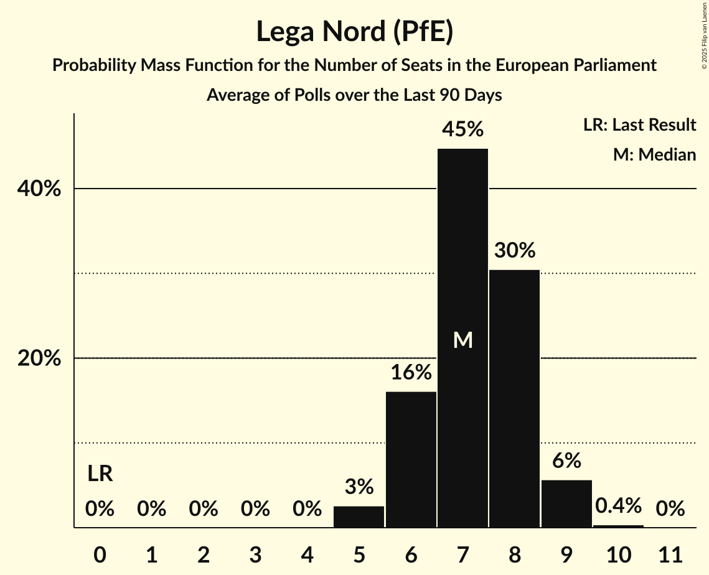

# Lega Nord (PfE)

<a href="#voting-intentions">Voting Intentions</a> | <a href="#seats">Seats</a>

## Voting Intentions

Last result: **0.0%** (General Election of 9 June 2024)

### Confidence Intervals

| Period     | Polling firm/Commissioner(s) | Median | 80% Confidence Interval | 90% Confidence Interval | 95% Confidence Interval | 99% Confidence Interval |
|:----------:|:----------------:|:-----------:|:-----------------------:|:-----------------------:|:-----------------------:|:-----------------------:|
| N/A | [Poll Average](average.html) | 8.8% | 7.6–10.0% | 7.3–10.4% | 7.0–10.8% | 6.5–11.5% |
| [25–30 September 2024](2024-09-30-SWG.html) | SWG   La7 | 8.4% | 7.5–9.5% | 7.2–9.8% | 7.0–10.1% | 6.5–10.7% |
| [24–25 September 2024](2024-09-25-Eumetra.html) | Eumetra   La7 | 8.4% | N/A | N/A | N/A | N/A |
| [18–23 September 2024](2024-09-23-SWG.html) | SWG   La7 | 8.2% | 7.2–9.3% | 7.0–9.6% | 6.7–9.9% | 6.3–10.4% |
| [19 September 2024](2024-09-19-NotoSondaggi.html) | Noto Sondaggi   Rai 1 | 8.5% | N/A | N/A | N/A | N/A |
| [17–18 September 2024](2024-09-18-Eumetra.html) | Eumetra   La7 | 8.5% | 7.3–9.9% | 7.0–10.3% | 6.7–10.6% | 6.2–11.3% |
| [11–16 September 2024](2024-09-16-SWG.html) | SWG   La7 | 8.1% | 7.1–9.2% | 6.9–9.5% | 6.7–9.8% | 6.2–10.3% |
| [12–13 September 2024](2024-09-13-Tecnè.html) | Tecnè   Agenzia Dire | 8.3% | 7.2–9.7% | 6.9–10.1% | 6.6–10.5% | 6.1–11.2% |
| [11–12 September 2024](2024-09-12-TermometroPolitico.html) | Termometro Politico | 8.7% | 8.1–9.4% | 7.9–9.6% | 7.8–9.8% | 7.5–10.1% |
| [10–12 September 2024](2024-09-12-Ipsos.html) | Ipsos   Corriere della Sera | 8.2% | 7.2–9.4% | 6.9–9.8% | 6.6–10.1% | 6.2–10.7% |
| [9–11 September 2024](2024-09-11-Piepoli.html) | Piepoli | 8.8% | N/A | N/A | N/A | N/A |
| [9–11 September 2024](2024-09-11-Ixè.html) | Ixè | 9.4% | 8.3–10.7% | 8.0–11.1% | 7.7–11.4% | 7.2–12.0% |
| [10–11 September 2024](2024-09-11-Eumetra.html) | Eumetra   La7 | 8.2% | N/A | N/A | N/A | N/A |
| [10 September 2024](2024-09-10-Euromedia.html) | Euromedia   Rai 1 | 8.9% | 7.8–10.2% | 7.5–10.5% | 7.3–10.8% | 6.8–11.5% |
| [4–9 September 2024](2024-09-09-SWG.html) | SWG   La7 | 8.3% | N/A | N/A | N/A | N/A |
| [5–7 September 2024](2024-09-07-BiDiMedia.html) | BiDiMedia | 9.0% | 7.9–10.3% | 7.6–10.6% | 7.4–10.9% | 6.9–11.6% |
| [5–6 September 2024](2024-09-06-Tecnè.html) | Tecnè   Agenzia Dire | 8.2% | 7.1–9.6% | 6.8–10.0% | 6.5–10.3% | 6.0–11.1% |
| [2 September 2024](2024-09-02-SWG.html) | SWG   La7 | 8.5% | 7.5–9.6% | 7.3–9.9% | 7.0–10.2% | 6.6–10.8% |
| [29–30 August 2024](2024-08-30-Tecnè.html) | Tecnè   Agenzia Dire | 8.3% | 7.2–9.7% | 6.9–10.1% | 6.6–10.5% | 6.1–11.2% |
| [28–29 August 2024](2024-08-29-TermometroPolitico.html) | Termometro Politico | 8.6% | 7.9–9.3% | 7.8–9.5% | 7.6–9.7% | 7.3–10.0% |
| [28–29 August 2024](2024-08-29-Quorum–YouTrend.html) | Quorum – YouTrend   Sky TG24 | 7.9% | 7.0–9.0% | 6.7–9.3% | 6.5–9.6% | 6.1–10.1% |
| [21–22 August 2024](2024-08-22-TermometroPolitico.html) | Termometro Politico | 8.5% | N/A | N/A | N/A | N/A |
| [5–16 August 2024](2024-08-16-Lab2101.html) | Lab2101   Affari Italiani | 9.3% | 8.2–10.6% | 7.9–10.9% | 7.7–11.3% | 7.2–11.9% |
| [3 August 2024](2024-08-03-Lab2101.html) | Lab2101   Affari Italiani | 9.2% | N/A | N/A | N/A | N/A |
| [24–29 July 2024](2024-07-29-SWG.html) | SWG   La7 | 8.3% | 7.4–9.4% | 7.1–9.8% | 6.9–10.0% | 6.5–10.6% |
| [25–26 July 2024](2024-07-26-Tecnè.html) | Tecnè   Agenzia Dire | 8.5% | 7.5–9.7% | 7.2–10.1% | 6.9–10.4% | 6.4–11.0% |
| [24–25 July 2024](2024-07-25-TermometroPolitico.html) | Termometro Politico | 8.3% | 7.7–9.0% | 7.5–9.2% | 7.4–9.3% | 7.1–9.7% |
| [23–25 July 2024](2024-07-25-Ipsos.html) | Ipsos   Corriere della Sera | 8.0% | 7.0–9.2% | 6.7–9.6% | 6.5–9.9% | 6.0–10.5% |
| [25 July 2024](2024-07-25-Euromedia.html) | Euromedia | 9.2% | 8.0–10.7% | 7.7–11.1% | 7.4–11.5% | 6.9–12.2% |
| [22–24 July 2024](2024-07-24-Piepoli.html) | Piepoli | 8.0% | 6.6–9.8% | 6.2–10.3% | 5.9–10.7% | 5.3–11.6% |
| [17–22 July 2024](2024-07-22-SWG.html) | SWG   La7 | 8.5% | 7.5–9.6% | 7.3–9.9% | 7.0–10.2% | 6.6–10.8% |
| [21 July 2024](2024-07-21-Lab2101.html) | Lab2101   Affari Italiani | 9.1% | 8.0–10.4% | 7.7–10.7% | 7.5–11.1% | 7.0–11.7% |
| [18–19 July 2024](2024-07-19-Tecnè.html) | Tecnè   Agenzia Dire | 8.4% | 7.4–9.6% | 7.1–10.0% | 6.8–10.3% | 6.4–10.9% |
| [16–18 July 2024](2024-07-18-TermometroPolitico.html) | Termometro Politico | 8.5% | 7.9–9.2% | 7.7–9.4% | 7.5–9.6% | 7.3–9.9% |
| [17–18 July 2024](2024-07-18-Quorum–YouTrend.html) | Quorum – YouTrend   Sky TG24 | 8.6% | 7.6–9.7% | 7.3–10.0% | 7.1–10.3% | 6.7–10.9% |
| [10–15 July 2024](2024-07-15-SWG.html) | SWG   La7 | 8.4% | 7.5–9.5% | 7.2–9.8% | 7.0–10.1% | 6.5–10.7% |
| [11–12 July 2024](2024-07-12-Tecnè.html) | Tecnè   Agenzia Dire | 8.5% | 7.4–9.7% | 7.1–10.0% | 6.9–10.3% | 6.4–11.0% |
| [9–11 July 2024](2024-07-11-TermometroPolitico.html) | Termometro Politico | 8.8% | 8.2–9.5% | 8.0–9.7% | 7.8–9.9% | 7.5–10.2% |
| [3–8 July 2024](2024-07-08-SWG.html) | SWG   La7 | 8.4% | N/A | N/A | N/A | N/A |
| [4–5 July 2024](2024-07-05-Tecnè.html) | Tecnè   Agenzia Dire | 8.7% | N/A | N/A | N/A | N/A |
| [3–4 July 2024](2024-07-04-TermometroPolitico.html) | Termometro Politico | 8.9% | N/A | N/A | N/A | N/A |
| [1 July 2024](2024-07-01-SWG.html) | SWG   La7 | 8.7% | N/A | N/A | N/A | N/A |
| [27–28 June 2024](2024-06-28-Tecnè.html) | Tecnè   Agenzia Dire | 8.8% | 7.7–10.1% | 7.4–10.4% | 7.2–10.7% | 6.7–11.4% |
| [26–27 June 2024](2024-06-27-TermometroPolitico.html) | Termometro Politico | 8.7% | 8.1–9.4% | 7.9–9.6% | 7.8–9.7% | 7.5–10.1% |
| [25–27 June 2024](2024-06-27-Quorum–YouTrend.html) | Quorum – YouTrend   Sky TG24 | 8.1% | 7.0–9.4% | 6.6–9.8% | 6.4–10.2% | 5.9–10.9% |
| [25–27 June 2024](2024-06-27-Ipsos.html) | Ipsos | 8.8% | 7.7–10.1% | 7.4–10.4% | 7.2–10.7% | 6.7–11.4% |
| [26 June 2024](2024-06-26-Euromedia.html) | Euromedia   La Stampa | 9.0% | 7.9–10.3% | 7.6–10.6% | 7.4–10.9% | 6.9–11.6% |
| [24–25 June 2024](2024-06-25-Demopolis.html) | Demopolis   La7 | 8.7% | 7.9–9.6% | 7.7–9.8% | 7.5–10.0% | 7.2–10.5% |
| [19–24 June 2024](2024-06-24-SWG.html) | SWG   La7 | 9.0% | 8.0–10.1% | 7.7–10.4% | 7.5–10.7% | 7.0–11.3% |
| [20–21 June 2024](2024-06-21-Tecnè.html) | Tecnè   Agenzia Dire | 8.9% | N/A | N/A | N/A | N/A |
| [12–17 June 2024](2024-06-17-SWG.html) | SWG   La7 | 8.8% | N/A | N/A | N/A | N/A |
| [12–13 June 2024](2024-06-13-TermometroPolitico.html) | Termometro Politico | 8.6% | 8.0–9.2% | 7.8–9.4% | 7.7–9.6% | 7.4–9.9% |

### Probability Mass Function

The following table shows the probability mass function per percentage block of voting intentions for the [poll average](average.html) for Lega Nord (PfE).

| Voting Intentions | Probability | Accumulated | Special Marks |
|:-----------------:|:-----------:|:-----------:|:-------------:|
| 0.0–0.5% | 0% | 100% | Last Result |
| 0.5–1.5% | 0% | 100% |  |
| 1.5–2.5% | 0% | 100% |  |
| 2.5–3.5% | 0% | 100% |  |
| 3.5–4.5% | 0% | 100% |  |
| 4.5–5.5% | 0% | 100% |  |
| 5.5–6.5% | 0.7% | 100% |  |
| 6.5–7.5% | 8% | 99.3% |  |
| 7.5–8.5% | 32% | 91% |  |
| 8.5–9.5% | 40% | 59% | Median |
| 9.5–10.5% | 16% | 19% |  |
| 10.5–11.5% | 3% | 4% |  |
| 11.5–12.5% | 0.4% | 0.4% |  |
| 12.5–13.5% | 0% | 0% |  |

## Seats

Last result: **0** seats (General Election of 9 June 2024)

### Confidence Intervals

| Period     | Polling firm/Commissioner(s) | Median | 80% Confidence Interval | 90% Confidence Interval | 95% Confidence Interval | 99% Confidence Interval |
|:----------:|:----------------:|:------:|:-----------------------:|:-----------------------:|:-----------------------:|:-----------------------:|
| N/A | [Poll Average](average.html) | 8 | 7–9 | 6–9 | 6–10 | 5–10 |
| [25–30 September 2024](2024-09-30-SWG.html) | SWG   La7 | 8 | 7–9 | 7–9 | 6–9 | 6–9 |
| [24–25 September 2024](2024-09-25-Eumetra.html) | Eumetra   La7 |  |  |  |  |  |
| [18–23 September 2024](2024-09-23-SWG.html) | SWG   La7 | 7 | 7–8 | 6–9 | 6–9 | 5–9 |
| [19 September 2024](2024-09-19-NotoSondaggi.html) | Noto Sondaggi   Rai 1 |  |  |  |  |  |
| [17–18 September 2024](2024-09-18-Eumetra.html) | Eumetra   La7 | 7 | 6–9 | 6–9 | 6–9 | 5–10 |
| [11–16 September 2024](2024-09-16-SWG.html) | SWG   La7 | 7 | 6–8 | 6–9 | 6–9 | 5–9 |
| [12–13 September 2024](2024-09-13-Tecnè.html) | Tecnè   Agenzia Dire | 7 | 6–9 | 6–9 | 5–9 | 5–10 |
| [11–12 September 2024](2024-09-12-TermometroPolitico.html) | Termometro Politico | 8 | 8–9 | 7–9 | 7–9 | 7–9 |
| [10–12 September 2024](2024-09-12-Ipsos.html) | Ipsos   Corriere della Sera | 7 | 7–8 | 6–8 | 6–9 | 6–9 |
| [9–11 September 2024](2024-09-11-Piepoli.html) | Piepoli |  |  |  |  |  |
| [9–11 September 2024](2024-09-11-Ixè.html) | Ixè | 8 | 7–9 | 7–10 | 7–10 | 6–11 |
| [10–11 September 2024](2024-09-11-Eumetra.html) | Eumetra   La7 |  |  |  |  |  |
| [10 September 2024](2024-09-10-Euromedia.html) | Euromedia   Rai 1 | 8 | 7–9 | 7–10 | 7–10 | 6–11 |
| [4–9 September 2024](2024-09-09-SWG.html) | SWG   La7 |  |  |  |  |  |
| [5–7 September 2024](2024-09-07-BiDiMedia.html) | BiDiMedia | 8 | 7–9 | 6–9 | 6–10 | 6–10 |
| [5–6 September 2024](2024-09-06-Tecnè.html) | Tecnè   Agenzia Dire | 8 | 6–9 | 6–9 | 6–9 | 5–9 |
| [2 September 2024](2024-09-02-SWG.html) | SWG   La7 | 8 | 7–9 | 7–9 | 6–9 | 6–10 |
| [29–30 August 2024](2024-08-30-Tecnè.html) | Tecnè   Agenzia Dire | 7 | 6–8 | 6–9 | 6–9 | 5–10 |
| [28–29 August 2024](2024-08-29-TermometroPolitico.html) | Termometro Politico | 8 | 7–8 | 7–9 | 7–9 | 7–9 |
| [28–29 August 2024](2024-08-29-Quorum–YouTrend.html) | Quorum – YouTrend   Sky TG24 | 7 | 6–8 | 6–8 | 6–9 | 5–9 |
| [21–22 August 2024](2024-08-22-TermometroPolitico.html) | Termometro Politico |  |  |  |  |  |
| [5–16 August 2024](2024-08-16-Lab2101.html) | Lab2101   Affari Italiani | 8 | 7–9 | 7–10 | 6–10 | 6–11 |
| [3 August 2024](2024-08-03-Lab2101.html) | Lab2101   Affari Italiani |  |  |  |  |  |
| [24–29 July 2024](2024-07-29-SWG.html) | SWG   La7 | 8 | 6–8 | 6–9 | 6–9 | 6–10 |
| [25–26 July 2024](2024-07-26-Tecnè.html) | Tecnè   Agenzia Dire | 7 | 6–9 | 6–9 | 6–9 | 6–10 |
| [24–25 July 2024](2024-07-25-TermometroPolitico.html) | Termometro Politico | 8 | 7–8 | 7–9 | 7–9 | 6–9 |
| [23–25 July 2024](2024-07-25-Ipsos.html) | Ipsos   Corriere della Sera | 8 | 6–8 | 6–8 | 6–9 | 5–9 |
| [25 July 2024](2024-07-25-Euromedia.html) | Euromedia | 8 | 7–10 | 6–10 | 6–10 | 6–11 |
| [22–24 July 2024](2024-07-24-Piepoli.html) | Piepoli | 8 | 6–9 | 5–9 | 5–10 | 5–11 |
| [17–22 July 2024](2024-07-22-SWG.html) | SWG   La7 | 8 | 8 | 7–8 | 7–9 | 6–9 |
| [21 July 2024](2024-07-21-Lab2101.html) | Lab2101   Affari Italiani | 8 | 7–9 | 6–10 | 6–10 | 6–10 |
| [18–19 July 2024](2024-07-19-Tecnè.html) | Tecnè   Agenzia Dire | 7 | 7–9 | 6–9 | 6–10 | 6–10 |
| [16–18 July 2024](2024-07-18-TermometroPolitico.html) | Termometro Politico | 8 | 8 | 8 | 7–9 | 7–9 |
| [17–18 July 2024](2024-07-18-Quorum–YouTrend.html) | Quorum – YouTrend   Sky TG24 | 8 | 7–9 | 7–9 | 7–9 | 6–10 |
| [10–15 July 2024](2024-07-15-SWG.html) | SWG   La7 | 7 | 6–9 | 6–9 | 6–9 | 6–10 |
| [11–12 July 2024](2024-07-12-Tecnè.html) | Tecnè   Agenzia Dire | 8 | 6–9 | 6–9 | 6–10 | 6–10 |
| [9–11 July 2024](2024-07-11-TermometroPolitico.html) | Termometro Politico | 8 | 7–9 | 7–9 | 7–9 | 7–9 |
| [3–8 July 2024](2024-07-08-SWG.html) | SWG   La7 |  |  |  |  |  |
| [4–5 July 2024](2024-07-05-Tecnè.html) | Tecnè   Agenzia Dire |  |  |  |  |  |
| [3–4 July 2024](2024-07-04-TermometroPolitico.html) | Termometro Politico |  |  |  |  |  |
| [1 July 2024](2024-07-01-SWG.html) | SWG   La7 |  |  |  |  |  |
| [27–28 June 2024](2024-06-28-Tecnè.html) | Tecnè   Agenzia Dire | 8 | 7–9 | 7–9 | 7–9 | 6–10 |
| [26–27 June 2024](2024-06-27-TermometroPolitico.html) | Termometro Politico | 8 | 7–8 | 7–9 | 7–9 | 7–9 |
| [25–27 June 2024](2024-06-27-Quorum–YouTrend.html) | Quorum – YouTrend   Sky TG24 | 7 | 6–8 | 6–9 | 5–9 | 5–10 |
| [25–27 June 2024](2024-06-27-Ipsos.html) | Ipsos | 7 | 6–9 | 6–9 | 6–9 | 6–10 |
| [26 June 2024](2024-06-26-Euromedia.html) | Euromedia   La Stampa | 8 | 7–10 | 7–10 | 6–10 | 6–11 |
| [24–25 June 2024](2024-06-25-Demopolis.html) | Demopolis   La7 | 7 | 7–8 | 7–8 | 7–8 | 6–9 |
| [19–24 June 2024](2024-06-24-SWG.html) | SWG   La7 | 8 | 7–9 | 7–9 | 7–9 | 6–11 |
| [20–21 June 2024](2024-06-21-Tecnè.html) | Tecnè   Agenzia Dire |  |  |  |  |  |
| [12–17 June 2024](2024-06-17-SWG.html) | SWG   La7 |  |  |  |  |  |
| [12–13 June 2024](2024-06-13-TermometroPolitico.html) | Termometro Politico | 7 | 7–8 | 7–8 | 7–9 | 7–9 |

### Probability Mass Function

The following table shows the probability mass function per seat for the [poll average](average.html) for Lega Nord (PfE).

| Number of Seats | Probability | Accumulated | Special Marks |
|:---------------:|:-----------:|:-----------:|:-------------:|
| 0 | 0% | 100% | Last Result |
| 1 | 0% | 100% |  |
| 2 | 0% | 100% |  |
| 3 | 0% | 100% |  |
| 4 | 0% | 100% |  |
| 5 | 0.7% | 100% |  |
| 6 | 6% | 99.3% |  |
| 7 | 26% | 94% |  |
| 8 | 48% | 68% | Median |
| 9 | 16% | 20% |  |
| 10 | 3% | 4% |  |
| 11 | 0.3% | 0.3% |  |
| 12 | 0% | 0% |  |

