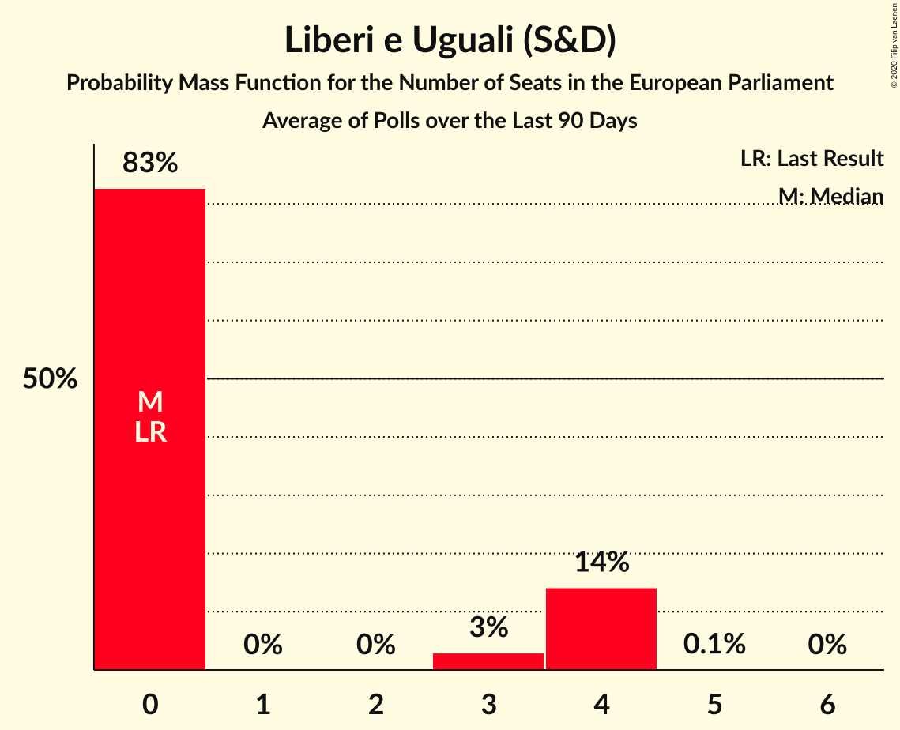

# Liberi e Uguali (S&D)

<a href="#voting-intentions">Voting Intentions</a> | <a href="#seats">Seats</a>

## Voting Intentions

Last result: **0.0%** (General Election of 25 May 2014)

### Confidence Intervals

| Period     | Polling firm/Commissioner(s) | Median | 80% Confidence Interval | 90% Confidence Interval | 95% Confidence Interval | 99% Confidence Interval |
|:----------:|:----------------:|:-----------:|:-----------------------:|:-----------------------:|:-----------------------:|:-----------------------:|
| N/A | [Poll Average](average.html) | 3.0% | 2.1–3.8% | 1.9–4.1% | 1.7–4.3% | 1.3–4.9% |
| [2–3 May 2018](2018-05-03-Ipsos.html) | Ipsos   Corriere della Sera | 2.8% | 2.2–3.6% | 2.1–3.8% | 1.9–4.0% | 1.7–4.4% |
| [2–3 May 2018](2018-05-03-EMGAcqua.html) | EMG Acqua   Rai 3 | 3.9% | 3.4–4.6% | 3.2–4.8% | 3.1–5.0% | 2.9–5.3% |
| [2 May 2018](2018-05-02-IndexResearch.html) | Index Research | 2.1% | 1.6–2.9% | 1.4–3.2% | 1.3–3.4% | 1.1–3.8% |
| [30 April 2018](2018-04-30-Tecnè.html) | Tecnè   Canale 5 | 3.3% | 2.8–4.0% | 2.7–4.1% | 2.5–4.3% | 2.3–4.6% |
| [30 April 2018](2018-04-30-Piepoli.html) | Piepoli   Rai 1 | 2.6% | 1.9–3.7% | 1.7–4.1% | 1.5–4.4% | 1.2–5.0% |
| [30 April 2018](2018-04-30-Euromedia.html) | Euromedia   Rai 1 | 3.1% | 2.5–4.1% | 2.3–4.3% | 2.1–4.6% | 1.8–5.1% |
| [24–30 April 2018](2018-04-30-Bidimedia.html) | Bidimedia | 2.4% | 1.9–3.2% | 1.7–3.5% | 1.6–3.7% | 1.4–4.1% |
| [26–27 April 2018](2018-04-27-DemosPi.html) | Demos & Pi   La Repubblica | 3.0% | 2.4–3.8% | 2.2–4.0% | 2.1–4.2% | 1.8–4.7% |
| [24–26 April 2018](2018-04-26-EMGAcqua.html) | EMG Acqua   Rai 3 | 3.2% | 2.7–3.8% | 2.6–4.0% | 2.4–4.2% | 2.2–4.5% |
| [23–25 April 2018](2018-04-25-SWG.html) | SWG | 2.8% | 2.4–3.3% | 2.3–3.5% | 2.2–3.6% | 2.0–3.9% |
| [23 April 2018](2018-04-23-Piepoli.html) | Piepoli | 2.0% | 1.4–3.1% | 1.2–3.4% | 1.1–3.6% | 0.9–4.2% |
| [20 April 2018](2018-04-20-Tecnè.html) | Tecnè   TGcom24 | 2.8% | 2.2–3.6% | 2.1–3.8% | 1.9–4.0% | 1.7–4.4% |
| [18–19 April 2018](2018-04-19-Ipsos.html) | Ipsos   Corriere della Sera | 2.7% | 2.1–3.5% | 2.0–3.7% | 1.9–3.9% | 1.6–4.3% |
| [16–18 April 2018](2018-04-18-SWG.html) | SWG | 2.4% | 2.0–2.9% | 1.9–3.0% | 1.8–3.2% | 1.6–3.4% |
| [18 April 2018](2018-04-18-IndexResearch.html) | Index Research   LA7 | 2.0% | 1.5–2.8% | 1.4–3.0% | 1.2–3.2% | 1.0–3.7% |
| [16 April 2018](2018-04-16-Piepoli.html) | Piepoli | 2.0% | 1.4–3.0% | 1.2–3.3% | 1.1–3.6% | 0.9–4.2% |
| [13 April 2018](2018-04-13-Euromedia.html) | Euromedia   Rete 4 | 3.0% | 2.4–3.8% | 2.2–4.1% | 2.1–4.3% | 1.9–4.7% |
| [9–11 April 2018](2018-04-11-SWG.html) | SWG | 2.7% | 2.3–3.2% | 2.2–3.4% | 2.1–3.5% | 1.9–3.8% |
| [9–11 April 2018](2018-04-11-Ixè.html) | Ixè   Huffington Post | 3.6% | 2.9–4.5% | 2.8–4.7% | 2.6–5.0% | 2.3–5.4% |
| [11 April 2018](2018-04-11-IndexResearch.html) | Index Research   LA7 | 2.0% | 1.5–2.8% | 1.4–3.0% | 1.2–3.2% | 1.0–3.7% |
| [9 April 2018](2018-04-09-Piepoli.html) | Piepoli | 2.0% | 1.4–3.0% | 1.2–3.3% | 1.1–3.6% | 0.9–4.2% |
| [9 April 2018](2018-04-09-Euromedia.html) | Euromedia | 3.1% | 2.5–3.9% | 2.3–4.2% | 2.2–4.4% | 1.9–4.8% |
| [5 April 2018](2018-04-05-IndexResearch.html) | Index Research   LA7 | 2.0% | 1.5–2.8% | 1.4–3.0% | 1.2–3.2% | 1.0–3.7% |
| [3–4 April 2018](2018-04-04-SWG.html) | SWG | 2.5% | 2.1–3.0% | 2.0–3.2% | 1.9–3.3% | 1.7–3.6% |
| [3 April 2018](2018-04-03-Tecnè.html) | Tecnè   Canale 5 | 2.4% | 1.9–3.2% | 1.7–3.4% | 1.6–3.6% | 1.4–3.9% |
| [2–3 April 2018](2018-04-03-Demopolis.html) | Demopolis   LA7 | 3.0% | 2.5–3.7% | 2.4–3.8% | 2.2–4.0% | 2.0–4.3% |
| [26–28 March 2018](2018-03-28-SWG.html) | SWG | 2.6% | 2.2–3.2% | 2.1–3.3% | 2.0–3.5% | 1.8–3.7% |
| [28 March 2018](2018-03-28-Piepoli.html) | Piepoli | 2.5% | 1.9–3.7% | 1.7–4.0% | 1.5–4.3% | 1.2–4.9% |
| [27–28 March 2018](2018-03-28-Ipsos.html) | Ipsos   Corriere della Sera | 3.0% | 2.4–3.8% | 2.2–4.1% | 2.1–4.3% | 1.9–4.7% |
| [28 March 2018](2018-03-28-IndexResearch.html) | Index Research   LA7 | 2.0% | 1.5–2.8% | 1.4–3.0% | 1.2–3.2% | 1.0–3.7% |
| [28 March 2018](2018-03-28-Euromedia.html) | Euromedia | 3.2% | 2.6–4.2% | 2.4–4.5% | 2.2–4.7% | 1.9–5.2% |
| [21–25 March 2018](2018-03-25-Bidimedia.html) | Bidimedia | 3.0% | 2.4–3.9% | 2.2–4.2% | 2.1–4.4% | 1.8–4.9% |
| [19–21 March 2018](2018-03-21-SWG.html) | SWG | 2.4% | 2.0–2.9% | 1.9–3.0% | 1.8–3.2% | 1.6–3.4% |
| [21 March 2018](2018-03-21-IndexResearch.html) | Index Research   LA7 | 2.1% | 1.6–2.9% | 1.4–3.2% | 1.3–3.4% | 1.1–3.8% |
| [20 March 2018](2018-03-20-Tecnè.html) | Tecnè   Canale 5 | 2.5% | 1.9–3.4% | 1.8–3.6% | 1.6–3.8% | 1.4–4.3% |
| [19 March 2018](2018-03-19-Piepoli.html) | Piepoli | 3.0% | 2.2–4.2% | 2.0–4.5% | 1.8–4.8% | 1.5–5.5% |
| [19 March 2018](2018-03-19-Euromedia.html) | Euromedia | 3.2% | 2.6–4.2% | 2.4–4.5% | 2.2–4.7% | 1.9–5.2% |
| [15 March 2018](2018-03-15-Piepoli.html) | Piepoli   La Stampa | 2.9% | 2.2–4.1% | 2.0–4.5% | 1.8–4.8% | 1.5–5.4% |
| [12–15 March 2018](2018-03-15-DemosPi.html) | Demos & Pi   La Repubblica | 4.2% | 3.5–5.0% | 3.3–5.2% | 3.2–5.4% | 2.9–5.9% |
| [12–14 March 2018](2018-03-14-SWG.html) | SWG   Il Messaggero | 2.8% | 2.2–3.6% | 2.1–3.8% | 1.9–4.0% | 1.7–4.4% |
| [12–16 February 2018](2018-02-16-TermometroPolitico.html) | Termometro Politico | 5.3% | 4.9–5.8% | 4.8–5.9% | 4.7–6.0% | 4.5–6.2% |
| [14–15 February 2018](2018-02-15-Demopolis.html) | Demopolis | 6.0% | 5.4–6.7% | 5.2–7.0% | 5.0–7.1% | 4.8–7.5% |
| [12–14 February 2018](2018-02-14-SWG.html) | SWG | 5.9% | 5.3–6.6% | 5.1–6.8% | 4.9–7.0% | 4.7–7.4% |
| [13–14 February 2018](2018-02-14-Piepoli.html) | Piepoli | 5.9% | 4.8–7.5% | 4.5–8.0% | 4.2–8.4% | 3.7–9.2% |
| [12–14 February 2018](2018-02-14-Ixè.html) | Ixè   Huffington Post | 6.0% | 5.1–7.1% | 4.9–7.4% | 4.7–7.7% | 4.3–8.2% |
| [12–14 February 2018](2018-02-14-Index.html) | Index | 5.9% | 4.9–7.1% | 4.7–7.4% | 4.5–7.7% | 4.0–8.4% |
| [14 February 2018](2018-02-14-Euromedia.html) | Euromedia | 5.9% | 4.9–7.1% | 4.7–7.4% | 4.5–7.7% | 4.0–8.4% |
| [12–14 February 2018](2018-02-14-DemosPi.html) | Demos & Pi   La Repubblica | 6.1% | 5.2–7.2% | 5.0–7.5% | 4.8–7.8% | 4.4–8.3% |
| [5–14 February 2018](2018-02-14-Demetra.html) | Demetra | 5.3% | 4.9–5.7% | 4.8–5.8% | 4.8–5.9% | 4.6–6.1% |
| [12–13 February 2018](2018-02-13-Tecnè.html) | Tecnè | 5.3% | 4.5–6.3% | 4.3–6.6% | 4.1–6.9% | 3.7–7.4% |
| [12 February 2018](2018-02-12-Euromedia.html) | Euromedia | 6.1% | 5.2–7.4% | 4.9–7.7% | 4.7–8.0% | 4.2–8.6% |
| [8–12 February 2018](2018-02-12-Bidimedia.html) | Bidimedia | 4.6% | 3.9–5.5% | 3.7–5.7% | 3.6–5.9% | 3.3–6.3% |
| [8–11 February 2018](2018-02-11-LorienConsulting.html) | Lorien Consulting | 5.0% | 4.2–6.0% | 4.0–6.3% | 3.8–6.5% | 3.5–7.1% |
| [9–11 February 2018](2018-02-11-EMG.html) | EMG   TG LA7 | 5.2% | 4.6–6.0% | 4.4–6.2% | 4.2–6.4% | 3.9–6.8% |
| [3–8 February 2018](2018-02-08-TermometroPolitico.html) | Termometro Politico | 5.3% | 4.8–5.8% | 4.7–6.0% | 4.6–6.1% | 4.4–6.4% |
| [8 February 2018](2018-02-08-Index.html) | Index | 6.0% | 5.0–7.2% | 4.8–7.6% | 4.6–7.9% | 4.1–8.5% |
| [6–7 February 2018](2018-02-07-Tecnè.html) | Tecnè | 5.7% | 4.8–6.7% | 4.6–7.0% | 4.4–7.3% | 4.0–7.8% |
| [5–7 February 2018](2018-02-07-SWG.html) | SWG | 6.5% | 5.7–7.4% | 5.5–7.6% | 5.3–7.8% | 5.0–8.3% |

### Probability Mass Function

The following table shows the probability mass function per percentage block of voting intentions for the [poll average](average.html) for Liberi e Uguali (S&D).

| Voting Intentions | Probability | Accumulated | Special Marks |
|:-----------------:|:-----------:|:-----------:|:-------------:|
| 0.0–0.5% | 0% | 100% | Last Result |
| 0.5–1.5% | 2% | 100% |  |
| 1.5–2.5% | 24% | 98% |  |
| 2.5–3.5% | 56% | 75% | Median |
| 3.5–4.5% | 17% | 19% |  |
| 4.5–5.5% | 1.3% | 1.3% |  |
| 5.5–6.5% | 0% | 0% |  |
| 6.5–7.5% | 0% | 0% |  |

## Seats

Last result: **0** seats (General Election of 25 May 2014)

### Confidence Intervals

| Period     | Polling firm/Commissioner(s) | Median | 80% Confidence Interval | 90% Confidence Interval | 95% Confidence Interval | 99% Confidence Interval |
|:----------:|:----------------:|:------:|:-----------------------:|:-----------------------:|:-----------------------:|:-----------------------:|
| N/A | [Poll Average](average.html) | 0 | 0 | 0–3 | 0–3 | 0–4 |
| [2–3 May 2018](2018-05-03-Ipsos.html) | Ipsos   Corriere della Sera | 0 | 0 | 0 | 0–3 | 0–4 |
| [2–3 May 2018](2018-05-03-EMGAcqua.html) | EMG Acqua   Rai 3 | 3 | 0–4 | 0–4 | 0–4 | 0–4 |
| [2 May 2018](2018-05-02-IndexResearch.html) | Index Research | 0 | 0 | 0 | 0 | 0 |
| [30 April 2018](2018-04-30-Tecnè.html) | Tecnè   Canale 5 | 0 | 0 | 0–3 | 0–3 | 0–4 |
| [30 April 2018](2018-04-30-Piepoli.html) | Piepoli   Rai 1 | 0 | 0 | 0 | 0–3 | 0–4 |
| [30 April 2018](2018-04-30-Euromedia.html) | Euromedia   Rai 1 | 0 | 0–3 | 0–3 | 0–4 | 0–4 |
| [24–30 April 2018](2018-04-30-Bidimedia.html) | Bidimedia | 0 | 0 | 0 | 0 | 0 |
| [26–27 April 2018](2018-04-27-DemosPi.html) | Demos & Pi   La Repubblica | 0 | 0 | 0–3 | 0–3 | 0–4 |
| [24–26 April 2018](2018-04-26-EMGAcqua.html) | EMG Acqua   Rai 3 | 0 | 0 | 0–3 | 0–3 | 0–4 |
| [23–25 April 2018](2018-04-25-SWG.html) | SWG | 0 | 0 | 0 | 0 | 0 |
| [23 April 2018](2018-04-23-Piepoli.html) | Piepoli | 0 | 0 | 0 | 0 | 0–3 |
| [20 April 2018](2018-04-20-Tecnè.html) | Tecnè   TGcom24 | 0 | 0 | 0 | 0–3 | 0–3 |
| [18–19 April 2018](2018-04-19-Ipsos.html) | Ipsos   Corriere della Sera | 0 | 0 | 0 | 0 | 0–3 |
| [16–18 April 2018](2018-04-18-SWG.html) | SWG | 0 | 0 | 0 | 0 | 0 |
| [18 April 2018](2018-04-18-IndexResearch.html) | Index Research   LA7 | 0 | 0 | 0 | 0 | 0 |
| [16 April 2018](2018-04-16-Piepoli.html) | Piepoli | 0 | 0 | 0 | 0 | 0–3 |
| [13 April 2018](2018-04-13-Euromedia.html) | Euromedia   Rete 4 | 0 | 0 | 0 | 0–3 | 0–4 |
| [9–11 April 2018](2018-04-11-SWG.html) | SWG | 0 | 0 | 0 | 0 | 0 |
| [9–11 April 2018](2018-04-11-Ixè.html) | Ixè   Huffington Post | 0 | 0–4 | 0–4 | 0–4 | 0–4 |
| [11 April 2018](2018-04-11-IndexResearch.html) | Index Research   LA7 | 0 | 0 | 0 | 0 | 0 |
| [9 April 2018](2018-04-09-Piepoli.html) | Piepoli | 0 | 0 | 0 | 0 | 0–3 |
| [9 April 2018](2018-04-09-Euromedia.html) | Euromedia | 0 | 0 | 0–3 | 0–4 | 0–4 |
| [5 April 2018](2018-04-05-IndexResearch.html) | Index Research   LA7 | 0 | 0 | 0 | 0 | 0 |
| [3–4 April 2018](2018-04-04-SWG.html) | SWG | 0 | 0 | 0 | 0 | 0 |
| [3 April 2018](2018-04-03-Tecnè.html) | Tecnè   Canale 5 | 0 | 0 | 0 | 0 | 0 |
| [2–3 April 2018](2018-04-03-Demopolis.html) | Demopolis   LA7 | 0 | 0 | 0 | 0 | 0–3 |
| [26–28 March 2018](2018-03-28-SWG.html) | SWG | 0 | 0 | 0 | 0 | 0 |
| [28 March 2018](2018-03-28-Piepoli.html) | Piepoli | 0 | 0 | 0 | 0–3 | 0–4 |
| [27–28 March 2018](2018-03-28-Ipsos.html) | Ipsos   Corriere della Sera | 0 | 0 | 0–3 | 0–3 | 0–4 |
| [28 March 2018](2018-03-28-IndexResearch.html) | Index Research   LA7 | 0 | 0 | 0 | 0 | 0 |
| [28 March 2018](2018-03-28-Euromedia.html) | Euromedia | 0 | 0–3 | 0–3 | 0–4 | 0–4 |
| [21–25 March 2018](2018-03-25-Bidimedia.html) | Bidimedia | 0 | 0–3 | 0–4 | 0–4 | 0–4 |
| [19–21 March 2018](2018-03-21-SWG.html) | SWG | 0 | 0 | 0 | 0 | 0 |
| [21 March 2018](2018-03-21-IndexResearch.html) | Index Research   LA7 | 0 | 0 | 0 | 0 | 0 |
| [20 March 2018](2018-03-20-Tecnè.html) | Tecnè   Canale 5 | 0 | 0 | 0 | 0 | 0–3 |
| [19 March 2018](2018-03-19-Piepoli.html) | Piepoli | 0 | 0–3 | 0–4 | 0–4 | 0–4 |
| [19 March 2018](2018-03-19-Euromedia.html) | Euromedia | 0 | 0–3 | 0–4 | 0–4 | 0–4 |
| [15 March 2018](2018-03-15-Piepoli.html) | Piepoli   La Stampa | 0 | 0–3 | 0–4 | 0–4 | 0–4 |
| [12–15 March 2018](2018-03-15-DemosPi.html) | Demos & Pi   La Repubblica | 3 | 0–4 | 0–4 | 0–4 | 0–5 |
| [12–14 March 2018](2018-03-14-SWG.html) | SWG   Il Messaggero | 0 | 0 | 0 | 0 | 0–4 |
| [12–16 February 2018](2018-02-16-TermometroPolitico.html) | Termometro Politico | 5 | 4–5 | 4–5 | 4–5 | 4–5 |
| [14–15 February 2018](2018-02-15-Demopolis.html) | Demopolis | 5 | 4–5 | 4–6 | 4–6 | 4–6 |
| [12–14 February 2018](2018-02-14-SWG.html) | SWG | 5 | 4–5 | 4–6 | 4–6 | 4–6 |
| [13–14 February 2018](2018-02-14-Piepoli.html) | Piepoli | 5 | 4–6 | 4–6 | 4–7 | 0–7 |
| [12–14 February 2018](2018-02-14-Ixè.html) | Ixè   Huffington Post | 5 | 4–6 | 4–6 | 4–6 | 4–7 |
| [12–14 February 2018](2018-02-14-Index.html) | Index | 5 | 4–6 | 4–6 | 4–6 | 3–7 |
| [14 February 2018](2018-02-14-Euromedia.html) | Euromedia | 5 | 4–6 | 4–6 | 4–6 | 4–7 |
| [12–14 February 2018](2018-02-14-DemosPi.html) | Demos & Pi   La Repubblica | 5 | 4–6 | 4–6 | 4–6 | 3–7 |
| [5–14 February 2018](2018-02-14-Demetra.html) | Demetra | 4 | 4–5 | 4–5 | 4–5 | 4–5 |
| [12–13 February 2018](2018-02-13-Tecnè.html) | Tecnè | 4 | 4–5 | 3–5 | 3–6 | 0–6 |
| [12 February 2018](2018-02-12-Euromedia.html) | Euromedia | 5 | 4–6 | 4–6 | 4–7 | 3–7 |
| [8–12 February 2018](2018-02-12-Bidimedia.html) | Bidimedia | 4 | 0–5 | 0–6 | 0–6 | 0–6 |
| [8–11 February 2018](2018-02-11-LorienConsulting.html) | Lorien Consulting | 4 | 4–5 | 3–5 | 0–5 | 0–6 |
| [9–11 February 2018](2018-02-11-EMG.html) | EMG   TG LA7 | 4 | 4–5 | 4–5 | 4–5 | 4–6 |
| [3–8 February 2018](2018-02-08-TermometroPolitico.html) | Termometro Politico | 4 | 4–5 | 4–5 | 4–6 | 3–6 |
| [8 February 2018](2018-02-08-Index.html) | Index | 5 | 4–6 | 4–6 | 4–6 | 3–7 |
| [6–7 February 2018](2018-02-07-Tecnè.html) | Tecnè | 5 | 4–6 | 4–6 | 4–6 | 3–6 |
| [5–7 February 2018](2018-02-07-SWG.html) | SWG | 5 | 5–6 | 5–6 | 4–7 | 4–7 |

### Probability Mass Function

The following table shows the probability mass function per seat for the [poll average](average.html) for Liberi e Uguali (S&D).

| Number of Seats | Probability | Accumulated | Special Marks |
|:---------------:|:-----------:|:-----------:|:-------------:|
| 0 | 95% | 100% | Last Result, Median |
| 1 | 0% | 5% |  |
| 2 | 0% | 5% |  |
| 3 | 3% | 5% |  |
| 4 | 2% | 2% |  |
| 5 | 0% | 0% |  |

