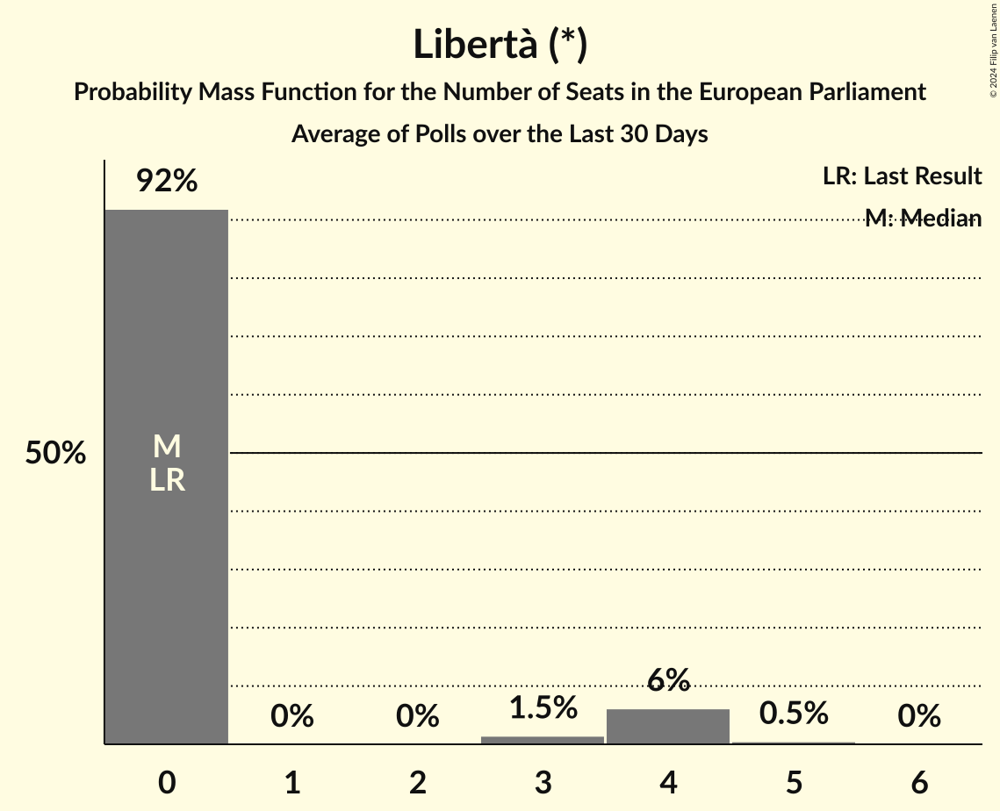

# Libertà (*)

<a href="#voting-intentions">Voting Intentions</a> | <a href="#seats">Seats</a>

## Voting Intentions

Last result: **0.0%** (General Election of 9 June 2024)

### Confidence Intervals

| Period     | Polling firm/Commissioner(s) | Median | 80% Confidence Interval | 90% Confidence Interval | 95% Confidence Interval | 99% Confidence Interval |
|:----------:|:----------------:|:-----------:|:-----------------------:|:-----------------------:|:-----------------------:|:-----------------------:|
| N/A | [Poll Average](average.html) | 0.9% | 0.6–1.3% | 0.5–1.5% | 0.4–1.6% | 0.3–1.9% |
| [11–16 September 2024](2024-09-16-SWG.html) | SWG   La7 | 1.1% | 0.8–1.6% | 0.7–1.7% | 0.6–1.8% | 0.5–2.1% |
| [12–13 September 2024](2024-09-13-Tecnè.html) | Tecnè   Agenzia Dire | 0.0% | N/A | N/A | N/A | N/A |
| [11–12 September 2024](2024-09-12-TermometroPolitico.html) | Termometro Politico | 0.9% | 0.7–1.2% | 0.7–1.2% | 0.6–1.3% | 0.5–1.4% |
| [9–11 September 2024](2024-09-11-Ixè.html) | Ixè | 0.0% | N/A | N/A | N/A | N/A |
| [10 September 2024](2024-09-10-Euromedia.html) | Euromedia   Rai 1 | 0.7% | 0.5–1.2% | 0.4–1.3% | 0.3–1.4% | 0.2–1.7% |
| [4–9 September 2024](2024-09-09-SWG.html) | SWG   La7 | 0.0% | N/A | N/A | N/A | N/A |
| [5–7 September 2024](2024-09-07-BiDiMedia.html) | BiDiMedia | 0.8% | 0.5–1.3% | 0.5–1.4% | 0.4–1.6% | 0.3–1.9% |
| [5–6 September 2024](2024-09-06-Tecnè.html) | Tecnè   Agenzia Dire | 0.0% | N/A | N/A | N/A | N/A |
| [2 September 2024](2024-09-02-SWG.html) | SWG   La7 | 0.0% | N/A | N/A | N/A | N/A |
| [29–30 August 2024](2024-08-30-Tecnè.html) | Tecnè   Agenzia Dire | 0.0% | N/A | N/A | N/A | N/A |
| [28–29 August 2024](2024-08-29-TermometroPolitico.html) | Termometro Politico | 0.9% | 0.7–1.2% | 0.7–1.2% | 0.6–1.3% | 0.5–1.5% |
| [28–29 August 2024](2024-08-29-Quorum–YouTrend.html) | Quorum – YouTrend   Sky TG24 | 0.0% | N/A | N/A | N/A | N/A |
| [21–22 August 2024](2024-08-22-TermometroPolitico.html) | Termometro Politico | 1.0% | N/A | N/A | N/A | N/A |
| [5–16 August 2024](2024-08-16-Lab2101.html) | Lab2101   Affari Italiani | 0.0% | N/A | N/A | N/A | N/A |
| [3 August 2024](2024-08-03-Lab2101.html) | Lab2101   Affari Italiani | 0.0% | N/A | N/A | N/A | N/A |
| [24–29 July 2024](2024-07-29-SWG.html) | SWG   La7 | 0.0% | N/A | N/A | N/A | N/A |
| [25–26 July 2024](2024-07-26-Tecnè.html) | Tecnè   Agenzia Dire | 0.0% | N/A | N/A | N/A | N/A |
| [24–25 July 2024](2024-07-25-TermometroPolitico.html) | Termometro Politico | 1.0% | 0.8–1.3% | 0.7–1.4% | 0.7–1.4% | 0.6–1.6% |
| [23–25 July 2024](2024-07-25-Ipsos.html) | Ipsos   Corriere della Sera | 1.0% | 0.7–1.5% | 0.6–1.7% | 0.5–1.8% | 0.4–2.1% |
| [25 July 2024](2024-07-25-Euromedia.html) | Euromedia | 1.0% | 0.7–1.6% | 0.6–1.8% | 0.5–2.0% | 0.4–2.3% |
| [22–24 July 2024](2024-07-24-Piepoli.html) | Piepoli | 0.0% | N/A | N/A | N/A | N/A |
| [17–22 July 2024](2024-07-22-SWG.html) | SWG   La7 | 0.0% | N/A | N/A | N/A | N/A |
| [21 July 2024](2024-07-21-Lab2101.html) | Lab2101   Affari Italiani | 0.0% | N/A | N/A | N/A | N/A |
| [18–19 July 2024](2024-07-19-Tecnè.html) | Tecnè   Agenzia Dire | 0.0% | N/A | N/A | N/A | N/A |
| [16–18 July 2024](2024-07-18-TermometroPolitico.html) | Termometro Politico | 1.0% | 0.8–1.3% | 0.7–1.4% | 0.7–1.4% | 0.6–1.6% |
| [17–18 July 2024](2024-07-18-Quorum–YouTrend.html) | Quorum – YouTrend   Sky TG24 | 0.0% | N/A | N/A | N/A | N/A |
| [10–15 July 2024](2024-07-15-SWG.html) | SWG   La7 | 0.0% | N/A | N/A | N/A | N/A |
| [11–12 July 2024](2024-07-12-Tecnè.html) | Tecnè   Agenzia Dire | 0.0% | N/A | N/A | N/A | N/A |
| [9–11 July 2024](2024-07-11-TermometroPolitico.html) | Termometro Politico | 1.0% | 0.8–1.3% | 0.7–1.4% | 0.7–1.4% | 0.6–1.6% |
| [3–8 July 2024](2024-07-08-SWG.html) | SWG   La7 | 0.0% | N/A | N/A | N/A | N/A |
| [4–5 July 2024](2024-07-05-Tecnè.html) | Tecnè   Agenzia Dire | 0.0% | N/A | N/A | N/A | N/A |
| [3–4 July 2024](2024-07-04-TermometroPolitico.html) | Termometro Politico | 0.9% | N/A | N/A | N/A | N/A |
| [1 July 2024](2024-07-01-SWG.html) | SWG   La7 | 1.1% | N/A | N/A | N/A | N/A |
| [27–28 June 2024](2024-06-28-Tecnè.html) | Tecnè   Agenzia Dire | 0.0% | N/A | N/A | N/A | N/A |
| [26–27 June 2024](2024-06-27-TermometroPolitico.html) | Termometro Politico | 1.1% | 0.9–1.4% | 0.8–1.4% | 0.8–1.5% | 0.7–1.7% |
| [25–27 June 2024](2024-06-27-Quorum–YouTrend.html) | Quorum – YouTrend   Sky TG24 | 0.6% | 0.4–1.2% | 0.3–1.3% | 0.3–1.4% | 0.2–1.8% |
| [25–27 June 2024](2024-06-27-Ipsos.html) | Ipsos | 1.1% | 0.8–1.7% | 0.7–1.8% | 0.6–2.0% | 0.5–2.3% |
| [26 June 2024](2024-06-26-Euromedia.html) | Euromedia   La Stampa | 1.2% | 0.9–1.8% | 0.8–1.9% | 0.7–2.1% | 0.5–2.4% |
| [24–25 June 2024](2024-06-25-Demopolis.html) | Demopolis   La7 | 0.0% | N/A | N/A | N/A | N/A |
| [19–24 June 2024](2024-06-24-SWG.html) | SWG   La7 | 0.0% | N/A | N/A | N/A | N/A |
| [20–21 June 2024](2024-06-21-Tecnè.html) | Tecnè   Agenzia Dire | 0.0% | N/A | N/A | N/A | N/A |
| [12–17 June 2024](2024-06-17-SWG.html) | SWG   La7 | 1.1% | N/A | N/A | N/A | N/A |
| [12–13 June 2024](2024-06-13-TermometroPolitico.html) | Termometro Politico | 1.0% | 0.8–1.3% | 0.8–1.3% | 0.7–1.4% | 0.6–1.5% |

### Probability Mass Function

The following table shows the probability mass function per percentage block of voting intentions for the [poll average](average.html) for Libertà (*).

| Voting Intentions | Probability | Accumulated | Special Marks |
|:-----------------:|:-----------:|:-----------:|:-------------:|
| 0.0–0.5% | 8% | 100% | Last Result |
| 0.5–1.5% | 89% | 92% | Median |
| 1.5–2.5% | 4% | 4% |  |
| 2.5–3.5% | 0% | 0% |  |

## Seats

Last result: **0** seats (General Election of 9 June 2024)

### Confidence Intervals

| Period     | Polling firm/Commissioner(s) | Median | 80% Confidence Interval | 90% Confidence Interval | 95% Confidence Interval | 99% Confidence Interval |
|:----------:|:----------------:|:------:|:-----------------------:|:-----------------------:|:-----------------------:|:-----------------------:|
| N/A | [Poll Average](average.html) | 0 | 0 | 0 | 0 | 0 |
| [11–16 September 2024](2024-09-16-SWG.html) | SWG   La7 | 0 | 0 | 0 | 0 | 0 |
| [12–13 September 2024](2024-09-13-Tecnè.html) | Tecnè   Agenzia Dire |  |  |  |  |  |
| [11–12 September 2024](2024-09-12-TermometroPolitico.html) | Termometro Politico | 0 | 0 | 0 | 0 | 0 |
| [9–11 September 2024](2024-09-11-Ixè.html) | Ixè |  |  |  |  |  |
| [10 September 2024](2024-09-10-Euromedia.html) | Euromedia   Rai 1 | 0 | 0 | 0 | 0 | 0 |
| [4–9 September 2024](2024-09-09-SWG.html) | SWG   La7 |  |  |  |  |  |
| [5–7 September 2024](2024-09-07-BiDiMedia.html) | BiDiMedia | 0 | 0 | 0 | 0 | 0 |
| [5–6 September 2024](2024-09-06-Tecnè.html) | Tecnè   Agenzia Dire |  |  |  |  |  |
| [2 September 2024](2024-09-02-SWG.html) | SWG   La7 |  |  |  |  |  |
| [29–30 August 2024](2024-08-30-Tecnè.html) | Tecnè   Agenzia Dire |  |  |  |  |  |
| [28–29 August 2024](2024-08-29-TermometroPolitico.html) | Termometro Politico | 0 | 0 | 0 | 0 | 0 |
| [28–29 August 2024](2024-08-29-Quorum–YouTrend.html) | Quorum – YouTrend   Sky TG24 |  |  |  |  |  |
| [21–22 August 2024](2024-08-22-TermometroPolitico.html) | Termometro Politico |  |  |  |  |  |
| [5–16 August 2024](2024-08-16-Lab2101.html) | Lab2101   Affari Italiani |  |  |  |  |  |
| [3 August 2024](2024-08-03-Lab2101.html) | Lab2101   Affari Italiani |  |  |  |  |  |
| [24–29 July 2024](2024-07-29-SWG.html) | SWG   La7 |  |  |  |  |  |
| [25–26 July 2024](2024-07-26-Tecnè.html) | Tecnè   Agenzia Dire |  |  |  |  |  |
| [24–25 July 2024](2024-07-25-TermometroPolitico.html) | Termometro Politico | 0 | 0 | 0 | 0 | 0 |
| [23–25 July 2024](2024-07-25-Ipsos.html) | Ipsos   Corriere della Sera | 0 | 0 | 0 | 0 | 0 |
| [25 July 2024](2024-07-25-Euromedia.html) | Euromedia | 0 | 0 | 0 | 0 | 0 |
| [22–24 July 2024](2024-07-24-Piepoli.html) | Piepoli |  |  |  |  |  |
| [17–22 July 2024](2024-07-22-SWG.html) | SWG   La7 |  |  |  |  |  |
| [21 July 2024](2024-07-21-Lab2101.html) | Lab2101   Affari Italiani |  |  |  |  |  |
| [18–19 July 2024](2024-07-19-Tecnè.html) | Tecnè   Agenzia Dire |  |  |  |  |  |
| [16–18 July 2024](2024-07-18-TermometroPolitico.html) | Termometro Politico | 0 | 0 | 0 | 0 | 0 |
| [17–18 July 2024](2024-07-18-Quorum–YouTrend.html) | Quorum – YouTrend   Sky TG24 |  |  |  |  |  |
| [10–15 July 2024](2024-07-15-SWG.html) | SWG   La7 |  |  |  |  |  |
| [11–12 July 2024](2024-07-12-Tecnè.html) | Tecnè   Agenzia Dire |  |  |  |  |  |
| [9–11 July 2024](2024-07-11-TermometroPolitico.html) | Termometro Politico | 0 | 0 | 0 | 0 | 0 |
| [3–8 July 2024](2024-07-08-SWG.html) | SWG   La7 |  |  |  |  |  |
| [4–5 July 2024](2024-07-05-Tecnè.html) | Tecnè   Agenzia Dire |  |  |  |  |  |
| [3–4 July 2024](2024-07-04-TermometroPolitico.html) | Termometro Politico |  |  |  |  |  |
| [1 July 2024](2024-07-01-SWG.html) | SWG   La7 |  |  |  |  |  |
| [27–28 June 2024](2024-06-28-Tecnè.html) | Tecnè   Agenzia Dire |  |  |  |  |  |
| [26–27 June 2024](2024-06-27-TermometroPolitico.html) | Termometro Politico | 0 | 0 | 0 | 0 | 0 |
| [25–27 June 2024](2024-06-27-Quorum–YouTrend.html) | Quorum – YouTrend   Sky TG24 | 0 | 0 | 0 | 0 | 0 |
| [25–27 June 2024](2024-06-27-Ipsos.html) | Ipsos | 0 | 0 | 0 | 0 | 0 |
| [26 June 2024](2024-06-26-Euromedia.html) | Euromedia   La Stampa | 0 | 0 | 0 | 0 | 0 |
| [24–25 June 2024](2024-06-25-Demopolis.html) | Demopolis   La7 |  |  |  |  |  |
| [19–24 June 2024](2024-06-24-SWG.html) | SWG   La7 |  |  |  |  |  |
| [20–21 June 2024](2024-06-21-Tecnè.html) | Tecnè   Agenzia Dire |  |  |  |  |  |
| [12–17 June 2024](2024-06-17-SWG.html) | SWG   La7 |  |  |  |  |  |
| [12–13 June 2024](2024-06-13-TermometroPolitico.html) | Termometro Politico | 0 | 0 | 0 | 0 | 0 |

### Probability Mass Function

The following table shows the probability mass function per seat for the [poll average](average.html) for Libertà (*).

| Number of Seats | Probability | Accumulated | Special Marks |
|:---------------:|:-----------:|:-----------:|:-------------:|
| 0 | 100% | 100% | Last Result, Median |

