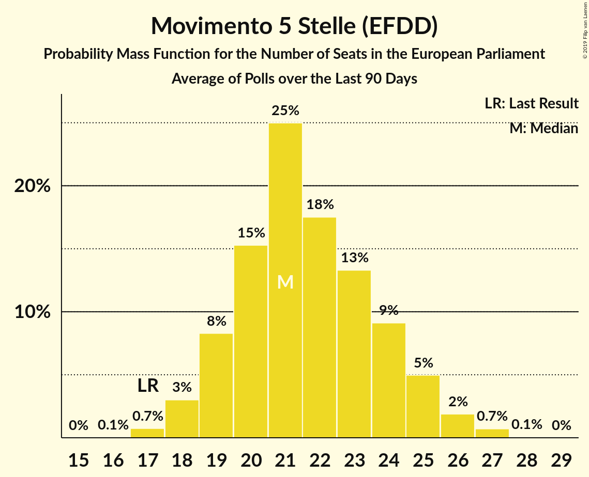

# Movimento 5 Stelle (EFDD)

<a href="#voting-intentions">Voting Intentions</a> | <a href="#seats">Seats</a>

## Voting Intentions

Last result: **21.2%** (General Election of 25 May 2014)

### Confidence Intervals

| Period     | Polling firm/Commissioner(s) | Median | 80% Confidence Interval | 90% Confidence Interval | 95% Confidence Interval | 99% Confidence Interval |
|:----------:|:----------------:|:-----------:|:-----------------------:|:-----------------------:|:-----------------------:|:-----------------------:|
| N/A | [Poll Average](average.html) | 28.8% | 26.5–31.2% | 25.8–32.0% | 25.2–32.7% | 23.9–34.1% |
| [26 September 2018](2018-09-26-IndexResearch.html) | Index Research   LA7 | 28.8% | 26.8–30.9% | 26.2–31.5% | 25.7–32.0% | 24.8–33.0% |
| [19–24 September 2018](2018-09-24-SWG.html) | SWG   LA7 | 28.6% | 27.1–30.1% | 26.7–30.6% | 26.4–30.9% | 25.7–31.7% |
| [22–23 September 2018](2018-09-23-Tecnè.html) | Tecnè   Quarta Repubblica | 29.2% | 27.4–31.1% | 26.9–31.6% | 26.5–32.1% | 25.6–33.0% |
| [21–23 September 2018](2018-09-23-GPFInspiringResearch.html) | GPF Inspiring Research   Affaritaliani.it | 31.5% | 29.4–33.6% | 28.8–34.2% | 28.3–34.8% | 27.4–35.8% |
| [21–23 September 2018](2018-09-23-EMGAcqua.html) | EMG Acqua   Rai 3 | 28.8% | 27.3–30.3% | 26.9–30.8% | 26.5–31.2% | 25.8–31.9% |
| [21–22 September 2018](2018-09-22-ScenariPolitici–Winpoll.html) | Scenari Politici–Winpoll | 26.9% | 25.5–28.4% | 25.1–28.9% | 24.7–29.2% | 24.1–30.0% |
| [19–21 September 2018](2018-09-21-Ixè.html) | Ixè   Huffington Post | 27.6% | 25.8–29.5% | 25.3–30.0% | 24.9–30.5% | 24.1–31.4% |
| [18–19 September 2018](2018-09-19-IndexResearch.html) | Index Research   LA7 | 28.9% | 26.9–31.0% | 26.3–31.6% | 25.8–32.1% | 24.9–33.2% |
| [12–17 September 2018](2018-09-17-SWG.html) | SWG   LA7 | 28.7% | 27.3–30.3% | 26.9–30.7% | 26.5–31.1% | 25.8–31.8% |
| [17 September 2018](2018-09-17-Piepoli.html) | Piepoli   Rai 1 | 30.0% | 27.5–32.7% | 26.8–33.5% | 26.2–34.1% | 25.0–35.4% |
| [17 September 2018](2018-09-17-Euromedia.html) | Euromedia   Rai 1 | 28.2% | 26.3–30.4% | 25.7–31.0% | 25.2–31.5% | 24.3–32.5% |
| [14–15 September 2018](2018-09-15-Tecnè.html) | Tecnè   Quarta Repubblica | 29.1% | 27.3–31.0% | 26.8–31.5% | 26.4–32.0% | 25.5–32.9% |
| [11–13 September 2018](2018-09-13-DemosPi.html) | Demos & Pi | 29.4% | 27.6–31.3% | 27.1–31.9% | 26.7–32.3% | 25.8–33.3% |
| [11–12 September 2018](2018-09-12-Demopolis.html) | Demopolis | 30.2% | 28.7–31.8% | 28.3–32.2% | 27.9–32.6% | 27.2–33.3% |
| [5–10 September 2018](2018-09-10-SWG.html) | SWG   LA7 | 27.9% | 26.4–29.4% | 26.0–29.8% | 25.7–30.2% | 25.0–30.9% |
| [10 September 2018](2018-09-10-Piepoli.html) | Piepoli   Rai 1 | 30.0% | 27.5–32.7% | 26.8–33.5% | 26.2–34.1% | 25.0–35.4% |
| [10 September 2018](2018-09-10-Euromedia.html) | Euromedia   Rai 1 | 28.2% | 26.3–30.4% | 25.7–31.0% | 25.2–31.5% | 24.3–32.5% |
| [7–9 September 2018](2018-09-09-EMGAcqua.html) | EMG Acqua | 28.9% | 27.4–30.4% | 27.0–30.8% | 26.7–31.2% | 26.0–32.0% |
| [6–7 September 2018](2018-09-07-ScenariPolitici–Winpoll.html) | Scenari Politici–Winpoll | 26.4% | 25.0–27.9% | 24.6–28.3% | 24.2–28.7% | 23.5–29.4% |
| [5–6 September 2018](2018-09-06-Tecnè.html) | Tecnè   TGcom24 | 29.5% | 27.7–31.4% | 27.2–31.9% | 26.7–32.4% | 25.9–33.3% |
| [6 September 2018](2018-09-06-NotoSondaggi.html) | Noto Sondaggi   Rai 3 | 27.0% | 25.3–28.9% | 24.8–29.4% | 24.3–29.8% | 23.5–30.7% |
| [4–6 September 2018](2018-09-06-Ipsos.html) | Ipsos   Corriere della Sera | 30.0% | 28.2–31.9% | 27.7–32.4% | 27.2–32.9% | 26.4–33.9% |
| [3–4 September 2018](2018-09-04-Tecnè.html) | Tecnè | 29.8% | 27.7–31.9% | 27.2–32.5% | 26.7–33.0% | 25.7–34.0% |
| [29 August–3 September 2018](2018-09-03-SWG.html) | SWG   LA7 | 28.3% | 26.9–29.9% | 26.5–30.3% | 26.1–30.7% | 25.4–31.4% |
| [30 August–2 September 2018](2018-09-02-BiDiMedia.html) | BiDiMedia | 28.7% | 26.9–30.8% | 26.3–31.3% | 25.9–31.8% | 25.0–32.8% |
| [24–27 August 2018](2018-08-27-LorienConsulting.html) | Lorien Consulting | 26.8% | 24.4–29.4% | 23.7–30.2% | 23.1–30.9% | 22.0–32.2% |
| [25–30 July 2018](2018-07-30-SWG.html) | SWG   LA7 | 29.7% | 28.2–31.3% | 27.8–31.7% | 27.5–32.1% | 26.8–32.9% |
| [24–25 July 2018](2018-07-25-Demopolis.html) | Demopolis | 31.0% | 29.3–32.8% | 28.9–33.3% | 28.4–33.7% | 27.6–34.5% |
| [18–23 July 2018](2018-07-23-SWG.html) | SWG   LA7 | 29.3% | 27.8–30.8% | 27.4–31.2% | 27.0–31.6% | 26.3–32.4% |
| [17–18 July 2018](2018-07-18-Ipsos.html) | Ipsos   Corriere della Sera | 31.5% | 29.7–33.4% | 29.1–34.0% | 28.7–34.5% | 27.8–35.4% |
| [11–16 July 2018](2018-07-16-SWG.html) | SWG   LA7 | 29.7% | 28.2–31.2% | 27.8–31.7% | 27.4–32.0% | 26.7–32.8% |
| [5–13 July 2018](2018-07-13-TermometroPolitico.html) | Termometro Politico | 29.0% | 28.0–30.0% | 27.7–30.3% | 27.5–30.6% | 27.0–31.0% |
| [7–13 July 2018](2018-07-13-BiDiMedia.html) | BiDiMedia | 29.0% | 27.0–31.2% | 26.4–31.8% | 25.9–32.3% | 25.0–33.4% |
| [4–9 July 2018](2018-07-09-SWG.html) | SWG | 29.0% | 27.5–30.5% | 27.1–31.0% | 26.7–31.4% | 26.1–32.1% |
| [9 July 2018](2018-07-09-Piepoli.html) | Piepoli   Sky TG 24 | 29.1% | 26.6–31.7% | 25.9–32.5% | 25.3–33.2% | 24.1–34.5% |
| [6–8 July 2018](2018-07-08-EMGAcqua.html) | EMG Acqua   Rai 3 | 30.0% | 28.5–31.6% | 28.1–32.0% | 27.8–32.4% | 27.1–33.1% |
| [27 June–2 July 2018](2018-07-02-SWG.html) | SWG   LA7 | 28.7% | 27.3–30.3% | 26.9–30.7% | 26.5–31.1% | 25.8–31.8% |
| [7 June–2 July 2018](2018-07-02-QuorumandYouTrend.html) | Quorum and YouTrend   Sky TG 24 | 28.1% | 26.9–29.4% | 26.6–29.7% | 26.2–30.0% | 25.7–30.7% |
| [26–27 June 2018](2018-06-27-Ipsos.html) | Ipsos   Corriere della Sera | 29.8% | 28.0–31.7% | 27.5–32.2% | 27.0–32.7% | 26.2–33.6% |
| [20–25 June 2018](2018-06-25-SWG.html) | SWG   LA7 | 29.4% | 27.9–30.9% | 27.5–31.4% | 27.1–31.8% | 26.4–32.5% |
| [25 June 2018](2018-06-25-Piepoli.html) | Piepoli   Sky TG 24 | 28.9% | 26.5–31.6% | 25.8–32.4% | 25.2–33.0% | 24.0–34.3% |
| [23–24 June 2018](2018-06-24-EMGAcqua.html) | EMG Acqua   Rai 3 | 30.8% | 29.4–32.2% | 29.0–32.6% | 28.7–33.0% | 28.0–33.7% |
| [19–24 June 2018](2018-06-24-BiDiMedia.html) | BiDiMedia | 28.6% | 26.7–30.6% | 26.2–31.1% | 25.7–31.6% | 24.8–32.6% |
| [20 June 2018](2018-06-20-Tecnè.html) | Tecnè   TGcom24 | 27.5% | 25.7–29.4% | 25.2–29.9% | 24.8–30.4% | 24.0–31.3% |
| [19–20 June 2018](2018-06-20-Euromedia.html) | Euromedia   Rai 1 | 28.0% | 26.0–30.1% | 25.5–30.7% | 25.0–31.2% | 24.1–32.3% |
| [19–20 June 2018](2018-06-20-Demopolis.html) | Demopolis   LA7 | 29.0% | 27.5–30.5% | 27.1–31.0% | 26.7–31.4% | 26.1–32.1% |
| [18–19 June 2018](2018-06-19-Piepoli.html) | Piepoli   Rai 1 | 29.0% | 26.5–31.7% | 25.8–32.4% | 25.2–33.1% | 24.0–34.4% |
| [13–18 June 2018](2018-06-18-SWG.html) | SWG   LA7 | 29.0% | 27.5–30.5% | 27.1–31.0% | 26.7–31.4% | 26.1–32.1% |
| [14–16 June 2018](2018-06-16-Ixè.html) | Ixè   Huffington Post | 28.5% | 26.7–30.4% | 26.2–30.9% | 25.8–31.4% | 25.0–32.3% |
| [11–15 June 2018](2018-06-15-TermometroPolitico.html) | Termometro Politico | 29.5% | 28.3–30.8% | 28.0–31.1% | 27.7–31.4% | 27.1–32.0% |
| [12–13 June 2018](2018-06-13-Ipsos.html) | Ipsos   Corriere della Sera | 29.9% | 28.1–31.8% | 27.6–32.3% | 27.1–32.8% | 26.3–33.7% |
| [12–13 June 2018](2018-06-13-Euromedia.html) | Euromedia   Rai 1 | 29.0% | 27.0–31.1% | 26.4–31.7% | 26.0–32.3% | 25.0–33.3% |
| [12 June 2018](2018-06-12-Tecnè.html) | Tecnè   Canale 5 | 28.4% | 26.6–30.3% | 26.1–30.8% | 25.7–31.2% | 24.8–32.2% |
| [11–12 June 2018](2018-06-12-Piepoli.html) | Piepoli   Rai 1 | 30.0% | 27.5–32.8% | 26.8–33.5% | 26.2–34.2% | 25.0–35.5% |
| [6–11 June 2018](2018-06-11-SWG.html) | SWG   LA7 | 31.5% | 30.0–33.1% | 29.6–33.5% | 29.2–33.9% | 28.5–34.7% |
| [6 June 2018](2018-06-06-IndexResearch.html) | Index Research   LA7 | 29.2% | 27.3–31.4% | 26.7–32.0% | 26.2–32.5% | 25.3–33.5% |
| [30 May–4 June 2018](2018-06-04-SWG.html) | SWG   LA7 | 30.9% | 29.4–32.5% | 29.0–32.9% | 28.6–33.3% | 27.9–34.1% |
| [4 June 2018](2018-06-04-Piepoli.html) | Piepoli   Sky TG 24 | 31.4% | 29.1–33.9% | 28.4–34.6% | 27.9–35.2% | 26.8–36.4% |
| [1–3 June 2018](2018-06-03-EMGAcqua.html) | EMG Acqua   Rai 3 | 32.0% | 30.6–33.5% | 30.2–33.9% | 29.9–34.2% | 29.2–34.9% |
| [30–31 May 2018](2018-05-31-Ipsos.html) | Ipsos   Corriere della Sera | 30.1% | 28.3–32.1% | 27.8–32.6% | 27.4–33.1% | 26.5–34.0% |
| [30–31 May 2018](2018-05-31-IndexResearch.html) | Index Research   LA7 | 29.0% | 27.0–31.1% | 26.4–31.7% | 26.0–32.3% | 25.0–33.3% |
| [29–30 May 2018](2018-05-30-Demopolis.html) | Demopolis | 30.0% | 28.5–31.6% | 28.1–32.0% | 27.7–32.4% | 27.0–33.1% |
| [29 May 2018](2018-05-29-TermometroPolitico.html) | Termometro Politico | 32.2% | 31.4–33.0% | 31.2–33.2% | 31.0–33.4% | 30.7–33.8% |
| [29 May 2018](2018-05-29-Tecnè.html) | Tecnè   TGcom24 | 31.0% | 29.0–33.2% | 28.4–33.8% | 27.9–34.3% | 27.0–35.3% |
| [29 May 2018](2018-05-29-Piepoli.html) | Piepoli   Rai 1 | 31.5% | 28.9–34.2% | 28.2–35.0% | 27.6–35.7% | 26.4–37.0% |
| [29 May 2018](2018-05-29-Euromedia.html) | Euromedia   Rai 1 | 33.8% | 31.7–35.9% | 31.1–36.6% | 30.5–37.1% | 29.6–38.2% |
| [23–28 May 2018](2018-05-28-SWG.html) | SWG   LA7 | 29.5% | 28.2–30.8% | 27.9–31.2% | 27.6–31.5% | 27.0–32.1% |
| [23–28 May 2018](2018-05-28-BiDiMedia.html) | BiDiMedia | 32.4% | 30.5–34.3% | 30.0–34.9% | 29.5–35.4% | 28.6–36.3% |
| [22–24 May 2018](2018-05-24-EMGAcqua.html) | EMG Acqua   Rai 3 | 32.6% | 31.1–34.2% | 30.7–34.6% | 30.3–35.0% | 29.6–35.7% |
| [23 May 2018](2018-05-23-IndexResearch.html) | Index Research   LA7 | 30.0% | 28.0–32.1% | 27.4–32.8% | 26.9–33.3% | 26.0–34.3% |
| [22–23 May 2018](2018-05-23-Demopolis.html) | Demopolis | 32.5% | 31.0–34.1% | 30.6–34.6% | 30.2–34.9% | 29.5–35.7% |
| [16–20 May 2018](2018-05-20-SWG.html) | SWG   LA7 | 31.1% | 29.6–32.7% | 29.2–33.2% | 28.8–33.5% | 28.1–34.3% |
| [16–18 May 2018](2018-05-18-Tecnè.html) | Tecnè   TGcom24 | 31.6% | 30.3–33.0% | 29.9–33.3% | 29.6–33.7% | 29.0–34.3% |
| [17–18 May 2018](2018-05-18-DemosPi.html) | Demos & Pi | 31.1% | 29.3–33.0% | 28.8–33.6% | 28.3–34.0% | 27.5–35.0% |
| [16–17 May 2018](2018-05-17-Ipsos.html) | Ipsos   Corriere della Sera | 32.6% | 30.7–34.6% | 30.2–35.1% | 29.8–35.6% | 28.9–36.5% |
| [15–17 May 2018](2018-05-17-EMGAcqua.html) | EMG Acqua   Rai 3 | 31.9% | 30.5–33.4% | 30.1–33.8% | 29.8–34.2% | 29.1–34.9% |
| [16 May 2018](2018-05-16-IndexResearch.html) | Index Research   LA7 | 30.1% | 28.1–32.3% | 27.5–32.9% | 27.0–33.4% | 26.1–34.4% |
| [16 May 2018](2018-05-16-Euromedia.html) | Euromedia   Rai 1 | 31.2% | 29.2–33.4% | 28.6–34.0% | 28.1–34.6% | 27.2–35.6% |
| [9–13 May 2018](2018-05-13-SWG.html) | SWG   LA7 | 32.1% | 30.6–33.7% | 30.2–34.2% | 29.8–34.6% | 29.1–35.3% |
| [10–11 May 2018](2018-05-11-Ixè.html) | Ixè   Huffington Post | 31.5% | 29.7–33.4% | 29.1–34.0% | 28.7–34.5% | 27.8–35.4% |
| [9–10 May 2018](2018-05-10-Euromedia.html) | Euromedia | 32.1% | 30.1–34.3% | 29.5–34.9% | 29.0–35.5% | 28.0–36.5% |
| [8–10 May 2018](2018-05-10-EMGAcqua.html) | EMG Acqua   Rai 3 | 30.8% | 29.3–32.3% | 28.9–32.7% | 28.6–33.1% | 27.9–33.8% |
| [9–10 May 2018](2018-05-10-Demopolis.html) | Demopolis   LA7 | 34.0% | 32.4–35.6% | 32.0–36.0% | 31.6–36.4% | 30.9–37.2% |
| [8 May 2018](2018-05-08-Tecnè.html) | Tecnè   Canale 5 | 32.0% | 30.1–33.9% | 29.6–34.4% | 29.1–34.9% | 28.3–35.9% |
| [7 May 2018](2018-05-07-Piepoli.html) | Piepoli   Sky TG 24 | 31.9% | 29.4–34.7% | 28.6–35.5% | 28.0–36.2% | 26.8–37.5% |
| [5–6 May 2018](2018-05-06-Tecnè.html) | Tecnè   TGcom24 | 32.1% | 30.6–33.7% | 30.2–34.2% | 29.8–34.6% | 29.1–35.3% |
| [3–6 May 2018](2018-05-06-SWG.html) | SWG | 32.3% | 30.7–33.9% | 30.3–34.3% | 29.9–34.7% | 29.2–35.5% |
| [2–3 May 2018](2018-05-03-Ipsos.html) | Ipsos   Corriere della Sera | 33.7% | 31.8–35.7% | 31.3–36.2% | 30.8–36.7% | 29.9–37.6% |
| [2–3 May 2018](2018-05-03-EMGAcqua.html) | EMG Acqua   Rai 3 | 31.5% | 30.1–33.0% | 29.7–33.4% | 29.3–33.8% | 28.6–34.5% |
| [2 May 2018](2018-05-02-IndexResearch.html) | Index Research | 35.0% | 32.9–37.2% | 32.3–37.8% | 31.8–38.4% | 30.8–39.4% |
| [30 April 2018](2018-04-30-Tecnè.html) | Tecnè   Canale 5 | 31.8% | 30.3–33.3% | 29.9–33.8% | 29.6–34.1% | 28.9–34.9% |
| [30 April 2018](2018-04-30-Piepoli.html) | Piepoli   Rai 1 | 33.1% | 30.5–35.8% | 29.7–36.6% | 29.1–37.3% | 27.9–38.6% |
| [30 April 2018](2018-04-30-Euromedia.html) | Euromedia   Rai 1 | 32.8% | 30.7–34.9% | 30.1–35.5% | 29.6–36.1% | 28.6–37.1% |
| [24–30 April 2018](2018-04-30-Bidimedia.html) | Bidimedia | 34.4% | 32.4–36.5% | 31.9–37.1% | 31.4–37.6% | 30.5–38.6% |
| [26–27 April 2018](2018-04-27-DemosPi.html) | Demos & Pi   La Repubblica | 32.9% | 31.1–34.9% | 30.5–35.4% | 30.1–35.9% | 29.2–36.9% |
| [24–26 April 2018](2018-04-26-EMGAcqua.html) | EMG Acqua   Rai 3 | 34.5% | 33.0–36.0% | 32.6–36.5% | 32.2–36.8% | 31.5–37.6% |
| [23–25 April 2018](2018-04-25-SWG.html) | SWG | 34.3% | 33.0–35.7% | 32.6–36.1% | 32.3–36.4% | 31.6–37.1% |
| [23 April 2018](2018-04-23-Piepoli.html) | Piepoli | 34.0% | 31.4–36.8% | 30.6–37.6% | 30.0–38.3% | 28.7–39.6% |
| [20 April 2018](2018-04-20-Tecnè.html) | Tecnè   TGcom24 | 33.5% | 31.6–35.5% | 31.1–36.0% | 30.6–36.5% | 29.8–37.4% |
| [18–19 April 2018](2018-04-19-Ipsos.html) | Ipsos   Corriere della Sera | 33.5% | 31.6–35.4% | 31.1–36.0% | 30.6–36.5% | 29.7–37.4% |
| [16–18 April 2018](2018-04-18-SWG.html) | SWG | 33.0% | 31.7–34.4% | 31.3–34.8% | 31.0–35.1% | 30.3–35.8% |
| [18 April 2018](2018-04-18-IndexResearch.html) | Index Research   LA7 | 34.0% | 31.9–36.2% | 31.3–36.8% | 30.8–37.4% | 29.8–38.4% |
| [16 April 2018](2018-04-16-Piepoli.html) | Piepoli | 34.5% | 31.8–37.2% | 31.1–38.0% | 30.4–38.7% | 29.2–40.1% |
| [13 April 2018](2018-04-13-Euromedia.html) | Euromedia   Rete 4 | 34.1% | 32.2–36.1% | 31.7–36.6% | 31.2–37.1% | 30.3–38.1% |
| [9–11 April 2018](2018-04-11-SWG.html) | SWG | 32.6% | 31.3–34.0% | 30.9–34.4% | 30.6–34.7% | 29.9–35.4% |
| [9–11 April 2018](2018-04-11-Ixè.html) | Ixè   Huffington Post | 34.0% | 32.1–36.0% | 31.6–36.5% | 31.1–37.0% | 30.2–38.0% |
| [11 April 2018](2018-04-11-IndexResearch.html) | Index Research   LA7 | 34.1% | 32.0–36.3% | 31.4–36.9% | 30.9–37.5% | 29.9–38.5% |
| [9 April 2018](2018-04-09-Piepoli.html) | Piepoli | 35.0% | 32.4–37.8% | 31.7–38.6% | 31.0–39.3% | 29.8–40.6% |
| [9 April 2018](2018-04-09-Euromedia.html) | Euromedia | 34.2% | 32.3–36.2% | 31.8–36.7% | 31.3–37.2% | 30.4–38.1% |
| [5 April 2018](2018-04-05-IndexResearch.html) | Index Research   LA7 | 34.2% | 32.1–36.5% | 31.6–37.1% | 31.0–37.6% | 30.0–38.7% |
| [3–4 April 2018](2018-04-04-SWG.html) | SWG | 34.5% | 33.2–35.9% | 32.8–36.3% | 32.4–36.6% | 31.8–37.3% |
| [3 April 2018](2018-04-03-Tecnè.html) | Tecnè   Canale 5 | 34.0% | 32.1–35.9% | 31.6–36.5% | 31.1–37.0% | 30.2–37.9% |
| [2–3 April 2018](2018-04-03-Demopolis.html) | Demopolis   LA7 | 35.0% | 33.4–36.6% | 33.0–37.1% | 32.6–37.5% | 31.9–38.2% |
| [26–28 March 2018](2018-03-28-SWG.html) | SWG | 34.5% | 33.2–35.9% | 32.8–36.3% | 32.4–36.6% | 31.8–37.3% |
| [28 March 2018](2018-03-28-Piepoli.html) | Piepoli | 33.9% | 31.3–36.7% | 30.6–37.5% | 29.9–38.1% | 28.7–39.5% |
| [27–28 March 2018](2018-03-28-Ipsos.html) | Ipsos   Corriere della Sera | 33.9% | 32.0–35.9% | 31.5–36.4% | 31.0–36.9% | 30.1–37.8% |
| [28 March 2018](2018-03-28-IndexResearch.html) | Index Research   LA7 | 34.6% | 32.5–36.8% | 31.9–37.4% | 31.4–38.0% | 30.4–39.1% |
| [28 March 2018](2018-03-28-Euromedia.html) | Euromedia | 34.6% | 32.5–36.8% | 31.9–37.4% | 31.4–38.0% | 30.4–39.1% |
| [21–25 March 2018](2018-03-25-Bidimedia.html) | Bidimedia | 33.5% | 31.5–35.6% | 30.9–36.2% | 30.4–36.7% | 29.5–37.7% |
| [19–21 March 2018](2018-03-21-SWG.html) | SWG | 35.2% | 33.8–36.6% | 33.5–37.0% | 33.1–37.3% | 32.5–38.0% |
| [21 March 2018](2018-03-21-IndexResearch.html) | Index Research   LA7 | 34.9% | 32.8–37.1% | 32.2–37.7% | 31.6–38.3% | 30.7–39.3% |
| [20 March 2018](2018-03-20-Tecnè.html) | Tecnè   Canale 5 | 34.2% | 32.1–36.4% | 31.5–37.0% | 31.0–37.5% | 30.0–38.6% |
| [19 March 2018](2018-03-19-Piepoli.html) | Piepoli | 33.5% | 30.9–36.2% | 30.1–37.0% | 29.5–37.7% | 28.3–39.0% |
| [19 March 2018](2018-03-19-Euromedia.html) | Euromedia | 33.4% | 31.3–35.6% | 30.7–36.2% | 30.2–36.7% | 29.2–37.8% |
| [15 March 2018](2018-03-15-Piepoli.html) | Piepoli   La Stampa | 34.0% | 31.4–36.7% | 30.6–37.5% | 30.0–38.2% | 28.8–39.5% |
| [12–15 March 2018](2018-03-15-DemosPi.html) | Demos & Pi   La Repubblica | 33.8% | 32.1–35.5% | 31.6–36.0% | 31.2–36.5% | 30.4–37.3% |
| [12–14 March 2018](2018-03-14-SWG.html) | SWG   Il Messaggero | 34.5% | 32.6–36.5% | 32.1–37.0% | 31.6–37.5% | 30.7–38.5% |
| [12–16 February 2018](2018-02-16-TermometroPolitico.html) | Termometro Politico | 26.3% | 25.5–27.2% | 25.2–27.4% | 25.0–27.6% | 24.6–28.0% |
| [14–15 February 2018](2018-02-15-Demopolis.html) | Demopolis | 28.0% | 26.7–29.3% | 26.4–29.7% | 26.1–30.0% | 25.5–30.7% |
| [12–14 February 2018](2018-02-14-SWG.html) | SWG | 28.3% | 27.0–29.6% | 26.7–30.0% | 26.4–30.3% | 25.8–31.0% |
| [13–14 February 2018](2018-02-14-Piepoli.html) | Piepoli | 26.9% | 24.5–29.6% | 23.8–30.3% | 23.2–31.0% | 22.1–32.3% |
| [12–14 February 2018](2018-02-14-Ixè.html) | Ixè   Huffington Post | 28.1% | 26.3–30.0% | 25.8–30.5% | 25.4–31.0% | 24.6–31.9% |
| [12–14 February 2018](2018-02-14-Index.html) | Index | 27.6% | 25.7–29.7% | 25.1–30.3% | 24.6–30.8% | 23.7–31.9% |
| [14 February 2018](2018-02-14-Euromedia.html) | Euromedia | 26.9% | 24.9–29.0% | 24.4–29.6% | 23.9–30.1% | 23.0–31.1% |
| [12–14 February 2018](2018-02-14-DemosPi.html) | Demos & Pi   La Repubblica | 27.8% | 26.0–29.7% | 25.6–30.2% | 25.1–30.7% | 24.3–31.6% |
| [5–14 February 2018](2018-02-14-Demetra.html) | Demetra | 29.4% | 28.7–30.2% | 28.4–30.4% | 28.3–30.6% | 27.9–30.9% |
| [12–13 February 2018](2018-02-13-Tecnè.html) | Tecnè | 28.3% | 26.5–30.1% | 26.0–30.7% | 25.6–31.2% | 24.7–32.1% |
| [12 February 2018](2018-02-12-Euromedia.html) | Euromedia | 27.0% | 25.1–29.1% | 24.5–29.7% | 24.0–30.2% | 23.1–31.2% |
| [8–12 February 2018](2018-02-12-Bidimedia.html) | Bidimedia | 25.3% | 23.8–26.9% | 23.4–27.4% | 23.0–27.8% | 22.3–28.5% |
| [8–11 February 2018](2018-02-11-LorienConsulting.html) | Lorien Consulting | 27.6% | 25.8–29.5% | 25.3–30.0% | 24.9–30.5% | 24.1–31.4% |
| [9–11 February 2018](2018-02-11-EMG.html) | EMG   TG LA7 | 27.3% | 25.9–28.8% | 25.5–29.2% | 25.2–29.6% | 24.5–30.3% |
| [3–8 February 2018](2018-02-08-TermometroPolitico.html) | Termometro Politico | 26.8% | 25.8–27.8% | 25.6–28.1% | 25.3–28.3% | 24.9–28.8% |
| [8 February 2018](2018-02-08-Index.html) | Index | 27.2% | 25.3–29.3% | 24.8–29.9% | 24.3–30.5% | 23.4–31.5% |
| [6–7 February 2018](2018-02-07-Tecnè.html) | Tecnè | 28.0% | 26.2–29.9% | 25.7–30.4% | 25.3–30.9% | 24.5–31.8% |
| [5–7 February 2018](2018-02-07-SWG.html) | SWG | 28.0% | 26.5–29.5% | 26.1–30.0% | 25.8–30.3% | 25.1–31.1% |

### Probability Mass Function

The following table shows the probability mass function per percentage block of voting intentions for the [poll average](average.html) for Movimento 5 Stelle (EFDD).

| Voting Intentions | Probability | Accumulated | Special Marks |
|:-----------------:|:-----------:|:-----------:|:-------------:|
| 20.5–21.5% | 0% | 100% | Last Result |
| 21.5–22.5% | 0.1% | 100% |  |
| 22.5–23.5% | 0.2% | 99.9% |  |
| 23.5–24.5% | 0.9% | 99.7% |  |
| 24.5–25.5% | 3% | 98.8% |  |
| 25.5–26.5% | 7% | 96% |  |
| 26.5–27.5% | 14% | 89% |  |
| 27.5–28.5% | 20% | 75% |  |
| 28.5–29.5% | 22% | 55% | Median |
| 29.5–30.5% | 16% | 33% |  |
| 30.5–31.5% | 9% | 17% |  |
| 31.5–32.5% | 5% | 7% |  |
| 32.5–33.5% | 2% | 3% |  |
| 33.5–34.5% | 0.7% | 1.0% |  |
| 34.5–35.5% | 0.2% | 0.3% |  |
| 35.5–36.5% | 0.1% | 0.1% |  |
| 36.5–37.5% | 0% | 0% |  |

## Seats

Last result: **17** seats (General Election of 25 May 2014)

### Confidence Intervals

| Period     | Polling firm/Commissioner(s) | Median | 80% Confidence Interval | 90% Confidence Interval | 95% Confidence Interval | 99% Confidence Interval |
|:----------:|:----------------:|:------:|:-----------------------:|:-----------------------:|:-----------------------:|:-----------------------:|
| N/A | [Poll Average](average.html) | 24 | 22–26 | 21–27 | 21–27 | 20–28 |
| [26 September 2018](2018-09-26-IndexResearch.html) | Index Research   LA7 | 23 | 21–24 | 21–24 | 21–25 | 20–26 |
| [19–24 September 2018](2018-09-24-SWG.html) | SWG   LA7 | 24 | 23–26 | 23–26 | 22–27 | 21–28 |
| [22–23 September 2018](2018-09-23-Tecnè.html) | Tecnè   Quarta Repubblica | 23 | 22–25 | 21–25 | 21–26 | 20–27 |
| [21–23 September 2018](2018-09-23-GPFInspiringResearch.html) | GPF Inspiring Research   Affaritaliani.it | 26 | 24–27 | 24–27 | 23–28 | 23–29 |
| [21–23 September 2018](2018-09-23-EMGAcqua.html) | EMG Acqua   Rai 3 | 25 | 24–26 | 23–27 | 23–27 | 22–28 |
| [21–22 September 2018](2018-09-22-ScenariPolitici–Winpoll.html) | Scenari Politici–Winpoll | 23 | 21–24 | 21–24 | 20–25 | 20–26 |
| [19–21 September 2018](2018-09-21-Ixè.html) | Ixè   Huffington Post | 24 | 23–25 | 22–26 | 22–27 | 21–27 |
| [18–19 September 2018](2018-09-19-IndexResearch.html) | Index Research   LA7 | 24 | 22–25 | 21–26 | 21–26 | 20–27 |
| [12–17 September 2018](2018-09-17-SWG.html) | SWG   LA7 | 25 | 23–26 | 23–27 | 22–27 | 21–28 |
| [17 September 2018](2018-09-17-Piepoli.html) | Piepoli   Rai 1 | 25 | 23–27 | 22–28 | 21–29 | 20–30 |
| [17 September 2018](2018-09-17-Euromedia.html) | Euromedia   Rai 1 | 24 | 22–26 | 21–26 | 21–27 | 20–27 |
| [14–15 September 2018](2018-09-15-Tecnè.html) | Tecnè   Quarta Repubblica | 23 | 22–25 | 21–25 | 21–26 | 20–26 |
| [11–13 September 2018](2018-09-13-DemosPi.html) | Demos & Pi | 25 | 23–27 | 23–28 | 23–28 | 22–29 |
| [11–12 September 2018](2018-09-12-Demopolis.html) | Demopolis | 24 | 23–25 | 23–26 | 22–26 | 22–27 |
| [5–10 September 2018](2018-09-10-SWG.html) | SWG   LA7 | 24 | 22–25 | 22–26 | 21–26 | 21–27 |
| [10 September 2018](2018-09-10-Piepoli.html) | Piepoli   Rai 1 | 24 | 22–26 | 21–27 | 21–28 | 20–29 |
| [10 September 2018](2018-09-10-Euromedia.html) | Euromedia   Rai 1 | 24 | 22–26 | 21–26 | 21–27 | 20–28 |
| [7–9 September 2018](2018-09-09-EMGAcqua.html) | EMG Acqua | 25 | 23–27 | 23–27 | 23–28 | 22–28 |
| [6–7 September 2018](2018-09-07-ScenariPolitici–Winpoll.html) | Scenari Politici–Winpoll | 22 | 21–23 | 20–23 | 20–24 | 19–25 |
| [5–6 September 2018](2018-09-06-Tecnè.html) | Tecnè   TGcom24 | 23 | 22–25 | 21–25 | 21–26 | 20–27 |
| [6 September 2018](2018-09-06-NotoSondaggi.html) | Noto Sondaggi   Rai 3 | 23 | 21–25 | 21–25 | 20–26 | 19–26 |
| [4–6 September 2018](2018-09-06-Ipsos.html) | Ipsos   Corriere della Sera | 25 | 24–27 | 24–28 | 23–28 | 22–29 |
| [3–4 September 2018](2018-09-04-Tecnè.html) | Tecnè | 23 | 22–25 | 21–26 | 21–26 | 20–27 |
| [29 August–3 September 2018](2018-09-03-SWG.html) | SWG   LA7 | 24 | 23–26 | 22–26 | 22–27 | 21–27 |
| [30 August–2 September 2018](2018-09-02-BiDiMedia.html) | BiDiMedia | 24 | 23–27 | 22–27 | 22–28 | 21–28 |
| [24–27 August 2018](2018-08-27-LorienConsulting.html) | Lorien Consulting | 23 | 20–25 | 19–26 | 19–26 | 18–28 |
| [25–30 July 2018](2018-07-30-SWG.html) | SWG   LA7 | 26 | 24–27 | 24–28 | 24–28 | 23–29 |
| [24–25 July 2018](2018-07-25-Demopolis.html) | Demopolis | 25 | 23–26 | 23–27 | 23–27 | 22–28 |
| [18–23 July 2018](2018-07-23-SWG.html) | SWG   LA7 | 25 | 23–27 | 23–27 | 23–27 | 22–28 |
| [17–18 July 2018](2018-07-18-Ipsos.html) | Ipsos   Corriere della Sera | 26 | 24–28 | 24–29 | 24–29 | 23–30 |
| [11–16 July 2018](2018-07-16-SWG.html) | SWG   LA7 | 25 | 23–27 | 23–27 | 23–28 | 22–28 |
| [5–13 July 2018](2018-07-13-TermometroPolitico.html) | Termometro Politico | 25 | 24–26 | 23–26 | 23–26 | 23–27 |
| [7–13 July 2018](2018-07-13-BiDiMedia.html) | BiDiMedia | 25 | 22–27 | 22–28 | 22–29 | 21–29 |
| [4–9 July 2018](2018-07-09-SWG.html) | SWG | 24 | 23–26 | 22–26 | 22–27 | 21–27 |
| [9 July 2018](2018-07-09-Piepoli.html) | Piepoli   Sky TG 24 | 24 | 22–26 | 21–27 | 20–27 | 19–28 |
| [6–8 July 2018](2018-07-08-EMGAcqua.html) | EMG Acqua   Rai 3 | 25 | 24–27 | 24–27 | 23–28 | 23–29 |
| [27 June–2 July 2018](2018-07-02-SWG.html) | SWG   LA7 | 24 | 22–26 | 22–26 | 22–27 | 21–27 |
| [7 June–2 July 2018](2018-07-02-QuorumandYouTrend.html) | Quorum and YouTrend   Sky TG 24 | 22 | 21–23 | 21–23 | 20–24 | 20–24 |
| [26–27 June 2018](2018-06-27-Ipsos.html) | Ipsos   Corriere della Sera | 25 | 23–27 | 23–27 | 22–28 | 22–29 |
| [20–25 June 2018](2018-06-25-SWG.html) | SWG   LA7 | 25 | 23–26 | 23–27 | 22–27 | 22–28 |
| [25 June 2018](2018-06-25-Piepoli.html) | Piepoli   Sky TG 24 | 23 | 21–26 | 20–26 | 20–27 | 19–28 |
| [23–24 June 2018](2018-06-24-EMGAcqua.html) | EMG Acqua   Rai 3 | 26 | 25–27 | 25–28 | 24–28 | 23–29 |
| [19–24 June 2018](2018-06-24-BiDiMedia.html) | BiDiMedia | 23 | 22–25 | 21–26 | 21–26 | 21–27 |
| [20 June 2018](2018-06-20-Tecnè.html) | Tecnè   TGcom24 | 22 | 21–24 | 20–24 | 20–24 | 19–25 |
| [19–20 June 2018](2018-06-20-Euromedia.html) | Euromedia   Rai 1 | 22 | 21–24 | 20–25 | 20–25 | 19–26 |
| [19–20 June 2018](2018-06-20-Demopolis.html) | Demopolis   LA7 | 23 | 22–24 | 21–25 | 21–25 | 20–26 |
| [18–19 June 2018](2018-06-19-Piepoli.html) | Piepoli   Rai 1 | 24 | 21–26 | 21–27 | 20–27 | 19–28 |
| [13–18 June 2018](2018-06-18-SWG.html) | SWG   LA7 | 24 | 23–26 | 22–26 | 22–27 | 21–28 |
| [14–16 June 2018](2018-06-16-Ixè.html) | Ixè   Huffington Post | 25 | 23–26 | 22–27 | 22–27 | 21–28 |
| [11–15 June 2018](2018-06-15-TermometroPolitico.html) | Termometro Politico | 26 | 24–27 | 24–27 | 24–27 | 23–28 |
| [12–13 June 2018](2018-06-13-Ipsos.html) | Ipsos   Corriere della Sera | 25 | 23–27 | 23–27 | 22–28 | 22–28 |
| [12–13 June 2018](2018-06-13-Euromedia.html) | Euromedia   Rai 1 | 23 | 22–25 | 21–25 | 21–26 | 20–27 |
| [12 June 2018](2018-06-12-Tecnè.html) | Tecnè   Canale 5 | 23 | 21–24 | 21–25 | 20–25 | 20–26 |
| [11–12 June 2018](2018-06-12-Piepoli.html) | Piepoli   Rai 1 | 24 | 22–27 | 21–28 | 21–28 | 20–29 |
| [6–11 June 2018](2018-06-11-SWG.html) | SWG   LA7 | 26 | 24–27 | 24–28 | 24–28 | 23–30 |
| [6 June 2018](2018-06-06-IndexResearch.html) | Index Research   LA7 | 23 | 22–25 | 21–26 | 21–26 | 20–27 |
| [30 May–4 June 2018](2018-06-04-SWG.html) | SWG   LA7 | 26 | 24–27 | 24–28 | 24–28 | 23–29 |
| [4 June 2018](2018-06-04-Piepoli.html) | Piepoli   Sky TG 24 | 25 | 24–28 | 23–28 | 22–29 | 22–30 |
| [1–3 June 2018](2018-06-03-EMGAcqua.html) | EMG Acqua   Rai 3 | 26 | 25–28 | 25–28 | 24–28 | 24–29 |
| [30–31 May 2018](2018-05-31-Ipsos.html) | Ipsos   Corriere della Sera | 25 | 23–27 | 23–28 | 22–28 | 22–29 |
| [30–31 May 2018](2018-05-31-IndexResearch.html) | Index Research   LA7 | 23 | 21–25 | 21–25 | 20–26 | 20–27 |
| [29–30 May 2018](2018-05-30-Demopolis.html) | Demopolis | 24 | 22–25 | 22–26 | 22–26 | 21–27 |
| [29 May 2018](2018-05-29-TermometroPolitico.html) | Termometro Politico | 28 | 27–28 | 27–29 | 27–29 | 26–29 |
| [29 May 2018](2018-05-29-Tecnè.html) | Tecnè   TGcom24 | 25 | 23–27 | 22–27 | 22–27 | 21–28 |
| [29 May 2018](2018-05-29-Piepoli.html) | Piepoli   Rai 1 | 25 | 23–28 | 22–28 | 22–29 | 21–30 |
| [29 May 2018](2018-05-29-Euromedia.html) | Euromedia   Rai 1 | 28 | 26–30 | 25–30 | 25–31 | 24–32 |
| [23–28 May 2018](2018-05-28-SWG.html) | SWG   LA7 | 25 | 24–27 | 23–27 | 23–28 | 22–28 |
| [23–28 May 2018](2018-05-28-BiDiMedia.html) | BiDiMedia | 28 | 26–30 | 26–30 | 25–31 | 24–32 |
| [22–24 May 2018](2018-05-24-EMGAcqua.html) | EMG Acqua   Rai 3 | 26 | 25–28 | 24–29 | 24–29 | 23–30 |
| [23 May 2018](2018-05-23-IndexResearch.html) | Index Research   LA7 | 24 | 22–26 | 21–26 | 21–26 | 20–27 |
| [22–23 May 2018](2018-05-23-Demopolis.html) | Demopolis | 26 | 24–27 | 24–28 | 24–28 | 23–29 |
| [16–20 May 2018](2018-05-20-SWG.html) | SWG   LA7 | 26 | 24–27 | 24–28 | 24–28 | 23–29 |
| [16–18 May 2018](2018-05-18-Tecnè.html) | Tecnè   TGcom24 | 25 | 24–27 | 24–27 | 23–27 | 23–28 |
| [17–18 May 2018](2018-05-18-DemosPi.html) | Demos & Pi | 26 | 24–27 | 23–28 | 23–28 | 22–29 |
| [16–17 May 2018](2018-05-17-Ipsos.html) | Ipsos   Corriere della Sera | 27 | 25–29 | 25–30 | 24–30 | 24–31 |
| [15–17 May 2018](2018-05-17-EMGAcqua.html) | EMG Acqua   Rai 3 | 25 | 24–27 | 24–27 | 23–28 | 23–29 |
| [16 May 2018](2018-05-16-IndexResearch.html) | Index Research   LA7 | 24 | 22–26 | 21–26 | 21–26 | 20–27 |
| [16 May 2018](2018-05-16-Euromedia.html) | Euromedia   Rai 1 | 25 | 24–27 | 23–27 | 23–28 | 22–29 |
| [9–13 May 2018](2018-05-13-SWG.html) | SWG   LA7 | 28 | 26–29 | 26–30 | 25–30 | 25–31 |
| [10–11 May 2018](2018-05-11-Ixè.html) | Ixè   Huffington Post | 27 | 24–28 | 24–29 | 24–29 | 23–30 |
| [9–10 May 2018](2018-05-10-Euromedia.html) | Euromedia | 26 | 24–28 | 24–29 | 23–29 | 22–30 |
| [8–10 May 2018](2018-05-10-EMGAcqua.html) | EMG Acqua   Rai 3 | 25 | 24–27 | 24–27 | 23–28 | 23–28 |
| [9–10 May 2018](2018-05-10-Demopolis.html) | Demopolis   LA7 | 27 | 26–29 | 25–29 | 25–29 | 24–30 |
| [8 May 2018](2018-05-08-Tecnè.html) | Tecnè   Canale 5 | 25 | 24–27 | 23–28 | 23–28 | 22–29 |
| [7 May 2018](2018-05-07-Piepoli.html) | Piepoli   Sky TG 24 | 26 | 23–28 | 23–29 | 22–29 | 21–30 |
| [5–6 May 2018](2018-05-06-Tecnè.html) | Tecnè   TGcom24 | 26 | 24–27 | 24–27 | 23–28 | 23–28 |
| [3–6 May 2018](2018-05-06-SWG.html) | SWG | 27 | 25–28 | 25–29 | 24–29 | 24–30 |
| [2–3 May 2018](2018-05-03-Ipsos.html) | Ipsos   Corriere della Sera | 28 | 26–30 | 26–31 | 25–31 | 25–32 |
| [2–3 May 2018](2018-05-03-EMGAcqua.html) | EMG Acqua   Rai 3 | 25 | 24–27 | 23–27 | 23–28 | 22–28 |
| [2 May 2018](2018-05-02-IndexResearch.html) | Index Research | 28 | 26–30 | 26–31 | 25–31 | 25–32 |
| [30 April 2018](2018-04-30-Tecnè.html) | Tecnè   Canale 5 | 25 | 24–26 | 23–27 | 23–27 | 22–28 |
| [30 April 2018](2018-04-30-Piepoli.html) | Piepoli   Rai 1 | 27 | 25–29 | 24–30 | 23–31 | 22–32 |
| [30 April 2018](2018-04-30-Euromedia.html) | Euromedia   Rai 1 | 27 | 25–29 | 24–29 | 24–30 | 23–31 |
| [24–30 April 2018](2018-04-30-Bidimedia.html) | Bidimedia | 30 | 28–31 | 27–32 | 27–32 | 26–34 |
| [26–27 April 2018](2018-04-27-DemosPi.html) | Demos & Pi   La Repubblica | 27 | 25–29 | 25–29 | 24–30 | 23–30 |
| [24–26 April 2018](2018-04-26-EMGAcqua.html) | EMG Acqua   Rai 3 | 29 | 27–30 | 27–31 | 27–32 | 26–32 |
| [23–25 April 2018](2018-04-25-SWG.html) | SWG | 30 | 28–31 | 27–32 | 27–32 | 26–32 |
| [23 April 2018](2018-04-23-Piepoli.html) | Piepoli | 28 | 25–30 | 25–31 | 24–31 | 23–32 |
| [20 April 2018](2018-04-20-Tecnè.html) | Tecnè   TGcom24 | 26 | 25–28 | 24–29 | 24–29 | 23–30 |
| [18–19 April 2018](2018-04-19-Ipsos.html) | Ipsos   Corriere della Sera | 27 | 26–29 | 25–30 | 25–30 | 24–32 |
| [16–18 April 2018](2018-04-18-SWG.html) | SWG | 28 | 27–29 | 26–29 | 25–30 | 25–31 |
| [18 April 2018](2018-04-18-IndexResearch.html) | Index Research   LA7 | 27 | 25–29 | 25–29 | 24–30 | 23–31 |
| [16 April 2018](2018-04-16-Piepoli.html) | Piepoli | 28 | 26–31 | 25–31 | 24–31 | 23–33 |
| [13 April 2018](2018-04-13-Euromedia.html) | Euromedia   Rete 4 | 27 | 26–30 | 25–30 | 25–31 | 25–32 |
| [9–11 April 2018](2018-04-11-SWG.html) | SWG | 28 | 26–30 | 26–31 | 26–31 | 25–31 |
| [9–11 April 2018](2018-04-11-Ixè.html) | Ixè   Huffington Post | 29 | 27–31 | 26–32 | 26–32 | 25–33 |
| [11 April 2018](2018-04-11-IndexResearch.html) | Index Research   LA7 | 27 | 25–29 | 25–29 | 24–30 | 23–31 |
| [9 April 2018](2018-04-09-Piepoli.html) | Piepoli | 28 | 26–31 | 25–32 | 25–32 | 24–33 |
| [9 April 2018](2018-04-09-Euromedia.html) | Euromedia | 28 | 26–30 | 26–30 | 25–31 | 24–31 |
| [5 April 2018](2018-04-05-IndexResearch.html) | Index Research   LA7 | 27 | 25–29 | 25–30 | 24–30 | 24–31 |
| [3–4 April 2018](2018-04-04-SWG.html) | SWG | 30 | 28–31 | 28–31 | 27–32 | 26–32 |
| [3 April 2018](2018-04-03-Tecnè.html) | Tecnè   Canale 5 | 27 | 26–29 | 25–30 | 25–30 | 24–31 |
| [2–3 April 2018](2018-04-03-Demopolis.html) | Demopolis   LA7 | 27 | 26–29 | 26–29 | 25–30 | 25–31 |
| [26–28 March 2018](2018-03-28-SWG.html) | SWG | 30 | 28–31 | 27–31 | 27–31 | 27–32 |
| [28 March 2018](2018-03-28-Piepoli.html) | Piepoli | 28 | 25–30 | 25–31 | 24–31 | 23–32 |
| [27–28 March 2018](2018-03-28-Ipsos.html) | Ipsos   Corriere della Sera | 28 | 26–30 | 25–31 | 25–31 | 24–32 |
| [28 March 2018](2018-03-28-IndexResearch.html) | Index Research   LA7 | 28 | 26–29 | 25–30 | 25–30 | 24–31 |
| [28 March 2018](2018-03-28-Euromedia.html) | Euromedia | 28 | 26–30 | 25–30 | 25–31 | 24–32 |
| [21–25 March 2018](2018-03-25-Bidimedia.html) | Bidimedia | 28 | 26–31 | 26–32 | 26–32 | 24–33 |
| [19–21 March 2018](2018-03-21-SWG.html) | SWG | 30 | 28–32 | 28–33 | 27–33 | 27–33 |
| [21 March 2018](2018-03-21-IndexResearch.html) | Index Research   LA7 | 28 | 26–30 | 26–30 | 25–31 | 24–31 |
| [20 March 2018](2018-03-20-Tecnè.html) | Tecnè   Canale 5 | 28 | 26–29 | 25–30 | 25–31 | 24–32 |
| [19 March 2018](2018-03-19-Piepoli.html) | Piepoli | 27 | 25–30 | 24–30 | 24–31 | 23–32 |
| [19 March 2018](2018-03-19-Euromedia.html) | Euromedia | 27 | 25–29 | 25–30 | 24–30 | 23–31 |
| [15 March 2018](2018-03-15-Piepoli.html) | Piepoli   La Stampa | 28 | 25–30 | 25–31 | 24–32 | 23–33 |
| [12–15 March 2018](2018-03-15-DemosPi.html) | Demos & Pi   La Repubblica | 27 | 25–28 | 25–29 | 24–29 | 24–30 |
| [12–14 March 2018](2018-03-14-SWG.html) | SWG   Il Messaggero | 30 | 29–32 | 28–32 | 27–33 | 27–34 |
| [12–16 February 2018](2018-02-16-TermometroPolitico.html) | Termometro Politico | 23 | 22–23 | 22–23 | 21–23 | 21–24 |
| [14–15 February 2018](2018-02-15-Demopolis.html) | Demopolis | 23 | 22–24 | 22–24 | 22–24 | 21–25 |
| [12–14 February 2018](2018-02-14-SWG.html) | SWG | 23 | 23–25 | 22–25 | 22–25 | 22–26 |
| [13–14 February 2018](2018-02-14-Piepoli.html) | Piepoli | 22 | 20–23 | 19–25 | 19–26 | 18–27 |
| [12–14 February 2018](2018-02-14-Ixè.html) | Ixè   Huffington Post | 24 | 21–25 | 21–26 | 21–27 | 21–28 |
| [12–14 February 2018](2018-02-14-Index.html) | Index | 23 | 21–25 | 21–25 | 21–25 | 20–27 |
| [14 February 2018](2018-02-14-Euromedia.html) | Euromedia | 23 | 21–24 | 21–24 | 20–24 | 19–25 |
| [12–14 February 2018](2018-02-14-DemosPi.html) | Demos & Pi   La Repubblica | 22 | 20–23 | 20–24 | 19–24 | 19–25 |
| [5–14 February 2018](2018-02-14-Demetra.html) | Demetra | 24 | 23–25 | 23–25 | 23–25 | 23–26 |
| [12–13 February 2018](2018-02-13-Tecnè.html) | Tecnè | 24 | 22–25 | 21–25 | 21–26 | 20–27 |
| [12 February 2018](2018-02-12-Euromedia.html) | Euromedia | 22 | 20–24 | 20–24 | 20–25 | 19–26 |
| [8–12 February 2018](2018-02-12-Bidimedia.html) | Bidimedia | 22 | 21–24 | 20–24 | 20–24 | 19–25 |
| [8–11 February 2018](2018-02-11-LorienConsulting.html) | Lorien Consulting | 23 | 21–25 | 21–26 | 20–26 | 20–27 |
| [9–11 February 2018](2018-02-11-EMG.html) | EMG   TG LA7 | 23 | 22–25 | 22–27 | 21–27 | 21–27 |
| [3–8 February 2018](2018-02-08-TermometroPolitico.html) | Termometro Politico | 22 | 22–23 | 22–24 | 21–24 | 21–25 |
| [8 February 2018](2018-02-08-Index.html) | Index | 22 | 21–24 | 21–24 | 20–25 | 19–26 |
| [6–7 February 2018](2018-02-07-Tecnè.html) | Tecnè | 23 | 21–24 | 21–25 | 20–25 | 20–26 |
| [5–7 February 2018](2018-02-07-SWG.html) | SWG | 23 | 22–25 | 22–25 | 21–26 | 21–26 |

### Probability Mass Function

The following table shows the probability mass function per seat for the [poll average](average.html) for Movimento 5 Stelle (EFDD).

| Number of Seats | Probability | Accumulated | Special Marks |
|:---------------:|:-----------:|:-----------:|:-------------:|
| 17 | 0% | 100% | Last Result |
| 18 | 0.1% | 100% |  |
| 19 | 0.4% | 99.9% |  |
| 20 | 1.4% | 99.5% |  |
| 21 | 6% | 98% |  |
| 22 | 12% | 92% |  |
| 23 | 19% | 81% |  |
| 24 | 22% | 62% | Median |
| 25 | 22% | 40% |  |
| 26 | 12% | 18% |  |
| 27 | 5% | 6% |  |
| 28 | 1.4% | 2% |  |
| 29 | 0.3% | 0.4% |  |
| 30 | 0.1% | 0.1% |  |
| 31 | 0% | 0% |  |

