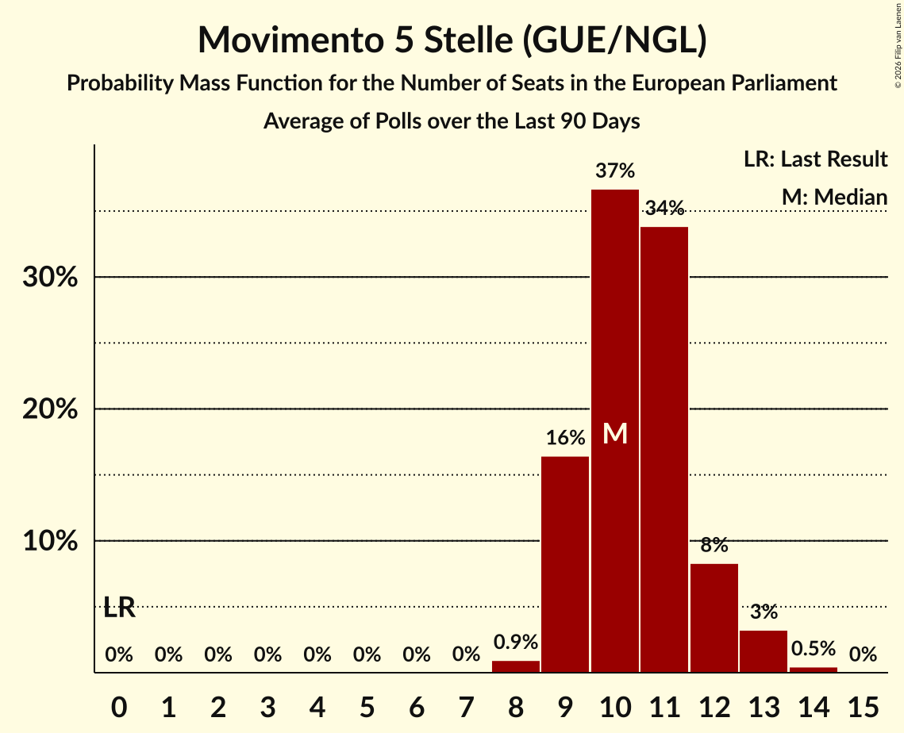

# Movimento 5 Stelle (GUE/NGL)

<a href="#voting-intentions">Voting Intentions</a> | <a href="#seats">Seats</a>

## Voting Intentions

Last result: **0.0%** (General Election of 9 June 2024)

### Confidence Intervals

| Period     | Polling firm/Commissioner(s) | Median | 80% Confidence Interval | 90% Confidence Interval | 95% Confidence Interval | 99% Confidence Interval |
|:----------:|:----------------:|:-----------:|:-----------------------:|:-----------------------:|:-----------------------:|:-----------------------:|
| N/A | [Poll Average](average.html) | 11.9% | 10.5–13.8% | 10.2–14.4% | 9.9–14.9% | 9.3–16.0% |
| [9–14 April 2025](2025-04-14-SWG.html) | SWG   La7 | 12.5% | 11.3–13.8% | 11.0–14.2% | 10.7–14.5% | 10.2–15.2% |
| [8–9 April 2025](2025-04-09-Eumetra.html) | Eumetra   La7 | 12.2% | 10.9–13.9% | 10.5–14.3% | 10.2–14.7% | 9.5–15.5% |
| [2–7 April 2025](2025-04-07-SWG.html) | SWG   La7 | 12.2% | 11.0–13.5% | 10.7–13.8% | 10.4–14.1% | 9.9–14.8% |
| [2–4 April 2025](2025-04-04-Quorum–YouTrend.html) | Quorum – YouTrend   Sky TG24 | 12.0% | 10.7–13.6% | 10.3–14.1% | 10.0–14.5% | 9.3–15.3% |
| [1–2 April 2025](2025-04-02-Eumetra.html) | Eumetra   La7 | 12.2% | 10.9–13.9% | 10.5–14.3% | 10.2–14.7% | 9.5–15.5% |
| [26–31 March 2025](2025-03-31-SWG.html) | SWG   La7 | 11.9% | 10.8–13.2% | 10.5–13.6% | 10.2–13.9% | 9.7–14.5% |
| [26–27 March 2025](2025-03-27-TermometroPolitico.html) | Termometro Politico | 11.7% | 10.9–12.5% | 10.7–12.7% | 10.6–12.9% | 10.2–13.3% |
| [25–27 March 2025](2025-03-27-Ipsos.html) | Ipsos   Corriere della Sera | 13.8% | 12.5–15.3% | 12.1–15.7% | 11.8–16.1% | 11.2–16.8% |
| [17–26 March 2025](2025-03-26-Winpoll.html) | Winpoll   Scenari Politici | 11.0% | 10.0–12.1% | 9.8–12.4% | 9.6–12.6% | 9.1–13.2% |
| [13–26 March 2025](2025-03-26-Quorum–YouTrend.html) | Quorum – YouTrend   Sky TG24 | 11.6% | 10.4–13.0% | 10.0–13.4% | 9.8–13.7% | 9.2–14.4% |
| [25–26 March 2025](2025-03-26-Demopolis.html) | Demopolis   La7 | 11.4% | 10.5–12.4% | 10.3–12.6% | 10.1–12.9% | 9.7–13.4% |
| [24–25 March 2025](2025-03-25-Piepoli.html) | Piepoli | 12.6% | 10.9–14.7% | 10.4–15.3% | 10.0–15.8% | 9.2–16.9% |
| [19–24 March 2025](2025-03-24-SWG.html) | SWG   La7 | 12.2% | N/A | N/A | N/A | N/A |
| [23 March 2025](2025-03-23-Lab2101.html) | Lab2101   Affari Italiani | 11.2% | 10.0–12.6% | 9.7–13.0% | 9.4–13.3% | 8.8–14.0% |
| [22 March 2025](2025-03-22-Tecnè.html) | Tecnè   Agenzia Dire | 11.3% | 10.1–12.7% | 9.8–13.1% | 9.5–13.4% | 8.9–14.1% |
| [19–20 March 2025](2025-03-20-TermometroPolitico.html) | Termometro Politico | 11.9% | N/A | N/A | N/A | N/A |
| [17–19 March 2025](2025-03-19-Piepoli.html) | Piepoli | 12.6% | N/A | N/A | N/A | N/A |
| [18–19 March 2025](2025-03-19-Eumetra.html) | Eumetra   La7 | 12.0% | 10.6–13.6% | 10.2–14.1% | 9.9–14.4% | 9.3–15.2% |
| [18 March 2025](2025-03-18-Euromedia.html) | Euromedia   Rai 1 | 11.9% | 10.7–13.3% | 10.3–13.7% | 10.0–14.1% | 9.5–14.8% |
| [12–17 March 2025](2025-03-17-SWG.html) | SWG   La7 | 12.2% | 11.0–13.5% | 10.7–13.8% | 10.4–14.1% | 9.9–14.8% |
| [15 March 2025](2025-03-15-Lab2101.html) | Lab2101   Affari Italiani | 11.1% | N/A | N/A | N/A | N/A |
| [12–13 March 2025](2025-03-13-TermometroPolitico.html) | Termometro Politico | 11.7% | N/A | N/A | N/A | N/A |
| [12–13 March 2025](2025-03-13-Tecnè.html) | Tecnè   Agenzia Dire | 11.4% | 10.2–12.8% | 9.9–13.2% | 9.6–13.5% | 9.0–14.2% |
| [11 March 2025](2025-03-11-NotoSondaggi.html) | Noto Sondaggi   Rai 1 | 11.5% | 10.3–12.9% | 10.0–13.3% | 9.7–13.6% | 9.1–14.3% |
| [5–10 March 2025](2025-03-10-SWG.html) | SWG   La7 | 12.4% | N/A | N/A | N/A | N/A |
| [8 March 2025](2025-03-08-Lab2101.html) | Lab2101   Affari Italiani | 10.9% | N/A | N/A | N/A | N/A |
| [7 March 2025](2025-03-07-Tecnè.html) | Tecnè   Agenzia Dire | 11.3% | N/A | N/A | N/A | N/A |
| [6–7 March 2025](2025-03-07-Quorum–YouTrend.html) | Quorum – YouTrend   Sky TG24 | 11.6% | 10.2–13.1% | 9.8–13.6% | 9.5–14.0% | 8.9–14.8% |
| [4–6 March 2025](2025-03-06-TermometroPolitico.html) | Termometro Politico | 11.5% | 10.8–12.3% | 10.6–12.5% | 10.4–12.7% | 10.1–13.1% |
| [5–6 March 2025](2025-03-06-Tecnè.html) | Tecnè   Agenzia Dire | 11.3% | N/A | N/A | N/A | N/A |
| [6 March 2025](2025-03-06-Euromedia.html) | Euromedia   Rai 1 | 11.8% | N/A | N/A | N/A | N/A |
| [5 March 2025](2025-03-05-Eumetra.html) | Eumetra   La7 | 12.0% | N/A | N/A | N/A | N/A |
| [26 February–3 March 2025](2025-03-03-SWG.html) | SWG   La7 | 12.0% | N/A | N/A | N/A | N/A |
| [1 March 2025](2025-03-01-Winpoll.html) | Winpoll | 10.7% | N/A | N/A | N/A | N/A |
| [26–27 February 2025](2025-02-27-Tecnè.html) | Tecnè | 11.3% | 10.1–12.7% | 9.8–13.1% | 9.5–13.4% | 8.9–14.1% |
| [21–27 February 2025](2025-02-27-Ixè.html) | Ixè | 12.3% | 11.1–13.7% | 10.7–14.1% | 10.4–14.5% | 9.8–15.2% |
| [25–27 February 2025](2025-02-27-Ipsos.html) | Ipsos   Corriere della Sera | 13.2% | 11.9–14.7% | 11.6–15.1% | 11.2–15.5% | 10.7–16.2% |
| [17–26 February 2025](2025-02-26-Winpoll.html) | Winpoll | 10.7% | 9.7–11.8% | 9.4–12.1% | 9.2–12.3% | 8.7–12.9% |
| [25–26 February 2025](2025-02-26-Euromedia.html) | Euromedia   La7 | 11.8% | 10.4–13.3% | 10.0–13.8% | 9.7–14.2% | 9.1–15.0% |
| [24–25 February 2025](2025-02-25-Piepoli.html) | Piepoli | 11.8% | N/A | N/A | N/A | N/A |
| [19–24 February 2025](2025-02-24-SWG.html) | SWG   La7 | 12.2% | 11.0–13.5% | 10.7–13.8% | 10.4–14.1% | 9.9–14.8% |
| [22–24 February 2025](2025-02-24-BiDiMedia.html) | BiDiMedia | 11.1% | 10.0–12.3% | 9.7–12.7% | 9.4–13.0% | 8.9–13.6% |
| [18–20 February 2025](2025-02-20-TermometroPolitico.html) | Termometro Politico | 11.4% | 10.7–12.2% | 10.4–12.4% | 10.3–12.6% | 9.9–13.0% |
| [19–20 February 2025](2025-02-20-Tecnè.html) | Tecnè   Agenzia Dire | 11.2% | N/A | N/A | N/A | N/A |
| [17–20 February 2025](2025-02-20-BiDiMedia.html) | BiDiMedia | 11.0% | N/A | N/A | N/A | N/A |
| [18–19 February 2025](2025-02-19-Eumetra.html) | Eumetra   La7 | 11.5% | 10.2–13.1% | 9.8–13.5% | 9.5–13.9% | 8.9–14.7% |
| [18–19 February 2025](2025-02-19-EMG.html) | EMG   Rai 3 | 11.4% | 10.3–12.7% | 10.0–13.0% | 9.7–13.3% | 9.2–14.0% |
| [12–17 February 2025](2025-02-17-SWG.html) | SWG   La7 | 11.9% | 10.8–13.2% | 10.5–13.6% | 10.2–13.9% | 9.7–14.5% |
| [14–16 February 2025](2025-02-16-Euromedia.html) | Euromedia   Rai 1 | 11.5% | 10.3–12.9% | 10.0–13.3% | 9.7–13.6% | 9.1–14.3% |
| [13–14 February 2025](2025-02-14-Tecnè.html) | Tecnè   Agenzia Dire | 11.0% | 9.8–12.3% | 9.5–12.7% | 9.2–13.1% | 8.6–13.7% |
| [12–14 February 2025](2025-02-14-Lab2101.html) | Lab2101   Affari Italiani | 10.7% | 9.5–12.1% | 9.2–12.4% | 8.9–12.8% | 8.4–13.5% |
| [10–14 February 2025](2025-02-14-Demos.html) | Demos   La Repubblica | 11.4% | 10.2–12.7% | 9.8–13.1% | 9.5–13.5% | 9.0–14.2% |
| [12–13 February 2025](2025-02-13-TermometroPolitico.html) | Termometro Politico | 11.3% | 10.5–12.1% | 10.3–12.3% | 10.2–12.6% | 9.8–13.0% |
| [12–13 February 2025](2025-02-13-EMG.html) | EMG | 11.6% | 10.4–12.9% | 10.1–13.3% | 9.8–13.6% | 9.3–14.3% |
| [9–12 February 2025](2025-02-12-Piepoli.html) | Piepoli | 11.6% | 9.9–13.6% | 9.5–14.2% | 9.1–14.7% | 8.3–15.7% |
| [5–10 February 2025](2025-02-10-SWG.html) | SWG | 11.8% | N/A | N/A | N/A | N/A |
| [6–7 February 2025](2025-02-07-Tecnè.html) | Tecnè | 10.8% | N/A | N/A | N/A | N/A |
| [6–7 February 2025](2025-02-07-Quorum–YouTrend.html) | Quorum – YouTrend   Sky TG24 | 11.4% | 10.1–13.0% | 9.7–13.4% | 9.4–13.8% | 8.8–14.6% |
| [4–6 February 2025](2025-02-06-TermometroPolitico.html) | Termometro Politico | 11.3% | N/A | N/A | N/A | N/A |
| [4–5 February 2025](2025-02-05-Eumetra.html) | Eumetra   La7 | 11.4% | 10.0–12.9% | 9.7–13.4% | 9.4–13.8% | 8.7–14.6% |
| [4–5 February 2025](2025-02-05-EMG.html) | EMG | 11.3% | N/A | N/A | N/A | N/A |
| [3 February 2025](2025-02-03-SWG.html) | SWG   La7 | 11.8% | 10.7–13.1% | 10.4–13.5% | 10.1–13.8% | 9.6–14.4% |
| [2–3 February 2025](2025-02-03-NotoSondaggi.html) | Noto Sondaggi   Rai 1 | 11.5% | 10.3–12.9% | 10.0–13.3% | 9.7–13.6% | 9.1–14.3% |
| [29–31 January 2025](2025-01-31-Lab2101.html) | Lab2101   Affari Italiani | 10.7% | 9.5–12.1% | 9.2–12.4% | 8.9–12.8% | 8.4–13.5% |
| [28–30 January 2025](2025-01-30-Ipsos.html) | Ipsos | 12.5% | 11.2–13.9% | 10.9–14.3% | 10.6–14.7% | 10.0–15.4% |
| [28–29 January 2025](2025-01-29-Eumetra.html) | Eumetra   La7 | 11.2% | 9.9–12.8% | 9.6–13.2% | 9.2–13.6% | 8.6–14.4% |
| [27–28 January 2025](2025-01-28-Demopolis.html) | Demopolis | 11.2% | 10.3–12.2% | 10.1–12.4% | 9.9–12.7% | 9.5–13.1% |
| [22–27 January 2025](2025-01-27-SWG.html) | SWG   La7 | 11.4% | 10.3–12.7% | 10.0–13.0% | 9.7–13.4% | 9.2–14.0% |
| [23–24 January 2025](2025-01-24-Tecnè.html) | Tecnè | 10.6% | 9.4–11.9% | 9.1–12.3% | 8.8–12.7% | 8.3–13.3% |
| [21–22 January 2025](2025-01-22-EMG.html) | EMG | 11.1% | 9.9–12.4% | 9.5–12.8% | 9.3–13.1% | 8.7–13.8% |
| [14–15 January 2025](2025-01-15-EMG.html) | EMG | 10.8% | N/A | N/A | N/A | N/A |
| [8–13 January 2025](2025-01-13-SWG.html) | SWG   La7 | 11.6% | 10.5–12.8% | 10.2–13.2% | 9.9–13.5% | 9.4–14.2% |
| [9–10 January 2025](2025-01-10-Tecnè.html) | Tecnè   Agenzia Dire | 10.4% | 9.3–11.7% | 8.9–12.1% | 8.7–12.5% | 8.1–13.1% |
| [9–10 January 2025](2025-01-10-Quorum–YouTrend.html) | Quorum – YouTrend   Sky TG24 | 11.5% | 10.4–12.7% | 10.0–13.1% | 9.8–13.4% | 9.3–14.0% |
| [8–9 January 2025](2025-01-09-TermometroPolitico.html) | Termometro Politico | 11.0% | 10.2–11.8% | 10.0–12.1% | 9.8–12.3% | 9.5–12.7% |
| [7–8 January 2025](2025-01-08-Eumetra.html) | Eumetra | 11.5% | 10.2–13.1% | 9.8–13.5% | 9.5–13.9% | 8.9–14.7% |
| [2–6 January 2025](2025-01-06-SWG.html) | SWG   La7 | 11.4% | 10.3–12.7% | 10.0–13.0% | 9.7–13.4% | 9.2–14.0% |
| [18–23 December 2024](2024-12-23-SWG.html) | SWG   La7 | 11.5% | 10.4–12.8% | 10.1–13.1% | 9.8–13.4% | 9.3–14.1% |
| [12–20 December 2024](2024-12-20-Winpoll.html) | Winpoll | 10.8% | 9.8–11.9% | 9.6–12.2% | 9.3–12.5% | 8.9–13.0% |
| [19–20 December 2024](2024-12-20-Tecnè.html) | Tecnè | 10.7% | 9.6–12.1% | 9.2–12.5% | 8.9–12.8% | 8.4–13.5% |
| [18–20 December 2024](2024-12-20-Ipsos.html) | Ipsos   Corriere della Sera | 13.3% | 12.0–14.8% | 11.6–15.2% | 11.3–15.6% | 10.7–16.3% |
| [18–19 December 2024](2024-12-19-TermometroPolitico.html) | Termometro Politico | 10.6% | 9.9–11.4% | 9.7–11.6% | 9.5–11.8% | 9.2–12.2% |
| [11–16 December 2024](2024-12-16-SWG.html) | SWG   La7 | 11.2% | 10.1–12.4% | 9.8–12.8% | 9.5–13.1% | 9.0–13.7% |
| [12–13 December 2024](2024-12-13-Tecnè.html) | Tecnè | 10.9% | N/A | N/A | N/A | N/A |
| [12–13 December 2024](2024-12-13-Demopolis.html) | Demopolis | 11.8% | 10.9–12.8% | 10.7–13.0% | 10.5–13.3% | 10.0–13.8% |
| [11–12 December 2024](2024-12-12-TermometroPolitico.html) | Termometro Politico | 10.9% | N/A | N/A | N/A | N/A |
| [6–11 December 2024](2024-12-11-Ixè.html) | Ixè | 12.1% | 10.9–13.5% | 10.5–13.9% | 10.2–14.3% | 9.6–15.0% |
| [10–11 December 2024](2024-12-11-Eumetra.html) | Eumetra   La7 | 11.2% | 9.9–12.8% | 9.6–13.2% | 9.2–13.6% | 8.6–14.4% |
| [4–9 December 2024](2024-12-09-SWG.html) | SWG   La7 | 11.5% | 10.4–12.8% | 10.1–13.1% | 9.8–13.4% | 9.3–14.1% |
| [5–6 December 2024](2024-12-06-Tecnè.html) | Tecnè | 10.8% | N/A | N/A | N/A | N/A |
| [5–6 December 2024](2024-12-06-Quorum–YouTrend.html) | Quorum – YouTrend   Sky TG24 | 11.6% | 10.5–12.8% | 10.1–13.2% | 9.9–13.5% | 9.4–14.1% |
| [4–5 December 2024](2024-12-05-TermometroPolitico.html) | Termometro Politico | 10.6% | N/A | N/A | N/A | N/A |
| [3–5 December 2024](2024-12-05-BiDiMedia.html) | BiDiMedia | 11.0% | 9.8–12.4% | 9.5–12.8% | 9.2–13.1% | 8.7–13.8% |
| [3–4 December 2024](2024-12-04-Eumetra.html) | Eumetra   La7 | 11.8% | 10.4–13.3% | 10.0–13.8% | 9.7–14.2% | 9.1–15.0% |
| [2 December 2024](2024-12-02-SWG.html) | SWG   La7 | 11.7% | N/A | N/A | N/A | N/A |
| [28–29 November 2024](2024-11-29-Tecnè.html) | Tecnè | 10.7% | 9.5–12.1% | 9.2–12.4% | 8.9–12.8% | 8.4–13.5% |
| [21–28 November 2024](2024-11-28-Winpoll.html) | Winpoll | 10.4% | 9.4–11.5% | 9.2–11.8% | 8.9–12.1% | 8.5–12.6% |
| [27–28 November 2024](2024-11-28-TermometroPolitico.html) | Termometro Politico | 10.6% | N/A | N/A | N/A | N/A |
| [28 November 2024](2024-11-28-Ipsos.html) | Ipsos   Corriere della Sera | 13.0% | 11.7–14.5% | 11.4–14.9% | 11.1–15.2% | 10.5–16.0% |
| [20–25 November 2024](2024-11-25-SWG.html) | SWG   La7 | 11.2% | 10.1–12.4% | 9.8–12.8% | 9.5–13.1% | 9.0–13.7% |
| [25 November 2024](2024-11-25-Euromedia.html) | Euromedia   Rai 1 | 11.5% | 10.3–12.9% | 10.0–13.3% | 9.7–13.6% | 9.1–14.3% |
| [21–22 November 2024](2024-11-22-Tecnè.html) | Tecnè | 10.6% | N/A | N/A | N/A | N/A |
| [20–21 November 2024](2024-11-21-TermometroPolitico.html) | Termometro Politico | 10.5% | N/A | N/A | N/A | N/A |
| [13–19 November 2024](2024-11-19-SWG.html) | SWG   La7 | 11.2% | 10.1–12.4% | 9.8–12.8% | 9.5–13.1% | 9.0–13.7% |
| [14–15 November 2024](2024-11-15-Tecnè.html) | Tecnè | 10.6% | N/A | N/A | N/A | N/A |
| [13–15 November 2024](2024-11-15-Quorum–YouTrend.html) | Quorum – YouTrend   Sky TG24 | 11.9% | 10.8–13.2% | 10.5–13.5% | 10.2–13.9% | 9.7–14.5% |
| [13–14 November 2024](2024-11-14-TermometroPolitico.html) | Termometro Politico | 10.2% | N/A | N/A | N/A | N/A |
| [11–12 November 2024](2024-11-12-Demopolis.html) | Demopolis | 11.4% | 11.0–12.9% | 10.7–13.2% | 10.5–13.4% | 10.1–13.9% |
| [6–11 November 2024](2024-11-11-SWG.html) | SWG   La7 | 11.3% | 10.2–12.6% | 9.9–13.0% | 9.7–13.3% | 9.1–13.9% |
| [7–8 November 2024](2024-11-08-Tecnè.html) | Tecnè | 10.7% | N/A | N/A | N/A | N/A |
| [6–7 November 2024](2024-11-07-TermometroPolitico.html) | Termometro Politico | 10.0% | N/A | N/A | N/A | N/A |
| [4 November 2024](2024-11-04-SWG.html) | SWG   La7 | 11.6% | N/A | N/A | N/A | N/A |
| [1–4 November 2024](2024-11-04-Quorum–YouTrend.html) | Quorum – YouTrend   Sky TG24 | 11.9% | 10.7–13.2% | 10.4–13.5% | 10.2–13.8% | 9.6–14.5% |
| [30–31 October 2024](2024-10-31-TermometroPolitico.html) | Termometro Politico | 10.3% | N/A | N/A | N/A | N/A |
| [30–31 October 2024](2024-10-31-Tecnè.html) | Tecnè | 10.6% | N/A | N/A | N/A | N/A |
| [23–28 October 2024](2024-10-28-SWG.html) | SWG   La7 | 11.6% | 10.5–12.8% | 10.2–13.2% | 9.9–13.5% | 9.4–14.2% |
| [25–26 October 2024](2024-10-26-Tecnè.html) | Tecnè | 10.5% | N/A | N/A | N/A | N/A |
| [23–24 October 2024](2024-10-24-TermometroPolitico.html) | Termometro Politico | 10.2% | N/A | N/A | N/A | N/A |
| [22–23 October 2024](2024-10-23-Eumetra.html) | Eumetra   La7 | 11.2% | 9.9–12.8% | 9.6–13.2% | 9.2–13.6% | 8.6–14.4% |
| [17–18 October 2024](2024-10-18-Tecnè.html) | Tecnè   Agenzia Dire | 10.4% | 9.3–11.7% | 8.9–12.1% | 8.7–12.5% | 8.1–13.1% |
| [16–17 October 2024](2024-10-17-TermometroPolitico.html) | Termometro Politico | 10.3% | 9.6–11.1% | 9.4–11.3% | 9.3–11.4% | 8.9–11.8% |
| [15–16 October 2024](2024-10-16-Eumetra.html) | Eumetra | 11.2% | 9.9–12.8% | 9.6–13.2% | 9.2–13.6% | 8.6–14.4% |
| [9–14 October 2024](2024-10-14-SWG.html) | SWG   La7 | 11.7% | 10.5–12.9% | 10.2–13.3% | 10.0–13.6% | 9.4–14.3% |
| [14 October 2024](2024-10-14-Euromedia.html) | Euromedia | 11.6% | 10.4–13.0% | 10.0–13.4% | 9.8–13.7% | 9.2–14.4% |
| [10–11 October 2024](2024-10-11-Tecnè.html) | Tecnè   Agenzia Dire | 10.2% | N/A | N/A | N/A | N/A |
| [9–10 October 2024](2024-10-10-TermometroPolitico.html) | Termometro Politico | 10.2% | N/A | N/A | N/A | N/A |
| [8–9 October 2024](2024-10-09-Eumetra.html) | Eumetra   La7 | 11.0% | 9.7–12.5% | 9.3–13.0% | 9.0–13.4% | 8.4–14.1% |
| [8–9 October 2024](2024-10-09-EMG.html) | EMG   Rai 3 | 12.0% | 11.0–13.2% | 10.7–13.5% | 10.5–13.7% | 10.0–14.3% |
| [2–7 October 2024](2024-10-07-SWG.html) | SWG   La7 | 11.4% | 10.3–12.7% | 10.0–13.0% | 9.7–13.4% | 9.2–14.0% |
| [3–4 October 2024](2024-10-04-Tecnè.html) | Tecnè | 10.5% | 9.3–11.8% | 9.0–12.2% | 8.7–12.6% | 8.2–13.2% |
| [2–3 October 2024](2024-10-03-TermometroPolitico.html) | Termometro Politico | 10.2% | N/A | N/A | N/A | N/A |
| [1–2 October 2024](2024-10-02-Eumetra.html) | Eumetra | 11.1% | N/A | N/A | N/A | N/A |
| [25–30 September 2024](2024-09-30-SWG.html) | SWG   La7 | 11.8% | 10.7–13.1% | 10.4–13.5% | 10.1–13.8% | 9.6–14.4% |
| [26–27 September 2024](2024-09-27-Tecnè.html) | Tecnè   Agenzia Dire | 10.7% | 9.5–12.1% | 9.2–12.4% | 8.9–12.8% | 8.4–13.5% |
| [25–26 September 2024](2024-09-26-TermometroPolitico.html) | Termometro Politico | 10.3% | 9.6–11.0% | 9.5–11.2% | 9.3–11.4% | 9.0–11.8% |
| [25 September 2024](2024-09-25-Euromedia.html) | Euromedia   Rai 1 | 10.5% | 9.2–12.0% | 8.9–12.5% | 8.6–12.8% | 8.0–13.6% |
| [24–25 September 2024](2024-09-25-Eumetra.html) | Eumetra   La7 | 11.8% | 10.4–13.3% | 10.0–13.8% | 9.7–14.2% | 9.1–15.0% |
| [18–23 September 2024](2024-09-23-SWG.html) | SWG   La7 | 11.7% | N/A | N/A | N/A | N/A |
| [19–20 September 2024](2024-09-20-Tecnè.html) | Tecnè   Agenzia Dire | 10.9% | N/A | N/A | N/A | N/A |
| [18–19 September 2024](2024-09-19-TermometroPolitico.html) | Termometro Politico | 9.9% | N/A | N/A | N/A | N/A |
| [19 September 2024](2024-09-19-NotoSondaggi.html) | Noto Sondaggi   Rai 1 | 12.5% | 11.2–13.9% | 10.9–14.3% | 10.6–14.7% | 10.0–15.4% |
| [17–18 September 2024](2024-09-18-Eumetra.html) | Eumetra   La7 | 11.8% | N/A | N/A | N/A | N/A |
| [11–16 September 2024](2024-09-16-SWG.html) | SWG   La7 | 11.7% | N/A | N/A | N/A | N/A |
| [12–13 September 2024](2024-09-13-Tecnè.html) | Tecnè   Agenzia Dire | 10.7% | 9.4–12.3% | 9.1–12.7% | 8.8–13.1% | 8.2–13.9% |
| [11–12 September 2024](2024-09-12-TermometroPolitico.html) | Termometro Politico | 10.0% | 9.3–10.7% | 9.1–10.9% | 9.0–11.1% | 8.7–11.5% |
| [10–12 September 2024](2024-09-12-Ipsos.html) | Ipsos   Corriere della Sera | 13.9% | 12.6–15.4% | 12.2–15.8% | 11.9–16.2% | 11.3–16.9% |
| [9–11 September 2024](2024-09-11-Piepoli.html) | Piepoli | 11.8% | 10.1–13.8% | 9.6–14.4% | 9.3–14.9% | 8.5–16.0% |
| [9–11 September 2024](2024-09-11-Ixè.html) | Ixè | 11.9% | 10.7–13.3% | 10.3–13.7% | 10.0–14.1% | 9.5–14.8% |
| [10–11 September 2024](2024-09-11-Eumetra.html) | Eumetra   La7 | 11.2% | N/A | N/A | N/A | N/A |
| [10 September 2024](2024-09-10-Euromedia.html) | Euromedia   Rai 1 | 10.3% | 9.2–11.6% | 8.8–12.0% | 8.6–12.3% | 8.0–13.0% |
| [4–9 September 2024](2024-09-09-SWG.html) | SWG   La7 | 11.5% | N/A | N/A | N/A | N/A |
| [5–7 September 2024](2024-09-07-BiDiMedia.html) | BiDiMedia | 10.9% | 9.7–12.3% | 9.4–12.7% | 9.1–13.0% | 8.6–13.7% |
| [5–6 September 2024](2024-09-06-Tecnè.html) | Tecnè   Agenzia Dire | 10.5% | N/A | N/A | N/A | N/A |
| [2 September 2024](2024-09-02-SWG.html) | SWG   La7 | 11.6% | N/A | N/A | N/A | N/A |
| [29–30 August 2024](2024-08-30-Tecnè.html) | Tecnè   Agenzia Dire | 10.7% | N/A | N/A | N/A | N/A |
| [28–29 August 2024](2024-08-29-TermometroPolitico.html) | Termometro Politico | 9.9% | N/A | N/A | N/A | N/A |
| [28–29 August 2024](2024-08-29-Quorum–YouTrend.html) | Quorum – YouTrend   Sky TG24 | 11.1% | 10.0–12.4% | 9.7–12.7% | 9.5–13.0% | 9.0–13.6% |
| [21–22 August 2024](2024-08-22-TermometroPolitico.html) | Termometro Politico | 10.1% | N/A | N/A | N/A | N/A |
| [5–16 August 2024](2024-08-16-Lab2101.html) | Lab2101   Affari Italiani | 11.0% | 9.8–12.4% | 9.5–12.8% | 9.2–13.1% | 8.7–13.8% |
| [3 August 2024](2024-08-03-Lab2101.html) | Lab2101   Affari Italiani | 10.9% | N/A | N/A | N/A | N/A |
| [24–29 July 2024](2024-07-29-SWG.html) | SWG   La7 | 11.4% | N/A | N/A | N/A | N/A |
| [25–26 July 2024](2024-07-26-Tecnè.html) | Tecnè   Agenzia Dire | 9.8% | N/A | N/A | N/A | N/A |
| [24–25 July 2024](2024-07-25-TermometroPolitico.html) | Termometro Politico | 9.7% | N/A | N/A | N/A | N/A |
| [23–25 July 2024](2024-07-25-Ipsos.html) | Ipsos   Corriere della Sera | 13.0% | N/A | N/A | N/A | N/A |
| [25 July 2024](2024-07-25-Euromedia.html) | Euromedia | 10.4% | N/A | N/A | N/A | N/A |
| [22–24 July 2024](2024-07-24-Piepoli.html) | Piepoli | 11.0% | N/A | N/A | N/A | N/A |
| [17–22 July 2024](2024-07-22-SWG.html) | SWG   La7 | 11.1% | N/A | N/A | N/A | N/A |
| [21 July 2024](2024-07-21-Lab2101.html) | Lab2101   Affari Italiani | 10.5% | N/A | N/A | N/A | N/A |
| [18–19 July 2024](2024-07-19-Tecnè.html) | Tecnè   Agenzia Dire | 9.8% | N/A | N/A | N/A | N/A |
| [16–18 July 2024](2024-07-18-TermometroPolitico.html) | Termometro Politico | 9.9% | N/A | N/A | N/A | N/A |
| [17–18 July 2024](2024-07-18-Quorum–YouTrend.html) | Quorum – YouTrend   Sky TG24 | 10.5% | N/A | N/A | N/A | N/A |
| [10–15 July 2024](2024-07-15-SWG.html) | SWG   La7 | 10.8% | N/A | N/A | N/A | N/A |
| [11–12 July 2024](2024-07-12-Tecnè.html) | Tecnè   Agenzia Dire | 9.7% | N/A | N/A | N/A | N/A |
| [9–11 July 2024](2024-07-11-TermometroPolitico.html) | Termometro Politico | 9.6% | N/A | N/A | N/A | N/A |
| [3–8 July 2024](2024-07-08-SWG.html) | SWG   La7 | 10.6% | N/A | N/A | N/A | N/A |
| [4–5 July 2024](2024-07-05-Tecnè.html) | Tecnè   Agenzia Dire | 9.6% | N/A | N/A | N/A | N/A |
| [3–4 July 2024](2024-07-04-TermometroPolitico.html) | Termometro Politico | 9.5% | N/A | N/A | N/A | N/A |
| [1 July 2024](2024-07-01-SWG.html) | SWG   La7 | 10.3% | N/A | N/A | N/A | N/A |
| [27–28 June 2024](2024-06-28-Tecnè.html) | Tecnè   Agenzia Dire | 9.6% | N/A | N/A | N/A | N/A |
| [26–27 June 2024](2024-06-27-TermometroPolitico.html) | Termometro Politico | 9.4% | N/A | N/A | N/A | N/A |
| [25–27 June 2024](2024-06-27-Quorum–YouTrend.html) | Quorum – YouTrend   Sky TG24 | 9.6% | N/A | N/A | N/A | N/A |
| [25–27 June 2024](2024-06-27-Ipsos.html) | Ipsos | 12.5% | N/A | N/A | N/A | N/A |
| [26 June 2024](2024-06-26-Euromedia.html) | Euromedia   La Stampa | 9.7% | N/A | N/A | N/A | N/A |
| [24–25 June 2024](2024-06-25-Demopolis.html) | Demopolis   La7 | 10.2% | N/A | N/A | N/A | N/A |
| [19–24 June 2024](2024-06-24-SWG.html) | SWG   La7 | 10.0% | N/A | N/A | N/A | N/A |
| [20–21 June 2024](2024-06-21-Tecnè.html) | Tecnè   Agenzia Dire | 9.7% | N/A | N/A | N/A | N/A |
| [12–17 June 2024](2024-06-17-SWG.html) | SWG   La7 | 9.7% | N/A | N/A | N/A | N/A |
| [12–13 June 2024](2024-06-13-TermometroPolitico.html) | Termometro Politico | 9.6% | N/A | N/A | N/A | N/A |

### Probability Mass Function

The following table shows the probability mass function per percentage block of voting intentions for the [poll average](average.html) for Movimento 5 Stelle (GUE/NGL).

| Voting Intentions | Probability | Accumulated | Special Marks |
|:-----------------:|:-----------:|:-----------:|:-------------:|
| 0.0–0.5% | 0% | 100% | Last Result |
| 0.5–1.5% | 0% | 100% |  |
| 1.5–2.5% | 0% | 100% |  |
| 2.5–3.5% | 0% | 100% |  |
| 3.5–4.5% | 0% | 100% |  |
| 4.5–5.5% | 0% | 100% |  |
| 5.5–6.5% | 0% | 100% |  |
| 6.5–7.5% | 0% | 100% |  |
| 7.5–8.5% | 0% | 100% |  |
| 8.5–9.5% | 1.1% | 100% |  |
| 9.5–10.5% | 9% | 98.8% |  |
| 10.5–11.5% | 28% | 90% |  |
| 11.5–12.5% | 31% | 62% | Median |
| 12.5–13.5% | 18% | 31% |  |
| 13.5–14.5% | 9% | 13% |  |
| 14.5–15.5% | 3% | 4% |  |
| 15.5–16.5% | 0.8% | 1.0% |  |
| 16.5–17.5% | 0.1% | 0.2% |  |
| 17.5–18.5% | 0% | 0% |  |

## Seats

Last result: **0** seats (General Election of 9 June 2024)

### Confidence Intervals

| Period     | Polling firm/Commissioner(s) | Median | 80% Confidence Interval | 90% Confidence Interval | 95% Confidence Interval | 99% Confidence Interval |
|:----------:|:----------------:|:------:|:-----------------------:|:-----------------------:|:-----------------------:|:-----------------------:|
| N/A | [Poll Average](average.html) | 11 | 9–13 | 9–13 | 9–14 | 8–14 |
| [9–14 April 2025](2025-04-14-SWG.html) | SWG   La7 | 11 | 10–13 | 10–13 | 10–13 | 9–14 |
| [8–9 April 2025](2025-04-09-Eumetra.html) | Eumetra   La7 | 11 | 10–12 | 9–13 | 9–13 | 8–14 |
| [2–7 April 2025](2025-04-07-SWG.html) | SWG   La7 | 11 | 10–11 | 10–12 | 9–12 | 9–13 |
| [2–4 April 2025](2025-04-04-Quorum–YouTrend.html) | Quorum – YouTrend   Sky TG24 | 11 | 9–12 | 9–12 | 9–13 | 8–13 |
| [1–2 April 2025](2025-04-02-Eumetra.html) | Eumetra   La7 | 11 | 10–13 | 9–13 | 9–13 | 8–14 |
| [26–31 March 2025](2025-03-31-SWG.html) | SWG   La7 | 11 | 10–12 | 10–12 | 9–12 | 8–13 |
| [26–27 March 2025](2025-03-27-TermometroPolitico.html) | Termometro Politico | 11 | 10–12 | 10–12 | 10–12 | 10–13 |
| [25–27 March 2025](2025-03-27-Ipsos.html) | Ipsos   Corriere della Sera | 12 | 11–14 | 11–14 | 10–14 | 10–15 |
| [17–26 March 2025](2025-03-26-Winpoll.html) | Winpoll   Scenari Politici | 10 | 9–11 | 9–11 | 9–11 | 8–12 |
| [13–26 March 2025](2025-03-26-Quorum–YouTrend.html) | Quorum – YouTrend   Sky TG24 | 10 | 9–11 | 8–12 | 8–12 | 8–13 |
| [25–26 March 2025](2025-03-26-Demopolis.html) | Demopolis   La7 | 10 | 9–11 | 9–11 | 9–11 | 8–12 |
| [24–25 March 2025](2025-03-25-Piepoli.html) | Piepoli | 12 | 9–13 | 9–13 | 9–14 | 8–15 |
| [19–24 March 2025](2025-03-24-SWG.html) | SWG   La7 |  |  |  |  |  |
| [23 March 2025](2025-03-23-Lab2101.html) | Lab2101   Affari Italiani | 11 | 9–12 | 9–12 | 8–12 | 8–12 |
| [22 March 2025](2025-03-22-Tecnè.html) | Tecnè   Agenzia Dire | 10 | 9–11 | 9–11 | 8–12 | 8–13 |
| [19–20 March 2025](2025-03-20-TermometroPolitico.html) | Termometro Politico |  |  |  |  |  |
| [17–19 March 2025](2025-03-19-Piepoli.html) | Piepoli |  |  |  |  |  |
| [18–19 March 2025](2025-03-19-Eumetra.html) | Eumetra   La7 | 11 | 10–12 | 9–12 | 9–12 | 8–13 |
| [18 March 2025](2025-03-18-Euromedia.html) | Euromedia   Rai 1 | 11 | 9–12 | 9–12 | 9–13 | 8–14 |
| [12–17 March 2025](2025-03-17-SWG.html) | SWG   La7 | 11 | 10–12 | 10–12 | 9–13 | 9–13 |
| [15 March 2025](2025-03-15-Lab2101.html) | Lab2101   Affari Italiani |  |  |  |  |  |
| [12–13 March 2025](2025-03-13-TermometroPolitico.html) | Termometro Politico |  |  |  |  |  |
| [12–13 March 2025](2025-03-13-Tecnè.html) | Tecnè   Agenzia Dire | 10 | 9–11 | 9–12 | 8–12 | 8–13 |
| [11 March 2025](2025-03-11-NotoSondaggi.html) | Noto Sondaggi   Rai 1 | 11 | 9–12 | 9–12 | 9–12 | 8–13 |
| [5–10 March 2025](2025-03-10-SWG.html) | SWG   La7 |  |  |  |  |  |
| [8 March 2025](2025-03-08-Lab2101.html) | Lab2101   Affari Italiani |  |  |  |  |  |
| [7 March 2025](2025-03-07-Tecnè.html) | Tecnè   Agenzia Dire |  |  |  |  |  |
| [6–7 March 2025](2025-03-07-Quorum–YouTrend.html) | Quorum – YouTrend   Sky TG24 | 10 | 9–12 | 9–12 | 9–12 | 8–13 |
| [4–6 March 2025](2025-03-06-TermometroPolitico.html) | Termometro Politico | 10 | 10–11 | 9–11 | 9–12 | 9–12 |
| [5–6 March 2025](2025-03-06-Tecnè.html) | Tecnè   Agenzia Dire |  |  |  |  |  |
| [6 March 2025](2025-03-06-Euromedia.html) | Euromedia   Rai 1 |  |  |  |  |  |
| [5 March 2025](2025-03-05-Eumetra.html) | Eumetra   La7 |  |  |  |  |  |
| [26 February–3 March 2025](2025-03-03-SWG.html) | SWG   La7 |  |  |  |  |  |
| [1 March 2025](2025-03-01-Winpoll.html) | Winpoll |  |  |  |  |  |
| [26–27 February 2025](2025-02-27-Tecnè.html) | Tecnè | 10 | 9–11 | 8–11 | 8–12 | 8–13 |
| [21–27 February 2025](2025-02-27-Ixè.html) | Ixè | 11 | 10–12 | 10–12 | 9–13 | 9–13 |
| [25–27 February 2025](2025-02-27-Ipsos.html) | Ipsos   Corriere della Sera | 12 | 10–13 | 10–13 | 9–13 | 9–14 |
| [17–26 February 2025](2025-02-26-Winpoll.html) | Winpoll | 9 | 8–10 | 8–11 | 8–11 | 8–11 |
| [25–26 February 2025](2025-02-26-Euromedia.html) | Euromedia   La7 | 11 | 9–12 | 9–12 | 9–13 | 8–13 |
| [24–25 February 2025](2025-02-25-Piepoli.html) | Piepoli |  |  |  |  |  |
| [19–24 February 2025](2025-02-24-SWG.html) | SWG   La7 | 11 | 10–13 | 10–13 | 10–13 | 9–13 |
| [22–24 February 2025](2025-02-24-BiDiMedia.html) | BiDiMedia | 11 | 10–12 | 9–12 | 9–12 | 9–13 |
| [18–20 February 2025](2025-02-20-TermometroPolitico.html) | Termometro Politico | 10 | 9–11 | 9–11 | 9–11 | 9–12 |
| [19–20 February 2025](2025-02-20-Tecnè.html) | Tecnè   Agenzia Dire |  |  |  |  |  |
| [17–20 February 2025](2025-02-20-BiDiMedia.html) | BiDiMedia |  |  |  |  |  |
| [18–19 February 2025](2025-02-19-Eumetra.html) | Eumetra   La7 | 10 | 9–12 | 9–12 | 9–13 | 8–14 |
| [18–19 February 2025](2025-02-19-EMG.html) | EMG   Rai 3 | 10 | 9–12 | 9–12 | 9–13 | 8–13 |
| [12–17 February 2025](2025-02-17-SWG.html) | SWG   La7 | 10 | 10–12 | 10–12 | 9–12 | 8–13 |
| [14–16 February 2025](2025-02-16-Euromedia.html) | Euromedia   Rai 1 | 11 | 9–11 | 9–12 | 9–12 | 8–13 |
| [13–14 February 2025](2025-02-14-Tecnè.html) | Tecnè   Agenzia Dire | 10 | 9–11 | 8–11 | 8–12 | 7–12 |
| [12–14 February 2025](2025-02-14-Lab2101.html) | Lab2101   Affari Italiani | 10 | 9–11 | 8–11 | 8–11 | 8–12 |
| [10–14 February 2025](2025-02-14-Demos.html) | Demos   La Repubblica | 10 | 9–12 | 8–12 | 8–13 | 8–13 |
| [12–13 February 2025](2025-02-13-TermometroPolitico.html) | Termometro Politico | 10 | 9–10 | 9–11 | 9–11 | 9–12 |
| [12–13 February 2025](2025-02-13-EMG.html) | EMG | 11 | 10–12 | 9–12 | 9–13 | 9–13 |
| [9–12 February 2025](2025-02-12-Piepoli.html) | Piepoli | 10 | 9–12 | 8–13 | 8–13 | 8–14 |
| [5–10 February 2025](2025-02-10-SWG.html) | SWG |  |  |  |  |  |
| [6–7 February 2025](2025-02-07-Tecnè.html) | Tecnè |  |  |  |  |  |
| [6–7 February 2025](2025-02-07-Quorum–YouTrend.html) | Quorum – YouTrend   Sky TG24 | 10 | 9–11 | 9–12 | 8–12 | 7–13 |
| [4–6 February 2025](2025-02-06-TermometroPolitico.html) | Termometro Politico |  |  |  |  |  |
| [4–5 February 2025](2025-02-05-Eumetra.html) | Eumetra   La7 | 10 | 9–11 | 9–12 | 8–12 | 7–13 |
| [4–5 February 2025](2025-02-05-EMG.html) | EMG |  |  |  |  |  |
| [3 February 2025](2025-02-03-SWG.html) | SWG   La7 | 10 | 10–12 | 10–12 | 9–13 | 9–13 |
| [2–3 February 2025](2025-02-03-NotoSondaggi.html) | Noto Sondaggi   Rai 1 | 10 | 9–12 | 9–12 | 9–13 | 8–13 |
| [29–31 January 2025](2025-01-31-Lab2101.html) | Lab2101   Affari Italiani | 9 | 9–11 | 9–12 | 8–12 | 8–12 |
| [28–30 January 2025](2025-01-30-Ipsos.html) | Ipsos | 11 | 10–12 | 9–12 | 9–13 | 8–14 |
| [28–29 January 2025](2025-01-29-Eumetra.html) | Eumetra   La7 | 10 | 9–11 | 9–12 | 8–12 | 8–13 |
| [27–28 January 2025](2025-01-28-Demopolis.html) | Demopolis | 10 | 9–11 | 9–11 | 9–11 | 8–12 |
| [22–27 January 2025](2025-01-27-SWG.html) | SWG   La7 | 10 | 10–11 | 10–12 | 9–12 | 9–13 |
| [23–24 January 2025](2025-01-24-Tecnè.html) | Tecnè | 9 | 8–10 | 8–11 | 8–11 | 7–12 |
| [21–22 January 2025](2025-01-22-EMG.html) | EMG | 10 | 9–12 | 8–12 | 8–12 | 8–13 |
| [14–15 January 2025](2025-01-15-EMG.html) | EMG |  |  |  |  |  |
| [8–13 January 2025](2025-01-13-SWG.html) | SWG   La7 | 10 | 10–12 | 9–12 | 9–12 | 9–13 |
| [9–10 January 2025](2025-01-10-Tecnè.html) | Tecnè   Agenzia Dire | 9 | 8–11 | 8–11 | 8–11 | 7–12 |
| [9–10 January 2025](2025-01-10-Quorum–YouTrend.html) | Quorum – YouTrend   Sky TG24 | 10 | 9–11 | 8–11 | 8–12 | 8–12 |
| [8–9 January 2025](2025-01-09-TermometroPolitico.html) | Termometro Politico | 10 | 9–11 | 9–11 | 9–11 | 8–12 |
| [7–8 January 2025](2025-01-08-Eumetra.html) | Eumetra | 10 | 9–11 | 9–12 | 8–12 | 8–13 |
| [2–6 January 2025](2025-01-06-SWG.html) | SWG   La7 | 11 | 10–12 | 10–12 | 10–12 | 9–13 |
| [18–23 December 2024](2024-12-23-SWG.html) | SWG   La7 | 11 | 9–12 | 9–12 | 9–12 | 9–13 |
| [12–20 December 2024](2024-12-20-Winpoll.html) | Winpoll | 10 | 9–10 | 8–11 | 8–11 | 8–12 |
| [19–20 December 2024](2024-12-20-Tecnè.html) | Tecnè | 9 | 8–11 | 8–11 | 8–11 | 7–12 |
| [18–20 December 2024](2024-12-20-Ipsos.html) | Ipsos   Corriere della Sera | 13 | 11–13 | 11–13 | 10–14 | 9–14 |
| [18–19 December 2024](2024-12-19-TermometroPolitico.html) | Termometro Politico | 10 | 9–11 | 9–11 | 9–11 | 9–11 |
| [11–16 December 2024](2024-12-16-SWG.html) | SWG   La7 | 11 | 10–11 | 10–11 | 9–11 | 9–12 |
| [12–13 December 2024](2024-12-13-Tecnè.html) | Tecnè |  |  |  |  |  |
| [12–13 December 2024](2024-12-13-Demopolis.html) | Demopolis | 10 | 9–11 | 9–11 | 9–11 | 8–12 |
| [11–12 December 2024](2024-12-12-TermometroPolitico.html) | Termometro Politico |  |  |  |  |  |
| [6–11 December 2024](2024-12-11-Ixè.html) | Ixè | 10 | 9–12 | 9–12 | 9–12 | 8–13 |
| [10–11 December 2024](2024-12-11-Eumetra.html) | Eumetra   La7 | 10 | 9–11 | 8–12 | 8–12 | 7–13 |
| [4–9 December 2024](2024-12-09-SWG.html) | SWG   La7 | 10 | 10–12 | 10–12 | 9–12 | 8–13 |
| [5–6 December 2024](2024-12-06-Tecnè.html) | Tecnè |  |  |  |  |  |
| [5–6 December 2024](2024-12-06-Quorum–YouTrend.html) | Quorum – YouTrend   Sky TG24 | 10 | 9–10 | 9–11 | 9–11 | 8–12 |
| [4–5 December 2024](2024-12-05-TermometroPolitico.html) | Termometro Politico |  |  |  |  |  |
| [3–5 December 2024](2024-12-05-BiDiMedia.html) | BiDiMedia | 11 | 8–12 | 8–12 | 8–12 | 8–12 |
| [3–4 December 2024](2024-12-04-Eumetra.html) | Eumetra   La7 | 10 | 9–12 | 9–12 | 9–13 | 8–13 |
| [2 December 2024](2024-12-02-SWG.html) | SWG   La7 |  |  |  |  |  |
| [28–29 November 2024](2024-11-29-Tecnè.html) | Tecnè | 10 | 8–10 | 8–11 | 8–11 | 7–12 |
| [21–28 November 2024](2024-11-28-Winpoll.html) | Winpoll | 9 | 8–10 | 8–11 | 8–11 | 8–12 |
| [27–28 November 2024](2024-11-28-TermometroPolitico.html) | Termometro Politico |  |  |  |  |  |
| [28 November 2024](2024-11-28-Ipsos.html) | Ipsos   Corriere della Sera | 11 | 10–13 | 10–13 | 10–13 | 10–14 |
| [20–25 November 2024](2024-11-25-SWG.html) | SWG   La7 | 10 | 9–11 | 9–11 | 9–12 | 8–12 |
| [25 November 2024](2024-11-25-Euromedia.html) | Euromedia   Rai 1 | 11 | 9–11 | 9–12 | 8–12 | 8–13 |
| [21–22 November 2024](2024-11-22-Tecnè.html) | Tecnè |  |  |  |  |  |
| [20–21 November 2024](2024-11-21-TermometroPolitico.html) | Termometro Politico |  |  |  |  |  |
| [13–19 November 2024](2024-11-19-SWG.html) | SWG   La7 | 9 | 9–10 | 9–11 | 9–11 | 9–12 |
| [14–15 November 2024](2024-11-15-Tecnè.html) | Tecnè |  |  |  |  |  |
| [13–15 November 2024](2024-11-15-Quorum–YouTrend.html) | Quorum – YouTrend   Sky TG24 | 10 | 9–11 | 9–12 | 9–12 | 8–13 |
| [13–14 November 2024](2024-11-14-TermometroPolitico.html) | Termometro Politico |  |  |  |  |  |
| [11–12 November 2024](2024-11-12-Demopolis.html) | Demopolis | 10 | 10–11 | 9–12 | 9–12 | 9–13 |
| [6–11 November 2024](2024-11-11-SWG.html) | SWG   La7 | 11 | 10–11 | 10–12 | 9–12 | 8–12 |
| [7–8 November 2024](2024-11-08-Tecnè.html) | Tecnè |  |  |  |  |  |
| [6–7 November 2024](2024-11-07-TermometroPolitico.html) | Termometro Politico |  |  |  |  |  |
| [4 November 2024](2024-11-04-SWG.html) | SWG   La7 |  |  |  |  |  |
| [1–4 November 2024](2024-11-04-Quorum–YouTrend.html) | Quorum – YouTrend   Sky TG24 | 10 | 9–11 | 9–12 | 9–12 | 8–13 |
| [30–31 October 2024](2024-10-31-TermometroPolitico.html) | Termometro Politico |  |  |  |  |  |
| [30–31 October 2024](2024-10-31-Tecnè.html) | Tecnè |  |  |  |  |  |
| [23–28 October 2024](2024-10-28-SWG.html) | SWG   La7 | 10 | 10–12 | 10–13 | 9–13 | 9–13 |
| [25–26 October 2024](2024-10-26-Tecnè.html) | Tecnè |  |  |  |  |  |
| [23–24 October 2024](2024-10-24-TermometroPolitico.html) | Termometro Politico |  |  |  |  |  |
| [22–23 October 2024](2024-10-23-Eumetra.html) | Eumetra   La7 | 10 | 8–11 | 8–12 | 8–12 | 8–13 |
| [17–18 October 2024](2024-10-18-Tecnè.html) | Tecnè   Agenzia Dire | 9 | 8–10 | 8–11 | 7–11 | 7–12 |
| [16–17 October 2024](2024-10-17-TermometroPolitico.html) | Termometro Politico | 9 | 9–10 | 9–10 | 8–11 | 8–11 |
| [15–16 October 2024](2024-10-16-Eumetra.html) | Eumetra | 10 | 8–12 | 8–12 | 8–12 | 8–12 |
| [9–14 October 2024](2024-10-14-SWG.html) | SWG   La7 | 11 | 10–11 | 9–11 | 9–12 | 9–14 |
| [14 October 2024](2024-10-14-Euromedia.html) | Euromedia | 10 | 9–11 | 9–12 | 8–12 | 8–13 |
| [10–11 October 2024](2024-10-11-Tecnè.html) | Tecnè   Agenzia Dire |  |  |  |  |  |
| [9–10 October 2024](2024-10-10-TermometroPolitico.html) | Termometro Politico |  |  |  |  |  |
| [8–9 October 2024](2024-10-09-Eumetra.html) | Eumetra   La7 | 10 | 9–11 | 8–11 | 8–11 | 7–13 |
| [8–9 October 2024](2024-10-09-EMG.html) | EMG   Rai 3 | 11 | 10–11 | 9–12 | 9–13 | 9–13 |
| [2–7 October 2024](2024-10-07-SWG.html) | SWG   La7 | 11 | 9–12 | 9–12 | 9–12 | 9–13 |
| [3–4 October 2024](2024-10-04-Tecnè.html) | Tecnè | 9 | 8–10 | 7–10 | 7–11 | 7–11 |
| [2–3 October 2024](2024-10-03-TermometroPolitico.html) | Termometro Politico |  |  |  |  |  |
| [1–2 October 2024](2024-10-02-Eumetra.html) | Eumetra |  |  |  |  |  |
| [25–30 September 2024](2024-09-30-SWG.html) | SWG   La7 | 11 | 10–11 | 10–12 | 10–12 | 9–13 |
| [26–27 September 2024](2024-09-27-Tecnè.html) | Tecnè   Agenzia Dire | 9 | 8–11 | 8–11 | 8–11 | 7–12 |
| [25–26 September 2024](2024-09-26-TermometroPolitico.html) | Termometro Politico | 9 | 9–10 | 9–10 | 9–10 | 8–11 |
| [25 September 2024](2024-09-25-Euromedia.html) | Euromedia   Rai 1 | 9 | 9–10 | 9–11 | 8–11 | 7–12 |
| [24–25 September 2024](2024-09-25-Eumetra.html) | Eumetra   La7 | 11 | 9–12 | 9–12 | 9–13 | 8–13 |
| [18–23 September 2024](2024-09-23-SWG.html) | SWG   La7 |  |  |  |  |  |
| [19–20 September 2024](2024-09-20-Tecnè.html) | Tecnè   Agenzia Dire |  |  |  |  |  |
| [18–19 September 2024](2024-09-19-TermometroPolitico.html) | Termometro Politico |  |  |  |  |  |
| [19 September 2024](2024-09-19-NotoSondaggi.html) | Noto Sondaggi   Rai 1 | 11 | 10–13 | 10–13 | 9–13 | 9–14 |
| [17–18 September 2024](2024-09-18-Eumetra.html) | Eumetra   La7 |  |  |  |  |  |
| [11–16 September 2024](2024-09-16-SWG.html) | SWG   La7 |  |  |  |  |  |
| [12–13 September 2024](2024-09-13-Tecnè.html) | Tecnè   Agenzia Dire | 9 | 8–10 | 8–11 | 8–11 | 7–12 |
| [11–12 September 2024](2024-09-12-TermometroPolitico.html) | Termometro Politico | 9 | 8–10 | 8–10 | 8–10 | 8–11 |
| [10–12 September 2024](2024-09-12-Ipsos.html) | Ipsos   Corriere della Sera | 12 | 11–13 | 11–14 | 11–14 | 10–15 |
| [9–11 September 2024](2024-09-11-Piepoli.html) | Piepoli | 11 | 8–12 | 8–12 | 8–13 | 7–14 |
| [9–11 September 2024](2024-09-11-Ixè.html) | Ixè | 11 | 9–11 | 9–12 | 9–12 | 8–13 |
| [10–11 September 2024](2024-09-11-Eumetra.html) | Eumetra   La7 |  |  |  |  |  |
| [10 September 2024](2024-09-10-Euromedia.html) | Euromedia   Rai 1 | 11 | 9–11 | 9–11 | 8–11 | 8–11 |
| [4–9 September 2024](2024-09-09-SWG.html) | SWG   La7 |  |  |  |  |  |
| [5–7 September 2024](2024-09-07-BiDiMedia.html) | BiDiMedia | 10 | 9–11 | 9–11 | 8–11 | 7–12 |
| [5–6 September 2024](2024-09-06-Tecnè.html) | Tecnè   Agenzia Dire |  |  |  |  |  |
| [2 September 2024](2024-09-02-SWG.html) | SWG   La7 |  |  |  |  |  |
| [29–30 August 2024](2024-08-30-Tecnè.html) | Tecnè   Agenzia Dire |  |  |  |  |  |
| [28–29 August 2024](2024-08-29-TermometroPolitico.html) | Termometro Politico |  |  |  |  |  |
| [28–29 August 2024](2024-08-29-Quorum–YouTrend.html) | Quorum – YouTrend   Sky TG24 | 10 | 9–11 | 9–11 | 8–12 | 8–12 |
| [21–22 August 2024](2024-08-22-TermometroPolitico.html) | Termometro Politico |  |  |  |  |  |
| [5–16 August 2024](2024-08-16-Lab2101.html) | Lab2101   Affari Italiani | 10 | 9–11 | 8–12 | 8–12 | 8–13 |
| [3 August 2024](2024-08-03-Lab2101.html) | Lab2101   Affari Italiani |  |  |  |  |  |
| [24–29 July 2024](2024-07-29-SWG.html) | SWG   La7 |  |  |  |  |  |
| [25–26 July 2024](2024-07-26-Tecnè.html) | Tecnè   Agenzia Dire |  |  |  |  |  |
| [24–25 July 2024](2024-07-25-TermometroPolitico.html) | Termometro Politico |  |  |  |  |  |
| [23–25 July 2024](2024-07-25-Ipsos.html) | Ipsos   Corriere della Sera |  |  |  |  |  |
| [25 July 2024](2024-07-25-Euromedia.html) | Euromedia |  |  |  |  |  |
| [22–24 July 2024](2024-07-24-Piepoli.html) | Piepoli |  |  |  |  |  |
| [17–22 July 2024](2024-07-22-SWG.html) | SWG   La7 |  |  |  |  |  |
| [21 July 2024](2024-07-21-Lab2101.html) | Lab2101   Affari Italiani |  |  |  |  |  |
| [18–19 July 2024](2024-07-19-Tecnè.html) | Tecnè   Agenzia Dire |  |  |  |  |  |
| [16–18 July 2024](2024-07-18-TermometroPolitico.html) | Termometro Politico |  |  |  |  |  |
| [17–18 July 2024](2024-07-18-Quorum–YouTrend.html) | Quorum – YouTrend   Sky TG24 |  |  |  |  |  |
| [10–15 July 2024](2024-07-15-SWG.html) | SWG   La7 |  |  |  |  |  |
| [11–12 July 2024](2024-07-12-Tecnè.html) | Tecnè   Agenzia Dire |  |  |  |  |  |
| [9–11 July 2024](2024-07-11-TermometroPolitico.html) | Termometro Politico |  |  |  |  |  |
| [3–8 July 2024](2024-07-08-SWG.html) | SWG   La7 |  |  |  |  |  |
| [4–5 July 2024](2024-07-05-Tecnè.html) | Tecnè   Agenzia Dire |  |  |  |  |  |
| [3–4 July 2024](2024-07-04-TermometroPolitico.html) | Termometro Politico |  |  |  |  |  |
| [1 July 2024](2024-07-01-SWG.html) | SWG   La7 |  |  |  |  |  |
| [27–28 June 2024](2024-06-28-Tecnè.html) | Tecnè   Agenzia Dire |  |  |  |  |  |
| [26–27 June 2024](2024-06-27-TermometroPolitico.html) | Termometro Politico |  |  |  |  |  |
| [25–27 June 2024](2024-06-27-Quorum–YouTrend.html) | Quorum – YouTrend   Sky TG24 |  |  |  |  |  |
| [25–27 June 2024](2024-06-27-Ipsos.html) | Ipsos |  |  |  |  |  |
| [26 June 2024](2024-06-26-Euromedia.html) | Euromedia   La Stampa |  |  |  |  |  |
| [24–25 June 2024](2024-06-25-Demopolis.html) | Demopolis   La7 |  |  |  |  |  |
| [19–24 June 2024](2024-06-24-SWG.html) | SWG   La7 |  |  |  |  |  |
| [20–21 June 2024](2024-06-21-Tecnè.html) | Tecnè   Agenzia Dire |  |  |  |  |  |
| [12–17 June 2024](2024-06-17-SWG.html) | SWG   La7 |  |  |  |  |  |
| [12–13 June 2024](2024-06-13-TermometroPolitico.html) | Termometro Politico |  |  |  |  |  |

### Probability Mass Function

The following table shows the probability mass function per seat for the [poll average](average.html) for Movimento 5 Stelle (GUE/NGL).

| Number of Seats | Probability | Accumulated | Special Marks |
|:---------------:|:-----------:|:-----------:|:-------------:|
| 0 | 0% | 100% | Last Result |
| 1 | 0% | 100% |  |
| 2 | 0% | 100% |  |
| 3 | 0% | 100% |  |
| 4 | 0% | 100% |  |
| 5 | 0% | 100% |  |
| 6 | 0% | 100% |  |
| 7 | 0% | 100% |  |
| 8 | 1.2% | 99.9% |  |
| 9 | 13% | 98.8% |  |
| 10 | 28% | 86% |  |
| 11 | 28% | 57% | Median |
| 12 | 19% | 29% |  |
| 13 | 7% | 10% |  |
| 14 | 3% | 3% |  |
| 15 | 0.2% | 0.2% |  |
| 16 | 0% | 0% |  |

