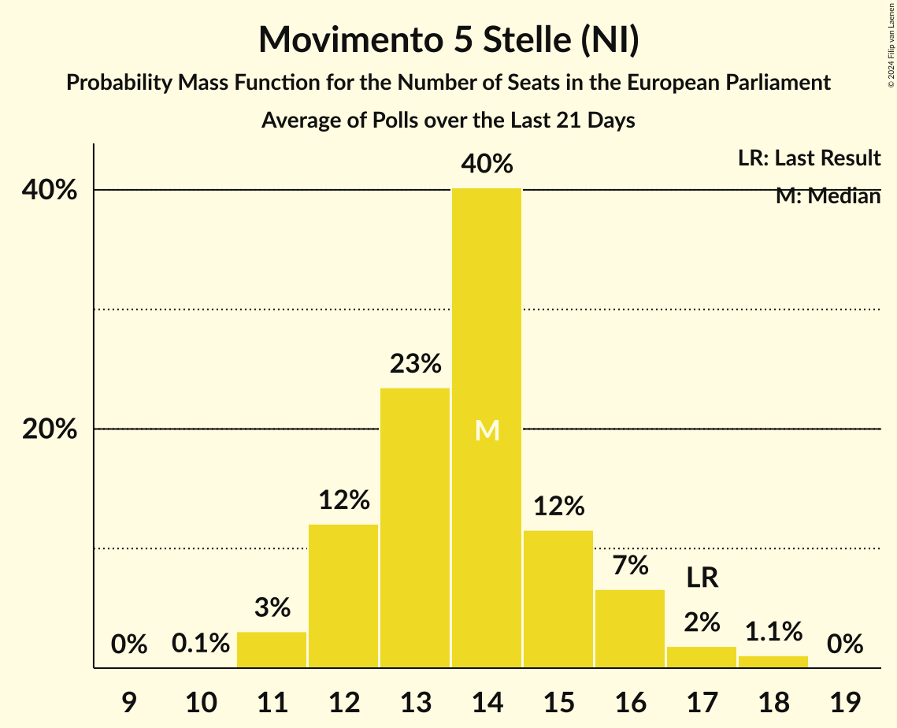

# Movimento 5 Stelle (NI)

<a href="#voting-intentions">Voting Intentions</a> | <a href="#seats">Seats</a>

## Voting Intentions

Last result: **21.2%** (General Election of 26 May 2019)

### Confidence Intervals

| Period     | Polling firm/Commissioner(s) | Median | 80% Confidence Interval | 90% Confidence Interval | 95% Confidence Interval | 99% Confidence Interval |
|:----------:|:----------------:|:-----------:|:-----------------------:|:-----------------------:|:-----------------------:|:-----------------------:|
| N/A | [Poll Average](average.html) | 16.7% | 14.9–18.8% | 14.4–19.4% | 14.0–20.0% | 13.2–21.0% |
| [1–20 November 2019](2019-11-20-EMG.html) | EMG   Rai 3 | 16.1% | 14.9–17.3% | 14.6–17.7% | 14.3–18.0% | 13.8–18.6% |
| [18–19 November 2019](2019-11-19-Ixè.html) | Ixè   Rai 3 | 16.3% | 14.9–17.9% | 14.5–18.3% | 14.1–18.7% | 13.5–19.5% |
| [13–18 November 2019](2019-11-18-SWG.html) | SWG   La7 | 16.2% | 15.0–17.5% | 14.7–17.8% | 14.4–18.2% | 13.9–18.8% |
| [14–15 November 2019](2019-11-15-Tecnè.html) | Tecnè   Agenzia Dire | 16.3% | 14.9–17.9% | 14.5–18.3% | 14.1–18.7% | 13.5–19.5% |
| [1–14 November 2019](2019-11-14-Index.html) | Index   La7 | 16.8% | 15.2–18.5% | 14.7–19.1% | 14.3–19.5% | 13.6–20.4% |
| [12–13 November 2019](2019-11-13-TermometroPolitico.html) | Termometro Politico   La7 | 16.1% | 15.1–17.1% | 14.8–17.4% | 14.6–17.7% | 14.2–18.2% |
| [8–13 November 2019](2019-11-13-EMG.html) | EMG   Rai 3 | 16.2% | N/A | N/A | N/A | N/A |
| [11–12 November 2019](2019-11-12-Ixè.html) | Ixè   Rai 3 | 16.3% | N/A | N/A | N/A | N/A |
| [10–12 November 2019](2019-11-12-Demopolis.html) | Demopolis   Rai 3 | 17.2% | 16.0–18.5% | 15.7–18.9% | 15.4–19.2% | 14.8–19.8% |
| [10–11 November 2019](2019-11-11-Tecnè.html) | Tecnè   Rete 4 | 16.9% | N/A | N/A | N/A | N/A |
| [6–11 November 2019](2019-11-11-SWG.html) | SWG   La7 | 15.8% | 14.6–17.1% | 14.3–17.4% | 14.0–17.7% | 13.5–18.4% |
| [1–11 November 2019](2019-11-11-Euromedia.html) | Euromedia   Rai 1 | 15.8% | 14.2–17.5% | 13.8–18.0% | 13.4–18.4% | 12.7–19.3% |
| [8–9 November 2019](2019-11-09-Piepoli.html) | Piepoli   Rai 2 | 17.4% | 15.4–19.8% | 14.8–20.4% | 14.4–21.0% | 13.4–22.1% |
| [7–8 November 2019](2019-11-08-Tecnè.html) | Tecnè   Agenzia Dire | 16.8% | 15.4–18.4% | 15.0–18.9% | 14.6–19.3% | 13.9–20.0% |
| [6–7 November 2019](2019-11-07-TermometroPolitico.html) | Termometro Politico   La7 | 15.8% | 14.8–16.8% | 14.6–17.1% | 14.3–17.3% | 13.9–17.8% |
| [7 November 2019](2019-11-07-Index.html) | Index   La7 | 17.4% | 15.7–19.2% | 15.3–19.7% | 14.9–20.2% | 14.2–21.1% |
| [6 November 2019](2019-11-06-EMG.html) | EMG   Rai 3 | 16.3% | 15.1–17.6% | 14.7–18.0% | 14.4–18.3% | 13.9–19.0% |
| [4–5 November 2019](2019-11-05-Ixè.html) | Ixè   Rai 3 | 17.9% | 16.4–19.5% | 16.0–20.0% | 15.6–20.4% | 15.0–21.2% |
| [4–5 November 2019](2019-11-05-IZI.html) | IZI | 17.9% | 16.4–19.6% | 16.0–20.0% | 15.7–20.4% | 15.0–21.2% |
| [30 October–4 November 2019](2019-11-04-SWG.html) | SWG   La7 | 16.8% | N/A | N/A | N/A | N/A |
| [1–4 November 2019](2019-11-04-Piepoli.html) | Piepoli   Rai 2 | 18.6% | 16.5–21.0% | 15.9–21.7% | 15.4–22.3% | 14.5–23.4% |
| [29–31 October 2019](2019-10-31-Ipsos.html) | Ipsos   Corriere della Sera | 17.9% | 16.4–19.5% | 16.0–20.0% | 15.6–20.4% | 15.0–21.2% |
| [31 October 2019](2019-10-31-Index.html) | Index   La7 | 17.8% | N/A | N/A | N/A | N/A |
| [30–31 October 2019](2019-10-31-Demopolis.html) | Demopolis   Rai 3 | 18.0% | 16.8–19.3% | 16.4–19.7% | 16.1–20.0% | 15.6–20.7% |
| [30 October 2019](2019-10-30-EMG.html) | EMG   Rai 3 | 16.8% | N/A | N/A | N/A | N/A |
| [28–29 October 2019](2019-10-29-Ixè.html) | Ixè   Rai 3 | 19.2% | N/A | N/A | N/A | N/A |
| [27 October 2019](2019-10-27-Tecnè.html) | Tecnè   Rete 4 | 17.7% | N/A | N/A | N/A | N/A |
| [23–27 October 2019](2019-10-27-SWG.html) | SWG   La7 | 18.2% | N/A | N/A | N/A | N/A |
| [24–25 October 2019](2019-10-25-Tecnè.html) | Tecnè   Agenzia Dire | 18.0% | 16.5–19.6% | 16.1–20.1% | 15.7–20.5% | 15.0–21.3% |
| [23–24 October 2019](2019-10-24-TermometroPolitico.html) | Termometro Politico   La7 | 17.1% | 16.1–18.1% | 15.8–18.4% | 15.6–18.7% | 15.1–19.2% |
| [22–24 October 2019](2019-10-24-ScenariPolitici–Winpoll.html) | Scenari Politici–Winpoll | 14.7% | 13.6–16.0% | 13.3–16.3% | 13.0–16.6% | 12.5–17.2% |
| [24 October 2019](2019-10-24-Index.html) | Index   La7 | 18.8% | 17.1–20.6% | 16.6–21.2% | 16.2–21.6% | 15.4–22.5% |
| [23 October 2019](2019-10-23-EMG.html) | EMG   Rai 3 | 17.5% | 16.3–18.8% | 16.0–19.1% | 15.7–19.4% | 15.1–20.1% |
| [22 October 2019](2019-10-22-NotoSondaggi.html) | Noto Sondaggi   Rai 1 | 18.5% | 17.0–20.2% | 16.6–20.6% | 16.2–21.0% | 15.5–21.8% |
| [21–22 October 2019](2019-10-22-Ixè.html) | Ixè   Rai 3 | 20.8% | 19.2–22.5% | 18.8–23.0% | 18.4–23.4% | 17.7–24.3% |
| [20–21 October 2019](2019-10-21-Tecnè.html) | Tecnè   Rete 4 | 18.5% | 17.0–20.2% | 16.6–20.6% | 16.2–21.0% | 15.5–21.8% |
| [16–21 October 2019](2019-10-21-SWG.html) | SWG   La7 | 17.8% | 16.6–19.1% | 16.2–19.5% | 15.9–19.8% | 15.4–20.5% |
| [17–18 October 2019](2019-10-18-Tecnè.html) | Tecnè   Agenzia Dire | 19.8% | 18.2–21.5% | 17.8–22.0% | 17.4–22.4% | 16.7–23.2% |
| [16–17 October 2019](2019-10-17-TermometroPolitico.html) | Termometro Politico   La7 | 17.7% | 16.5–19.0% | 16.2–19.3% | 15.9–19.6% | 15.3–20.3% |
| [17 October 2019](2019-10-17-Index.html) | Index   La7 | 19.0% | 17.3–20.9% | 16.8–21.4% | 16.4–21.9% | 15.7–22.8% |
| [16–17 October 2019](2019-10-17-Euromedia.html) | Euromedia   Rai 1 | 18.2% | 16.6–20.1% | 16.1–20.6% | 15.7–21.1% | 15.0–22.0% |
| [16–17 October 2019](2019-10-17-EMG.html) | EMG   Rai 3 | 19.2% | 18.0–20.6% | 17.6–21.0% | 17.3–21.3% | 16.8–21.9% |
| [14–15 October 2019](2019-10-15-Ixè.html) | Ixè   Rai 3 | 19.7% | 18.2–21.4% | 17.7–21.9% | 17.3–22.3% | 16.6–23.1% |
| [13–14 October 2019](2019-10-14-Tecnè.html) | Tecnè   Rete 4 | 19.8% | 18.2–21.5% | 17.8–22.0% | 17.4–22.4% | 16.7–23.2% |
| [9–14 October 2019](2019-10-14-SWG.html) | SWG   La7 | 18.6% | 17.4–20.0% | 17.0–20.3% | 16.7–20.7% | 16.1–21.3% |
| [10–11 October 2019](2019-10-11-Tecnè.html) | Tecnè   Agenzia Dire | 20.0% | 18.4–21.7% | 18.0–22.2% | 17.6–22.6% | 16.9–23.4% |
| [9–11 October 2019](2019-10-11-Demopolis.html) | Demopolis   Rai 3 | 20.0% | 18.4–21.7% | 18.0–22.2% | 17.6–22.6% | 16.9–23.4% |
| [9–10 October 2019](2019-10-10-TermometroPolitico.html) | Termometro Politico   La7 | 18.2% | 17.0–19.5% | 16.7–19.8% | 16.4–20.2% | 15.8–20.8% |
| [10 October 2019](2019-10-10-NotoSondaggi.html) | Noto Sondaggi   Rai 1 | 19.0% | 17.5–20.7% | 17.1–21.1% | 16.7–21.6% | 16.0–22.4% |
| [9 October 2019](2019-10-09-Index.html) | Index   La7 | 18.8% | 17.1–20.6% | 16.6–21.2% | 16.2–21.6% | 15.4–22.5% |
| [9 October 2019](2019-10-09-EMG.html) | EMG   Rai 3 | 18.7% | 17.5–20.0% | 17.2–20.4% | 16.9–20.7% | 16.3–21.3% |
| [7–9 October 2019](2019-10-09-BiDiMedia.html) | BiDiMedia | 19.2% | 17.9–20.6% | 17.5–21.0% | 17.2–21.3% | 16.6–22.0% |
| [7–8 October 2019](2019-10-08-Ixè.html) | Ixè   Rai 3 | 20.2% | 18.6–21.9% | 18.2–22.4% | 17.8–22.8% | 17.1–23.6% |
| [7–8 October 2019](2019-10-08-Euromedia.html) | Euromedia   Rai 1 | 19.2% | 17.5–21.1% | 17.1–21.7% | 16.7–22.1% | 15.9–23.1% |
| [6–7 October 2019](2019-10-07-Tecnè.html) | Tecnè   Rete 4 | 20.1% | 18.5–21.8% | 18.1–22.3% | 17.7–22.7% | 17.0–23.5% |
| [2–7 October 2019](2019-10-07-SWG.html) | SWG   La7 | 18.5% | 17.3–19.9% | 16.9–20.3% | 16.6–20.6% | 16.1–21.2% |
| [7 October 2019](2019-10-07-Ipsos.html) | Ipsos   La7 | 19.7% | 17.7–21.9% | 17.1–22.5% | 16.7–23.0% | 15.8–24.1% |
| [3–5 October 2019](2019-10-05-Piepoli.html) | Piepoli   Rai 1 | 19.6% | 17.5–22.0% | 16.9–22.7% | 16.4–23.3% | 15.4–24.5% |
| [3–4 October 2019](2019-10-04-Tecnè.html) | Tecnè   Agenzia Dire | 19.8% | 18.2–21.5% | 17.8–22.0% | 17.4–22.4% | 16.7–23.2% |
| [3 October 2019](2019-10-03-Index.html) | Index   La7 | 19.4% | 17.7–21.3% | 17.2–21.8% | 16.8–22.3% | 16.0–23.2% |
| [1–3 October 2019](2019-10-03-DemosPi.html) | Demos & Pi   La Repubblica | 20.6% | 19.2–22.2% | 18.8–22.6% | 18.5–23.0% | 17.8–23.7% |
| [2 October 2019](2019-10-02-EMG.html) | EMG   Rai 3 | 19.0% | 17.8–20.2% | 17.5–20.6% | 17.2–20.9% | 16.7–21.5% |
| [30 September–1 October 2019](2019-10-01-Ixè.html) | Ixè   Rai 3 | 21.0% | 19.4–22.7% | 19.0–23.2% | 18.6–23.6% | 17.8–24.5% |
| [29–30 September 2019](2019-09-30-Tecnè.html) | Tecnè   Rete 4 | 20.2% | 18.6–21.9% | 18.2–22.4% | 17.8–22.8% | 17.1–23.6% |
| [25–30 September 2019](2019-09-30-SWG.html) | SWG   La7 | 19.6% | 18.3–21.0% | 18.0–21.4% | 17.7–21.7% | 17.1–22.4% |
| [20–27 September 2019](2019-09-27-Tecnè.html) | Tecnè   Agenzia Dire | 20.0% | 18.3–21.9% | 17.8–22.5% | 17.4–22.9% | 16.6–23.9% |
| [23–27 September 2019](2019-09-27-GPF.html) | GPF   La Notizia | 24.2% | 22.3–26.2% | 21.8–26.7% | 21.3–27.2% | 20.5–28.2% |
| [25–26 September 2019](2019-09-26-TermometroPolitico.html) | Termometro Politico   La7 | 17.4% | 16.4–18.4% | 16.2–18.7% | 15.9–19.0% | 15.5–19.5% |
| [25–26 September 2019](2019-09-26-Ipsos.html) | Ipsos   Corriere della Sera | 20.8% | 19.2–22.5% | 18.8–23.0% | 18.4–23.4% | 17.7–24.3% |
| [1–25 September 2019](2019-09-25-NotoSondaggi.html) | Noto Sondaggi | 19.5% | 18.0–21.2% | 17.5–21.7% | 17.2–22.1% | 16.4–22.9% |
| [25 September 2019](2019-09-25-EMG.html) | EMG   Rai 3 | 18.7% | 17.6–20.0% | 17.2–20.3% | 17.0–20.6% | 16.4–21.2% |
| [23–24 September 2019](2019-09-24-Ixè.html) | Ixè   Rai 3 | 21.5% | 19.9–23.2% | 19.4–23.7% | 19.1–24.2% | 18.3–25.0% |
| [22–23 September 2019](2019-09-23-Tecnè.html) | Tecnè   Rete 4 | 20.4% | 18.8–22.1% | 18.4–22.6% | 18.0–23.0% | 17.3–23.9% |
| [18–23 September 2019](2019-09-23-SWG.html) | SWG   La7 | 20.0% | 18.7–21.4% | 18.4–21.8% | 18.0–22.1% | 17.5–22.8% |
| [20–22 September 2019](2019-09-22-Piepoli.html) | Piepoli   Rai 1 | 19.0% | 16.9–21.4% | 16.3–22.1% | 15.8–22.7% | 14.9–23.9% |
| [19–20 September 2019](2019-09-20-Tecnè.html) | Tecnè | 20.4% | 18.6–22.3% | 18.1–22.8% | 17.7–23.3% | 16.9–24.2% |
| [18–20 September 2019](2019-09-20-ScenariPolitici–Winpoll.html) | Scenari Politici–Winpoll   Il Sole 24 Ore | 15.1% | 13.9–16.3% | 13.6–16.7% | 13.3–17.0% | 12.8–17.6% |
| [18–20 September 2019](2019-09-20-Quorum–YouTrend.html) | Quorum – YouTrend   Sky Tg24 | 18.0% | 16.5–19.6% | 16.1–20.1% | 15.7–20.5% | 15.0–21.3% |
| [20 September 2019](2019-09-20-IZI.html) | IZI | 22.5% | 20.9–24.3% | 20.4–24.8% | 20.0–25.2% | 19.3–26.1% |
| [17–19 September 2019](2019-09-19-TermometroPolitico.html) | Termometro Politico   La7 | 18.6% | 17.6–19.8% | 17.3–20.1% | 17.0–20.4% | 16.5–21.0% |
| [18–19 September 2019](2019-09-19-Tecnè.html) | Tecnè   Rete 4 | 20.5% | 18.9–22.2% | 18.5–22.7% | 18.1–23.1% | 17.4–24.0% |
| [1–19 September 2019](2019-09-19-IndexResearch.html) | Index Research   La7 | 19.8% | 18.0–21.7% | 17.5–22.2% | 17.1–22.7% | 16.3–23.6% |
| [18–19 September 2019](2019-09-19-Demopolis.html) | Demopolis   Rai 3 | 20.5% | 19.2–21.9% | 18.8–22.3% | 18.5–22.6% | 17.9–23.3% |
| [17–18 September 2019](2019-09-18-Euromedia.html) | Euromedia   Rai 1 | 19.2% | 17.5–21.1% | 17.1–21.7% | 16.7–22.1% | 15.9–23.1% |
| [14–18 September 2019](2019-09-18-BiDiMedia.html) | BiDiMedia | 19.7% | 18.4–21.0% | 18.1–21.4% | 17.8–21.8% | 17.2–22.4% |
| [16–17 September 2019](2019-09-17-Ixè.html) | Ixè   Rai 3 | 21.9% | 20.3–23.7% | 19.8–24.1% | 19.4–24.6% | 18.7–25.4% |
| [17 September 2019](2019-09-17-EMG.html) | EMG   Rai 3 | 18.3% | 17.1–19.5% | 16.8–19.8% | 16.6–20.1% | 16.0–20.7% |
| [15–16 September 2019](2019-09-16-Tecnè.html) | Tecnè   Rete 4 | 20.7% | 19.1–22.4% | 18.7–22.9% | 18.3–23.3% | 17.6–24.2% |
| [11–16 September 2019](2019-09-16-SWG.html) | SWG   La7 | 20.5% | 19.2–21.9% | 18.8–22.3% | 18.5–22.6% | 17.9–23.3% |
| [11–12 September 2019](2019-09-12-TermometroPolitico.html) | Termometro Politico   La7 | 19.8% | 18.9–20.8% | 18.6–21.0% | 18.4–21.3% | 18.0–21.7% |
| [12 September 2019](2019-09-12-Tecnè.html) | Tecnè   Rete 4 | 21.1% | 19.4–23.1% | 18.9–23.6% | 18.4–24.1% | 17.6–25.1% |
| [9–12 September 2019](2019-09-12-ScenariPolitici–Winpoll.html) | Scenari Politici–Winpoll   Il Sole 24 Ore | 15.5% | 14.4–16.8% | 14.1–17.1% | 13.8–17.5% | 13.2–18.1% |
| [10–12 September 2019](2019-09-12-DemosPi.html) | Demos & Pi   La Repubblica | 20.8% | 19.2–22.5% | 18.8–23.0% | 18.4–23.4% | 17.6–24.2% |
| [9–10 September 2019](2019-09-10-NotoSondaggi.html) | Noto Sondaggi | 19.0% | 17.5–20.7% | 17.1–21.1% | 16.7–21.6% | 16.0–22.4% |
| [9–10 September 2019](2019-09-10-Ixè.html) | Ixè   Rai 3 | 22.0% | 20.4–23.7% | 19.9–24.2% | 19.5–24.7% | 18.8–25.5% |
| [9–10 September 2019](2019-09-10-Euromedia.html) | Euromedia | 19.8% | 18.0–21.7% | 17.5–22.2% | 17.1–22.7% | 16.3–23.6% |
| [10 September 2019](2019-09-10-EMG.html) | EMG   Rai 3 | 19.5% | 18.4–20.7% | 18.0–21.1% | 17.8–21.4% | 17.2–22.0% |
| [9–10 September 2019](2019-09-10-Demopolis.html) | Demopolis   Rai 3 | 21.8% | 20.5–23.2% | 20.1–23.6% | 19.8–24.0% | 19.2–24.7% |
| [4–9 September 2019](2019-09-09-SWG.html) | SWG   La7 | 21.0% | 19.7–22.4% | 19.3–22.8% | 19.0–23.1% | 18.4–23.8% |
| [7–9 September 2019](2019-09-09-Piepoli.html) | Piepoli   Rai 1 | 20.6% | 18.4–23.1% | 17.8–23.8% | 17.3–24.4% | 16.3–25.6% |
| [1–6 September 2019](2019-09-06-NotoSondaggi.html) | Noto Sondaggi   Quotidiano Nazionale | 20.0% | 18.4–21.7% | 18.0–22.2% | 17.6–22.6% | 16.9–23.4% |
| [5 September 2019](2019-09-05-Tecnè.html) | Tecnè   Rete 4 | 21.7% | 20.1–23.4% | 19.6–23.9% | 19.3–24.4% | 18.5–25.2% |
| [4–5 September 2019](2019-09-05-GPF.html) | GPF   La Notizia | 24.3% | 22.6–26.0% | 22.1–26.6% | 21.7–27.0% | 20.9–27.9% |
| [4–5 September 2019](2019-09-05-Demopolis.html) | Demopolis   Rai 3 | 22.0% | 20.7–23.4% | 20.3–23.8% | 20.0–24.2% | 19.3–24.9% |
| [2–3 September 2019](2019-09-03-Ixè.html) | Ixè   Rai 3 | 22.3% | 20.7–24.1% | 20.2–24.6% | 19.8–25.0% | 19.1–25.8% |
| [31 August–2 September 2019](2019-09-02-Tecnè.html) | Tecnè   Rete 4 | 21.5% | 19.9–23.2% | 19.4–23.7% | 19.1–24.2% | 18.3–25.0% |
| [29 August–2 September 2019](2019-09-02-SWG.html) | SWG   La7 | 21.6% | 20.3–23.0% | 19.9–23.4% | 19.6–23.8% | 19.0–24.4% |
| [29–30 August 2019](2019-08-30-Quorum–YouTrend.html) | Quorum – YouTrend   Sky Tg24 | 18.6% | 17.1–20.3% | 16.7–20.7% | 16.3–21.1% | 15.6–21.9% |
| [26–29 August 2019](2019-08-29-Ipsos.html) | Ipsos   Corriere della Sera | 24.2% | 22.6–26.1% | 22.1–26.6% | 21.7–27.0% | 20.9–27.9% |
| [24–28 August 2019](2019-08-28-BiDiMedia.html) | BiDiMedia | 19.2% | 18.0–20.5% | 17.7–20.8% | 17.4–21.2% | 16.8–21.8% |
| [27 August 2019](2019-08-27-Piepoli.html) | Piepoli   La Stampa | 16.4% | 14.5–18.7% | 13.9–19.4% | 13.5–19.9% | 12.6–21.1% |
| [23–25 August 2019](2019-08-25-Demopolis.html) | Demopolis | 19.0% | 18.1–19.9% | 17.8–20.2% | 17.6–20.4% | 17.2–20.9% |
| [21–23 August 2019](2019-08-23-TermometroPolitico.html) | Termometro Politico   La7 | 17.8% | 16.9–18.7% | 16.7–19.0% | 16.5–19.2% | 16.0–19.7% |
| [21–23 August 2019](2019-08-23-ScenariPolitici–Winpoll.html) | Scenari Politici–Winpoll   Il Sole 24 Ore | 16.8% | 15.6–18.1% | 15.3–18.5% | 15.0–18.8% | 14.4–19.4% |
| [21 August 2019](2019-08-21-Tecnè.html) | Tecnè | 20.8% | 19.2–22.5% | 18.8–23.0% | 18.4–23.4% | 17.7–24.3% |
| [21 August 2019](2019-08-21-IZI.html) | IZI | 16.0% | 14.6–17.5% | 14.2–18.0% | 13.8–18.4% | 13.2–19.1% |
| [20–21 August 2019](2019-08-21-GPF.html) | GPF | 23.2% | 21.1–25.5% | 20.5–26.1% | 20.0–26.7% | 19.0–27.8% |
| [12 August 2019](2019-08-12-GPF.html) | GPF | 23.7% | 21.8–25.7% | 21.3–26.3% | 20.9–26.8% | 20.0–27.7% |
| [9–10 August 2019](2019-08-10-TermometroPolitico.html) | Termometro Politico   La7 | 18.2% | 17.2–19.2% | 17.0–19.5% | 16.7–19.8% | 16.3–20.3% |
| [1–9 August 2019](2019-08-09-NotoSondaggi.html) | Noto Sondaggi | 16.5% | 15.1–18.1% | 14.7–18.5% | 14.3–18.9% | 13.7–19.7% |
| [5 August 2019](2019-08-05-Tecnè.html) | Tecnè   Dire | 17.5% | 16.0–19.1% | 15.6–19.6% | 15.3–20.0% | 14.6–20.8% |
| [29 July–2 August 2019](2019-08-02-TermometroPolitico.html) | Termometro Politico | 17.0% | 15.9–18.2% | 15.6–18.6% | 15.3–18.9% | 14.8–19.5% |
| [30 July–1 August 2019](2019-08-01-Tecnè.html) | Tecnè   Dire | 17.6% | 16.1–19.2% | 15.7–19.7% | 15.4–20.1% | 14.7–20.9% |
| [30–31 July 2019](2019-07-31-Ipsos.html) | Ipsos   Corriere della Sera | 17.8% | 16.3–19.4% | 15.9–19.9% | 15.5–20.3% | 14.9–21.1% |
| [27–30 July 2019](2019-07-30-ScenariPolitici–Winpoll.html) | Scenari Politici–Winpoll   Il Sole 24 Ore | 14.8% | 13.7–16.0% | 13.4–16.4% | 13.1–16.7% | 12.6–17.3% |
| [24–29 July 2019](2019-07-29-SWG.html) | SWG   La7 | 17.3% | 16.1–18.6% | 15.8–19.0% | 15.5–19.3% | 14.9–20.0% |
| [24–25 July 2019](2019-07-25-Tecnè.html) | Tecnè   Dire | 17.5% | 16.0–19.1% | 15.6–19.6% | 15.3–20.0% | 14.6–20.8% |
| [22–24 July 2019](2019-07-24-Demopolis.html) | Demopolis   La7 | 18.0% | 16.8–19.3% | 16.4–19.7% | 16.1–20.0% | 15.6–20.7% |
| [17–22 July 2019](2019-07-22-SWG.html) | SWG   La7 | 18.5% | 17.3–19.9% | 16.9–20.3% | 16.6–20.6% | 16.1–21.2% |
| [22 July 2019](2019-07-22-Euromedia.html) | Euromedia | 18.0% | 16.5–19.6% | 16.1–20.1% | 15.7–20.5% | 15.0–21.3% |
| [16–18 July 2019](2019-07-18-TermometroPolitico.html) | Termometro Politico | 17.1% | 15.8–18.4% | 15.5–18.8% | 15.2–19.1% | 14.6–19.8% |
| [17–18 July 2019](2019-07-18-Tecnè.html) | Tecnè   Rete 4 | 17.3% | 15.8–18.9% | 15.4–19.4% | 15.1–19.8% | 14.4–20.6% |
| [16–18 July 2019](2019-07-18-Ipsos.html) | Ipsos   Corriere della Sera | 17.4% | 15.9–19.0% | 15.5–19.5% | 15.2–19.9% | 14.5–20.7% |
| [15–18 July 2019](2019-07-18-GPF.html) | GPF   La Notizia | 24.2% | 22.4–26.0% | 21.9–26.6% | 21.5–27.0% | 20.7–28.0% |
| [10–15 July 2019](2019-07-15-SWG.html) | SWG   LA7 | 17.9% | 16.6–19.2% | 16.3–19.6% | 16.0–19.9% | 15.4–20.5% |
| [15 July 2019](2019-07-15-Piepoli.html) | Piepoli   Rai 1 | 17.6% | 15.6–20.0% | 15.0–20.6% | 14.5–21.2% | 13.6–22.4% |
| [9–12 July 2019](2019-07-12-TermometroPolitico.html) | Termometro Politico | 17.1% | 15.8–18.5% | 15.4–18.9% | 15.1–19.2% | 14.5–19.9% |
| [10–11 July 2019](2019-07-11-Tecnè.html) | Tecnè   Rete 4 | 17.2% | 15.7–18.8% | 15.3–19.3% | 15.0–19.7% | 14.3–20.5% |
| [8–10 July 2019](2019-07-10-GPF.html) | GPF   Rete 4 | 23.8% | 21.9–25.8% | 21.4–26.4% | 21.0–26.9% | 20.1–27.8% |
| [8–10 July 2019](2019-07-10-DemosPi.html) | Demos & Pi | 17.6% | 16.1–19.2% | 15.7–19.7% | 15.4–20.1% | 14.7–20.9% |
| [7–8 July 2019](2019-07-08-Tecnè.html) | Tecnè   Rete 4 | 16.9% | 15.5–18.5% | 15.0–19.0% | 14.7–19.4% | 14.0–20.1% |
| [3–8 July 2019](2019-07-08-SWG.html) | SWG   La7 | 17.4% | 16.2–18.7% | 15.9–19.1% | 15.6–19.4% | 15.0–20.1% |
| [5 July 2019](2019-07-05-NotoSondaggi.html) | Noto Sondaggi   Quotidiano Nazionale | 16.9% | 15.5–18.5% | 15.0–19.0% | 14.7–19.4% | 14.0–20.1% |
| [1–4 July 2019](2019-07-04-TermometroPolitico.html) | Termometro Politico   La7 | 18.0% | 16.8–19.3% | 16.5–19.6% | 16.2–19.9% | 15.7–20.5% |
| [29 June–4 July 2019](2019-07-04-BiDiMedia.html) | BiDiMedia | 18.1% | 16.9–19.3% | 16.6–19.7% | 16.3–20.0% | 15.8–20.6% |
| [26 June–1 July 2019](2019-07-01-SWG.html) | SWG   La7 | 17.2% | 16.0–18.5% | 15.7–18.9% | 15.4–19.2% | 14.8–19.8% |
| [27 June 2019](2019-06-27-EMG.html) | EMG   Rai 3 | 18.6% | 17.5–19.9% | 17.2–20.2% | 16.9–20.5% | 16.4–21.1% |
| [1–26 June 2019](2019-06-26-NotoSondaggi.html) | Noto Sondaggi   Rai 3 | 17.4% | 15.9–19.0% | 15.5–19.5% | 15.2–19.9% | 14.5–20.7% |
| [25–26 June 2019](2019-06-26-Ipsos.html) | Ipsos   Corriere della Sera | 17.5% | 16.0–19.1% | 15.6–19.6% | 15.3–20.0% | 14.6–20.8% |
| [23–24 June 2019](2019-06-24-Tecnè.html) | Tecnè   Rete 4 | 17.0% | 15.5–18.6% | 15.1–19.1% | 14.8–19.5% | 14.1–20.3% |
| [19–24 June 2019](2019-06-24-SWG.html) | SWG   La7 | 18.0% | 16.8–19.3% | 16.4–19.7% | 16.1–20.0% | 15.6–20.7% |
| [19–20 June 2019](2019-06-20-Demopolis.html) | Demopolis   La7 | 18.5% | 17.3–19.9% | 16.9–20.3% | 16.6–20.6% | 16.1–21.2% |
| [1–18 June 2019](2019-06-18-NotoSondaggi.html) | Noto Sondaggi   Rai 3 | 17.5% | 16.0–19.1% | 15.6–19.6% | 15.3–20.0% | 14.6–20.8% |
| [18 June 2019](2019-06-18-EMG.html) | EMG   Rai 3 | 17.9% | 16.8–19.1% | 16.5–19.4% | 16.2–19.8% | 15.7–20.3% |
| [12–17 June 2019](2019-06-17-SWG.html) | SWG   LA7 | 18.3% | 17.1–19.7% | 16.8–20.0% | 16.4–20.4% | 15.9–21.0% |
| [13 June 2019](2019-06-13-IndexResearch.html) | Index Research   LA7 | 19.4% | 17.7–21.3% | 17.2–21.8% | 16.8–22.3% | 16.0–23.2% |
| [11 June 2019](2019-06-11-EMG.html) | EMG   Rai 3 | 18.0% | 16.8–19.2% | 16.5–19.6% | 16.2–19.9% | 15.7–20.5% |
| [9–10 June 2019](2019-06-10-Tecnè.html) | Tecnè   Rete 4 | 16.9% | 15.5–18.5% | 15.0–19.0% | 14.7–19.4% | 14.0–20.1% |
| [5–10 June 2019](2019-06-10-SWG.html) | SWG   La7 | 18.4% | 17.2–19.7% | 16.8–20.1% | 16.5–20.5% | 15.9–21.1% |
| [10 June 2019](2019-06-10-Piepoli.html) | Piepoli   Rai 1 | 17.0% | 15.0–19.3% | 14.5–20.0% | 14.0–20.6% | 13.1–21.7% |
| [1–10 June 2019](2019-06-10-NotoSondaggi.html) | Noto Sondaggi   Rai 3 | 18.0% | 16.5–19.6% | 16.1–20.1% | 15.7–20.5% | 15.0–21.3% |
| [10 June 2019](2019-06-10-Euromedia.html) | Euromedia   Rai 1 | 18.0% | 16.4–19.8% | 15.9–20.4% | 15.5–20.8% | 14.7–21.7% |
| [1–7 June 2019](2019-06-07-IndexResearch.html) | Index Research   La7 | 18.9% | 17.2–20.7% | 16.7–21.3% | 16.3–21.7% | 15.5–22.7% |
| [2–3 June 2019](2019-06-03-Tecnè.html) | Tecnè   Rete 4 | 16.8% | 15.4–18.4% | 15.0–18.9% | 14.6–19.3% | 13.9–20.0% |
| [29 May–3 June 2019](2019-06-03-SWG.html) | SWG   LA7 | 17.5% | 16.3–18.9% | 16.0–19.2% | 15.7–19.6% | 15.1–20.2% |
| [1 June 2019](2019-06-01-EMG.html) | EMG   Affari Internazionali | 19.1% | 17.9–20.4% | 17.6–20.8% | 17.3–21.1% | 16.7–21.8% |
| [30 May 2019](2019-05-30-Piepoli.html) | Piepoli   Rai 1 | 17.0% | 15.5–18.6% | 15.1–19.1% | 14.8–19.5% | 14.1–20.3% |
| [28–29 May 2019](2019-05-29-ScenariPolitici–Winpoll.html) | Scenari Politici–Winpoll | 16.5% | 15.3–17.8% | 15.0–18.2% | 14.7–18.5% | 14.2–19.1% |

### Probability Mass Function

The following table shows the probability mass function per percentage block of voting intentions for the [poll average](average.html) for Movimento 5 Stelle (NI).

| Voting Intentions | Probability | Accumulated | Special Marks |
|:-----------------:|:-----------:|:-----------:|:-------------:|
| 10.5–11.5% | 0% | 100% |  |
| 11.5–12.5% | 0.1% | 100% |  |
| 12.5–13.5% | 1.1% | 99.9% |  |
| 13.5–14.5% | 5% | 98.9% |  |
| 14.5–15.5% | 15% | 93% |  |
| 15.5–16.5% | 25% | 78% |  |
| 16.5–17.5% | 24% | 53% | Median |
| 17.5–18.5% | 16% | 29% |  |
| 18.5–19.5% | 9% | 13% |  |
| 19.5–20.5% | 3% | 4% |  |
| 20.5–21.5% | 0.9% | 1.1% | Last Result |
| 21.5–22.5% | 0.2% | 0.2% |  |
| 22.5–23.5% | 0% | 0% |  |

## Seats

Last result: **17** seats (General Election of 26 May 2019)

### Confidence Intervals

| Period     | Polling firm/Commissioner(s) | Median | 80% Confidence Interval | 90% Confidence Interval | 95% Confidence Interval | 99% Confidence Interval |
|:----------:|:----------------:|:------:|:-----------------------:|:-----------------------:|:-----------------------:|:-----------------------:|
| N/A | [Poll Average](average.html) | 13 | 11–15 | 11–15 | 11–16 | 10–16 |
| [1–20 November 2019](2019-11-20-EMG.html) | EMG   Rai 3 | 13 | 12–14 | 12–14 | 11–15 | 11–15 |
| [18–19 November 2019](2019-11-19-Ixè.html) | Ixè   Rai 3 | 13 | 12–14 | 12–14 | 12–14 | 11–15 |
| [13–18 November 2019](2019-11-18-SWG.html) | SWG   La7 | 13 | 12–14 | 12–14 | 12–15 | 11–15 |
| [14–15 November 2019](2019-11-15-Tecnè.html) | Tecnè   Agenzia Dire | 13 | 12–14 | 12–15 | 11–15 | 11–16 |
| [1–14 November 2019](2019-11-14-Index.html) | Index   La7 | 12 | 11–14 | 11–14 | 11–15 | 10–16 |
| [12–13 November 2019](2019-11-13-TermometroPolitico.html) | Termometro Politico   La7 | 12 | 12–13 | 12–14 | 11–14 | 11–14 |
| [8–13 November 2019](2019-11-13-EMG.html) | EMG   Rai 3 |  |  |  |  |  |
| [11–12 November 2019](2019-11-12-Ixè.html) | Ixè   Rai 3 |  |  |  |  |  |
| [10–12 November 2019](2019-11-12-Demopolis.html) | Demopolis   Rai 3 | 13 | 12–14 | 12–14 | 12–14 | 11–15 |
| [10–11 November 2019](2019-11-11-Tecnè.html) | Tecnè   Rete 4 |  |  |  |  |  |
| [6–11 November 2019](2019-11-11-SWG.html) | SWG   La7 | 13 | 12–13 | 12–14 | 11–14 | 11–14 |
| [1–11 November 2019](2019-11-11-Euromedia.html) | Euromedia   Rai 1 | 12 | 11–13 | 11–13 | 11–13 | 11–14 |
| [8–9 November 2019](2019-11-09-Piepoli.html) | Piepoli   Rai 2 | 14 | 12–15 | 12–16 | 11–16 | 11–17 |
| [7–8 November 2019](2019-11-08-Tecnè.html) | Tecnè   Agenzia Dire | 13 | 13–15 | 12–15 | 12–15 | 11–16 |
| [6–7 November 2019](2019-11-07-TermometroPolitico.html) | Termometro Politico   La7 | 13 | 12–13 | 12–13 | 11–13 | 11–14 |
| [7 November 2019](2019-11-07-Index.html) | Index   La7 | 14 | 12–15 | 12–16 | 12–16 | 11–16 |
| [6 November 2019](2019-11-06-EMG.html) | EMG   Rai 3 | 13 | 12–14 | 11–14 | 11–14 | 11–15 |
| [4–5 November 2019](2019-11-05-Ixè.html) | Ixè   Rai 3 | 15 | 13–16 | 13–17 | 13–17 | 12–17 |
| [4–5 November 2019](2019-11-05-IZI.html) | IZI | 13 | 12–15 | 12–15 | 12–15 | 11–16 |
| [30 October–4 November 2019](2019-11-04-SWG.html) | SWG   La7 |  |  |  |  |  |
| [1–4 November 2019](2019-11-04-Piepoli.html) | Piepoli   Rai 2 | 15 | 13–17 | 12–17 | 12–17 | 11–18 |
| [29–31 October 2019](2019-10-31-Ipsos.html) | Ipsos   Corriere della Sera | 14 | 13–15 | 13–16 | 12–16 | 12–16 |
| [31 October 2019](2019-10-31-Index.html) | Index   La7 |  |  |  |  |  |
| [30–31 October 2019](2019-10-31-Demopolis.html) | Demopolis   Rai 3 | 14 | 13–14 | 12–15 | 12–15 | 12–15 |
| [30 October 2019](2019-10-30-EMG.html) | EMG   Rai 3 |  |  |  |  |  |
| [28–29 October 2019](2019-10-29-Ixè.html) | Ixè   Rai 3 |  |  |  |  |  |
| [27 October 2019](2019-10-27-Tecnè.html) | Tecnè   Rete 4 |  |  |  |  |  |
| [23–27 October 2019](2019-10-27-SWG.html) | SWG   La7 |  |  |  |  |  |
| [24–25 October 2019](2019-10-25-Tecnè.html) | Tecnè   Agenzia Dire | 14 | 13–16 | 13–16 | 13–17 | 12–17 |
| [23–24 October 2019](2019-10-24-TermometroPolitico.html) | Termometro Politico   La7 | 13 | 13–14 | 12–14 | 12–15 | 12–15 |
| [22–24 October 2019](2019-10-24-ScenariPolitici–Winpoll.html) | Scenari Politici–Winpoll | 11 | 10–12 | 10–12 | 10–13 | 9–13 |
| [24 October 2019](2019-10-24-Index.html) | Index   La7 | 15 | 14–16 | 13–17 | 13–17 | 12–18 |
| [23 October 2019](2019-10-23-EMG.html) | EMG   Rai 3 | 14 | 13–15 | 12–15 | 12–15 | 12–16 |
| [22 October 2019](2019-10-22-NotoSondaggi.html) | Noto Sondaggi   Rai 1 | 14 | 13–16 | 13–16 | 12–17 | 12–17 |
| [21–22 October 2019](2019-10-22-Ixè.html) | Ixè   Rai 3 | 17 | 16–19 | 15–19 | 15–19 | 14–20 |
| [20–21 October 2019](2019-10-21-Tecnè.html) | Tecnè   Rete 4 | 15 | 14–15 | 13–15 | 13–16 | 12–17 |
| [16–21 October 2019](2019-10-21-SWG.html) | SWG   La7 | 15 | 14–15 | 13–16 | 13–16 | 13–16 |
| [17–18 October 2019](2019-10-18-Tecnè.html) | Tecnè   Agenzia Dire | 16 | 15–17 | 14–18 | 14–18 | 13–19 |
| [16–17 October 2019](2019-10-17-TermometroPolitico.html) | Termometro Politico   La7 | 14 | 13–15 | 13–15 | 12–16 | 12–16 |
| [17 October 2019](2019-10-17-Index.html) | Index   La7 | 15 | 14–17 | 13–17 | 13–17 | 12–18 |
| [16–17 October 2019](2019-10-17-Euromedia.html) | Euromedia   Rai 1 | 15 | 13–16 | 12–16 | 12–16 | 11–17 |
| [16–17 October 2019](2019-10-17-EMG.html) | EMG   Rai 3 | 15 | 14–16 | 14–16 | 14–17 | 13–17 |
| [14–15 October 2019](2019-10-15-Ixè.html) | Ixè   Rai 3 | 16 | 15–17 | 14–18 | 14–18 | 14–19 |
| [13–14 October 2019](2019-10-14-Tecnè.html) | Tecnè   Rete 4 | 16 | 14–17 | 14–18 | 14–18 | 13–19 |
| [9–14 October 2019](2019-10-14-SWG.html) | SWG   La7 | 15 | 14–16 | 13–16 | 13–17 | 13–17 |
| [10–11 October 2019](2019-10-11-Tecnè.html) | Tecnè   Agenzia Dire | 16 | 15–18 | 15–18 | 14–18 | 13–19 |
| [9–11 October 2019](2019-10-11-Demopolis.html) | Demopolis   Rai 3 | 15 | 14–16 | 13–17 | 13–17 | 13–18 |
| [9–10 October 2019](2019-10-10-TermometroPolitico.html) | Termometro Politico   La7 | 14 | 13–16 | 13–16 | 13–16 | 12–16 |
| [10 October 2019](2019-10-10-NotoSondaggi.html) | Noto Sondaggi   Rai 1 | 15 | 13–16 | 13–16 | 13–17 | 12–17 |
| [9 October 2019](2019-10-09-Index.html) | Index   La7 | 14 | 13–16 | 13–16 | 13–17 | 12–18 |
| [9 October 2019](2019-10-09-EMG.html) | EMG   Rai 3 | 15 | 14–16 | 13–16 | 13–16 | 13–17 |
| [7–9 October 2019](2019-10-09-BiDiMedia.html) | BiDiMedia | 15 | 14–16 | 14–16 | 13–17 | 13–17 |
| [7–8 October 2019](2019-10-08-Ixè.html) | Ixè   Rai 3 | 16 | 15–18 | 15–19 | 14–19 | 14–20 |
| [7–8 October 2019](2019-10-08-Euromedia.html) | Euromedia   Rai 1 | 15 | 13–16 | 13–17 | 13–17 | 12–18 |
| [6–7 October 2019](2019-10-07-Tecnè.html) | Tecnè   Rete 4 | 17 | 15–18 | 15–18 | 14–18 | 14–19 |
| [2–7 October 2019](2019-10-07-SWG.html) | SWG   La7 | 15 | 14–16 | 14–17 | 13–17 | 13–17 |
| [7 October 2019](2019-10-07-Ipsos.html) | Ipsos   La7 | 15 | 13–17 | 13–17 | 13–18 | 12–19 |
| [3–5 October 2019](2019-10-05-Piepoli.html) | Piepoli   Rai 1 | 16 | 14–18 | 13–18 | 13–19 | 12–20 |
| [3–4 October 2019](2019-10-04-Tecnè.html) | Tecnè   Agenzia Dire | 16 | 14–17 | 14–18 | 14–19 | 13–19 |
| [3 October 2019](2019-10-03-Index.html) | Index   La7 | 16 | 14–17 | 14–18 | 13–18 | 13–19 |
| [1–3 October 2019](2019-10-03-DemosPi.html) | Demos & Pi   La Repubblica | 17 | 15–18 | 15–18 | 15–19 | 14–19 |
| [2 October 2019](2019-10-02-EMG.html) | EMG   Rai 3 | 15 | 14–16 | 14–17 | 14–17 | 13–18 |
| [30 September–1 October 2019](2019-10-01-Ixè.html) | Ixè   Rai 3 | 17 | 16–18 | 15–19 | 15–20 | 14–20 |
| [29–30 September 2019](2019-09-30-Tecnè.html) | Tecnè   Rete 4 | 16 | 15–18 | 15–18 | 14–18 | 14–19 |
| [25–30 September 2019](2019-09-30-SWG.html) | SWG   La7 | 16 | 15–17 | 15–17 | 14–18 | 13–18 |
| [20–27 September 2019](2019-09-27-Tecnè.html) | Tecnè   Agenzia Dire | 16 | 14–18 | 14–18 | 14–18 | 13–20 |
| [23–27 September 2019](2019-09-27-GPF.html) | GPF   La Notizia | 19 | 17–20 | 17–21 | 16–22 | 16–22 |
| [25–26 September 2019](2019-09-26-TermometroPolitico.html) | Termometro Politico   La7 | 14 | 13–14 | 12–15 | 12–15 | 12–16 |
| [25–26 September 2019](2019-09-26-Ipsos.html) | Ipsos   Corriere della Sera | 16 | 15–18 | 15–18 | 14–18 | 14–19 |
| [1–25 September 2019](2019-09-25-NotoSondaggi.html) | Noto Sondaggi | 16 | 15–17 | 14–17 | 14–18 | 13–19 |
| [25 September 2019](2019-09-25-EMG.html) | EMG   Rai 3 | 15 | 14–16 | 14–16 | 13–17 | 13–17 |
| [23–24 September 2019](2019-09-24-Ixè.html) | Ixè   Rai 3 | 18 | 16–19 | 16–20 | 16–20 | 15–21 |
| [22–23 September 2019](2019-09-23-Tecnè.html) | Tecnè   Rete 4 | 17 | 15–18 | 15–18 | 14–19 | 14–20 |
| [18–23 September 2019](2019-09-23-SWG.html) | SWG   La7 | 16 | 15–17 | 15–18 | 15–18 | 14–18 |
| [20–22 September 2019](2019-09-22-Piepoli.html) | Piepoli   Rai 1 | 15 | 13–17 | 13–18 | 12–18 | 12–19 |
| [19–20 September 2019](2019-09-20-Tecnè.html) | Tecnè | 17 | 15–18 | 15–18 | 14–19 | 14–19 |
| [18–20 September 2019](2019-09-20-ScenariPolitici–Winpoll.html) | Scenari Politici–Winpoll   Il Sole 24 Ore | 12 | 11–13 | 10–13 | 10–13 | 10–14 |
| [18–20 September 2019](2019-09-20-Quorum–YouTrend.html) | Quorum – YouTrend   Sky Tg24 | 14 | 13–16 | 13–16 | 12–17 | 12–18 |
| [20 September 2019](2019-09-20-IZI.html) | IZI | 16 | 15–18 | 15–18 | 15–18 | 14–19 |
| [17–19 September 2019](2019-09-19-TermometroPolitico.html) | Termometro Politico   La7 | 15 | 14–16 | 14–16 | 13–17 | 13–17 |
| [18–19 September 2019](2019-09-19-Tecnè.html) | Tecnè   Rete 4 | 17 | 15–19 | 15–19 | 15–19 | 14–20 |
| [1–19 September 2019](2019-09-19-IndexResearch.html) | Index Research   La7 | 16 | 15–17 | 14–18 | 14–18 | 13–19 |
| [18–19 September 2019](2019-09-19-Demopolis.html) | Demopolis   Rai 3 | 15 | 14–16 | 14–16 | 13–16 | 13–17 |
| [17–18 September 2019](2019-09-18-Euromedia.html) | Euromedia   Rai 1 | 15 | 14–16 | 14–17 | 13–17 | 12–18 |
| [14–18 September 2019](2019-09-18-BiDiMedia.html) | BiDiMedia | 15 | 14–17 | 14–17 | 14–17 | 14–18 |
| [16–17 September 2019](2019-09-17-Ixè.html) | Ixè   Rai 3 | 17 | 16–19 | 16–19 | 15–20 | 15–21 |
| [17 September 2019](2019-09-17-EMG.html) | EMG   Rai 3 | 15 | 14–16 | 14–16 | 13–17 | 13–17 |
| [15–16 September 2019](2019-09-16-Tecnè.html) | Tecnè   Rete 4 | 16 | 15–18 | 15–18 | 15–18 | 14–19 |
| [11–16 September 2019](2019-09-16-SWG.html) | SWG   La7 | 17 | 16–18 | 16–18 | 15–19 | 15–19 |
| [11–12 September 2019](2019-09-12-TermometroPolitico.html) | Termometro Politico   La7 | 16 | 15–17 | 14–17 | 14–17 | 14–17 |
| [12 September 2019](2019-09-12-Tecnè.html) | Tecnè   Rete 4 | 17 | 15–18 | 15–19 | 15–19 | 14–20 |
| [9–12 September 2019](2019-09-12-ScenariPolitici–Winpoll.html) | Scenari Politici–Winpoll   Il Sole 24 Ore | 12 | 12–13 | 12–13 | 11–14 | 10–14 |
| [10–12 September 2019](2019-09-12-DemosPi.html) | Demos & Pi   La Repubblica | 16 | 15–17 | 14–18 | 14–18 | 14–19 |
| [9–10 September 2019](2019-09-10-NotoSondaggi.html) | Noto Sondaggi | 15 | 13–16 | 13–17 | 13–17 | 12–17 |
| [9–10 September 2019](2019-09-10-Ixè.html) | Ixè   Rai 3 | 17 | 16–19 | 15–19 | 15–19 | 14–20 |
| [9–10 September 2019](2019-09-10-Euromedia.html) | Euromedia | 16 | 14–17 | 14–18 | 13–18 | 13–19 |
| [10 September 2019](2019-09-10-EMG.html) | EMG   Rai 3 | 16 | 15–16 | 15–16 | 15–17 | 14–17 |
| [9–10 September 2019](2019-09-10-Demopolis.html) | Demopolis   Rai 3 | 16 | 15–17 | 15–18 | 15–18 | 14–19 |
| [4–9 September 2019](2019-09-09-SWG.html) | SWG   La7 | 18 | 16–18 | 16–18 | 16–19 | 15–20 |
| [7–9 September 2019](2019-09-09-Piepoli.html) | Piepoli   Rai 1 | 15 | 14–17 | 13–18 | 13–18 | 12–19 |
| [1–6 September 2019](2019-09-06-NotoSondaggi.html) | Noto Sondaggi   Quotidiano Nazionale | 16 | 15–17 | 14–18 | 14–18 | 13–19 |
| [5 September 2019](2019-09-05-Tecnè.html) | Tecnè   Rete 4 | 17 | 16–18 | 15–19 | 15–19 | 14–20 |
| [4–5 September 2019](2019-09-05-GPF.html) | GPF   La Notizia | 18 | 17–20 | 17–20 | 16–21 | 16–21 |
| [4–5 September 2019](2019-09-05-Demopolis.html) | Demopolis   Rai 3 | 16 | 16–18 | 15–18 | 15–18 | 14–19 |
| [2–3 September 2019](2019-09-03-Ixè.html) | Ixè   Rai 3 | 17 | 16–18 | 15–19 | 15–19 | 15–20 |
| [31 August–2 September 2019](2019-09-02-Tecnè.html) | Tecnè   Rete 4 | 16 | 14–17 | 14–17 | 14–18 | 13–18 |
| [29 August–2 September 2019](2019-09-02-SWG.html) | SWG   La7 | 17 | 16–18 | 16–18 | 15–19 | 15–19 |
| [29–30 August 2019](2019-08-30-Quorum–YouTrend.html) | Quorum – YouTrend   Sky Tg24 | 14 | 13–16 | 13–16 | 12–16 | 12–17 |
| [26–29 August 2019](2019-08-29-Ipsos.html) | Ipsos   Corriere della Sera | 19 | 18–21 | 17–21 | 17–21 | 16–22 |
| [24–28 August 2019](2019-08-28-BiDiMedia.html) | BiDiMedia | 15 | 14–16 | 14–16 | 13–16 | 13–17 |
| [27 August 2019](2019-08-27-Piepoli.html) | Piepoli   La Stampa | 12 | 11–14 | 10–14 | 10–15 | 9–16 |
| [23–25 August 2019](2019-08-25-Demopolis.html) | Demopolis | 14 | 13–15 | 13–15 | 13–15 | 13–15 |
| [21–23 August 2019](2019-08-23-TermometroPolitico.html) | Termometro Politico   La7 | 13 | 13–14 | 13–14 | 12–15 | 12–15 |
| [21–23 August 2019](2019-08-23-ScenariPolitici–Winpoll.html) | Scenari Politici–Winpoll   Il Sole 24 Ore | 13 | 12–14 | 12–14 | 12–15 | 11–15 |
| [21 August 2019](2019-08-21-Tecnè.html) | Tecnè | 16 | 15–17 | 14–18 | 14–18 | 13–19 |
| [21 August 2019](2019-08-21-IZI.html) | IZI | 12 | 11–13 | 11–13 | 10–14 | 10–14 |
| [20–21 August 2019](2019-08-21-GPF.html) | GPF | 18 | 17–20 | 16–21 | 16–21 | 15–22 |
| [12 August 2019](2019-08-12-GPF.html) | GPF | 18 | 16–19 | 16–20 | 16–20 | 15–21 |
| [9–10 August 2019](2019-08-10-TermometroPolitico.html) | Termometro Politico   La7 | 14 | 13–15 | 13–15 | 13–15 | 12–16 |
| [1–9 August 2019](2019-08-09-NotoSondaggi.html) | Noto Sondaggi | 12 | 11–13 | 11–13 | 10–14 | 10–14 |
| [5 August 2019](2019-08-05-Tecnè.html) | Tecnè   Dire | 13 | 12–15 | 12–15 | 12–15 | 11–16 |
| [29 July–2 August 2019](2019-08-02-TermometroPolitico.html) | Termometro Politico | 13 | 12–14 | 12–14 | 12–14 | 11–15 |
| [30 July–1 August 2019](2019-08-01-Tecnè.html) | Tecnè   Dire | 14 | 12–15 | 12–15 | 12–16 | 11–16 |
| [30–31 July 2019](2019-07-31-Ipsos.html) | Ipsos   Corriere della Sera | 14 | 12–15 | 12–15 | 12–16 | 11–16 |
| [27–30 July 2019](2019-07-30-ScenariPolitici–Winpoll.html) | Scenari Politici–Winpoll   Il Sole 24 Ore | 11 | 10–12 | 10–13 | 10–13 | 10–13 |
| [24–29 July 2019](2019-07-29-SWG.html) | SWG   La7 | 13 | 12–14 | 12–15 | 12–15 | 11–15 |
| [24–25 July 2019](2019-07-25-Tecnè.html) | Tecnè   Dire | 14 | 12–15 | 12–15 | 12–16 | 11–16 |
| [22–24 July 2019](2019-07-24-Demopolis.html) | Demopolis   La7 | 13 | 12–14 | 12–14 | 12–15 | 11–15 |
| [17–22 July 2019](2019-07-22-SWG.html) | SWG   La7 | 14 | 13–15 | 13–16 | 13–16 | 12–17 |
| [22 July 2019](2019-07-22-Euromedia.html) | Euromedia | 14 | 13–15 | 12–15 | 12–16 | 11–16 |
| [16–18 July 2019](2019-07-18-TermometroPolitico.html) | Termometro Politico | 13 | 12–14 | 12–14 | 11–15 | 11–15 |
| [17–18 July 2019](2019-07-18-Tecnè.html) | Tecnè   Rete 4 | 14 | 12–15 | 12–15 | 12–15 | 11–16 |
| [16–18 July 2019](2019-07-18-Ipsos.html) | Ipsos   Corriere della Sera | 13 | 12–15 | 12–15 | 11–15 | 11–16 |
| [15–18 July 2019](2019-07-18-GPF.html) | GPF   La Notizia | 18 | 17–20 | 17–20 | 16–21 | 16–22 |
| [10–15 July 2019](2019-07-15-SWG.html) | SWG   LA7 | 14 | 13–15 | 13–15 | 12–15 | 12–16 |
| [15 July 2019](2019-07-15-Piepoli.html) | Piepoli   Rai 1 | 13 | 11–14 | 11–15 | 11–15 | 10–16 |
| [9–12 July 2019](2019-07-12-TermometroPolitico.html) | Termometro Politico | 13 | 12–14 | 12–14 | 11–15 | 11–15 |
| [10–11 July 2019](2019-07-11-Tecnè.html) | Tecnè   Rete 4 | 13 | 12–14 | 12–15 | 11–15 | 11–16 |
| [8–10 July 2019](2019-07-10-GPF.html) | GPF   Rete 4 | 18 | 17–20 | 16–20 | 16–21 | 15–21 |
| [8–10 July 2019](2019-07-10-DemosPi.html) | Demos & Pi | 13 | 12–15 | 12–15 | 12–15 | 11–16 |
| [7–8 July 2019](2019-07-08-Tecnè.html) | Tecnè   Rete 4 | 12 | 11–13 | 11–14 | 11–14 | 10–15 |
| [3–8 July 2019](2019-07-08-SWG.html) | SWG   La7 | 14 | 12–15 | 12–15 | 12–15 | 11–16 |
| [5 July 2019](2019-07-05-NotoSondaggi.html) | Noto Sondaggi   Quotidiano Nazionale | 13 | 12–15 | 12–15 | 11–15 | 11–16 |
| [1–4 July 2019](2019-07-04-TermometroPolitico.html) | Termometro Politico   La7 | 14 | 13–14 | 12–15 | 12–15 | 12–15 |
| [29 June–4 July 2019](2019-07-04-BiDiMedia.html) | BiDiMedia | 14 | 13–15 | 13–15 | 12–15 | 12–16 |
| [26 June–1 July 2019](2019-07-01-SWG.html) | SWG   La7 | 13 | 12–14 | 12–14 | 12–15 | 11–15 |
| [27 June 2019](2019-06-27-EMG.html) | EMG   Rai 3 | 15 | 14–16 | 14–16 | 13–16 | 13–17 |
| [1–26 June 2019](2019-06-26-NotoSondaggi.html) | Noto Sondaggi   Rai 3 | 14 | 13–15 | 12–15 | 12–15 | 11–16 |
| [25–26 June 2019](2019-06-26-Ipsos.html) | Ipsos   Corriere della Sera | 14 | 12–15 | 12–15 | 12–15 | 11–16 |
| [23–24 June 2019](2019-06-24-Tecnè.html) | Tecnè   Rete 4 | 12 | 11–14 | 11–14 | 11–14 | 10–15 |
| [19–24 June 2019](2019-06-24-SWG.html) | SWG   La7 | 14 | 13–15 | 12–15 | 12–15 | 12–16 |
| [19–20 June 2019](2019-06-20-Demopolis.html) | Demopolis   La7 | 14 | 13–14 | 12–15 | 12–15 | 12–15 |
| [1–18 June 2019](2019-06-18-NotoSondaggi.html) | Noto Sondaggi   Rai 3 | 13 | 12–15 | 12–15 | 12–15 | 11–16 |
| [18 June 2019](2019-06-18-EMG.html) | EMG   Rai 3 | 14 | 13–15 | 13–15 | 13–16 | 12–16 |
| [12–17 June 2019](2019-06-17-SWG.html) | SWG   LA7 | 14 | 13–15 | 13–16 | 13–16 | 12–16 |
| [13 June 2019](2019-06-13-IndexResearch.html) | Index Research   LA7 | 15 | 13–16 | 13–17 | 13–17 | 12–18 |
| [11 June 2019](2019-06-11-EMG.html) | EMG   Rai 3 | 14 | 13–15 | 13–16 | 13–16 | 12–16 |
| [9–10 June 2019](2019-06-10-Tecnè.html) | Tecnè   Rete 4 | 12 | 12–13 | 11–14 | 11–14 | 10–15 |
| [5–10 June 2019](2019-06-10-SWG.html) | SWG   La7 | 14 | 13–15 | 13–16 | 13–16 | 12–16 |
| [10 June 2019](2019-06-10-Piepoli.html) | Piepoli   Rai 1 | 13 | 11–15 | 11–15 | 11–16 | 10–17 |
| [1–10 June 2019](2019-06-10-NotoSondaggi.html) | Noto Sondaggi   Rai 3 | 14 | 13–15 | 12–16 | 12–16 | 12–17 |
| [10 June 2019](2019-06-10-Euromedia.html) | Euromedia   Rai 1 | 14 | 13–15 | 12–16 | 12–16 | 11–17 |
| [1–7 June 2019](2019-06-07-IndexResearch.html) | Index Research   La7 | 14 | 13–15 | 12–16 | 12–16 | 12–17 |
| [2–3 June 2019](2019-06-03-Tecnè.html) | Tecnè   Rete 4 | 12 | 11–13 | 11–14 | 11–14 | 10–15 |
| [29 May–3 June 2019](2019-06-03-SWG.html) | SWG   LA7 | 13 | 12–15 | 12–15 | 12–15 | 12–16 |
| [1 June 2019](2019-06-01-EMG.html) | EMG   Affari Internazionali | 15 | 14–16 | 14–17 | 14–17 | 13–17 |
| [30 May 2019](2019-05-30-Piepoli.html) | Piepoli   Rai 1 | 13 | 12–14 | 12–15 | 11–15 | 11–16 |
| [28–29 May 2019](2019-05-29-ScenariPolitici–Winpoll.html) | Scenari Politici–Winpoll | 13 | 12–14 | 11–14 | 11–14 | 11–15 |

### Probability Mass Function

The following table shows the probability mass function per seat for the [poll average](average.html) for Movimento 5 Stelle (NI).

| Number of Seats | Probability | Accumulated | Special Marks |
|:---------------:|:-----------:|:-----------:|:-------------:|
| 9 | 0.1% | 100% |  |
| 10 | 1.4% | 99.9% |  |
| 11 | 9% | 98.5% |  |
| 12 | 25% | 89% |  |
| 13 | 32% | 65% | Median |
| 14 | 22% | 32% |  |
| 15 | 8% | 11% |  |
| 16 | 3% | 3% |  |
| 17 | 0.4% | 0.4% | Last Result |
| 18 | 0.1% | 0.1% |  |
| 19 | 0% | 0% |  |

