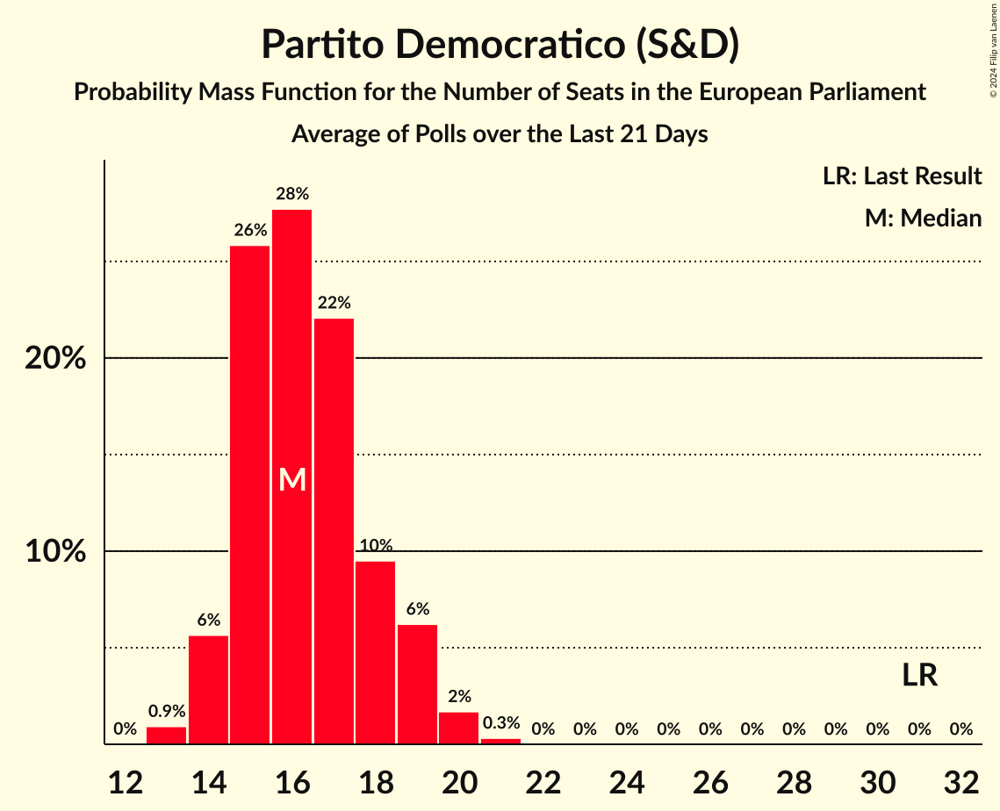

# Partito Democratico (S&D)

<a href="#voting-intentions">Voting Intentions</a> | <a href="#seats">Seats</a>

## Voting Intentions

Last result: **40.8%** (General Election of 26 May 2019)

### Confidence Intervals

| Period     | Polling firm/Commissioner(s) | Median | 80% Confidence Interval | 90% Confidence Interval | 95% Confidence Interval | 99% Confidence Interval |
|:----------:|:----------------:|:-----------:|:-----------------------:|:-----------------------:|:-----------------------:|:-----------------------:|
| N/A | [Poll Average](average.html) | 20.9% | 19.1–22.8% | 18.6–23.3% | 18.1–23.8% | 17.3–24.7% |
| [24–29 June 2020](2020-06-29-SWG.html) | SWG   La7 | 20.3% | 18.9–21.9% | 18.5–22.3% | 18.2–22.7% | 17.5–23.5% |
| [25–26 June 2020](2020-06-26-Tecnè.html) | Tecnè   Agenzia Dire | 19.8% | 18.2–21.5% | 17.8–22.0% | 17.4–22.4% | 16.7–23.2% |
| [26 June 2020](2020-06-26-Euromedia.html) | Euromedia | 20.2% | 18.5–22.2% | 18.0–22.7% | 17.6–23.2% | 16.8–24.1% |
| [24–26 June 2020](2020-06-26-Demopolis.html) | Demopolis | 21.2% | 19.9–22.6% | 19.5–23.0% | 19.2–23.4% | 18.6–24.0% |
| [24–25 June 2020](2020-06-25-TermometroPolitico.html) | Termometro Politico | 20.5% | 19.5–21.6% | 19.2–21.9% | 18.9–22.2% | 18.4–22.7% |
| [25 June 2020](2020-06-25-NotoSondaggi.html) | Noto Sondaggi   Rai 1 | 19.5% | 18.0–21.2% | 17.5–21.7% | 17.2–22.1% | 16.4–22.9% |
| [23–25 June 2020](2020-06-25-Ipsos.html) | Ipsos   Corriere della Sera | 20.4% | 18.8–22.1% | 18.4–22.6% | 18.0–23.0% | 17.3–23.9% |
| [22–23 June 2020](2020-06-23-Ixè.html) | Ixè   Rai 3 | 22.2% | 20.6–24.0% | 20.1–24.4% | 19.7–24.9% | 19.0–25.7% |
| [23 June 2020](2020-06-23-EMG.html) | EMG   Rai | 20.0% | 18.8–21.4% | 18.4–21.7% | 18.1–22.1% | 17.6–22.7% |
| [17–22 June 2020](2020-06-22-SWG.html) | SWG   La7 | 19.3% | 17.9–20.9% | 17.5–21.3% | 17.2–21.7% | 16.5–22.4% |
| [18–19 June 2020](2020-06-19-Tecnè.html) | Tecnè   Agenzia Dire | 19.7% | 18.2–21.4% | 17.7–21.9% | 17.3–22.3% | 16.6–23.1% |
| [16–18 June 2020](2020-06-18-TermometroPolitico.html) | Termometro Politico | 20.5% | 19.6–21.5% | 19.3–21.8% | 19.1–22.0% | 18.6–22.5% |
| [17–18 June 2020](2020-06-18-Euromedia.html) | Euromedia   Rai | 19.8% | 18.0–21.7% | 17.5–22.2% | 17.1–22.7% | 16.3–23.6% |
| [15–17 June 2020](2020-06-17-DemosPi.html) | Demos & Pi   La Repubblica | 21.2% | 19.6–22.9% | 19.1–23.4% | 18.7–23.8% | 18.0–24.7% |
| [15–16 June 2020](2020-06-16-Ixè.html) | Ixè   Rai 3 | 22.0% | 20.4–23.7% | 19.9–24.2% | 19.5–24.7% | 18.8–25.5% |
| [16 June 2020](2020-06-16-EMG.html) | EMG   Rai | 19.9% | 18.4–21.6% | 17.9–22.1% | 17.5–22.5% | 16.8–23.3% |
| [10–15 June 2020](2020-06-15-SWG.html) | SWG   La7 | 19.0% | 17.6–20.5% | 17.2–21.0% | 16.9–21.3% | 16.2–22.1% |
| [15 June 2020](2020-06-15-Euromedia.html) | Euromedia   La7 | 19.8% | 18.0–21.7% | 17.5–22.2% | 17.1–22.7% | 16.3–23.6% |
| [11–12 June 2020](2020-06-12-Tecnè.html) | Tecnè   Agenzia Dire | 19.8% | 18.2–21.5% | 17.8–22.0% | 17.4–22.4% | 16.7–23.2% |
| [9–11 June 2020](2020-06-11-TermometroPolitico.html) | Termometro Politico | 21.0% | 19.9–22.1% | 19.6–22.5% | 19.3–22.8% | 18.8–23.3% |
| [10–11 June 2020](2020-06-11-NotoSondaggi.html) | Noto Sondaggi   Rai 1 | 19.5% | 18.0–21.2% | 17.5–21.7% | 17.2–22.1% | 16.4–22.9% |
| [10–11 June 2020](2020-06-11-Ipsos.html) | Ipsos   Corriere della Sera | 21.3% | 19.9–22.9% | 19.5–23.4% | 19.1–23.7% | 18.4–24.5% |
| [9–11 June 2020](2020-06-11-BiDiMedia.html) | BiDiMedia | 21.6% | 20.3–22.9% | 20.0–23.3% | 19.6–23.7% | 19.0–24.3% |
| [9–10 June 2020](2020-06-10-EMG.html) | EMG   Rai | 20.0% | 18.8–21.3% | 18.4–21.7% | 18.1–22.0% | 17.6–22.7% |
| [8–9 June 2020](2020-06-09-Ixè.html) | Ixè   Rai 3 | 21.4% | 19.8–23.1% | 19.4–23.6% | 19.0–24.1% | 18.2–24.9% |
| [3–8 June 2020](2020-06-08-SWG.html) | SWG   La7 | 19.1% | 17.7–20.6% | 17.3–21.0% | 16.9–21.4% | 16.3–22.2% |
| [5–6 June 2020](2020-06-06-Euromedia.html) | Euromedia | 19.9% | 18.2–21.8% | 17.7–22.3% | 17.3–22.8% | 16.5–23.7% |
| [4–5 June 2020](2020-06-05-Tecnè.html) | Tecnè   Agenzia Dire | 20.0% | 18.4–21.7% | 18.0–22.2% | 17.6–22.6% | 16.9–23.4% |
| [27 May–5 June 2020](2020-06-05-Quorum.html) | Quorum   Sky TG24 | 21.7% | 20.1–23.4% | 19.6–23.9% | 19.3–24.4% | 18.5–25.2% |
| [3–4 June 2020](2020-06-04-TermometroPolitico.html) | Termometro Politico | 20.8% | 19.9–21.7% | 19.6–22.0% | 19.4–22.2% | 19.0–22.7% |
| [4 June 2020](2020-06-04-Euromedia.html) | Euromedia   Rai 1 | 19.9% | 18.2–21.8% | 17.7–22.3% | 17.3–22.8% | 16.5–23.7% |
| [1–2 June 2020](2020-06-02-EMG.html) | EMG   Rai 3 | 20.3% | 19.1–21.6% | 18.8–21.9% | 18.5–22.3% | 17.9–22.9% |
| [31 May–1 June 2020](2020-06-01-Tecnè.html) | Tecnè   rti | 20.2% | 18.6–21.9% | 18.2–22.4% | 17.8–22.8% | 17.1–23.6% |
| [27 May–1 June 2020](2020-06-01-SWG.html) | SWG   La7 | 19.8% | 18.3–21.3% | 17.9–21.7% | 17.6–22.1% | 16.9–22.9% |
| [26–30 May 2020](2020-05-30-ScenariPolitici–Winpoll.html) | Scenari Politici–Winpoll   Il Sole 24 Ore | 21.9% | 20.7–23.3% | 20.3–23.7% | 20.0–24.1% | 19.4–24.7% |
| [27–30 May 2020](2020-05-30-Quorum–YouTrend.html) | Quorum – YouTrend   Sky Tg24 | 21.6% | 20.0–23.3% | 19.6–23.8% | 19.2–24.3% | 18.4–25.1% |
| [28–29 May 2020](2020-05-29-Tecnè.html) | Tecnè   Agenzia Dire | 20.3% | 18.7–22.0% | 18.3–22.5% | 17.9–22.9% | 17.2–23.7% |
| [26–28 May 2020](2020-05-28-TermometroPolitico.html) | Termometro Politico | 21.3% | 20.4–22.2% | 20.1–22.5% | 19.9–22.7% | 19.5–23.2% |
| [28 May 2020](2020-05-28-Index.html) | Index   La7 | 21.2% | 19.5–23.2% | 19.0–23.7% | 18.5–24.2% | 17.7–25.2% |
| [25–26 May 2020](2020-05-26-Ixè.html) | Ixè   Rai 3 | 20.9% | 19.3–22.6% | 18.9–23.1% | 18.5–23.5% | 17.8–24.4% |
| [26 May 2020](2020-05-26-EMG.html) | EMG   Rai 3 | 20.6% | 19.4–21.9% | 19.1–22.2% | 18.8–22.6% | 18.2–23.2% |
| [24–25 May 2020](2020-05-25-Tecnè.html) | Tecnè   rti | 20.8% | 19.2–22.5% | 18.8–23.0% | 18.4–23.4% | 17.7–24.3% |
| [20–25 May 2020](2020-05-25-SWG.html) | SWG   La7 | 20.2% | 18.7–21.7% | 18.3–22.2% | 18.0–22.5% | 17.3–23.3% |
| [21–22 May 2020](2020-05-22-Tecnè.html) | Tecnè   Agenzia Dire | 20.7% | 19.1–22.4% | 18.7–22.9% | 18.3–23.3% | 17.6–24.2% |
| [20–21 May 2020](2020-05-21-TermometroPolitico.html) | Termometro Politico | 21.5% | 20.5–22.6% | 20.2–22.9% | 20.0–23.1% | 19.5–23.6% |
| [23 April–21 May 2020](2020-05-21-Ipsos.html) | Ipsos   Corriere della Sera | 21.2% | 19.6–22.9% | 19.2–23.4% | 18.8–23.9% | 18.0–24.7% |
| [21 May 2020](2020-05-21-Euromedia.html) | Euromedia   Rai 1 | 20.5% | 18.7–22.4% | 18.3–23.0% | 17.8–23.4% | 17.0–24.4% |
| [18–19 May 2020](2020-05-19-Ixè.html) | Ixè   Rai 3 | 21.6% | 20.0–23.4% | 19.5–23.8% | 19.2–24.3% | 18.4–25.1% |
| [19 May 2020](2020-05-19-EMG.html) | EMG   Rai 3 | 20.9% | 19.7–22.2% | 19.4–22.6% | 19.1–22.9% | 18.5–23.5% |
| [13–18 May 2020](2020-05-18-SWG.html) | SWG   La7 | 20.6% | 19.1–22.1% | 18.7–22.6% | 18.4–23.0% | 17.7–23.7% |
| [14–16 May 2020](2020-05-16-Piepoli.html) | Piepoli | 21.5% | 19.3–24.0% | 18.7–24.7% | 18.1–25.3% | 17.1–26.6% |
| [14–15 May 2020](2020-05-15-Tecnè.html) | Tecnè   Agenzia Dire | 20.8% | 19.2–22.5% | 18.8–23.0% | 18.4–23.4% | 17.7–24.3% |
| [13–14 May 2020](2020-05-14-TermometroPolitico.html) | Termometro Politico | 21.6% | 20.7–22.6% | 20.5–22.8% | 20.2–23.0% | 19.8–23.5% |
| [14 May 2020](2020-05-14-NotoSondaggi.html) | Noto Sondaggi   Rai 1 | 21.0% | 19.4–22.7% | 19.0–23.2% | 18.6–23.6% | 17.8–24.5% |
| [14 May 2020](2020-05-14-Index.html) | Index   La7 | 21.6% | 19.8–23.6% | 19.3–24.1% | 18.9–24.6% | 18.1–25.6% |
| [12–14 May 2020](2020-05-14-BiDiMedia.html) | BiDiMedia | 21.9% | 20.7–23.2% | 20.3–23.6% | 20.0–23.9% | 19.5–24.5% |
| [12–13 May 2020](2020-05-13-EMG.html) | EMG   Rai 3 | 20.8% | 19.6–22.2% | 19.2–22.5% | 18.9–22.9% | 18.3–23.5% |
| [12–13 May 2020](2020-05-13-Demopolis.html) | Demopolis | 21.0% | 19.7–22.4% | 19.3–22.8% | 19.0–23.1% | 18.4–23.8% |
| [11–12 May 2020](2020-05-12-Ixè.html) | Ixè   Rai 3 | 22.0% | 20.4–23.7% | 19.9–24.2% | 19.5–24.7% | 18.8–25.5% |
| [6–11 May 2020](2020-05-11-SWG.html) | SWG   La7 | 19.5% | 18.1–21.0% | 17.7–21.5% | 17.3–21.8% | 16.7–22.6% |
| [7–8 May 2020](2020-05-08-Tecnè.html) | Tecnè   Agenzia Dire | 20.9% | 19.3–22.6% | 18.9–23.1% | 18.5–23.5% | 17.8–24.4% |
| [6–7 May 2020](2020-05-07-TermometroPolitico.html) | Termometro Politico | 21.4% | 20.5–22.3% | 20.3–22.6% | 20.1–22.8% | 19.7–23.2% |
| [7 May 2020](2020-05-07-Index.html) | Index   La7 | 21.6% | 19.8–23.6% | 19.3–24.1% | 18.9–24.6% | 18.1–25.6% |
| [6 May 2020](2020-05-06-Euromedia.html) | Euromedia | 21.2% | 19.5–23.2% | 19.0–23.7% | 18.5–24.2% | 17.7–25.2% |
| [5–6 May 2020](2020-05-06-EMG.html) | EMG   Rai 3 | 20.7% | 19.4–22.1% | 19.1–22.4% | 18.8–22.8% | 18.2–23.4% |
| [4–5 May 2020](2020-05-05-Ixè.html) | Ixè   Rai 3 | 22.9% | 21.3–24.7% | 20.8–25.2% | 20.4–25.6% | 19.6–26.5% |
| [29 April–4 May 2020](2020-05-04-SWG.html) | SWG   La7 | 20.2% | 18.7–21.7% | 18.3–22.2% | 18.0–22.5% | 17.3–23.3% |
| [4 May 2020](2020-05-04-Piepoli.html) | Piepoli | 22.0% | 20.4–23.7% | 19.9–24.2% | 19.5–24.7% | 18.8–25.5% |
| [29–30 April 2020](2020-04-30-TermometroPolitico.html) | Termometro Politico | 21.6% | 20.8–22.4% | 20.6–22.6% | 20.4–22.8% | 20.0–23.2% |
| [30 April 2020](2020-04-30-Tecnè.html) | Tecnè   Agenzia Dire | 21.0% | 19.4–22.7% | 19.0–23.2% | 18.6–23.6% | 17.8–24.5% |
| [30 April 2020](2020-04-30-NotoSondaggi.html) | Noto Sondaggi   Rai 1 | 21.5% | 19.9–23.2% | 19.4–23.7% | 19.1–24.2% | 18.3–25.0% |
| [28–30 April 2020](2020-04-30-DemosPi.html) | Demos & Pi   La Repubblica | 21.8% | 20.2–23.5% | 19.7–24.0% | 19.3–24.4% | 18.6–25.3% |
| [29–30 April 2020](2020-04-30-Demopolis.html) | Demopolis | 21.0% | 19.7–22.4% | 19.3–22.8% | 19.0–23.1% | 18.4–23.8% |
| [29 April 2020](2020-04-29-Index.html) | Index   La7 | 21.6% | 19.8–23.6% | 19.3–24.1% | 18.9–24.6% | 18.1–25.6% |
| [28–29 April 2020](2020-04-29-EMG.html) | EMG   Rai 3 | 20.7% | 19.4–22.0% | 19.1–22.4% | 18.8–22.7% | 18.2–23.4% |
| [27–28 April 2020](2020-04-28-Ixè.html) | Ixè   Rai 3 | 22.9% | 21.3–24.7% | 20.8–25.2% | 20.4–25.6% | 19.6–26.5% |
| [22–27 April 2020](2020-04-27-SWG.html) | SWG   La7 | 20.2% | 18.8–21.8% | 18.4–22.2% | 18.1–22.6% | 17.4–23.4% |
| [23–24 April 2020](2020-04-24-Tecnè.html) | Tecnè   Agenzia Dire | 21.1% | 19.5–22.8% | 19.1–23.3% | 18.7–23.7% | 17.9–24.6% |
| [22–23 April 2020](2020-04-23-TermometroPolitico.html) | Termometro Politico | 21.8% | 20.7–23.0% | 20.4–23.3% | 20.1–23.6% | 19.6–24.2% |
| [21–23 April 2020](2020-04-23-ScenariPolitici–Winpoll.html) | Scenari Politici–Winpoll | 22.4% | 21.1–23.8% | 20.8–24.1% | 20.4–24.5% | 19.8–25.1% |
| [22–23 April 2020](2020-04-23-Ipsos.html) | Ipsos   Corriere della Sera | 21.3% | 19.7–23.0% | 19.3–23.5% | 18.9–24.0% | 18.1–24.8% |
| [21–22 April 2020](2020-04-22-EMG.html) | EMG   Rai 3 | 20.9% | 19.7–22.2% | 19.4–22.5% | 19.1–22.9% | 18.5–23.5% |
| [20–21 April 2020](2020-04-21-Ixè.html) | Ixè   Rai 3 | 22.9% | 21.3–24.7% | 20.8–25.2% | 20.4–25.6% | 19.6–26.5% |
| [15–20 April 2020](2020-04-20-SWG.html) | SWG   La7 | 20.0% | 18.6–21.6% | 18.2–22.0% | 17.8–22.4% | 17.2–23.1% |
| [16–17 April 2020](2020-04-17-Tecnè.html) | Tecnè   Agenzia Dire | 21.4% | 19.8–23.1% | 19.4–23.6% | 19.0–24.1% | 18.2–24.9% |
| [15–16 April 2020](2020-04-16-TermometroPolitico.html) | Termometro Politico | 22.2% | 21.3–23.2% | 21.0–23.4% | 20.8–23.6% | 20.4–24.1% |
| [16 April 2020](2020-04-16-Index.html) | Index   La7 | 21.8% | 20.0–23.7% | 19.4–24.3% | 19.0–24.8% | 18.2–25.7% |
| [15–16 April 2020](2020-04-16-Euromedia.html) | Euromedia   Rai 1 | 21.0% | 19.2–22.9% | 18.7–23.5% | 18.3–24.0% | 17.5–24.9% |
| [14–16 April 2020](2020-04-16-BiDiMedia.html) | BiDiMedia | 21.4% | 20.0–22.8% | 19.6–23.2% | 19.3–23.6% | 18.7–24.3% |
| [14–15 April 2020](2020-04-15-EMG.html) | EMG   Rai 3 | 21.1% | 19.9–22.4% | 19.6–22.7% | 19.3–23.0% | 18.7–23.7% |
| [8–13 April 2020](2020-04-13-SWG.html) | SWG | 19.9% | 18.5–21.5% | 18.1–21.9% | 17.7–22.3% | 17.1–23.0% |
| [9–10 April 2020](2020-04-10-Tecnè.html) | Tecnè   Agenzia Dire | 21.8% | 20.2–23.5% | 19.7–24.0% | 19.3–24.5% | 18.6–25.3% |
| [8–9 April 2020](2020-04-09-TermometroPolitico.html) | Termometro Politico | 21.9% | 20.8–23.1% | 20.5–23.4% | 20.2–23.7% | 19.7–24.3% |
| [9 April 2020](2020-04-09-NotoSondaggi.html) | Noto Sondaggi   Rai 1 | 21.3% | 19.7–23.0% | 19.3–23.5% | 18.9–24.0% | 18.1–24.8% |
| [9 April 2020](2020-04-09-Index.html) | Index   La7 | 22.1% | 20.3–24.1% | 19.8–24.6% | 19.4–25.1% | 18.5–26.1% |
| [7–8 April 2020](2020-04-08-EMG.html) | EMG   Rai 3 | 21.4% | 20.2–22.7% | 19.8–23.1% | 19.6–23.4% | 19.0–24.0% |
| [6–7 April 2020](2020-04-07-Ixè.html) | Ixè   Rai 3 | 22.9% | 21.3–24.7% | 20.8–25.2% | 20.4–25.6% | 19.6–26.5% |
| [1–6 April 2020](2020-04-06-SWG.html) | SWG | 20.1% | 18.7–21.6% | 18.3–22.1% | 17.9–22.5% | 17.2–23.2% |
| [2–3 April 2020](2020-04-03-Tecnè.html) | Tecnè   Agenzia Dire | 21.8% | 20.2–23.5% | 19.7–24.0% | 19.3–24.5% | 18.6–25.3% |
| [1–2 April 2020](2020-04-02-TermometroPolitico.html) | Termometro Politico | 21.8% | 20.7–23.0% | 20.4–23.3% | 20.1–23.6% | 19.6–24.2% |
| [2 April 2020](2020-04-02-Index.html) | Index   La7 | 21.9% | 20.1–23.8% | 19.6–24.4% | 19.1–24.9% | 18.3–25.8% |
| [31 March–1 April 2020](2020-04-01-EMG.html) | EMG   Rai 3 | 21.3% | 20.1–22.6% | 19.8–23.0% | 19.5–23.3% | 18.9–23.9% |
| [30–31 March 2020](2020-03-31-Ixè.html) | Ixè   Rai 3 | 22.7% | 21.1–24.5% | 20.6–25.0% | 20.2–25.4% | 19.4–26.3% |
| [25–30 March 2020](2020-03-30-SWG.html) | SWG | 19.2% | 17.8–20.7% | 17.4–21.1% | 17.0–21.5% | 16.4–22.3% |
| [26–27 March 2020](2020-03-27-Tecnè.html) | Tecnè   Agenzia Dire | 22.0% | 20.4–23.7% | 19.9–24.2% | 19.5–24.7% | 18.8–25.5% |
| [25–26 March 2020](2020-03-26-TermometroPolitico.html) | Termometro Politico | 21.1% | 20.0–22.2% | 19.7–22.6% | 19.4–22.8% | 18.9–23.4% |
| [24–26 March 2020](2020-03-26-Ipsos.html) | Ipsos   Corriere della Sera | 20.6% | 19.0–22.3% | 18.6–22.8% | 18.2–23.2% | 17.5–24.1% |
| [25 March 2020](2020-03-25-Euromedia.html) | Euromedia | 21.5% | 19.7–23.5% | 19.2–24.0% | 18.8–24.5% | 18.0–25.5% |
| [24–25 March 2020](2020-03-25-EMG.html) | EMG   Rai 3 | 21.0% | 19.8–22.3% | 19.5–22.7% | 19.2–23.0% | 18.6–23.6% |
| [23–24 March 2020](2020-03-24-Ixè.html) | Ixè   Rai 3 | 22.9% | 21.3–24.7% | 20.8–25.2% | 20.4–25.6% | 19.6–26.5% |
| [18–23 March 2020](2020-03-23-SWG.html) | SWG | 20.3% | 18.9–21.9% | 18.5–22.3% | 18.2–22.7% | 17.5–23.5% |
| [19–21 March 2020](2020-03-21-ScenariPolitici–Winpoll.html) | Scenari Politici–Winpoll | 23.1% | 21.9–24.3% | 21.6–24.7% | 21.3–25.0% | 20.7–25.6% |
| [19–20 March 2020](2020-03-20-Tecnè.html) | Tecnè   Agenzia Dire | 22.3% | 20.7–24.1% | 20.2–24.6% | 19.8–25.0% | 19.1–25.8% |
| [18–19 March 2020](2020-03-19-TermometroPolitico.html) | Termometro Politico | 20.9% | 19.8–22.1% | 19.5–22.4% | 19.3–22.7% | 18.7–23.2% |
| [19 March 2020](2020-03-19-NotoSondaggi.html) | Noto Sondaggi   Rai 1 | 21.5% | 19.9–23.2% | 19.4–23.7% | 19.1–24.2% | 18.3–25.0% |
| [17–18 March 2020](2020-03-18-EMG.html) | EMG   Rai 3 | 21.3% | 20.1–22.6% | 19.8–22.9% | 19.5–23.3% | 18.9–23.9% |
| [16–17 March 2020](2020-03-17-Ixè.html) | Ixè   Rai 3 | 22.5% | 20.9–24.3% | 20.4–24.8% | 20.0–25.2% | 19.3–26.1% |
| [16–17 March 2020](2020-03-17-DemosPi.html) | Demos & Pi   La Repubblica | 21.0% | 19.4–22.7% | 19.0–23.2% | 18.6–23.6% | 17.9–24.4% |
| [11–16 March 2020](2020-03-16-SWG.html) | SWG | 20.5% | 19.1–22.1% | 18.7–22.5% | 18.3–22.9% | 17.6–23.6% |
| [12–13 March 2020](2020-03-13-Tecnè.html) | Tecnè | 22.0% | 20.4–23.7% | 19.9–24.2% | 19.5–24.7% | 18.8–25.5% |
| [11–12 March 2020](2020-03-12-TermometroPolitico.html) | Termometro Politico | 21.0% | 19.9–22.1% | 19.6–22.5% | 19.3–22.8% | 18.8–23.3% |
| [10–11 March 2020](2020-03-11-EMG.html) | EMG | 21.1% | 19.9–22.4% | 19.5–22.8% | 19.2–23.1% | 18.6–23.7% |
| [9–11 March 2020](2020-03-11-BiDiMedia.html) | BiDiMedia | 21.2% | 19.8–22.7% | 19.4–23.2% | 19.1–23.5% | 18.4–24.3% |
| [9–10 March 2020](2020-03-10-Ixè.html) | Ixè | 22.5% | 20.9–24.3% | 20.4–24.8% | 20.0–25.2% | 19.3–26.1% |
| [4–9 March 2020](2020-03-09-SWG.html) | SWG | 19.6% | 18.2–21.1% | 17.8–21.6% | 17.4–21.9% | 16.8–22.7% |
| [6–7 March 2020](2020-03-07-ScenariPolitici–Winpoll.html) | Scenari Politici–Winpoll | 23.2% | 21.6–25.0% | 21.1–25.5% | 20.7–25.9% | 19.9–26.8% |
| [5–6 March 2020](2020-03-06-Tecnè.html) | Tecnè | 21.5% | 19.9–23.2% | 19.4–23.7% | 19.1–24.2% | 18.3–25.0% |
| [4–5 March 2020](2020-03-05-TermometroPolitico.html) | Termometro Politico | 20.9% | 19.8–22.1% | 19.5–22.4% | 19.3–22.7% | 18.7–23.2% |
| [5 March 2020](2020-03-05-Index.html) | Index | 20.0% | 18.3–21.9% | 17.8–22.5% | 17.4–22.9% | 16.6–23.9% |
| [4 March 2020](2020-03-04-Index.html) | Index   La7 | 20.0% | 18.3–21.9% | 17.8–22.5% | 17.4–22.9% | 16.6–23.9% |
| [3–4 March 2020](2020-03-04-EMG.html) | EMG | 21.3% | 20.1–22.6% | 19.8–23.0% | 19.5–23.3% | 18.9–23.9% |
| [2–3 March 2020](2020-03-03-Ixè.html) | Ixè   Rai 3 | 22.0% | 20.4–23.7% | 19.9–24.2% | 19.5–24.7% | 18.8–25.5% |
| [3 March 2020](2020-03-03-Euromedia.html) | Euromedia | 21.1% | 19.4–23.1% | 18.9–23.6% | 18.4–24.1% | 17.6–25.1% |
| [26 February–2 March 2020](2020-03-02-SWG.html) | SWG   La7 | 19.9% | 18.5–21.5% | 18.1–21.9% | 17.7–22.3% | 17.1–23.0% |
| [25–29 February 2020](2020-02-29-Piepoli.html) | Piepoli   Rai 2 | 21.0% | 18.8–23.5% | 18.2–24.2% | 17.7–24.8% | 16.7–26.0% |
| [27–28 February 2020](2020-02-28-Tecnè.html) | Tecnè   Agenzia Dire | 21.2% | 19.6–22.9% | 19.2–23.4% | 18.8–23.9% | 18.0–24.7% |
| [26–27 February 2020](2020-02-27-TermometroPolitico.html) | Termometro Politico   La7 | 20.9% | 19.8–22.1% | 19.5–22.4% | 19.3–22.7% | 18.7–23.2% |
| [27 February 2020](2020-02-27-Ipsos.html) | Ipsos   Corriere della Sera | 19.6% | 18.1–21.3% | 17.6–21.8% | 17.3–22.2% | 16.5–23.0% |
| [25–26 February 2020](2020-02-26-EMG.html) | EMG | 21.2% | 20.0–22.5% | 19.6–22.9% | 19.3–23.2% | 18.7–23.8% |
| [24–25 February 2020](2020-02-25-Ixè.html) | Ixè   Rai 3 | 21.6% | 20.0–23.4% | 19.5–23.8% | 19.2–24.3% | 18.4–25.1% |
| [19–24 February 2020](2020-02-24-SWG.html) | SWG   Agenzia Dire | 20.1% | 18.7–21.6% | 18.3–22.1% | 17.9–22.5% | 17.2–23.2% |
| [20–22 February 2020](2020-02-22-Piepoli.html) | Piepoli   Rai 2 | 20.5% | 18.3–22.9% | 17.7–23.6% | 17.2–24.2% | 16.2–25.4% |
| [20–21 February 2020](2020-02-21-Tecnè.html) | Tecnè   Quarta Repubblica | 21.0% | 19.4–22.7% | 19.0–23.2% | 18.6–23.6% | 17.8–24.5% |
| [19–20 February 2020](2020-02-20-TermometroPolitico.html) | Termometro Politico   La7 | 20.4% | 19.5–21.3% | 19.2–21.6% | 19.0–21.9% | 18.6–22.3% |
| [19 February 2020](2020-02-19-Index.html) | Index   La7 | 20.9% | 19.1–22.8% | 18.6–23.4% | 18.2–23.8% | 17.4–24.8% |
| [18–19 February 2020](2020-02-19-EMG.html) | EMG   Rai 3 | 21.5% | 20.3–22.7% | 20.0–23.1% | 19.8–23.4% | 19.2–24.0% |
| [17–18 February 2020](2020-02-18-Ixè.html) | Ixè   Agenzia Dire | 20.5% | 18.9–22.2% | 18.5–22.7% | 18.1–23.1% | 17.4–24.0% |
| [17–18 February 2020](2020-02-18-Euromedia.html) | Euromedia   Rai 1 | 20.4% | 18.6–22.3% | 18.1–22.8% | 17.7–23.3% | 16.9–24.2% |
| [16–18 February 2020](2020-02-18-Demopolis.html) | Demopolis | 20.8% | 19.7–22.0% | 19.3–22.3% | 19.1–22.6% | 18.5–23.2% |
| [16–17 February 2020](2020-02-17-Tecnè.html) | Tecnè   Quarta Repubblica | 20.8% | 19.2–22.5% | 18.8–23.0% | 18.4–23.4% | 17.7–24.3% |
| [12–17 February 2020](2020-02-17-SWG.html) | SWG   La7 | 20.6% | 19.1–22.1% | 18.7–22.6% | 18.4–23.0% | 17.7–23.7% |
| [13–14 February 2020](2020-02-14-Tecnè.html) | Tecnè   Agenzia Dire | 20.8% | 19.2–22.5% | 18.8–23.0% | 18.4–23.4% | 17.7–24.3% |
| [12–13 February 2020](2020-02-13-TermometroPolitico.html) | Termometro Politico   La7 | 19.8% | 19.0–20.6% | 18.8–20.9% | 18.6–21.1% | 18.2–21.5% |
| [10–13 February 2020](2020-02-13-DemosPi.html) | Demos & Pi   La Repubblica | 20.6% | 19.1–22.3% | 18.6–22.8% | 18.2–23.2% | 17.5–24.0% |
| [13 February 2020](2020-02-13-Demopolis.html) | Demopolis | 20.2% | 18.6–21.9% | 18.2–22.4% | 17.8–22.8% | 17.1–23.6% |
| [11–13 February 2020](2020-02-13-BiDiMedia.html) | BiDiMedia | 20.8% | 19.6–22.2% | 19.2–22.6% | 18.9–22.9% | 18.3–23.6% |
| [12 February 2020](2020-02-12-Index.html) | Index   La7 | 20.0% | 18.3–21.9% | 17.8–22.5% | 17.4–22.9% | 16.6–23.9% |
| [11–12 February 2020](2020-02-12-EMG.html) | EMG   Rai 3 | 21.5% | 20.2–22.9% | 19.8–23.3% | 19.5–23.6% | 18.9–24.3% |
| [12 February 2020](2020-02-12-Demopolis.html) | Demopolis   La7 | 20.2% | 18.6–21.9% | 18.2–22.4% | 17.8–22.8% | 17.1–23.6% |
| [11 February 2020](2020-02-11-Ixè.html) | Ixè   Rai 3 | 20.3% | 18.7–22.0% | 18.3–22.5% | 17.9–22.9% | 17.2–23.7% |
| [5–10 February 2020](2020-02-10-SWG.html) | SWG | 20.7% | 19.4–22.1% | 19.1–22.5% | 18.7–22.9% | 18.1–23.5% |
| [6–7 February 2020](2020-02-07-Tecnè.html) | Tecnè   Agenzia Dire | 20.4% | 18.8–22.1% | 18.4–22.6% | 18.0–23.0% | 17.3–23.9% |
| [4–6 February 2020](2020-02-06-TermometroPolitico.html) | Termometro Politico | 20.2% | 19.3–21.1% | 19.0–21.4% | 18.8–21.6% | 18.4–22.1% |
| [6 February 2020](2020-02-06-Index.html) | Index | 19.2% | 17.5–21.1% | 17.1–21.7% | 16.7–22.1% | 15.9–23.1% |
| [4–6 February 2020](2020-02-06-EMG.html) | EMG   Rai 3 | 21.3% | 20.0–22.7% | 19.6–23.1% | 19.3–23.5% | 18.7–24.2% |
| [4 February 2020](2020-02-04-Ixè.html) | Ixè   RTI | 19.8% | 18.2–21.5% | 17.8–22.0% | 17.4–22.4% | 16.7–23.2% |
| [29 January–3 February 2020](2020-02-03-SWG.html) | SWG   Agenzia Dire | 19.7% | 18.5–21.1% | 18.1–21.5% | 17.8–21.8% | 17.2–22.5% |
| [30 January–2 February 2020](2020-02-02-ScenariPolitici–Winpoll.html) | Scenari Politici–Winpoll | 22.6% | 21.0–24.4% | 20.5–24.9% | 20.1–25.3% | 19.3–26.2% |
| [30–31 January 2020](2020-01-31-Tecnè.html) | Tecnè   Agenzia Dire | 20.2% | 18.6–21.9% | 18.2–22.4% | 17.8–22.8% | 17.1–23.6% |
| [29–31 January 2020](2020-01-31-Piepoli.html) | Piepoli   Rai 2 | 20.0% | 17.8–22.5% | 17.2–23.1% | 16.7–23.7% | 15.7–25.0% |
| [29–30 January 2020](2020-01-30-TermometroPolitico.html) | Termometro Politico   La7 | 20.4% | 19.3–21.5% | 19.0–21.8% | 18.8–22.1% | 18.3–22.6% |
| [28–30 January 2020](2020-01-30-Ipsos.html) | Ipsos | 20.3% | 18.7–22.0% | 18.3–22.5% | 17.9–22.9% | 17.2–23.7% |
| [29 January 2020](2020-01-29-Index.html) | Index | 19.0% | 17.3–20.9% | 16.8–21.4% | 16.4–21.9% | 15.7–22.8% |
| [28–29 January 2020](2020-01-29-EMG.html) | EMG   Rai 3 | 21.2% | 19.9–22.6% | 19.6–23.0% | 19.3–23.3% | 18.7–24.0% |
| [28 January 2020](2020-01-28-MGResearch.html) | MG Research   Affaritaliani.it | 25.0% | 23.2–27.1% | 22.6–27.6% | 22.2–28.1% | 21.3–29.1% |
| [27–28 January 2020](2020-01-28-Ixè.html) | Ixè   Rai 3 | 20.0% | 18.4–21.7% | 18.0–22.2% | 17.6–22.6% | 16.9–23.4% |
| [22–26 January 2020](2020-01-26-SWG.html) | SWG | 17.5% | 16.3–18.9% | 16.0–19.2% | 15.7–19.6% | 15.1–20.2% |
| [23–24 January 2020](2020-01-24-Tecnè.html) | Tecnè   Agenzia Dire | 19.4% | 17.9–21.1% | 17.4–21.6% | 17.1–22.0% | 16.4–22.8% |
| [21–22 January 2020](2020-01-22-TermometroPolitico.html) | Termometro Politico   La7 | 19.1% | 18.1–20.1% | 17.8–20.5% | 17.6–20.7% | 17.1–21.2% |
| [22 January 2020](2020-01-22-Index.html) | Index | 18.8% | 17.1–20.6% | 16.6–21.2% | 16.2–21.6% | 15.4–22.5% |
| [20–21 January 2020](2020-01-21-Ixè.html) | Ixè   Rai 3 | 19.9% | 18.4–21.6% | 17.9–22.1% | 17.5–22.5% | 16.8–23.3% |
| [19–20 January 2020](2020-01-20-Tecnè.html) | Tecnè   RTI | 19.5% | 18.0–21.2% | 17.5–21.7% | 17.2–22.1% | 16.4–22.9% |
| [15–20 January 2020](2020-01-20-SWG.html) | SWG   La7 | 18.2% | 17.0–19.5% | 16.6–19.9% | 16.3–20.2% | 15.7–20.9% |
| [10–17 January 2020](2020-01-17-Tecnè.html) | Tecnè   Agenzia Dire | 19.1% | 17.6–20.8% | 17.1–21.2% | 16.8–21.7% | 16.1–22.5% |
| [15–16 January 2020](2020-01-16-TermometroPolitico.html) | Termometro Politico   La7 | 19.4% | 18.4–20.5% | 18.1–20.8% | 17.9–21.1% | 17.4–21.6% |
| [14–16 January 2020](2020-01-16-BiDiMedia.html) | BiDiMedia | 19.0% | 17.7–20.3% | 17.3–20.7% | 17.0–21.1% | 16.4–21.7% |
| [15 January 2020](2020-01-15-Index.html) | Index | 18.9% | 17.2–20.7% | 16.7–21.3% | 16.3–21.7% | 15.5–22.7% |
| [13–14 January 2020](2020-01-14-Ixè.html) | Ixè   Rai 3 | 20.0% | 18.4–21.7% | 18.0–22.2% | 17.6–22.6% | 16.9–23.4% |
| [14 January 2020](2020-01-14-EMG.html) | EMG   Rai 3 | 20.0% | 18.8–21.3% | 18.5–21.7% | 18.2–22.0% | 17.6–22.6% |
| [12–13 January 2020](2020-01-13-Tecnè.html) | Tecnè   RTI | 19.0% | 17.5–20.7% | 17.1–21.1% | 16.7–21.6% | 16.0–22.4% |
| [8–13 January 2020](2020-01-13-SWG.html) | SWG   La7 | 18.4% | 17.2–19.7% | 16.8–20.1% | 16.5–20.5% | 15.9–21.1% |
| [13 January 2020](2020-01-13-Euromedia.html) | Euromedia   Rai 1 | 18.9% | 17.2–20.7% | 16.7–21.3% | 16.3–21.7% | 15.5–22.7% |
| [9–10 January 2020](2020-01-10-Tecnè.html) | Tecnè   Agenzia Dire | 19.3% | 17.8–21.0% | 17.3–21.5% | 17.0–21.9% | 16.3–22.7% |
| [8–10 January 2020](2020-01-10-Piepoli.html) | Piepoli   Rai 2 | 19.4% | 17.3–21.8% | 16.7–22.5% | 16.2–23.1% | 15.2–24.3% |
| [8–9 January 2020](2020-01-09-TermometroPolitico.html) | Termometro Politico   La7 | 19.1% | 18.2–20.0% | 18.0–20.2% | 17.8–20.4% | 17.4–20.9% |
| [9 January 2020](2020-01-09-Index.html) | Index   La7 | 18.8% | 17.1–20.6% | 16.6–21.2% | 16.2–21.6% | 15.4–22.5% |
| [8 January 2020](2020-01-08-NotoSondaggi.html) | Noto Sondaggi   Rai 1 | 18.5% | 17.0–20.2% | 16.6–20.6% | 16.2–21.0% | 15.5–21.8% |
| [7–8 January 2020](2020-01-08-EMG.html) | EMG   Rai 3 | 19.9% | 18.7–21.2% | 18.3–21.5% | 18.0–21.9% | 17.5–22.5% |
| [3–7 January 2020](2020-01-07-Ixè.html) | Ixè   Rai 3 | 20.0% | 18.4–21.7% | 18.0–22.2% | 17.6–22.6% | 16.9–23.4% |
| [20–24 December 2019](2019-12-24-MGResearch.html) | MG Research | 19.2% | 17.5–21.1% | 17.0–21.6% | 16.6–22.1% | 15.9–23.0% |
| [22–23 December 2019](2019-12-23-Tecnè.html) | Tecnè   TGcom24 | 19.1% | 17.6–20.8% | 17.1–21.2% | 16.8–21.7% | 16.1–22.5% |
| [18–23 December 2019](2019-12-23-SWG.html) | SWG   La7 | 17.0% | 15.8–18.3% | 15.5–18.7% | 15.2–19.0% | 14.6–19.6% |
| [19–20 December 2019](2019-12-20-Tecnè.html) | Tecnè   Agenzia Dire | 19.1% | 17.6–20.8% | 17.1–21.2% | 16.8–21.7% | 16.1–22.5% |
| [18–19 December 2019](2019-12-19-TermometroPolitico.html) | Termometro Politico   La7 | 18.5% | 17.6–19.4% | 17.4–19.7% | 17.1–19.9% | 16.7–20.4% |
| [18–19 December 2019](2019-12-19-Ipsos.html) | Ipsos   Corriere della Sera | 18.2% | 16.7–19.8% | 16.3–20.3% | 15.9–20.7% | 15.2–21.5% |
| [18 December 2019](2019-12-18-Index.html) | Index   La7 | 18.9% | 17.2–20.7% | 16.7–21.3% | 16.3–21.7% | 15.5–22.7% |
| [17–18 December 2019](2019-12-18-EMG.html) | EMG   Rai 3 | 19.6% | 18.4–20.9% | 18.0–21.3% | 17.7–21.6% | 17.2–22.2% |
| [17–18 December 2019](2019-12-18-Demopolis.html) | Demopolis   Rai 3 | 19.0% | 17.7–20.4% | 17.4–20.7% | 17.1–21.1% | 16.5–21.7% |
| [16–17 December 2019](2019-12-17-Ixè.html) | Ixè   Rai 3 | 20.2% | 18.6–21.9% | 18.2–22.4% | 17.8–22.8% | 17.1–23.6% |
| [11–16 December 2019](2019-12-16-SWG.html) | SWG   La7 | 17.5% | 16.3–18.8% | 15.9–19.2% | 15.6–19.5% | 15.1–20.1% |
| [16 December 2019](2019-12-16-Euromedia.html) | Euromedia   Rai 1 | 17.2% | 15.6–19.1% | 15.2–19.6% | 14.8–20.0% | 14.0–20.9% |
| [12–13 December 2019](2019-12-13-Tecnè.html) | Tecnè   Agenzia Dire | 18.8% | 17.3–20.5% | 16.9–20.9% | 16.5–21.4% | 15.8–22.2% |
| [11–13 December 2019](2019-12-13-BiDiMedia.html) | BiDiMedia | 18.8% | 17.5–20.2% | 17.1–20.6% | 16.8–20.9% | 16.2–21.6% |
| [11–12 December 2019](2019-12-12-Tecnè.html) | Tecnè   RTI | 18.9% | 17.4–20.6% | 16.9–21.0% | 16.6–21.5% | 15.9–22.3% |
| [12 December 2019](2019-12-12-NotoSondaggi.html) | Noto Sondaggi   Rai 1 | 18.0% | 16.5–19.6% | 16.1–20.1% | 15.7–20.5% | 15.0–21.3% |
| [1–11 December 2019](2019-12-11-Index.html) | Index   La7 | 19.2% | 17.5–21.1% | 17.1–21.7% | 16.7–22.1% | 15.9–23.1% |
| [10–11 December 2019](2019-12-11-EMG.html) | EMG   Rai 3 | 19.3% | 18.1–20.7% | 17.7–21.0% | 17.5–21.4% | 16.9–22.0% |
| [9–10 December 2019](2019-12-10-Ixè.html) | Ixè   Rai 3 | 20.8% | 19.2–22.5% | 18.8–23.0% | 18.4–23.4% | 17.7–24.3% |
| [8–9 December 2019](2019-12-09-Tecnè.html) | Tecnè   Rete 4 | 18.6% | 17.1–20.3% | 16.7–20.7% | 16.3–21.1% | 15.6–21.9% |
| [4–9 December 2019](2019-12-09-SWG.html) | SWG   La7 | 18.0% | 16.8–19.3% | 16.4–19.7% | 16.1–20.0% | 15.6–20.7% |
| [5–6 December 2019](2019-12-06-Tecnè.html) | Tecnè   Agenzia Dire | 18.9% | 17.4–20.6% | 16.9–21.0% | 16.6–21.5% | 15.9–22.3% |
| [6 December 2019](2019-12-06-NotoSondaggi.html) | Noto Sondaggi   Rai 1 | 18.0% | 16.5–19.6% | 16.1–20.1% | 15.7–20.5% | 15.0–21.3% |
| [2–6 December 2019](2019-12-06-DemosPi.html) | Demos & Pi   La Repubblica | 18.7% | 17.4–20.2% | 17.0–20.6% | 16.7–21.0% | 16.0–21.7% |
| [4 November–5 December 2019](2019-12-05-TermometroPolitico.html) | Termometro Politico   La7 | 18.6% | 17.6–19.6% | 17.3–19.9% | 17.1–20.2% | 16.7–20.7% |
| [1–4 December 2019](2019-12-04-Index.html) | Index   La7 | 19.1% | 17.4–21.0% | 16.9–21.5% | 16.5–22.0% | 15.8–22.9% |
| [1–4 December 2019](2019-12-04-Euromedia.html) | Euromedia   Rai 1 | 17.5% | 15.9–19.3% | 15.4–19.8% | 15.0–20.3% | 14.3–21.2% |
| [3–4 December 2019](2019-12-04-EMG.html) | EMG   Rai 3 | 19.5% | 18.2–20.8% | 17.9–21.2% | 17.6–21.5% | 17.0–22.1% |
| [2–3 December 2019](2019-12-03-Ixè.html) | Ixè   Rai 3 | 20.7% | 19.1–22.4% | 18.7–22.9% | 18.3–23.3% | 17.6–24.2% |
| [1–2 December 2019](2019-12-02-Tecnè.html) | Tecnè   Rete 4 | 19.0% | 17.5–20.7% | 17.1–21.1% | 16.7–21.6% | 16.0–22.4% |
| [27 November–2 December 2019](2019-12-02-SWG.html) | SWG   La7 | 17.7% | 16.5–19.1% | 16.2–19.4% | 15.9–19.8% | 15.3–20.4% |
| [28–29 November 2019](2019-11-29-Tecnè.html) | Tecnè   Agenzia Dire | 19.1% | 17.6–20.8% | 17.1–21.2% | 16.8–21.7% | 16.1–22.5% |
| [27–28 November 2019](2019-11-28-TermometroPolitico.html) | Termometro Politico   La7 | 18.6% | 17.5–19.8% | 17.2–20.1% | 16.9–20.4% | 16.4–20.9% |
| [26–27 November 2019](2019-11-27-Ipsos.html) | Ipsos   Corriere della Sera | 18.1% | 16.6–19.7% | 16.2–20.2% | 15.8–20.6% | 15.2–21.4% |
| [1–27 November 2019](2019-11-27-Index.html) | Index   La7 | 19.2% | 17.5–21.1% | 17.1–21.7% | 16.7–22.1% | 15.9–23.1% |
| [27 November 2019](2019-11-27-EMG.html) | EMG   Rai 3 | 19.7% | 18.5–21.0% | 18.2–21.4% | 17.8–21.7% | 17.3–22.4% |
| [25–26 November 2019](2019-11-26-Ixè.html) | Ixè   Rai 3 | 20.4% | 18.8–22.1% | 18.4–22.6% | 18.0–23.0% | 17.3–23.9% |
| [24–25 November 2019](2019-11-25-Tecnè.html) | Tecnè   Rete 4 | 19.6% | 18.1–21.3% | 17.6–21.8% | 17.3–22.2% | 16.5–23.0% |
| [20–25 November 2019](2019-11-25-SWG.html) | SWG   La7 | 18.1% | 16.9–19.5% | 16.6–19.8% | 16.3–20.2% | 15.7–20.8% |
| [21–22 November 2019](2019-11-22-Tecnè.html) | Tecnè   Agenzia Dire | 19.4% | 17.9–21.1% | 17.4–21.6% | 17.1–22.0% | 16.4–22.8% |
| [21–22 November 2019](2019-11-22-Piepoli.html) | Piepoli   Rai 2 | 19.4% | 17.3–21.8% | 16.7–22.5% | 16.2–23.1% | 15.2–24.3% |
| [20–21 November 2019](2019-11-21-TermometroPolitico.html) | Termometro Politico   La7 | 18.1% | 17.1–19.2% | 16.9–19.5% | 16.6–19.7% | 16.2–20.2% |
| [21 November 2019](2019-11-21-NotoSondaggi.html) | Noto Sondaggi   Rai 1 | 18.0% | 16.5–19.6% | 16.1–20.1% | 15.7–20.5% | 15.0–21.3% |
| [1–20 November 2019](2019-11-20-EMG.html) | EMG   Rai 3 | 20.0% | 18.7–21.3% | 18.4–21.7% | 18.0–22.1% | 17.5–22.7% |
| [18–19 November 2019](2019-11-19-Ixè.html) | Ixè   Rai 3 | 21.2% | 19.6–22.9% | 19.2–23.4% | 18.8–23.9% | 18.0–24.7% |
| [18–19 November 2019](2019-11-19-BiDiMedia.html) | BiDiMedia | 18.6% | 17.4–19.9% | 17.0–20.3% | 16.8–20.6% | 16.2–21.2% |
| [13–18 November 2019](2019-11-18-SWG.html) | SWG   La7 | 18.3% | 17.1–19.7% | 16.8–20.0% | 16.4–20.4% | 15.9–21.0% |
| [14–15 November 2019](2019-11-15-Tecnè.html) | Tecnè   Agenzia Dire | 19.3% | 17.8–21.0% | 17.3–21.5% | 17.0–21.9% | 16.3–22.7% |
| [1–14 November 2019](2019-11-14-Index.html) | Index   La7 | 19.5% | 17.8–21.4% | 17.3–21.9% | 16.9–22.4% | 16.1–23.3% |
| [12–13 November 2019](2019-11-13-TermometroPolitico.html) | Termometro Politico   La7 | 18.3% | 17.3–19.4% | 17.0–19.7% | 16.8–20.0% | 16.3–20.5% |
| [8–13 November 2019](2019-11-13-EMG.html) | EMG   Rai 3 | 19.6% | 18.4–21.1% | 18.0–21.5% | 17.7–21.8% | 17.1–22.5% |
| [11–12 November 2019](2019-11-12-Ixè.html) | Ixè   Rai 3 | 21.0% | 19.4–22.7% | 19.0–23.2% | 18.6–23.6% | 17.8–24.5% |
| [10–12 November 2019](2019-11-12-Demopolis.html) | Demopolis   Rai 3 | 18.5% | 17.3–19.9% | 16.9–20.3% | 16.6–20.6% | 16.1–21.2% |
| [10–11 November 2019](2019-11-11-Tecnè.html) | Tecnè   Rete 4 | 18.7% | 17.2–20.4% | 16.8–20.8% | 16.4–21.2% | 15.7–22.1% |
| [6–11 November 2019](2019-11-11-SWG.html) | SWG   La7 | 18.6% | 17.4–20.0% | 17.0–20.3% | 16.7–20.7% | 16.1–21.3% |
| [1–11 November 2019](2019-11-11-Euromedia.html) | Euromedia   Rai 1 | 18.1% | 16.5–20.0% | 16.0–20.5% | 15.6–21.0% | 14.8–21.9% |
| [8–9 November 2019](2019-11-09-Piepoli.html) | Piepoli   Rai 2 | 19.0% | 16.9–21.4% | 16.3–22.1% | 15.8–22.7% | 14.9–23.9% |
| [7–8 November 2019](2019-11-08-Tecnè.html) | Tecnè   Agenzia Dire | 18.8% | 17.3–20.5% | 16.9–20.9% | 16.5–21.4% | 15.8–22.2% |
| [6–7 November 2019](2019-11-07-TermometroPolitico.html) | Termometro Politico   La7 | 18.5% | 17.5–19.6% | 17.2–19.9% | 17.0–20.2% | 16.5–20.7% |
| [7 November 2019](2019-11-07-Index.html) | Index   La7 | 19.2% | 17.5–21.1% | 17.1–21.7% | 16.7–22.1% | 15.9–23.1% |
| [6 November 2019](2019-11-06-EMG.html) | EMG   Rai 3 | 19.0% | 17.7–20.4% | 17.4–20.9% | 17.1–21.2% | 16.4–21.9% |
| [4–5 November 2019](2019-11-05-Ixè.html) | Ixè   Rai 3 | 20.1% | 18.5–21.8% | 18.1–22.3% | 17.7–22.7% | 17.0–23.5% |
| [4–5 November 2019](2019-11-05-IZI.html) | IZI | 18.2% | 16.7–19.9% | 16.3–20.3% | 16.0–20.7% | 15.3–21.6% |
| [30 October–4 November 2019](2019-11-04-SWG.html) | SWG   La7 | 17.5% | 16.3–18.9% | 16.0–19.2% | 15.7–19.6% | 15.1–20.2% |
| [1–4 November 2019](2019-11-04-Piepoli.html) | Piepoli   Rai 2 | 19.6% | 17.5–22.0% | 16.9–22.7% | 16.4–23.3% | 15.4–24.5% |
| [29–31 October 2019](2019-10-31-Ipsos.html) | Ipsos   Corriere della Sera | 17.2% | 15.7–18.8% | 15.3–19.3% | 15.0–19.7% | 14.3–20.5% |
| [31 October 2019](2019-10-31-Index.html) | Index   La7 | 19.2% | 17.5–21.1% | 17.1–21.7% | 16.7–22.1% | 15.9–23.1% |
| [30–31 October 2019](2019-10-31-Demopolis.html) | Demopolis   Rai 3 | 19.0% | 17.7–20.4% | 17.4–20.7% | 17.1–21.1% | 16.5–21.7% |
| [30 October 2019](2019-10-30-Tecnè.html) | Tecnè | 19.3% | 17.8–21.0% | 17.3–21.5% | 17.0–21.9% | 16.3–22.7% |
| [30 October 2019](2019-10-30-EMG.html) | EMG   Rai 3 | 19.3% | 18.0–20.6% | 17.6–21.0% | 17.3–21.4% | 16.8–22.0% |
| [28–29 October 2019](2019-10-29-Ixè.html) | Ixè   Rai 3 | 19.5% | 18.0–21.2% | 17.5–21.7% | 17.2–22.1% | 16.4–22.9% |
| [27 October 2019](2019-10-27-Tecnè.html) | Tecnè   Rete 4 | 19.2% | 17.7–20.9% | 17.2–21.4% | 16.9–21.8% | 16.2–22.6% |
| [23–27 October 2019](2019-10-27-SWG.html) | SWG   La7 | 18.0% | 16.8–19.3% | 16.4–19.7% | 16.1–20.0% | 15.6–20.7% |
| [24–25 October 2019](2019-10-25-Tecnè.html) | Tecnè   Agenzia Dire | 19.3% | 17.8–21.0% | 17.3–21.5% | 17.0–21.9% | 16.3–22.7% |
| [23–24 October 2019](2019-10-24-TermometroPolitico.html) | Termometro Politico   La7 | 18.9% | 17.9–20.0% | 17.6–20.3% | 17.4–20.6% | 16.9–21.1% |
| [22–24 October 2019](2019-10-24-ScenariPolitici–Winpoll.html) | Scenari Politici–Winpoll | 20.6% | 19.3–22.0% | 18.9–22.4% | 18.6–22.7% | 18.0–23.4% |
| [24 October 2019](2019-10-24-Index.html) | Index   La7 | 19.5% | 17.8–21.4% | 17.3–21.9% | 16.9–22.4% | 16.1–23.3% |
| [23 October 2019](2019-10-23-EMG.html) | EMG   Rai 3 | 19.4% | 18.2–20.7% | 17.8–21.1% | 17.5–21.4% | 16.9–22.1% |
| [22 October 2019](2019-10-22-NotoSondaggi.html) | Noto Sondaggi   Rai 1 | 18.6% | 17.1–20.3% | 16.7–20.7% | 16.3–21.1% | 15.6–21.9% |
| [21–22 October 2019](2019-10-22-Ixè.html) | Ixè   Rai 3 | 19.8% | 18.2–21.5% | 17.8–22.0% | 17.4–22.4% | 16.7–23.2% |
| [20–21 October 2019](2019-10-21-Tecnè.html) | Tecnè   Rete 4 | 19.4% | 17.9–21.1% | 17.4–21.6% | 17.1–22.0% | 16.4–22.8% |
| [16–21 October 2019](2019-10-21-SWG.html) | SWG   La7 | 18.8% | 17.5–20.1% | 17.2–20.5% | 16.9–20.9% | 16.3–21.5% |
| [17–18 October 2019](2019-10-18-Tecnè.html) | Tecnè   Agenzia Dire | 20.2% | 18.6–21.9% | 18.2–22.4% | 17.8–22.8% | 17.1–23.6% |
| [16–17 October 2019](2019-10-17-TermometroPolitico.html) | Termometro Politico   La7 | 19.2% | 18.0–20.5% | 17.6–20.9% | 17.3–21.2% | 16.8–21.8% |
| [17 October 2019](2019-10-17-Index.html) | Index   La7 | 19.8% | 18.0–21.7% | 17.5–22.2% | 17.1–22.7% | 16.3–23.6% |
| [16–17 October 2019](2019-10-17-Euromedia.html) | Euromedia   Rai 1 | 18.5% | 16.8–20.4% | 16.4–20.9% | 16.0–21.4% | 15.2–22.3% |
| [16–17 October 2019](2019-10-17-EMG.html) | EMG   Rai 3 | 19.7% | 18.4–21.0% | 18.1–21.4% | 17.8–21.8% | 17.2–22.4% |
| [14–15 October 2019](2019-10-15-Ixè.html) | Ixè   Rai 3 | 20.4% | 18.8–22.1% | 18.4–22.6% | 18.0–23.0% | 17.3–23.9% |
| [13–14 October 2019](2019-10-14-Tecnè.html) | Tecnè   Rete 4 | 20.4% | 18.8–22.1% | 18.4–22.6% | 18.0–23.0% | 17.3–23.9% |
| [9–14 October 2019](2019-10-14-SWG.html) | SWG   La7 | 19.4% | 18.1–20.8% | 17.8–21.2% | 17.5–21.5% | 16.9–22.1% |
| [10–11 October 2019](2019-10-11-Tecnè.html) | Tecnè   Agenzia Dire | 20.7% | 19.1–22.4% | 18.7–22.9% | 18.3–23.3% | 17.6–24.2% |
| [9–11 October 2019](2019-10-11-Demopolis.html) | Demopolis   Rai 3 | 19.2% | 17.7–20.9% | 17.2–21.4% | 16.9–21.8% | 16.2–22.6% |
| [9–10 October 2019](2019-10-10-TermometroPolitico.html) | Termometro Politico   La7 | 19.4% | 18.2–20.7% | 17.8–21.1% | 17.5–21.4% | 16.9–22.0% |
| [10 October 2019](2019-10-10-NotoSondaggi.html) | Noto Sondaggi   Rai 1 | 19.0% | 17.5–20.7% | 17.1–21.1% | 16.7–21.6% | 16.0–22.4% |
| [9 October 2019](2019-10-09-Index.html) | Index   La7 | 20.1% | 18.4–22.0% | 17.9–22.6% | 17.5–23.1% | 16.7–24.0% |
| [9 October 2019](2019-10-09-EMG.html) | EMG   Rai 3 | 19.2% | 18.0–20.5% | 17.6–20.9% | 17.4–21.2% | 16.8–21.8% |
| [7–9 October 2019](2019-10-09-BiDiMedia.html) | BiDiMedia | 19.5% | 18.2–20.9% | 17.8–21.3% | 17.5–21.6% | 16.9–22.3% |
| [7–8 October 2019](2019-10-08-Ixè.html) | Ixè   Rai 3 | 21.9% | 20.3–23.7% | 19.8–24.1% | 19.4–24.6% | 18.7–25.4% |
| [7–8 October 2019](2019-10-08-Euromedia.html) | Euromedia   Rai 1 | 17.8% | 16.1–19.6% | 15.7–20.1% | 15.3–20.6% | 14.5–21.5% |
| [6–7 October 2019](2019-10-07-Tecnè.html) | Tecnè   Rete 4 | 20.3% | 18.7–22.0% | 18.3–22.5% | 17.9–22.9% | 17.2–23.7% |
| [2–7 October 2019](2019-10-07-SWG.html) | SWG   La7 | 20.0% | 18.7–21.4% | 18.4–21.8% | 18.0–22.1% | 17.5–22.8% |
| [7 October 2019](2019-10-07-Ipsos.html) | Ipsos   La7 | 20.2% | 18.2–22.4% | 17.6–23.0% | 17.1–23.6% | 16.2–24.7% |
| [3–5 October 2019](2019-10-05-Piepoli.html) | Piepoli   Rai 1 | 20.6% | 18.4–23.1% | 17.8–23.8% | 17.3–24.4% | 16.3–25.6% |
| [3–4 October 2019](2019-10-04-Tecnè.html) | Tecnè   Agenzia Dire | 19.7% | 18.2–21.4% | 17.7–21.9% | 17.3–22.3% | 16.6–23.1% |
| [3 October 2019](2019-10-03-Index.html) | Index   La7 | 20.2% | 18.5–22.2% | 18.0–22.7% | 17.6–23.2% | 16.8–24.1% |
| [1–3 October 2019](2019-10-03-DemosPi.html) | Demos & Pi   La Repubblica | 19.1% | 17.8–20.6% | 17.4–21.0% | 17.1–21.4% | 16.4–22.1% |
| [2 October 2019](2019-10-02-EMG.html) | EMG   Rai 3 | 19.7% | 18.5–21.0% | 18.2–21.4% | 17.9–21.7% | 17.4–22.3% |
| [30 September–1 October 2019](2019-10-01-Ixè.html) | Ixè   Rai 3 | 21.6% | 20.0–23.4% | 19.5–23.8% | 19.2–24.3% | 18.4–25.1% |
| [29–30 September 2019](2019-09-30-Tecnè.html) | Tecnè   Rete 4 | 19.7% | 18.2–21.4% | 17.7–21.9% | 17.3–22.3% | 16.6–23.1% |
| [25–30 September 2019](2019-09-30-SWG.html) | SWG   La7 | 19.4% | 18.1–20.8% | 17.8–21.2% | 17.5–21.5% | 16.9–22.1% |
| [20–27 September 2019](2019-09-27-Tecnè.html) | Tecnè   Agenzia Dire | 19.8% | 18.0–21.7% | 17.5–22.2% | 17.1–22.7% | 16.3–23.6% |
| [23–27 September 2019](2019-09-27-GPF.html) | GPF   La Notizia | 20.1% | 18.4–22.0% | 17.9–22.5% | 17.5–23.0% | 16.7–23.9% |
| [25–26 September 2019](2019-09-26-TermometroPolitico.html) | Termometro Politico   La7 | 18.6% | 17.6–19.6% | 17.3–19.9% | 17.1–20.2% | 16.6–20.7% |
| [25–26 September 2019](2019-09-26-Ipsos.html) | Ipsos   Corriere della Sera | 19.5% | 18.0–21.2% | 17.5–21.7% | 17.2–22.1% | 16.4–22.9% |
| [1–25 September 2019](2019-09-25-NotoSondaggi.html) | Noto Sondaggi | 20.0% | 18.4–21.7% | 18.0–22.2% | 17.6–22.6% | 16.9–23.4% |
| [25 September 2019](2019-09-25-EMG.html) | EMG   Rai 3 | 20.3% | 19.1–21.6% | 18.8–21.9% | 18.5–22.2% | 17.9–22.8% |
| [23–24 September 2019](2019-09-24-Ixè.html) | Ixè   Rai 3 | 21.8% | 20.2–23.5% | 19.7–24.0% | 19.3–24.5% | 18.6–25.3% |
| [22–23 September 2019](2019-09-23-Tecnè.html) | Tecnè   Rete 4 | 19.5% | 18.0–21.2% | 17.5–21.7% | 17.2–22.1% | 16.4–22.9% |
| [18–23 September 2019](2019-09-23-SWG.html) | SWG   La7 | 19.4% | 18.1–20.8% | 17.8–21.2% | 17.5–21.5% | 16.9–22.1% |
| [20–22 September 2019](2019-09-22-Piepoli.html) | Piepoli   Rai 1 | 20.0% | 17.9–22.4% | 17.3–23.1% | 16.7–23.7% | 15.8–24.9% |
| [19–20 September 2019](2019-09-20-Tecnè.html) | Tecnè | 19.2% | 17.5–21.1% | 17.1–21.7% | 16.7–22.1% | 15.9–23.1% |
| [18–20 September 2019](2019-09-20-ScenariPolitici–Winpoll.html) | Scenari Politici–Winpoll   Il Sole 24 Ore | 20.7% | 19.4–22.1% | 19.0–22.5% | 18.7–22.8% | 18.1–23.5% |
| [18–20 September 2019](2019-09-20-Quorum–YouTrend.html) | Quorum – YouTrend   Sky Tg24 | 21.2% | 19.6–22.9% | 19.2–23.4% | 18.8–23.9% | 18.0–24.7% |
| [20 September 2019](2019-09-20-IZI.html) | IZI | 19.5% | 18.0–21.2% | 17.6–21.7% | 17.2–22.1% | 16.5–22.9% |
| [17–19 September 2019](2019-09-19-TermometroPolitico.html) | Termometro Politico   La7 | 19.5% | 18.4–20.7% | 18.1–21.0% | 17.8–21.3% | 17.3–21.9% |
| [18–19 September 2019](2019-09-19-Tecnè.html) | Tecnè   Rete 4 | 19.4% | 17.9–21.1% | 17.4–21.6% | 17.1–22.0% | 16.4–22.8% |
| [1–19 September 2019](2019-09-19-IndexResearch.html) | Index Research   La7 | 20.5% | 18.7–22.4% | 18.3–23.0% | 17.8–23.4% | 17.0–24.4% |
| [18–19 September 2019](2019-09-19-Demopolis.html) | Demopolis   Rai 3 | 19.4% | 18.1–20.8% | 17.8–21.2% | 17.5–21.5% | 16.9–22.1% |
| [17–18 September 2019](2019-09-18-Euromedia.html) | Euromedia   Rai 1 | 17.6% | 16.0–19.5% | 15.5–20.0% | 15.1–20.4% | 14.4–21.3% |
| [14–18 September 2019](2019-09-18-BiDiMedia.html) | BiDiMedia | 22.1% | 20.8–23.5% | 20.4–23.9% | 20.1–24.2% | 19.5–24.9% |
| [16–17 September 2019](2019-09-17-Ixè.html) | Ixè   Rai 3 | 21.6% | 20.0–23.4% | 19.5–23.8% | 19.2–24.3% | 18.4–25.1% |
| [17 September 2019](2019-09-17-EMG.html) | EMG   Rai 3 | 20.2% | 19.0–21.5% | 18.7–21.8% | 18.4–22.1% | 17.9–22.8% |
| [15–16 September 2019](2019-09-16-Tecnè.html) | Tecnè   Rete 4 | 23.3% | 21.6–25.1% | 21.2–25.6% | 20.8–26.0% | 20.0–26.9% |
| [11–16 September 2019](2019-09-16-SWG.html) | SWG   La7 | 21.5% | 20.1–22.9% | 19.8–23.3% | 19.5–23.6% | 18.8–24.3% |
| [11–12 September 2019](2019-09-12-TermometroPolitico.html) | Termometro Politico   La7 | 23.0% | 22.0–24.0% | 21.7–24.3% | 21.5–24.6% | 21.1–25.0% |
| [12 September 2019](2019-09-12-Tecnè.html) | Tecnè   Rete 4 | 23.6% | 21.8–25.6% | 21.2–26.2% | 20.8–26.7% | 20.0–27.7% |
| [9–12 September 2019](2019-09-12-ScenariPolitici–Winpoll.html) | Scenari Politici–Winpoll   Il Sole 24 Ore | 23.3% | 22.0–24.8% | 21.6–25.2% | 21.3–25.5% | 20.6–26.2% |
| [10–12 September 2019](2019-09-12-DemosPi.html) | Demos & Pi   La Repubblica | 22.3% | 20.7–24.0% | 20.2–24.5% | 19.8–25.0% | 19.0–25.8% |
| [9–10 September 2019](2019-09-10-NotoSondaggi.html) | Noto Sondaggi | 22.5% | 20.9–24.3% | 20.4–24.8% | 20.0–25.2% | 19.3–26.1% |
| [9–10 September 2019](2019-09-10-Ixè.html) | Ixè   Rai 3 | 22.6% | 21.0–24.4% | 20.5–24.9% | 20.1–25.3% | 19.3–26.2% |
| [9–10 September 2019](2019-09-10-Euromedia.html) | Euromedia | 20.6% | 18.9–22.6% | 18.4–23.1% | 18.0–23.6% | 17.1–24.5% |
| [10 September 2019](2019-09-10-EMG.html) | EMG   Rai 3 | 22.8% | 21.6–24.1% | 21.2–24.4% | 20.9–24.8% | 20.4–25.4% |
| [9–10 September 2019](2019-09-10-Demopolis.html) | Demopolis   Rai 3 | 23.2% | 21.8–24.6% | 21.5–25.1% | 21.1–25.4% | 20.5–26.1% |
| [4–9 September 2019](2019-09-09-SWG.html) | SWG   La7 | 22.1% | 20.8–23.6% | 20.4–24.0% | 20.1–24.3% | 19.5–25.0% |
| [7–9 September 2019](2019-09-09-Piepoli.html) | Piepoli   Rai 1 | 24.0% | 21.7–26.6% | 21.0–27.3% | 20.5–27.9% | 19.4–29.2% |
| [1–6 September 2019](2019-09-06-NotoSondaggi.html) | Noto Sondaggi   Quotidiano Nazionale | 23.0% | 21.4–24.8% | 20.9–25.3% | 20.5–25.7% | 19.7–26.6% |
| [5 September 2019](2019-09-05-Tecnè.html) | Tecnè   Rete 4 | 24.4% | 22.7–26.2% | 22.2–26.7% | 21.8–27.2% | 21.0–28.0% |
| [4–5 September 2019](2019-09-05-GPF.html) | GPF   La Notizia | 23.9% | 22.2–25.7% | 21.7–26.2% | 21.3–26.6% | 20.5–27.5% |
| [4–5 September 2019](2019-09-05-Demopolis.html) | Demopolis   Rai 3 | 23.0% | 21.6–24.4% | 21.3–24.8% | 20.9–25.2% | 20.3–25.9% |
| [2–3 September 2019](2019-09-03-Ixè.html) | Ixè   Rai 3 | 23.0% | 21.4–24.8% | 20.9–25.3% | 20.5–25.7% | 19.7–26.6% |
| [31 August–2 September 2019](2019-09-02-Tecnè.html) | Tecnè   Rete 4 | 24.6% | 22.9–26.4% | 22.4–26.9% | 22.0–27.4% | 21.2–28.3% |
| [29 August–2 September 2019](2019-09-02-SWG.html) | SWG   La7 | 21.3% | 20.0–22.7% | 19.6–23.1% | 19.3–23.5% | 18.7–24.2% |
| [29–30 August 2019](2019-08-30-Quorum–YouTrend.html) | Quorum – YouTrend   Sky Tg24 | 22.3% | 20.7–24.1% | 20.2–24.6% | 19.8–25.0% | 19.1–25.8% |
| [26–29 August 2019](2019-08-29-Ipsos.html) | Ipsos   Corriere della Sera | 22.3% | 20.7–24.1% | 20.3–24.6% | 19.9–25.0% | 19.1–25.9% |
| [24–28 August 2019](2019-08-28-BiDiMedia.html) | BiDiMedia | 24.2% | 22.9–25.6% | 22.5–26.0% | 22.2–26.3% | 21.6–27.0% |
| [27 August 2019](2019-08-27-Piepoli.html) | Piepoli   La Stampa | 23.6% | 21.3–26.1% | 20.6–26.8% | 20.1–27.5% | 19.0–28.7% |
| [23–25 August 2019](2019-08-25-Demopolis.html) | Demopolis | 23.0% | 22.0–24.0% | 21.7–24.3% | 21.5–24.5% | 21.0–25.0% |
| [21–23 August 2019](2019-08-23-TermometroPolitico.html) | Termometro Politico   La7 | 24.1% | 23.1–25.1% | 22.8–25.4% | 22.6–25.7% | 22.1–26.2% |
| [21–23 August 2019](2019-08-23-ScenariPolitici–Winpoll.html) | Scenari Politici–Winpoll   Il Sole 24 Ore | 24.3% | 22.9–25.7% | 22.5–26.2% | 22.2–26.5% | 21.5–27.2% |
| [21 August 2019](2019-08-21-Tecnè.html) | Tecnè | 24.6% | 22.9–26.4% | 22.4–26.9% | 22.0–27.4% | 21.2–28.3% |
| [21 August 2019](2019-08-21-IZI.html) | IZI | 23.5% | 21.9–25.3% | 21.4–25.8% | 21.0–26.2% | 20.2–27.1% |
| [20–21 August 2019](2019-08-21-GPF.html) | GPF | 23.5% | 21.4–25.8% | 20.8–26.4% | 20.3–27.0% | 19.3–28.2% |
| [12 August 2019](2019-08-12-GPF.html) | GPF | 22.8% | 21.0–24.8% | 20.5–25.4% | 20.0–25.9% | 19.2–26.8% |
| [9–10 August 2019](2019-08-10-TermometroPolitico.html) | Termometro Politico   La7 | 23.4% | 22.3–24.5% | 22.0–24.8% | 21.8–25.1% | 21.3–25.7% |
| [1–9 August 2019](2019-08-09-NotoSondaggi.html) | Noto Sondaggi | 23.0% | 21.4–24.8% | 20.9–25.3% | 20.5–25.7% | 19.7–26.6% |
| [5 August 2019](2019-08-05-Tecnè.html) | Tecnè   Dire | 22.4% | 20.8–24.2% | 20.3–24.7% | 19.9–25.1% | 19.2–26.0% |
| [29 July–2 August 2019](2019-08-02-TermometroPolitico.html) | Termometro Politico | 22.6% | 21.3–23.9% | 21.0–24.3% | 20.7–24.6% | 20.1–25.3% |
| [30 July–1 August 2019](2019-08-01-Tecnè.html) | Tecnè   Dire | 22.5% | 20.9–24.3% | 20.4–24.8% | 20.0–25.2% | 19.3–26.1% |
| [30–31 July 2019](2019-07-31-Ipsos.html) | Ipsos   Corriere della Sera | 20.5% | 18.9–22.2% | 18.5–22.7% | 18.1–23.1% | 17.4–24.0% |
| [27–30 July 2019](2019-07-30-ScenariPolitici–Winpoll.html) | Scenari Politici–Winpoll   Il Sole 24 Ore | 23.3% | 21.9–24.7% | 21.5–25.1% | 21.2–25.5% | 20.6–26.2% |
| [24–29 July 2019](2019-07-29-SWG.html) | SWG   La7 | 22.0% | 20.7–23.4% | 20.3–23.8% | 20.0–24.2% | 19.3–24.9% |
| [24–25 July 2019](2019-07-25-Tecnè.html) | Tecnè   Dire | 22.7% | 21.1–24.5% | 20.6–25.0% | 20.2–25.4% | 19.4–26.3% |
| [22–24 July 2019](2019-07-24-Demopolis.html) | Demopolis   La7 | 22.5% | 21.2–24.0% | 20.8–24.4% | 20.5–24.7% | 19.9–25.4% |
| [17–22 July 2019](2019-07-22-SWG.html) | SWG   La7 | 21.5% | 20.2–23.0% | 19.8–23.4% | 19.5–23.7% | 18.9–24.4% |
| [22 July 2019](2019-07-22-Euromedia.html) | Euromedia | 20.0% | 18.4–21.7% | 18.0–22.2% | 17.6–22.6% | 16.9–23.4% |
| [16–18 July 2019](2019-07-18-TermometroPolitico.html) | Termometro Politico | 23.1% | 21.7–24.6% | 21.3–25.0% | 20.9–25.4% | 20.3–26.1% |
| [17–18 July 2019](2019-07-18-Tecnè.html) | Tecnè   Rete 4 | 23.6% | 21.9–25.4% | 21.5–25.9% | 21.1–26.3% | 20.3–27.2% |
| [16–18 July 2019](2019-07-18-Ipsos.html) | Ipsos   Corriere della Sera | 21.6% | 20.0–23.4% | 19.5–23.8% | 19.2–24.3% | 18.4–25.1% |
| [15–18 July 2019](2019-07-18-GPF.html) | GPF   La Notizia | 22.7% | 21.0–24.6% | 20.6–25.1% | 20.1–25.6% | 19.3–26.5% |
| [10–15 July 2019](2019-07-15-SWG.html) | SWG   LA7 | 22.0% | 20.7–23.4% | 20.3–23.8% | 20.0–24.2% | 19.3–24.9% |
| [15 July 2019](2019-07-15-Piepoli.html) | Piepoli   Rai 1 | 23.6% | 21.3–26.2% | 20.6–26.9% | 20.1–27.5% | 19.0–28.8% |
| [9–12 July 2019](2019-07-12-TermometroPolitico.html) | Termometro Politico | 22.6% | 21.2–24.2% | 20.8–24.6% | 20.4–25.0% | 19.7–25.7% |
| [10–11 July 2019](2019-07-11-Tecnè.html) | Tecnè   Rete 4 | 23.5% | 21.8–25.3% | 21.4–25.8% | 21.0–26.2% | 20.2–27.1% |
| [8–10 July 2019](2019-07-10-GPF.html) | GPF   Rete 4 | 22.4% | 20.6–24.4% | 20.1–25.0% | 19.7–25.4% | 18.8–26.4% |
| [8–10 July 2019](2019-07-10-DemosPi.html) | Demos & Pi | 22.5% | 20.9–24.3% | 20.4–24.8% | 20.0–25.2% | 19.3–26.0% |
| [7–8 July 2019](2019-07-08-Tecnè.html) | Tecnè   Rete 4 | 23.4% | 21.7–25.2% | 21.3–25.7% | 20.9–26.1% | 20.1–27.0% |
| [3–8 July 2019](2019-07-08-SWG.html) | SWG   La7 | 22.7% | 21.4–24.2% | 21.0–24.6% | 20.7–24.9% | 20.0–25.6% |
| [5 July 2019](2019-07-05-NotoSondaggi.html) | Noto Sondaggi   Quotidiano Nazionale | 23.9% | 22.2–25.7% | 21.8–26.2% | 21.4–26.6% | 20.6–27.5% |
| [1–4 July 2019](2019-07-04-TermometroPolitico.html) | Termometro Politico   La7 | 22.9% | 21.6–24.2% | 21.2–24.6% | 20.9–25.0% | 20.3–25.6% |
| [29 June–4 July 2019](2019-07-04-BiDiMedia.html) | BiDiMedia | 23.5% | 22.2–24.9% | 21.8–25.2% | 21.5–25.6% | 20.9–26.2% |
| [26 June–1 July 2019](2019-07-01-SWG.html) | SWG   La7 | 22.6% | 21.2–24.0% | 20.9–24.4% | 20.5–24.8% | 19.9–25.5% |
| [27 June 2019](2019-06-27-EMG.html) | EMG   Rai 3 | 23.4% | 22.1–24.7% | 21.8–25.0% | 21.5–25.3% | 20.9–26.0% |
| [1–26 June 2019](2019-06-26-NotoSondaggi.html) | Noto Sondaggi   Rai 3 | 24.9% | 23.2–26.7% | 22.7–27.2% | 22.3–27.7% | 21.5–28.6% |
| [25–26 June 2019](2019-06-26-Ipsos.html) | Ipsos   Corriere della Sera | 25.0% | 23.3–26.8% | 22.8–27.3% | 22.4–27.8% | 21.6–28.7% |
| [23–24 June 2019](2019-06-24-Tecnè.html) | Tecnè   Rete 4 | 23.4% | 21.7–25.2% | 21.3–25.7% | 20.9–26.1% | 20.1–27.0% |
| [19–24 June 2019](2019-06-24-SWG.html) | SWG   La7 | 22.6% | 21.2–24.0% | 20.9–24.4% | 20.5–24.8% | 19.9–25.5% |
| [19–20 June 2019](2019-06-20-Demopolis.html) | Demopolis   La7 | 22.0% | 20.7–23.4% | 20.3–23.8% | 20.0–24.2% | 19.3–24.9% |
| [1–18 June 2019](2019-06-18-NotoSondaggi.html) | Noto Sondaggi   Rai 3 | 24.0% | 22.3–25.8% | 21.9–26.3% | 21.4–26.7% | 20.7–27.6% |
| [18 June 2019](2019-06-18-EMG.html) | EMG   Rai 3 | 24.4% | 23.1–25.7% | 22.8–26.1% | 22.5–26.4% | 21.9–27.1% |
| [12–17 June 2019](2019-06-17-SWG.html) | SWG   LA7 | 22.5% | 21.2–24.0% | 20.8–24.4% | 20.5–24.7% | 19.9–25.4% |
| [13 June 2019](2019-06-13-IndexResearch.html) | Index Research   LA7 | 22.9% | 21.0–24.9% | 20.5–25.4% | 20.1–25.9% | 19.3–26.9% |
| [11 June 2019](2019-06-11-EMG.html) | EMG   Rai 3 | 23.9% | 22.6–25.3% | 22.3–25.7% | 22.0–26.0% | 21.4–26.6% |
| [9–10 June 2019](2019-06-10-Tecnè.html) | Tecnè   Rete 4 | 23.6% | 21.9–25.4% | 21.5–25.9% | 21.1–26.3% | 20.3–27.2% |
| [5–10 June 2019](2019-06-10-SWG.html) | SWG   La7 | 22.8% | 21.4–24.2% | 21.1–24.6% | 20.7–25.0% | 20.1–25.7% |
| [10 June 2019](2019-06-10-Piepoli.html) | Piepoli   Rai 1 | 23.6% | 21.3–26.1% | 20.6–26.8% | 20.1–27.5% | 19.0–28.7% |
| [1–10 June 2019](2019-06-10-NotoSondaggi.html) | Noto Sondaggi   Rai 3 | 24.0% | 22.3–25.8% | 21.9–26.3% | 21.4–26.7% | 20.7–27.6% |
| [10 June 2019](2019-06-10-Euromedia.html) | Euromedia   Rai 1 | 23.5% | 21.7–25.5% | 21.1–26.1% | 20.7–26.6% | 19.8–27.6% |
| [1–7 June 2019](2019-06-07-IndexResearch.html) | Index Research   La7 | 23.2% | 21.4–25.3% | 20.9–25.8% | 20.5–26.3% | 19.6–27.3% |
| [2–3 June 2019](2019-06-03-Tecnè.html) | Tecnè   Rete 4 | 23.9% | 22.2–25.7% | 21.8–26.2% | 21.4–26.6% | 20.6–27.5% |
| [29 May–3 June 2019](2019-06-03-SWG.html) | SWG   LA7 | 23.5% | 22.2–25.0% | 21.8–25.4% | 21.4–25.8% | 20.8–26.5% |
| [1 June 2019](2019-06-01-EMG.html) | EMG   Affari Internazionali | 24.1% | 22.8–25.5% | 22.4–25.9% | 22.1–26.3% | 21.5–27.0% |
| [30 May 2019](2019-05-30-Piepoli.html) | Piepoli   Rai 1 | 23.0% | 21.4–24.8% | 20.9–25.3% | 20.5–25.7% | 19.7–26.6% |
| [28–29 May 2019](2019-05-29-ScenariPolitici–Winpoll.html) | Scenari Politici–Winpoll | 23.8% | 22.4–25.3% | 22.0–25.7% | 21.7–26.0% | 21.1–26.7% |

### Probability Mass Function

The following table shows the probability mass function per percentage block of voting intentions for the [poll average](average.html) for Partito Democratico (S&D).

| Voting Intentions | Probability | Accumulated | Special Marks |
|:-----------------:|:-----------:|:-----------:|:-------------:|
| 14.5–15.5% | 0% | 100% |  |
| 15.5–16.5% | 0.1% | 100% |  |
| 16.5–17.5% | 0.8% | 99.9% |  |
| 17.5–18.5% | 4% | 99.1% |  |
| 18.5–19.5% | 12% | 95% |  |
| 19.5–20.5% | 23% | 83% |  |
| 20.5–21.5% | 27% | 60% | Median |
| 21.5–22.5% | 20% | 33% |  |
| 22.5–23.5% | 9% | 13% |  |
| 23.5–24.5% | 3% | 4% |  |
| 24.5–25.5% | 0.6% | 0.7% |  |
| 25.5–26.5% | 0.1% | 0.1% |  |
| 26.5–27.5% | 0% | 0% |  |
| 27.5–28.5% | 0% | 0% |  |
| 28.5–29.5% | 0% | 0% |  |
| 29.5–30.5% | 0% | 0% |  |
| 30.5–31.5% | 0% | 0% |  |
| 31.5–32.5% | 0% | 0% |  |
| 32.5–33.5% | 0% | 0% |  |
| 33.5–34.5% | 0% | 0% |  |
| 34.5–35.5% | 0% | 0% |  |
| 35.5–36.5% | 0% | 0% |  |
| 36.5–37.5% | 0% | 0% |  |
| 37.5–38.5% | 0% | 0% |  |
| 38.5–39.5% | 0% | 0% |  |
| 39.5–40.5% | 0% | 0% |  |
| 40.5–41.5% | 0% | 0% | Last Result |

## Seats

Last result: **31** seats (General Election of 26 May 2019)

### Confidence Intervals

| Period     | Polling firm/Commissioner(s) | Median | 80% Confidence Interval | 90% Confidence Interval | 95% Confidence Interval | 99% Confidence Interval |
|:----------:|:----------------:|:------:|:-----------------------:|:-----------------------:|:-----------------------:|:-----------------------:|
| N/A | [Poll Average](average.html) | 17 | 15–19 | 15–19 | 15–20 | 14–21 |
| [24–29 June 2020](2020-06-29-SWG.html) | SWG   La7 | 17 | 16–19 | 15–20 | 15–20 | 14–20 |
| [25–26 June 2020](2020-06-26-Tecnè.html) | Tecnè   Agenzia Dire | 16 | 15–17 | 15–18 | 14–19 | 14–20 |
| [26 June 2020](2020-06-26-Euromedia.html) | Euromedia | 16 | 15–18 | 15–19 | 14–19 | 13–20 |
| [24–26 June 2020](2020-06-26-Demopolis.html) | Demopolis | 17 | 15–18 | 15–18 | 15–18 | 14–19 |
| [24–25 June 2020](2020-06-25-TermometroPolitico.html) | Termometro Politico | 17 | 16–18 | 16–19 | 16–19 | 15–19 |
| [25 June 2020](2020-06-25-NotoSondaggi.html) | Noto Sondaggi   Rai 1 | 16 | 15–17 | 15–17 | 14–17 | 13–19 |
| [23–25 June 2020](2020-06-25-Ipsos.html) | Ipsos   Corriere della Sera | 17 | 16–19 | 15–19 | 15–19 | 14–20 |
| [22–23 June 2020](2020-06-23-Ixè.html) | Ixè   Rai 3 | 18 | 16–19 | 16–20 | 16–20 | 15–21 |
| [23 June 2020](2020-06-23-EMG.html) | EMG   Rai | 16 | 15–17 | 14–17 | 14–18 | 14–19 |
| [17–22 June 2020](2020-06-22-SWG.html) | SWG   La7 | 16 | 15–19 | 15–19 | 15–19 | 14–19 |
| [18–19 June 2020](2020-06-19-Tecnè.html) | Tecnè   Agenzia Dire | 16 | 15–18 | 15–18 | 14–18 | 13–19 |
| [16–18 June 2020](2020-06-18-TermometroPolitico.html) | Termometro Politico | 17 | 16–18 | 16–18 | 16–18 | 16–19 |
| [17–18 June 2020](2020-06-18-Euromedia.html) | Euromedia   Rai | 15 | 14–18 | 14–19 | 13–19 | 13–19 |
| [15–17 June 2020](2020-06-17-DemosPi.html) | Demos & Pi   La Repubblica | 17 | 16–19 | 15–19 | 15–20 | 14–20 |
| [15–16 June 2020](2020-06-16-Ixè.html) | Ixè   Rai 3 | 18 | 16–19 | 16–19 | 15–20 | 15–20 |
| [16 June 2020](2020-06-16-EMG.html) | EMG   Rai | 16 | 14–17 | 14–18 | 14–18 | 13–19 |
| [10–15 June 2020](2020-06-15-SWG.html) | SWG   La7 | 16 | 15–18 | 14–18 | 14–18 | 13–19 |
| [15 June 2020](2020-06-15-Euromedia.html) | Euromedia   La7 | 16 | 14–17 | 14–18 | 14–19 | 13–20 |
| [11–12 June 2020](2020-06-12-Tecnè.html) | Tecnè   Agenzia Dire | 16 | 15–18 | 15–18 | 14–19 | 14–19 |
| [9–11 June 2020](2020-06-11-TermometroPolitico.html) | Termometro Politico | 18 | 17–18 | 16–19 | 16–19 | 16–19 |
| [10–11 June 2020](2020-06-11-NotoSondaggi.html) | Noto Sondaggi   Rai 1 | 16 | 14–17 | 13–18 | 13–18 | 13–19 |
| [10–11 June 2020](2020-06-11-Ipsos.html) | Ipsos   Corriere della Sera | 18 | 16–19 | 16–19 | 16–20 | 15–20 |
| [9–11 June 2020](2020-06-11-BiDiMedia.html) | BiDiMedia | 18 | 17–20 | 16–20 | 16–21 | 16–21 |
| [9–10 June 2020](2020-06-10-EMG.html) | EMG   Rai | 16 | 15–17 | 15–17 | 15–18 | 14–18 |
| [8–9 June 2020](2020-06-09-Ixè.html) | Ixè   Rai 3 | 17 | 16–18 | 15–19 | 15–19 | 14–20 |
| [3–8 June 2020](2020-06-08-SWG.html) | SWG   La7 | 18 | 15–18 | 14–18 | 14–18 | 14–19 |
| [5–6 June 2020](2020-06-06-Euromedia.html) | Euromedia | 16 | 14–17 | 14–18 | 13–19 | 13–19 |
| [4–5 June 2020](2020-06-05-Tecnè.html) | Tecnè   Agenzia Dire | 17 | 16–18 | 15–18 | 15–18 | 14–19 |
| [27 May–5 June 2020](2020-06-05-Quorum.html) | Quorum   Sky TG24 | 18 | 16–19 | 16–19 | 15–20 | 14–21 |
| [3–4 June 2020](2020-06-04-TermometroPolitico.html) | Termometro Politico | 17 | 16–18 | 16–19 | 16–19 | 15–19 |
| [4 June 2020](2020-06-04-Euromedia.html) | Euromedia   Rai 1 | 18 | 15–18 | 14–18 | 14–19 | 13–20 |
| [1–2 June 2020](2020-06-02-EMG.html) | EMG   Rai 3 | 16 | 15–17 | 15–18 | 15–18 | 14–19 |
| [31 May–1 June 2020](2020-06-01-Tecnè.html) | Tecnè   rti | 16 | 15–18 | 15–18 | 14–19 | 14–19 |
| [27 May–1 June 2020](2020-06-01-SWG.html) | SWG   La7 | 17 | 15–18 | 15–19 | 14–19 | 14–19 |
| [26–30 May 2020](2020-05-30-ScenariPolitici–Winpoll.html) | Scenari Politici–Winpoll   Il Sole 24 Ore | 19 | 17–20 | 17–20 | 16–20 | 16–21 |
| [27–30 May 2020](2020-05-30-Quorum–YouTrend.html) | Quorum – YouTrend   Sky Tg24 | 17 | 16–18 | 15–19 | 15–20 | 15–21 |
| [28–29 May 2020](2020-05-29-Tecnè.html) | Tecnè   Agenzia Dire | 17 | 16–18 | 15–19 | 15–19 | 14–20 |
| [26–28 May 2020](2020-05-28-TermometroPolitico.html) | Termometro Politico | 18 | 17–19 | 16–19 | 16–19 | 16–19 |
| [28 May 2020](2020-05-28-Index.html) | Index   La7 | 17 | 16–20 | 16–21 | 15–21 | 15–21 |
| [25–26 May 2020](2020-05-26-Ixè.html) | Ixè   Rai 3 | 17 | 15–18 | 15–18 | 14–19 | 14–20 |
| [26 May 2020](2020-05-26-EMG.html) | EMG   Rai 3 | 16 | 15–17 | 15–18 | 15–18 | 15–19 |
| [24–25 May 2020](2020-05-25-Tecnè.html) | Tecnè   rti | 17 | 16–19 | 16–19 | 15–20 | 15–21 |
| [20–25 May 2020](2020-05-25-SWG.html) | SWG   La7 | 17 | 16–18 | 15–19 | 15–19 | 14–20 |
| [21–22 May 2020](2020-05-22-Tecnè.html) | Tecnè   Agenzia Dire | 17 | 16–18 | 15–19 | 15–20 | 14–20 |
| [20–21 May 2020](2020-05-21-TermometroPolitico.html) | Termometro Politico | 18 | 17–19 | 17–19 | 17–19 | 16–20 |
| [23 April–21 May 2020](2020-05-21-Ipsos.html) | Ipsos   Corriere della Sera | 17 | 16–19 | 15–19 | 15–20 | 14–20 |
| [21 May 2020](2020-05-21-Euromedia.html) | Euromedia   Rai 1 | 17 | 15–19 | 15–19 | 15–20 | 14–21 |
| [18–19 May 2020](2020-05-19-Ixè.html) | Ixè   Rai 3 | 17 | 16–19 | 16–19 | 16–20 | 15–20 |
| [19 May 2020](2020-05-19-EMG.html) | EMG   Rai 3 | 17 | 16–17 | 16–18 | 15–18 | 15–19 |
| [13–18 May 2020](2020-05-18-SWG.html) | SWG   La7 | 18 | 16–19 | 16–19 | 15–20 | 15–20 |
| [14–16 May 2020](2020-05-16-Piepoli.html) | Piepoli | 17 | 15–19 | 14–20 | 14–20 | 13–21 |
| [14–15 May 2020](2020-05-15-Tecnè.html) | Tecnè   Agenzia Dire | 17 | 16–19 | 15–19 | 15–20 | 14–20 |
| [13–14 May 2020](2020-05-14-TermometroPolitico.html) | Termometro Politico | 18 | 17–19 | 17–19 | 17–19 | 16–20 |
| [14 May 2020](2020-05-14-NotoSondaggi.html) | Noto Sondaggi   Rai 1 | 18 | 16–19 | 16–20 | 15–20 | 14–21 |
| [14 May 2020](2020-05-14-Index.html) | Index   La7 | 18 | 17–20 | 16–20 | 16–21 | 15–22 |
| [12–14 May 2020](2020-05-14-BiDiMedia.html) | BiDiMedia | 18 | 17–19 | 16–19 | 16–20 | 16–20 |
| [12–13 May 2020](2020-05-13-EMG.html) | EMG   Rai 3 | 17 | 16–18 | 15–18 | 15–19 | 15–19 |
| [12–13 May 2020](2020-05-13-Demopolis.html) | Demopolis | 16 | 15–17 | 14–17 | 14–18 | 14–18 |
| [11–12 May 2020](2020-05-12-Ixè.html) | Ixè   Rai 3 | 18 | 17–20 | 16–20 | 16–21 | 15–22 |
| [6–11 May 2020](2020-05-11-SWG.html) | SWG   La7 | 16 | 15–17 | 15–18 | 15–18 | 14–19 |
| [7–8 May 2020](2020-05-08-Tecnè.html) | Tecnè   Agenzia Dire | 17 | 16–19 | 15–19 | 15–20 | 14–20 |
| [6–7 May 2020](2020-05-07-TermometroPolitico.html) | Termometro Politico | 18 | 17–18 | 17–19 | 17–19 | 16–19 |
| [7 May 2020](2020-05-07-Index.html) | Index   La7 | 18 | 16–20 | 16–21 | 15–21 | 14–22 |
| [6 May 2020](2020-05-06-Euromedia.html) | Euromedia | 17 | 15–20 | 15–20 | 14–20 | 14–22 |
| [5–6 May 2020](2020-05-06-EMG.html) | EMG   Rai 3 | 17 | 16–18 | 15–18 | 15–18 | 15–19 |
| [4–5 May 2020](2020-05-05-Ixè.html) | Ixè   Rai 3 | 19 | 17–20 | 17–21 | 17–21 | 16–22 |
| [29 April–4 May 2020](2020-05-04-SWG.html) | SWG   La7 | 18 | 15–19 | 15–19 | 15–19 | 14–20 |
| [4 May 2020](2020-05-04-Piepoli.html) | Piepoli | 17 | 16–18 | 15–19 | 15–19 | 14–20 |
| [29–30 April 2020](2020-04-30-TermometroPolitico.html) | Termometro Politico | 18 | 17–19 | 17–19 | 17–19 | 16–20 |
| [30 April 2020](2020-04-30-Tecnè.html) | Tecnè   Agenzia Dire | 17 | 16–19 | 15–19 | 15–20 | 14–20 |
| [30 April 2020](2020-04-30-NotoSondaggi.html) | Noto Sondaggi   Rai 1 | 18 | 16–20 | 16–20 | 15–20 | 15–21 |
| [28–30 April 2020](2020-04-30-DemosPi.html) | Demos & Pi   La Repubblica | 17 | 16–19 | 15–19 | 15–19 | 14–20 |
| [29–30 April 2020](2020-04-30-Demopolis.html) | Demopolis | 16 | 15–17 | 14–17 | 14–18 | 14–18 |
| [29 April 2020](2020-04-29-Index.html) | Index   La7 | 17 | 16–20 | 16–20 | 15–21 | 14–22 |
| [28–29 April 2020](2020-04-29-EMG.html) | EMG   Rai 3 | 17 | 15–18 | 15–18 | 15–18 | 14–19 |
| [27–28 April 2020](2020-04-28-Ixè.html) | Ixè   Rai 3 | 19 | 17–21 | 17–21 | 17–21 | 16–22 |
| [22–27 April 2020](2020-04-27-SWG.html) | SWG   La7 | 17 | 15–18 | 15–19 | 15–19 | 14–20 |
| [23–24 April 2020](2020-04-24-Tecnè.html) | Tecnè   Agenzia Dire | 17 | 16–19 | 15–19 | 15–20 | 14–21 |
| [22–23 April 2020](2020-04-23-TermometroPolitico.html) | Termometro Politico | 19 | 17–19 | 17–20 | 17–20 | 16–20 |
| [21–23 April 2020](2020-04-23-ScenariPolitici–Winpoll.html) | Scenari Politici–Winpoll | 19 | 18–20 | 17–20 | 17–21 | 16–21 |
| [22–23 April 2020](2020-04-23-Ipsos.html) | Ipsos   Corriere della Sera | 18 | 17–19 | 16–19 | 16–20 | 15–20 |
| [21–22 April 2020](2020-04-22-EMG.html) | EMG   Rai 3 | 17 | 16–18 | 16–18 | 15–18 | 15–19 |
| [20–21 April 2020](2020-04-21-Ixè.html) | Ixè   Rai 3 | 18 | 17–20 | 16–20 | 16–21 | 15–21 |
| [15–20 April 2020](2020-04-20-SWG.html) | SWG   La7 | 17 | 15–18 | 15–19 | 14–20 | 14–20 |
| [16–17 April 2020](2020-04-17-Tecnè.html) | Tecnè   Agenzia Dire | 18 | 16–19 | 16–20 | 15–20 | 14–21 |
| [15–16 April 2020](2020-04-16-TermometroPolitico.html) | Termometro Politico | 18 | 17–19 | 17–19 | 17–20 | 17–20 |
| [16 April 2020](2020-04-16-Index.html) | Index   La7 | 18 | 16–20 | 16–20 | 15–21 | 14–21 |
| [15–16 April 2020](2020-04-16-Euromedia.html) | Euromedia   Rai 1 | 17 | 15–19 | 15–19 | 15–19 | 14–20 |
| [14–16 April 2020](2020-04-16-BiDiMedia.html) | BiDiMedia | 18 | 16–19 | 16–19 | 15–19 | 15–20 |
| [14–15 April 2020](2020-04-15-EMG.html) | EMG   Rai 3 | 17 | 16–18 | 15–18 | 15–18 | 15–19 |
| [8–13 April 2020](2020-04-13-SWG.html) | SWG | 16 | 16–19 | 15–19 | 14–19 | 14–19 |
| [9–10 April 2020](2020-04-10-Tecnè.html) | Tecnè   Agenzia Dire | 18 | 16–19 | 16–20 | 16–20 | 15–21 |
| [8–9 April 2020](2020-04-09-TermometroPolitico.html) | Termometro Politico | 18 | 17–19 | 17–20 | 17–20 | 16–21 |
| [9 April 2020](2020-04-09-NotoSondaggi.html) | Noto Sondaggi   Rai 1 | 18 | 16–19 | 16–19 | 15–20 | 15–21 |
| [9 April 2020](2020-04-09-Index.html) | Index   La7 | 18 | 17–19 | 16–20 | 16–20 | 14–22 |
| [7–8 April 2020](2020-04-08-EMG.html) | EMG   Rai 3 | 17 | 16–18 | 16–18 | 15–19 | 15–19 |
| [6–7 April 2020](2020-04-07-Ixè.html) | Ixè   Rai 3 | 19 | 18–20 | 17–20 | 17–21 | 15–22 |
| [1–6 April 2020](2020-04-06-SWG.html) | SWG | 18 | 16–19 | 15–19 | 15–19 | 14–20 |
| [2–3 April 2020](2020-04-03-Tecnè.html) | Tecnè   Agenzia Dire | 18 | 16–20 | 16–20 | 16–20 | 15–21 |
| [1–2 April 2020](2020-04-02-TermometroPolitico.html) | Termometro Politico | 18 | 17–19 | 17–19 | 16–20 | 16–20 |
| [2 April 2020](2020-04-02-Index.html) | Index   La7 | 18 | 16–19 | 16–20 | 16–20 | 15–21 |
| [31 March–1 April 2020](2020-04-01-EMG.html) | EMG   Rai 3 | 17 | 16–18 | 15–18 | 15–19 | 15–19 |
| [30–31 March 2020](2020-03-31-Ixè.html) | Ixè   Rai 3 | 19 | 17–20 | 16–20 | 16–21 | 15–21 |
| [25–30 March 2020](2020-03-30-SWG.html) | SWG | 16 | 15–18 | 15–18 | 14–19 | 14–19 |
| [26–27 March 2020](2020-03-27-Tecnè.html) | Tecnè   Agenzia Dire | 18 | 17–20 | 16–20 | 16–21 | 15–22 |
| [25–26 March 2020](2020-03-26-TermometroPolitico.html) | Termometro Politico | 17 | 16–18 | 16–18 | 16–18 | 15–19 |
| [24–26 March 2020](2020-03-26-Ipsos.html) | Ipsos   Corriere della Sera | 16 | 15–18 | 15–18 | 14–19 | 13–20 |
| [25 March 2020](2020-03-25-Euromedia.html) | Euromedia | 17 | 16–19 | 16–20 | 15–20 | 14–21 |
| [24–25 March 2020](2020-03-25-EMG.html) | EMG   Rai 3 | 17 | 16–18 | 15–18 | 15–18 | 15–19 |
| [23–24 March 2020](2020-03-24-Ixè.html) | Ixè   Rai 3 | 18 | 17–20 | 17–21 | 16–21 | 15–22 |
| [18–23 March 2020](2020-03-23-SWG.html) | SWG | 17 | 16–19 | 15–19 | 15–20 | 14–20 |
| [19–21 March 2020](2020-03-21-ScenariPolitici–Winpoll.html) | Scenari Politici–Winpoll | 20 | 18–20 | 18–21 | 18–21 | 17–22 |
| [19–20 March 2020](2020-03-20-Tecnè.html) | Tecnè   Agenzia Dire | 18 | 17–20 | 16–21 | 16–21 | 15–22 |
| [18–19 March 2020](2020-03-19-TermometroPolitico.html) | Termometro Politico | 17 | 16–18 | 15–19 | 15–19 | 15–19 |
| [19 March 2020](2020-03-19-NotoSondaggi.html) | Noto Sondaggi   Rai 1 | 17 | 16–19 | 15–19 | 14–21 | 14–21 |
| [17–18 March 2020](2020-03-18-EMG.html) | EMG   Rai 3 | 17 | 16–18 | 16–18 | 16–18 | 15–19 |
| [16–17 March 2020](2020-03-17-Ixè.html) | Ixè   Rai 3 | 18 | 16–20 | 16–20 | 16–20 | 15–22 |
| [16–17 March 2020](2020-03-17-DemosPi.html) | Demos & Pi   La Repubblica | 17 | 15–18 | 15–19 | 14–19 | 14–20 |
| [11–16 March 2020](2020-03-16-SWG.html) | SWG | 18 | 17–19 | 16–20 | 16–20 | 15–21 |
| [12–13 March 2020](2020-03-13-Tecnè.html) | Tecnè | 18 | 17–20 | 16–21 | 16–21 | 15–22 |
| [11–12 March 2020](2020-03-12-TermometroPolitico.html) | Termometro Politico | 17 | 16–18 | 16–18 | 16–19 | 15–19 |
| [10–11 March 2020](2020-03-11-EMG.html) | EMG | 17 | 16–18 | 16–18 | 16–18 | 15–19 |
| [9–11 March 2020](2020-03-11-BiDiMedia.html) | BiDiMedia | 17 | 16–19 | 16–19 | 15–19 | 15–20 |
| [9–10 March 2020](2020-03-10-Ixè.html) | Ixè | 18 | 17–21 | 16–21 | 16–21 | 16–22 |
| [4–9 March 2020](2020-03-09-SWG.html) | SWG | 16 | 15–19 | 15–19 | 15–19 | 14–19 |
| [6–7 March 2020](2020-03-07-ScenariPolitici–Winpoll.html) | Scenari Politici–Winpoll | 20 | 18–21 | 18–21 | 17–22 | 16–23 |
| [5–6 March 2020](2020-03-06-Tecnè.html) | Tecnè | 17 | 16–19 | 16–20 | 15–20 | 15–21 |
| [4–5 March 2020](2020-03-05-TermometroPolitico.html) | Termometro Politico | 17 | 16–18 | 16–18 | 15–19 | 15–19 |
| [5 March 2020](2020-03-05-Index.html) | Index | 16 | 15–18 | 14–19 | 14–19 | 13–20 |
| [4 March 2020](2020-03-04-Index.html) | Index   La7 | 16 | 14–18 | 14–18 | 14–18 | 13–19 |
| [3–4 March 2020](2020-03-04-EMG.html) | EMG | 17 | 16–18 | 16–18 | 16–19 | 15–19 |
| [2–3 March 2020](2020-03-03-Ixè.html) | Ixè   Rai 3 | 19 | 17–20 | 17–21 | 16–21 | 16–21 |
| [3 March 2020](2020-03-03-Euromedia.html) | Euromedia | 17 | 16–19 | 15–19 | 14–20 | 14–20 |
| [26 February–2 March 2020](2020-03-02-SWG.html) | SWG   La7 | 16 | 15–18 | 15–18 | 15–19 | 14–20 |
| [25–29 February 2020](2020-02-29-Piepoli.html) | Piepoli   Rai 2 | 16 | 15–18 | 14–19 | 14–20 | 12–21 |
| [27–28 February 2020](2020-02-28-Tecnè.html) | Tecnè   Agenzia Dire | 18 | 16–19 | 16–19 | 15–20 | 14–21 |
| [26–27 February 2020](2020-02-27-TermometroPolitico.html) | Termometro Politico   La7 | 17 | 16–19 | 16–19 | 15–19 | 15–20 |
| [27 February 2020](2020-02-27-Ipsos.html) | Ipsos   Corriere della Sera | 16 | 14–17 | 14–18 | 13–18 | 13–19 |
| [25–26 February 2020](2020-02-26-EMG.html) | EMG | 17 | 16–18 | 16–18 | 15–19 | 15–19 |
| [24–25 February 2020](2020-02-25-Ixè.html) | Ixè   Rai 3 | 18 | 16–20 | 16–20 | 16–21 | 15–21 |
| [19–24 February 2020](2020-02-24-SWG.html) | SWG   Agenzia Dire | 17 | 15–18 | 15–19 | 15–19 | 14–21 |
| [20–22 February 2020](2020-02-22-Piepoli.html) | Piepoli   Rai 2 | 16 | 14–18 | 13–19 | 13–19 | 12–20 |
| [20–21 February 2020](2020-02-21-Tecnè.html) | Tecnè   Quarta Repubblica | 17 | 16–19 | 15–19 | 15–20 | 14–20 |
| [19–20 February 2020](2020-02-20-TermometroPolitico.html) | Termometro Politico   La7 | 16 | 15–17 | 15–17 | 15–18 | 15–18 |
| [19 February 2020](2020-02-19-Index.html) | Index   La7 | 17 | 15–19 | 15–19 | 14–19 | 14–20 |
| [18–19 February 2020](2020-02-19-EMG.html) | EMG   Rai 3 | 17 | 17–18 | 16–19 | 16–19 | 16–19 |
| [17–18 February 2020](2020-02-18-Ixè.html) | Ixè   Agenzia Dire | 17 | 16–18 | 15–19 | 15–19 | 14–20 |
| [17–18 February 2020](2020-02-18-Euromedia.html) | Euromedia   Rai 1 | 16 | 15–18 | 14–19 | 14–19 | 13–19 |
| [16–18 February 2020](2020-02-18-Demopolis.html) | Demopolis | 16 | 15–17 | 14–17 | 14–17 | 14–18 |
| [16–17 February 2020](2020-02-17-Tecnè.html) | Tecnè   Quarta Repubblica | 17 | 16–19 | 15–19 | 15–19 | 14–20 |
| [12–17 February 2020](2020-02-17-SWG.html) | SWG   La7 | 17 | 16–19 | 16–19 | 15–19 | 14–20 |
| [13–14 February 2020](2020-02-14-Tecnè.html) | Tecnè   Agenzia Dire | 17 | 16–19 | 15–19 | 15–19 | 14–20 |
| [12–13 February 2020](2020-02-13-TermometroPolitico.html) | Termometro Politico   La7 | 16 | 15–17 | 15–17 | 15–17 | 14–17 |
| [10–13 February 2020](2020-02-13-DemosPi.html) | Demos & Pi   La Repubblica | 16 | 14–17 | 14–18 | 14–18 | 13–19 |
| [13 February 2020](2020-02-13-Demopolis.html) | Demopolis | 15 | 13–16 | 13–17 | 13–17 | 12–18 |
| [11–13 February 2020](2020-02-13-BiDiMedia.html) | BiDiMedia | 17 | 15–18 | 15–18 | 15–18 | 15–19 |
| [12 February 2020](2020-02-12-Index.html) | Index   La7 | 17 | 15–18 | 15–19 | 14–19 | 13–20 |
| [11–12 February 2020](2020-02-12-EMG.html) | EMG   Rai 3 | 17 | 16–18 | 16–19 | 16–20 | 15–20 |
| [12 February 2020](2020-02-12-Demopolis.html) | Demopolis   La7 | 14 | 13–16 | 13–16 | 12–17 | 12–17 |
| [11 February 2020](2020-02-11-Ixè.html) | Ixè   Rai 3 | 17 | 16–19 | 15–20 | 15–20 | 14–20 |
| [5–10 February 2020](2020-02-10-SWG.html) | SWG | 18 | 17–18 | 16–18 | 16–19 | 15–20 |
| [6–7 February 2020](2020-02-07-Tecnè.html) | Tecnè   Agenzia Dire | 17 | 15–19 | 15–19 | 15–19 | 14–20 |
| [4–6 February 2020](2020-02-06-TermometroPolitico.html) | Termometro Politico | 16 | 16–17 | 15–18 | 15–18 | 15–18 |
| [6 February 2020](2020-02-06-Index.html) | Index | 14 | 13–16 | 12–17 | 12–17 | 12–18 |
| [4–6 February 2020](2020-02-06-EMG.html) | EMG   Rai 3 | 17 | 16–19 | 16–19 | 16–20 | 15–20 |
| [4 February 2020](2020-02-04-Ixè.html) | Ixè   RTI | 17 | 15–18 | 14–19 | 14–19 | 13–20 |
| [29 January–3 February 2020](2020-02-03-SWG.html) | SWG   Agenzia Dire | 17 | 15–18 | 15–18 | 14–18 | 14–19 |
| [30 January–2 February 2020](2020-02-02-ScenariPolitici–Winpoll.html) | Scenari Politici–Winpoll | 19 | 17–20 | 16–20 | 16–21 | 15–22 |
| [30–31 January 2020](2020-01-31-Tecnè.html) | Tecnè   Agenzia Dire | 17 | 15–18 | 15–19 | 14–19 | 14–20 |
| [29–31 January 2020](2020-01-31-Piepoli.html) | Piepoli   Rai 2 | 15 | 14–17 | 13–18 | 13–18 | 12–19 |
| [29–30 January 2020](2020-01-30-TermometroPolitico.html) | Termometro Politico   La7 | 17 | 16–18 | 15–18 | 15–19 | 14–19 |
| [28–30 January 2020](2020-01-30-Ipsos.html) | Ipsos | 17 | 15–18 | 15–18 | 14–19 | 13–19 |
| [29 January 2020](2020-01-29-Index.html) | Index | 15 | 14–17 | 14–17 | 13–17 | 12–18 |
| [28–29 January 2020](2020-01-29-EMG.html) | EMG   Rai 3 | 17 | 16–18 | 16–19 | 16–19 | 15–19 |
| [28 January 2020](2020-01-28-MGResearch.html) | MG Research   Affaritaliani.it | 21 | 19–22 | 18–23 | 18–23 | 16–24 |
| [27–28 January 2020](2020-01-28-Ixè.html) | Ixè   Rai 3 | 17 | 15–18 | 15–18 | 15–19 | 14–20 |
| [22–26 January 2020](2020-01-26-SWG.html) | SWG | 14 | 14–15 | 13–15 | 13–16 | 12–17 |
| [23–24 January 2020](2020-01-24-Tecnè.html) | Tecnè   Agenzia Dire | 16 | 15–18 | 14–18 | 14–18 | 13–19 |
| [21–22 January 2020](2020-01-22-TermometroPolitico.html) | Termometro Politico   La7 | 15 | 14–17 | 14–18 | 14–18 | 13–18 |
| [22 January 2020](2020-01-22-Index.html) | Index | 15 | 14–17 | 14–18 | 13–19 | 12–19 |
| [20–21 January 2020](2020-01-21-Ixè.html) | Ixè   Rai 3 | 17 | 15–18 | 14–18 | 14–19 | 14–20 |
| [19–20 January 2020](2020-01-20-Tecnè.html) | Tecnè   RTI | 14 | 13–15 | 12–15 | 12–16 | 11–16 |
| [15–20 January 2020](2020-01-20-SWG.html) | SWG   La7 | 15 | 13–16 | 13–16 | 13–17 | 13–18 |
| [10–17 January 2020](2020-01-17-Tecnè.html) | Tecnè   Agenzia Dire | 16 | 14–17 | 14–17 | 14–18 | 13–19 |
| [15–16 January 2020](2020-01-16-TermometroPolitico.html) | Termometro Politico   La7 | 16 | 14–16 | 14–17 | 14–17 | 14–17 |
| [14–16 January 2020](2020-01-16-BiDiMedia.html) | BiDiMedia | 15 | 14–16 | 13–16 | 13–16 | 12–17 |
| [15 January 2020](2020-01-15-Index.html) | Index | 15 | 14–17 | 14–18 | 13–18 | 12–19 |
| [13–14 January 2020](2020-01-14-Ixè.html) | Ixè   Rai 3 | 16 | 15–18 | 15–18 | 14–19 | 13–19 |
| [14 January 2020](2020-01-14-EMG.html) | EMG   Rai 3 | 16 | 15–17 | 15–18 | 15–18 | 14–19 |
| [12–13 January 2020](2020-01-13-Tecnè.html) | Tecnè   RTI | 14 | 13–15 | 12–16 | 12–16 | 12–17 |
| [8–13 January 2020](2020-01-13-SWG.html) | SWG   La7 | 15 | 14–16 | 14–16 | 13–17 | 13–17 |
| [13 January 2020](2020-01-13-Euromedia.html) | Euromedia   Rai 1 | 14 | 13–16 | 13–17 | 12–17 | 12–18 |
| [9–10 January 2020](2020-01-10-Tecnè.html) | Tecnè   Agenzia Dire | 15 | 14–17 | 14–18 | 13–18 | 13–19 |
| [8–10 January 2020](2020-01-10-Piepoli.html) | Piepoli   Rai 2 | 15 | 13–18 | 13–18 | 13–18 | 12–19 |
| [8–9 January 2020](2020-01-09-TermometroPolitico.html) | Termometro Politico   La7 | 15 | 14–16 | 14–16 | 14–16 | 14–17 |
| [9 January 2020](2020-01-09-Index.html) | Index   La7 | 15 | 13–17 | 13–17 | 13–18 | 12–18 |
| [8 January 2020](2020-01-08-NotoSondaggi.html) | Noto Sondaggi   Rai 1 | 15 | 13–16 | 13–17 | 13–17 | 12–18 |
| [7–8 January 2020](2020-01-08-EMG.html) | EMG   Rai 3 | 17 | 15–17 | 15–17 | 15–18 | 14–18 |
| [3–7 January 2020](2020-01-07-Ixè.html) | Ixè   Rai 3 | 16 | 15–18 | 15–18 | 14–18 | 13–19 |
| [20–24 December 2019](2019-12-24-MGResearch.html) | MG Research | 14 | 13–16 | 13–16 | 12–17 | 12–18 |
| [22–23 December 2019](2019-12-23-Tecnè.html) | Tecnè   TGcom24 | 16 | 14–17 | 14–17 | 14–18 | 13–19 |
| [18–23 December 2019](2019-12-23-SWG.html) | SWG   La7 | 14 | 13–15 | 12–15 | 12–16 | 11–16 |
| [19–20 December 2019](2019-12-20-Tecnè.html) | Tecnè   Agenzia Dire | 15 | 14–17 | 14–17 | 13–18 | 13–19 |
| [18–19 December 2019](2019-12-19-TermometroPolitico.html) | Termometro Politico   La7 | 15 | 14–16 | 14–16 | 14–16 | 13–16 |
| [18–19 December 2019](2019-12-19-Ipsos.html) | Ipsos   Corriere della Sera | 14 | 13–15 | 12–16 | 12–16 | 12–17 |
| [18 December 2019](2019-12-18-Index.html) | Index   La7 | 15 | 14–17 | 13–18 | 13–18 | 12–19 |
| [17–18 December 2019](2019-12-18-EMG.html) | EMG   Rai 3 | 16 | 15–17 | 14–17 | 14–17 | 13–18 |
| [17–18 December 2019](2019-12-18-Demopolis.html) | Demopolis   Rai 3 | 14 | 13–15 | 13–15 | 12–16 | 12–16 |
| [16–17 December 2019](2019-12-17-Ixè.html) | Ixè   Rai 3 | 17 | 15–19 | 15–19 | 14–19 | 14–20 |
| [11–16 December 2019](2019-12-16-SWG.html) | SWG   La7 | 14 | 13–15 | 13–15 | 12–16 | 12–16 |
| [16 December 2019](2019-12-16-Euromedia.html) | Euromedia   Rai 1 | 13 | 12–15 | 12–15 | 11–16 | 11–17 |
| [12–13 December 2019](2019-12-13-Tecnè.html) | Tecnè   Agenzia Dire | 15 | 14–17 | 13–17 | 13–18 | 13–18 |
| [11–13 December 2019](2019-12-13-BiDiMedia.html) | BiDiMedia | 15 | 14–16 | 13–16 | 13–16 | 12–17 |
| [11–12 December 2019](2019-12-12-Tecnè.html) | Tecnè   RTI | 15 | 14–17 | 14–17 | 13–17 | 13–18 |
| [12 December 2019](2019-12-12-NotoSondaggi.html) | Noto Sondaggi   Rai 1 | 15 | 13–17 | 13–18 | 13–18 | 12–18 |
| [1–11 December 2019](2019-12-11-Index.html) | Index   La7 | 15 | 14–17 | 14–18 | 14–18 | 13–18 |
| [10–11 December 2019](2019-12-11-EMG.html) | EMG   Rai 3 | 15 | 14–16 | 14–17 | 14–17 | 13–18 |
| [9–10 December 2019](2019-12-10-Ixè.html) | Ixè   Rai 3 | 17 | 16–19 | 15–19 | 15–20 | 14–20 |
| [8–9 December 2019](2019-12-09-Tecnè.html) | Tecnè   Rete 4 | 15 | 13–16 | 13–17 | 13–17 | 12–18 |
| [4–9 December 2019](2019-12-09-SWG.html) | SWG   La7 | 14 | 13–16 | 13–16 | 13–16 | 12–17 |
| [5–6 December 2019](2019-12-06-Tecnè.html) | Tecnè   Agenzia Dire | 15 | 13–17 | 13–17 | 13–17 | 12–18 |
| [6 December 2019](2019-12-06-NotoSondaggi.html) | Noto Sondaggi   Rai 1 | 14 | 13–16 | 12–16 | 12–16 | 11–16 |
| [2–6 December 2019](2019-12-06-DemosPi.html) | Demos & Pi   La Repubblica | 14 | 13–16 | 13–16 | 13–16 | 12–17 |
| [4 November–5 December 2019](2019-12-05-TermometroPolitico.html) | Termometro Politico   La7 | 15 | 14–16 | 14–16 | 14–16 | 13–16 |
| [1–4 December 2019](2019-12-04-Index.html) | Index   La7 | 15 | 13–16 | 13–17 | 13–17 | 13–19 |
| [1–4 December 2019](2019-12-04-Euromedia.html) | Euromedia   Rai 1 | 13 | 12–15 | 12–15 | 12–16 | 11–17 |
| [3–4 December 2019](2019-12-04-EMG.html) | EMG   Rai 3 | 15 | 14–16 | 14–17 | 14–17 | 13–18 |
| [2–3 December 2019](2019-12-03-Ixè.html) | Ixè   Rai 3 | 17 | 16–19 | 15–19 | 15–19 | 13–20 |
| [1–2 December 2019](2019-12-02-Tecnè.html) | Tecnè   Rete 4 | 15 | 14–16 | 13–17 | 13–17 | 12–18 |
| [27 November–2 December 2019](2019-12-02-SWG.html) | SWG   La7 | 14 | 13–16 | 13–16 | 12–16 | 12–17 |
| [28–29 November 2019](2019-11-29-Tecnè.html) | Tecnè   Agenzia Dire | 15 | 14–16 | 13–17 | 13–17 | 12–18 |
| [27–28 November 2019](2019-11-28-TermometroPolitico.html) | Termometro Politico   La7 | 15 | 14–16 | 13–16 | 13–16 | 13–17 |
| [26–27 November 2019](2019-11-27-Ipsos.html) | Ipsos   Corriere della Sera | 14 | 13–15 | 13–16 | 12–16 | 12–17 |
| [1–27 November 2019](2019-11-27-Index.html) | Index   La7 | 15 | 13–17 | 13–17 | 13–17 | 12–18 |
| [27 November 2019](2019-11-27-EMG.html) | EMG   Rai 3 | 15 | 15–16 | 14–16 | 14–17 | 13–17 |
| [25–26 November 2019](2019-11-26-Ixè.html) | Ixè   Rai 3 | 16 | 15–18 | 14–18 | 14–18 | 13–19 |
| [24–25 November 2019](2019-11-25-Tecnè.html) | Tecnè   Rete 4 | 15 | 14–17 | 14–17 | 13–18 | 13–18 |
| [20–25 November 2019](2019-11-25-SWG.html) | SWG   La7 | 14 | 13–15 | 13–16 | 13–16 | 12–16 |
| [21–22 November 2019](2019-11-22-Tecnè.html) | Tecnè   Agenzia Dire | 15 | 14–17 | 13–17 | 13–17 | 13–18 |
| [21–22 November 2019](2019-11-22-Piepoli.html) | Piepoli   Rai 2 | 16 | 13–18 | 13–18 | 12–19 | 12–19 |
| [20–21 November 2019](2019-11-21-TermometroPolitico.html) | Termometro Politico   La7 | 14 | 13–15 | 13–15 | 13–15 | 13–16 |
| [21 November 2019](2019-11-21-NotoSondaggi.html) | Noto Sondaggi   Rai 1 | 14 | 13–15 | 12–16 | 12–16 | 11–16 |
| [1–20 November 2019](2019-11-20-EMG.html) | EMG   Rai 3 | 16 | 15–17 | 14–17 | 14–17 | 14–18 |
| [18–19 November 2019](2019-11-19-Ixè.html) | Ixè   Rai 3 | 16 | 15–18 | 15–18 | 14–19 | 14–20 |
| [18–19 November 2019](2019-11-19-BiDiMedia.html) | BiDiMedia | 14 | 13–15 | 13–16 | 12–16 | 12–17 |
| [13–18 November 2019](2019-11-18-SWG.html) | SWG   La7 | 14 | 13–15 | 13–16 | 13–16 | 12–17 |
| [14–15 November 2019](2019-11-15-Tecnè.html) | Tecnè   Agenzia Dire | 15 | 14–17 | 13–17 | 13–17 | 12–18 |
| [1–14 November 2019](2019-11-14-Index.html) | Index   La7 | 14 | 13–16 | 13–16 | 12–17 | 12–17 |
| [12–13 November 2019](2019-11-13-TermometroPolitico.html) | Termometro Politico   La7 | 14 | 13–15 | 13–15 | 13–16 | 13–16 |
| [8–13 November 2019](2019-11-13-EMG.html) | EMG   Rai 3 | 15 | 14–16 | 13–17 | 13–17 | 13–17 |
| [11–12 November 2019](2019-11-12-Ixè.html) | Ixè   Rai 3 | 17 | 15–18 | 15–19 | 14–20 | 14–20 |
| [10–12 November 2019](2019-11-12-Demopolis.html) | Demopolis   Rai 3 | 13 | 12–14 | 12–15 | 12–15 | 11–15 |
| [10–11 November 2019](2019-11-11-Tecnè.html) | Tecnè   Rete 4 | 15 | 13–16 | 13–16 | 13–17 | 12–18 |
| [6–11 November 2019](2019-11-11-SWG.html) | SWG   La7 | 15 | 13–16 | 13–16 | 13–16 | 12–17 |
| [1–11 November 2019](2019-11-11-Euromedia.html) | Euromedia   Rai 1 | 14 | 12–15 | 12–16 | 12–17 | 11–17 |
| [8–9 November 2019](2019-11-09-Piepoli.html) | Piepoli   Rai 2 | 15 | 13–17 | 12–18 | 12–18 | 11–19 |
| [7–8 November 2019](2019-11-08-Tecnè.html) | Tecnè   Agenzia Dire | 15 | 13–16 | 13–16 | 13–17 | 12–17 |
| [6–7 November 2019](2019-11-07-TermometroPolitico.html) | Termometro Politico   La7 | 14 | 13–15 | 13–15 | 13–15 | 13–16 |
| [7 November 2019](2019-11-07-Index.html) | Index   La7 | 15 | 13–16 | 13–17 | 13–17 | 12–18 |
| [6 November 2019](2019-11-06-EMG.html) | EMG   Rai 3 | 15 | 14–16 | 13–16 | 13–17 | 13–17 |
| [4–5 November 2019](2019-11-05-Ixè.html) | Ixè   Rai 3 | 16 | 15–18 | 14–18 | 13–19 | 13–19 |
| [4–5 November 2019](2019-11-05-IZI.html) | IZI | 13 | 12–15 | 12–15 | 11–15 | 11–16 |
| [30 October–4 November 2019](2019-11-04-SWG.html) | SWG   La7 | 14 | 13–15 | 13–15 | 12–15 | 12–16 |
| [1–4 November 2019](2019-11-04-Piepoli.html) | Piepoli   Rai 2 | 15 | 13–17 | 13–18 | 12–18 | 11–19 |
| [29–31 October 2019](2019-10-31-Ipsos.html) | Ipsos   Corriere della Sera | 13 | 12–15 | 12–15 | 11–15 | 11–16 |
| [31 October 2019](2019-10-31-Index.html) | Index   La7 | 15 | 13–17 | 13–17 | 13–18 | 12–18 |
| [30–31 October 2019](2019-10-31-Demopolis.html) | Demopolis   Rai 3 | 14 | 13–15 | 13–15 | 12–15 | 12–16 |
| [30 October 2019](2019-10-30-Tecnè.html) | Tecnè | 15 | 14–16 | 13–17 | 13–17 | 13–18 |
| [30 October 2019](2019-10-30-EMG.html) | EMG   Rai 3 | 15 | 14–16 | 14–17 | 14–17 | 13–17 |
| [28–29 October 2019](2019-10-29-Ixè.html) | Ixè   Rai 3 | 16 | 14–17 | 14–18 | 14–18 | 13–19 |
| [27 October 2019](2019-10-27-Tecnè.html) | Tecnè   Rete 4 | 15 | 14–16 | 13–17 | 13–17 | 12–18 |
| [23–27 October 2019](2019-10-27-SWG.html) | SWG   La7 | 14 | 13–16 | 13–16 | 12–16 | 12–17 |
| [24–25 October 2019](2019-10-25-Tecnè.html) | Tecnè   Agenzia Dire | 15 | 14–17 | 13–17 | 13–17 | 12–18 |
| [23–24 October 2019](2019-10-24-TermometroPolitico.html) | Termometro Politico   La7 | 14 | 14–16 | 13–16 | 13–16 | 13–16 |
| [22–24 October 2019](2019-10-24-ScenariPolitici–Winpoll.html) | Scenari Politici–Winpoll | 15 | 14–17 | 14–17 | 14–17 | 13–18 |
| [24 October 2019](2019-10-24-Index.html) | Index   La7 | 15 | 14–16 | 14–17 | 13–17 | 13–18 |
| [23 October 2019](2019-10-23-EMG.html) | EMG   Rai 3 | 15 | 13–16 | 13–16 | 13–16 | 13–17 |
| [22 October 2019](2019-10-22-NotoSondaggi.html) | Noto Sondaggi   Rai 1 | 14 | 13–15 | 12–16 | 12–16 | 12–17 |
| [21–22 October 2019](2019-10-22-Ixè.html) | Ixè   Rai 3 | 16 | 15–17 | 14–18 | 14–19 | 13–19 |
| [20–21 October 2019](2019-10-21-Tecnè.html) | Tecnè   Rete 4 | 15 | 14–16 | 14–17 | 13–17 | 12–18 |
| [16–21 October 2019](2019-10-21-SWG.html) | SWG   La7 | 15 | 14–16 | 13–16 | 13–16 | 13–17 |
| [17–18 October 2019](2019-10-18-Tecnè.html) | Tecnè   Agenzia Dire | 16 | 15–18 | 14–18 | 14–18 | 13–19 |
| [16–17 October 2019](2019-10-17-TermometroPolitico.html) | Termometro Politico   La7 | 15 | 14–16 | 14–16 | 13–16 | 13–17 |
| [17 October 2019](2019-10-17-Index.html) | Index   La7 | 15 | 14–17 | 13–17 | 13–18 | 12–19 |
| [16–17 October 2019](2019-10-17-Euromedia.html) | Euromedia   Rai 1 | 14 | 13–15 | 12–16 | 12–16 | 11–17 |
| [16–17 October 2019](2019-10-17-EMG.html) | EMG   Rai 3 | 16 | 14–17 | 14–17 | 14–18 | 13–18 |
| [14–15 October 2019](2019-10-15-Ixè.html) | Ixè   Rai 3 | 16 | 15–18 | 14–18 | 14–18 | 13–19 |
| [13–14 October 2019](2019-10-14-Tecnè.html) | Tecnè   Rete 4 | 16 | 15–17 | 15–18 | 14–18 | 13–19 |
| [9–14 October 2019](2019-10-14-SWG.html) | SWG   La7 | 16 | 14–17 | 14–17 | 14–17 | 13–18 |
| [10–11 October 2019](2019-10-11-Tecnè.html) | Tecnè   Agenzia Dire | 16 | 15–18 | 15–19 | 14–19 | 14–19 |
| [9–11 October 2019](2019-10-11-Demopolis.html) | Demopolis   Rai 3 | 14 | 13–15 | 12–16 | 12–16 | 12–17 |
| [9–10 October 2019](2019-10-10-TermometroPolitico.html) | Termometro Politico   La7 | 15 | 14–17 | 14–17 | 14–17 | 13–18 |
| [10 October 2019](2019-10-10-NotoSondaggi.html) | Noto Sondaggi   Rai 1 | 15 | 13–16 | 13–16 | 13–16 | 12–17 |
| [9 October 2019](2019-10-09-Index.html) | Index   La7 | 15 | 14–17 | 13–18 | 13–18 | 12–19 |
| [9 October 2019](2019-10-09-EMG.html) | EMG   Rai 3 | 16 | 15–16 | 14–16 | 14–16 | 12–18 |
| [7–9 October 2019](2019-10-09-BiDiMedia.html) | BiDiMedia | 15 | 14–16 | 14–17 | 13–17 | 13–18 |
| [7–8 October 2019](2019-10-08-Ixè.html) | Ixè   Rai 3 | 18 | 16–19 | 16–20 | 15–20 | 15–21 |
| [7–8 October 2019](2019-10-08-Euromedia.html) | Euromedia   Rai 1 | 14 | 13–15 | 12–15 | 12–16 | 11–17 |
| [6–7 October 2019](2019-10-07-Tecnè.html) | Tecnè   Rete 4 | 16 | 15–17 | 14–17 | 14–18 | 14–19 |
| [2–7 October 2019](2019-10-07-SWG.html) | SWG   La7 | 16 | 15–17 | 14–17 | 14–18 | 14–18 |
| [7 October 2019](2019-10-07-Ipsos.html) | Ipsos   La7 | 15 | 13–17 | 13–17 | 13–18 | 12–19 |
| [3–5 October 2019](2019-10-05-Piepoli.html) | Piepoli   Rai 1 | 16 | 14–18 | 14–19 | 13–19 | 12–20 |
| [3–4 October 2019](2019-10-04-Tecnè.html) | Tecnè   Agenzia Dire | 15 | 14–17 | 14–17 | 13–17 | 13–19 |
| [3 October 2019](2019-10-03-Index.html) | Index   La7 | 16 | 14–18 | 14–18 | 14–19 | 13–20 |
| [1–3 October 2019](2019-10-03-DemosPi.html) | Demos & Pi   La Repubblica | 16 | 14–17 | 14–17 | 13–17 | 13–17 |
| [2 October 2019](2019-10-02-EMG.html) | EMG   Rai 3 | 15 | 14–16 | 14–17 | 14–17 | 13–18 |
| [30 September–1 October 2019](2019-10-01-Ixè.html) | Ixè   Rai 3 | 17 | 15–19 | 15–19 | 15–19 | 14–20 |
| [29–30 September 2019](2019-09-30-Tecnè.html) | Tecnè   Rete 4 | 16 | 14–17 | 14–17 | 13–17 | 13–18 |
| [25–30 September 2019](2019-09-30-SWG.html) | SWG   La7 | 15 | 14–16 | 14–17 | 14–17 | 13–17 |
| [20–27 September 2019](2019-09-27-Tecnè.html) | Tecnè   Agenzia Dire | 16 | 14–17 | 13–18 | 13–18 | 12–19 |
| [23–27 September 2019](2019-09-27-GPF.html) | GPF   La Notizia | 16 | 14–18 | 14–18 | 13–19 | 13–20 |
| [25–26 September 2019](2019-09-26-TermometroPolitico.html) | Termometro Politico   La7 | 15 | 13–15 | 13–16 | 13–16 | 13–16 |
| [25–26 September 2019](2019-09-26-Ipsos.html) | Ipsos   Corriere della Sera | 15 | 14–16 | 13–17 | 13–17 | 12–18 |
| [1–25 September 2019](2019-09-25-NotoSondaggi.html) | Noto Sondaggi | 16 | 15–17 | 14–18 | 14–18 | 13–19 |
| [25 September 2019](2019-09-25-EMG.html) | EMG   Rai 3 | 17 | 16–18 | 15–18 | 15–18 | 14–19 |
| [23–24 September 2019](2019-09-24-Ixè.html) | Ixè   Rai 3 | 18 | 16–19 | 16–20 | 15–20 | 15–21 |
| [22–23 September 2019](2019-09-23-Tecnè.html) | Tecnè   Rete 4 | 16 | 14–17 | 13–18 | 13–18 | 12–18 |
| [18–23 September 2019](2019-09-23-SWG.html) | SWG   La7 | 15 | 15–16 | 14–16 | 14–17 | 13–18 |
| [20–22 September 2019](2019-09-22-Piepoli.html) | Piepoli   Rai 1 | 15 | 14–18 | 13–18 | 13–19 | 12–20 |
| [19–20 September 2019](2019-09-20-Tecnè.html) | Tecnè | 15 | 14–17 | 14–17 | 13–17 | 13–18 |
| [18–20 September 2019](2019-09-20-ScenariPolitici–Winpoll.html) | Scenari Politici–Winpoll   Il Sole 24 Ore | 16 | 14–17 | 14–17 | 14–17 | 13–18 |
| [18–20 September 2019](2019-09-20-Quorum–YouTrend.html) | Quorum – YouTrend   Sky Tg24 | 17 | 15–18 | 15–19 | 14–19 | 14–20 |
| [20 September 2019](2019-09-20-IZI.html) | IZI | 14 | 13–15 | 12–15 | 12–16 | 11–16 |
| [17–19 September 2019](2019-09-19-TermometroPolitico.html) | Termometro Politico   La7 | 16 | 15–16 | 15–16 | 15–16 | 14–17 |
| [18–19 September 2019](2019-09-19-Tecnè.html) | Tecnè   Rete 4 | 15 | 14–17 | 14–17 | 13–18 | 13–18 |
| [1–19 September 2019](2019-09-19-IndexResearch.html) | Index Research   La7 | 16 | 15–18 | 14–18 | 14–19 | 13–20 |
| [18–19 September 2019](2019-09-19-Demopolis.html) | Demopolis   Rai 3 | 14 | 13–15 | 12–15 | 12–15 | 12–16 |
| [17–18 September 2019](2019-09-18-Euromedia.html) | Euromedia   Rai 1 | 13 | 12–15 | 12–15 | 12–16 | 11–17 |
| [14–18 September 2019](2019-09-18-BiDiMedia.html) | BiDiMedia | 17 | 16–19 | 16–19 | 16–19 | 15–20 |
| [16–17 September 2019](2019-09-17-Ixè.html) | Ixè   Rai 3 | 17 | 15–18 | 15–19 | 15–19 | 14–20 |
| [17 September 2019](2019-09-17-EMG.html) | EMG   Rai 3 | 17 | 16–18 | 16–18 | 15–19 | 15–19 |
| [15–16 September 2019](2019-09-16-Tecnè.html) | Tecnè   Rete 4 | 18 | 17–20 | 16–20 | 16–20 | 15–21 |
| [11–16 September 2019](2019-09-16-SWG.html) | SWG   La7 | 17 | 16–18 | 16–19 | 16–19 | 15–20 |
| [11–12 September 2019](2019-09-12-TermometroPolitico.html) | Termometro Politico   La7 | 18 | 17–19 | 17–20 | 17–20 | 16–20 |
| [12 September 2019](2019-09-12-Tecnè.html) | Tecnè   Rete 4 | 19 | 17–20 | 17–21 | 16–21 | 15–22 |
| [9–12 September 2019](2019-09-12-ScenariPolitici–Winpoll.html) | Scenari Politici–Winpoll   Il Sole 24 Ore | 19 | 17–20 | 17–20 | 17–21 | 16–21 |
| [10–12 September 2019](2019-09-12-DemosPi.html) | Demos & Pi   La Repubblica | 17 | 15–18 | 15–19 | 15–19 | 14–20 |
| [9–10 September 2019](2019-09-10-NotoSondaggi.html) | Noto Sondaggi | 18 | 18–20 | 17–20 | 16–21 | 16–21 |
| [9–10 September 2019](2019-09-10-Ixè.html) | Ixè   Rai 3 | 17 | 16–19 | 16–19 | 15–20 | 15–20 |
| [9–10 September 2019](2019-09-10-Euromedia.html) | Euromedia | 17 | 15–19 | 14–19 | 14–19 | 13–20 |
| [10 September 2019](2019-09-10-EMG.html) | EMG   Rai 3 | 18 | 17–19 | 17–20 | 17–20 | 16–20 |
| [9–10 September 2019](2019-09-10-Demopolis.html) | Demopolis   Rai 3 | 17 | 16–18 | 16–19 | 16–19 | 15–19 |
| [4–9 September 2019](2019-09-09-SWG.html) | SWG   La7 | 18 | 17–19 | 16–20 | 16–20 | 16–20 |
| [7–9 September 2019](2019-09-09-Piepoli.html) | Piepoli   Rai 1 | 18 | 16–19 | 15–20 | 15–21 | 14–22 |
| [1–6 September 2019](2019-09-06-NotoSondaggi.html) | Noto Sondaggi   Quotidiano Nazionale | 18 | 17–19 | 16–20 | 16–20 | 15–21 |
| [5 September 2019](2019-09-05-Tecnè.html) | Tecnè   Rete 4 | 19 | 17–20 | 17–21 | 16–21 | 16–22 |
| [4–5 September 2019](2019-09-05-GPF.html) | GPF   La Notizia | 18 | 17–19 | 16–20 | 16–20 | 15–21 |
| [4–5 September 2019](2019-09-05-Demopolis.html) | Demopolis   Rai 3 | 17 | 16–18 | 16–18 | 15–19 | 15–19 |
| [2–3 September 2019](2019-09-03-Ixè.html) | Ixè   Rai 3 | 18 | 16–19 | 16–20 | 15–20 | 15–21 |
| [31 August–2 September 2019](2019-09-02-Tecnè.html) | Tecnè   Rete 4 | 18 | 16–19 | 16–19 | 16–20 | 15–20 |
| [29 August–2 September 2019](2019-09-02-SWG.html) | SWG   La7 | 16 | 15–17 | 15–18 | 15–18 | 14–18 |
| [29–30 August 2019](2019-08-30-Quorum–YouTrend.html) | Quorum – YouTrend   Sky Tg24 | 17 | 15–18 | 15–19 | 15–19 | 14–20 |
| [26–29 August 2019](2019-08-29-Ipsos.html) | Ipsos   Corriere della Sera | 17 | 16–19 | 16–19 | 15–19 | 15–20 |
| [24–28 August 2019](2019-08-28-BiDiMedia.html) | BiDiMedia | 18 | 17–19 | 17–20 | 17–20 | 16–20 |
| [27 August 2019](2019-08-27-Piepoli.html) | Piepoli   La Stampa | 17 | 15–19 | 15–20 | 14–20 | 13–21 |
| [23–25 August 2019](2019-08-25-Demopolis.html) | Demopolis | 16 | 16–17 | 16–17 | 15–18 | 15–18 |
| [21–23 August 2019](2019-08-23-TermometroPolitico.html) | Termometro Politico   La7 | 18 | 17–19 | 17–19 | 17–19 | 17–20 |
| [21–23 August 2019](2019-08-23-ScenariPolitici–Winpoll.html) | Scenari Politici–Winpoll   Il Sole 24 Ore | 19 | 17–20 | 17–20 | 17–21 | 16–21 |
| [21 August 2019](2019-08-21-Tecnè.html) | Tecnè | 19 | 17–20 | 17–21 | 16–21 | 16–22 |
| [21 August 2019](2019-08-21-IZI.html) | IZI | 17 | 16–18 | 16–19 | 15–19 | 15–20 |
| [20–21 August 2019](2019-08-21-GPF.html) | GPF | 18 | 16–20 | 16–21 | 16–21 | 15–22 |
| [12 August 2019](2019-08-12-GPF.html) | GPF | 17 | 15–18 | 15–19 | 15–19 | 14–20 |
| [9–10 August 2019](2019-08-10-TermometroPolitico.html) | Termometro Politico   La7 | 17 | 17–18 | 16–19 | 16–19 | 16–19 |
| [1–9 August 2019](2019-08-09-NotoSondaggi.html) | Noto Sondaggi | 16 | 15–18 | 15–18 | 15–19 | 14–19 |
| [5 August 2019](2019-08-05-Tecnè.html) | Tecnè   Dire | 17 | 15–18 | 15–19 | 15–19 | 14–20 |
| [29 July–2 August 2019](2019-08-02-TermometroPolitico.html) | Termometro Politico | 17 | 16–18 | 16–18 | 15–19 | 15–19 |
| [30 July–1 August 2019](2019-08-01-Tecnè.html) | Tecnè   Dire | 17 | 16–19 | 15–19 | 15–19 | 14–20 |
| [30–31 July 2019](2019-07-31-Ipsos.html) | Ipsos   Corriere della Sera | 15 | 14–17 | 14–17 | 13–17 | 13–18 |
| [27–30 July 2019](2019-07-30-ScenariPolitici–Winpoll.html) | Scenari Politici–Winpoll   Il Sole 24 Ore | 18 | 16–19 | 16–19 | 16–19 | 15–20 |
| [24–29 July 2019](2019-07-29-SWG.html) | SWG   La7 | 17 | 16–18 | 15–18 | 15–18 | 14–19 |
| [24–25 July 2019](2019-07-25-Tecnè.html) | Tecnè   Dire | 17 | 16–19 | 16–19 | 15–20 | 15–20 |
| [22–24 July 2019](2019-07-24-Demopolis.html) | Demopolis   La7 | 16 | 15–17 | 15–17 | 15–18 | 14–18 |
| [17–22 July 2019](2019-07-22-SWG.html) | SWG   La7 | 16 | 15–18 | 15–18 | 15–18 | 14–19 |
| [22 July 2019](2019-07-22-Euromedia.html) | Euromedia | 15 | 14–16 | 13–17 | 13–17 | 12–18 |
| [16–18 July 2019](2019-07-18-TermometroPolitico.html) | Termometro Politico | 17 | 16–18 | 16–19 | 16–19 | 15–20 |
| [17–18 July 2019](2019-07-18-Tecnè.html) | Tecnè   Rete 4 | 18 | 17–20 | 16–20 | 16–20 | 15–21 |
| [16–18 July 2019](2019-07-18-Ipsos.html) | Ipsos   Corriere della Sera | 16 | 15–18 | 14–18 | 14–19 | 13–19 |
| [15–18 July 2019](2019-07-18-GPF.html) | GPF   La Notizia | 17 | 16–19 | 15–19 | 15–19 | 14–20 |
| [10–15 July 2019](2019-07-15-SWG.html) | SWG   LA7 | 17 | 16–18 | 15–18 | 15–19 | 14–19 |
| [15 July 2019](2019-07-15-Piepoli.html) | Piepoli   Rai 1 | 17 | 15–19 | 15–19 | 14–20 | 13–21 |
| [9–12 July 2019](2019-07-12-TermometroPolitico.html) | Termometro Politico | 17 | 16–18 | 15–18 | 15–19 | 15–19 |
| [10–11 July 2019](2019-07-11-Tecnè.html) | Tecnè   Rete 4 | 18 | 16–19 | 16–20 | 16–20 | 15–21 |
| [8–10 July 2019](2019-07-10-GPF.html) | GPF   Rete 4 | 17 | 15–19 | 15–19 | 15–19 | 14–20 |
| [8–10 July 2019](2019-07-10-DemosPi.html) | Demos & Pi | 17 | 16–18 | 15–19 | 15–19 | 14–20 |
| [7–8 July 2019](2019-07-08-Tecnè.html) | Tecnè   Rete 4 | 17 | 15–18 | 15–18 | 15–19 | 14–19 |
| [3–8 July 2019](2019-07-08-SWG.html) | SWG   La7 | 17 | 16–19 | 16–19 | 15–19 | 15–20 |
| [5 July 2019](2019-07-05-NotoSondaggi.html) | Noto Sondaggi   Quotidiano Nazionale | 18 | 17–20 | 17–20 | 16–20 | 15–21 |
| [1–4 July 2019](2019-07-04-TermometroPolitico.html) | Termometro Politico   La7 | 17 | 16–18 | 16–18 | 15–19 | 15–19 |
| [29 June–4 July 2019](2019-07-04-BiDiMedia.html) | BiDiMedia | 18 | 17–19 | 16–19 | 16–19 | 16–20 |
| [26 June–1 July 2019](2019-07-01-SWG.html) | SWG   La7 | 17 | 16–18 | 16–18 | 15–19 | 15–19 |
| [27 June 2019](2019-06-27-EMG.html) | EMG   Rai 3 | 18 | 17–19 | 17–19 | 17–20 | 16–20 |
| [1–26 June 2019](2019-06-26-NotoSondaggi.html) | Noto Sondaggi   Rai 3 | 19 | 18–20 | 17–21 | 17–21 | 16–22 |
| [25–26 June 2019](2019-06-26-Ipsos.html) | Ipsos   Corriere della Sera | 19 | 18–21 | 17–21 | 17–21 | 16–22 |
| [23–24 June 2019](2019-06-24-Tecnè.html) | Tecnè   Rete 4 | 17 | 15–18 | 15–18 | 15–19 | 14–19 |
| [19–24 June 2019](2019-06-24-SWG.html) | SWG   La7 | 17 | 16–18 | 15–19 | 15–19 | 15–20 |
| [19–20 June 2019](2019-06-20-Demopolis.html) | Demopolis   La7 | 16 | 15–17 | 14–17 | 14–17 | 14–18 |
| [1–18 June 2019](2019-06-18-NotoSondaggi.html) | Noto Sondaggi   Rai 3 | 18 | 17–20 | 16–20 | 16–20 | 15–21 |
| [18 June 2019](2019-06-18-EMG.html) | EMG   Rai 3 | 19 | 18–20 | 18–20 | 17–21 | 17–21 |
| [12–17 June 2019](2019-06-17-SWG.html) | SWG   LA7 | 17 | 16–18 | 16–19 | 15–19 | 15–20 |
| [13 June 2019](2019-06-13-IndexResearch.html) | Index Research   LA7 | 17 | 16–19 | 15–19 | 15–20 | 14–21 |
| [11 June 2019](2019-06-11-EMG.html) | EMG   Rai 3 | 19 | 18–20 | 17–20 | 17–20 | 16–21 |
| [9–10 June 2019](2019-06-10-Tecnè.html) | Tecnè   Rete 4 | 17 | 16–18 | 15–19 | 15–19 | 14–20 |
| [5–10 June 2019](2019-06-10-SWG.html) | SWG   La7 | 17 | 16–18 | 16–19 | 15–19 | 15–20 |
| [10 June 2019](2019-06-10-Piepoli.html) | Piepoli   Rai 1 | 18 | 16–20 | 15–20 | 15–21 | 14–22 |
| [1–10 June 2019](2019-06-10-NotoSondaggi.html) | Noto Sondaggi   Rai 3 | 18 | 17–20 | 17–20 | 16–21 | 16–22 |
| [10 June 2019](2019-06-10-Euromedia.html) | Euromedia   Rai 1 | 18 | 16–20 | 16–20 | 15–20 | 15–21 |
| [1–7 June 2019](2019-06-07-IndexResearch.html) | Index Research   La7 | 17 | 16–19 | 15–19 | 15–19 | 14–20 |
| [2–3 June 2019](2019-06-03-Tecnè.html) | Tecnè   Rete 4 | 17 | 16–18 | 15–19 | 15–19 | 15–20 |
| [29 May–3 June 2019](2019-06-03-SWG.html) | SWG   LA7 | 18 | 17–19 | 16–19 | 16–20 | 16–20 |
| [1 June 2019](2019-06-01-EMG.html) | EMG   Affari Internazionali | 19 | 18–20 | 17–20 | 17–21 | 16–21 |
| [30 May 2019](2019-05-30-Piepoli.html) | Piepoli   Rai 1 | 17 | 16–19 | 16–19 | 15–20 | 15–20 |
| [28–29 May 2019](2019-05-29-ScenariPolitici–Winpoll.html) | Scenari Politici–Winpoll | 18 | 17–19 | 16–20 | 16–20 | 16–21 |

### Probability Mass Function

The following table shows the probability mass function per seat for the [poll average](average.html) for Partito Democratico (S&D).

| Number of Seats | Probability | Accumulated | Special Marks |
|:---------------:|:-----------:|:-----------:|:-------------:|
| 13 | 0.2% | 100% |  |
| 14 | 2% | 99.8% |  |
| 15 | 9% | 98% |  |
| 16 | 27% | 89% |  |
| 17 | 27% | 63% | Median |
| 18 | 23% | 36% |  |
| 19 | 9% | 13% |  |
| 20 | 4% | 4% |  |
| 21 | 0.6% | 0.6% |  |
| 22 | 0% | 0% |  |
| 23 | 0% | 0% |  |
| 24 | 0% | 0% |  |
| 25 | 0% | 0% |  |
| 26 | 0% | 0% |  |
| 27 | 0% | 0% |  |
| 28 | 0% | 0% |  |
| 29 | 0% | 0% |  |
| 30 | 0% | 0% |  |
| 31 | 0% | 0% | Last Result |

