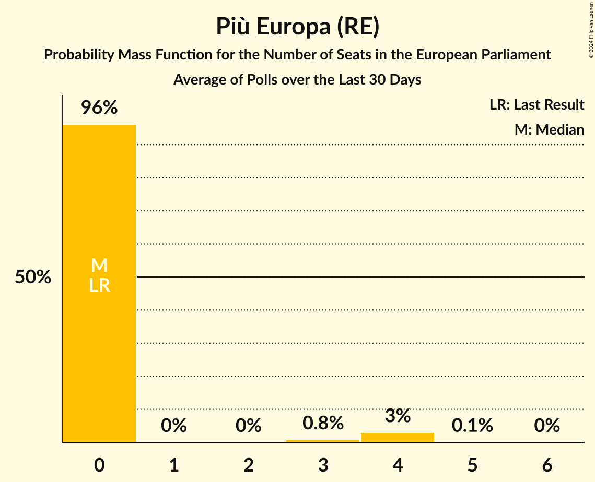

# Più Europa (RE)

<a href="#voting-intentions">Voting Intentions</a> | <a href="#seats">Seats</a>

## Voting Intentions

Last result: **0.0%** (General Election of 26 May 2019)

### Confidence Intervals

| Period     | Polling firm/Commissioner(s) | Median | 80% Confidence Interval | 90% Confidence Interval | 95% Confidence Interval | 99% Confidence Interval |
|:----------:|:----------------:|:-----------:|:-----------------------:|:-----------------------:|:-----------------------:|:-----------------------:|
| N/A | [Poll Average](average.html) | 2.7% | 1.8–3.8% | 1.5–4.1% | 1.3–4.4% | 1.0–4.9% |
| [29 July–2 August 2019](2019-08-02-TermometroPolitico.html) | Termometro Politico | 2.2% | 1.8–2.7% | 1.7–2.9% | 1.6–3.0% | 1.4–3.3% |
| [27–30 July 2019](2019-07-30-ScenariPolitici–Winpoll.html) | Scenari Politici–Winpoll   Il Sole 24 Ore | 2.3% | 1.8–2.9% | 1.7–3.0% | 1.6–3.2% | 1.4–3.5% |
| [24–29 July 2019](2019-07-29-SWG.html) | SWG   LA7 | 2.7% | 2.3–3.4% | 2.1–3.5% | 2.0–3.7% | 1.8–4.0% |
| [24–25 July 2019](2019-07-25-Tecnè.html) | Tecnè   Dire | 2.5% | 2.0–3.3% | 1.8–3.5% | 1.7–3.7% | 1.5–4.1% |
| [22–24 July 2019](2019-07-24-Demopolis.html) | Demopolis   LA7 | 0.0% | N/A | N/A | N/A | N/A |
| [17–22 July 2019](2019-07-22-SWG.html) | SWG   LA7 | 2.8% | 2.3–3.4% | 2.2–3.6% | 2.1–3.8% | 1.9–4.1% |
| [22 July 2019](2019-07-22-Euromedia.html) | Euromedia | 3.3% | 2.7–4.1% | 2.5–4.4% | 2.4–4.6% | 2.1–5.0% |
| [16–18 July 2019](2019-07-18-TermometroPolitico.html) | Termometro Politico | 2.1% | 1.7–2.7% | 1.5–2.8% | 1.4–3.0% | 1.3–3.3% |
| [17–18 July 2019](2019-07-18-Tecnè.html) | Tecnè   Rete 4 | 2.4% | 1.9–3.2% | 1.7–3.4% | 1.6–3.6% | 1.4–3.9% |
| [16–18 July 2019](2019-07-18-Ipsos.html) | Ipsos   Corriere della Sera | 3.5% | 2.9–4.4% | 2.7–4.6% | 2.5–4.8% | 2.2–5.3% |
| [15–18 July 2019](2019-07-18-GPF.html) | GPF   La Notizia | 2.5% | 2.0–3.3% | 1.8–3.5% | 1.7–3.7% | 1.4–4.2% |
| [10–15 July 2019](2019-07-15-SWG.html) | SWG   LA7 | 3.0% | 2.5–3.7% | 2.4–3.8% | 2.2–4.0% | 2.0–4.3% |
| [15 July 2019](2019-07-15-Piepoli.html) | Piepoli   Rai 1 | 0.0% | N/A | N/A | N/A | N/A |
| [9–12 July 2019](2019-07-12-TermometroPolitico.html) | Termometro Politico | 2.3% | 1.8–2.9% | 1.7–3.1% | 1.6–3.3% | 1.4–3.6% |
| [10–11 July 2019](2019-07-11-Tecnè.html) | Tecnè   Rete 4 | 2.3% | 1.8–3.0% | 1.6–3.2% | 1.5–3.4% | 1.3–3.8% |
| [8–10 July 2019](2019-07-10-GPF.html) | GPF   Rete 4 | 2.7% | 2.1–3.6% | 2.0–3.9% | 1.8–4.1% | 1.6–4.6% |
| [8–10 July 2019](2019-07-10-DemosPi.html) | Demos & Pi | 3.5% | 2.9–4.4% | 2.7–4.6% | 2.6–4.9% | 2.3–5.3% |
| [7–8 July 2019](2019-07-08-Tecnè.html) | Tecnè   Rete 4 | 0.0% | N/A | N/A | N/A | N/A |
| [3–8 July 2019](2019-07-08-SWG.html) | SWG   LA7 | 2.9% | 2.4–3.6% | 2.3–3.8% | 2.2–3.9% | 2.0–4.3% |
| [5 July 2019](2019-07-05-NotoSondaggi.html) | Noto Sondaggi   Quotidiano Nazionale | 1.5% | 1.1–2.1% | 1.0–2.3% | 0.9–2.5% | 0.7–2.8% |
| [1–4 July 2019](2019-07-04-TermometroPolitico.html) | Termometro Politico   LA7 | 1.8% | 1.5–2.3% | 1.4–2.5% | 1.3–2.6% | 1.1–2.8% |
| [29 June–4 July 2019](2019-07-04-BiDiMedia.html) | BiDiMedia | 2.7% | 2.3–3.3% | 2.1–3.5% | 2.0–3.6% | 1.8–3.9% |
| [26 June–1 July 2019](2019-07-01-SWG.html) | SWG   LA7 | 2.8% | 2.3–3.4% | 2.2–3.6% | 2.1–3.8% | 1.9–4.1% |
| [27 June 2019](2019-06-27-EMG.html) | EMG   Rai 3 | 2.9% | 2.4–3.4% | 2.3–3.6% | 2.2–3.7% | 2.0–4.0% |
| [1–26 June 2019](2019-06-26-NotoSondaggi.html) | Noto Sondaggi   Rai 3 | 2.0% | 1.5–2.7% | 1.4–2.9% | 1.3–3.1% | 1.1–3.4% |
| [25–26 June 2019](2019-06-26-Ipsos.html) | Ipsos   Corriere della Sera | 2.0% | 1.5–2.7% | 1.4–2.9% | 1.3–3.1% | 1.1–3.4% |
| [23–24 June 2019](2019-06-24-Tecnè.html) | Tecnè   Rete 4 | 0.0% | N/A | N/A | N/A | N/A |
| [19–24 June 2019](2019-06-24-SWG.html) | SWG   LA7 | 2.8% | 2.3–3.4% | 2.2–3.6% | 2.1–3.8% | 1.9–4.1% |
| [19–20 June 2019](2019-06-20-Demopolis.html) | Demopolis   LA7 | 0.0% | N/A | N/A | N/A | N/A |
| [1–18 June 2019](2019-06-18-NotoSondaggi.html) | Noto Sondaggi   Rai 3 | 2.5% | 2.0–3.3% | 1.8–3.5% | 1.7–3.7% | 1.5–4.1% |
| [18 June 2019](2019-06-18-EMG.html) | EMG   Rai 3 | 2.7% | 2.3–3.3% | 2.1–3.4% | 2.0–3.6% | 1.9–3.8% |
| [12–17 June 2019](2019-06-17-SWG.html) | SWG   LA7 | 2.7% | 2.3–3.4% | 2.1–3.5% | 2.0–3.7% | 1.8–4.0% |
| [13 June 2019](2019-06-13-IndexResearch.html) | Index Research   LA7 | 3.0% | 2.3–3.9% | 2.2–4.2% | 2.0–4.4% | 1.8–4.9% |
| [11 June 2019](2019-06-11-EMG.html) | EMG   Rai 3 | 2.5% | 2.1–3.0% | 1.9–3.2% | 1.8–3.3% | 1.7–3.6% |
| [9–10 June 2019](2019-06-10-Tecnè.html) | Tecnè   Rete 4 | 0.0% | N/A | N/A | N/A | N/A |
| [5–10 June 2019](2019-06-10-SWG.html) | SWG   LA7 | 2.8% | 2.3–3.4% | 2.2–3.6% | 2.1–3.8% | 1.9–4.1% |
| [10 June 2019](2019-06-10-Piepoli.html) | Piepoli   Rai 1 | 3.0% | 2.2–4.2% | 2.0–4.5% | 1.8–4.8% | 1.5–5.5% |
| [1–10 June 2019](2019-06-10-NotoSondaggi.html) | Noto Sondaggi   Rai 3 | 2.5% | 2.0–3.3% | 1.8–3.5% | 1.7–3.7% | 1.5–4.1% |
| [10 June 2019](2019-06-10-Euromedia.html) | Euromedia   Rai 1 | 3.5% | 2.8–4.5% | 2.6–4.8% | 2.4–5.0% | 2.1–5.5% |
| [1–7 June 2019](2019-06-07-IndexResearch.html) | Index Research   LA7 | 3.1% | 2.5–4.1% | 2.3–4.3% | 2.1–4.6% | 1.8–5.1% |
| [2–3 June 2019](2019-06-03-Tecnè.html) | Tecnè   Rete 4 | 0.0% | N/A | N/A | N/A | N/A |
| [29 May–3 June 2019](2019-06-03-SWG.html) | SWG   LA7 | 2.7% | 2.3–3.4% | 2.1–3.5% | 2.0–3.7% | 1.8–4.0% |
| [1 June 2019](2019-06-01-EMG.html) | EMG   Affari Internazionali | 3.0% | 2.5–3.6% | 2.4–3.8% | 2.3–4.0% | 2.1–4.3% |
| [30 May 2019](2019-05-30-Piepoli.html) | Piepoli   Rai 1 | 3.0% | 2.4–3.8% | 2.2–4.1% | 2.1–4.3% | 1.9–4.7% |
| [28–29 May 2019](2019-05-29-ScenariPolitici–Winpoll.html) | Scenari Politici–Winpoll | 2.7% | 2.3–3.4% | 2.1–3.5% | 2.0–3.7% | 1.8–4.0% |

### Probability Mass Function

The following table shows the probability mass function per percentage block of voting intentions for the [poll average](average.html) for Più Europa (RE).

| Voting Intentions | Probability | Accumulated | Special Marks |
|:-----------------:|:-----------:|:-----------:|:-------------:|
| 0.0–0.5% | 0% | 100% | Last Result |
| 0.5–1.5% | 6% | 100% |  |
| 1.5–2.5% | 36% | 94% |  |
| 2.5–3.5% | 42% | 58% | Median |
| 3.5–4.5% | 14% | 16% |  |
| 4.5–5.5% | 1.5% | 2% |  |
| 5.5–6.5% | 0% | 0% |  |
| 6.5–7.5% | 0% | 0% |  |

## Seats

Last result: **0** seats (General Election of 26 May 2019)

### Confidence Intervals

| Period     | Polling firm/Commissioner(s) | Median | 80% Confidence Interval | 90% Confidence Interval | 95% Confidence Interval | 99% Confidence Interval |
|:----------:|:----------------:|:------:|:-----------------------:|:-----------------------:|:-----------------------:|:-----------------------:|
| N/A | [Poll Average](average.html) | 0 | 0 | 0–3 | 0–3 | 0–4 |
| [29 July–2 August 2019](2019-08-02-TermometroPolitico.html) | Termometro Politico | 0 | 0 | 0 | 0 | 0 |
| [27–30 July 2019](2019-07-30-ScenariPolitici–Winpoll.html) | Scenari Politici–Winpoll   Il Sole 24 Ore | 0 | 0 | 0 | 0 | 0 |
| [24–29 July 2019](2019-07-29-SWG.html) | SWG   LA7 | 0 | 0 | 0 | 0 | 0 |
| [24–25 July 2019](2019-07-25-Tecnè.html) | Tecnè   Dire | 0 | 0 | 0 | 0 | 0–3 |
| [22–24 July 2019](2019-07-24-Demopolis.html) | Demopolis   LA7 |  |  |  |  |  |
| [17–22 July 2019](2019-07-22-SWG.html) | SWG   LA7 | 0 | 0 | 0 | 0 | 0–3 |
| [22 July 2019](2019-07-22-Euromedia.html) | Euromedia | 0 | 0–3 | 0–3 | 0–3 | 0–4 |
| [16–18 July 2019](2019-07-18-TermometroPolitico.html) | Termometro Politico | 0 | 0 | 0 | 0 | 0 |
| [17–18 July 2019](2019-07-18-Tecnè.html) | Tecnè   Rete 4 | 0 | 0 | 0 | 0 | 0 |
| [16–18 July 2019](2019-07-18-Ipsos.html) | Ipsos   Corriere della Sera | 0 | 0–3 | 0–3 | 0–4 | 0–4 |
| [15–18 July 2019](2019-07-18-GPF.html) | GPF   La Notizia | 0 | 0 | 0 | 0 | 0–3 |
| [10–15 July 2019](2019-07-15-SWG.html) | SWG   LA7 | 0 | 0 | 0 | 0–3 | 0–3 |
| [15 July 2019](2019-07-15-Piepoli.html) | Piepoli   Rai 1 |  |  |  |  |  |
| [9–12 July 2019](2019-07-12-TermometroPolitico.html) | Termometro Politico | 0 | 0 | 0 | 0 | 0 |
| [10–11 July 2019](2019-07-11-Tecnè.html) | Tecnè   Rete 4 | 0 | 0 | 0 | 0 | 0 |
| [8–10 July 2019](2019-07-10-GPF.html) | GPF   Rete 4 | 0 | 0 | 0 | 0–3 | 0–3 |
| [8–10 July 2019](2019-07-10-DemosPi.html) | Demos & Pi | 0 | 0–3 | 0–3 | 0–4 | 0–4 |
| [7–8 July 2019](2019-07-08-Tecnè.html) | Tecnè   Rete 4 |  |  |  |  |  |
| [3–8 July 2019](2019-07-08-SWG.html) | SWG   LA7 | 0 | 0 | 0 | 0 | 0–3 |
| [5 July 2019](2019-07-05-NotoSondaggi.html) | Noto Sondaggi   Quotidiano Nazionale | 0 | 0 | 0 | 0 | 0 |
| [1–4 July 2019](2019-07-04-TermometroPolitico.html) | Termometro Politico   LA7 | 0 | 0 | 0 | 0 | 0 |
| [29 June–4 July 2019](2019-07-04-BiDiMedia.html) | BiDiMedia | 0 | 0 | 0 | 0 | 0 |
| [26 June–1 July 2019](2019-07-01-SWG.html) | SWG   LA7 | 0 | 0 | 0 | 0 | 0–3 |
| [27 June 2019](2019-06-27-EMG.html) | EMG   Rai 3 | 0 | 0 | 0 | 0 | 0–3 |
| [1–26 June 2019](2019-06-26-NotoSondaggi.html) | Noto Sondaggi   Rai 3 | 0 | 0 | 0 | 0 | 0 |
| [25–26 June 2019](2019-06-26-Ipsos.html) | Ipsos   Corriere della Sera | 0 | 0 | 0 | 0 | 0 |
| [23–24 June 2019](2019-06-24-Tecnè.html) | Tecnè   Rete 4 |  |  |  |  |  |
| [19–24 June 2019](2019-06-24-SWG.html) | SWG   LA7 | 0 | 0 | 0 | 0 | 0–3 |
| [19–20 June 2019](2019-06-20-Demopolis.html) | Demopolis   LA7 |  |  |  |  |  |
| [1–18 June 2019](2019-06-18-NotoSondaggi.html) | Noto Sondaggi   Rai 3 | 0 | 0 | 0 | 0 | 0–3 |
| [18 June 2019](2019-06-18-EMG.html) | EMG   Rai 3 | 0 | 0 | 0 | 0 | 0 |
| [12–17 June 2019](2019-06-17-SWG.html) | SWG   LA7 | 0 | 0 | 0 | 0 | 0 |
| [13 June 2019](2019-06-13-IndexResearch.html) | Index Research   LA7 | 0 | 0 | 0–3 | 0–3 | 0–4 |
| [11 June 2019](2019-06-11-EMG.html) | EMG   Rai 3 | 0 | 0 | 0 | 0 | 0 |
| [9–10 June 2019](2019-06-10-Tecnè.html) | Tecnè   Rete 4 |  |  |  |  |  |
| [5–10 June 2019](2019-06-10-SWG.html) | SWG   LA7 | 0 | 0 | 0 | 0 | 0–3 |
| [10 June 2019](2019-06-10-Piepoli.html) | Piepoli   Rai 1 | 0 | 0–3 | 0–3 | 0–4 | 0–4 |
| [1–10 June 2019](2019-06-10-NotoSondaggi.html) | Noto Sondaggi   Rai 3 | 0 | 0 | 0 | 0 | 0 |
| [10 June 2019](2019-06-10-Euromedia.html) | Euromedia   Rai 1 | 0 | 0–3 | 0–4 | 0–4 | 0–4 |
| [1–7 June 2019](2019-06-07-IndexResearch.html) | Index Research   LA7 | 0 | 0–3 | 0–3 | 0–3 | 0–4 |
| [2–3 June 2019](2019-06-03-Tecnè.html) | Tecnè   Rete 4 |  |  |  |  |  |
| [29 May–3 June 2019](2019-06-03-SWG.html) | SWG   LA7 | 0 | 0 | 0 | 0 | 0–3 |
| [1 June 2019](2019-06-01-EMG.html) | EMG   Affari Internazionali | 0 | 0 | 0 | 0 | 0–3 |
| [30 May 2019](2019-05-30-Piepoli.html) | Piepoli   Rai 1 | 0 | 0 | 0–3 | 0–3 | 0–3 |
| [28–29 May 2019](2019-05-29-ScenariPolitici–Winpoll.html) | Scenari Politici–Winpoll | 0 | 0 | 0 | 0 | 0–3 |

### Probability Mass Function

The following table shows the probability mass function per seat for the [poll average](average.html) for Più Europa (RE).

| Number of Seats | Probability | Accumulated | Special Marks |
|:---------------:|:-----------:|:-----------:|:-------------:|
| 0 | 94% | 100% | Last Result, Median |
| 1 | 0% | 6% |  |
| 2 | 0% | 6% |  |
| 3 | 5% | 6% |  |
| 4 | 0.9% | 0.9% |  |
| 5 | 0% | 0% |  |

